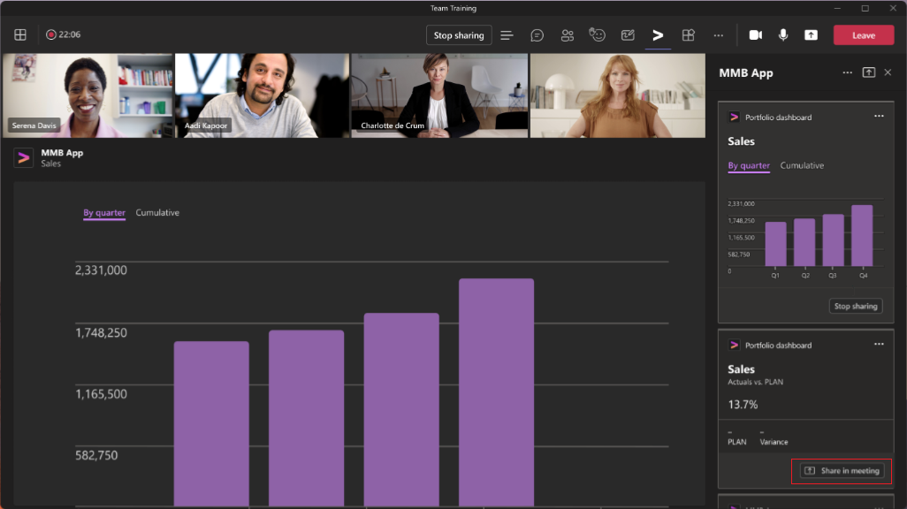

# <a name="enable-and-configure-your-apps-for-teams-meetings"></a>Aktivieren und Konfigurieren Ihrer Apps für Teams-Besprechungen

Jedes Team hat eine andere Art, zu kommunizieren und Aufgaben gemeinsam zu erledigen. Um diese verschiedenen Aufgaben zu erfüllen, passen Sie Teams mit Apps für Besprechungen an. Aktivieren Sie Ihre Apps für Teams-Besprechungen, und konfigurieren Sie die Apps so, dass sie im Besprechungsbereich innerhalb ihres App-Manifests verfügbar sind.

## <a name="prerequisites"></a>Voraussetzungen

Mit Apps für Teams-Besprechungen können Sie die Funktionen Ihrer Apps über den gesamten Besprechungslebenszyklus erweitern. Bevor Sie mit Apps für Teams-Besprechungen arbeiten, müssen Sie die folgenden Voraussetzungen erfüllen:

* Erfahren Sie, wie Sie Teams-Apps entwickeln. Weitere Informationen zum Entwickeln von Teams-Apps finden Sie unter [Teams-App-Entwicklung](../overview.md).

* Verwenden Sie Ihre App, die konfigurierbare Registerkarten im Gruppenchatbereich unterstützt. Weitere Informationen finden Sie unter [Gruppenchatbereich](../resources/schema/manifest-schema.md#configurabletabs) und [Erstellen einer Gruppenregisterkarte](../build-your-first-app/build-channel-tab.md).

* Halten Sie sich an die allgemeinen [Entwurfsrichtlinien für Teams-Registerkarten](../tabs/design/tabs.md) für Szenarien vor und nach der Besprechung. Informationen über Erfahrungen während Besprechungen finden Sie in den Entwurfsrichtlinien für [besprechungsinterne Registerkarten](../apps-in-teams-meetings/design/designing-apps-in-meetings.md#use-an-in-meeting-tab) und [besprechungsinternes Design](../apps-in-teams-meetings/design/designing-apps-in-meetings.md#use-an-in-meeting-dialog).

* Damit Ihre App in Echtzeit aktualisiert werden kann, muss sie basierend auf den Ereignisaktivitäten in der Besprechung auf dem neuesten Stand sein. Diese Ereignisse können sich innerhalb des besprechungsinternen Dialogfelds und in anderen Phasen des Besprechungslebenszyklus befinden. Informationen zum besprechungsinternen Dialogfeld finden Sie unter dem `completionBotId`-Parameter in [besprechungsinterne Benachrichtigungsnutzdaten](API-references.md#send-an-in-meeting-notification).

## <a name="enable-your-app-for-teams-meetings"></a>Aktivieren Ihrer App für Teams-Besprechungen

Um Ihre App für Teams-Besprechungen zu aktivieren, aktualisieren Sie Ihr App-Manifest, und verwenden Sie die Kontexteigenschaften, um zu bestimmen, wo Ihre App angezeigt werden muss.

### <a name="update-your-app-manifest"></a>Aktualisieren Ihres App-Manifests

Die Funktionen der Besprechungs-App werden in Ihrem App-Manifest mithilfe der Arrays `configurableTabs`, `scopes` und `context` deklariert. Der Bereich definiert, wer zugreifen kann, und der Kontext definiert, wo Ihre App verfügbar ist.

> [!NOTE]
>
> * Apps in Besprechungen erfordern einen `groupchat`-Bereich. Der `team`-Bereich funktioniert nur für Registerkarten in Kanälen.
> * Apps in Besprechungen können die folgenden Kontexte verwenden: `meetingChatTab`, `meetingDetailsTab`, `meetingSidePanel` und `meetingStage`.

Der folgende Codeausschnitt ist ein Beispiel für eine konfigurierbare Registerkarte, die in einer App für Teams Besprechungen verwendet wird:

```json

"configurableTabs": [
    {
      "configurationUrl": "https://contoso.com/teamstab/configure",
      "canUpdateConfiguration": true,
      "scopes": [
        "team",
        "groupchat"
      ],
      "context":[
        "channelTab",
        "privateChatTab",
        "meetingChatTab",
        "meetingDetailsTab",
        "meetingSidePanel",
        "meetingStage"
     ]
    }
  ]
```

### <a name="context-property"></a>Context-Eigenschaft

Die `context`-Eigenschaft der Registerkarte bestimmt, was angezeigt werden muss, wenn ein Benutzer eine App in einer Besprechung aufruft, je nachdem, wo er die App aufruft. Mithilfe der Eigenschaften `context` und `scopes` der Registerkarte können Sie bestimmen, wo Ihre App angezeigt werden muss. Die Registerkarten im Bereich `team` oder `groupchat` können mehr als einen Kontext aufweisen.

Unterstützen Sie den Bereich `groupchat`, um Ihre App in Chats vor und nach der Besprechung zu aktivieren. Mit der App-Erfahrung vor der Besprechung können Sie Besprechungs-Apps suchen und hinzufügen und die Aufgaben vor der Besprechung ausführen. Mit der App-Erfahrung nach der Besprechung können Sie die Ergebnisse der Besprechung anzeigen, z. B. Umfrageergebnisse oder Gebühren.

 Im Folgenden finden Sie die Werte für die Eigenschaft `context`, aus der Sie alle oder einige der Werte verwenden können:

|Wert|Beschreibung|
|---|---|
| **channelTab** | Eine Registerkarte in der Kopfzeile eines Teamkanals. |
| **privateChatTab** | Eine Registerkarte in der Kopfzeile eines Gruppenchats zwischen einer Gruppe von Benutzern, nicht im Kontext eines Teams oder einer Besprechung. |
| **meetingChatTab** | Eine Registerkarte in der Kopfzeile eines Gruppenchats zwischen einer Gruppe von Benutzern für eine geplante Besprechung. Sie können entweder **meetingChatTab** oder **meetingDetailsTab** angeben, um sicherzustellen, dass die Apps auf Mobilgeräten funktionieren. |
| **meetingDetailsTab** | Eine Registerkarte in der Kopfzeile der Ansicht der Besprechungsdetails des Kalenders. Sie können entweder **meetingChatTab** oder **meetingDetailsTab** angeben, um sicherzustellen, dass die Apps auf Mobilgeräten funktionieren. |
| **meetingSidePanel** | Ein besprechungsinterner Bereich, der über die einheitliche Leiste (U-Leiste) geöffnet wird. |
| **meetingStage** | Eine App aus dem `meetingSidePanel` kann im Freigabefenster angezeigt werden. Sie können diese App weder auf mobilen noch auf Microsoft Teams-Raum-Clients verwenden. |

Nachdem Sie Ihre App für Teams-Besprechungen aktiviert haben, müssen Sie Ihre App vor einer Besprechung, während einer Besprechung und nach einer Besprechung konfigurieren.

## <a name="configure-your-app-for-meeting-scenarios"></a>Konfigurieren Ihrer App für Besprechungsszenarien

Teams-Besprechungen bieten eine gemeinschaftliche Erfahrung für Ihre Organisation. Konfigurieren Sie Ihre App für verschiedene Besprechungsszenarien, um die Besprechungserfahrung zu verbessern. Nun können Sie ermitteln, welche Aktionen in den folgenden Besprechungsszenarien ausgeführt werden können:

* [Vor einer Besprechung](#before-a-meeting)
* [Während einer Besprechung](#during-a-meeting)
* [Nach einer Besprechung](#after-a-meeting)

### <a name="before-a-meeting"></a>Vor einer Besprechung

Vor einer Besprechung können Benutzer Registerkarten, Bots und Nachrichtenerweiterungen hinzufügen. Benutzer mit Organisator- und Referentenrollen können einer Besprechung Registerkarten hinzufügen.

So fügen Sie einer Besprechung eine Registerkarte hinzu:

1. Wählen Sie in Ihrem Kalender eine Besprechung aus, der Sie eine Registerkarte hinzufügen möchten.
1. Wählen Sie die Registerkarte **Details** aus, und wählen Sie .

    

1. Wählen Sie im angezeigten Registerkartenkatalog die App aus, die Sie hinzufügen möchten, und führen Sie die erforderlichen Schritte aus. Die App wird als Registerkarte installiert.

So fügen Sie einer Besprechung eine Nachrichtenerweiterung hinzu:

1. Wählen Sie die Auslassungspunkte &#x25CF;&#x25CF;&#x25CF; aus, die sich im Bereich „Nachricht verfassen“ im Chat befinden.
1. Wählen Sie die App aus, die Sie hinzufügen möchten, und führen Sie die erforderlichen Schritte aus. Die App wird als Nachrichtenerweiterung installiert.

So fügen Sie einer Besprechung einen Bot hinzu:

Geben Sie in einem Besprechungschat den Schlüssel **@** ein, und wählen Sie **Bots abrufen** aus.

> [!NOTE]
>
> * Das besprechungsinterne Dialogfeld zeigt ein Dialogfeld in einer Besprechung an und postet gleichzeitig eine adaptive Karte im Besprechungschat, auf die Benutzer zugreifen können. Die adaptive Karte im Besprechungschat hilft Benutzern während der Teilnahme an der Besprechung, oder wenn die Teams-App minimiert ist.
> * Die Benutzeridentität muss mit den [SSO-Registerkarten](../tabs/how-to/authentication/tab-sso-overview.md) bestätigt werden. Nach der Authentifizierung kann die App die Benutzerrolle mithilfe der `GetParticipant`-API abrufen.
> * Basierend auf der Benutzerrolle kann die App rollenspezifische Erfahrungen bieten. Beispielsweise ermöglicht eine Umfrage-App nur Organisatoren und Referenten das Erstellen einer neuen Umfrage.
> * Rollenzuweisungen können geändert werden, während eine Besprechung ausgeführt wird. Weitere Informationen finden Sie unter [Rollen in einer Teams-Besprechung](https://support.microsoft.com/office/roles-in-a-teams-meeting-c16fa7d0-1666-4dde-8686-0a0bfe16e019).

### <a name="during-a-meeting"></a>Während einer Besprechung

Während einer Besprechung können Sie die `meetingSidePanel` oder die besprechungsinterne Benachrichtigung verwenden, um einzigartige Erfahrungen für Ihre Apps zu erstellen.

#### <a name="meeting-sidepanel"></a>Besprechungsseitenbereich

Mit dem `meetingSidePanel` können Sie Erfahrungen in einer Besprechung anpassen, die es Organisatoren und Referenten ermöglichen, einen unterschiedlichen Satz von Ansichten und Aktionen zu haben. In Ihrem App-Manifest müssen Sie dem Kontextarray `meetingSidePanel` hinzufügen. In der Besprechung und in allen Szenarien wird die App auf einer besprechungsinterne Registerkarte mit einer Breite von 320 Pixel gerendert. Weitere Informationen finden Sie unter [FrameContext-Schnittstelle](/javascript/api/@microsoft/teams-js/microsoftteams.framecontext?view=msteams-client-js-latest&preserve-view=true).

Informationen zur Verwendung der `userContext`-API zum Weiterleiten von Anforderungen finden Sie unter [Teams-SDK](../tabs/how-to/access-teams-context.md#user-context). Weitere Informationen finden Sie unter [Teams-Authentifizierungsablauf für Registerkarten](../tabs/how-to/authentication/auth-flow-tab.md). Der Authentifizierungsablauf für Registerkarten ähnelt dem Authentifizierungsfluss für Websites. Registerkarten können OAuth 2.0 also direkt verwenden. Weitere Informationen finden Sie unter [Microsoft-Identitätsplattform und OAuth 2.0-Autorisierungscodefluss](/azure/active-directory/develop/v2-oauth2-auth-code-flow).

Die Nachrichtenerweiterung funktioniert erwartungsgemäß, wenn sich ein Benutzer in einer besprechungsinternen Ansicht befindet. Der Benutzer kann Erweiterungskarten zum Verfassen von Nachrichten posten. AppName in der Besprechung ist eine QuickInfo, die den App-Namen in der besprechungsinternen U-Leiste angibt.

> [!NOTE]
> Verwenden Sie die Version 1.7.0 oder höher von [Teams-SDK](/javascript/api/overview/msteams-client?view=msteams-client-js-latest&preserve-view=true), da frühere Versionen den Seitenbereich nicht unterstützen.

#### <a name="in-meeting-notification"></a>Besprechungsinterne Benachrichtigung

Die besprechungsinterne Benachrichtigung wird verwendet, um Teilnehmer während der Besprechung einzubeziehen und während der Besprechung Informationen oder Feedback zu sammeln. Verwenden Sie [besprechungsinterne Benachrichtigungsnutzdaten](API-references.md#send-an-in-meeting-notification), um eine besprechungsinterne Benachrichtigung auszulösen. Fügen Sie als Teil der Nutzdaten der Benachrichtigungsanforderung die URL ein, unter welcher der anzuzeigende Inhalt gehostet wird.

Besprechungsinterne Benachrichtigungen dürfen kein Aufgabenmodul verwenden. Das Aufgabenmodul wird nicht in einem Besprechungschat aufgerufen. Eine externe Ressourcen-URL wird verwendet, um besprechungsinterne Benachrichtigungen anzuzeigen. Sie können die Methode `submitTask` verwenden, um Daten in einem Besprechungschat zu übermitteln.

:::image type="content" source="../assets/images/apps-in-meetings/in-meeting-dialogbox.png" alt-text="Beispiel zeigt, wie Sie ein besprechungsinternes Dialogfeld verwenden können." border="true":::

#### <a name="shared-meeting-stage"></a>Freigegebenes Besprechungsfreigabefenster

Das geteilte Freigabefenster ermöglicht Besprechungsteilnehmern die Interaktion mit und die Zusammenarbeit an App-Inhalten in Echtzeit. Sie können Ihre Apps auf folgende Weise für das gemeinschaftliche Freigabefenster freigeben:

* [Freigabe der gesamten App für das Freigabefenster](#share-entire-app-to-stage) mithilfe der Schaltfläche „Freigabe für Freigabefenster“ im Teams-Client.
* [Freigabe bestimmter Teile der App für das Freigabefenster](#share-specific-parts-of-the-app-to-stage) mithilfe von APIs im Teams-Client-SDK.

##### <a name="share-entire-app-to-stage"></a>Freigeben der gesamten App für das Freigabefenster

Teilnehmer können die gesamte App mithilfe der Schaltfläche „Freigabe für Freigabefenster“ im App-Seitenbereich für das gemeinschaftliche Freigabefenster freigeben.


Um die gesamte App für das Freigabefenster freizugeben, müssen Sie im App-Manifest `meetingStage` und `meetingSidePanel` als Framekontexte konfigurieren. Beispiel:

```json
"configurableTabs": [
    {
      "configurationUrl": "https://contoso.com/teamstab/configure",
      "canUpdateConfiguration": true,
      "scopes": [
        "groupchat"
      ],
      "context":[
        "meetingSidePanel",
        "meetingStage"
     ]
    }
  ]
```

Weitere Informationen finden Sie unter [App-Manifest](../resources/schema/manifest-schema-dev-preview.md#configurabletabs).

##### <a name="share-specific-parts-of-the-app-to-stage"></a>Freigeben bestimmter Teile der App für das Freigabefenster.

Teilnehmer können bestimmte Teile der App für das gemeinschaftliche Freigabefenster freigeben, indem sie das Freigabefenster zum Bereitstellen von APIs verwenden. Die APIs sind im Teams-Client-SDK verfügbar und werden über den App-Seitenbereich aufgerufen.



Um bestimmte Teile der App für das Freigabefenster freizugeben, müssen Sie die zugehörigen APIs in der Teams-Client-SDK-Bibliothek aufrufen. Weitere Informationen finden Sie unter [API-Referenz](API-references.md).

> [!NOTE]
>
> * Verwenden Sie die Teams-Manifestversion 1.12 oder höher, um bestimmte Teile der App für das Freigabefenster freizugeben.
> * Das Freigeben bestimmter Teile der App für das Freigabefenster wird nur für Teams-Desktopclients unterstützt.

### <a name="after-a-meeting"></a>Nach einer Besprechung

Die Konfigurationen für nach und [vor Besprechungen](#before-a-meeting) sind identisch.

## <a name="code-sample"></a>Codebeispiel

|Beispielname | Beschreibung | C# | Node.js |
|----------------|-----------------|--------------|----------------|
| Besprechungs-App | Veranschaulicht, wie die Generator-App für Besprechungstoken verwendet wird, um ein Token anzufordern. Das Token wird sequenziell generiert, sodass jeder Teilnehmer eine angemessene Gelegenheit hat, in einer Besprechung mitzuwirken. Das Token ist in Situationen wie Scrum-Besprechungen und Q&A-Sitzungen nützlich. | [View](https://github.com/OfficeDev/Microsoft-Teams-Samples/tree/main/samples/meetings-token-app/csharp) | [Anzeigen](https://github.com/OfficeDev/Microsoft-Teams-Samples/tree/main/samples/meetings-token-app/nodejs) |
|Beispiel für Freigabefenster | Beispiel-App zum Anzeigen einer Registerkarte im Freigabefenster für die Zusammenarbeit | [View](https://github.com/OfficeDev/Microsoft-Teams-Samples/tree/main/samples/meetings-stage-view/csharp) | [View](https://github.com/OfficeDev/Microsoft-Teams-Samples/tree/main/samples/meetings-stage-view/nodejs) |
|Besprechungsseitenbereich | Beispiel-App zum zeigen, wie eine Agenda in einem Besprechungsseitenbereich hinzugefügt wird | [Anzeigen](https://github.com/OfficeDev/Microsoft-Teams-Samples/tree/main/samples/meetings-sidepanel/csharp) |-|

## <a name="step-by-step-guides"></a>Schritt-für-Schritt-Anleitungen

* Befolgen Sie die [Schritt-für-Schritt-Anleitung](../sbs-meeting-token-generator.yml), um in Ihrer Teams-Besprechung Besprechungstoken zu generieren.
* Befolgen Sie die [Schritt-für-Schritt-Anleitung](../sbs-meetings-sidepanel.yml), um in Ihrer Teams-Besprechung einen Besprechungsseitenbereich zu generieren.
* Befolgen Sie die [Schritt-für-Schritt-Anleitung](../sbs-meetings-stage-view.yml), um in Ihrer Teams-Besprechung die Freigabefensteransicht freizugeben.
* Befolgen Sie die [Schritt-für-Schritt-Anleitung](../sbs-meeting-content-bubble.yml), um in Ihrer Teams-Besprechung eine Besprechungsinhaltsblase zu generieren.

## <a name="next-step"></a>Nächster Schritt

> [!div class="nextstepaction"]
> [API-Referenzen für Besprechungs-Apps](API-references.md)

## <a name="see-also"></a>Siehe auch

* [Entwurfsrichtlinien für besprechungsinternes Dialogfeld](design/designing-apps-in-meetings.md#use-an-in-meeting-dialog)
* [Teams-Authentifizierungsablauf für Registerkarten](../tabs/how-to/authentication/auth-flow-tab.md)
* [Entwurfsrichtlinien für die Erfahrung geteilter Freigabefenster](~/apps-in-teams-meetings/design/designing-apps-in-meetings.md)
* [Apps über Microsoft Graph zu Besprechungen hinzufügen](/graph/api/chat-post-installedapps?view=graph-rest-1.0&tabs=http&preserve-view=true)
