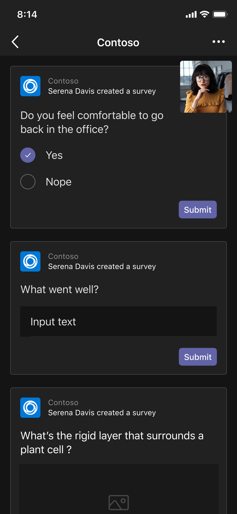

# Einheitliche Besprechungs-Apps

Teams einheitlichen Besprechungs-Apps basieren auf den folgenden Konzepten:

* Der Besprechungslebenszyklus besteht aus verschiedenen Phasen mit entsprechenden Freigabefenstern: vor der Besprechung, in der Besprechung und nach der Besprechung.  
* Es gibt drei verschiedene Teilnehmerrollen in einer Besprechung: Organisator, Referent und Teilnehmer. Weitere Informationen finden Sie [unter Rollen in einer Teams Besprechung](https://support.microsoft.com/office/roles-in-a-teams-meeting-c16fa7d0-1666-4dde-8686-0a0bfe16e019).  
* Es gibt verschiedene [Benutzertypen](/microsoftteams/non-standard-users#:~:text=An%20anonymous%20user%20is%20a,their%20Microsoft%20or%20organization's%20account.) in einer Besprechung: Mandantenspezifische, [Gast](/microsoftteams/guest-access)-, [Verbund](/microsoftteams/manage-external-access)- und anonyme Benutzer.

In diesem Artikel werden die Informationen zum Lebenszyklus von Besprechungen und zum Integrieren von Registerkarten, Bots und Messaging-Erweiterungen behandelt. Es identifiziert verschiedene Teilnehmerrollen und Benutzertypen.

## Der Besprechungslebenszyklus

Den Phasen des Besprechungslebenszyklus entsprechen in der App drei Umgebungen: vor der Besprechung, in der Besprechung und nach der Besprechung. Sie können Registerkarten, Bots und Messaging-Erweiterungen in jedes der Freigabefenster des Besprechungslebenszyklus integrieren.

> [!NOTE]
> Besprechungserweiterungen wie Bots, Karten, Nachrichtenerweiterungen und Nachrichtenaktionen werden im Webclient unterstützt. Gehostete Benutzeroberflächen wie Registerkarten, Inhaltsblasen und Freigabe für Die Stufe werden derzeit jedoch nicht vollständig unterstützt.

### Integrieren von Registerkarten in den Besprechungslebenszyklus

Registerkarten ermöglichen es Teammitgliedern, auf Dienste und Inhalte in einem bestimmten Bereich innerhalb einer Besprechung zuzugreifen. Das Team arbeitet direkt mit Registerkarten und unterhält sich über die Tools und Daten, die auf den Registerkarten verfügbar sind. In Teams Besprechung können Sie eine Registerkarte hinzufügen, indem Sie aus, und wählen Sie die App aus, die Sie installieren möchten.

> [!IMPORTANT]
> Wenn Sie eine Registerkarte in Ihre Besprechung integriert haben, muss Ihre App den Teams [SSO-Authentifizierungsfluss (Single Sign-On, einmaliges Anmelden) für Registerkarten](../tabs/how-to/authentication/auth-aad-sso.md) befolgen.

> [!NOTE]
>
> * Die privaten geplanten Besprechungen unterstützen nur Apps.
> * Add app option for Teams meeting extension tab app is not supported in Teams web client.

#### Pre-Meeting-App-Umgebung

Über die Pre-Meeting-App-Umgebung können Sie Besprechungs-Apps suchen und hinzufügen. Sie können auch im Vorfeld der Besprechung Dinge erledigen wie z. B. eine Umfrage erstellen, um die Besprechungsteilnehmer über etwas zu befragen.

So fügen Sie einer vorhandenen Besprechung Registerkarten hinzu:

1. Wählen Sie in Ihrem Kalender eine Besprechung aus, der Sie eine Registerkarte hinzufügen möchten.
1. Wählen Sie die Registerkarte " **Details** " und dann . Der Registerkartenkatalog wird angezeigt.

    :::image type="content" source="~/assets/images/apps-in-meetings/Pre-Meeting-002.png" alt-text="Pre-Meeting-App-Umgebung":::

1. Wählen Sie im Registerkartenkatalog die App aus, die Sie hinzufügen möchten, und führen Sie die erforderlichen Schritte aus. Die App wird als Registerkarte installiert.

   > [!NOTE]
   >
   > * Sie können einer vorhandenen Besprechung auch eine Registerkarte hinzufügen, indem Sie die Registerkarte " **Besprechungschat** " verwenden.
   > * Das Registerkartenlayout muss sich in einem organisierten Zustand befinden, wenn mehr als 10 Umfragen vorhanden sind.

# [Desktop](#tab/desktop)

:::image type="content" source="~/assets/images/apps-in-meetings/PreMeetingTab.png" alt-text="Registerkarten während einer Besprechung":::

# [Mobil](#tab/mobile)

Nachdem Sie die Registerkarten zu einer vorhandenen Besprechung auf mobilgeräten hinzugefügt haben, können Sie dieselben Apps in der Pre-Meeting-Erfahrung unter **"Weitere** " der Besprechungsdetails sehen.

  

---

#### In-Meeting-App-Umgebung

Über die In-Meeting-App-Umgebung können Sie während der Besprechung mithilfe von Apps und dem Dialogfeld die Teilnehmer einbeziehen. Die Besprechungs-Apps werden auf der Symbolleiste des Besprechungsfensters als Registerkarten in der Besprechung gehostet. Im Dialogfeld in der Besprechung können Aktionen erfordernde Inhalte für Besprechungsteilnehmer angezeigt werden. Weitere Informationen finden Sie unter [Aktivieren und Konfigurieren Ihrer Apps für Teams Besprechungen](enable-and-configure-your-app-for-teams-meetings.md).

Für mobile Apps sind Besprechungs-Apps über **Apps** > Auslassungszeichen &#x25CF;&#x25CF;&#x25CF; in der Besprechung verfügbar. Wählen Sie **"Apps** " aus, um alle in der Besprechung verfügbaren Apps anzuzeigen.

So verwenden Sie Registerkarten während einer Besprechung:

1. Wechseln Sie zu Teams.
1. Wählen Sie in Ihrem Kalender eine Besprechung aus, in der Sie eine Registerkarte verwenden möchten.
1. Nachdem Sie die Besprechung betreten haben, wählen Sie auf der Symbolleiste des Chatfensters die erforderliche App aus.
    Eine App ist in einer Teams Besprechung im Seitenbereich oder im Dialogfeld "Besprechung in der Besprechung" sichtbar.
1. Geben Sie im Dialogfeld "Besprechung" Ihre Antwort als Feedback ein.

# [Desktop](#tab/desktop)

:::image type="content" source="~/assets/images/apps-in-meetings/desktop-in-meeting-dialog-view.png" alt-text="Desktopansicht":::

# [Mobil](#tab/mobile)

Nachdem Sie die Besprechung betreten und die App über den Desktop oder das Web hinzugefügt haben, ist die App in mobiler Teams Besprechung im Abschnitt **"Apps**" sichtbar. Wählen Sie **"Apps** " aus, um die Liste der Apps anzuzeigen. Benutzer können jede der Apps als Besprechungsseite der App starten.

Das Dialogfeld "In der Besprechung" wird angezeigt, in dem Sie Ihre Antwort als Feedback eingeben können.

> [!NOTE]
> Sie müssen das App-Manifest nicht ändern, damit die Apps auf mobilgeräten funktionieren.

---

> [!NOTE]
>
> * Apps können das Teams Client SDK nutzen, um auf das `meetingId``userMri`Client-SDK zuzugreifen und `frameContext` die Benutzeroberfläche entsprechend zu rendern.
> * Wenn das Dialogfeld in der Besprechung erfolgreich gerendert wird, wird eine Benachrichtigung gesendet, dass die Ergebnisse erfolgreich heruntergeladen wurden.
> * Ihr App-Manifest gibt die Orte an, an denen die Apps angezeigt werden sollen. Dies kann durch Angeben des Kontextfelds im Manifest erfolgen. Sie ist auch Teil einer Freigabe-Besprechungsphase, die den [angegebenen Entwurfsrichtlinien](~\apps-in-teams-meetings\design\designing-apps-in-meetings.md) unterliegt.
> * Die Besprechungsphase wird für anonyme Benutzer und Teams Webclient nicht unterstützt.

Die folgende Abbildung veranschaulicht den Besprechungsseitenbereich:

# [Desktop](#tab/desktop)

# [Mobil](#tab/mobile)

---

In der folgenden Tabelle wird das Verhalten der App beschrieben, wenn sie überprüft und nicht überprüft wird:

|App-Funktion | Die App wird überprüft. | Die App wurde nicht überprüft. |
|---|---|---|
| Erweiterbarkeit von Besprechungen | Die App wird in Besprechungen angezeigt. | Die App wird nicht in Besprechungen für die mobilen Clients angezeigt. |

Weitere Informationen finden Sie in den [Richtlinien für die Speicherüberprüfung](../concepts/deploy-and-publish/appsource/prepare/teams-store-validation-guidelines.md).

#### App-Erfahrung nach der Besprechung

Mit der App-Erfahrung nach der Besprechung können Sie die Ergebnisse der Besprechung anzeigen, z. B. Umfrageergebnisse oder Feedback. Auswählen  um eine Registerkarte hinzuzufügen, Besprechungsnotizen abzurufen und die Ergebnisse anzuzeigen, in denen Organisatoren und Teilnehmer Maßnahmen ergreifen müssen.

In der folgenden Abbildung wird die Registerkarte **"Contoso** " mit Ergebnissen der Umfrage und des Feedbacks angezeigt, die von den Besprechungsteilnehmern empfangen wurden:

# [Desktop](#tab/desktop)

:::image type="content" source="~/assets/images/apps-in-meetings/post.png" alt-text="Registerkarte &quot;Contoso&quot; mit Ergebnissen":::

# [Mobil](#tab/mobile)

:::image type="content" source="~/assets/images/apps-in-meetings/mobilepremeeting.png" alt-text="App-Erfahrung nach der Besprechung":::

---

> [!NOTE]
> Das Registerkartenlayout muss organisiert sein, wenn mehr als 10 Umfragen oder Umfragen vorhanden sind.

### Integrieren von Bots in den Besprechungslebenszyklus

Bots, die im Gruppenchatbereich aktiviert sind, funktionieren in Besprechungen. Um Bots zu implementieren, beginnen Sie mit [dem Erstellen eines Bots](../build-your-first-app/build-bot.md), und fahren Sie dann mit dem [Erstellen von Apps für Teams Besprechungen](../apps-in-teams-meetings/API-references.md#meeting-apps-api-references) fort.

### Integrieren von Messaging-Erweiterungen in den Besprechungslebenszyklus

Um die Messaging-Erweiterung zu implementieren, erstellen [Sie zunächst eine Messaging-Erweiterung](../messaging-extensions/how-to/create-messaging-extension.md), und fahren Sie dann mit dem [Erstellen von Apps für Teams Besprechungen](../apps-in-teams-meetings/API-references.md#meeting-apps-api-references) fort.

Mit den Teams einheitlichen Besprechungs-Apps können Sie Ihre App basierend auf Teilnehmerrollen in einer Besprechung entwerfen.

## Teilnehmerrollen in einer Besprechung

:::image type="content" source="~/assets/images/apps-in-meetings/participant-roles.png" alt-text="Teilnehmerrollen in einer Besprechung":::

Die Standardeinstellungen für Teilnehmer werden vom IT-Administrator einer Organisation bestimmt. Im Folgenden sind die Teilnehmerrollen in einer Besprechung aufgeführt:

* **Organisator**: Der Organisator plant eine Besprechung, legt die Besprechungsoptionen fest, weist Besprechungsrollen zu und startet die Besprechung. Die Benutzer mit Microsoft 365 Konto und Teams Lizenz können nur die Organisatoren sein und die Teilnehmerberechtigungen steuern. Ein Besprechungsorganisator kann die Einstellungen für eine bestimmte Besprechung ändern. Organisatoren können diese Änderungen auf der Webseite " **Besprechungsoptionen"** vornehmen.

* **Referent**: Die Referenten verfügen über dieselben Funktionen der Organisatoren mit Ausschlüssen. Ein Referent kann einen Organisator nicht aus der Sitzung entfernen oder Besprechungsoptionen für die Sitzung ändern. Standardmäßig haben Teilnehmer, die an einer Besprechung teilnehmen, die Referentenrolle.

* **Teilnehmer**: Ein Teilnehmer ist ein Benutzer, der zur Teilnahme an der Besprechung eingeladen wird. Teilnehmer haben während der Besprechung eingeschränkte Funktionen, z. B.:
  * Sie können mit anderen Besprechungsmitgliedern interagieren, aber keine der Besprechungseinstellungen verwalten oder den Inhalt freigeben.  
  * Sie können die Registerkarten-App auf der Besprechungsphase in Teams Desktopclient anzeigen oder mit ihr interagieren, ohne die App oder app-Berechtigungen zu installieren. Sie können die App nicht in der Besprechungsphase in einem Teams Webclient anzeigen oder mit ihr interagieren.
  * Sie können die App im Seitenbereich ohne App-Berechtigungen nicht anzeigen oder mit ihr interagieren.
  * Sie sind nicht berechtigt, als Referent zu fungieren.
  * Wenn der Teilnehmer als anonymer Benutzer beitritt, kann er die Registerkarten-App auf der Besprechungsphase weder in Teams Web- noch in Desktopclients anzeigen oder mit ihr interagieren.

> [!NOTE]
> Nur ein Organisator oder Referent kann Apps hinzufügen, entfernen oder deinstallieren.

Weitere Informationen finden Sie [unter Rollen in einer Teams Besprechung](https://support.microsoft.com/office/roles-in-a-teams-meeting-c16fa7d0-1666-4dde-8686-0a0bfe16e019).

Nachdem Sie Ihre App basierend auf Teilnehmerrollen in einer Besprechung erstellt haben, können Sie jeden Benutzertyp für Besprechungen identifizieren und auswählen, worauf er zugreifen kann.

## Benutzertypen in einer Besprechung

Benutzertypen, z. B. Organisator, Referent oder Teilnehmer an einer Besprechung, können eine der [Teilnehmerrollen in einer Besprechung](#participant-roles-in-a-meeting) ausführen.

> [!NOTE]
> Der Benutzertyp ist nicht in der **getParticipantRole-API** enthalten.

In der folgenden Liste werden die verschiedenen Benutzertypen zusammen mit ihrer Barrierefreiheit und Leistung beschrieben:

* **Mandantenindanten**: Mandantenspezifische Benutzer gehören zur Organisation und verfügen über Anmeldeinformationen in Microsoft Azure Active Directory (Azure AD) für den Mandanten. Sie sind Vollzeit-, Vor-Ort- oder Remotemitarbeiter. Ein Mandantenbenutzer kann ein Organisator, Referent oder Teilnehmer sein.
* **Gast**: Ein Gast ist ein Teilnehmer aus einer anderen Organisation, der eingeladen ist, auf Teams oder andere Ressourcen im Mandanten der Organisation zuzugreifen. Gäste werden dem Azure AD der Organisation hinzugefügt und verfügen über dieselben Teams Funktionen wie ein natives Teammitglied. Sie haben Zugriff auf Teamchats, Besprechungen und Dateien. Ein Gast kann ein Organisator, Referent oder Teilnehmer sein. Weitere Informationen finden Sie [unter Gastzugriff in Teams](/microsoftteams/guest-access).
* **Verbund oder extern**: Ein Verbundbenutzer ist ein externer Teams Benutzer in einer anderen Organisation, der zur Teilnahme an einer Besprechung eingeladen wurde. Verbundbenutzer verfügen über gültige Anmeldeinformationen bei Verbundpartnern und werden von Teams autorisiert. Sie haben keinen Zugriff auf Ihre Teams oder andere freigegebene Ressourcen aus Ihrer Organisation. Der Gastzugriff ist eine bessere Option für externe Benutzer, um Zugriff auf Teams und Kanäle zu haben. Weitere Informationen finden Sie [unter Verwalten des externen Zugriffs in Teams](/microsoftteams/manage-external-access).

    > [!NOTE]
    > Ihre Teams Benutzer können Apps hinzufügen, wenn sie Besprechungen oder Chats mit anderen Organisationen hosten. Die Benutzer können Apps verwenden, die von externen Benutzern geteilt werden, wenn Ihre Benutzer an Besprechungen oder Chats teilnehmen, die von anderen Organisationen gehostet werden. Die Datenrichtlinien der Organisation des hostenden Benutzers sowie die Datenfreigabepraktiken der Drittanbieter-Apps, die von der Organisation dieses Benutzers gemeinsam genutzt werden, werden wirksam.

    > [!IMPORTANT]
    > Derzeit sind Drittanbieter-Apps in Government Community Cloud (GCC) verfügbar, aber nicht für GCC-High und das Verteidigungsministerium (DEPARTMENT of Defense, DOD). Drittanbieter-Apps sind für GCC standardmäßig deaktiviert. Informationen zum Aktivieren von Apps von Drittanbietern für GCC finden Sie unter [Verwalten von App-Berechtigungsrichtlinien](/microsoftteams/teams-app-permission-policies) und [Verwalten von Apps](/microsoftteams/manage-apps).

* **Anonym**: Anonyme Benutzer haben keine Azure AD Identität und sind nicht mit einem Mandanten verbunden. Die anonymen Teilnehmer sind wie externe Benutzer, aber ihre Identität wird in der Besprechung nicht angezeigt. Anonyme Benutzer können nicht auf Apps in einem Besprechungsfenster und einer Besprechungsphase zugreifen. Ein anonymer Benutzer kann kein Organisator, aber Referent oder Teilnehmer sein.

    > [!NOTE]
    > Anonyme Benutzer erben die globale Standard-App-Berechtigungsrichtlinie auf Benutzerebene. Weitere Informationen finden Sie [unter "Apps verwalten](/microsoftteams/non-standard-users#anonymous-user-in-meetings-access)".

Ein Gast oder anonymer Benutzer kann keine Apps hinzufügen, entfernen oder deinstallieren.

Die folgende Tabelle enthält die Benutzertypen und listet die Features auf, auf die jeder Benutzer zugreifen kann:

| Benutzertyp | Registerkarten | Bots | Messaging-Erweiterungen | Adaptive Karten | Aufgabenmodule | Dialogfeld "Besprechung" | Besprechungsphase |
| :-- | :-- | :-- | :-- | :-- | :-- | :-- | :-- |
| Anonymer Benutzer | Nicht verfügbar | Nicht verfügbar | Nicht verfügbar | Interaktionen im Besprechungschat sind zulässig. | Interaktionen im Besprechungschat über die adaptive Karte sind zulässig. | Nicht verfügbar | Nicht verfügbar |
| Gast, Teil der Mandanten-Azure AD | Interaktion ist zulässig. Erstellen, Aktualisieren und Löschen sind nicht zulässig. | Nicht verfügbar | Nicht verfügbar | Interaktionen im Besprechungschat sind zulässig. | Interaktionen im Besprechungschat über die adaptive Karte sind zulässig. | Verfügbar | Kann nur auf Teams Desktopclient starten, anzeigen und mit der App in der Besprechungsphase interagieren |
| Verbundbenutzer finden weitere Informationen unter [nicht standardmäßigen Benutzern](/microsoftteams/non-standard-users). | Interaktion ist zulässig. Erstellen, Aktualisieren und Löschen sind nicht zulässig. | Interaktion ist zulässig. Abrufen, Aktualisieren und Löschen sind nicht zulässig. | Nicht verfügbar | Interaktionen im Besprechungschat sind zulässig. | Interaktionen im Besprechungschat über die adaptive Karte sind zulässig. | Nicht verfügbar | Kann die App nur auf Teams Desktopclient starten, anzeigen und mit der App in der Besprechungsphase interagieren. |

## Nächster Schritt

> [!div class="nextstepaction"]
> [Aktivieren und Konfigurieren Ihrer Apps für Teams Besprechungen](enable-and-configure-your-app-for-teams-meetings.md)

## Siehe auch

* [Tab](../tabs/what-are-tabs.md#understand-how-tabs-work)
* [Bot](../bots/what-are-bots.md):
* [Messaging-Erweiterung](../messaging-extensions/what-are-messaging-extensions.md)
* [Entwerfen Ihrer App](../apps-in-teams-meetings/design/designing-apps-in-meetings.md)
