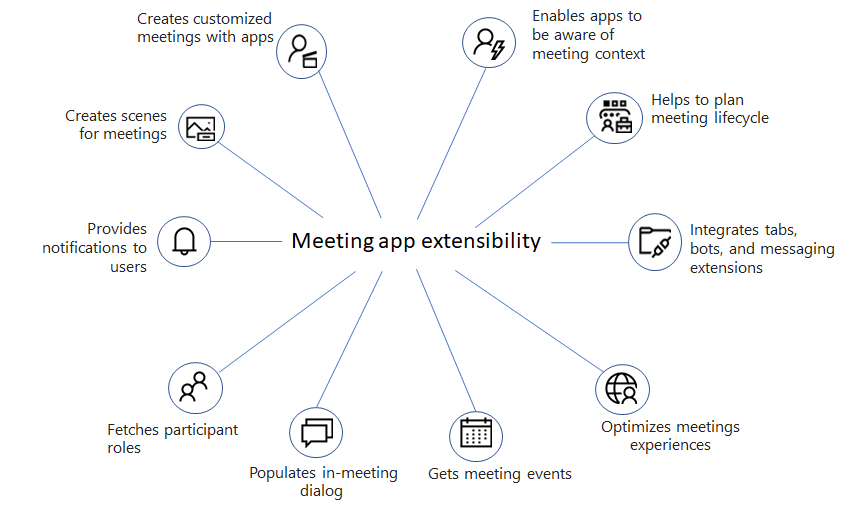

# Apps für Teams Besprechungen

Besprechungen ermöglichen Zusammenarbeit, Partnerschaft, informierte Kommunikation und gemeinsames Feedback. Die Besprechungs-App kann eine Benutzererfahrung für jede Phase des Besprechungslebenszyklus bereitstellen. Der Besprechungslebenszyklus umfasst die App-Erfahrung vor der Besprechung, in besprechungsbesprechung und nach der Besprechung, je nach Status des Teilnehmers.

Die Benutzer können in Besprechungen über den Registerkartenkatalog aus ihrem Kalender auf Apps zugreifen, z. B.:

* Vorabphase eines Boards für Diess.
* Starten Sie ein Dialogfeld, in dem Aktionen ausgeführt werden können.
* Erstellen Sie eine Umfrage nach der Besprechung.

> [!VIDEO https://www.youtube-nocookie.com/embed/nKAy5rNDus4]

Die folgende Abbildung gibt Ihnen eine Vorstellung von den Erweiterbarkeitsfunktionen der Besprechungs-App:

Dieser Artikel bietet eine Übersicht über die Erweiterbarkeit von Besprechungs-Apps, API-Referenzen, das Aktivieren und Konfigurieren von Apps für Besprechungen und benutzerdefinierte Szenen im Gemeinsamen Modus in Teams.

Verbessern Sie Ihre Besprechungserfahrung mithilfe des Features zur Besprechungserweiterung. Mit diesem Feature können Sie Ihre Apps in Besprechungen integrieren. Es umfasst auch verschiedene Phasen eines Besprechungslebenszyklus, in denen Sie Registerkarten, Bots und Messaging-Erweiterungen integrieren können. Sie können verschiedene Teilnehmerrollen und Benutzertypen identifizieren, Besprechungsereignisse abrufen und In-Meeting-Dialogfelder generieren.

Um Teams mit Apps für Besprechungen anzupassen, aktivieren Sie Ihre Apps für Teams Besprechungen, indem Sie das App-Manifest aktualisieren und die Apps für Besprechungsszenarien konfigurieren.

Mit der neuen benutzerdefinierten Szenenfunktion für den gemeinsamen Modus können Benutzer an einem Ort in einer Besprechung mit ihrem Team zusammenarbeiten.

## Siehe auch

* [Tab](../tabs/what-are-tabs.md#understand-how-tabs-work)
* [Bot](../bots/what-are-bots.md)
* [Messaging-Erweiterung](../messaging-extensions/what-are-messaging-extensions.md)
* [Entwerfen Ihrer App](../apps-in-teams-meetings/design/designing-apps-in-meetings.md)
* [Voraussetzungen und API-Verweise für Apps in Teams-Besprechungen](create-apps-for-teams-meetings.md)
* [Szenen des benutzerdefinierten Zusammen-Modus](~/apps-in-teams-meetings/teams-together-mode.md)

## Nächster Schritt

> [!div class="nextstepaction"]
> [Erweiterbarkeit der Besprechungs-App](meeting-app-extensibility.md)
