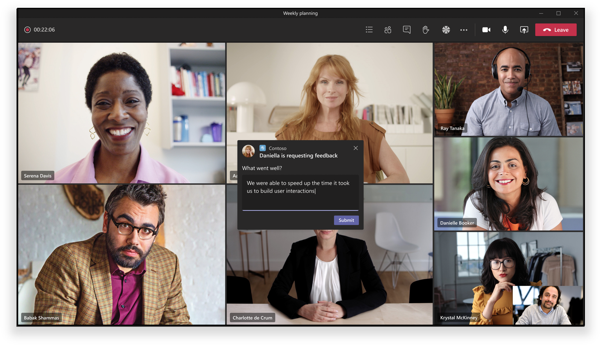

# Apps in Teams-Besprechungen

Besprechungen sind für die Produktivität in Teams entscheidend. Sie ermöglichen Zusammenarbeit, Partnerschaft, informierte Kommunikation und geteiltes Feedback in einem inklusiven und aktiven Forum. Als Entwickler können Sie konfigurierbare Anwendungen für  [Registerkarten,](../tabs/what-are-tabs.md#how-do-tabs-work) [Bots](../bots/what-are-bots.md)und Nachrichtenerweiterungen erstellen, um eine Besprechungserfahrung in Teams zu verbessern und zu erweitern. Besprechungsbenutzer können über den Registerkartenkatalog auf Apps zugreifen, um relevante Szenarien wie das Vorabszenieren eines Kanban-Board, das Starten eines Dialogfelds mit Aktionen in der Besprechung oder das Erstellen einer Umfrage nach der Besprechung zu ermöglichen. Ihre Besprechungs-App kann eine Benutzererfahrung für jede Phase des Besprechungslebenszyklus basierend auf dem Teilnehmerstatus bereitstellen.

Die Erweiterbarkeit der Besprechungs-App von Teams zentriert sich auf drei Konzepte:

✔ **Besprechungslebenszyklus** – vor, während und nach Besprechungszeitrahmen.  
✔ Rolle **"Teilnehmer"** – Besprechungsorganisator, Organisator oder Teilnehmer.  
✔ **Benutzertyp –** Mandanten-, Gast-, Verbund- oder anonymer Teams-Benutzer.

<!-- markdownlint-disable MD001 -->
### Szenarien für den Besprechungslebenszyklus

## Registerkarten

> [!IMPORTANT]
> Wie bei allen Registerkartenanwendungen muss Ihre  App den Teams-SSO-Authentifizierungsfluss für Registerkarten befolgen.

> [!NOTE]
> Mobile Clients unterstützen Registerkarten nur in Oberflächen vor und nach Besprechungen. Die Besprechungserfahrungen (Dialogfeld und Bereich in Besprechungen) auf mobilgeräten werden in Kürze verfügbar sein.

### App-Erfahrung vor der Besprechung

**Vor der Besprechung:**

**Registerkarte "Pre-meeting":**

✔ Benutzer mit Berechtigung können apps zu einer Besprechung über den Registerkartenkatalog auf zwei Arten hinzufügen:

&emsp;&emsp;&#9679; Über die Registerkarte **"Details"** im Planungsformular für Teams.

&emsp;&emsp;&#9679; Über die Registerkarte **"Besprechungschat"** in einer vorhandenen Besprechung.   

✔ Registerkarten-Apps können auf  **Besprechungsdetails-** und Chatseiten über eine Schaltfläche für ein Pluszeichen (➕) zugegriffen werden.|

✔ Registerkartenlayout sollte sich in einem organisierten Zustand befinden, wenn mehr als zehn Umfragen oder Umfragen durchgeführt werden.

### In-Meeting-App-Erfahrung

✔ Besprechungs-Apps werden in der oberen oberen Leiste des Chatfensters und als Registerkartenerfahrung in Besprechungen über die Registerkarte "In-Meeting" gehostet. Wenn Benutzer einer Besprechung über den Registerkartenkatalog  eine Registerkarte hinzufügen, werden Apps angezeigt, die sich während der Besprechungsoberfläche befinden.

✔ Berechtigte Benutzer können während der Besprechung Apps hinzufügen.

✔ Im Kontext einer Besprechung geladen, können Apps das Teams-Client-SDK verwenden, um auf das zu greifen und die Besensung `meetingId` `userMri` entsprechend zu `frameContext` rendern.

✔ Exportieren eines Ergebnisses einer Umfrage oder Umfrage sollte die Benutzer darüber informieren, dass die Ergebnisse erfolgreich heruntergeladen wurden.

✔, damit eine App in einer Besprechung in Teams in zwei Bereichen sichtbar ist:

&emsp;&emsp;&#9679; **Seitenbereich .**  

> [!NOTE]
> Wenn Ihr _App-Manifest_ angibt, dass Ihre Registerkarte für den Seitenbereich optimiert [ist,](create-apps-for-teams-meetings.md#during-a-meeting)wird sie dort angezeigt. Es kann auch Teil einer Share-Tray-Erfahrung sein, vorbehaltlich der angegebenen Entwurfsrichtlinien.

&emsp;&emsp;&#9679; **In-Meeting-Dialogfeld .** Verwenden Sie das Dialogfeld in der Besprechung, um Aktionen für Besprechungsteilnehmer anzuzeigen. *Siehe "Erstellen* [von Apps für Teams-Besprechungen".](create-apps-for-teams-meetings.md)

**Besprechungserfahrung:**

**Dialogfeld mit Aktionen in Besprechungen für Benutzer:**

### App-Erfahrung nach der Besprechung

**Nach der Besprechung:**

✔ das Post-Meeting-App-Szenario ähnelt der aktuellen Oberfläche nach der Besprechung mit dem zusätzlichen Vorteil, dass Registerkarten innerhalb der Oberfläche vorhanden sind. 

✔ berechtigten Benutzern können Apps aus dem Registerkartenkatalog über die Registerkarte **"Details"**  im Planungsformular von Teams und die Registerkarte "Besprechungschat" in einer vorhandenen Besprechung zu einer Besprechung hinzufügen.

✔ Registerkartenlayout sollte sich in einem organisierten Zustand befinden, wenn mehr als zehn Umfragen oder Umfragen durchgeführt werden.

### Bots

Informationen zur Botimplementierung finden Sie in der [Dokumentation zu Bots in Teams-Besprechungen.](../bots/how-to/create-a-bot-for-teams.md#bots-in-teams-meetings)

### Messaging-Erweiterungen

Informationen zur Implementierung von Messagingerweiterungen finden Sie in der Dokumentation zu [Messagingerweiterungen in Teams-Besprechungen.](../messaging-extensions/how-to/create-messaging-extension.md#messaging-extensions-in-teams-meetings)

## Teilnehmerrollen und Benutzertypen in einer Besprechung

### Teilnehmerrollen

Sie können Ihre App mit teilnehmerspezifischer Autorisierung entwerfen. Beispielsweise kann nur ein Organisator und/oder Organisator eine Umfrage in Besprechungen erstellen. Obwohl die Standardeinstellungen für Teilnehmer vom IT-Administrator einer Organisation bestimmt werden, kann ein Besprechungsorganisator die Einstellungen für eine bestimmte Besprechung ändern. Organisatoren können diese Änderungen auf der Webseite für Besprechungsoptionen vornehmen.

1. **Organizer**. Der Organisator plant eine Besprechung, legt die Besprechungsoptionen fest, weist Besprechungsrollen zu und startet die Besprechung. Nur Benutzer mit einem M365-Konto (besitzen eine Teams-Lizenz) können Organisatoren sein und die Teilnehmerberechtigungen steuern.
1. **Presenter**. Organisatoren verfügen nahezu über die gleichen Funktionen wie Organisator. Ein Organisator kann jedoch keinen Organisator aus der Sitzung entfernen oder Besprechungsoptionen für die Sitzung ändern. Standardmäßig haben Teilnehmer, die einer Besprechung beitreten, die Rolle des Moderators.
1. **Teilnehmer**. Ein Teilnehmer ist ein Benutzer, der zur Teilnahme an einer Besprechung eingeladen wurde, aber nicht berechtigt ist, als Moderator zu fungieren. Teilnehmer können mit anderen Besprechungsmitgliedern interagieren, aber keine Besprechungseinstellungen verwalten oder Inhalte freigeben.

_Siehe_ [ **"Rollen in einer Teams-Besprechung"**](https://support.microsoft.com/office/roles-in-a-teams-meeting-c16fa7d0-1666-4dde-8686-0a0bfe16e019)

Sie können wie folgt auf die Seite  **"Besprechungsoptionen"** zugreifen:

&#11200; In Teams wechseln Sie zum **Kalenderlogo** des Kalenders, wählen Sie eine Besprechung  **Besprechungsoptionen aus.**

&#11200; Wählen Sie in einer Besprechungseinladung **Besprechungsoptionen aus.**

&#11200; Wählen Sie während einer Besprechung das Symbol **"Teilnehmer**  Besprechungssteuerelementen aus. Wählen Sie dann über der Liste der Teilnehmer die Option "Berechtigungen **verwalten" aus.**

### Benutzertypen

> [!NOTE]
> Benutzertypen können an Besprechungen teilnehmen und eine der oben beschriebenen Teilnehmerrollen übernehmen. Der Benutzertyp wird nicht als Teil der **getParticipantRole-API verfügbar** gemacht.

1. **Mandanteninte mandant**. Diese Benutzer gehören zur Organisation und verfügen über Anmeldeinformationen in Azure Active Directory für den Mandanten. Sie sind in der Regel Vollzeit-, Standort- oder Remotemitarbeiter.
1. **Gast**. Ein Gast ist ein Teilnehmer aus einer anderen Organisation, der eingeladen wurde, auf Teams oder andere Ressourcen im Mandanten Ihrer Organisation zu zugreifen. Gäste werden dem Active Directory Ihrer Organisation hinzugefügt und können nahezu dieselben Funktionen wie ein systemeigenes Teammitglied mit Vollzugriff auf Teamchats, Besprechungen und Dateien erhalten. _Siehe Gastzugriff_ [in Microsoft Teams](/microsoftteams/guest-access)
1. **Partner/Extern**. Ein Verbundbenutzer ist ein externer Teams-Benutzer in einer anderen Organisation, der zur Teilnahme an einer Besprechung eingeladen wurde. Da diese Benutzer über gültige Anmeldeinformationen bei Verbundpartnern verfügen, werden sie als von Teams authentifiziert behandelt, haben jedoch keinen Zugriff auf Ihre Teams oder andere freigegebene Ressourcen aus Ihrer Organisation. Wenn Externe Benutzer Zugriff auf Teams und Kanäle haben sollen, ist der Gastzugriff möglicherweise die bessere Option. _Siehe "Verwalten_ [des externen Zugriffs in Microsoft Teams"](/microsoftteams/manage-external-access)
1. **Anonym**. Anonyme Benutzer verfügen nicht über eine Active Directory-Identität und sind nicht mit einem Mandanten im Verbund. Der anonyme Teilnehmer ist wie ein externer Benutzer, aber seine Identität wird nicht in die Besprechung projiziert. Anonyme Benutzer können in einem Besprechungsfenster nicht auf Apps zugreifen.

## Nächste Schritte

> [!div class="nextstepaction"]
> [Entwerfen Ihrer App](../apps-in-teams-meetings/design/designing-apps-in-meetings.md)
> [!div class="nextstepaction"]
> [Erstellen Sie Ihre Anwendung](create-apps-for-teams-meetings.md)
