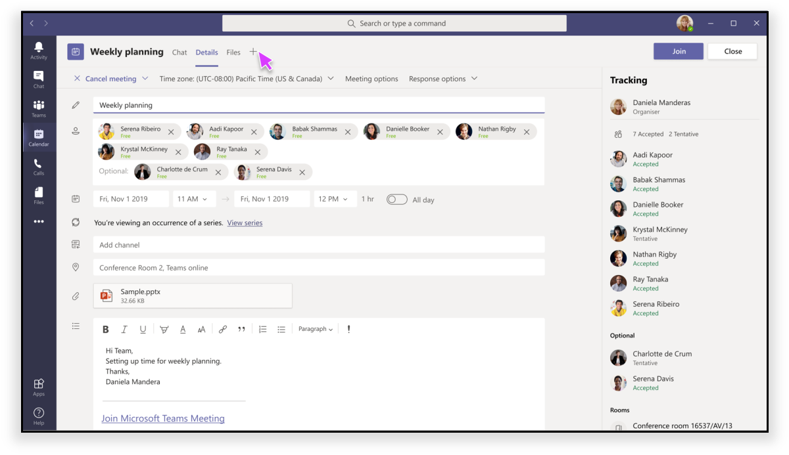

# Apps in Teams MeetingsApps in Teams meetings

Meetings ermöglichen Zusammenarbeit, Partnerschaft, informierte Kommunikation und gemeinsames Feedback in einem inklusiven und aktiven Forum.Meetings enable collaboration, partnership, informed communication, and shared feedback in an inclusive and active forum. Die Besprechungs-App kann je nach Status des Teilnehmers eine Benutzererfahrung für jede Phase des Besprechungslebenszyklus bereitstellen, einschließlich Pre-Meeting-, In-Meeting- und Post-Meeting-App-Erfahrung.The meeting app can deliver a user experience for each stage of the meeting lifecycle including pre-meeting, in-meeting and post-meeting app experience, depending on the attendee's status.

Teams Endbenutzer können während Besprechungen über den Tab-Katalog auf Apps zugreifen, z. B.:Teams end-users can access apps during meetings using the tab gallery, for example:

* Vorstufe eines Kanban-BoardsPre-stage a Kanban board
* Starten eines in Meeting umsetzbaren DialogfeldsLaunch an in-meeting actionable dialog
* Erstellen einer Umfrage nach dem MeetingCreate a post-meeting poll

Die Erweiterbarkeit der Besprechungs-App für Teams basiert auf den folgenden Konzepten:Teams’ meeting app extensibility is based on the following concepts:

✔ Meeting-Lebenszyklus hat Phasen wie vor, während und nach dem Besprechungszeitraum.✔ Meeting lifecycle has stages such as before, during, and after meeting time frame.  
✔ Teilnehmerrollen in einer Besprechung, z. B. Besprechungsorganisator, Moderator oder Teilnehmer.✔ Participant roles in a meeting such as meeting organizer, presenter, or attendee.  
✔ Benutzertypen in einer Besprechung, z. B. in-tenant, guest, federated oder anonymous Teams user.✔ User types in a meeting such as in-tenant, guest, federated, or anonymous Teams user.

Dieser Artikel behandelt Informationen zum Besprechungslebenszyklus und zum Integrieren von Registerkarten, Bots und Messagingerweiterungen in Ihre Besprechung.This article covers information about the meeting lifecycle and how to integrate tabs, bots, and messaging extensions in your meeting. Außerdem können Sie Teilnehmerrollen identifizieren und auch verschiedene Benutzertypen zum Ausführen von Aufgaben verwenden.It also enables you to identify participant roles and also use different user types to perform tasks.

> [!NOTE]
> Um mit den Erweiterbarkeitsfeatures der Besprechungs-App arbeiten zu können, müssen Sie über die entsprechenden Berechtigungen verfügen.To work with the meeting app extensibility features, you must have the appropriate permissions.

### BesprechungslebenszyklusMeeting lifecycle

Der Besprechungslebenszyklus besteht aus der App-Erfahrung vor Meeting, Besprechung und Nachbesprechung.Meeting lifecycle consists of pre-meeting, in-meeting, and post-meeting app experience. Sie können Registerkarten, Bots und Messagingerweiterungen in jeder Phase des Besprechungslebenszyklus integrieren.You can integrate tabs, bots, and messaging extensions in each stage of the meeting lifecycle.

## Integrieren von Registerkarten in den BesprechungslebenszyklusIntegrate tabs into the meeting lifecycle

Registerkarten ermöglichen Teammitgliedern den Zugriff auf Dienste und Inhalte in einem bestimmten Bereich innerhalb eines Kanals oder Chats.Tabs allow team members to access services and content in a specific space within a channel or chat. Auf diese Weise kann das Team direkt mit Registerkarten arbeiten und Gespräche über die Tools und Daten führen, die in Registerkarten verfügbar sind.This lets the team work directly with tabs and have conversations about the tools and data available within tabs. In Teams Besprechung können Benutzer eine Registerkarte hinzufügen, indem sie PlusIn Teams meeting, users can add a tab by selecting plus , und wählen Sie die App aus, die sie als Registerkarte installieren möchten., and choosing the app that they want to install as a tab.

> [!IMPORTANT]
> Wenn Sie eine Registerkarte in Ihre Besprechung integriert haben, muss Ihre App dem Teams [SSO-Authentifizierungsablauf (Single Sign-On)](../tabs/how-to/authentication/auth-aad-sso.md) für Registerkarten folgen.If you have integrated a tab with your meeting, then your app must follow the Teams [single sign-on (SSO) authentication flow](../tabs/how-to/authentication/auth-aad-sso.md) for tabs.

> [!NOTE]
> * Mobile Clients unterstützen Registerkarten nur in Pre- und Post-Meeting-Phasen.Mobile clients support tabs only in pre and post meeting stages. Die Besprechungserlebnisse, die sich im Besprechungsdialog und im Panel befinden, sind derzeit nicht auf Mobilgeräten verfügbar.The in-meeting experiences that is in-meeting dialog and panel are currently not available on mobile.
> * Apps werden nur in privaten geplanten Besprechungen unterstützt.Apps are supported only in private scheduled meetings.

### Pre-Meeting-App-ErfahrungPre-meeting app experience

**Erfahrung vor dem Meeting:****Pre-meeting experience:**

**Registerkarte Vor dem Meeting:****Pre-meeting tab:**

✔ Berechtigte Benutzer sind Benutzer, die apps zu einer Besprechung in verschiedenen Phasen des Besprechungslebenszyklus hinzufügen können.✔ Permissioned users are users who can add apps to a meeting during different stages of the meeting lifecycle. Diese Benutzer können Apps über die Registerkartengalerie auf zwei Arten zu einer Besprechung hinzufügen:These users can add apps to a meeting through the tab gallery in two ways:

   * Verwenden der Registerkarte **Details** im Teams Planungsformular.Using the **Details** tab on the Teams scheduling form.

   * Verwenden der Registerkarte **Besprechungschat** in einer vorhandenen Besprechung.Using the meeting **Chat** tab in an existing meeting.

✔ Tab-Apps sind in Besprechungen **Details-** und **Chat-Seiten** über eine Plus-➕-Schaltfläche zugänglich.✔ Tab apps are accessible in meetings **Details** and **Chats** pages using a plus ➕ button.

✔ Tab-Layout muss sich in einem organisierten Zustand befinden, wenn mehr als zehn Umfragen oder Umfragen vorliegen.✔ Tab layout must be in an organized state if there are more than ten polls or surveys.

### In-Meeting-App-ErfahrungIn-meeting app experience

✔ Meeting-Apps werden in der oberen oberen Leiste des Chatfensters gehostet und als In-Meeting-Registerkarte n.V. über die Registerkarte "Besprechung" angezeigt. Wenn Benutzer einer Besprechung über die Registerkartengalerie eine Registerkarte hinzufügen, werden Apps angezeigt, die sich während der **Besprechungserfahrung** befinden.✔ Meeting apps are hosted in the top upper bar of the chat window and as in-meeting tab experience using the in-meeting tab. When users add a tab to a meeting through the tab gallery, apps that are **during meeting** experiences are shown.

✔ Berechtigte Benutzer können während der Besprechung Apps hinzufügen.✔ Permissioned users can add apps while in the meeting.

✔ Beim Laden im Kontext einer Besprechung können Apps das Teams Client-SDK nutzen, um auf die zuzugreifen `meetingId` und die Erfahrung entsprechend zu `userMri` `frameContext` rendern.✔ When loaded in the context of a meeting, apps can leverage the Teams client SDK to access the `meetingId`, `userMri`, and `frameContext` to appropriately render the experience.

✔ Das Exportieren eines Ergebnisses einer Umfrage oder Umfrage benachrichtigt die Benutzer, dass die Ergebnisse erfolgreich heruntergeladen wurden.✔ Exporting a result of a survey or poll notifies the users that the results successfully downloaded.

✔ Eine App ist in einer Teams Besprechung im Seitenbereich oder im Dialogfeld "Besprechung" sichtbar.✔ An app is visible in a Teams meeting in the side panel or the in-meeting dialog box. Verwenden Sie das Dialogfeld in der Besprechung, um umsetzbare Inhalte für Besprechungsteilnehmer zu präsentieren.Use the in-meeting dialog box to showcase actionable content for meeting participants. Weitere Informationen finden Sie unter [Erstellen von Apps für Teams Besprechungen](create-apps-for-teams-meetings.md).For more information, see [create apps for Teams meetings](create-apps-for-teams-meetings.md).

   > [!NOTE]
   > Ihr App-Manifest gibt an, dass Ihre Registerkarte [für den Seitenbereich optimiert](create-apps-for-teams-meetings.md#during-a-meeting)ist, d. h., wo sie angezeigt wird.Your app manifest specifies that your tab is [optimized for side panel](create-apps-for-teams-meetings.md#during-a-meeting), that is where it is displayed. Es kann auch Teil eines Share-Tray-Erlebnisses sein, vorbehaltlich bestimmter Entwurfsrichtlinien.It can also be part of a share-tray experience, subject to specified design guidelines.

Die folgenden Bilder zeigen die App als Dialogfeld in der Besprechung und als separate Seitengruppe an:The following images display the app as an in-meeting dialog box and as a separate side panel:

#### In-Meeting-Dialog für BenutzerIn-meeting actionable dialog for users

### App-Erfahrung nach dem TreffenPost-meeting app experience

✔ Das App-Szenario nach dem Meeting ähnelt der aktuellen Erfahrung nach dem Meeting mit dem zusätzlichen Vorteil, dass Registerkarten innerhalb der Oberfläche vorhanden sind.✔ The post-meeting app scenario is similar to the current post-meeting experience with the added benefit of having tabs that exist within the surface.

✔ Berechtigte Benutzer können Apps aus dem Registerkartenkatalog zu einer Besprechung hinzufügen, indem Sie die Registerkarte **Details** im Teams Planungsformular und die Registerkarte **Besprechungschat** in einer vorhandenen Besprechung verwenden.✔ Permissioned users can add apps from the tab gallery to a meeting using the **Details** tab on the Teams scheduling form and the meeting **Chat** tab in an existing meeting.

✔ Tab-Layout muss organisiert werden, wenn mehr als zehn Umfragen oder Umfragen vorliegen.✔  Tab layout must be organized when there are more than ten polls or surveys.

### Integrieren von Bots in den Meeting-LebenszyklusIntegrate bots into the meeting lifecycle

Für die Bot-Implementierung beginnen Sie mit [dem Erstellen eines Bots](../build-your-first-app/build-bot.md) und fahren Sie dann mit der Erstellung von [Apps für Teams Meetings](../apps-in-teams-meetings/create-apps-for-teams-meetings.md#meeting-apps-api-reference)fort.For bot implementation, start with [build a bot](../build-your-first-app/build-bot.md) and then continue with [create apps for Teams meetings](../apps-in-teams-meetings/create-apps-for-teams-meetings.md#meeting-apps-api-reference).

### Integrieren von Messagingerweiterungen in den BesprechungslebenszyklusIntegrate messaging extensions into the meeting lifecycle

Beginnen Sie für die Implementierung von Messagingerweiterungen mit [dem Erstellen einer Messagingerweiterung,](../messaging-extensions/how-to/create-messaging-extension.md) und fahren Sie dann mit [dem Erstellen von Apps für Teams Besprechungen](../apps-in-teams-meetings/create-apps-for-teams-meetings.md#meeting-apps-api-reference)fort.For messaging extension implementation, start with [build a messaging extension](../messaging-extensions/how-to/create-messaging-extension.md) and then continue with [create apps for Teams meetings](../apps-in-teams-meetings/create-apps-for-teams-meetings.md#meeting-apps-api-reference).

## Teilnehmerrollen und Benutzertypen in einer BesprechungParticipant roles and user types in a meeting

### TeilnehmerrollenParticipant roles

Die Standardteilnehmereinstellungen werden vom IT-Administrator einer Organisation festgelegt.Default participant settings are determined by an organization's IT administrator. Im Folgenden sind die Teilnehmerrollen in einer Besprechung:The following are the participant roles in a meeting:

* **Organisator**: Der Organisator plant eine Besprechung, legt die Besprechungsoptionen fest, weist Besprechungsrollen zu und startet die Besprechung.**Organizer**: The organizer schedules a meeting, sets the meeting options, assigns meeting roles, and starts the meeting. Nur Benutzer mit einem M365-Konto mit einer Teams-Lizenz können Organisatoren und Steuerelementberechtigungen für Teilnehmer sein.Only users with a M365 account with a Teams license can be organizers and control attendee permissions. Ein Besprechungsorganisator kann die Einstellungen für eine bestimmte Besprechung ändern.A meeting organizer can change the settings for a specific meeting. Organisatoren können diese Änderungen auf der Webseite der **Besprechungsoptionen** vornehmen.Organizers can make these changes on the **Meeting options** web page.
* **Presenter**: Moderatoren haben die gleichen Funktionen wie der Organisator.**Presenter**: Presenters have the same capabilities as organizer. Ein Moderator kann jedoch keinen Organisator aus der Sitzung entfernen oder Besprechungsoptionen für die Sitzung ändern.However, a presenter cannot remove an organizer from the session or modify meeting options for the session. Standardmäßig haben Teilnehmer, die an einer Besprechung teilnehmen, die Referentenrolle.By default, participants joining a meeting have the presenter role.
* **Teilnehmer:** Ein Teilnehmer ist ein Benutzer, der zur Teilnahme an einer Besprechung eingeladen wurde, aber nicht berechtigt ist, als Moderator zu fungieren.**Attendee**: An attendee is a user who has been invited to attend a meeting but who is not authorized to act as a presenter. Teilnehmer können mit anderen Besprechungsmitgliedern interagieren, aber keine der Besprechungseinstellungen verwalten oder Inhalte freigeben.Attendees can interact with other meeting members but cannot manage any of the meeting settings or share content.

Nur ein Organisator oder Moderator kann Apps hinzufügen, entfernen oder deinstallieren.Only an organizer or presenter can add, remove, or uninstall apps. Nur Organisator oder Moderator kann Umfragen in einer Besprechung erstellen.Only organizer or presenter can create polls in a meeting.

Weitere Informationen finden Sie unter [Rollen in einer besprechung Teams](https://support.microsoft.com/office/roles-in-a-teams-meeting-c16fa7d0-1666-4dde-8686-0a0bfe16e019).For more information, see [roles in a Teams meeting](https://support.microsoft.com/office/roles-in-a-teams-meeting-c16fa7d0-1666-4dde-8686-0a0bfe16e019).

Sie können wie folgt auf die Seite  **Besprechungsoptionen** zugreifen:You can access the  **Meeting options** page as follows:

* Wechseln Sie in  Teams zum  , wählen Sie eine Besprechung aus, und dann die **Besprechungsoptionen**.In Teams, go to **Calendar** , select a meeting, and then **Meeting options**.

* Wählen Sie in einer **Besprechungseinladung Besprechungsoptionen** aus.In a meeting invitation, select **Meeting options**.

* Wählen Sie während einer Besprechung die Option **Teilnehmer**  Besprechungssteuerelementen anzeigen aus.During a meeting, select **Show participants**  in the meeting controls. Wählen Sie dann über der Teilnehmerliste **Berechtigungen verwalten** aus.Then, above the list of participants, choose **Manage permissions**.

### BenutzertypenUser types

> [!NOTE]
> Benutzer mit bestimmten Benutzertypen, die ihnen zugewiesen sind, können an Besprechungen teilnehmen und eine der teilnehmerrollen übernehmen, die in [Teilnehmerrollen](#participant-roles)beschrieben sind.Users with specific user types assigned to them can join meetings and assume one of the participant roles described in [participant roles](#participant-roles). Der Benutzertyp ist nicht in der **getParticipantRole-API** enthalten.The user type is not included in the **getParticipantRole** API.

Die folgenden Benutzertypen identifizieren, was jeder Benutzer tun kann und worauf er zugreifen kann:The following user types identify what each user can do and what they can access:

* **In-Tenant**: Mandantenbenutzer gehören zur Organisation und verfügen über Anmeldeinformationen in Azure Active Directory (AAD) für den Mandanten.**In-tenant**: In-tenant users belong to the organization and have credentials in Azure Active Directory (AAD) for the tenant. Sie sind in der Regel Vollzeit-, Vor-Ort- oder Remote-Mitarbeiter.They are usually full-time, onsite, or remote employees. Ein mandantist ein Organisator, Moderator oder Teilnehmer kann sein.An in-tenant user can be an organizer, presenter, or attendee.
* **Gast**: Ein Gast ist ein Teilnehmer einer anderen Organisation, der zum Zugriff auf Teams oder andere Ressourcen im Mandanten der Organisation eingeladen ist.**Guest**: A guest is a participant from another organization invited to access Teams or other resources in the organization's tenant. Gäste werden dem AAD Ihrer Organisation hinzugefügt und verfügen über die gleichen Teams Funktionen wie ein natives Teammitglied mit Zugriff auf Teamchats, Besprechungen und Dateien.Guests are added to your organization’s AAD and have the same Teams capabilities as a native team member with access to team chats, meetings, and files. Ein Gastbenutzer kann ein Organisator, Moderator oder Teilnehmer sein.A guest user can be an organizer, presenter, or attendee. Weitere Informationen finden Sie [unter Gastzugriff in Teams](/microsoftteams/guest-access).For more information, see [guest access in Teams](/microsoftteams/guest-access).
* **Verbundoder oder extern:** Ein Verbundbenutzer ist ein externer Teams Benutzer in einer anderen Organisation, der zur Teilnahme an einer Besprechung eingeladen wurde.**Federated or external**: A federated user is an external Teams user in another organization who has been invited to join a meeting. Diese Benutzer verfügen über gültige Anmeldeinformationen bei Verbundpartnern und sind von Teams autorisiert.These users have valid credentials with federated partners and are authorized by Teams. Sie haben keinen Zugriff auf Ihre Teams oder andere freigegebene Ressourcen aus Ihrer Organisation.They do not have access to your teams or other shared resources from your organization. Der Gastzugriff ist eine bessere Option für externe Benutzer, um Zugriff auf Teams und Kanäle zu haben.Guest access is a better option for external users to have access to teams and channels. Weitere Informationen finden Sie unter [Verwalten des externen Zugriffs in Teams](/microsoftteams/manage-external-access).For more information, see [manage external access in Teams](/microsoftteams/manage-external-access).
* **Anonym**: Anonyme Benutzer haben keine AAD-Identität und werden nicht mit einem Mandanten verbunden.**Anonymous**: Anonymous users do not have an AAD identity and are not federated with a tenant. Der anonyme Teilnehmer ist wie ein externer Benutzer, aber seine Identität wird nicht in der Besprechung projiziert.The anonymous participant is like an external user, but their identity is not projected in the meeting. Ein anonymer Benutzer kann kein Organisator sein, sondern ein Moderator oder Teilnehmer sein.An anonymous user cannot be an organizer but can be a presenter or an attendee.

> [!NOTE]
> Anonyme Benutzer erben die globale Standardrichtlinie für App-Berechtigungsrichtlinien auf Benutzerebene.Anonymous users inherit the global default user-level app permission policy. Weitere Informationen finden Sie unter Verwalten von [Apps](/microsoftteams/non-standard-users#anonymous-user-in-meetings-access).For more information, see [Manage Apps](/microsoftteams/non-standard-users#anonymous-user-in-meetings-access).

Die folgende Tabelle enthält die Benutzertypen und die Funktionen, auf die jeder Benutzer zugreifen kann:The following table provides the user types and what features each user can access:

| BenutzertypUser type | RegisterkartenTabs | BotsBots | Messaging-ErweiterungenMessaging extensions | Adaptive KartenAdaptive Cards | AufgabenmoduleTask modules | Dialogfeld "Besprechung"In-meeting dialog |
| :-- | :-- | :-- | :-- | :-- | :-- | :-- |
| Anonymer BenutzerAnonymous user | Nicht verfügbarNot available | Nicht verfügbarNot available | Nicht verfügbarNot available | Interaktionen im Besprechungschat sind zulässig.Interactions in the meeting chat are allowed. | Interaktionen im Besprechungschat von einer Adaptive Card sind zulässig.Interactions in the meeting chat from an Adaptive Card are allowed. | Nicht verfügbarNot available |
| Gast, der Teil des Mieters AAD istGuest that is part of the tenant AAD | Interaktion ist erlaubt.Interaction is allowed. Das Erstellen, Aktualisieren und Löschen ist nicht zulässig.Creating, updating, and deleting are not allowed. | Nicht verfügbarNot available | Nicht verfügbarNot available | Interaktionen im Besprechungschat sind zulässig.Interactions in the meeting chat are allowed. | Interaktionen im Besprechungschat von einer Adaptive Card sind zulässig.Interactions in the meeting chat from an Adaptive Card are allowed. | AvailableAvailable |
| FederatedFederated | Nicht verfügbarNot available | Nicht verfügbarNot available | Nicht verfügbarNot available | Nicht verfügbarNot available | Nicht verfügbarNot available | Nicht verfügbarNot available |

## Siehe auchSee also

* [TabTab](../tabs/what-are-tabs.md#understand-how-tabs-work)
* [BotBot](../bots/what-are-bots.md)
* [Messaging-ErweiterungMessaging extension](../messaging-extensions/what-are-messaging-extensions.md)
* [Entwerfen Ihrer AppDesign your app](../apps-in-teams-meetings/design/designing-apps-in-meetings.md)

## Nächster SchrittNext step

> [!div class="nextstepaction"]
> [Erstellen Sie Ihre AnwendungBuild your app](create-apps-for-teams-meetings.md)
