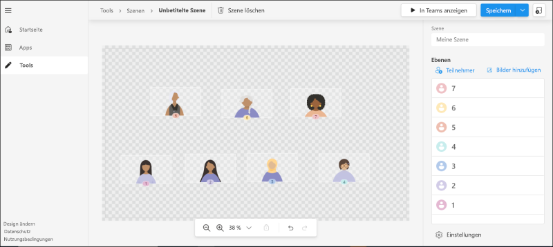
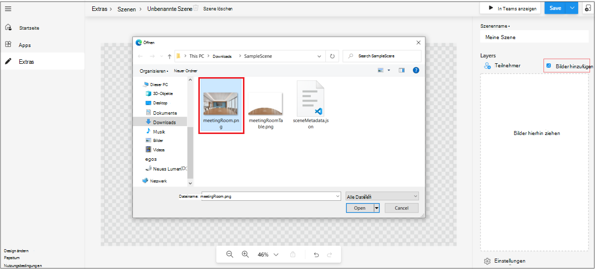
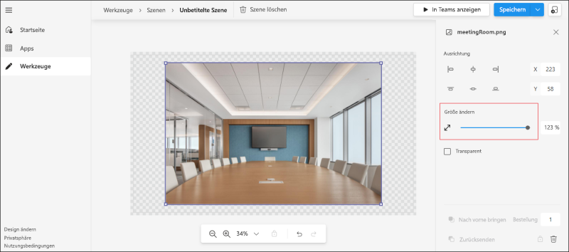
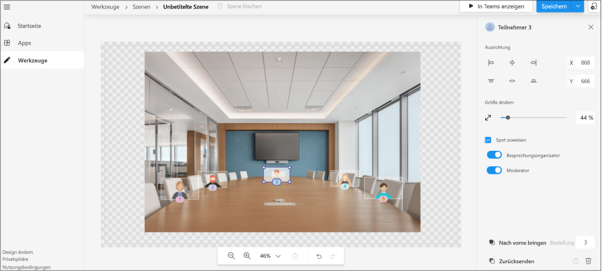
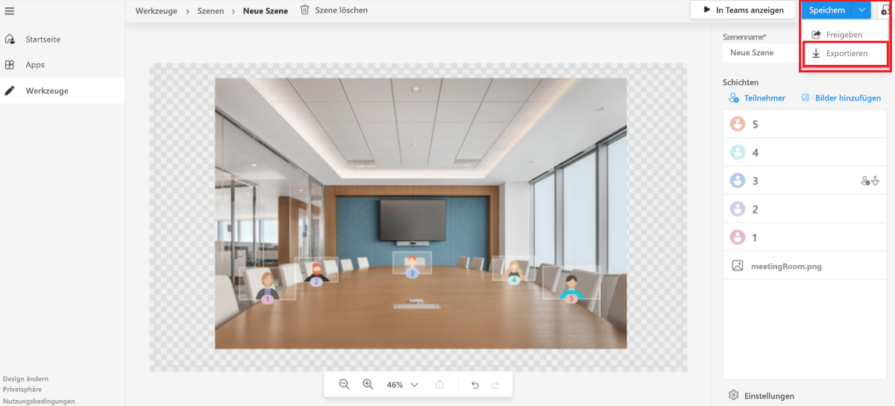

# <a name="custom-together-mode-scenes-in-teams"></a>Benutzerdefinierte Zusammen-Modus-Szenen

Benutzerdefinierte Zusammen-Modus-Szenen in Microsoft Teams bieten eine immersive und ansprechende Besprechungsumgebung mit den folgenden Aktionen:

* Bringen Sie Personen zusammen, und ermutigen Sie sie, ihre Videofunktion zu aktivieren.
* Kombinieren Sie Teilnehmer digital zu einer einzelnen virtuellen Szene.
* Platzieren Sie die Videostreams der Teilnehmer an vorab festgelegten Plätzen, die vom Szenenersteller entworfen und festgelegt wurden.

In benutzerdefinierte Zusammen-Modus-Szenen ist die Szene ein Artefakt. Die Szene wird vom Szenenentwickler mithilfe des Microsoft Scene Studio erstellt. In einer festgelegten Szeneeinstellung haben Teilnehmer Plätze mit Videostreams. Die Videos werden auf diesen Plätzen gerendert. Nur-Szenen-Apps werden empfohlen, da die Oberfläche für solche Apps klar ist.

Der folgende Prozess bietet einen Überblick über das Erstellen einer Nur-Szenen-App:

:::image type="content" source="../assets/images/apps-in-meetings/create-together-mode-scene-flow.png" alt-text="Nur-Szenen-App erstellen" border="false":::

Eine reine Szenen-App ist immer noch eine App in Teams. Das Scene Studio verarbeitet die Erstellung des App-Pakets im Hintergrund. Mehrere Szenen in einem einzelnen App-Paket werden den Benutzern als flache Liste angezeigt.

> [!NOTE]
> Benutzer können den Together-Modus nicht vom Mobiltelefon aus initiieren. Wenn ein Benutzer jedoch über ein Mobiltelefon an einem Meeting teilnimmt und der Together-Modus auf dem Desktop aktiviert wird, werden die mobilen Benutzer, die das Video aktiviert haben, auf dem Desktop im Together-Modus angezeigt.

## <a name="prerequisites"></a>Voraussetzungen

Sie müssen über grundlegende Kenntnisse der folgenden Punkte verfügen, um benutzerdefinierte Szenen im Zusammen-Modus verwenden zu können:

* Definieren von Szenen und Plätzen in einer Szene.
* Besitzen Sie ein Microsoft-Entwicklerkonto und machen Sie sich mit dem Teams [Entwicklerportal](../concepts/build-and-test/teams-developer-portal.md) und App Studio vertraut.
* Machen Sie sich mit dem [Konzept des Querladens von Apps](../concepts/deploy-and-publish/apps-upload.md) vertraut.
* Stellen Sie sicher, dass der Administrator die Berechtigung zum [**Hochladen einer benutzerdefinierten App**](../concepts/deploy-and-publish/apps-upload.md) erteilt hat, und wählen Sie alle Filter als Teil der App-Setup- bzw. Besprechungsrichtlinien aus.

## <a name="best-practices"></a>Bewährte Methoden

Berücksichtigen Sie die folgenden Vorgehensweisen für die Erstellung von Szenen:

* Stellen Sie sicher, dass alle Bilder im PNG-Format vorliegen.
* Stellen Sie sicher, dass das endgültige Paket mit allen zusammengestellten Bildern die Auflösung 1920x1080 nicht überschreiten darf. Die Auflösung ist eine gerade Zahl. Diese Auflösung ist eine Voraussetzung dafür, dass Szenen erfolgreich angezeigt werden.
* Stellen Sie sicher, dass die maximale Szenengröße 10 MB beträgt.
* Stellen Sie sicher, dass die maximale Größe jedes Images 5 MB beträgt. Eine Szene ist eine Sammlung mehrerer Bilder. Der Grenzwert gilt für jedes einzelne Bild.
* Stellen Sie sicher, dass Sie bei Bedarf **Transparent** auswählen. Dieses Kontrollkästchen ist im rechten Bereich verfügbar, wenn ein Bild ausgewählt ist. Die überlappenden Bilder müssen als **Transparent** gekennzeichnet werden, um anzugeben, dass sie sich überlappende Bilder in der Szene sind.

## <a name="build-a-scene-using-the-scene-studio"></a>Erstellen einer Szene mithilfe des Scene Studio

Microsoft verfügt über ein Scene Studio, mit dem Sie Szenen erstellen können. Es ist im [Szenen-Editor – Teams Entwicklerportal](https://dev.teams.microsoft.com/scenes) verfügbar. Dieses Dokument bezieht sich auf Scene Studio im Entwicklerportal von Teams. Die Schnittstelle und die Funktionen sind im App Studio Scene Designer identisch.

Eine Szene im Kontext des Scene Studio ist ein Artefakt, das die folgenden Elemente enthält:

* Reservierte Plätze für Besprechungsorganisatoren und Besprechungsreferenten. Der Referent verweist nicht auf den Benutzer, der aktiv teilt. Er bezieht sich auf die [Besprechungsrolle](https://support.microsoft.com/office/roles-in-a-teams-meeting-c16fa7d0-1666-4dde-8686-0a0bfe16e019).

* Platz und Bild für jeden Teilnehmer mit anpassbarer Breite und Höhe. Für das Bild wird nur das PNG-Format unterstützt.

* XYZ-Koordinaten aller Plätze und Bilder.

* Sammlung von Bildern, die als ein Bild getarnt sind.

Die folgende Abbildung zeigt jeden Platz, der als Avatar zum Erstellen der Szenen dargestellt wird:



Führen Sie die folgenden Schritte aus, um eine Szene mithilfe des Szenenstudios zu erstellen:

1. Wechseln Sie zu [Szenen-Editor – Teams Entwicklerportal](https://dev.teams.microsoft.com/scenes).

    Alternativ können Sie zum Öffnen von Scene Studio zur Startseite von [Teams-Entwicklerportal](https://dev.teams.microsoft.com/home) wechseln:
    * Wählen Sie **Benutzerdefinierte Szenen für Besprechungen erstellen** aus.
    * Wählen Sie im linken Abschnitt **Tools** und wählen Sie **Scene Studio** im Abschnitt **Tools** aus.

1. Wählen Sie im **Szenen-Editor** die Option **Neue Szene erstellen** aus.

1. Geben Sie in **Szenen-Name** einen Namen für die Szene ein.

    * Sie können **Schließen** auswählen, um zwischen dem Schließen oder erneuten Öffnen des rechten Bereichs zu wechseln.
    * Sie können die Szene mithilfe der Zoomleiste vergrößern oder verkleinern, um eine bessere Ansicht der Szene zu erhalten.

1. Wählen Sie **Bilder hinzufügen** aus, um das Bild der Umgebung hinzuzufügen:

    

    >[!NOTE]
    >Sie können die [SampleSxia.zip-](https://github.com/MicrosoftDocs/msteams-docs/tree/master/msteams-platform/apps-in-teams-meetings/SampleScene.zip) und [SampleApp.zip-](https://github.com/MicrosoftDocs/msteams-docs/tree/master/msteams-platform/apps-in-teams-meetings/SampleApp.zip) Dateien mit den Bildern herunterladen.

1. Wählen Sie das Bild aus, das Sie hinzugefügt haben.

1. Wählen Sie im rechten Bereich eine Ausrichtung für das Bild aus, oder verwenden Sie **Größe ändern**, um die Bildgröße anzupassen:

    

1. Wählen Sie einen Bereich außerhalb des Bilds aus.

1. Wählen Sie in der oberen rechten Ecke **Teilnehmer** unter **Ebenen** aus.

1. Wählen Sie im Feld **Anzahl der Teilnehmer** die Anzahl der Teilnehmer für die Szene aus, und wählen Sie **Hinzufügen** aus. Nachdem die Szene versendet wurde, werden die Avatar-Platzierungen durch die Videostreams des tatsächlichen Teilnehmers ersetzt. Sie können die Bilder der Teilnehmer innerhalb der Szene ziehen und an der erforderlichen Position platzieren. Sie können die Größe mithilfe des Größenänderungspfeils ändern.

1. Wählen Sie ein beliebiges Teilnehmerbild und dann **Spot zuweisen** aus, um den Spot dem Teilnehmer zuzuweisen.

1. Wählen Sie die Rolle **Besprechungsorganisator** oder **Referent** für den Teilnehmer aus. In einer Besprechung muss einem Teilnehmer die Rolle eines Besprechungsorganisators zugewiesen werden:

    

1. Wählen Sie **Speichern** und **In Teams anzeigen** aus, um Ihre Szene schnell in Teams zu testen.

    * Wenn Sie **In Teams anzeigen** auswählen, wird automatisch eine Teams-App erstellt, die auf der Seite **„Apps“** im Teams-Entwicklerportal angezeigt werden kann.
    * Wenn Sie **In Teams anzeigen** auswählen, wird automatisch ein App-Paket erstellt, das "appmanifest.json" hinter der Szene ist. Sie können über das Menü zu **Apps** wechseln und auf das automatisch erstellte App-Paket zugreifen.
    * Um eine von Ihnen erstellte Szene zu löschen, wählen Sie **Szene löschen** auf der oberen Leiste aus.

1. Wählen Sie **In Teams anzeigen** aus und dann **Vorschau in Teams**.
1. Wählen Sie im angezeigten Dialogfeld **Hinzufügen** aus.

    Die Szene wird getestet, oder es wird darauf zugegriffen, indem eine Testbesprechung erstellt und Benutzerdefinierte Zusammen-Modus-Szenen gestartet wird. Weitere Informationen finden Sie unter [Benutzerdefinierte Zusammen-Modus-Szenen aktivieren](#activate-custom-together-mode-scenes):

    

    Die Szene kann dann im Benutzerdefinierte Zusammen-Modus-Szenenkatalog angezeigt werden.

Optional können Sie **Freigeben** im Dropdownmenü **Speichern** auswählen. Sie können einen freigabefähigen Link erstellen, um Ihre Szenen für andere zu verteilen. Der Benutzer kann den Link öffnen, um die Szene zu installieren und mit der Verwendung zu beginnen.

Nach der Vorschau wird die Szene als App an Teams gesendet, indem die Schritte für die App-Übermittlung ausgeführt werden. Für diesen Schritt ist das App-Paket erforderlich. Das App-Paket unterscheidet sich vom Szenenpaket für die Szene, die entworfen wurde. Das automatisch erstellte App-Paket befindet sich im Abschnitt **Apps** im Teams Developer Center.

Optional wird das Szenenpaket abgerufen, indem sie **Exportieren** im Dropdownmenü **Speichern** auswählen. Eine .zip-Datei, d. h. das Szenenpaket, wird heruntergeladen. Das Szenenpaket enthält "scene.json" und die PNG-Objekte, die zum Erstellen einer Szene verwendet werden. Das Szenenpaket wird überprüft, um andere Änderungen zu integrieren:



Eine komplexe Szene, die die Z-Achse verwendet, wird im Beispiel für die ersten Schritte veranschaulicht.

## <a name="sample-scenejson"></a>Beispiel für "scene.json"

"Scene.json" und die Bilder geben die genaue Position der Plätze an. Eine Szene besteht aus Bitmapbildern, Sprites und Rechtecke, in die Teilnehmervideos eingefügt werden können. Diese Sprites und Teilnehmerfelder werden in einem Globalen Koordinatensystem definiert. Die X-Achse zeigt nach rechts und die Y-Achse nach unten.

Benutzerdefinierte Zusammen-Modus-Szenen unterstützen das Vergrößern der aktuellen Teilnehmer. Dieses Feature ist für kleine Besprechungen in einer großen Szene hilfreich. Ein Sprite ist ein statisches Bitmapbild, das in der Welt positioniert ist. Der Z-Wert des Sprites bestimmt die Position des Sprites. Das Rendern beginnt mit dem Sprite mit dem niedrigsten Z-Wert, daher bedeutet ein höherer Z-Wert, dass er näher an der Kamera liegt. Jeder Teilnehmer verfügt über einen eigenen Videofeed, der segmentiert ist, sodass nur der Vordergrund gerendert wird.

Der folgende Code ist das "scene.json"-Beispiel:

```json
{
   "protocolVersion": "1.0",
   "id": "A",
   "autoZoom": true,
   "mirrorParticipants ": true,
   "extent":{
      "left":0.0,
      "top":0.0,
      "width":16.0,
      "height":9.0
   },
   "sprites":[
      {
         "filename":"background.png",
         "cx":8.0,
         "cy":4.5,
         "width":16.0,
         "height":9.0,
         "zOrder":0.0,
   "isAlpha":false
      },
      {
         "filename":"table.png",
         "cx":8.0,
         "cy":7.0,
         "width":12.0,
         "height":4.0,
         "zOrder":3.0,
   "isAlpha":true
      },
      {
         "filename":"row0.png",
         "cx":12.0,
         "cy":15.0,
         "width":8.0,
         "height":4.0,
         "zOrder":2.0,
   "isAlpha":true
      }

   ],
   "participants":[
      {
         "cx":5.0,
         "cy":4.0,
         "width":4.0,
         "height":2.25,
         "zOrder":1.0,
         "seatingOrder":0
      },
      {
         "cx":11.0,
         "cy":4.0,
         "width":4.0,
         "height":2.25,
         "zOrder":1.0,
         "seatingOrder":1
      }
   ]
}
```

Jede Szene hat eine eindeutige ID und einen eindeutigen Namen. Der Szenen-JSON-Code enthält auch Informationen zu allen Objekten, die für die Szene verwendet werden. Jedes Medienobjekt enthält einen Dateinamen, eine Breite, eine Höhe und eine Position auf der X- und Y-Achse. Ebenso enthält jeder Platz eine Sitz-ID, Breite, Höhe und Position auf der X- und Y-Achse. Die Reihenfolge der Kontingente wird automatisch generiert und gemäß Ihren Präferenzen geändert. Die Nummer der Reihenfolge entspricht der Reihenfolge der Personen, die dem Anruf beitreten.

Die `zOrder` stellt die Reihenfolge dar, in der Bilder und Plätze entlang der Z-Achse platziert werden. Sie gibt bei Bedarf ein Gefühl von Tiefe oder Partition. Sehen Sie sich das Beispiel für die schrittweisen ersten Schritte an. Im Beispiel wird die `zOrder` verwendet.

Nachdem Sie nun die Beispieldatei "scene.json" durchgegangen sind, können Sie die Benutzerdefinierte Zusammen-Modus-Szenen aktivieren, um Szenen zu verwenden.

## <a name="activate-custom-together-mode-scenes"></a>Benutzerdefinierte Zusammen-Modus-Szenen aktivieren

Erhalten Sie weitere Informationen dazu, wie ein Benutzer mit Benutzerdefinierte Zusammen-Modus-Szenen interagiert.

Führen Sie die folgenden Schritte aus, um Szenen auszuwählen und benutzerdefinierte Szenen im Together-Modus zu aktivieren:

1. Erstellen Sie eine neue Testbesprechung.

    >[!NOTE]
    > Wenn Sie im Szenenstudio **Vorschau** auswählen, wird die Szene als App in Teams installiert. Dies ist das Modell, mit dem Entwickler Szenen aus dem Scene Studio testen und ausprobieren können. Nachdem eine Szene als App versendet wurde, sehen Benutzer diese Szenen im Szenenkatalog.

1. Wählen Sie in der Dropdownliste **Katalog** in der oberen linken Ecke **Zusammen-Modus** aus. Das Dialogfeld **Auswahl** wird angezeigt, und die hinzugefügte Szene ist verfügbar.

1. Wählen Sie **Szene ändern** aus, um die Standardszene zu ändern.

1. Wählen Sie im **Szenenkatalog** die Szene aus, die Sie für Ihre Besprechung verwenden möchten.

    Optional können der Besprechungsorganisator und der Referent für alle Teilnehmer im Meeting die **Szene für alle Teilnehmer ändern**.

    >[!NOTE]
    > Zu jedem Zeitpunkt wird nur eine Szene homogen für die Besprechung verwendet. Wenn ein Referent oder Organisator eine Szene ändert, ändert sie sich für alle. Das Ein- oder Ausschalten von Benutzerdefinierte Zusammen-Modus-Szenen ist für einzelne Teilnehmer möglich, aber während sie sich in Benutzerdefinierte Zusammen-Modus-Szenen befinden, verfügen alle Teilnehmer über die gleiche Szene.

1. Wählen Sie **Anwenden** aus. Teams installiert die App für den Benutzer und wendet die Szene an.

## <a name="open-a-custom-together-mode-scenes-scene-package"></a>Öffnen eines Benutzerdefinierte Zusammen-Modus-Szenenpakets

Sie können das Szenenpaket, bei dem es sich um eine ZIP-Datei handelt, die aus dem Scene Studio abgerufen wurde, für andere Ersteller freigeben, um die Szene weiter zu verbessern. Die Funktion **Szene importieren** hilft beim Entpacken eines Szenenpakets, damit der Ersteller die Szene weiter erstellen kann.


## <a name="see-also"></a>Siehe auch

* [Apps für Teams-Besprechungen](teams-apps-in-meetings.md)
* [Bots für Anrufe und Besprechungen](~/bots/calls-and-meetings/calls-meetings-bots-overview.md)
* [Medienanrufe und Besprechungen in Echtzeit mit Microsoft Teams](~/bots/calls-and-meetings/real-time-media-concepts.md)
