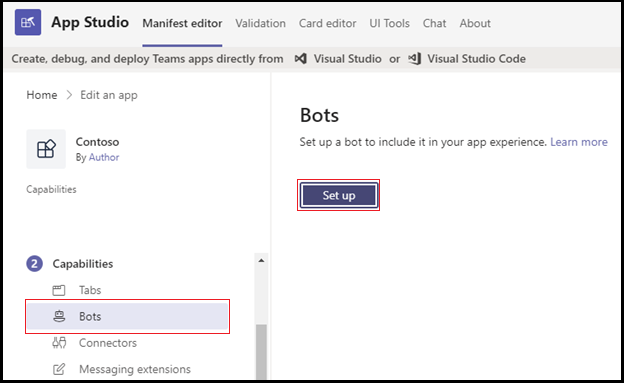

# <a name="add-power-virtual-agents-chatbot"></a><span data-ttu-id="29163-103">Hinzufügen von Power Virtual Agents-Chatbot</span><span class="sxs-lookup"><span data-stu-id="29163-103">Add Power Virtual Agents chatbot</span></span> 

<span data-ttu-id="29163-104">Power Virtual Agents ist eine ohne Code geführte grafische Benutzeroberflächenlösung, mit der jedes Mitglied Ihres Teams umfassende, unterhaltungsgesteuerte Chatbots erstellen kann, die problemlos in die Teams-Plattform integriert werden können.</span><span class="sxs-lookup"><span data-stu-id="29163-104">Power Virtual Agents is a no-code, guided graphical interface solution that empowers every member of your team to create rich, conversational chatbots that easily integrate with the Teams platform.</span></span> <span data-ttu-id="29163-105">Alle inhalte, die in Power Virtual Agents erstellt wurden, werden natürlich in Teams gerendert.</span><span class="sxs-lookup"><span data-stu-id="29163-105">All content authored in Power Virtual Agents renders naturally in Teams.</span></span> <span data-ttu-id="29163-106">Power Virtual Agents-Bots interagieren mit Benutzern in der nativen Teams-Chat-Canvas.</span><span class="sxs-lookup"><span data-stu-id="29163-106">Power Virtual Agents bots engage with users in the Teams native chat canvas.</span></span> <span data-ttu-id="29163-107">Die IT-Administratoren, Geschäftsanalysten, Domänenspezialisten und erfahrenen App-Entwickler können intelligente virtuelle Agents für Teams entwerfen, entwickeln und veröffentlichen, ohne eine Entwicklungsumgebung einrichten zu müssen.</span><span class="sxs-lookup"><span data-stu-id="29163-107">The IT administrators, business analysts, domain specialists, and skilled app developers can design, develop and publish intelligent virtual agents for Teams without having to setup a development environment.</span></span> <span data-ttu-id="29163-108">Sie können einen Webdienst erstellen oder sich direkt beim Bot Framework registrieren.</span><span class="sxs-lookup"><span data-stu-id="29163-108">They can create a web service, or directly register with the Bot Framework.</span></span> 

<span data-ttu-id="29163-109">In diesem Dokument erfahren Sie, wie Sie Ihren Chatbot über das Power Virtual Agents-Portal in Teams verfügbar machen und Ihren Bot mithilfe von App Studio zu Teams hinzufügen.</span><span class="sxs-lookup"><span data-stu-id="29163-109">This document guides you on how to make your chatbot available in Teams through the Power Virtual Agents portal, and add your bot to Teams using App Studio.</span></span> 

<span data-ttu-id="29163-110">Mit power Virtual Agents können Sie leistungsstarke Chatbots erstellen, die Fragen beantworten können, die von Ihren Kunden, anderen Mitarbeitern oder Besuchern Ihrer Website oder Ihres Dienstes gestellt werden.</span><span class="sxs-lookup"><span data-stu-id="29163-110">Power Virtual Agents lets you create powerful chatbots that can answer questions posed by your customers, other employees, or visitors to your website or service.</span></span>

<span data-ttu-id="29163-111">Diese Bots können problemlos erstellt werden, ohne dass Datenforscher oder Entwickler benötigt werden müssen.</span><span class="sxs-lookup"><span data-stu-id="29163-111">These bots can be created easily without the need for data scientists or developers.</span></span>

> [!NOTE]
> <span data-ttu-id="29163-112">Durch das Hinzufügen ihres Chatbots zu Microsoft Teams werden einige der Daten, z. B. Botinhalte und Benutzerchatinhalte, für Microsoft Teams freigegeben.</span><span class="sxs-lookup"><span data-stu-id="29163-112">By adding your chatbot to Microsoft Teams, some of the data, such as bot content and user chat content, is shared with Microsoft Teams.</span></span> <span data-ttu-id="29163-113">Das bedeutet, dass Ihre Daten außerhalb der Compliance und der geografischen oder regionalen Grenzen Ihrer [Organisation fließen.](/power-virtual-agents/data-location)</span><span class="sxs-lookup"><span data-stu-id="29163-113">It means that your data flows outside of your [organization’s compliance and geographic or regional boundaries](/power-virtual-agents/data-location).</span></span> <br/>

## <a name="make-your-chatbot-available-in-teams-through-the-power-virtual-agents-portal"></a><span data-ttu-id="29163-114">Machen Sie Ihren Chatbot über das Power Virtual Agents-Portal in Teams verfügbar</span><span class="sxs-lookup"><span data-stu-id="29163-114">Make your chatbot available in Teams through the Power Virtual Agents portal</span></span>

<span data-ttu-id="29163-115">Um Ihren Chatbot über das Power Virtual Agents-Portal in Teams verfügbar zu machen, müssen Sie die folgenden Prozessschritte ausführen:</span><span class="sxs-lookup"><span data-stu-id="29163-115">To make your chatbot available in Teams through the Power Virtual Agents portal, you must perform the following process steps:</span></span>

<span data-ttu-id="29163-116">**So stellen Sie den Chatbot in Teams zur Verfügung**</span><span class="sxs-lookup"><span data-stu-id="29163-116">**To make the chatbot available in Teams**</span></span>

1. <span data-ttu-id="29163-117">**Veröffentlichen der neuesten Botinhalte**</span><span class="sxs-lookup"><span data-stu-id="29163-117">**Publish the latest bot content**</span></span>  
<span data-ttu-id="29163-118">Nachdem Sie einen Chatbot im Power Virtual Agents-Portal erstellt haben, müssen Sie Ihren Bot veröffentlichen, bevor Teams-Benutzer mit ihm interagieren können.</span><span class="sxs-lookup"><span data-stu-id="29163-118">After creating a chatbot in the Power Virtual Agents portal, you must publish your bot before Teams users can interact with it.</span></span> <span data-ttu-id="29163-119">Weitere Informationen finden Sie unter [Publish the latest bot content](/power-virtual-agents/publication-fundamentals-publish-channels#publish-the-latest-bot-content).</span><span class="sxs-lookup"><span data-stu-id="29163-119">For more information, see [Publish the latest bot content](/power-virtual-agents/publication-fundamentals-publish-channels#publish-the-latest-bot-content).</span></span>

   

1. <span data-ttu-id="29163-121">**Konfigurieren des Teams-Kanals**</span><span class="sxs-lookup"><span data-stu-id="29163-121">**Configure the Teams channel**</span></span>  
<span data-ttu-id="29163-122">Fügen Sie nach der Veröffentlichung des Bots den Teams-Kanal hinzu, um den Bot für Teams-Benutzer verfügbar zu machen.</span><span class="sxs-lookup"><span data-stu-id="29163-122">After publishing your bot, add the Teams channel to make the bot available to Teams users.</span></span>

   

1. <span data-ttu-id="29163-124">**Generieren einer App-ID für Ihren Chatbot**</span><span class="sxs-lookup"><span data-stu-id="29163-124">**Generate an App ID for your chatbot**</span></span>  
<span data-ttu-id="29163-125">Nach dem Hinzufügen des Teams-Kanals zu Ihrem Chatbot wird im Dialogfeld eine **App-ID** generiert.</span><span class="sxs-lookup"><span data-stu-id="29163-125">After adding the Teams channel to your chatbot, an **App ID** is generated in the dialog box.</span></span> <span data-ttu-id="29163-126">Die App-ID ist ein eindeutiger von Microsoft generierter Bezeichner für Ihren Bot.</span><span class="sxs-lookup"><span data-stu-id="29163-126">The App ID is a unique Microsoft generated identifier for your bot.</span></span> <span data-ttu-id="29163-127">Speichern Sie die App-ID, um ein App-Paket für Teams zu erstellen.</span><span class="sxs-lookup"><span data-stu-id="29163-127">Save the App ID to create an app package for Teams.</span></span>

## <a name="add-your-bot-to-teams-using-app-studio"></a><span data-ttu-id="29163-128">Hinzufügen ihres Bots zu Teams mithilfe von App Studio</span><span class="sxs-lookup"><span data-stu-id="29163-128">Add your bot to Teams using App Studio</span></span>

<span data-ttu-id="29163-129">Wenn [das Hochladen benutzerdefinierter](/microsoftteams/admin-settings) Apps in Ihrer Teams-Instanz aktiviert ist, können Sie Teams App Studio verwenden, um Ihren Chatbot direkt hochzuladen und sofort mit der Verwendung zu beginnen.</span><span class="sxs-lookup"><span data-stu-id="29163-129">If [uploading custom apps is enabled](/microsoftteams/admin-settings) in your Teams instance, you can use Teams App Studio to directly upload your chatbot and start using it immediately.</span></span> <span data-ttu-id="29163-130">Um Ihren Chatbot zu teilen, können Sie Ihren Administrator bitten, Ihren Bot im Mandanten-App-Katalog verfügbar zu machen, oder Sie können Ihr App-Paket an andere senden und ihn bitten, es unabhängig hochzuladen.</span><span class="sxs-lookup"><span data-stu-id="29163-130">To share your chatbot, you can request your admin to make your bot available in the tenant app catalog or you can send your app package to others and ask them to upload it independently.</span></span>

1. <span data-ttu-id="29163-131">**Installieren von App Studio in Teams**</span><span class="sxs-lookup"><span data-stu-id="29163-131">**Install App Studio in Teams**</span></span>  
<span data-ttu-id="29163-132">App Studio ist eine Teams-App.</span><span class="sxs-lookup"><span data-stu-id="29163-132">App Studio is a Teams app.</span></span> <span data-ttu-id="29163-133">Installieren von App Studio aus dem Teams Store, der die Erstellung und Registrierung von Bots in Teams vereinfacht:</span><span class="sxs-lookup"><span data-stu-id="29163-133">Install App Studio from the Teams store that simplifies the process of bot creation and registration in Teams:</span></span> 

   1. <span data-ttu-id="29163-134">Wählen Sie das App Store-Symbol aus der Teams-Instanz aus, und suchen Sie **nach App Studio**.</span><span class="sxs-lookup"><span data-stu-id="29163-134">Select the app store icon from Teams instance, and search for **App Studio**.</span></span>

      &emsp;&emsp;    

   1. <span data-ttu-id="29163-135">Wählen Sie **die Kachel App Studio** aus, und wählen Sie **im** Popupdialogfeld Installieren aus.</span><span class="sxs-lookup"><span data-stu-id="29163-135">Select the **App Studio** tile and select **Install** in the pop-up dialog box.</span></span>

      &emsp;&emsp; 

1. <span data-ttu-id="29163-136">**Erstellen des Teams-App-Manifests in App Studio**</span><span class="sxs-lookup"><span data-stu-id="29163-136">**Create the Teams app manifest in App Studio**</span></span>  
<span data-ttu-id="29163-137">Bots in Teams werden durch eine App-Manifest-JSON-Datei definiert, die die grundlegenden Informationen zu Ihrem Bot und seinen Funktionen enthält.</span><span class="sxs-lookup"><span data-stu-id="29163-137">Bots in Teams are defined by an app manifest JSON file that provides the basic information about your bot and its capabilities.</span></span> <span data-ttu-id="29163-138">Wählen **Sie in App Studio** manifest **editor** aus, und wählen Sie Neue App erstellen **aus.**</span><span class="sxs-lookup"><span data-stu-id="29163-138">In **App Studio**, select **Manifest editor**, and select **Create a new app**.</span></span>  
<span data-ttu-id="29163-139">Die folgenden Bildanleitungen zum Erstellen einer neuen App in App Studio:</span><span class="sxs-lookup"><span data-stu-id="29163-139">The following image guides you to create a new app in App Studio:</span></span>  

   

1. <span data-ttu-id="29163-141">**Hinzufügen von Botdetails**</span><span class="sxs-lookup"><span data-stu-id="29163-141">**Add your bot details**</span></span>  
<span data-ttu-id="29163-142">Füllen Sie alle erforderlichen Felder aus.</span><span class="sxs-lookup"><span data-stu-id="29163-142">Complete all the required fields.</span></span> <span data-ttu-id="29163-143">Eine vollständige Beschreibung der einzelnen Felds finden Sie unter [Manifestschemadefinition](../../resources/schema/manifest-schema.md).</span><span class="sxs-lookup"><span data-stu-id="29163-143">For a full description of each field see [manifest schema definition](../../resources/schema/manifest-schema.md).</span></span>   
<span data-ttu-id="29163-144">Mit den folgenden Bildern können Sie die App-Details hinzufügen:</span><span class="sxs-lookup"><span data-stu-id="29163-144">The following image guides you to add the app details:</span></span>  

   

1. <span data-ttu-id="29163-146">**Einrichten des Bots** Führen Sie zum Einrichten des Bots die folgenden Schritte aus:</span><span class="sxs-lookup"><span data-stu-id="29163-146">**Set up your bot** To set-up the bot, perform the following steps:</span></span> 
     1. <span data-ttu-id="29163-147">Öffnen Sie die **Registerkarte Bots.**</span><span class="sxs-lookup"><span data-stu-id="29163-147">Open the **Bots** tab.</span></span> 
     1. <span data-ttu-id="29163-148">Wählen **Sie**  >  **Vorhandenen Bot einrichten aus,** und geben Sie den Namen Ihres Bots ein.</span><span class="sxs-lookup"><span data-stu-id="29163-148">Select **Setup** > **Existing bot** and enter the name of your bot.</span></span>

   <span data-ttu-id="29163-149">Die folgenden Bildanleitungen zum Einrichten eines Bots:</span><span class="sxs-lookup"><span data-stu-id="29163-149">The following image guides you to set-up a bot:</span></span>    

    

   <span data-ttu-id="29163-151">Die folgenden Bildanleitungen zum Einrichten eines vorhandenen Bots:</span><span class="sxs-lookup"><span data-stu-id="29163-151">The following image guides you to set-up an existing bot:</span></span>      

       
1. <span data-ttu-id="29163-153">**Hinzufügen Ihrer App-ID**</span><span class="sxs-lookup"><span data-stu-id="29163-153">**Add your App ID**</span></span>  
<span data-ttu-id="29163-154">Führen Sie die folgenden Schritte aus, um Ihre App-ID hinzuzufügen:</span><span class="sxs-lookup"><span data-stu-id="29163-154">To add your App ID, perform the following steps:</span></span>  
    1. <span data-ttu-id="29163-155">Wählen **Sie Verbinden mit einer anderen Bot-ID aus,** und fügen Sie die **App-ID ein,** die Sie zuvor kopiert haben.</span><span class="sxs-lookup"><span data-stu-id="29163-155">Select **Connect to a different bot id** and paste the **App Id** you copied earlier.</span></span> 
    1. <span data-ttu-id="29163-156">Wählen **Sie Bereich**  >  **Persönliches Speichern**  >  **aus.**</span><span class="sxs-lookup"><span data-stu-id="29163-156">Select **Scope** > **Personal** > **Save**.</span></span>      
<span data-ttu-id="29163-157">Die folgenden Bildanleitungen zum Einrichten eines vorhandenen Bots:</span><span class="sxs-lookup"><span data-stu-id="29163-157">The following image guides you to set-up an existing bot:</span></span>    

   

1. <span data-ttu-id="29163-159">**Hinzufügen gültiger Domänen für Ihren Bot**</span><span class="sxs-lookup"><span data-stu-id="29163-159">**Add valid domains for your bot**</span></span>  
<span data-ttu-id="29163-160">Dieser Schritt ist nur erforderlich, wenn der Bot die Anmeldung des Benutzers erfordert.</span><span class="sxs-lookup"><span data-stu-id="29163-160">This step is only required if your bot requires the user to sign in.</span></span> <span data-ttu-id="29163-161">Wählen **Sie Domänen und Berechtigungen** aus, und geben Sie im Feld **Gültige** Domänen die folgende Eingabe an:</span><span class="sxs-lookup"><span data-stu-id="29163-161">Select **Domains and permissions** and in the **Valid Domains** field, provide the following input:</span></span>

    ```bash
       token.botframework.com
    ```

7.  <span data-ttu-id="29163-162">**Testen und Verteilen des Bots**</span><span class="sxs-lookup"><span data-stu-id="29163-162">**Test and distribute your bot**</span></span>  
<span data-ttu-id="29163-163">Öffnen **Sie die Registerkarte Testen und** verteilen, und wählen Sie **Installieren** aus, um Ihren Bot direkt ihrer Teams-Instanz hinzuzufügen.</span><span class="sxs-lookup"><span data-stu-id="29163-163">Open **Test and distribute** tab and select **Install** to add your bot directly to your Teams instance.</span></span> <span data-ttu-id="29163-164">Alternativ können Sie das fertige App-Paket herunterladen, um es für Teams-Benutzer frei zu machen, oder es Ihrem Administrator zur Verfügung stellen, um Ihren Bot im Mandanten-App-Katalog verfügbar zu machen.</span><span class="sxs-lookup"><span data-stu-id="29163-164">Alternately, you can download the completed app package to share with Teams users or provide it to your admin to make your bot available in the tenant app catalog.</span></span>

8. <span data-ttu-id="29163-165">**Starten eines Chats** </span><span class="sxs-lookup"><span data-stu-id="29163-165">**Start a chat** </span></span>  
<span data-ttu-id="29163-166">Der Einrichtungsprozess zum Hinzufügen Ihres Power Virtual Agents-Chatbots zu Teams ist abgeschlossen.</span><span class="sxs-lookup"><span data-stu-id="29163-166">The set-up process for adding your Power Virtual Agents chat bot to Teams is complete.</span></span> <span data-ttu-id="29163-167">Sie können jetzt eine Unterhaltung mit Ihrem Bot in einem persönlichen Chat starten.</span><span class="sxs-lookup"><span data-stu-id="29163-167">You can now start a conversation with your bot in a personal chat.</span></span>

## <a name="see-also"></a><span data-ttu-id="29163-168">Siehe auch</span><span class="sxs-lookup"><span data-stu-id="29163-168">See also</span></span>

- [<span data-ttu-id="29163-169">Power Virtual Agents</span><span class="sxs-lookup"><span data-stu-id="29163-169">Power Virtual Agents</span></span>](/power-virtual-agents/fundamentals-what-is-power-virtual-agents)  

- <span data-ttu-id="29163-170">[Erstellen Eines Chatbots für Teams mit Microsoft Power Virtual Agents](../bot-features.md#bots-and-the-microsoft-power-virtual-agents).</span><span class="sxs-lookup"><span data-stu-id="29163-170">[Create a chatbot for Teams with Microsoft Power Virtual Agents](../bot-features.md#bots-and-the-microsoft-power-virtual-agents).</span></span>  

- [<span data-ttu-id="29163-171">Power Virtual Agents-Portal</span><span class="sxs-lookup"><span data-stu-id="29163-171">Power Virtual Agents portal</span></span>](https://powervirtualagents.microsoft.com)

- [<span data-ttu-id="29163-172">Veröffentlichen Ihres Power Virtual Agents-Bots</span><span class="sxs-lookup"><span data-stu-id="29163-172">Publish your Power Virtual Agents bot</span></span>](/power-virtual-agents/publication-fundamentals-publish-channels)

- <span data-ttu-id="29163-173">[Sicherheit und Compliance in Microsoft Teams](/MicrosoftTeams/security-compliance-overview).</span><span class="sxs-lookup"><span data-stu-id="29163-173">[Security and compliance in Microsoft Teams](/MicrosoftTeams/security-compliance-overview).</span></span>

## <a name="next-step"></a><span data-ttu-id="29163-174">Nächster Schritt</span><span class="sxs-lookup"><span data-stu-id="29163-174">Next step</span></span>

> [!div class="nextstepaction"]
> [<span data-ttu-id="29163-175">Erstellen eines virtuellen Assistenten</span><span class="sxs-lookup"><span data-stu-id="29163-175">Create virtual assistant</span></span>](~/samples/virtual-assistant.md)

