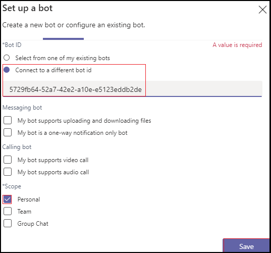

# <a name="add-power-virtual-agents-chatbot"></a>Hinzufügen eines Power Virtual Agent-Chatbots 

Power Virtual Agents ist eine codelose, geleitete grafische Oberflächenlösung, die es jedem Mitglied Ihres Teams ermöglicht, umfassende, unterhaltungsbezogene Chatbots zu erstellen, die sich problemlos in die Teams-Plattform integrieren lassen. Alle in Power Virtual Agents erstellten Inhalte werden natürlich in Teams gerendert. Power Virtual Agents Bots interagieren mit Benutzern in der Teams nativen Chat-Canvas. IT-Administratoren, Geschäftsanalysten, Domänenspezialisten und erfahrene App-Entwickler können intelligente virtuelle Agents für Teams entwerfen, entwickeln und veröffentlichen, ohne eine Entwicklungsumgebung einrichten zu müssen. Sie können einen Webdienst erstellen oder sich direkt beim Bot Framework registrieren. 

In diesem Dokument erfahren Sie, wie Sie Ihren Chatbot über das Power Virtual Agents-Portal in Teams zur Verfügung stellen und Ihren Bot mit App Studio Teams hinzufügen. 

mit Power Virtual Agents können Sie leistungsstarke Chatbots erstellen, die Fragen Ihrer Kunden, anderer Mitarbeiter oder Besucher Ihrer Website oder Ihres Dienstes beantworten können.

Diese Bots können problemlos erstellt werden, ohne dass Datenentwickler oder Entwickler benötigt werden.

> [!NOTE]
> Indem Sie Ihren Chatbot zu Microsoft Teams hinzufügen, werden einige der Daten, z. B. Bot-Inhalte und Benutzerchatinhalte, für Microsoft Teams freigegeben. Dies bedeutet, dass Ihre Daten außerhalb der [Compliance- und geografischen oder regionalen Grenzen](/power-virtual-agents/data-location)Ihrer Organisation fließen. <br/>

## <a name="make-your-chatbot-available-in-teams-through-the-power-virtual-agents-portal"></a>Stellen Sie Ihren Chatbot in Teams über das Power Virtual Agents-Portal zur Verfügung

Um Ihren Chatbot in Teams über das Power Virtual Agents Portal verfügbar zu machen, müssen Sie die folgenden Prozessschritte ausführen:

**So stellen Sie den Chatbot in Teams**

1. **Veröffentlichen der neuesten Bot-Inhalte**  
Nachdem Sie einen Chatbot im Power Virtual Agents-Portal erstellt haben, müssen Sie Ihren Bot veröffentlichen, bevor Teams Benutzer damit interagieren können. Weitere Informationen finden Sie unter [Veröffentlichen der neuesten Bot-Inhalte.](/power-virtual-agents/publication-fundamentals-publish-channels#publish-the-latest-bot-content)

   

1. **Konfigurieren des Teams Kanals**  
Fügen Sie nach der Veröffentlichung Ihres Bots den Teams Kanal hinzu, um den Bot Teams Benutzern zur Verfügung zu stellen.

   

1. **Generieren einer App-ID für Ihren Chatbot**  
Nach dem Hinzufügen des Teams Kanals zu Ihrem Chatbot wird im Dialogfeld eine **App-ID** generiert. Die App-ID ist ein eindeutiger von Microsoft generierter Bezeichner für Ihren Bot. Speichern Sie die App-ID, um ein App-Paket für Teams zu erstellen.

## <a name="add-your-bot-to-teams-using-app-studio"></a>Hinzufügen Ihres Bots zu Teams mit App Studio

Wenn [das Hochladen benutzerdefinierter Apps](/microsoftteams/admin-settings) in Ihrer Teams Instanz aktiviert ist, können Sie Teams App Studio verwenden, um Ihren Chatbot direkt hochzuladen und sofort zu verwenden. Um Ihren Chatbot freizugeben, können Sie Ihren Administrator bitten, Ihren Bot im Mandanten-App-Katalog verfügbar zu machen, oder Sie können Ihr App-Paket an andere personen senden und ihn bitten, ihn unabhängig hochzuladen.

1. **Installieren von App Studio in Teams**  
App Studio ist eine Teams-App. Installieren Sie App Studio aus dem Teams Store, der die Erstellung und Registrierung von Bots in Teams vereinfacht: 

   1. Wählen Sie das Symbol für den App Store aus Teams Instanz aus, und suchen Sie nach **App Studio.**

      &emsp;&emsp;    

   1. Wählen Sie die **Kachel "App Studio"** aus, und wählen Sie im Dialogfeld "Popup" die Option **"Installieren"** aus.

      &emsp;&emsp; 

1. **Erstellen des Teams-App-Manifests in App Studio**  
Bots in Teams werden durch eine JSON-Datei des App-Manifests definiert, die die grundlegenden Informationen zu Ihrem Bot und seinen Funktionen bereitstellt. Wählen Sie in **App Studio** **den Manifest-Editor** aus, und wählen Sie **"Neue App erstellen"** aus.

    

1. **Hinzufügen von Bot-Details**  
Füllen Sie alle erforderlichen Felder aus. Eine vollständige Beschreibung der einzelnen Felder finden Sie unter [Manifestschemadefinition.](../../resources/schema/manifest-schema.md)

    

1. **Einrichten Ihres Bots** Führen Sie die folgenden Schritte aus, um den Bot einzurichten: 
     1. Öffnen Sie die Registerkarte **"Bots".** 
     1. Wählen Sie "Vorhandenen Bot **einrichten"**  >   aus, und geben Sie den Namen Ihres Bots ein.

    

   Die folgende Abbildung zeigt, wie Sie einen vorhandenen Bot einrichten:      

   
       
1. **Hinzufügen Ihrer App-ID**  
Führen Sie die folgenden Schritte aus, um Ihre App-ID hinzuzufügen:  
    1. Wählen Sie **Verbinden zu einer anderen Bot-ID aus,** und fügen Sie die Zuvor kopierte **App-ID** ein. 
    1. Wählen Sie **"Persönlichen**  >    >  **Speicherbereich"** aus.

    

1. **Hinzufügen gültiger Domänen für Ihren Bot**  
Dieser Schritt ist nur erforderlich, wenn sich der Benutzer für Ihren Bot anmelden muss. Wählen Sie **Domänen und Berechtigungen** aus, und geben Sie im Feld **"Gültige Domänen"** die folgende Eingabe ein:

    ```bash
       token.botframework.com
    ```

1. **Testen und Verteilen Ihres Bots**  
Öffnen Sie die Registerkarte **"Testen" und "Verteilen",** und wählen Sie **"Installieren"** aus, um Ihren Bot direkt zu Ihrer Teams Instanz hinzuzufügen. Alternativ können Sie das fertige App-Paket herunterladen, um es für Teams Benutzer freizugeben, oder es Ihrem Administrator zur Verfügung stellen, um Ihren Bot im Mandanten-App-Katalog verfügbar zu machen.

1. **Starten eines Chats**   
Der Einrichtungsprozess zum Hinzufügen Ihres Power Virtual Agents Chat-Bots zu Teams ist abgeschlossen. Sie können nun eine Unterhaltung mit Ihrem Bot in einem persönlichen Chat beginnen.

## <a name="see-also"></a>Siehe auch

* [Power Virtual Agents](/power-virtual-agents/fundamentals-what-is-power-virtual-agents)  
* [Erstellen Sie einen Chatbot für Teams mit Microsoft Power Virtual Agents.](../bot-features.md#bots-with-power-virtual-agents)  
* [Power Virtual Agents-Portal](https://powervirtualagents.microsoft.com)
* [Veröffentlichen Ihres Power Virtual Agents-Bots](/power-virtual-agents/publication-fundamentals-publish-channels)
* [Sicherheit und Compliance in Microsoft Teams](/MicrosoftTeams/security-compliance-overview).

## <a name="next-step"></a>Nächster Schritt

> [!div class="nextstepaction"]
> [Erstellen eines virtuellen Assistenten](~/samples/virtual-assistant.md)
