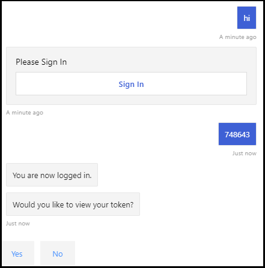

# <a name="add-authentication-to-your-teams-bot"></a>Hinzufügen von Authentifizierung zu ihren Teams-bot

Es gibt Situationen, in denen Sie möglicherweise Bots in Microsoft Teams erstellen müssen, die im Namen des Benutzers auf Ressourcen zugreifen können, beispielsweise einen e-Mail-Dienst.

In diesem Artikel wird die Verwendung der Azure bot Service V4 SDK-Authentifizierung basierend auf OAuth 2,0. Dies erleichtert die Entwicklung eines bot, der Authentifizierungstoken basierend auf den Anmeldeinformationen des Benutzers verwenden kann. Key in all dies ist die Verwendung von **Identitätsanbietern** , wie wir später sehen werden.

OAuth 2.0 ist ein offener Standard für Authentifizierung und Autorisierung, der von Azure Active Directory (Azure AD) und vielen anderen Identitätsanbietern verwendet wird. Ein grundlegendes Verständnis von OAuth 2,0 ist eine Voraussetzung für die Verwendung von Authentifizierung in Microsoft Teams.

Ein grundlegendes Verständnis finden Sie in [OAuth 2 vereinfacht](https://aka.ms/oauth2-simplified) , und [OAuth 2,0](https://oauth.net/2/) für die vollständige Spezifikation.

Weitere Informationen darüber, wie der Azure bot-Dienst die Authentifizierung verarbeitet, finden Sie unter [User Authentication in a Conversation](https://aka.ms/azure-bot-authentication).

In diesem Artikel erhalten Sie Informationen zu folgenden Themen:

- **Erstellen eines Authentifizierungs aktivierten bot**. Sie verwenden [CS-auth-Sample][teams-auth-bot-cs] zum Verarbeiten von Anmeldeinformationen für die Benutzeranmeldung und zum Generieren des Authentifizierungstokens.
- **Wie Sie den bot in Azure bereitstellen und einem Identitätsanbieter zuordnen**. Der Anbieter gibt ein Token basierend auf den Anmeldeinformationen für die Benutzeranmeldung aus. Der Bot kann mithilfe des Tokens auf Ressourcen zugreifen, beispielsweise auf einen e-Mail-Dienst, für den eine Authentifizierung erforderlich ist. Weitere Informationen finden Sie unter  [Microsoft Teams-Authentifizierungs Fluss für Bots](auth-flow-bot.md).
- **Vorgehensweise zum Integrieren des bot in Microsoft Teams**. Nachdem der bot integriert wurde, können Sie sich in einem Chat anmelden und Nachrichten damit austauschen.

## <a name="prerequisites"></a>Voraussetzungen

- Kenntnisse der [grundlegenden][concept-basics]Funktionen von bot, der [Verwaltung von Status][concept-state], der [Dialogfeld Bibliothek][concept-dialogs]und der [Implementierung eines sequenziellen Unterhaltungs Flusses][simple-dialog].
- Kenntnisse in Azure und OAuth 2,0-Entwicklung.
- Die aktuellen Versionen von Visual Studio und git.
- Azure-Konto. Bei Bedarf können Sie ein [Kostenloses Azure-Konto](https://azure.microsoft.com/free/)erstellen.
- Im folgenden Beispiel.

    | Beispiel | BotBuilder-Version | Veranschaulicht |
    |:---|:---:|:---|
    | **Bot-Authentifizierung** in [CS-auth-Sample][teams-auth-bot-cs] | v4 | OAuthCard-Unterstützung |
    | **Bot-Authentifizierung** in [js-auth-Sample][teams-auth-bot-js] | v4| OAuthCard-Unterstützung  |
    | **Bot-Authentifizierung** in [py-auth-Sample][teams-auth-bot-py] | v4 | OAuthCard-Unterstützung |

## <a name="create-the-resource-group"></a>Erstellen der Ressourcengruppe

Die Ressourcengruppe und der Dienstplan sind nicht unbedingt erforderlich, Sie ermöglichen jedoch das bequeme Freigeben der von Ihnen erstellten Ressourcen. Dies ist eine bewährte Methode, um Ihre Ressourcen organisiert und verwaltbar zu halten.

Sie verwenden eine Ressourcengruppe, um einzelne Ressourcen für das bot-Framework zu erstellen. Stellen Sie für die Leistung sicher, dass sich diese Ressourcen in derselben Azure-Region befinden.

1. Melden Sie sich in Ihrem Browser beim [**Azure-Portal**][azure-portal]an.
1. Wählen Sie im linken Navigationsbereich **Ressourcengruppen** aus.
1. Wählen Sie in der oberen linken Ecke des angezeigten Fensters Tab **Hinzufügen** aus, um eine neue Ressourcengruppe zu erstellen. Sie werden aufgefordert, Folgendes bereitzustellen:
    1. **Abonnement** : Verwenden Sie Ihr vorhandenes Abonnement.
    1. **Ressourcengruppe**. Geben Sie den Namen für die Ressourcengruppe ein. Ein Beispiel könnte  *TeamsResourceGroup* sein. Beachten Sie, dass der Name eindeutig sein muss.
    1. Wählen Sie im Dropdownmenü **Region** die Option *West US* oder eine Region, die sich in der Nähe ihrer Anwendungen befindet.
    1. Klicken Sie auf die Schaltfläche **überprüfen und erstellen** . Es sollte ein Banner angezeigt werden, das die *übergebene Validierung* liest.
    1. Klicken Sie auf die Schaltfläche **Erstellen** . Es kann einige Minuten dauern, bis die Ressourcengruppe erstellt wurde.

> [!TIP]
> Wie bei den Ressourcen, die Sie später in diesem Lernprogramm erstellen, empfiehlt es sich, diese Ressourcengruppe für einfachen Zugriff an das Dashboard zu anheften. Wenn Sie dies möchten, wählen Sie das Pin-Symbol & # 128204; in der oberen rechten Ecke des Dashboards.

## <a name="create-the-service-plan"></a>Erstellen des Dienstplans

1. Wählen Sie im [**Azure-Portal**][azure-portal]im linken Navigationsbereich die Option **Ressource erstellen** aus.
1. Geben Sie im Suchfeld den Text *App-Dienst Plan* ein. Wählen Sie die **App-Service Plan** Karte in den Suchergebnissen aus.
1. Wählen Sie **Erstellen** aus.
1. Sie werden aufgefordert, die folgenden Informationen anzugeben:
    1. **Abonnement** : Sie können ein vorhandenes Abonnement verwenden.
    1. **Ressourcengruppe**. Wählen Sie die Gruppe aus, die Sie zuvor erstellt haben.
    1. **Name**. Geben Sie den Namen für den Service Plan ein. Ein Beispiel könnte  *TeamsServicePlan* sein. Beachten Sie, dass der Name innerhalb der Gruppe eindeutig sein muss.
    1. **Betriebs System**. Wählen Sie *Windows* oder Ihr entsprechendes Betriebssystem aus.
    1. **Region**. Wählen Sie " *West US* " oder eine Region in der Nähe ihrer Anwendungen aus.
    1. **Preisstufe**. Stellen Sie sicher, dass *Standard S1* ausgewählt ist. Dies sollte der Standardwert sein.
    1. Klicken Sie auf die Schaltfläche **überprüfen und erstellen** . Es sollte ein Banner angezeigt werden, das die *übergebene Validierung* liest.
    1. Wählen Sie **Erstellen** aus. Es kann einige Minuten dauern, bis Sie den App-Dienstplan erstellt haben. Der Plan wird in der Ressourcengruppe aufgeführt.

## <a name="create-the-bot-channels-registration"></a>Erstellen der Registrierung für bot-Kanäle

Die Registrierung von bot-Kanälen registriert Ihren Webdienst als bot mit dem bot-Framework, vorausgesetzt, Sie verfügen über eine Microsoft-App-ID und ein App-Kennwort (geheimer Client Schlüssel).

> [!IMPORTANT]
> Sie müssen ihren bot nur registrieren, wenn er nicht in Azure gehostet wird. Wenn Sie [einen bot](/azure/bot-service/abs-quickstart?view=azure-bot-service-4.0&viewFallbackFrom=azure-bot-service-3.0&preserve-view=true) über das Azure-Portal erstellt haben, ist er bereits beim Dienst registriert. Wenn Sie Ihren bot über das [bot-Framework](https://dev.botframework.com/bots/new) oder [AppStudio](~/concepts/build-and-test/app-studio-overview.md) erstellt haben, ist Ihr bot nicht in Azure registriert.

[!INCLUDE [bot channels registration steps](~/includes/bots/azure-bot-channels-registration.md)]

> [!NOTE]
> Die Ressourcen zur Registrierung von bot-Kanälen zeigen die **globale** Region an, selbst wenn Sie West US ausgewählt haben. Dies entspricht dem erwarteten Verhalten.

Weitere Informationen finden Sie unter [Erstellen eines bot für Teams](../create-a-bot-for-teams.md).

## <a name="create-the-identity-provider"></a>Erstellen des Identitätsanbieters

Sie benötigen einen Identitätsanbieter, der für die Authentifizierung verwendet werden kann.
In diesem Verfahren verwenden Sie einen Azure AD Anbieter; Außerdem können andere Azure Ad Unterstützte Identitätsanbieter verwendet werden.

1. Wählen Sie im [**Azure-Portal**][azure-portal]im linken Navigationsbereich die Option **Azure Active Directory** aus.
    > [!TIP]
    > Sie müssen diese Azure AD Ressource in einem Mandanten erstellen und registrieren, in dem Sie die Berechtigung zum Delegieren von von einer Anwendung angeforderten Berechtigungen erteilen können.
    > Anweisungen zum Erstellen eines Mandanten finden Sie unter [zugreifen auf das Portal und Erstellen eines Mandanten](/azure/active-directory/fundamentals/active-directory-access-create-new-tenant).
1. Wählen Sie im linken Bereich **App-Registrierungen** aus.
1. Wählen Sie im rechten Bereich die Registerkarte **neue Registrierung** in der oberen linken Ecke aus.
1. Sie werden aufgefordert, die folgenden Informationen anzugeben:
   1. **Name**. Geben Sie den Namen der Anwendung ein. Ein Beispiel könnte  *BotTeamsIdentity* sein. Beachten Sie, dass der Name eindeutig sein muss.
   1. Wählen Sie die **unterstützten Kontotypen** für Ihre Anwendung aus. Wählen Sie *Konten in einem beliebigen Organisations Verzeichnis (beliebige Azure AD Verzeichnis – Multimandanten) und persönliche Microsoft-Konten (beispielsweise Skype, Xbox)* aus.
   1. Für den **Umleitungs-URI** :<br/>
       &#x2713;wählen Sie das **Webpart** aus. <br/>
       &#x2713; legen Sie die URL auf fest `https://token.botframework.com/.auth/web/redirect` .
   1. Wählen Sie **Registrieren** aus.

1. Nach der Erstellung zeigt Azure die Übersichts **Seite für die APP** an. Kopieren Sie die folgenden Informationen, und speichern Sie Sie in einer Datei:

    1. Der Wert der **Anwendungs-ID (Client)** . Sie verwenden diesen Wert später als *Client-ID* , wenn Sie diese Azure-Identitäts Anwendung mit Ihrem bot registrieren.
    1. Der **Verzeichnis Wert (Mandant) ID** . Sie werden diesen Wert auch später als *Mandanten-ID* verwenden, um diese Azure-Identitäts Anwendung mit Ihrem bot zu registrieren.

1. Wählen Sie im linken Bereich **Zertifikate & Secrets** aus, um einen geheimen Client Schlüssel für Ihre Anwendung zu erstellen.

   1. Wählen Sie unter **Client Secrets** &#x2795; **neuen geheimen Client Schlüssel** aus.
   1. Fügen Sie eine Beschreibung hinzu, um dieses Geheimnis von anderen Personen zu identifizieren, die Sie für diese APP möglicherweise erstellen müssen, beispielsweise für die *app "bot Identity" in Microsoft Teams*.
   1. Festlegen **läuft** auf Ihre Auswahl ab.
   1. Klicken Sie auf **Hinzufügen**.
   1. **Notieren Sie den geheimen Schlüssel** , bevor Sie diese Seite verlassen. Diesen Wert verwenden Sie später als _geheimer Client Schlüssel_ , wenn Sie Ihre Azure AD Anwendung mit Ihrem bot registrieren.

### <a name="configure-the-identity-provider-connection-and-register-it-with-the-bot"></a>Konfigurieren Sie die Verbindung mit dem Identitätsanbieter, und registrieren Sie Sie mit dem bot.

Hinweis: Es gibt zwei Optionen für Dienstanbieter hier – Azure AD v1 und Azure AD v2.  Die Unterschiede zwischen den beiden Anbietern werden [hier](https://docs.microsoft.com/azure/active-directory/azuread-dev/azure-ad-endpoint-comparison)zusammengefasst, im Allgemeinen bietet v2 jedoch mehr Flexibilität im Hinblick auf das Ändern von bot-Berechtigungen.  Graph-API-Berechtigungen werden im Feld Bereiche aufgelistet, und wenn neue hinzugefügt werden, können Benutzer den neuen Berechtigungen für die nächste Anmeldung zustimmen.  Für v1 muss die bot-Zustimmung vom Benutzer gelöscht werden, damit im Dialogfeld OAuth neue Berechtigungen zur Eingabe aufgefordert werden. 

#### <a name="azure-ad-v1"></a>Azure AD v1

1. Wählen Sie im [**Azure-Portal**][azure-portal]ihre Ressourcengruppe aus dem Dashboard aus.
1. Wählen Sie Ihren bot-Kanal Registrierungslink aus.
1. Wählen Sie auf der Seite Ressource die Option **Einstellungen** aus.
1. Wählen Sie unter **OAuth-Verbindungseinstellungen** am unteren Rand der Seite die Option **Einstellung hinzufügen** aus.
1. Füllen Sie das Formular wie folgt aus:

    1. **Name**. Geben Sie einen Namen für die Verbindung ein. Sie verwenden diesen Namen in Ihrem bot in der `appsettings.json` Datei. Beispiel *BotTeamsAuthADv1*.
    1. **Dienstanbieter**. Wählen Sie **Azure Active Directory** aus. Nachdem Sie diese Option ausgewählt haben, werden die Azure AD spezifischen Felder angezeigt.
    1. **Client-ID**. Geben Sie die Anwendungs-ID (Client) ein, die Sie in den obigen Schritten für Ihre Azure Identity Provider-App aufgezeichnet haben.
    1. **Geheimer Client Schlüssel**. Geben Sie den geheimen Schlüssel ein, den Sie in den obigen Schritten für Ihre Azure Identity-Anbieter-App aufgezeichnet haben.
    1. **Grant-Typ**. Geben Sie ein `authorization_code` .
    1. **Anmelde-URL**. Geben Sie ein `https://login.microsoftonline.com` .
    1. **Mandanten-ID** : Geben Sie die **Verzeichnis (Mandanten-ID)** ein, die Sie zuvor für Ihre Azure Identity-App aufgezeichnet haben, oder **verbreitet** , je nach dem unterstützten Kontotyp, der beim Erstellen der APP für den Identitätsanbieter ausgewählt wurde. Um zu entscheiden, welcher Wert zugewiesen werden soll, befolgen Sie die folgenden Kriterien:

        - Wenn Sie entweder *Konten in diesem Organisations Verzeichnis (nur Microsoft – einzelner Mandant)* oder *Konten in einem Organisations Verzeichnis (Microsoft Aad Directory-Multi Mandant)* ausgewählt haben, geben Sie die **Mandanten-ID** ein, die Sie zuvor für die Aad-App aufgezeichnet haben. Dies ist der Mandant, der den Benutzern zugeordnet ist, die authentifiziert werden können.

        - Wenn Sie *Konten in einem beliebigen Organisations Verzeichnis (AAD Directory-Multi Mandanten und persönliche Microsoft-Konten wie Skype, Xbox, Outlook)* ausgewählt haben, geben Sie das Wort " **Common** " anstelle einer Mandanten-ID ein. Andernfalls wird die Aad-App über den Mandanten überprüfen, dessen ID ausgewählt wurde, und persönliche Microsoft-Konten ausschließen.

    h. Geben Sie für **Ressourcen-URL** den Eintrag ein `https://graph.microsoft.com/` . Dies wird im aktuellen Codebeispiel nicht verwendet.  
    i. Lassen Sie **Bereiche** leer. Die folgende Abbildung ist ein Beispiel:

    

1. Klicken Sie auf **Speichern**.

#### <a name="azure-ad-v2"></a>Azure AD v2

1. Wählen Sie im [**Azure-Portal**][azure-portal]ihre Ressourcengruppe aus dem Dashboard aus.
1. Wählen Sie Ihren bot-Kanal Registrierungslink aus.
1. Wählen Sie auf der Seite Ressource die Option **Einstellungen** aus.
1. Wählen Sie unter **OAuth-Verbindungseinstellungen** am unteren Rand der Seite die Option **Einstellung hinzufügen** aus.
1. Füllen Sie das Formular wie folgt aus:

    1. **Name**. Geben Sie einen Namen für die Verbindung ein. Sie verwenden diesen Namen in Ihrem bot in der `appsettings.json` Datei. Beispiel *BotTeamsAuthADv2*.
    1. **Dienstanbieter**. Wählen Sie **Azure Active Directory v2** aus. Nachdem Sie diese Option ausgewählt haben, werden die Azure AD spezifischen Felder angezeigt.
    1. **Client-ID**. Geben Sie die Anwendungs-ID (Client) ein, die Sie in den obigen Schritten für Ihre Azure Identity Provider-App aufgezeichnet haben.
    1. **Geheimer Client Schlüssel**. Geben Sie den geheimen Schlüssel ein, den Sie in den obigen Schritten für Ihre Azure Identity-Anbieter-App aufgezeichnet haben.
    1. **Token Exchange-URL**. Lassen Sie das Feld leer.
    1. **Mandanten-ID** : Geben Sie die **Verzeichnis (Mandanten-ID)** ein, die Sie zuvor für Ihre Azure Identity-App aufgezeichnet haben, oder **verbreitet** , je nach dem unterstützten Kontotyp, der beim Erstellen der APP für den Identitätsanbieter ausgewählt wurde. Um zu entscheiden, welcher Wert zugewiesen werden soll, befolgen Sie die folgenden Kriterien:

        - Wenn Sie entweder *Konten in diesem Organisations Verzeichnis (nur Microsoft – einzelner Mandant)* oder *Konten in einem Organisations Verzeichnis (Microsoft Aad Directory-Multi Mandant)* ausgewählt haben, geben Sie die **Mandanten-ID** ein, die Sie zuvor für die Aad-App aufgezeichnet haben. Dies ist der Mandant, der den Benutzern zugeordnet ist, die authentifiziert werden können.

        - Wenn Sie *Konten in einem beliebigen Organisations Verzeichnis (AAD Directory-Multi Mandanten und persönliche Microsoft-Konten wie Skype, Xbox, Outlook)* ausgewählt haben, geben Sie das Wort " **Common** " anstelle einer Mandanten-ID ein. Andernfalls wird die Aad-App über den Mandanten überprüfen, dessen ID ausgewählt wurde, und persönliche Microsoft-Konten ausschließen.

    1. Geben Sie für **Bereiche** eine durch Leerzeichen getrennte Liste von Graph-Berechtigungen ein, die diese Anwendung benötigt, beispielsweise: User. Read User. ReadBasic. all Mail. Read 

1. Klicken Sie auf **Speichern**.

### <a name="test-the-connection"></a>Testen der Verbindung

1. Wählen Sie den Eintrag Connection aus, um die soeben erstellte Verbindung zu öffnen.
1. Wählen Sie oben im Bereich **Service Provider Connection Setting** die Option **Test connection** aus.
1. Wenn Sie das erste Mal durchführen, wird ein neues Browserfenster geöffnet, in dem Sie aufgefordert werden, ein Konto auszuwählen. Wählen Sie diejenige aus, die Sie verwenden möchten.
1. Als nächstes werden Sie aufgefordert, dem Identitätsanbieter die Verwendung Ihrer Daten (Anmeldeinformationen) zu gestatten. Die folgende Abbildung ist ein Beispiel:

    

1. Wählen Sie **Annehmen** aus.
1. Anschließend sollten Sie zu einer **Test Verbindung zu einer \<your-connection-name> erfolgreichen** Seite umgeleitet werden. Aktualisieren Sie die Seite, wenn Sie eine Fehlermeldung erhalten. Die folgende Abbildung ist ein Beispiel:

  

Der Verbindungsname wird vom bot-Code zum Abrufen von Benutzerauthentifizierungstoken verwendet.

## <a name="prepare-the-bot-sample-code"></a>Vorbereiten des bot-Beispielcodes

Nachdem die vorläufigen Einstellungen vorgenommen wurden, konzentrieren wir uns auf die Erstellung des bot, der in diesem Artikel verwendet werden soll.

# <a name="cnet"></a>[C#/.NET](#tab/dotnet)

1. Klon [CS-auth-Sample][teams-auth-bot-cs].
1. Starten Sie Visual Studio.
1. Wählen Sie in der Symbolleiste **Datei-> Open-> Projekt/Lösung** aus, und öffnen Sie das bot-Projekt.
1. In C# Update **appsettings.js** wie folgt:

    - Legen `ConnectionName` Sie den Namen der Identitätsanbieter Verbindung fest, die Sie der bot-Kanal Registrierung hinzugefügt haben. Der Name, den wir in diesem Beispiel verwendet haben, ist *BotTeamsAuthADv1*.
    - Legen `MicrosoftAppId` Sie die **bot-APP-ID** fest, die Sie zum Zeitpunkt der bot-Kanal Registrierung gespeichert haben.
    - Legen `MicrosoftAppPassword` Sie den **geheimen Kundenschlüssel** fest, den Sie zum Zeitpunkt der bot-Kanal Registrierung gespeichert haben.
    - Legen `ConnectionName` Sie den auf den Namen der Identitätsanbieter Verbindung fest.

    Je nach den Zeichen in Ihrem bot-Schlüssel müssen Sie möglicherweise XML-Escapezeichen für das Kennwort eingeben. Beispielsweise müssen alle kaufmännischen und-Zeichen (&) als codiert werden `&amp;` .

     [!code-json[appsettings](~/../botbuilder-samples/samples/csharp_dotnetcore/46.teams-auth/appsettings.json?range=1-5)]

1. Navigieren Sie im Projektmappen-Explorer zum `TeamsAppManifest` Ordner öffnen `manifest.json` und festlegen `id` sowie `botId` zur **bot-APP-ID** , die Sie zum Zeitpunkt der bot-Kanal Registrierung gespeichert haben.

# <a name="javascript"></a>[JavaScript](#tab/node-js)

1. Clone [Node-auth-Sample][teams-auth-bot-js].
1. Navigieren Sie in einer Konsole zum Projekt: </br></br>
`cd samples/javascript_nodejs/46.teams`  
1. Installieren von Modulen</br></br>
`npm install`
1. Aktualisieren Sie die **. env-** Konfiguration wie folgt:

    - Legen `MicrosoftAppId` Sie die **bot-APP-ID** fest, die Sie zum Zeitpunkt der bot-Kanal Registrierung gespeichert haben.
    - Legen `MicrosoftAppPassword` Sie den **geheimen Kundenschlüssel** fest, den Sie zum Zeitpunkt der bot-Kanal Registrierung gespeichert haben.
    - Legen `connectionName` Sie den auf den Namen der Identitätsanbieter Verbindung fest.

    Je nach den Zeichen in Ihrem bot-Schlüssel müssen Sie möglicherweise XML-Escapezeichen für das Kennwort eingeben. Beispielsweise müssen alle kaufmännischen und-Zeichen (&) als codiert werden `&amp;` .

     [!code-javascript[settings](~/../botbuilder-samples/samples/javascript_nodejs/46.teams-auth/.env)]

1. `teamsAppManifest`Öffnen Sie in dem Ordner `manifest.json` `id` Ihre **Microsoft-App-ID** und `botId` die **bot-APP-ID** , die Sie zum Zeitpunkt der bot-Kanal Registrierung gespeichert haben, und legen Sie diese fest.

# <a name="python"></a>[Python](#tab/python)

1. Clone [py-auth-Sample][teams-auth-bot-py] aus dem GitHub-Repository.
1. **Config.py** aktualisieren:

    - Legen `ConnectionName` Sie den Namen der OAuth-Verbindungseinstellung fest, die Sie Ihrem bot hinzugefügt haben.
    - Legen `MicrosoftAppId` `MicrosoftAppPassword` Sie die APP-ID und den App-Schlüssel Ihres bot fest.

      Je nach den Zeichen in Ihrem bot-Schlüssel müssen Sie möglicherweise XML-Escapezeichen für das Kennwort eingeben. Beispielsweise müssen alle kaufmännischen und-Zeichen (&) als codiert werden `&amp;` .

      [!code-python[config](~/../botbuilder-samples/samples/python/46.teams-auth/config.py?range=14-16)]

---

### <a name="deploy-the-bot-to-azure"></a>Bereitstellen des bot in Azure

Um den bot bereitzustellen, befolgen Sie die Schritte unter How to [deploy your bot to Azure](https://aka.ms/azure-bot-deployment-cli).

Alternativ können Sie in Visual Studio die folgenden Schritte ausführen:

1. Wählen Sie im Visual Studio Projekt *Mappen-Explorer* den Projektnamen aus, und halten Sie ihn (oder klicken Sie mit der rechten Maustaste).
1. Wählen Sie im Dropdownmenü die Option **veröffentlichen** aus.
1. Wählen Sie im angezeigten Fenster den **neuen** Link aus.
1. Wählen Sie im Dialogfeld **App-Dienst** auf der linken Seite aus, und **Erstellen Sie neu** auf der rechten Seite.
1. Klicken Sie auf die Schaltfläche **veröffentlichen** .
1. Geben Sie im nächsten Dialogfenster die erforderlichen Informationen ein. Es folgt ein Beispiel:

   

1. Wählen Sie **Erstellen** aus.
1. Wenn die Bereitstellung erfolgreich abgeschlossen wurde, sollte Sie in Visual Studio angezeigt werden. Darüber hinaus wird in Ihrem Standardbrowser eine Seite angezeigt, die besagt, dass *Ihr bot Ready!*. Die URL wird wie folgt aussehen: `https://botteamsauth.azurewebsites.net/` . Speichern Sie Sie in einer Datei.
1. Navigieren Sie in Ihrem Browser zum [**Azure-Portal**][azure-portal].
1. Überprüfen Sie Ihre Ressourcengruppe, der bot sollte zusammen mit den anderen Ressourcen aufgeführt werden. Die folgende Abbildung ist ein Beispiel:

    

1. Wählen Sie in der Gruppe Ressourcen den Namen des bot-Kanal Registrierungs namens (Link) aus.
1. Wählen Sie im linken Bereich **Einstellungen** aus.
1. Geben Sie im Feld **Messaging-Endpunkt** die oben abgerufene URL ein, gefolgt von `api/messages` . Dies ist ein Beispiel: `https://botteamsauth.azurewebsites.net/api/messages` .
1. Klicken Sie oben links auf die Schaltfläche **Speichern** .

## <a name="test-the-bot-using-the-emulator"></a>Testen des bot mit dem Emulator

Wenn Sie es nicht bereits getan haben, installieren Sie den [Microsoft bot Framework-Emulator](https://aka.ms/bot-framework-emulator-readme). Siehe auch [Debuggen mit dem Emulator](https://aka.ms/bot-framework-emulator-debug-with-emulator).

Damit die bot-Beispiel Anmeldung funktioniert, müssen Sie den Emulator wie unten gezeigt konfigurieren.

### <a name="configure-the-emulator-for-authentication"></a>Konfigurieren des Emulators für die Authentifizierung

Wenn ein bot eine Authentifizierung erfordert, müssen Sie den Emulator wie unten gezeigt konfigurieren.

1. Starten Sie den Emulator.
1. Wählen Sie im Emulator das Zahnradsymbol &#9881; unten links oder die Registerkarte **Emulatoreinstellungen** in der oberen rechten Ecke aus.
1. Aktivieren Sie das Kontrollkästchen mit der **Version 1,0-Authentifizierungstoken**.
1. Geben Sie den lokalen Pfad zum **ngrok** -Tool ein. *Siehe* bot Framework Emulator/ngrok Tunneling Integration [wiki](https://github.com/Microsoft/BotFramework-Emulator/wiki/Tunneling-(ngrok)). Weitere Informationen zum Tool finden Sie unter [ngrok](https://ngrok.com/).
1. Aktivieren Sie das Kontrollkästchen **ngrok ausführen, wenn der Emulator gestartet wird**.
1. Klicken Sie auf die Schaltfläche **Speichern** .

Wenn der bot eine Anmeldekarte anzeigt und der Benutzer die Anmeldeschaltfläche auswählt, öffnet der Emulator eine Seite, die der Benutzer zum Anmelden mit dem Authentifizierungsanbieter verwenden kann.
Sobald der Benutzer dies tut, generiert der Anbieter ein Benutzertoken und sendet es an den bot. Danach kann der bot im Namen des Benutzers handeln.

### <a name="test-the-bot-locally"></a>Testen des bot lokal

Nachdem Sie den Authentifizierungsmechanismus konfiguriert haben, können Sie die eigentlichen bot-Tests durchführen.  

1. Führen Sie das bot-Beispiel lokal auf Ihrem Computer aus, beispielsweise über Visual Studio.
1. Starten Sie den Emulator.
1. Klicken Sie auf die Schaltfläche **bot öffnen** .
1. Geben Sie in der **bot-URL** die lokale URL des bot ein. Normalerweise `http://localhost:3978/api/messages` .
1. Geben Sie in der **Microsoft App-ID** die APP-ID des bot von ein `appsettings.json` .
1. Geben Sie im **Microsoft App-Kennwort** das App-Kennwort des bot aus dem ein `appsettings.json` .
1. Wählen Sie **verbinden** aus.
1. Geben Sie nach dem Starten des bot einen beliebigen Text ein, um die Anmeldekarte anzuzeigen.
1. Wählen Sie die Schaltfläche **Anmelden** aus.
1. Ein Popupdialogfeld wird angezeigt, um die **geöffnete URL zu bestätigen**. Dadurch kann der Benutzer des bot (Sie) authentifiziert werden.  
1. Wählen Sie **Bestätigen** aus.
1. Wenn Sie dazu aufgefordert werden, wählen Sie das entsprechende Benutzerkonto aus.
1. Je nachdem, welche Konfiguration Sie für den Emulator verwendet haben, erhalten Sie eine der folgenden Optionen:
    1. **Verwenden des Anmelde Bestätigungscodes**  
      &#x2713; ein Fenster wird geöffnet, in dem der Validierungscode angezeigt wird.  
      &#x2713; kopieren Sie den Validierungscode, und geben Sie ihn in das Feld Chat ein, um die Anmeldung abzuschließen.
    1. **Verwenden von Authentifizierungstoken**.  
      &#x2713; Sie auf der Grundlage ihrer Anmeldeinformationen angemeldet sind.

    Die folgende Abbildung ist ein Beispiel für die bot-Benutzeroberfläche, nachdem Sie sich angemeldet haben:

    

1. Wenn Sie " **Ja** " auswählen, wenn der bot *möchte, dass Ihr Token angezeigt* wird, erhalten Sie eine ähnliche Antwort wie die folgende:

    

1. Geben Sie **Logout** in das Feld Eingabe Chat ein, um sich abzumelden. Dadurch wird das Benutzertoken freigegeben, und der Bot kann nicht in Ihrem Namen handeln, bis Sie sich erneut anmelden.

> [!NOTE]
> Für die bot-Authentifizierung ist die Verwendung des **bot Connector-Diensts** erforderlich. Der Dienst greift auf die Registrierungsinformationen für bot-Kanäle für Ihren bot zu.

## <a name="test-the-deployed-bot"></a>Testen des bereitgestellten bot

<!--There are several testing scenarios here. Ideally, we'd have a separate article on the what, why, 
and when for these, and just reference that from here, along with the set of steps that exercises the bot code.-->

1. Navigieren Sie in Ihrem Browser zum [**Azure-Portal**][azure-portal].
1. Suchen Sie Ihre Ressourcengruppe.
1. Wählen Sie den Link Ressource aus. Die Seite Ressource wird angezeigt.
1. Wählen Sie auf der Seite Ressource die Option **Test im Webchat** aus. Der bot startet und zeigt die vordefinierten Begrüßungen an.
1. Geben Sie im Feld Chat eine beliebige Eingabe ein.
1. Aktivieren Sie das Kontrollkästchen **Anmelden** .
1. Ein Popupdialogfeld wird angezeigt, um die **geöffnete URL zu bestätigen**. Dadurch kann der Benutzer des bot (Sie) authentifiziert werden.  
1. Wählen Sie **Bestätigen** aus.
1. Wenn Sie dazu aufgefordert werden, wählen Sie das entsprechende Benutzerkonto aus.
    Die folgende Abbildung ist ein Beispiel für die bot-Benutzeroberfläche, nachdem Sie sich angemeldet haben:

    .

1. Wählen Sie die Schaltfläche **Ja** aus, um das Authentifizierungstoken anzuzeigen. Die folgende Abbildung ist ein Beispiel:

    .

1. Geben Sie Logout ein, um sich abzumelden.

    

> [!NOTE]
> Wenn Sie bei der Anmeldung Probleme haben, versuchen Sie, die Verbindung erneut zu testen, wie in den vorherigen Schritten beschrieben. Dadurch könnte das Authentifizierungstoken neu erstellt werden.
> Mit dem bot-Framework-Webchat Client in Azure müssen Sie sich möglicherweise mehrere Male anmelden, bevor die Authentifizierung ordnungsgemäß eingerichtet wurde.

## <a name="install-and-test-the-bot-in-teams"></a>Installieren und Testen des bot in Microsoft Teams

1. Stellen Sie in Ihrem bot-Projekt sicher, dass der `TeamsAppManifest` Ordner den `manifest.json` zusammen mit einem `outline.png` und `color.png` Dateien enthält.
1. Navigieren Sie im Projektmappen-Explorer zum `TeamsAppManifest` Ordner. Bearbeiten `manifest.json` , indem Sie die folgenden Werte zuweisen:
    1. Stellen Sie sicher, dass die **bot-APP-ID** , die Sie zum Zeitpunkt der bot-Kanal Registrierung erhalten haben, und zugewiesen ist `id` `botId` .
    1. Weisen Sie diesen Wert zu: `validDomains: [ "token.botframework.com" ]` .
1. Wählen Sie die Dateien aus, und **zippen** Sie Sie `manifest.json` `outline.png` `color.png` .
1. Öffnen Sie **Microsoft Teams**.
1. Wählen Sie im linken Bereich unten das **Symbol apps** aus.
1. Wählen Sie im rechten Bereich unten die Option **benutzerdefinierte App hochladen** aus.
1. Navigieren Sie zum `TeamsAppManifest` Ordner, und laden Sie das gezippte Manifest hoch.
Der folgende Assistent wird angezeigt:

    

1. Klicken Sie auf die Schaltfläche **Zum Team hinzufügen**.
1. Wählen Sie im nächsten Fenster das Team aus, in dem Sie den bot verwenden möchten.
1. Wählen Sie die Schaltfläche **Einrichten eines bot** aus.
1. Wählen Sie im linken Bereich die drei Punkte (&#x25cf;&#x25cf;&#x25cf;) aus. Wählen Sie dann das **App Studio** -Symbol aus.
1. Wählen Sie die Registerkarte **Manifest-Editor** aus. Das Symbol für den von Ihnen hochgeladenen bot sollte angezeigt werden.
1. Außerdem sollten Sie in der Lage sein, den bot als Kontakt in der Chat Liste zu sehen, den Sie zum Austauschen von Nachrichten mit dem bot verwenden können.

### <a name="testing-the-bot-locally-in-teams"></a>Testen des bot lokal in Microsoft Teams

Microsoft Teams ist ein vollständig Cloud-basiertes Produkt, für das alle Dienste, auf die es zugreift, über die Cloud über HTTPS-Endpunkte verfügbar sein müssen. Um den bot (unser Beispiel) für die Arbeit in Microsoft Teams zu aktivieren, müssen Sie daher entweder den Code in der Cloud Ihrer Wahl veröffentlichen oder eine lokal ausgeführten Instanz über ein **Tunneling** -Tool Extern zugänglich machen. Wir empfehlen  [ngrok](https://ngrok.com/download), mit dem eine extern adressierbare URL für einen Port erstellt wird, den Sie lokal auf Ihrem Computer öffnen.
Führen Sie die folgenden Schritte aus, um ngrok als Vorbereitung für die lokale Ausführung Ihrer Microsoft Teams-App einzurichten:

1. Wechseln Sie in einem Terminalfenster zu dem Verzeichnis, in dem Sie `ngrok.exe` installiert haben. Es wird empfohlen, den Pfad der *Umgebungsvariable* so festzulegen, dass darauf verwiesen wird.
1. Ausführen, beispielsweise `ngrok http 3978 --host-header=localhost:3978` . Ersetzen Sie die Portnummer bei Bedarf.
Dadurch wird ngrok gestartet, um den angegebenen Port abzuhören. Im Gegenzug erhalten Sie eine extern adressierbare URL, die gültig ist, solange ngrok ausgeführt wird. Die folgende Abbildung ist ein Beispiel:

    .

1. Kopieren Sie die Weiterleitungs-HTTPS-Adresse. Es sollte wie folgt aussehen: `https://dea822bf.ngrok.io/` .
1. Append `/api/messages` zu erhalten `https://dea822bf.ngrok.io/api/messages` . Dies ist der **Nachrichten Endpunkt** für den bot, der lokal auf Ihrem Computer läuft und über das Internet in einem Chat in Microsoft Teams erreichbar ist.
1. Ein letzter Schritt besteht darin, den Nachrichten Endpunkt des bereitgestellten bot zu aktualisieren. In dem Beispiel haben wir den bot in Azure bereitgestellt. So * * lassen Sie uns diese Schritte ausführen:
    1. Navigieren Sie in Ihrem Browser zum [**Azure-Portal**][azure-portal].
    1. Wählen Sie Ihre **bot-Kanal Registrierung** aus.
    1. Wählen Sie im linken Bereich **Einstellungen** aus.
    1. Geben Sie im rechten Bereich im Feld **Messaging-Endpunkt** die ngrok-URL in unserem Beispiel ein `https://dea822bf.ngrok.io/api/messages` .
1. Starten Sie Ihren bot lokal, beispielsweise in Visual Studio Debugmodus.
1. Testen Sie den bot, während er lokal mit dem **Test-Webchat** des bot-Framework-Portals läuft. Wie der Emulator erlaubt Ihnen dieser Test nicht den Zugriff auf Teams-spezifische Funktionen.
1. Im Terminal-Fenster, in dem `ngrok` Sie sich befinden, können Sie den HTTP-Datenverkehr zwischen dem bot und dem Chat Client sehen. Wenn Sie eine detailliertere Ansicht wünschen, geben Sie in einem Browserfenster die Daten ein, `http://127.0.0.1:4040` die Sie aus dem vorherigen Terminalfenster erhalten haben. Die folgende Abbildung ist ein Beispiel:

    .

> [!NOTE]
> Wenn Sie ngrok beenden und neu starten, ändert sich die URL. Um ngrok in Ihrem Projekt zu verwenden, müssen Sie in Abhängigkeit von den von Ihnen verwendeten Funktionen alle URL-Verweise aktualisieren.
 

## <a name="additional-information"></a>Weitere Informationen

### <a name="teamsappmanifestmanifestjson"></a>TeamsAppManifest/manifest.jsein

Dieses Manifest enthält Informationen, die Microsoft Teams benötigt, um eine Verbindung mit dem bot herzustellen.  

```json
{
  "$schema": "https://developer.microsoft.com/json-schemas/teams/v1.8/MicrosoftTeams.schema.json",
  "manifestVersion": "1.5",
  "version": "1.0.0",
  "id": "",
  "packageName": "com.teams.auth.bot",
  "developer": {
    "name": "TeamsBotAuth",
    "websiteUrl": "https://www.microsoft.com",
    "privacyUrl": "https://www.teams.com/privacy",
    "termsOfUseUrl": "https://www.teams.com/termsofuse"
  },
  "icons": {
    "color": "color.png",
    "outline": "outline.png"
  },
  "name": {
    "short": "TeamsBotAuth",
    "full": "Teams Bot Authentication"
  },
  "description": {
    "short": "TeamsBotAuth",
    "full": "Teams Bot Authentication"
  },
  "accentColor": "#FFFFFF",
  "bots": [
    {
      "botId": "",
      "scopes": [
        "groupchat",
        "team"
      ],
      "supportsFiles": false,
      "isNotificationOnly": false
    }
  ],
  "permissions": [
    "identity",
    "messageTeamMembers"
  ],
  "validDomains": [ "token.botframework.com" ]
}
```

Bei der Authentifizierung verhält sich Microsoft Teams geringfügig anders als andere Kanäle, wie unten erläutert.

### <a name="handling-invoke-activity"></a>Behandeln von Invoke-Aktivität

Eine **Invoke-Aktivität** wird an den bot statt an die Ereignisaktivität gesendet, die von anderen Kanälen verwendet wird.
Dies wird durch Unterklassen für das **ActivityHandler** getan.

# <a name="cnet"></a>[C#/.NET](#tab/dotnet-sample)

**Bots/DialogBot. cs**

[!code-csharp[ActivityHandler](~/../botbuilder-samples/samples/csharp_dotnetcore/46.teams-auth/Bots/DialogBot.cs?range=19-51)]

**Bots/TeamsBot. cs**

Die *Invoke-Aktivität* muss an das Dialogfeld weitergeleitet werden, wenn die **OAuthPrompt** verwendet wird.

[!code-csharp[ActivityHandler](~/../botbuilder-samples/samples/csharp_dotnetcore/46.teams-auth/Bots/TeamsBot.cs?range=34-42)]

#### <a name="teamsactivityhandlercs"></a>TeamsActivityHandler.cs

```csharp

protected virtual Task OnInvokeActivityAsync(ITurnContext<IInvokeActivity> turnContext, CancellationToken cancellationToken)
{
    switch (turnContext.Activity.Name)
    {
        case "signin/verifyState":
            return OnSigninVerifyStateAsync(turnContext, cancellationToken);

        default:
            return Task.CompletedTask;
    }
}

protected virtual Task OnSigninVerifyStateAsync(ITurnContext<IInvokeActivity> turnContext, CancellationToken cancellationToken)
{
    return Task.CompletedTask;
}
```

# <a name="javascript"></a>[JavaScript](#tab/node-js-dialog-sample)

**Bots/dialogBot.js**

[!code-javascript[ActivityHandler](~/../botbuilder-samples/samples/javascript_nodejs/46.teams-auth/bots/dialogBot.js?range=4-46)]

**Bots/teamsBot.js**

Die *Invoke-Aktivität* muss an das Dialogfeld weitergeleitet werden, wenn die **OAuthPrompt** verwendet wird.

[!code-javascript[ActivityHandler](~/../botbuilder-samples/samples/javascript_nodejs/46.teams-auth/bots/teamsBot.js?range=4-33)]

**Dialogfelder/mainDialog.js**

Verwenden Sie in einem Dialogschritt `beginDialog` zum Starten der OAuth-Eingabeaufforderung, in der der Benutzer aufgefordert wird, sich anzumelden.

- Wenn der Benutzer bereits angemeldet ist, generiert dies ein Token-Antwortereignis, ohne dass der Benutzer aufgefordert wird.
- Andernfalls wird der Benutzer aufgefordert, sich anzumelden. Der Azure bot-Dienst sendet das Token-Antwortereignis, nachdem der Benutzer versucht, sich anzumelden.

[!code-javascript[AddOAuthPrompt](~/../botbuilder-samples/samples/javascript_nodejs/46.teams-auth/dialogs/mainDialog.js?range=50-52)]

Überprüfen Sie im folgenden Dialogschritt auf das vorhanden sein eines Tokens im Ergebnis des vorherigen Schritts. Wenn es sich nicht um NULL handelt, hat sich der Benutzer erfolgreich angemeldet.

[!code-javascript[AddOAuthPrompt](~/../botbuilder-samples/samples/javascript_nodejs/46.teams-auth/dialogs/mainDialog.js?range=50-64)]

**Bots/logoutDialog.js**

[!code-javascript[allow-logout](~/../botbuilder-samples/samples/javascript_nodejs/46.teams-auth/dialogs/logoutDialog.js?range=31-42&highlight=7)]

# <a name="python"></a>[Python](#tab/python-sample)

**Bots/dialog_bot. py**

[!code-python[ActivityHandler](~/../botbuilder-samples/samples/python/46.teams-auth/bots/dialog_bot.py?range=10-42)]

**Bots/teams_bot. py**

Die *Invoke-Aktivität* muss an das Dialogfeld weitergeleitet werden, wenn die **OAuthPrompt** verwendet wird.

[!code-python[on_token_response_event](~/../botbuilder-samples/samples/python/46.teams-auth/bots/teams_bot.py?range=38-45)]

**Dialoge/main_dialog. py**

Verwenden Sie in einem Dialogschritt `begin_dialog` zum Starten der OAuth-Eingabeaufforderung, in der der Benutzer aufgefordert wird, sich anzumelden.

- Wenn der Benutzer bereits angemeldet ist, generiert dies ein Token-Antwortereignis, ohne dass der Benutzer aufgefordert wird.
- Andernfalls wird der Benutzer aufgefordert, sich anzumelden. Der Azure bot-Dienst sendet das Token-Antwortereignis, nachdem der Benutzer versucht, sich anzumelden.

[!code-python[Add OAuthPrompt](~/../botbuilder-samples/samples/python/46.teams-auth/dialogs/main_dialog.py?range=48-49)]

Überprüfen Sie im folgenden Dialogschritt auf das vorhanden sein eines Tokens im Ergebnis des vorherigen Schritts. Wenn es sich nicht um NULL handelt, hat sich der Benutzer erfolgreich angemeldet.

[!code-python[Add OAuthPrompt](~/../botbuilder-samples/samples/python/46.teams-auth/dialogs/main_dialog.py?range=51-61)]

**Dialoge/logout_dialog. py**

[!code-python[allow logout](~/../botbuilder-samples/samples/python/46.teams-auth/dialogs/logout_dialog.py?range=29-36&highlight=6)]

---

> [!div class="nextstepaction"]
> [Informationen zum Hinzufügen von Authentifizierung über Azure bot-Dienst](https://aka.ms/azure-bot-add-authentication)

<!-- Footnote-style links -->

[azure-portal]: https://ms.portal.azure.com

[concept-basics]: https://docs.microsoft.com/azure/bot-service/bot-builder-basics?view=azure-bot-service-4.0&preserve-view=true
[concept-state]: https://docs.microsoft.com/azure/bot-service/bot-builder-concept-state?view=azure-bot-service-4.0&preserve-view=true
[concept-dialogs]: https://docs.microsoft.com/azure/bot-service/bot-builder-concept-dialog?view=azure-bot-service-4.0&preserve-view=true
[simple-dialog]: https://docs.microsoft.com/azure/bot-service/bot-builder-dialog-manage-conversation-flow?view=azure-bot-service-4.0&preserve-view=true

[teams-auth-bot-cs]: https://github.com/microsoft/BotBuilder-Samples/tree/master/samples/csharp_dotnetcore/46.teams-auth

[teams-auth-bot-py]: https://github.com/microsoft/BotBuilder-Samples/tree/master/samples/python/46.teams-auth

[teams-auth-bot-js]: https://github.com/microsoft/BotBuilder-Samples/tree/master/samples/javascript_nodejs/46.teams-auth

[azure-aad-blade]: https://ms.portal.azure.com/#blade/Microsoft_AAD_IAM/ActiveDirectoryMenuBlade/Overview
[aad-registration-blade]: https://ms.portal.azure.com/#blade/Microsoft_AAD_IAM/ActiveDirectoryMenuBlade/RegisteredAppsPreview
