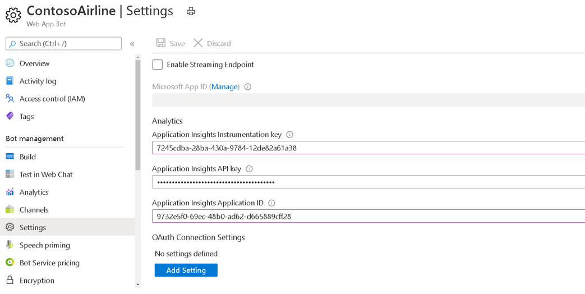

# <a name="single-sign-on-sso-support-for-bots"></a>Unterstützung für einmaliges Anmelden (Single Sign-On, SSO) für Bots

Die einmalige Anmeldungsauthentifizierung in Azure Active Directory (AAD) minimiert die Anzahl der Benutzer, die ihre Anmeldeinformationen eingeben müssen, indem das Authentifizierungstoken automatisch aktualisiert wird. Wenn Benutzer der Verwendung Ihrer App zustimmen, müssen sie nicht erneut auf einem anderen Gerät zustimmen und können sich automatisch anmelden. Der Ablauf ähnelt dem der [Microsoft Teams-Registerkarten-SSO-Unterstützung,](../../../tabs/how-to/authentication/auth-aad-sso.md)der Unterschied besteht jedoch im Protokoll, wie ein Bot Token [anfordert](#request-a-bot-token) und Antworten [empfängt.](#receive-the-bot-token)

>[!NOTE]
> OAuth 2.0 ist ein offener Standard für Authentifizierung und Autorisierung, der von AAD und vielen anderen Identitätsanbietern verwendet wird. Ein grundlegendes Verständnis von OAuth 2.0 ist eine Voraussetzung für die Arbeit mit der Authentifizierung in Teams.

## <a name="bot-sso-at-runtime"></a>Bot-SSO zur Laufzeit


Führen Sie die folgenden Schritte aus, um Authentifizierungs- und Botanwendungstoken abzurufen:

1. Der Bot sendet eine Nachricht mit einer OAuthCard, die die Eigenschaft `tokenExchangeResource` enthält. Es weist Teams an, ein Authentifizierungstoken für die Botanwendung abzurufen. Der Benutzer empfängt Nachrichten an allen aktiven Benutzerendpunkten.

    > [!NOTE]
    >* Ein Benutzer kann mehrere aktive Endpunkte gleichzeitig haben.
    >* Das Bottoken wird von jedem aktiven Benutzerendpunkt empfangen.
    >* Die App muss im persönlichen Bereich für den SSO-Support installiert werden.

2. Wenn der aktuelle Benutzer Ihre Botanwendung zum ersten Mal verwendet, wird eine Anforderungsaufforderung angezeigt, in der der Benutzer aufgefordert wird, eine der folgenden Schritte zu tun:
    * Geben Sie bei Bedarf ihre Zustimmung ein.
    * Behandeln Sie die Step-Up-Authentifizierung, z. B. die zweistufige Authentifizierung.

3. Teams fordert das Botanwendungstoken vom AAD-Endpunkt für den aktuellen Benutzer an.

4. AAD sendet das Botanwendungstoken an die Teams-Anwendung.

5. Teams sendet das Token an den Bot als Teil des Wertobjekts, das von der Aufrufaktivität mit dem Namen **sign-in/tokenExchange zurückgegeben wird.**
  
6. Das analysierte Token in der Botanwendung enthält die erforderlichen Informationen, z. B. die E-Mail-Adresse des Benutzers.
  
## <a name="develop-an-sso-teams-bot"></a>Entwickeln eines SSO Teams-Bots
  
Führen Sie die folgenden Schritte aus, um einen SSO Teams-Bot zu entwickeln:

1. [Registrieren Sie Ihre App über das AAD-Portal.](#register-your-app-through-the-aad-portal)
2. [Aktualisieren Sie Ihr Teams-Anwendungsmanifest für Ihren Bot.](#update-your-teams-application-manifest-for-your-bot)
3. [Fügen Sie den Code zum Anfordern und Empfangen eines Bottokens hinzu.](#add-the-code-to-request-and-receive-a-bot-token)

### <a name="register-your-app-through-the-aad-portal"></a>Registrieren Ihrer App über das AAD-Portal

Die Schritte zum Registrieren Ihrer App über das AAD-Portal ähneln dem [Registerkarten-SSO-Fluss](../../../tabs/how-to/authentication/auth-aad-sso.md). Führen Sie die folgenden Schritte aus, um Ihre App zu registrieren:

1. Registrieren Sie eine neue Anwendung im [Azure Active Directory – App Registrations-Portal.](https://go.microsoft.com/fwlink/?linkid=2083908)
2. Wählen **Sie Neue Registrierung aus.** Die **Seite Anwendung registrieren** wird angezeigt.
3. Geben Sie **auf der Seite** Anwendung registrieren die folgenden Werte ein:
    1. Geben Sie einen **Namen** für Ihre App ein.
    2. Wählen Sie **die Unterstützten Kontotypen** aus, wählen Sie einzelnen Mandanten- oder mehrstufigen Kontotyp aus.

        > [!NOTE]
        >
        > Die Benutzer werden nicht um Zustimmung gebeten und erhalten sofort Zugriffstoken, wenn die AAD-App im selben Mandanten registriert ist, in dem sie eine Authentifizierungsanforderung in Teams stellen. Die Benutzer müssen jedoch den Berechtigungen zustimmen, wenn die AAD-App in einem anderen Mandanten registriert ist.

    3. Wählen Sie **Registrieren** aus.
4. Kopieren und speichern Sie auf der Übersichtsseite die **Anwendungs-ID (Client-ID).** Sie benötigen sie später beim Aktualisieren Ihres Teams-Anwendungsmanifests.
5. Wählen Sie unter **Verwalten** die Option **Eine API verfügbar machen** aus. 

   > [!IMPORTANT]
    > * Wenn Sie einen eigenständigen Bot erstellen, geben Sie den Anwendungs-ID-URI als `api://botid-{YourBotId}` ein. Hier **ist YourBotId** Ihre AAD-Anwendungs-ID.
    > * Wenn Sie eine App mit einem Bot und einer Registerkarte erstellen, geben Sie den Anwendungs-ID-URI als `api://fully-qualified-domain-name.com/botid-{YourBotId}` ein.

5. Wählen Sie die Berechtigungen aus, die Ihre Anwendung für den AAD-Endpunkt und optional für Microsoft Graph benötigt.
6. [Erteilen von Berechtigungen](/azure/active-directory/develop/v2-permissions-and-consent) für Desktop-, Web- und mobile Anwendungen von Teams.
7. Wählen Sie **Bereich hinzufügen**.
8. Fügen Sie in dem geöffneten Bereich eine Client-App hinzu, indem Sie `access_as_user` als **Bereichsname eingeben.**

    >[!NOTE]
    > Der bereich "access_as_user", der zum Hinzufügen einer Client-App verwendet wird, ist für "Administratoren und Benutzer".
    >
    > Beachten Sie die folgenden wichtigen Einschränkungen:
    >
    > * Es werden nur Microsoft Graph-API-Berechtigungen auf Benutzerebene unterstützt, z. B. E-Mail, Profil, offline_access und OpenId. Wenn Sie Zugriff auf andere Microsoft Graph-Bereiche benötigen, z. B. oder , finden Sie `User.Read` `Mail.Read` unter empfohlene [Problemumgehung](../../../tabs/how-to/authentication/auth-aad-sso.md#apps-that-require-additional-microsoft-graph-scopes).
    > * Der Domänenname Ihrer Anwendung muss mit dem Domänennamen identisch sein, den Sie für Ihre AAD-Anwendung registriert haben.
    > * Mehrere Domänen pro App werden derzeit nicht unterstützt.
    > * Anwendungen, die die Domäne verwenden, werden `azurewebsites.net` nicht unterstützt, da sie häufig verwendet werden und möglicherweise ein Sicherheitsrisiko darstellen.

#### <a name="update-the-azure-portal-with-the-oauth-connection"></a>Aktualisieren des Azure-Portals mit der OAuth-Verbindung

Führen Sie die folgenden Schritte aus, um das Azure-Portal mit der OAuth-Verbindung zu aktualisieren:

1. Navigieren Sie im Azure-Portal zu **App-Registrierungen**.

2. Wechseln Sie zu **API-Berechtigungen**. Wählen **Sie Microsoft** Graph Delegierte Berechtigungen hinzufügen aus, und fügen Sie dann die folgenden Berechtigungen aus der Microsoft  >    >  Graph-API hinzu:
    * User.Read (standardmäßig aktiviert)
    * E-Mail
    * offline_access
    * OpenId
    * Profil

3. Navigieren Sie im Azure-Portal zu **Bot Channels Registration**.

4. Wählen **Sie im** linken Bereich Einstellungen aus, und wählen Sie **Im** Abschnitt **OAuth-Verbindungseinstellungen** die Option Einstellung hinzufügen aus.

    

5. Führen Sie die folgenden Schritte aus, um das **Formular Neue Verbindungseinstellung auszufüllen:**

    >[!NOTE]
    > **Möglicherweise ist in** der AAD-Anwendung eine implizite Erteilung erforderlich.

    1. Geben Sie **auf der** Seite **Neue Verbindungseinstellung einen Namen** ein. Dies ist der Name, auf den in den Einstellungen Ihres Botdienstcodes in *Schritt 5* von Bot SSO zur Laufzeit [verwiesen wird.](#bot-sso-at-runtime)
    2. Wählen Sie **in der** Dropdownliste Dienstanbieter die Option Azure Active **Directory v2 aus.**
    3. Geben Sie die Clientanmeldeinformationen ein, z. B. **Client-ID** und **geheimer Client für** die AAD-Anwendung.
    4. Verwenden Sie **für die Token Exchange-URL** den unter [Update your Teams application manifest for your bot definierten Bereichswert.](#update-your-teams-application-manifest-for-your-bot) Die Token-Exchange-URL gibt dem SDK an, dass diese AAD-Anwendung für SSO konfiguriert ist.
    5. Geben Sie **im Feld Mandanten-ID** gemeinsame *ein.*
    6. Fügen Sie alle **Bereiche hinzu,** die beim Angeben von Berechtigungen für downstream-APIs für Ihre AAD-Anwendung konfiguriert sind. Wenn die Client-ID und der geheime Clientgeheimnis angegeben sind, tauscht der Tokenspeicher das Token durch ein Diagrammtoken mit definierten Berechtigungen aus.
    7. Klicken Sie auf **Speichern**.

    

### <a name="update-your-teams-application-manifest-for-your-bot"></a>Aktualisieren Ihres Teams-Anwendungsmanifests für Ihren Bot

Wenn die Anwendung einen eigenständigen Bot enthält, verwenden Sie den folgenden Code, um dem Anwendungsmanifest von Teams neue Eigenschaften hinzuzufügen:

```json
    "webApplicationInfo": 
        {
            "id": "00000000-0000-0000-0000-000000000000",
            "resource": "api://botid-00000000-0000-0000-0000-000000000000"
        }
```
Wenn die Anwendung einen Bot und eine Registerkarte enthält, verwenden Sie den folgenden Code, um dem Anwendungsmanifest von Teams neue Eigenschaften hinzuzufügen:

```json
    "webApplicationInfo": 
        {
            "id": "00000000-0000-0000-0000-000000000000",
            "resource": "api://subdomain.example.com/botid-00000000-0000-0000-0000-000000000000"
        }
```

**webApplicationInfo** ist das übergeordnete Element der folgenden Elemente:

* **id** – Die Client-ID der Anwendung. Dies ist die Anwendungs-ID, die Sie im Rahmen der Registrierung der Anwendung bei AAD erhalten haben.
* **resource** – Die Domäne und Unterdomäne Ihrer Anwendung. Dies ist derselbe URI, einschließlich des Protokolls, das Sie beim Erstellen Ihrer in Registrieren Ihrer App `api://` `scope` über das [AAD-Portal registriert haben.](#register-your-app-through-the-aad-portal) Sie dürfen den Pfad `access_as_user` nicht in Ihre Ressource verwenden. Der Domänenteil dieses URI muss mit der Domäne und den Unterdomänen übereinstimmen, die in den URLs Ihres Teams-Anwendungsmanifests verwendet werden.

### <a name="add-the-code-to-request-and-receive-a-bot-token"></a>Hinzufügen des Codes zum Anfordern und Empfangen eines Bottokens

#### <a name="request-a-bot-token"></a>Anfordern eines Bottokens

Die Anforderung, das Token abzurufen, ist eine normale POST-Nachrichtenanforderung unter Verwendung des vorhandenen Nachrichtenschemas. Sie ist in den Anlagen einer OAuthCard enthalten. Das Schema für die OAuthCard-Klasse ist in [Microsoft Bot Schema 4.0](/dotnet/api/microsoft.bot.schema.oauthcard?view=botbuilder-dotnet-stable&preserve-view=true) definiert und ähnelt einer Anmeldekarte. Teams behandelt diese Anforderung als automatischen Tokenerwerb, wenn die `TokenExchangeResource` Eigenschaft auf der Karte aufgefüllt wird. Für den Teams-Kanal wird nur die Eigenschaft berücksichtigt, die eine Tokenanforderung `Id` eindeutig identifiziert.

>[!NOTE]
> Das Microsoft Bot Framework `OAuthPrompt` oder das wird für die `MultiProviderAuthDialog` SSO-Authentifizierung unterstützt.

Wenn der Benutzer die Anwendung zum ersten Mal verwendet und die Zustimmung des Benutzers erforderlich ist, wird das folgende Dialogfeld mit der Zustimmung fortgesetzt:


Wenn der Benutzer Weiter **auswählt,** treten die folgenden Ereignisse auf:

* Wenn der Bot eine Anmeldeschaltfläche definiert, wird der Anmeldefluss für Bots ähnlich wie der Anmeldefluss von einer OAuth-Kartenschaltfläche in einem Nachrichtenstrom ausgelöst. Der Entwickler muss entscheiden, welche Berechtigungen die Zustimmung des Benutzers erfordern. Dieser Ansatz wird empfohlen, wenn Sie ein Token mit Berechtigungen benötigen, die über `openId` hinausgehen. Wenn Sie beispielsweise das Token gegen Graphressourcen austauschen möchten.

* Wenn der Bot keine Anmeldeschaltfläche auf der OAuth-Karte zur Verfügung stellt, ist die Zustimmung des Benutzers für einen minimalen Satz von Berechtigungen erforderlich. Dieses Token ist nützlich für die Standardauthentifizierung und zum Erhalten der E-Mail-Adresse des Benutzers.

##### <a name="c-token-request-without-a-sign-in-button"></a>C# Tokenanforderung ohne Anmeldeschaltfläche

```csharp
    var attachment = new Attachment
            {
                Content = new OAuthCard
                {
                    TokenExchangeResource = new TokenExchangeResource
                    {
                        Id = requestId
                    }
                },
                ContentType = OAuthCard.ContentType,
            };
            var activity = MessageFactory.Attachment(attachment);

            // NOTE: This activity needs to be sent in the 1:1 conversation between the bot and the user. 
            // If the bot supports group and channel scope, this code should be updated to send the request to the 1:1 chat. 

       await turnContext.SendActivityAsync(activity, cancellationToken);
```

#### <a name="receive-the-bot-token"></a>Empfangen des Bottokens

Die Antwort mit dem Token wird über eine Aufrufaktivität mit demselben Schema wie andere Aufrufaktivitäten gesendet, die bots heute erhalten. Der einzige Unterschied ist der Aufrufname, **die Anmeldung/tokenExchange** und das **Wertfeld.** Das **Wertfeld** enthält die **ID**, eine Zeichenfolge der  ursprünglichen Anforderung zum Abzurufen des Tokens und des Tokenfelds, einen Zeichenfolgenwert einschließlich des Tokens.

>[!NOTE]
> Möglicherweise erhalten Sie mehrere Antworten für eine bestimmte Anforderung, wenn der Benutzer über mehrere aktive Endpunkte verfügt. Sie müssen die Antworten mit dem Token deduplizieren.

##### <a name="c-code-to-handle-the-invoke-activity"></a>C# zum Behandeln der Aufrufaktivität

```csharp
    protected override async Task<InvokeResponse> OnInvokeActivityAsync
    (ITurnContext<IInvokeActivity> turnContext, CancellationToken cancellationToken)
            {
                try
                {
                    if (turnContext.Activity.Name == SignInConstants.TokenExchangeOperationName && turnContext.Activity.ChannelId == Channels.Msteams)
                    {
                        await OnTokenResponseEventAsync(turnContext, cancellationToken);
                        return new InvokeResponse() { Status = 200 };
                    }
                    else
                    {
                        return await base.OnInvokeActivityAsync(turnContext, cancellationToken);
                    }
                }
                catch (InvokeResponseException e)
                {
                    return e.CreateInvokeResponse();
                }
            }
```

The `turnContext.activity.value` is of type [TokenExchangeInvokeRequest](/dotnet/api/microsoft.bot.schema.tokenexchangeinvokerequest?view=botbuilder-dotnet-stable&preserve-view=true) and contains the token that can be further used by your bot. Sie müssen die Token aus Leistungsgründen speichern und aktualisieren.

### <a name="token-exchange-failure"></a>Tokenaustauschfehler

Verwenden Sie im Falle eines Tokenaustauschfehlers den folgenden Code:

```json
{ 
    "status": "<response code>", 
    "body": 
    { 
        "id":"<unique Id>", 
        "connectionName": "<connection Name on the bot (from the OAuth card)>", 
        "failureDetail": "<failure reason if status code is not 200, null otherwise>" 
    } 
}
```

Informationen zu den Aktionen des Bots, wenn der Tokenaustausch keine Zustimmungsaufforderung auslöst, finden Sie in den folgenden Schritten:

>[!NOTE]
> Es ist keine Benutzeraktion erforderlich, wenn der Bot die Aktionen ergreift, wenn der Tokenaustausch fehlschlägt.

1. Der Client startet eine Unterhaltung mit dem Bot, der ein OAuth-Szenario auslöst.
2. Der Bot sendet eine OAuth-Karte an den Client zurück.
3. Der Client fängt die OAuth-Karte ab, bevor sie dem Benutzer angezeigt wird, und überprüft, ob sie eine Eigenschaft `TokenExchangeResource` enthält.
4. Wenn die Eigenschaft vorhanden ist, sendet der Client eine `TokenExchangeInvokeRequest` an den Bot. Der Client muss über ein auswechselbares Token für den Benutzer verfügen, das ein Azure AD v2-Token sein muss und dessen Benutzergruppe mit der Eigenschaft identisch sein `TokenExchangeResource.Uri` muss. Der Client sendet eine Aufrufaktivität mit dem folgenden Code an den Bot:

    ```json
    {
        "type": "Invoke",
        "name": "signin/tokenExchange",
        "value": 
        {
            "id": "<any unique Id>",
            "connectionName": "<connection Name on the skill bot (from the OAuth card)>",
            "token": "<exchangeable token>"
        }
    }
    ```

5. Der Bot verarbeitet das `TokenExchangeInvokeRequest` und gibt einen Zurück an den Client `TokenExchangeInvokeResponse` zurück. Der Client muss warten, bis er den `TokenExchangeInvokeResponse` empfängt.

    ```json
    {
        "status": "<response code>",
        "body": 
        {
            "id":"<unique Id>",
            "connectionName": "<connection Name on the skill bot (from the OAuth card)>",
            "failureDetail": "<failure reason if status code is not 200, null otherwise>"
        }
    }
    ```

6. Wenn der über einen von verfügt, zeigt der `TokenExchangeInvokeResponse` `status` Client die `200` OAuth-Karte nicht an. Siehe das [normale Flussbild](/azure/bot-service/bot-builder-concept-sso?view=azure-bot-service-4.0#sso-components-interaction&preserve-view=true). Für andere Benutzer oder wenn die nicht empfangen wird, zeigt der Client dem Benutzer die `status` `TokenExchangeInvokeResponse` OAuth-Karte an. Weitere Informationen [finden Sie im Fallbackflussbild](/azure/bot-service/bot-builder-concept-sso?view=azure-bot-service-4.0#sso-components-interaction&preserve-view=true). Dadurch wird sichergestellt, dass der SSO-Fluss bei Fehlern oder nicht errungenen Abhängigkeiten wie der Zustimmung des Benutzers auf den normalen OAuthCard-Fluss zurückfällt.


### <a name="update-the-auth-sample"></a>Aktualisieren des Authentifizierungsbeispiels

Öffnen [Sie das Beispiel für die Authentifizierung von](https://github.com/microsoft/BotBuilder-Samples/tree/master/samples/csharp_dotnetcore/46.teams-auth) Teams, und führen Sie die folgenden Schritte aus, um es zu aktualisieren:

1. Aktualisieren Sie den TeamsBot, um die Deduping der eingehenden Anforderung zu verarbeiten, indem Sie den folgenden Code verwenden:

    ```csharp
        protected override async Task OnSignInInvokeAsync(ITurnContext<IInvokeActivity> turnContext, CancellationToken cancellationToken)
            {
                await Dialog.RunAsync(turnContext, ConversationState.CreateProperty<DialogState>(nameof(DialogState)), cancellationToken);
            }
        protected override async Task OnTokenResponseEventAsync(ITurnContext<IEventActivity> turnContext, CancellationToken cancellationToken)
            {
                await Dialog.RunAsync(turnContext, ConversationState.CreateProperty<DialogState>(nameof(DialogState)), cancellationToken);
            }
    ```
  
2. Aktualisieren Sie, um das , Kennwort und den unter Aktualisieren des Azure-Portals mit der OAuth-Verbindung definierten `appsettings.json` `botId` [Verbindungsnamen zu verwenden.](#update-the-azure-portal-with-the-oauth-connection)
3. Aktualisieren Sie das Manifest, und `token.botframework.com` stellen Sie sicher, dass es sich in der Liste der gültigen Domänen befindet. Weitere Informationen finden Sie unter [Teams auth sample](https://github.com/microsoft/BotBuilder-Samples/tree/master/samples/csharp_dotnetcore/46.teams-auth).
4. Zip the manifest with the profile images and install it in Teams.

## <a name="code-sample"></a>Codebeispiel
|**Beispielname** | **Beschreibung** |**.NET** | 
|----------------|-----------------|--------------|
|Bot framework SDK | Beispiel für die Verwendung des Bot-Framework-SDK. |[View](https://github.com/microsoft/BotBuilder-Samples/tree/main/experimental/teams-sso/csharp_dotnetcore)|
