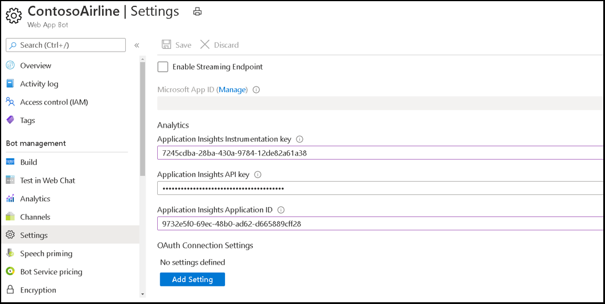

# <a name="single-sign-on-sso-support-for-bots"></a>SSO-Unterstützung (Single Sign-On) für Bots

Die einmalige Anmeldeauthentifizierung in Azure Active Directory (AAD) minimiert die Häufigkeit, mit der Benutzer ihre Anmeldeinformationen eingeben müssen, indem das Authentifizierungstoken automatisch aktualisiert wird. Wenn Benutzer der Verwendung Ihrer App zustimmen, müssen sie auf einem anderen Gerät keine erneute Zustimmung erteilen und können sich automatisch anmelden. Der Flow ähnelt dem [der Microsoft Teams Registerkarte SSO-Unterstützung](../../../tabs/how-to/authentication/auth-aad-sso.md), der Unterschied besteht jedoch im Protokoll, wie ein Bot Token [anfordert](#request-a-bot-token) und [Antworten empfängt.](#receive-the-bot-token)

>[!NOTE]
> OAuth 2.0 ist ein offener Standard für die Authentifizierung und Autorisierung, der von AAD und vielen anderen Identitätsanbietern verwendet wird. Ein grundlegendes Verständnis von OAuth 2.0 ist eine Voraussetzung für die Arbeit mit der Authentifizierung in Teams.

## <a name="bot-sso-at-runtime"></a>Bot SSO zur Laufzeit


Führen Sie die folgenden Schritte aus, um Authentifizierungs- und Botanwendungstoken abzurufen:

1. Der Bot sendet eine Nachricht mit einer OAuthCard, welche die `tokenExchangeResource`-Eigenschaft enthält. Es weist Teams an, ein Authentifizierungstoken für die Bot-Anwendung zu erhalten. Der Benutzer erhält auf allen aktiven Benutzerendpunkten Nachrichten.

    > [!NOTE]
    >* Ein Benutzer kann mehrere aktive Endpunkte gleichzeitig haben.
    >* Der Bot-Token wird von jedem aktiven Benutzerendpunkt erhalten.
    >* Die App muss für SSO-Support im persönlichen Bereich installiert sein.

1. Wenn der aktuelle Benutzer Ihre Bot-Anwendung zum ersten Mal verwendet, wird eine Anforderungsaufforderung angezeigt, die den Benutzer auffordert, eine der folgenden Schritte zu tun:
    * Geben Sie ggf. ihre Zustimmung ein.
    * Erhöhte Authentifizierung durchführen, z. B. die zweistufige Authentifizierung.

1. Teams fordert das Bot-Anwendungstoken vom AAD-Endpunkt für den aktuellen Benutzer an.

1. AAD sendet das Bot-Anwendungstoken an die Teams-Anwendung.

1. Teams sendet das Token als Teil des Wertobjekts an den Bot, das von der Aufrufaktivität mit dem Namen **sign-in/tokenExchange** zurückgegeben wird.
  
1. Das analysierte Token in der Bot-Anwendung stellt die erforderlichen Informationen zur Verfügung, wie z. B. die E-Mail-Adresse des Benutzers.
  
## <a name="develop-an-sso-teams-bot"></a>Entwickeln eines SSO-Teams-Bots
  
Führen Sie die folgenden Schritte aus, um einen SSO-Teams-Bot zu entwickeln:

1. [Registrieren Sie Ihre App über das AAD-Portal](#register-your-app-through-the-aad-portal).
1. [Aktualisieren Sie Ihr Teams Anwendungsmanifest für Ihren Bot](#update-your-teams-application-manifest-for-your-bot).
1. [Fügen Sie den Code hinzu, um ein Bot-Token anzufordern und zu empfangen.](#add-the-code-to-request-and-receive-a-bot-token)

### <a name="register-your-app-through-the-aad-portal"></a>Registrieren Ihrer App über das AAD-Portal

Die Schritte zum Registrieren Ihrer App über das AAD-Portal ähneln der [Registerkarte SSO-Fluss](../../../tabs/how-to/authentication/auth-aad-sso.md). Führen Sie die folgenden Schritte aus, um Ihre App zu registrieren:

1. Registrieren Sie eine neue Anwendung im [Azure Active Directory – App Registrations](https://go.microsoft.com/fwlink/?linkid=2083908) Portal.
2. Wählen Sie **Neue Registrierung**. Die **Registrierungsseite für eine Anwendung** wird angezeigt.
3. Geben Sie auf der **Seite Registrieren einer Anwendung** die folgenden Werte ein:
    1. Geben Sie einen **Namen** für Ihre App ein.
    2. Wählen Sie die **unterstützten Kontotypen** aus, und wählen Sie den Kontotyp für einzelne Mandanten oder mehrere Mandanten aus.

        > [!NOTE]
        >
        > Die Benutzer werden nicht um Zustimmung gebeten und erhalten sofort Zugriffstoken, wenn die AAD-App in demselben Mandanten registriert ist, in dem sie eine Authentifizierungsanforderung in Teams stellen. Die Benutzer müssen jedoch die Zustimmung zu den Berechtigungen erteilen, wenn die AAD-App in einem anderen Mandanten registriert ist.

    3. Wählen Sie **Registrieren** aus.
4. Kopieren und speichern Sie auf der Übersichtsseite die **Anwendungs-ID (Client).** Sie benötigen sie später, wenn Sie Ihr Teams Anwendungsmanifest aktualisieren.
5. Wählen Sie unter **Verwalten** die Option **Eine API verfügbar machen** aus. 

   > [!IMPORTANT]
    > * Wenn Sie einen eigenständigen Bot erstellen, geben Sie den Application ID-URI als `api://botid-{YourBotId}` ein. Hier ist **YourBotId** Ihre AAD-Anwendungs-ID.
    > * Wenn Sie eine App mit einem Bot und einer Registerkarte erstellen, geben Sie den Anwendungs-ID-URI als `api://fully-qualified-domain-name.com/botid-{YourBotId}` ein.

5. Wählen Sie die Berechtigungen aus, die Ihre Anwendung für den AAD-Endpunkt und optional für Microsoft-Graph benötigt.
6. [Erteilen Sie Berechtigungen](/azure/active-directory/develop/v2-permissions-and-consent) für Teams Desktop-, Web- und mobilen Anwendungen.
7. Wählen Sie **Bereich hinzufügen**.
8. Fügen Sie im geöffneten Bereich eine Client-App hinzu, indem Sie `access_as_user` sie als **Bereichsnamen eingeben.**

    >[!NOTE]
    > Der Bereich "access_as_user", der zum Hinzufügen einer Client-App verwendet wird, ist für "Administratoren und Benutzer".
    >
    > Sie müssen die folgenden wichtigen Einschränkungen beachten:
    >
    > * Nur Microsoft-Graph-BERECHTIGUNGEN auf Benutzerebene, z. B. E-Mail, Profil, offline_access und OpenId, werden unterstützt. Wenn Sie Zugriff auf andere Microsoft-Graph Bereichen benötigen, z. B. oder , finden Sie `User.Read` `Mail.Read` unter Empfohlene [Problemumgehung](../../../tabs/how-to/authentication/auth-aad-sso.md#apps-that-require-additional-graph-scopes).
    > * Der Domänenname Ihrer Anwendung muss mit dem Domänennamen identisch sein, den Sie für Ihre AAD-Anwendung registriert haben.
    > * Mehrere Domänen pro App werden derzeit nicht unterstützt.
    > * Anwendungen, die die Domäne verwenden, `azurewebsites.net` werden nicht unterstützt, da sie häufig vorkommt und möglicherweise ein Sicherheitsrisiko darstellen.

#### <a name="update-the-azure-portal-with-the-oauth-connection"></a>Aktualisieren des Azure-Portals mit der OAuth-Verbindung

Führen Sie die folgenden Schritte aus, um das Azure-Portal mit der OAuth-Verbindung zu aktualisieren:

1. Navigieren Sie im Azure-Portal zu **App-Registrierungen**.

2. Wechseln Sie zu **API-Berechtigungen**. Wählen Sie Berechtigung  >  **hinzufügen aus, die Microsoft Graph** Delegierte Berechtigungen , und fügen Sie dann die folgenden Berechtigungen aus der Microsoft  >  Graph-API hinzu:
    * User.Read (standardmäßig aktiviert)
    * email
    * offline_access
    * Openid
    * Profil

3. Navigieren Sie im Azure-Portal zu **Bot Channels Registration**.

4. Wählen Sie **Einstellungen** im linken Bereich aus, und wählen Sie **Einstellung** hinzufügen unter dem Abschnitt **OAuth-Verbindung Einstellungen** aus.

    

5. Führen Sie die folgenden Schritte aus, um das Formular **Neue Verbindungseinstellung** auszufüllen:

    >[!NOTE]
    > **Implizite Zuschüsse** können im AAD-Antrag erforderlich sein.

    1. Geben Sie einen **Namen** auf der Seite **Neue Verbindungseinstellung** ein. Dies ist der Name, auf den in den Einstellungen Ihres Bot-Servicecodes in *Schritt 5* von [Bot SSO zur Laufzeit](#bot-sso-at-runtime)verwiesen wird.
    2. Wählen Sie in der Dropdown-Liste **Dienstanbieter** **Azure Active Directory v2** aus.
    3. Geben Sie die Clientanmeldeinformationen ein, z. B. **Client-ID** und **geheime Client-Id** für die AAD-Anwendung.
    4. Verwenden Sie für die **Token-Exchange-URL** den Bereichswert, der in [Teams Anwendungsmanifest für Ihren Bot](#update-your-teams-application-manifest-for-your-bot)aktualisiert definiert ist. Die Token-Exchange-URL gibt dem SDK an, dass diese AAD-Anwendung für SSO konfiguriert ist.
    5. Geben Sie im Feld **Mandanten-ID** *die gemeinsame* ein.
    6. Fügen Sie alle **Bereiche** hinzu, die beim Angeben von Berechtigungen für downstream APIs für Ihre AAD-Anwendung konfiguriert sind. Wenn die Client-ID und der geheime Client-Schlüssel bereitgestellt werden, tauscht der Token das Token gegen ein Diagrammtoken mit definierten Berechtigungen aus.
    7. Klicken Sie auf **Speichern**.

    

### <a name="update-your-teams-application-manifest-for-your-bot"></a>Aktualisieren Sie Ihr Teams Anwendungsmanifest für Ihren Bot

Wenn die Anwendung einen eigenständigen Bot enthält, verwenden Sie den folgenden Code, um dem Teams Anwendungsmanifest neue Eigenschaften hinzuzufügen:

```json
    "webApplicationInfo": 
        {
            "id": "00000000-0000-0000-0000-000000000000",
            "resource": "api://botid-00000000-0000-0000-0000-000000000000"
        }
```
Wenn die Anwendung einen Bot und eine Registerkarte enthält, verwenden Sie den folgenden Code, um dem Teams Anwendungsmanifest neue Eigenschaften hinzuzufügen:

```json
    "webApplicationInfo": 
        {
            "id": "00000000-0000-0000-0000-000000000000",
            "resource": "api://subdomain.example.com/botid-00000000-0000-0000-0000-000000000000"
        }
```

**webApplicationInfo** ist das übergeordnete Element der folgenden Elemente:

* **id** - Die Client-ID der Anwendung. Dies ist die Anwendungs-ID, die Sie im Rahmen der Registrierung der Anwendung bei AAD erhalten haben.
* **Ressource** - Die Domäne und Unterdomäne Ihrer Anwendung. Dies ist derselbe URI, einschließlich des `api://` Protokolls, das Sie beim Erstellen Ihrer App über das `scope` [AAD-Portal](#register-your-app-through-the-aad-portal)registriert haben. Sie dürfen den Pfad nicht `access_as_user` in Ihre Ressource aufnehmen. Der Domänenteil dieses URI muss mit der Domäne und den Subdomänen übereinstimmen, die in den URLs Ihres Teams Anwendungsmanifests verwendet werden.

### <a name="add-the-code-to-request-and-receive-a-bot-token"></a>Hinzufügen des Codes zum Anfordern und Empfangen eines Bot-Tokens

#### <a name="request-a-bot-token"></a>Anfordern eines Bot-Tokens

Die Anforderung zum Abrufen des Tokens ist eine normale POST-Nachrichtenanforderung unter Verwendung des vorhandenen Nachrichtenschemas. Es ist in den Anhängen einer OAuthCard enthalten. Das Schema für die OAuthCard-Klasse ist in [Microsoft Bot Schema 4.0](/dotnet/api/microsoft.bot.schema.oauthcard?view=botbuilder-dotnet-stable&preserve-view=true) definiert und ähnelt einer Anmeldekarte. Teams behandelt diese Anforderung als stillen Tokenerwerb, wenn die `TokenExchangeResource` Eigenschaft auf der Karte aufgefüllt wird. Für den Teams Kanal wird nur die `Id` Eigenschaft berücksichtigt, die eine Tokenanforderung eindeutig identifiziert.

>[!NOTE]
> Die Microsoft Bot Framework oder die wird für die `OAuthPrompt` `MultiProviderAuthDialog` SSO-Authentifizierung unterstützt.

Wenn der Benutzer die Anwendung zum ersten Mal verwendet und die Zustimmung des Benutzers erforderlich ist, wird das folgende Dialogfeld mit der Zustimmungfortgesetzt:


Wenn der Benutzer **Weiter** auswählt, treten die folgenden Ereignisse auf:

* Wenn der Bot eine Anmeldeschaltfläche definiert, wird der Anmeldefluss für Bots ähnlich dem Anmeldefluss von einer OAuth-Kartenschaltfläche in einem Nachrichtenstream ausgelöst. Der Entwickler muss entscheiden, welche Berechtigungen die Zustimmung des Benutzers erfordern. Dieser Ansatz wird empfohlen, wenn Sie ein Token mit Berechtigungen über `openId` benötigen. Wenn Sie z. B. das Token gegen Diagrammressourcen austauschen möchten.

* Wenn der Bot keine Anmeldeschaltfläche auf der OAuth-Karte bereitstellt, ist für einen minimalen Satz von Berechtigungen die Zustimmung des Benutzers erforderlich. Dieses Token ist nützlich für die Standardauthentifizierung und zum Abrufen der E-Mail-Adresse des Benutzers.

##### <a name="c-token-request-without-a-sign-in-button"></a>C-Token-Anforderung ohne Anmeldeschaltfläche

```csharp
    var attachment = new Attachment
            {
                Content = new OAuthCard
                {
                    TokenExchangeResource = new TokenExchangeResource
                    {
                        Id = requestId
                    }
                },
                ContentType = OAuthCard.ContentType,
            };
            var activity = MessageFactory.Attachment(attachment);

            // NOTE: This activity needs to be sent in the 1:1 conversation between the bot and the user. 
            // If the bot supports group and channel scope, this code should be updated to send the request to the 1:1 chat. 

       await turnContext.SendActivityAsync(activity, cancellationToken);
```

#### <a name="receive-the-bot-token"></a>Empfangen des Bot-Tokens

Die Antwort mit dem Token wird über eine Aufrufaktivität mit demselben Schema wie andere Aufrufaktivitäten gesendet, die die Bots heute erhalten. Der einzige Unterschied besteht aus dem Aufrufnamen, **dem Anmelde-/TokenExchange-Feld** und dem **Wertfeld.** Das **Wertfeld** enthält die **ID**, eine Zeichenfolge der ursprünglichen Anforderung zum Abrufen des Tokens und des **Tokenfelds,** einen Zeichenfolgenwert einschließlich des Tokens.

>[!NOTE]
> Möglicherweise erhalten Sie mehrere Antworten für eine bestimmte Anforderung, wenn der Benutzer über mehrere aktive Endpunkte verfügt. Sie müssen die Antworten mit dem Token duplizieren.

##### <a name="c-code-to-handle-the-invoke-activity"></a>Code zum Behandeln der Aufrufaktivität

```csharp
    protected override async Task<InvokeResponse> OnInvokeActivityAsync
    (ITurnContext<IInvokeActivity> turnContext, CancellationToken cancellationToken)
            {
                try
                {
                    if (turnContext.Activity.Name == SignInConstants.TokenExchangeOperationName && turnContext.Activity.ChannelId == Channels.Msteams)
                    {
                        await OnTokenResponseEventAsync(turnContext, cancellationToken);
                        return new InvokeResponse() { Status = 200 };
                    }
                    else
                    {
                        return await base.OnInvokeActivityAsync(turnContext, cancellationToken);
                    }
                }
                catch (InvokeResponseException e)
                {
                    return e.CreateInvokeResponse();
                }
            }
```

Der `turnContext.activity.value` ist vom Typ [TokenExchangeInvokeRequest](/dotnet/api/microsoft.bot.schema.tokenexchangeinvokerequest?view=botbuilder-dotnet-stable&preserve-view=true) und enthält das Token, das von Ihrem Bot weiter verwendet werden kann. Sie müssen die Token aus Leistungsgründen speichern und aktualisieren.

### <a name="token-exchange-failure"></a>Tokenaustauschfehler

Verwenden Sie im Falle eines Tokenaustauschfehlers den folgenden Code:

```json
{ 
    "status": "<response code>", 
    "body": 
    { 
        "id":"<unique Id>", 
        "connectionName": "<connection Name on the bot (from the OAuth card)>", 
        "failureDetail": "<failure reason if status code is not 200, null otherwise>" 
    } 
}
```

Um zu verstehen, was der Bot tut, wenn der Tokenaustausch keine Zustimmungsaufforderung auslöst, lesen Sie die folgenden Schritte:

>[!NOTE]
> Es ist keine Benutzeraktion erforderlich, da der Bot die Aktionen ausführt, wenn der Tokenaustausch fehlschlägt.

1. Der Client beginnt eine Unterhaltung mit dem Bot, die ein OAuth-Szenario auslöst.
2. Der Bot sendet eine OAuth-Karte an den Client zurück.
3. Der Client fängt die OAuth-Karte ab, bevor sie dem Benutzer angezeigt wird, und überprüft, ob sie eine `TokenExchangeResource` Eigenschaft enthält.
4. Wenn die Eigenschaft vorhanden ist, sendet der Client eine `TokenExchangeInvokeRequest` an den Bot. Der Client muss über ein austauschbares Token für den Benutzer verfügen, das ein Azure AD v2-Token sein muss und dessen Zielgruppe mit der Eigenschaft identisch sein `TokenExchangeResource.Uri` muss. Der Client sendet eine Aufrufaktivität mit folgendem Code an den Bot:

    ```json
    {
        "type": "Invoke",
        "name": "signin/tokenExchange",
        "value": 
        {
            "id": "<any unique Id>",
            "connectionName": "<connection Name on the skill bot (from the OAuth card)>",
            "token": "<exchangeable token>"
        }
    }
    ```

5. Der Bot verarbeitet die `TokenExchangeInvokeRequest` und gibt eine `TokenExchangeInvokeResponse` Zurück-Zurück an den Client zurück. Der Client muss warten, bis er die `TokenExchangeInvokeResponse` empfängt.

    ```json
    {
        "status": "<response code>",
        "body": 
        {
            "id":"<unique Id>",
            "connectionName": "<connection Name on the skill bot (from the OAuth card)>",
            "failureDetail": "<failure reason if status code is not 200, null otherwise>"
        }
    }
    ```

6. Wenn der `TokenExchangeInvokeResponse` eine `status` von `200` hat, zeigt der Client die OAuth-Karte nicht an. Siehe [das normale Flow-Bild](/azure/bot-service/bot-builder-concept-sso?view=azure-bot-service-4.0#sso-components-interaction&preserve-view=true). Für andere `status` oder wenn die nicht empfangen `TokenExchangeInvokeResponse` wird, zeigt der Client dem Benutzer die OAuth-Karte an. Siehe [Fallback-Flow-Image](/azure/bot-service/bot-builder-concept-sso?view=azure-bot-service-4.0#sso-components-interaction&preserve-view=true). Dadurch wird sichergestellt, dass der SSO-Fluss bei Fehlern oder unerfüllten Abhängigkeiten wie der Zustimmung des Benutzers auf den normalen OAuthCard-Fluss zurückfällt.


### <a name="update-the-auth-sample"></a>Aktualisieren des Auth-Beispiels

Öffnen Sie [Teams auth-Beispiel,](https://github.com/microsoft/BotBuilder-Samples/tree/master/samples/csharp_dotnetcore/46.teams-auth) und führen Sie dann die folgenden Schritte aus, um es zu aktualisieren:

1. Aktualisieren Sie den TeamsBot, um das Duduping der eingehenden Anforderung zu verarbeiten, indem Sie den folgenden Code einschließen:

    ```csharp
        protected override async Task OnSignInInvokeAsync(ITurnContext<IInvokeActivity> turnContext, CancellationToken cancellationToken)
            {
                await Dialog.RunAsync(turnContext, ConversationState.CreateProperty<DialogState>(nameof(DialogState)), cancellationToken);
            }
        protected override async Task OnTokenResponseEventAsync(ITurnContext<IEventActivity> turnContext, CancellationToken cancellationToken)
            {
                await Dialog.RunAsync(turnContext, ConversationState.CreateProperty<DialogState>(nameof(DialogState)), cancellationToken);
            }
    ```
  
2. Aktualisieren `appsettings.json` Sie, um das `botId` Kennwort und den in Aktualisieren des [Azure-Portals definierten Verbindungsnamen mit der OAuth-Verbindung](#update-the-azure-portal-with-the-oauth-connection)einzuschließen.
3. Aktualisieren Sie das Manifest, und stellen Sie sicher, dass `token.botframework.com` es sich in der Liste der gültigen Domänen befindet. Weitere Informationen finden Sie [unter Teams auth-Beispiel](https://github.com/microsoft/BotBuilder-Samples/tree/master/samples/csharp_dotnetcore/46.teams-auth).
4. Zip das Manifest mit den Profilabbildern und installieren Sie es in Teams.

## <a name="code-sample"></a>Codebeispiel
|**Beispielname** | **Beschreibung** |**.NET** | 
|----------------|-----------------|--------------|
|Bot framework SDK | Beispiel für die Verwendung des Bot Framework SDK. |[View](https://github.com/microsoft/BotBuilder-Samples/tree/main/experimental/teams-sso/csharp_dotnetcore)|
