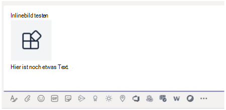

# <a name="send-and-receive-files-through-the-bot"></a>Senden und Empfangen von Dateien über den Bot

> [!IMPORTANT]
> Die Artikel in diesem Dokument basieren auf dem v4 Bot Framework SDK.

Es gibt zwei Möglichkeiten, Dateien an einen Bot zu senden und von diesem zu empfangen:

* **Verwenden der Microsoft Graph-APIs:** Diese Methode funktioniert für Bots in allen Microsoft Teams-Bereich:
  * `personal`
  * `channel`
  * `groupchat`

* **Verwenden der Teams-Bot-APIs:** Diese unterstützen nur Dateien im `personal` Kontext.

## <a name="using-the-graph-apis"></a>Verwenden der Graph-APIs

Posten Sie Nachrichten mit Kartenanlagen, die auf vorhandene #A0 verweisen, mithilfe der #A1 für [OneDrive und SharePoint.](/onedrive/developer/rest-api/) Um die Graph-APIs zu verwenden, erhalten Sie Über den standardmäßigen OAuth 2.0-Autorisierungsfluss Zugriff auf eine der folgenden:
* Der #A0 eines Benutzers für `personal` und `groupchat` dateien.
* Die Dateien im Kanal eines Teams für `channel` Dateien.

Graph-APIs funktionieren in allen Teams-Bereich.

## <a name="using-the-teams-bot-apis"></a>Verwenden der Teams-Bot-APIs

> [!NOTE]
> Teams-Bot-APIs funktionieren nur im `personal` Kontext. Sie funktionieren nicht im `channel` kontextbezogenen `groupchat` Kontext.

Mithilfe von Teams-APIs kann der Bot Dateien direkt mit Benutzern im Kontext senden und empfangen, die auch als `personal` persönliche Chats bezeichnet werden. Implementieren Sie Features wie Spesenabrechnung, Bilderkennung, Dateiarchivierung und E-Signaturen, die die Bearbeitung von Dateiinhalten beinhaltet. In Teams freigegebene Dateien werden in der Regel als Karten angezeigt und ermöglichen eine umfassende Anzeige in der App.

In den folgenden Abschnitten wird beschrieben, wie Dateiinhalte als direkte Benutzerinteraktion wie das Senden einer Nachricht gesendet werden. Diese API wird als Teil der Teams-Bot-Plattform bereitgestellt.

### <a name="configuring-the-bot-to-support-files"></a>Konfigurieren des Bots zur Unterstützung von Dateien

Um Dateien im Bot zu senden und zu empfangen, legen Sie die Eigenschaft `supportsFiles` im Manifest auf `true` . Diese Eigenschaft wird im Abschnitt ["Bots"](~/resources/schema/manifest-schema.md#bots) der Manifestreferenz beschrieben.

Die Definition sieht wie hier aus: `"supportsFiles": true` . Wenn der Bot nicht aktiviert wird, funktionieren die in diesem Abschnitt `supportsFiles` aufgeführten Features nicht.

### <a name="receiving-files-in-personal-chat"></a>Empfangen von Dateien in persönlichen Chats

Wenn ein Benutzer eine Datei an den Bot sendet, wird die Datei zuerst in den OneDrive for #A0 des Benutzers hochgeladen. Der Bot empfängt dann eine Nachrichtenaktivität, die den Benutzer über den Benutzerupload informiert. Die Aktivität enthält Dateimetadaten, z. B. den Namen und die Inhalts-URL. Der Benutzer kann direkt von dieser URL lesen, um dessen binären Inhalt zu erhalten.

#### <a name="message-activity-with-file-attachment-example"></a>Beispiel für Nachrichtenaktivität mit Dateianlage

```json
{
  "attachments": [{
    "contentType": "application/vnd.microsoft.teams.file.download.info",
    "contentUrl": "https://contoso.sharepoint.com/personal/johnadams_contoso_com/Documents/Applications/file_example.txt",
    "name": "file_example.txt",
    "content": {
      "downloadUrl" : "https://download.link",
      "uniqueId": "1150D938-8870-4044-9F2C-5BBDEBA70C9D",
      "fileType": "txt",
      "etag": "123"
    }
  }]
}
```

In der folgenden Tabelle werden die Inhaltseigenschaften der Anlage beschrieben:

| Eigenschaft | Zweck |
| --- | --- |
| `downloadUrl` | OneDrive-URL zum Abrufen des Inhalts der Datei. Der Benutzer kann eine direkt `HTTP GET` von dieser URL aus aussenen. |
| `uniqueId` | Eindeutige Datei-ID. Dies ist die OneDrive-Laufwerkelement-ID, falls der Benutzer eine Datei an den Bot sendet. |
| `fileType` | Dateityp, z. B. PDF oder DOCX. |

Als bewährte Methode sollten Sie den Dateiupload bestätigen, indem Sie eine Nachricht an den Benutzer zurücksenden.

### <a name="uploading-files-to-personal-chat"></a>Hochladen von Dateien in persönliche Chats

Die folgenden Schritte sind erforderlich, um eine Datei an einen Benutzer hochzuladen:

1. Senden Sie eine Nachricht an den Benutzer, der die Berechtigung zum Schreiben der Datei anfordert. Diese Nachricht muss eine Anlage `FileConsentCard` mit dem Namen der hochladenen Datei enthalten.
2. Wenn der Benutzer den Dateidownload akzeptiert, empfängt der Bot eine Aufrufaktivität mit einer Orts-URL.
3. Um die Datei zu übertragen, führt der Bot eine `HTTP POST` direkt in die bereitgestellte Speicherort-URL aus.
4. Entfernen Sie optional die ursprüngliche Zustimmungskarte, wenn Sie nicht möchten, dass der Benutzer weitere Uploads derselben Datei akzeptiert.

#### <a name="message-requesting-permission-to-upload"></a>Nachricht, die die Berechtigung zum Hochladen anfordert

Die folgende Desktopnachricht enthält ein einfaches Anlagenobjekt, das die Benutzerberechtigung zum Hochladen der Datei anfordert:


Die folgende Mobiltelefonnachricht enthält ein Anlagenobjekt, das die Benutzerberechtigung zum Hochladen der Datei anfordert:


```json
{
  "attachments": [{
    "contentType": "application/vnd.microsoft.teams.card.file.consent",
    "name": "file_example.txt",
    "content": {
      "description": "<Purpose of the file, such as: this is your monthly expense report>",
      "sizeInBytes": 1029393,
      "acceptContext": {
      },
      "declineContext": {
      }
    }
  }]
}
```

In der folgenden Tabelle werden die Inhaltseigenschaften der Anlage beschrieben:

| Eigenschaft | Zweck |
| --- | --- |
| `description` | Beschreibt den Zweck der Datei oder fasst den Inhalt zusammen. |
| `sizeInBytes` | Stellt dem Benutzer eine Schätzung der Dateigröße und des Speicherplatzes in OneDrive zur Verfügung. |
| `acceptContext` | Zusätzlicher Kontext, der automatisch an den Bot übermittelt wird, wenn der Benutzer die Datei annimmt. |
| `declineContext` | Zusätzlicher Kontext, der automatisch an den Bot übermittelt wird, wenn der Benutzer die Datei abgibt. |

#### <a name="invoke-activity-when-the-user-accepts-the-file"></a>Aktivität aufrufen, wenn der Benutzer die Datei annimmt

Eine Aufrufaktivität wird an den Bot gesendet, wenn und wann der Benutzer die Datei annimmt. Sie enthält die OneDrive for Business-Platzhalter-URL, die der Bot dann ausgibt, `PUT` um den Dateiinhalt zu übertragen. Informationen zum Hochladen auf die OneDrive-URL finden Sie unter [Hochladen von Bytes in die Uploadsitzung.](/onedrive/developer/rest-api/api/driveitem_createuploadsession#upload-bytes-to-the-upload-session)

Das folgende Beispiel zeigt eine kurze Version der Aufrufaktivität, die der Bot empfängt:

```json
{
  "name": "fileConsent/invoke",
  "value": {
    "type": "fileUpload",
    "action": "accept",
    "context": {
    },
    "uploadInfo": {
      "contentUrl": "https://contoso.sharepoint.com/personal/johnadams_contoso_com/Documents/Applications/file_example.txt",
      "name": "file_example.txt",
      "uploadUrl": "https://upload.link",
      "uniqueId": "1150D938-8870-4044-9F2C-5BBDEBA70C8C",
      "fileType": "txt",
      "etag": "123"
    }
  }
}
```

Ebenso empfängt der Bot das folgende Ereignis mit demselben Allgemeinen Aktivitätsnamen, wenn der Benutzer die Datei abgibt:

```json
{
  "name": "fileConsent/invoke",
  "value": {
    "type": "fileUpload",
    "action": "decline",
    "context": {
    }
  }
}
```

### <a name="notifying-the-user-about-an-uploaded-file"></a>Benachrichtigen des Benutzers über eine hochgeladene Datei

Nachdem Sie eine Datei auf das OneDrive des Benutzers hochgeladen haben, senden Sie eine Bestätigungsnachricht an den Benutzer. Die Nachricht muss die folgende Anlage enthalten, die der Benutzer auswählen kann, um eine Vorschau anzuzeigen oder sie in OneDrive zu öffnen oder lokal `FileCard` herunterzuladen:

```json
{
  "attachments": [{
    "contentType": "application/vnd.microsoft.teams.card.file.info",
    "contentUrl": "https://contoso.sharepoint.com/personal/johnadams_contoso_com/Documents/Applications/file_example.txt",
    "name": "file_example.txt",
    "content": {
      "uniqueId": "1150D938-8870-4044-9F2C-5BBDEBA70C8C",
      "fileType": "txt",
    }
  }]
}
```

In der folgenden Tabelle werden die Inhaltseigenschaften der Anlage beschrieben:

| Eigenschaft | Zweck |
| --- | --- |
| `uniqueId` | OneDrive- oder SharePoint-Laufwerkelement-ID. |
| `fileType` | Dateityp, z. B. PDF oder DOCX. |

### <a name="fetching-inline-images-from-message"></a>Abrufen von Inlinebildern aus einer Nachricht

Rufen Sie Inlinebilder ab, die Teil der Nachricht sind, indem Sie das Zugriffstoken des Bots verwenden.



```csharp
private async Task ProcessInlineImage(ITurnContext<IMessageActivity> turnContext, CancellationToken cancellationToken)
{
    var attachment = turnContext.Activity.Attachments[0];
    var client = _clientFactory.CreateClient();
    // Get Bot's access token to fetch inline image. 
    var token = await new MicrosoftAppCredentials(microsoftAppId, microsoftAppPassword).GetTokenAsync();
    client.DefaultRequestHeaders.Authorization = new AuthenticationHeaderValue("Bearer", token);
    var responseMessage = await client.GetAsync(attachment.ContentUrl);
    // Save the inline image to Files directory.
    var filePath = Path.Combine("Files", "ImageFromUser.png");
    using (var fileStream = new FileStream(filePath, FileMode.Create, FileAccess.Write, FileShare.None))
    {
        await responseMessage.Content.CopyToAsync(fileStream);
    }
    // Create reply with image.
    var reply = MessageFactory.Text($"Attachment of {attachment.ContentType} type and size of {responseMessage.Content.Headers.ContentLength} bytes received.");
    reply.Attachments = new List<Attachment>() { 
        GetInlineAttachment() 
    };
    await turnContext.SendActivityAsync(reply, cancellationToken);
}
private static Attachment GetInlineAttachment()
{
    var imagePath = Path.Combine("Files", "ImageFromUser.png");
    var imageData = Convert.ToBase64String(File.ReadAllBytes(imagePath));
    return new Attachment
    {
        Name = @"ImageFromUser.png",
        ContentType = "image/png",
        ContentUrl = $"data:image/png;base64,{imageData}",
    };
}
```

### <a name="basic-example-in-c"></a>Einfaches Beispiel in C #

Das folgende Beispiel zeigt, wie Sie Dateiuploads verarbeiten und Zustimmungsanforderungen für Dateien im Dialogfeld des Bots senden:

```csharp

protected override async Task OnMessageActivityAsync(ITurnContext<IMessageActivity> turnContext, CancellationToken cancellationToken)
{
    if (turnContext.Activity.Attachments?[0].ContentType.Contains("image/*") == true)
    {
        // Inline image.
        await ProcessInlineImage(turnContext, cancellationToken);
    }
    else
    {
        string filename = "teams-logo.png";
        string filePath = Path.Combine("Files", filename);
        long fileSize = new FileInfo(filePath).Length;
        await SendFileCardAsync(turnContext, filename, fileSize, cancellationToken);
    }
}
private async Task ProcessInlineImage(ITurnContext<IMessageActivity> turnContext, CancellationToken cancellationToken)
{
    var attachment = turnContext.Activity.Attachments[0];
    var client = _clientFactory.CreateClient();
    // Get Bot's access token to fetch inline image. 
    var token = await new MicrosoftAppCredentials(microsoftAppId, microsoftAppPassword).GetTokenAsync();
    client.DefaultRequestHeaders.Authorization = new AuthenticationHeaderValue("Bearer", token);
    var responseMessage = await client.GetAsync(attachment.ContentUrl);
    // Save the inline image to Files directory.
    var filePath = Path.Combine("Files", "ImageFromUser.png");
    using (var fileStream = new FileStream(filePath, FileMode.Create, FileAccess.Write, FileShare.None))
    {
        await responseMessage.Content.CopyToAsync(fileStream);
    }
    // Create reply with image.
    var reply = MessageFactory.Text($"Attachment of {attachment.ContentType} type and size of {responseMessage.Content.Headers.ContentLength} bytes received.");
    reply.Attachments = new List<Attachment>() { GetInlineAttachment() };
    await turnContext.SendActivityAsync(reply, cancellationToken);
}
private static Attachment GetInlineAttachment()
{
    var imagePath = Path.Combine("Files", "ImageFromUser.png");
    var imageData = Convert.ToBase64String(File.ReadAllBytes(imagePath));
    return new Attachment
    {
        Name = @"ImageFromUser.png",
        ContentType = "image/png",
        ContentUrl = $"data:image/png;base64,{imageData}",
    };
}
private async Task SendFileCardAsync(ITurnContext turnContext, string filename, long filesize, CancellationToken cancellationToken)
{
    var consentContext = new Dictionary<string, string>
    {
        { 
            "filename", filename 
        },
    };
    var fileCard = new FileConsentCard
    {
        Description = "This is the file I want to send you",
        SizeInBytes = filesize,
        AcceptContext = consentContext,
        DeclineContext = consentContext,
    };
    var asAttachment = new Attachment
    {
        Content = fileCard,
        ContentType = FileConsentCard.ContentType,
        Name = filename,
    };
    var replyActivity = turnContext.Activity.CreateReply();
    replyActivity.Attachments = new List<Attachment>() { asAttachment };
    await turnContext.SendActivityAsync(replyActivity, cancellationToken);
}
```

### <a name="code-sample"></a>Codebeispiel

|**Beispielname** | **Beschreibung** | **. NETCore** | **Javascript** | **Python**|
|----------------|-----------------|--------------|----------------|-----------|
| File upload | Veranschaulicht, wie Sie von einem Bot die Dateizuwilligung erhalten und Dateien in Teams hochladen. Außerdem erfahren Sie, wie Sie eine an einen Bot gesendete Datei erhalten. | [View](https://github.com/microsoft/BotBuilder-Samples/blob/main/samples/csharp_dotnetcore/56.teams-file-upload) | [View](https://github.com/microsoft/BotBuilder-Samples/blob/main/samples/javascript_nodejs/56.teams-file-upload) | [View](https://github.com/microsoft/BotBuilder-Samples/blob/main/samples/python/56.teams-file-upload) |
