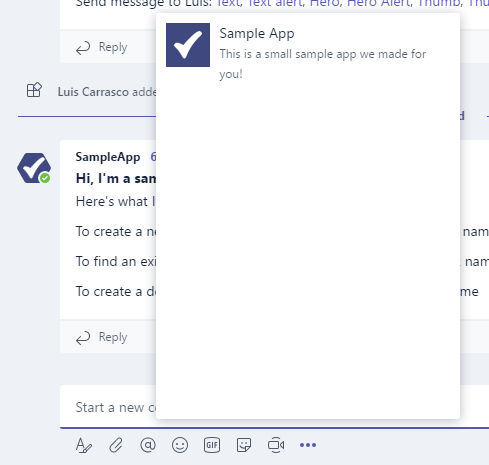

# Hochladen eines App-Pakets in Microsoft Teams

Um Ihre App in Microsoft Teams zu testen, müssen Sie Ihre App in Teams hochladen. Durch das Hochladen wird die App zu dem ausgewählten Team addiert, und Sie und Ihre Teammitglieder können wie Endbenutzer damit interagieren.

> [!NOTE]
> Beim Hochladen eines aktualisierten Pakets für eine vorhandene App mit einem Bot werden beim Anzeigen über das Fenster "Unterhaltungen" möglicherweise keine Registerkartenänderungen angezeigt. Es ist besser, über das Flyout "Apps" darauf zu zugreifen oder in einer sauberen Testumgebung zu testen.

## Erstellen des Uploadpakets

Für die Entwicklung sowie die AppSource-Übermittlung (früher Office Store) müssen Sie ein hochladebares Paket erstellen, das die Informationen enthält, um Ihre Erfahrung zu beschreiben. Das Paket, eine ZIP-Datei, enthält das Anwendungsmanifest und Symbole, die Ihre Erfahrung eindeutig definieren.

Informationen zum Erstellen eines Uploadpakets finden Sie unter [Erstellen des Pakets für Ihre Microsoft Teams-App.](../build-and-test/apps-package.md)

Nachdem Das Paket erstellt wurde, können Sie es nun in ein Team hochladen. Nach dem Hochladen ist es für alle Benutzer im ausgewählten Team und nur für die Benutzer dieses Teams verfügbar.

## Laden Des Pakets in Teams

Sie können Ihr Paket testen, indem Sie es in Teams hochladen.

> [!NOTE]
> Damit das Hochladen funktioniert, muss Ihr Mandantenadministrator zuerst [das Hochladen von Apps aktivieren.](/microsoftteams/admin-settings)

Es gibt zwei Möglichkeiten, Ihre App in Teams hochzuladen:

* Verwenden des Store
* Verwenden der Registerkarte "Apps"

## Hochladen Ihres Pakets in ein Team oder eine Unterhaltung mithilfe des Store

1. Wählen Sie in der unteren linken Ecke von Teams das Symbol "Store" aus. Wählen Sie auf der Seite "Store" die Option "Benutzerdefinierte App hochladen" aus.

  

2. Navigieren Sie *im Dialogfeld* "Öffnen" zu dem Paket, das Sie hochladen möchten, und wählen Sie *"Öffnen" aus.*

   

Das hochgeladene Paket sollte jetzt für die Verwendung in dem im Zustimmungsdialogfeld angegebenen Team oder der Unterhaltung verfügbar sein. Wenn Ihre App nicht angezeigt wird, ist der häufigste Grund ein Fehler im Manifest, insbesondere IDs für die App, Bot- und Messagingerweiterungen. Wenn die App nicht für Unterhaltungen gilt, wird diese Option nicht angezeigt.

>[!NOTE]
> Apps in Unterhaltungen befinden sich derzeit in [Developer Preview](../../resources/dev-preview/developer-preview-intro.md), und die Option wird nicht angezeigt, wenn Teams nicht in diesem Modus ausgeführt wird.

## Hochladen Ihres Pakets in ein Team über die Registerkarte "Apps"

1. Wählen Sie im Zielteam *"Weitere Optionen"* (**&#8943;**) und *"Team verwalten" aus.*

   > [!NOTE]
   > Sie müssen der Teambesitzer sein, oder der Besitzer muss zulassen, dass Benutzer die entsprechenden App-Typen hinzufügen, damit diese Funktion angezeigt wird.

2. Wählen Sie die Registerkarte "Apps" und dann unten rechts *"Benutzerdefinierte* App hochladen" aus.

   

3. Navigieren Sie auf Ihrem Computer zu Ihrem ZIP-Paket, und wählen Sie es aus.

4. Nach einer kurzen Pause wird Die hochgeladene App in der Liste angezeigt.

   

Wenn Ihre App nicht geladen wird, ist der häufigste Grund ein Fehler im Manifest, insbesondere IDs für die App, Bot- und Messagingerweiterungen.

## Zugreifen auf die hochgeladene konfigurierbare Registerkarte

Wenn die App Registerkarten enthält, können Benutzer sie mithilfe des standardmäßigen Registerkartenkatalogflusses an eine beliebige Unterhaltung oder einen beliebigen Teamkanal anheften:

1. Wechseln Sie zu einem Kanal im Team. Wählen Sie rechts neben den vorhandenen Registerkarten die Option ( Registerkarte *+* hinzufügen) aus.

2. Wählen Sie die Registerkarte aus dem angezeigten Katalog aus.

3. Akzeptieren Sie die Zustimmungsaufforderung.

4. Konfigurieren Sie die Registerkarte über die [Konfigurationsseite,](../../tabs/how-to/create-tab-pages/configuration-page.md) und wählen Sie *"Speichern" aus.*

  

## Zugreifen auf Ihren hochgeladenen Bot

Wenn Sie einen Bot zu einem Team hinzufügen, sollte er je nach Definition des Botbereichs von allen Personen in diesem Team innerhalb und außerhalb der Teamkanäle verwendet werden können. You and other team members will see a post in the General channel indicating that the bot has been added to the team.

Für einen teamsfähigen Bot können Sie beginnen, indem Sie Ihren Bot aufrufen, indem @mentioning Namen des Bots eingeben, der automatisch kompletiert werden sollte.

Um direkte Chats mit Ihrem Bot zu testen, können Sie entweder über die App-Startseite darauf zugreifen, @mention in einem Kanal darauf zugreifen oder im Fenster "Neuer **Chat"** suchen.

Wenn Sie Ihren Bot zu einer Unterhaltung hinzufügen, um direkte Chats mit Ihrem Bot zu testen, können Sie @mention in einer Unterhaltung anzeigen oder im Fenster "Neuer **Chat"** nach ihm suchen.

## Zugreifen auf den hochgeladenen Connector

Wenn die App im Team oder in der Unterhaltung geladen ist, können Benutzer einen Connector mithilfe des standardmäßigen Connectorskatalogflusses einrichten:

1. Wechseln Sie zu einem Kanal im Team. Choose *More options* (*&#8943;*) and choose *Connectors*.

2. Wählen Sie den Connector im **Abschnitt "Sideloaded"** unten aus.

3. Konfigurieren Sie den Connector über die [Konfigurationsseite, und](../../webhooks-and-connectors/how-to/connectors-creating.md) wählen Sie *"Speichern" aus.*

  

## Zugreifen auf Ihre hochgeladene Messagingerweiterung

Eine hochgeladene App mit einer Messagingerweiterung wird automatisch im Menü "Weitere *Optionen"* (*&#8943;*) im Feld zum Verfassen angezeigt.

## Entfernen oder Aktualisieren Ihrer App

Wenn Sie Ihre App entfernen möchten, wählen Sie das Papierkorbsymbol neben dem Namen der App in der Liste "Teams-Bots anzeigen" aus.

Wenn Sie Manifestinformationen ändern, müssen Sie zuerst die App entfernen und dann das aktualisierte Paket hinzufügen (pro Paket in [ein Team laden).](#load-your-package-into-teams) Beachten Sie, dass Codeänderungen an Ihrem Dienst im Allgemeinen kein erneutes Hochladen Ihres Manifests erfordern, es sei denn, diese Änderungen erfordern Manifestupdates (z. B. Änderungen an der URL oder der Microsoft-App-ID für den Bot).

> [!NOTE]
> Es gibt keine Möglichkeit, einen Bot vollständig aus dem persönlichen Kontext zu entfernen. Wenn der Bot entfernt und erneut hinzugefügt wird, wird die zusätzliche Kommunikation mit dem Bot an die vorherige Unterhaltung angehängt.

## Hinweise zur Problembehandlung

* If the manifest doesn't load, please double-check that you followed all the instructions in [Create the package](../../concepts/build-and-test/apps-package.md) and validated your manifest against the [schema](../../resources/schema/manifest-schema.md).
