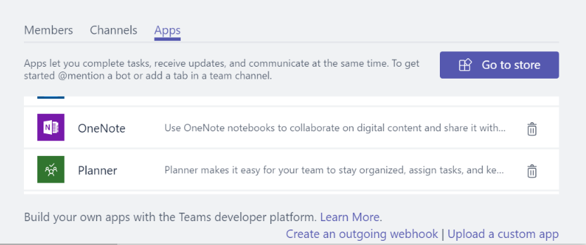

# Hochladen eines App-Pakets in Microsoft Teams

Um Ihre App-Erfahrung in Microsoft Teams zu testen, müssen Sie Ihre App in Teams hochladen. Beim Hochladen wird die App zum ausgewählten Team hinzufügt, und alle Teammitglieder können wie Endbenutzer damit interagieren.

> [!NOTE]
> Beim Hochladen eines aktualisierten Pakets für eine vorhandene App mit einem Bot werden möglicherweise keine Registerkartenänderungen angezeigt, wenn sie über das Unterhaltungsfenster angezeigt werden. Sie können über das Fly-Out oder testen in einer sauberen Umgebung auf die App zugreifen.

## Erstellen des Uploadpakets

Für die Entwicklung und AppSource-Übermittlung müssen Sie ein Paket erstellen, das Sie hochladen können. Das Paket muss die Informationen enthalten, um Ihre Erfahrung zu beschreiben. Das Paket ist eine ZIP-Datei, die das Anwendungsmanifest und Symbole enthält, die Ihre Erfahrung eindeutig definieren.

Informationen zum Erstellen eines Uploadpakets finden Sie unter [Erstellen des Pakets für Ihre Microsoft Teams-App.](../build-and-test/apps-package.md)

Nachdem Sie das Paket erstellt haben, laden Sie es in ein Team hoch. Das hochgeladene Paket steht nur den Benutzern des ausgewählten Teams zur Verfügung.

## Laden Des Pakets in Teams

Sie können Ihr Paket testen, indem Sie es in Teams hochladen.

> [!NOTE]
> Damit das Hochladen funktioniert, muss Ihr Mandantenadministrator zuerst [das Hochladen von Apps aktivieren.](/microsoftteams/admin-settings)

Es gibt zwei Möglichkeiten, Ihre App in Teams hochzuladen:

* Verwenden des Store
* Verwenden der Registerkarte Apps

## Hochladen Ihres Pakets in ein Team oder eine Unterhaltung mithilfe des Store

1. Wählen Sie in der unteren linken Ecke von Teams das **Symbol Store** aus. Wählen Sie auf der Seite Store die Option **Benutzerdefinierte App hochladen aus.**

  

2. Navigieren Sie **im** Dialogfeld Öffnen zu dem Paket, das Sie hochladen möchten, und wählen Sie Öffnen aus.

   

Das hochgeladene Paket muss für die Verwendung im Team oder der Im Zustimmungsdialogfeld angegebenen Unterhaltung verfügbar sein. Wenn Ihre App nicht angezeigt wird, ist der häufigste Grund ein Fehler im Manifest, insbesondere IDs für die App- und Bot- und Messagingerweiterungen. Wenn die App nicht für Unterhaltungen begrenzt ist, wird diese Option nicht angezeigt.

>[!NOTE]
> Apps in Unterhaltungen befinden sich derzeit in [Developer Preview](../../resources/dev-preview/developer-preview-intro.md), und die Option wird nicht angezeigt, wenn Teams nicht in diesem Modus ausgeführt wird.

## Hochladen Ihres Pakets in ein Team mithilfe der Registerkarte Apps

1. Wählen Sie im Zielteam **weitere Optionen** (**&#8943;**) aus, und wählen Sie Team **verwalten aus.**

   > [!NOTE]
   > Sie müssen der Teambesitzer sein, oder der Besitzer muss Benutzern Zugriff geben, um die entsprechenden App-Typen hinzuzufügen, damit diese Funktionalität angezeigt wird.

2. Wählen Sie die **Registerkarte Apps** aus, und wählen Sie unten rechts **Hochladen** einer benutzerdefinierten App aus.

   

3. Wählen Sie ihr .zip-Paket vom Computer aus.

4. Die hochgeladene App wird in der Liste angezeigt.

   

Wenn Ihre App nicht geladen wird, ist der häufigste Grund ein Fehler im Manifest, insbesondere IDs für die App- und Bot- und Messagingerweiterungen.

## Zugreifen auf ihre hochgeladene konfigurierbare Registerkarte

Wenn die App Registerkarten enthält, können Benutzer sie mithilfe des standardmäßigen Registerkartenkatalogflusses an alle Unterhaltungen oder Teamkanäle anheften:

1. Wechseln Sie zu einem Kanal im Team. Wählen Sie aus, um rechts neben den vorhandenen Registerkarten eine **+** Registerkarte hinzuzufügen.

2. Wählen Sie ihre Registerkarte aus dem angezeigten Katalog aus.

3. Akzeptieren Sie die Zustimmungsaufforderung.

4. Konfigurieren Sie Ihre Registerkarte über die [Konfigurationsseite,](../../tabs/how-to/create-tab-pages/configuration-page.md) und wählen Sie **Speichern aus.**

  

## Zugreifen auf ihren hochgeladenen Bot

Nach dem Hinzufügen des Bots zu einem Team muss er je nach Definition des Botbereichs von jedem Benutzer in diesem Team innerhalb und außerhalb der Teamkanäle verwendet werden können. Allen Teammitgliedern wird ein Beitrag im Kanal **Allgemein** angezeigt, der angibt, dass der Bot dem Team hinzugefügt wurde.

Für einen Teams-Bot können Sie ihren Bot zunächst aufrufen, indem @mentioning Namen des Bots eingeben.

Um direkte Chats mit Ihrem Bot zu testen, können Sie entweder über die App-Startseite darauf zugreifen, @mention in einem Kanal darauf zugreifen oder im Fenster Neuer **Chat** nach ihm suchen.

Sie können @mention bot in einer Unterhaltung anzeigen oder im Fenster Neuer **Chat** suchen, um direkte Chats mit Ihrem Bot zu testen.

## Zugreifen auf ihren hochgeladenen Connector

Wenn die App in das Team oder die Unterhaltung geladen ist, können Benutzer einen Connector mithilfe des standardmäßigen Connectors-Katalogflusses einrichten:

1. Wechseln Sie zu einem Kanal im Team. Wählen **Sie Weitere Optionen** (*&#8943;*) aus, und wählen Sie **Connectors aus.**

2. Wählen Sie den Connector im **Abschnitt Sideloaded** unten aus.

3. Konfigurieren Sie den Connector über die [Konfigurationsseite,](../../webhooks-and-connectors/how-to/connectors-creating.md) und wählen Sie **Speichern aus.**

  

## Zugreifen auf ihre hochgeladene Messagingerweiterung

Eine hochgeladene App mit einer Messagingerweiterung wird automatisch im Menü Weitere Optionen **(** *&#8943;*) im Verfassenfeld angezeigt.

## Hinzufügen eines Standardinstallationsbereichs und einer Gruppenfunktion

> [!NOTE]
> Der Standardinstallationsbereich und die Gruppenfunktion sind derzeit nur in der Entwicklervorschau verfügbar.

Obwohl das Installieren einer App im persönlichen Bereich für die meisten Apps funktioniert, unterstützen einige Apps im Teams Store sowohl persönliche als auch Teambereiche.
Einige dieser Apps sind für die Arbeit in einem Team, in Besprechungen oder in einem Groupchat vorgesehen, bei dem die persönliche App-Erfahrung sekundär ist.
Mit der Standardauswahl für den Installationsbereich können Sie die für die von Ihnen `defaultInstallScope` veröffentlichten Apps angeben. Die App-Installationserfahrung stellt dem Benutzer die Standardoptionen zur Verfügung, während der Rest wie im Bild hervorgehoben unter das Chevron verschoben wird.

Die `defaultInstallScope` Eigenschaft unterstützt Werte wie persönliche, Team-, Gruppenchat- oder Besprechungsgespräche.

> [!NOTE]
>`defaultGroupCapability` stellt die Standardfunktion zur Verfügung, die dem Team, dem Gruppenchat oder besprechungen hinzugefügt wird. Wählen Sie eine Registerkarte, einen Bot oder einen Connector als Standardfunktion für Ihre App aus, Sie müssen jedoch sicherstellen, dass Sie die ausgewählte Funktion in Ihrer App-Definition bereitgestellt haben.

## Entfernen oder Aktualisieren Ihrer App

Um Ihre App zu entfernen, wählen Sie das Löschsymbol neben dem App-Namen in der **Liste Teams-Bots** anzeigen aus. Wenn Sie Manifestinformationen ändern, entfernen Sie zuerst die App, und fügen Sie dann das aktualisierte Paket hinzu. Weitere Informationen finden Sie unter [Load your package into a team](#load-your-package-into-teams). Codeänderungen an Ihrem Dienst erfordern nicht, dass Sie Ihr Manifest erneut hochladen. Wenn die Codeänderungen jedoch Manifestupdates erfordern, z. B. Änderungen an der URL oder der Microsoft-App-ID für den Bot, müssen Sie das Manifest erneut hochladen.

> [!NOTE]
> Sie können einen Bot nicht vollständig aus einem persönlichen Kontext entfernen. Wenn der Bot entfernt und erneut hinzugefügt wird, wird der vorherigen Unterhaltung zusätzliche Kommunikation mit dem Bot hinzugefügt.

## Hinweise zur Problembehandlung

Wenn das Manifest nicht geladen werden kann, überprüfen Sie, ob Sie alle Anweisungen in [Erstellen](../../concepts/build-and-test/apps-package.md) des Pakets befolgt und Ihr Manifest anhand des Schemas [überprüft haben.](../../resources/schema/manifest-schema.md)
