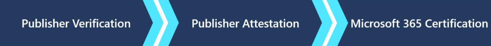

# Microsoft 365 App Compliance 

Das Erstellen eines sicheren und vertrauenswürdigen App-Ökosystems hat für Microsoft oberste Priorität. Mehrere Investitionen zielen darauf ab, sicherzustellen, dass im Microsoft Store verfügbare Apps gültig, sicher und sicher sind. 

   

-   [Herausgeberüberprüfung](https://docs.microsoft.com/azure/active-directory/develop/publisher-verification-overview) – Ermöglicht Entwicklern mit einem überprüften [Microsoft Partner Network](https://partner.microsoft.com/membership) (MPN)-Konto, ihren über die Microsoft Identity Platform registrierten Apps eine [Organisationsidentität zuzuordnen.](https://docs.microsoft.com/azure/active-directory/develop/)
-   [Publisher Attestation](https://docs.microsoft.com/microsoft-365-app-certification/docs/enterprise-app-attestation-guide) – Entwickler führen eine Selbstbewertung der Sicherheit, Compliance und Datenverarbeitungspraktiken ihrer Organisation durch. Diese Informationen werden für IT-Administratoren zur Überprüfung zur Verfügung stellen. 
-   [M365-Zertifizierung](https://docs.microsoft.com/microsoft-365-app-certification/docs/enterprise-app-certification-guide) – Microsoft setzt einen Drittanbieter-Assessor ein, um die Sicherheits- und Compliancestandards für die Organisation zu überprüfen und zu überprüfen. Dies ist unsere höchste Zertifizierungsstufe und gibt den IT-Administratoren die Sicherheit, dass die Anwendung und die Organisation, die sie empfängt, auf eine Art und Weise arbeitet, die die sichere Verwendung und Speicherung von Daten fördert.

## Programmvorteile

Jede Stufe im Microsoft 365-App-Compliance-Programm bietet Ihren Kunden ein anderes Maß an Sicherheit. Indem Sie die Herausgeberüberprüfung abschließen, stellen Sie Ihren Kunden sicher, dass Ihr Unternehmen der Herausgeber Ihrer App ist. Der Herausgeber-Nachweis reduziert die Notwendigkeit, mit Ihren Kunden über die Sicherheitspraktiken Ihrer App hin und her zu gehen. Wir veröffentlichen Ihre Antworten auf häufige Fragen zu Sicherheit und Compliance an einem Ort in einem konsistenten Format, das Kunden überprüfen können. Die letzte Stufe ist die Microsoft 365-Zertifizierung. Nach Abschluss des Abschlusses werden Ihre Kunden wissen, dass Sie sichere Methoden für die Datenverarbeitung und -sicherheit befolgen. Weitere Vorteile des Complianceprogramms sind:
-   Kostenlos – Diese Kosten werden derzeit von Microsoft besenstanden
-   Erhalten eines Badges in AppSource und [in Compliance-Dev-Dokumenten](https://docs.microsoft.com/microsoft-365-app-certification/teams/teams-apps)
-   Unterscheidung von anderen Apps im Store
-   Verkürzte Zeit bis zur Einführung von Apps für Ihre Kunden
-   Reduzieren der Zeit, die Sie für das Ausfüllen von RFPs auf sich haben
-   Vertrauen in die Sicherheits- und Compliancemaßnahmen Ihrer Anwendung hinzugefügt

## Qualifizieren von Anwendungstypen 
### Die Herausgeberüberprüfung gilt für Apps, die: 
- Verwenden [von OAuth 2.0](https://docs.microsoft.com/azure/active-directory/develop/active-directory-v2-protocols) und OpenID Connect zum Anmelden von Benutzern und Anfordern des Datenzugriffs mithilfe von dienstseitigen APIs wie Microsoft [Graph](https://developer.microsoft.com/graph/). 
- Registriert in Azure AD als mehr mandant. 

### Herausgeberbescheinigung
-   Teams
-   Word
-   Excel
-   PowerPoint
-   Outlook
- In Kürze: SharePoint

### Microsoft 365-Zertifizierung
-   Teams
-   In Kürze: bietet dieselbe Anwendungstypabdeckung wie der Publisher Attestation

## So starten Sie das Programm

Der Abschluss des Microsoft 365-App-Compliance-Programms ist zwar freiwillig, wird aber dringend gefördert. Sie können dem Programm beitreten, unabhängig davon, wo Sie eine neu hinzugefügte Anwendung sind oder seit Jahren im Store sind. 

Der erste Schritt besteht im Abschließen der [Publisher-Überprüfung.](https://docs.microsoft.com/azure/active-directory/develop/publisher-verification-overview) Der nächste Schritt besteht im Abschließen des [Herausgeber-Nachweises.](https://docs.microsoft.com/microsoft-365-app-certification/docs/attestation) Nachdem Sie den Herausgeber-Nachweis abgeschlossen haben, werden wir uns mit den nächsten Schritten für den Beginn der Microsoft 365-Zertifizierung an Sie erreichen.
