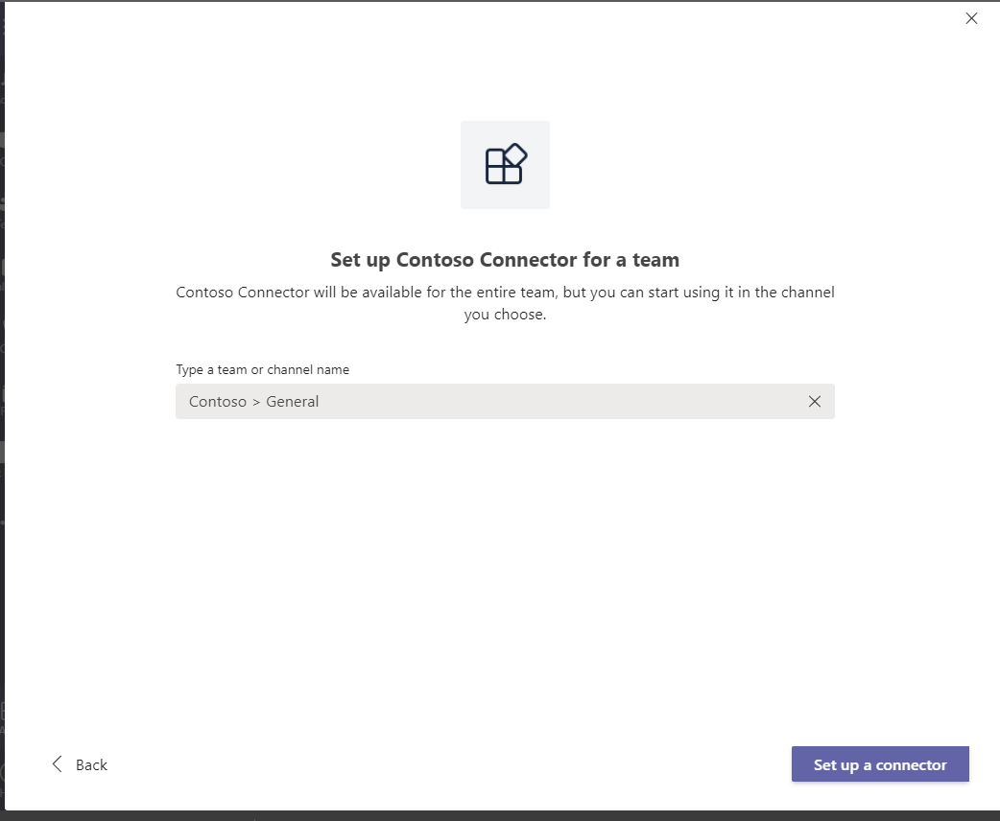
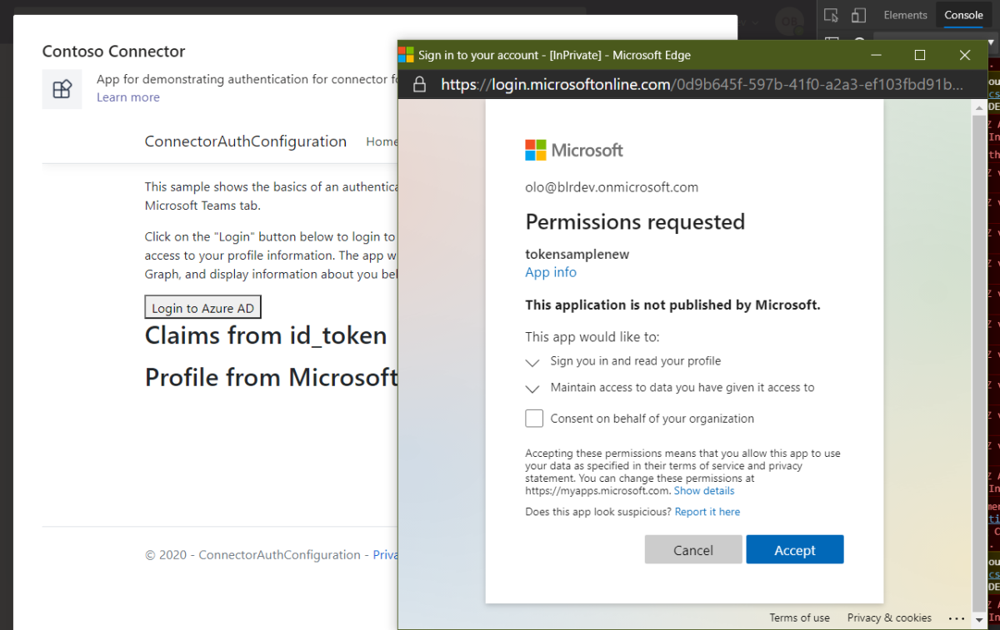

# Verwalten und Unterstützen Ihrer veröffentlichten App 

Nachdem Ihre App genehmigt und im öffentlichen App-Katalog aufgeführt wurde, können Sie Ihre Reichweite erhöhen, indem Sie das Microsoft 365-App-Compliance-Programm abschließen oder eine Downloadschaltfläche auf Ihrer Website hinzufügen.

## Microsoft 365-zertifiziert

Das [Microsoft 365 App Compliance Program](./application-certification.md)ist ein dreistufiger Ansatz für die Sicherheit und Compliance von Apps. Jede Ebene baut auf der nächsten auf– sie bietet ein mehrschichtiges Programm, das die Anforderungen Ihrer Kunden erfüllt. Weitere Informationen zur Sicherheits- und Compliancelage von Teams-Apps finden Sie auf der Seite ["Compliance".](https://docs.microsoft.com/microsoft-365-app-certification/teams/teams-apps)

## Hinzufügen einer Downloadschaltfläche zu Ihrer Produktwebsite

Wenn Sich Ihre App im globalen Microsoft Teams Store befindet, können Sie einen Link für Ihre Website generieren, der Teams startet und ein Zustimmungs- und Installationsdialogfeld für Benutzer zum Hinzufügen der App zeigt.
Das Format ist:  `https://teams.microsoft.com/l/app/<appId>` wobei appID die GUID ist, die sie im übermittelten Manifest deklarieren.
Beispiel: `https://teams.microsoft.com/l/app/49e6f432-d79c-49e8-94f7-89b94f3672fd` Ist der Link zum Installieren von Trello.

## Aktualisieren Ihrer vorhandenen Teams-App

* Verwenden Sie nicht die Schaltfläche *"Neue App hinzufügen",* um Ihre App erneut zu übermitteln. Verwenden Sie stattdessen die Kachel für Ihre App auf der Registerkarte "Übersicht".
* Die appId im aktualisierten Manifest sollte mit der im aktuellen Manifest identisch sein, mit einer inkrementierten Versionsnummer.
* Erhöhen Sie Ihre Versionsnummer im Manifest, wenn Sie Änderungen an Ihrer Übermittlung vornehmen, einschließlich des App-Namens oder metadaten im Manifest.
* Aktualisierte Übermittlungen sind erforderlich, um einen neuen Überprüfungs- und Überprüfungsprozess zu durchlaufen.

## App-Updates und der Benutzer-Zustimmungsfluss

Wenn ein Benutzer Ihre Anwendung zu einem der ersten Dinge installiert, muss er der App die Berechtigung zum Zugriff auf die Dienste und Informationen erteilen, die die App für ihre Arbeit benötigt. In den meisten Fällen wird nach Abschluss eines App-Updates die neue Version automatisch für Endbenutzer angezeigt. Es gibt jedoch einige Updates für das [Teams-App-Manifest,](../../../../resources/schema/manifest-schema.md) die die Benutzerakzeptanz erfordern und dieses Zustimmungsverhalten erneut auslösen können:

 >[!div class="checklist"]
>
> * Ein Bot wurde hinzugefügt oder entfernt.
> * Der eindeutige Wert eines vorhandenen `botId` Bots wurde geändert.
> * Der boolesche Wert eines `isNotificationOnly` vorhandenen Bots wurde geändert.
> * Der boolesche Wert eines `supportsFiles` vorhandenen Bots wurde geändert.
> * Eine Messagingerweiterung ( `composeExtensions` ) wurde hinzugefügt oder entfernt.
> * Ein neuer Connector wurde hinzugefügt.
> * Eine neue statische/persönliche Registerkarte wurde hinzugefügt.
> * Eine neue konfigurierbare Gruppen-/Kanalregisterkarte wurde hinzugefügt.
> * Die `webApplicationInfo` Werte wurden geändert.
>

### Bilder des Zustimmungsflusses des Benutzers:

**Einrichten eines Connectors** – Dieser Bildschirm wird nur für Benutzer von Teams angezeigt.

**Benutzer-Zustimmungsfluss:** Dieser Bildschirm ist sowohl für persönliche als auch für Gruppenbereiche üblich. Aktivieren Sie hier das **Kontrollkästchen "Zustimmung im Auftrag Ihrer Organisation",** und wählen Sie **"Annehmen" aus.**

