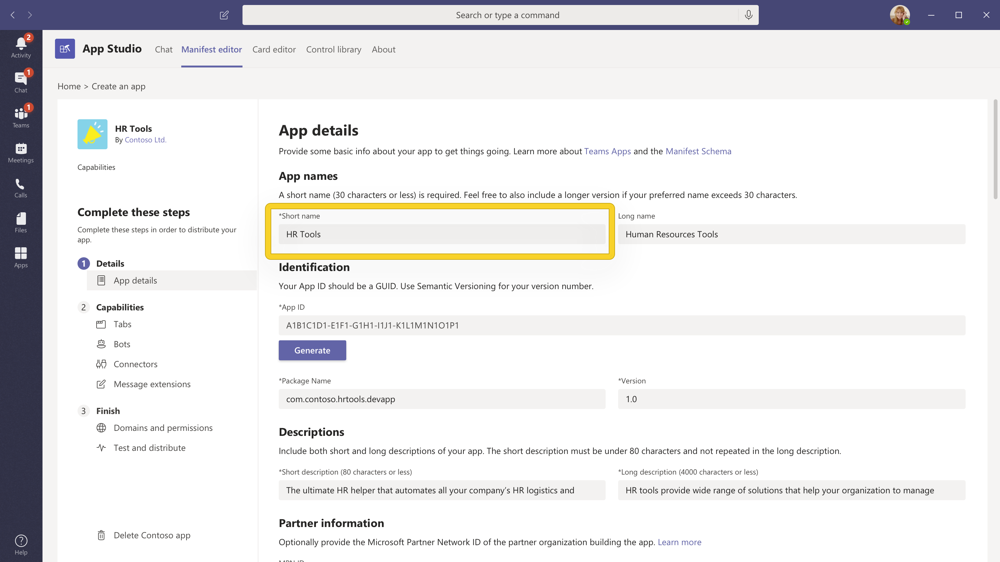

# Erstellen einer großartigen App-Detailseite

Auf der Detailseite wird benutzern der erste Eindruck Ihrer App angezeigt. Jedes Element Ihrer Detailseite kann verwendet werden, um Ihre Vision zu vermitteln und Downloads zu fördern – überlegen Sie, wie Sie Ihre App auf einem begrenzten Platz präsentieren möchten. Hier finden Sie einige Tipps und Tricks, mit deren Hilfe Sie Ihre Benutzer gewinnen können, bevor sie Ihre App installieren.

> [!NOTE]
> Stellen Sie sicher, dass Ihre App-Informationen unseren [AppSource-Anleitungen zum Erstellen eines effektiven Storeeintrags folgen.](/office/dev/store/create-effective-office-store-listings)

## App-Name

> [!div class="checklist"]
>
> * Der Name einer App spielt eine wichtige Rolle bei der Benutzerentkung im AppSource-App-Store. Der Kurzname Ihrer App wird auf der Detailseite angezeigt.
>* Der App-Name sollte Ihre App ohne Verweis auf Microsoft- oder Microsoft-Produkte widerspiegeln.
>

> **Hinweis**: Wenn Ihre App eine offizielle Partnerschaft mit Microsoft ist, muss der Name der Drittanbieter-App zuerst sein, z. B. *Salesforce Connector für Microsoft Teams*.

> [!div class="checklist"]
>
>* Verwenden Sie diese Ressourcen als Anleitung:

* [Leitfaden für App-Namen](#app-name)
* [Richtlinien für Marken und Marken von Microsoft](https://www.microsoft.com/en-us/legal/intellectualproperty/trademarks/usage/general)

**Do's:**

* Wählen Sie einen einfachen, einprägsamen Namen aus, der darauf hinweist, was Ihre App macht.
* Unterscheiden Sie sich.
* Verwenden Sie bei Bedarf Microsoft 365-Verweise anstelle von Office 365.

**Don'ts:**

* Lassen Sie keine Leerzeichen aus, haben Sie einen falschen Fall oder enthalten Sie Sprachfehler im App-Namen.
* Verwenden Sie keine generischen Begriffe oder Namen, die vorhandenen Apps ähneln.
* Verwenden Sie "Teams", "Microsoft", vorhandene/anstehende Microsoft-Produktnamen oder "App" nicht in Ihrem App-Namen.
* Verwenden Sie keine Klammern, um Microsoft-Produkte wie z. B. *Your-App-Name (für Microsoft Teams) zu enthalten.*

## Farbsymbol

Dies ist eines der ersten Elemente, die Benutzer sehen. Es sollte ansprechend und auffallend sein, wenn Sie durch den App Store scrollen. Stellen Sie sicher, dass sie einen guten ersten Eindruck macht und auch das Image und den Zweck Ihrer Marke kommuniziert. AppSource bietet weitere Tipps zum [Erstellen einer konsistenten visuellen Identität.](/office/dev/store/create-effective-office-store-listings#create-a-consistent-visual-identity)

**Don'ts:**

* Ihr Symbol darf keine urheberrechtlich geschützten Produkte imitieren, die Sie nicht besitzen.
* Ihr Symbol darf keinem Microsoft-Produkt bzw. jeder Microsoft-Marke ähnlich aussehen.

## Gliederungssymbol

Dieses Symbol wird für angeheftet messaging-Erweiterungen und wenn Ihre App auf der linken Seite von Teams angezeigt wird. Siehe [Entwurfsanleitung für das Gliederungssymbol](../../../../concepts/build-and-test/apps-package.md#outline-icon).

 

**Don'ts:**

* Ihr Symbol darf keine urheberrechtlich geschützten Produkte imitieren, die Sie nicht besitzen.
* Ihr Symbol darf keinem Microsoft-Produkt bzw. jeder Microsoft-Marke ähnlich aussehen.

## Kurzbeschreibung

Dies ist eine kurze Zusammenfassung Ihrer App. Diese soll originell und ansprechend und an Ihre Zielgruppe gerichtet sein. Versuchen Sie im Idealfall, Ihre Lösung und ihren Wert für Ihre Benutzer in einem Satz zu beschreiben.

**Do's:**

* Die wichtigsten Informationen kommen an erster Stelle.
* Schließen Sie Schlüsselwörter ein, nach deren Suche Kunden wahrscheinlich suchen.
* Wenn Sie Microsoft Teams erwähnen müssen, sollte die erste Erwähnung von Microsoft Teams vollständig als *Microsoft Teams geschrieben werden.* Wenn Teams erneut in derselben Beschreibung erwähnt wird, kann der Name in *Teams verkürzt werden.*
* Alle Verweise auf Microsoft oder Microsoft Teams können Teil der Beschreibung sein und sollten den Markenstandards und Richtlinien von Microsoft entsprechen.
* Alle Beschreibungen müssen grammatikalisch korrekt sein, ohne dass Sprachfehler auftreten.
* Vermeiden Sie unnötige Großbuchstaben, z. B. "Benutzer" anstelle von "Benutzer".

**Don'ts:**

* Wiederholen Sie den Titel nicht.
* Lassen Sie Microsoft nicht auf "MS" oder "MSFT" abkürzen.
* Verwenden Sie keinen Jargon oder spezielle Terminologie– Sie können nicht davon ausgehen, dass Benutzer wissen, wofür sie suchen sollten.
* Vermeiden Sie unnötigen Verweis auf Microsoft-Produktnamen, sofern dies nicht unbedingt erforderlich ist.
* Geben Sie nicht an oder implizieren Sie nicht, dass die App ein Angebot von Microsoft ist.
* Verwenden Sie keine urheberrechtlich geschützten Markennamen, die Sie nicht besitzen.
* Verwenden Sie "für Teams" nicht in einem kurzen Namen.

Hier ist eine Ansicht in [App Studio:](https://aka.ms/InstallTeamsAppStudio)

## Lange Beschreibung

> [!div class="checklist"]
>
>* Dies bietet ein ansprechendes Narrativ, das die Wichtigsten Features Ihrer Lösung, die probleme, die sie löst, und die Zielgruppe hervorhebt. Zeichnen Sie Ihre Zielgruppe mit dem ersten Satz ein, indem Sie die einzigartigen Features Ihrer App kommunizieren. Ihre Beschreibung muss unter 4.000 Zeichen sein. Die meisten Benutzer lesen nur zwischen 300 und 500 Wörter.
>* Was ist zulässig?

* `<your_app>`  "Funktioniert mit Microsoft Teams"
* `<for users>`  "Arbeiten mit Microsoft Teams"
* `<for tasks>`  "innerhalb von Microsoft Teams"
* `<an app>`  "für Microsoft Teams"
* `<your_app>`  "Integriert in Microsoft Teams"
* "... integriert in Microsoft Teams"
* "... built on..."
* "... wird ausgeführt..."
* "... aktiviert von..."
* "... entwickelt für..."
* "... entwickelt für..."

> **Hinweis:** Die obigen Bedingungen gelten auch für die Verwendung von Microsoft 365. Office 365 heißt jetzt Microsoft 365. Aktualisieren Sie ihre App-Beschreibungen, um dies wider zuspiegeln.

>[!IMPORTANT]
> Kopieren Sie unbedingt genau die Beschreibungen, die Sie in Ihrem AppSource-Eintrag in Ihr App-Manifest geschrieben haben – die Werte müssen übereinstimmen. Microsoft Teams verwendet nur die Beschreibungen, die Sie im App-Manifest bereitstellen.

**Do's:**

* Verwenden [Sie markdown-Formatierung,](https://support.office.com/article/use-markdown-formatting-in-teams-4d10bd65-55e2-4b2d-a1f3-2bebdcd2c772) um Ihre Beschreibung zu beleuchten.  
* Auflisten von Features, mit deren Hilfe Leser Ihre Beschreibung prüfen können.
* Verwenden Sie aktive Stimme, und sprechen Sie direkt mit Benutzern.
* Verwenden Sie Aufzählungszeichen, um Ihre Features auflisten.
* Fügen Sie einen Hilfe- oder Supportlink ein, damit Ihre Benutzer wissen, wie sie Sie erreichen können, wenn sie Fragen haben.
* Stellen Sie sicher, dass die erste Erwähnung von Microsoft Teams vollständig als *"Microsoft Teams" geschrieben* ist. Wenn Teams später erneut in derselben Beschreibung erwähnt wird, kann der Name in " Teams "*verkürzt* werden.
* Verweise auf Microsoft oder Microsoft Teams (nur bei Bedarf) können Teil der langen Beschreibung sein und sollten den Markenstandards und Richtlinien von Microsoft entsprechen.
* Alle Beschreibungen müssen grammatikalisch korrekt sein, ohne dass Sprachfehler auftreten.
* Vermeiden Sie unnötige Groß-/Großbuchstaben für Begriffe in Ihrer Beschreibung (Beispiel: Angeben von "Benutzer" anstelle von "Benutzern".
* Vermeiden Sie Akronyme.
* Stellen Sie sicher, dass Sie Einschränkungen, Kontoabhängigkeit, Konfigurationseinstellungen, zukünftige Updates in Versionen oder Nutzungseinschränkungen aufrufen.

>[!NOTE]
> Microsoft Teams unterstützt die folgende Markdown-Syntax:  
> **Links**. `[title](url/address/here)`.  
>**Bilder**. `` .  
> **Fett**. `**bold text**`   `__bold text__`.  
> **Italisch**. `*italicized text*`  `_italicized text`.  
>**[Geordnete Listen](https://www.markdownguide.org/basic-syntax/#ordered-lists)** 
>`1. first` 
 ` 1. second ` 
 `1.third` 
>**[Ungeordnete Liste](https://www.markdownguide.org/basic-syntax/#unordered-lists)** 
` - short`  `- bulleted`  `- list` 
>**Newline**. Verwenden Sie ein `\n` Zeichen, um eine Newline zu bestimmen.
 >**Escape.** Verwenden Sie einen inline-umgekehrten Schrägstrich, um Sonderzeichen zu entweichen. `\*asterisk`.

**Beispiel im Markdown-Format**

|Markdownformat für |Markdown-Format |Angezeigter Text|
|:---------|:---------------|:-------------|
|Linkdatenbank  |` [App name guide](#app-name)`| [Leitfaden für App-Namen](#app-name) |
|Bild |` `| |
|Fett |` **HR Tools**` | **HR Tools**  |
|Kursiv |`*HR Tools*` |*HR Tools*|
|Newline |` HR Tools provide wide range of solutions that help your organization to manage day-to-day HR activities effectively.   No more flipping through paper records or juggling among 5 different apps.` |Hr Tools bieten eine breite Palette von Lösungen, mit deren Hilfe Ihre Organisation die täglichen Hr-Aktivitäten effektiv verwalten kann.    Kein Durchblättern von Papierdatensätzen mehr oder Jonglieren zwischen 5 verschiedenen Apps.|
|Escape|`\*Payroll tools that help you manage your payroll and tax documents.` |\*Lohnabrechnungstools, mit deren Hilfe Sie Ihre Lohn- und Steuerdokumente verwalten können. 

**Don'ts:**

* Legen Sie nicht zu viele Schlüsselwörter in Ihre Beschreibung ein– dies lenkt ab und hilft nicht bei der Aufschlüsselung Ihrer App.
* Verwenden Sie nicht "*Teams*" oder "*Microsoft Teams*" in einem kurzen Namen.
* Vermeiden Sie unnötigen Verweis auf Microsoft-Produktnamen, sofern dies nicht unbedingt erforderlich ist.
* Geben Sie nicht an, dass die App ein Angebot von Microsoft ist.
* Verwenden Sie keine urheberrechtlich geschützten Markennamen, die Sie nicht besitzen.
* Verwenden Sie die folgende Sprache nur, wenn die App einen offiziellen Zertifizierungsprozess durchgegangen ist:

  * "... zertifiziert für..."
  * "... Powered by..."

* Not abbreviate "Microsoft" to "MS" or "MSFT" — write Microsoft out in full.
* Kein Teil der Beschreibung oder Metadaten kann die App als offizielles Microsoft-Angebot angeben.
* Partner dürfen keine Microsoft-Tagline verwenden oder imitieren oder den Namen eines Microsoft-Produkts oder -Diensts im Slogan oder in der Tagline verwenden.
* Logo darf die App nicht falsch als offizielles Microsoft-Produkt/-Feature darstellen oder vorhandene oder anstehende Microsoft-Produkte imitieren.

Hier ist eine Ansicht in [App Studio:](https://aka.ms/InstallTeamsAppStudio)

## Screenshots

Die im [Partner Center](https://partner.microsoft.com) hochgeladenen Screenshots werden sowohl in AppSource als auch in Ihrem [App-Eintrag](https://appsource.microsoft.com/marketplace/apps?product=office%3Bteams&page=1) im Teams-Client angezeigt. Sie bieten eine visuelle Vorschau Ihrer App zusammen mit Ihrer App-Beschreibung.
Sie können ein bis fünf Screenshots bereitstellen, die als PNG-, JPG- oder GIF-Dateien formatiert sind. Screenshots sollten 1366 x 768 Pixel mit einer maximalen Größe von 1024 KB haben.

**Do's:**

* Konzentrieren Sie sich auf die Hervorhebung aller Funktionen Ihrer App.
* Inhalte sollten Ihre App genau darstellen.
* Text sollte gut gefüllt sein, ohne übermäßig zu sein.
* Sie können Ihre Screenshots mit einer Hintergrundfarbe umgeben und Marketinginhalte ähnlich dem [Freshdesk-Beispiel](https://appsource.microsoft.com/product/office/WA104381505?src=office&tab=Overview) hinzufügen. Die Dimensionen sind jedoch nicht allein vom Screenshot, sondern enthalten das Gesamtbild.

**Don'ts:**

* Zeigen Sie keine bestimmten Geräte an, z. B. Smartphones oder Laptops.
* Zeigen Sie keine Chrom-/UI-Elemente von außerhalb Ihrer App an.
* Erfassen Sie keine Teams- oder Browserbenutzeroberfläche in Ihren Screenshots.
* Fügen Sie keine Mock-Ups ein, die die tatsächliche Benutzeroberfläche Ihrer Apps ungenau widerspiegeln, z. B. die Anzeige Ihrer Website anstelle Ihrer Registerkarte Teams.

Weitere bewährte Methoden finden Sie *unter*: [Crafting effective AppSource store images](/office/dev/store/craft-effective-appsource-store-images).

## Videos

Wenn ein Bild tausend Wörter wert ist, ist ein Video tausend Bilder wert. Videos sind die effektivste Möglichkeit, die Vorteile der Verwendung Ihrer App zu kommunizieren. Es wird vor allen Screenshots auf der Seite mit den App-Details platziert. Stellen Sie sicher, dass Sie Folgendes erwähnen:

* Funktionsweise Ihrer App.
* Was mit Ihrer App erreicht werden kann.
* Die Vorteile der Verwendung Ihrer App.
* Wen Sie haben?

Denken Sie daran, Ihre Präsentation kurz und süß zu halten – zwischen 30 und 90 Sekunden.

## Weitere Informationen

[Prüfliste für die App-Übermittlung](~/concepts/deploy-and-publish/appsource/publish.md).  
[Erstellen Sie ein App-Paket für Ihre Microsoft Teams-App.](~/concepts/build-and-test/apps-package.md)  
[Verwenden Sie Partner Center, um Ihre Lösung an AppSource zu übermitteln.](/office/dev/store/use-partner-center-to-submit-to-appsource)
