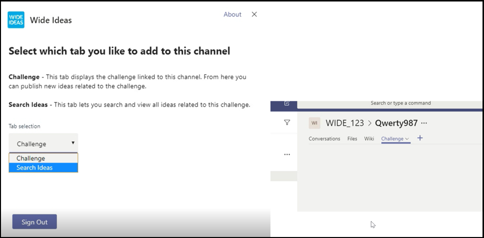

# Tipps für eine erfolgreiche Übermittlung von Microsoft Teams-Apps

In diesem Artikel werden häufige Gründe beschrieben, warum die Validierung von übermittelten Apps fehlschlägt. Es ist zwar nicht beabsichtigt, eine vollständige Liste aller potenziellen Probleme mit Ihrer App zu erstellen, aber wenn Sie dieses Handbuch folgen, erhöht sich die Wahrscheinlichkeit, dass Ihre App-Übermittlung das erste Mal besteht. Eine [umfassende Liste der Validierungsrichtlinien finden](/legal/marketplace/certification-policies) Sie unter Den Zertifizierungsrichtlinien für den kommerziellen Marketplace.

>[!NOTE]
>**[Abschnitt 1140](/legal/marketplace/certification-policies#1140-teams)** gilt speziell für Microsoft Teams, und Unterabschnitt **[1140.4](https://docs.microsoft.com/legal/marketplace/certification-policies#11404-functionality)** behandelt die Funktionalitätsanforderungen für Microsoft Teams-Apps.

## Validierungsrichtlinien für & Testfälle mit den meisten Fehlgeschlagenen

### &#9989; Allgemeine Überlegungen

Siehe auch [Abschnitt 100 – Allgemein](/legal/marketplace/certification-policies#100-general)

* Stellen Sie sicher, dass Sie Version 1.4.1 oder höher des [Microsoft Teams SDK verwenden.](https://www.npmjs.com/package/@microsoft/teams-js)
* Nehmen Sie während des Überprüfungsprozesses keine Änderungen an Ihrer App vor. Dies erfordert eine vollständige Neuvalidierung Ihrer App.
* Ihre App darf sich nicht aufhängen, unerwartet beendet werden oder Programmierungsfehler enthalten. Wenn ein Problem auftritt, muss ihre App fehlschlagen und dem Benutzer gültige Informationen für die Weiterleitung bereitstellen.
* Ihre App darf ausführbaren Code in der Benutzerumgebung nicht automatisch herunterladen, installieren oder starten. Alle Downloads müssen die explizite Berechtigung des Benutzers einsuchen.
* Jedes Material, das Sie Ihrer Erfahrung zuordnen, z. B. Beschreibungen und Supportdokumentation, muss korrekt sein. Achten Sie in diesen Materialien auf Rechtschreibung, Zeichensetzung und Grammatik.
* Bereitstellen von Hilfe- und Supportinformationen. Es wird dringend empfohlen, dass Ihre App eine Hilfe oder einen Link mit häufig gestellten Fragen für die erste Ausführung der Benutzeroberfläche enthält. Für alle persönlichen Apps wird empfohlen, Ihre Hilfeseite als persönliche Registerkarte für eine bessere Benutzererfahrung zur Verfügung zu stellen.
* Alle Apps müssen über eine  visuelle Tour verfügen, z. B. eine Tour oder einen App-Leitfaden **auf** dem Konfigurationsbildschirm, der über die Features der App und die erforderliche Integration an den folgenden Stellen spricht:
    * Die Seite "Store-Eintrag" (lange Beschreibung).
    * Registerkartenkonfigurationsbildschirm.
    * Willkommensnachricht für einen Bot.
    * Metadaten der App-Quelle.
    * Connectorkonfigurationsbildschirm.

* Die visuelle Tour kann ein Video, ein Screenshot, ein Link zu einer statischen Registerkarte mit App-Details sein. Alle diese Verweise müssen sich innerhalb der Teams-Umgebung.

     

* Erhöhen Sie die Versionsnummer Ihrer App im Manifest, wenn Sie Manifeständerungen an Ihrer Übermittlung vornehmen.
* Die App darf Benutzer nicht aus Teams für zentrale Benutzerszenarien nehmen. Linkziele in Apps dürfen nicht mit einem externen Browser verknüpfen. Linkziele müssen mit div-Elementen in Teams verknüpfen, z. B. Aufgabenmodulen und Registerkarten. 
* Die Verwendung von Aufgabenmodulen oder Registerkarten wird zum Anzeigen von Informationen für Benutzer in Teams vorgeschlagen.
* Alle Kern- und Nicht-Kern-Szenarien müssen innerhalb der Teams-Umgebung abgeschlossen werden, mit Ausnahme von:
  * Datenschutzrichtlinie
  * Nutzungsbedingungen
  * Websitelink
  * Anmeldevorgang

* Mit persönlichen Apps können Benutzer Inhalte aus einer persönlichen App-Erfahrung mit anderen Teammitgliedern teilen.

### &#9989; Bereitstellen einer klaren und einfachen Anmelde-, Abmelde- und Anmeldeerfahrung

Siehe auch [Abschnitt 1100.5 – Kundenkontrolle](/legal/marketplace/certification-policies#11005-customer-control)

* Wenn Ihre App oder Ihr Add-in von externen Konten oder Diensten abhängt, muss die Anmelde-, Abmelde- und Anmeldeerfahrung über alle Funktionen in Ihrer App hinweg sichtbar und erreichbar sein.
* Wenn dem Benutzer eine explizite Anmeldeoption bereitgestellt wird, muss eine entsprechende Abmeldeoption vorhanden sein (auch wenn die App die automatische [Authentifizierung verwendet).](../../../../tabs/how-to/authentication/auth-silent-aad.md)
* Die Abmeldeoption darf den Benutzer nur von der Funktion Ihrer App abmelden und nicht vom Teams-Client.
* Die Abmeldeoption muss den Benutzer mindestens von denselben Funktionen abmelden, auf die mit der Anmeldeoption zugegriffen wird. Wenn die Anmeldeoption beispielsweise sowohl die Messagingerweiterung als auch die Registerkarte enthält, muss die Abmeldeoption sowohl die Messagingerweiterung als auch die Registerkarte enthalten.

* Stellen Sie sicher, dass es immer eine Möglichkeit gibt, das folgende (oder ähnliche) Verhalten umzukehren:
  * Sign-in => sign-out.
  * Verknüpfen eines Kontos/Diensts => die Verknüpfung eines Kontos/Diensts auf.
  * Verbinden eines Kontos/Diensts => Konto/Dienst trennen.
  * Autorisieren Eines Kontos/Diensts =>/verweigern eines Kontos/Diensts.
  * Registrieren Eines Kontos/Diensts => Registrierung eines Kontos/Diensts aufheben/kündigen.
* Wenn Ihre App ein Konto oder einen Dienst erfordert, müssen Sie dem Benutzer eine Möglichkeit bieten, sich zu registrieren oder eine Anmeldeanforderung zu erstellen. Eine Ausnahme kann gewährt werden, wenn Ihre App eine Lizenz erfordert. Stellen Sie in solchen Szenarien klare Anweisungen für einen neuen Benutzer zur Anmeldung zur Verfügung.
* Stellen Sie einen klaren Leitfaden für die Zukunft für einen neuen Benutzer zur Anmeldung zur Verwendung Ihrer App-Dienste zur Verfügung. Wenn kein bereiter Anmeldelink verfügbar ist, stellen Sie in den folgenden Bereichen genaue Anweisungen bereit:

> [!div class="checklist"]
>
> * im Beschreibungsabschnitt Ihrer App.
> * in der Willkommensnachricht Ihrer App.
> * in der Hilfenachricht Ihrer App.
> * in dem Fenster, in dem Sie einen Benutzer bitten, sich bei Ihren Diensten zu anmelden.

* Apps ohne einen einfachen Anmeldefluss müssen auch eine Hilferegisterkarte oder einen Link zu einer Webseite enthalten, auf der ein neuer Benutzer detaillierte Anleitungen zum Konfigurieren Ihrer Teams-App sehen kann. Stellen Sie detaillierte Informationen zur Verfügung, um sicherzustellen, dass ein neuer Benutzer nicht blockiert wird, wenn Sie Ihre App zum ersten Mal ausprobieren.
* Die Anmelde- und Abmeldefunktionalität muss auf mobilen Clients funktionieren. Stellen Sie sicher, dass [Sie das Microsoft Teams SDK,](https://www.npmjs.com/package/@microsoft/teams-js) Version 1.4.1 oder höher, verwenden.

Weitere Informationen zur Authentifizierung finden Sie unter:

* [Authentifizierungsdokumentation](../../../authentication/authentication.md)
* [Beispiel für die Botauthentifizierung in Node](https://github.com/OfficeDev/microsoft-teams-sample-auth-node)
* [Beispiel für die Registerkartenauthentifizierung im Knoten](https://github.com/OfficeDev/microsoft-teams-sample-complete-node)
* [Tab/Bot-Authentifizierung in C#/.NET](https://github.com/OfficeDev/microsoft-teams-sample-complete-csharp)

### &#9989; Antwortzeiten müssen angemessen sein

* **Registerkarten**. Wenn eine Antwort auf eine Aktion mehr als drei Sekunden dauert, müssen Sie eine Ladenachricht oder eine Warnung bereitstellen.
* **Bots**. Eine Antwort auf einen Benutzerbefehl muss innerhalb von zwei Sekunden erfolgen. Wenn eine längere Verarbeitung erforderlich ist, muss ihre App einen Eingabeindikator anzeigen.
* **Erweiterungen verfassen**. Eine Antwort auf einen Benutzerbefehl muss innerhalb von fünf Sekunden erfolgen.

> [!TIP]
> Stellen Sie sicher, dass ihre App eine Ladeanzeige oder eine Warnung anzeigt, wenn die App länger als erwartet reagiert.

### &#9989; Registerkarteninhalt darf keine übermäßige Chrome- oder mehrschichtige Navigation haben

* Registerkarten müssen fokussierten Inhalt bereitstellen und unnötige Benutzeroberflächenelemente vermeiden. Dies bezieht sich in der Regel auf unnötige geschachtelte oder mehrschichtige Navigation, eine überflüssige oder irrelevante Benutzeroberfläche neben dem Inhalt oder links, die den Benutzer zu nicht verknüpften Inhalten führen. Die folgende Registerkartenansicht lässt beispielsweise Navigationsmenüs aus und zeigt nur den Hauptinhalt an:

  

* Registerkarten müssen hell sein und keine komplexe Navigation enthalten.
* Kanalregisterkarten mit komplexen Bearbeitungsfunktionen innerhalb der App müssen die Editoransicht in einem Mehrfenster statt in einer Registerkarte öffnen.
* Kanalregisterkarten dürfen keine App-Leiste mit Symbolen auf der linken Leiste bereitstellen, die mit der Hauptnavigation von Teams in Konflikt stehen.
* Registerkarten dürfen keine App-Leiste mit Symbolen auf der linken Leiste anzeigen, die mit der Hauptnavigation von Teams in Konflikt stehen.
* Registerkarten mit komplexen Bearbeitungsfunktionen innerhalb der App müssen die Editoransicht in einem Mehrfenster öffnen und nicht auf der Registerkarte.
* Wenn mehrere Ansichtsoptionen verfügbar sind, sollten Sie ein Menü "Registerkartenkonfiguration" verwenden, aus dem der Benutzer wählen kann. Statt beispielsweise ein Menü in die Registerkarte einzubetten, legen Sie das Menü auf der Konfigurationsseite ab, damit die tatsächliche Registerkartenansicht sauber und fokussiert ist.
* Fügen Sie eine *Registerkarte "Hilfe"* als statische Registerkarte ein, um Benutzer über die Konfiguration, Anmeldung und Verwendung Ihrer App zu informieren.
* Fügen Sie eine Registerkarte *"Einstellungen"* ein, die im Header der App verfügbar ist.

### &#9989; Registerkartenkonfiguration muss auf dem Konfigurationsbildschirm auftreten

* Auf dem Konfigurationsbildschirm müssen der Wert der Benutzererfahrung und die Konfiguration der Registerkarte klar erläutert werden.
* Der Konfigurationsprozess muss den Benutzern immer eine Möglichkeit bieten, fortzufahren und die Benutzererfahrung nicht zu beenden. Zeigen Sie beispielsweise kein leeres Board an, nachdem der Benutzer die Registerkarte konfiguriert hat.
* Der Anmeldevorgang des Benutzers muss Teil des Konfigurationsprozesses sein. Stellen Sie sicher, dass sie auf der Registerkartenbenutzeroberfläche abgeschlossen ist. Nachdem der Benutzer die Konfiguration abgeschlossen und die Registerkarte geladen hat, ist keine weitere Aktion erforderlich.
* Zeigen Sie nicht die gesamte Webseite im Popupfenster für die Anmeldekonfiguration an.
* Ein Benutzer muss immer in der Lage sein, die Konfigurationserfahrung zu beenden, auch wenn er den gesuchten Inhalt nicht sofort finden kann.
* Die Konfigurationserfahrung muss optionen für den Benutzer bereitstellen, um seinen Inhalt zu finden, eine URL anheften oder neue Inhalte zu erstellen, falls er nicht vorhanden ist.
* Die Konfigurationserfahrung muss im Kontext von Teams bleiben. Der Benutzer sollte die Konfigurationserfahrung nicht verlassen müssen, um Inhalte zu erstellen, und dann zu Teams zurückkehren, um ihn anheften zu können.
* Effizientes Verwenden des verfügbaren Viewportbereichs. Verschwenden Sie es nicht mit großen Logos innerhalb des Konfigurationspop up.

### &#9989; Registerkarten im Kanal – Zugriff auf Mitglieder

* Auf eine Registerkarte, die von einem Mitglied in einem Kanalbereich konfiguriert wurde, muss für die anderen Mitglieder zugegriffen werden können, ohne die Berechtigungen des Mitglieds einsuchen zu müssen, das die Registerkarte konfiguriert hat.
* Die App muss vorab die Optionen für die Berechtigungsverwaltung bereitstellen, wenn die Registerkarte für die private oder eingeschränkte Verwendung verwendet werden soll oder Berechtigungen des Mitglieds erfordert, das die Registerkarte konfiguriert hat.

### &#9989; Bots müssen immer reaktionsfähig sein und erfolgreich fehlschlagen

Ihr Bot muss für jeden Befehl und nicht für den Benutzer inaktiv sein. Hier sind einige Tipps, mit deren Hilfe Ihr Bot intelligent auf Benutzer reagieren kann:

* **Befehlslisten verwenden.** Das Analysieren von Benutzereingaben oder die Vorhersage von Benutzerabsichten ist schwierig. Anstatt Benutzern zu erraten, was Ihr Bot tun kann, stellen Sie eine Liste der Befehle zur Verfügung, die Ihr Bot versteht.

* **Fügen Sie einen Hilfebefehl ein.** Benutzer geben wahrscheinlich "Hilfe" ein, wenn sie verloren gehen oder wenn Ihr Bot nicht wie erwartet reagiert. Fügen Sie einen Hilfebefehl ein, der beschreibt, wie der Wert Ihrer App zusammen mit allen gültigen Befehlen angezeigt wird.

* **Enthalten Sie Hilfeinhalte oder Anleitungen, wenn Ihr Bot verloren geht.** Wenn Ihr Bot die Benutzereingabe nicht versteht, muss er eine alternative Aktion vorschlagen. Beispiel: *"Es tut mir leid, ich weiß es nicht. Geben Sie "Hilfe" ein, um weitere Informationen zu erhalten."* Antworten Sie nicht mit einer Fehlermeldung oder einfach *"Ich weiß nicht".*

### &#9989; der Hilfebefehlsantwort

* Der Hilfebefehl muss präzise sein, und die Antworten der App müssen in einem adaptiven Kartenformat mit Aktionen erfordernde Inhalte für mindestens sechs Befehle vorliegen.
* Wenn eine App weniger als sechs Befehle enthält, überprüfen Sie, ob alle Befehle auf der adaptiven Karte vorhanden sind.

  

* **Verwenden Sie adaptive Karten und Aufgabenmodule, um Ihre Botantwort klar und umsetzbar zu machen.** 
 [Adaptive Karten mit Schaltflächen, die Aufgabenmodule aufrufen,](/task-modules-and-cards/task-modules/task-modules-bots) verbessern die Benutzerfreundlichkeit des Bots. Diese Karten und Schaltflächen sind einfacher in einem mobilen Gerät zu verwenden, im Gegensatz zur Eingabe der Befehle durch den Benutzer. Botantworten dürfen auch nicht textlich mit langem Text sein. Bots müssen adaptive Karten und Aufgabenmodule anstelle der auf Unterhaltungen basierenden Benutzeroberfläche und langen Textantworten verwenden.

* **Denken Sie alle Bereiche durch.** Stellen Sie sicher, dass Ihr Bot entsprechende Antworten liefert, wenn er ( ) in einem Kanal und `@*botname*` in persönlichen Unterhaltungen erwähnt wird. Wenn Ihr Bot keinen sinnvollen Kontext im Bereich "Privat" oder "Teams" bietet, deaktivieren Sie diesen Bereich über das Manifest. (Siehe den `bots` Block in der Microsoft [Teams-Manifestschemareferenz.)](../../../../resources/schema/manifest-schema.md#bots)

* **Schließen Sie Team-, Gruppenchat- oder 1:1-Unterhaltungen ein.** Botbenachrichtigungen müssen ein Team, einen Gruppenchat oder eine 1:1-Unterhaltung mit relevanten Inhalten für Ihre Zielgruppe enthalten.

* **Speichern Sie keine vertraulichen Daten.** Bots dürfen keine vertraulichen Daten an ein Team, einen Gruppenchat oder eine 1:1-Unterhaltung pushen, wenn eine Zielgruppe diese Daten nicht anzeigen darf.

* **Geben Sie eine Willkommensnachricht an.** Der Bot muss eine Willkommensnachricht zur FRE bereitstellen, die ein interaktives Lernprogramm mit Karussellkarten oder Schaltflächen "Ausprobieren" enthält, um das Engagement zu fördern.

### &#9989; persönliche Bots müssen beim ersten Start immer eine Willkommensnachricht senden

Eine Willkommensnachricht ist die beste Möglichkeit, den Ton für Ihren persönlichen Chatbot zu setzen. Dies ist die erste Interaktion, die ein Benutzer mit dem Bot hat. Eine gute Begrüßungsnachricht kann den Benutzer dazu ermutigen, die App weiter zu erkunden. Wenn die Begrüßungs- oder Einführungsnachricht verwirrend oder unklar ist, wird den Benutzern der Wert der App nicht sofort angezeigt, und das Interesse geht verloren.
Im folgenden Abschnitt finden Sie Die Anforderungen für Willkommensnachrichten:

> [!Note]
> Eine Willkommensnachricht ist für einen Kanalbot optional.

### Anforderungen an Willkommensnachrichten

* Schließen Sie ein Wertversprechen in die Willkommenstour ein.
* Bereitstellen von Weganleitungen für die Verwendung der App.
* Enthalten Sie Anleitungen zum Registrieren und Konfigurieren Ihrer App.
* Stellen Sie leicht lesbaren Text und einfache Dialoge vor – vorzugsweise eine Karte mit einer Aktions-Willkommens-Tour-Schaltfläche, die ein Aufgabenmodul lädt.
* Halten Sie es einfach und mit Schaltflächen und Karten verwendbar – vermeiden Sie langen Text, chatte Dialoge.
* Fügen Sie adaptive Karten und Schaltflächen ein, um die Willkommensnachricht besser zu nutzen.
* Rufen Sie die Willkommensnachricht mit einem Ping, nicht mit zwei oder mehr gleichzeitigen Pings auf.
* Eine Willkommensnachricht darf nur dem Benutzer angezeigt werden, der die App konfiguriert hat, vorzugsweise in einem persönlichen 1:1-Chat.
* Persönliche Apps müssen immer eine Willkommensnachricht für einen Benutzer bereitstellen.
* Senden Sie niemals einen persönlichen Chat an jedes Mitglied des Teams. Es wird als Spam betrachtet.
* Senden Sie die Willkommensnachricht niemals mehr als einmal. Das Wiederholen derselben Willkommensnachricht in regelmäßigen Abständen ist nicht zulässig und wird als Spam angesehen.

#### Vermeiden von Spamnachrichten für Willkommensnachrichten

* **Kanalnachricht nach Bot.** Spamen Sie Benutzer nicht, indem Sie separate neue Chatbeiträge erstellen. Erstellen Sie einen einzelnen Threadbeitrag mit Antworten im gleichen Thread.
* **Persönlicher Chat per Bot.** Senden Sie nicht mehrere Nachrichten. Senden Sie eine Nachricht mit vollständigen Informationen. Das Wiederholen derselben Willkommensnachricht in regelmäßigen Intervallen ist nicht zulässig und wird als Spamnachrichten betrachtet.

#### Willkommensnachrichten für Benachrichtigungsbots

Bots, die nur Benachrichtigungen enthalten, müssen eine Willkommensnachricht mit der Meldung "Ich bin ein *Nur-Benachrichtigungs-Bot* und kann nicht auf Ihre Chats antworten" senden.

#### Willkommensnachrichten im persönlichen Bereich

   * **Gestalten Sie Ihre Nachricht präzise und informativ.** Die Benutzeroberfläche und das Wissen Ihrer App variieren. Ein Benutzer hat Ihre App möglicherweise auf einer anderen Plattform verwendet oder weiß nichts über Ihre App. Sie möchten Ihre Nachricht an alle Zielgruppen anpassen und in ein paar Sätzen erläutern, was Ihr Bot macht und wie sie damit interagieren kann. Außerdem müssen Sie den Wert der App erläutern und erläutern, wie die Benutzer von der Nutzung profitieren.

* **Sorgen Sie dafür, dass Ihre Nachricht aktionensfähig ist.** Überlegen Sie, was Benutzer nach der Installation Ihrer App zuerst tun sollten. Gibt es einen coolen Befehl, den sie ausprobieren müssen? Gibt es eine weitere Onboarding-Erfahrung, die sie kennen müssen? Müssen sie sich anmelden? Sie können aktionen auf einer adaptiven Karte hinzufügen oder bestimmte Beispiele wie "Versuchen Sie, zu *fragen..."*, *"Dies ist, was ich tun kann..." bereitstellen.*

#### Willkommensnachrichten im Team- oder Kanalbereich

Die Dinge unterscheiden sich ein wenig, wenn der Bot zum ersten Mal zu einem Kanal hinzugefügt wird. Normalerweise sollten Sie keine 1:1-Nachricht an alle Teammitglieder senden, aber der Bot kann eine Willkommensnachricht im Kanal senden.

### &#9989; Reaktionsfähigkeit von Mobilgeräten, kein direkter Upsell oder Zahlung

* Ihre Registerkarten, adaptiven Karten, Botnachrichten und Inhalte in Aufgabenmodulen müssen für eine Vielzahl von Bildschirmgrößen mobiler Geräte reaktionsfähig sein.
* Apps, die iOS unterstützen, müssen auf dem neuesten iPad-Gerät mit der neuesten Version von iOS voll funktionsfähig sein.
* Darf keine direkten Verweise auf In-App-Käufe, Testangebote, Angebote für kostenpflichtige Versionen oder Links zu Onlinespeichern enthalten, in denen Benutzer andere Inhalte, Apps oder Add-Ins in Ihrer Teams-App unter mobilen Betriebssystemen (Android, iOS) erwerben oder erwerben können.
* Die iOS- oder Android-Version des Add-Ins darf keine Benutzeroberfläche oder Sprache oder keinen Link zu anderen Apps, Add-Ins oder Websites anzeigen, die den Benutzer zur Zahlung bitten.
* Die zugehörigen Seiten mit Den Datenschutzrichtlinien und Nutzungsbedingungen müssen ebenfalls frei von Beliebigen Links zu Benutzeroberflächen oder Store sein.

### &#9989; Veröffentlichen sie keine vertraulichen Daten an eine Zielgruppe, die nicht zum Anzeigen der Daten vorgesehen ist

Ihre Teams-App darf keine vertraulichen Daten wie Kreditkarten- oder Finanzdaten, personenbezogene Informationen (PIN), Gesundheitsdaten oder Kontaktablaufverfolgungsinformationen an eine Zielgruppe veröffentlichen, die diese Daten nicht anzeigen soll.

### &#9989; Übertragen von Zahlungsdetails oder Abschließen finanzieller Transaktionen nicht über Ihre Teams-App

* Ihre Teams-App darf Benutzer nicht bitten, eine Zahlung direkt in der Benutzeroberfläche von Teams zu zahlen.
* Apps übertragen möglicherweise keine Finanzdaten über den Benutzer auf der App-Schnittstelle. Apps dürfen Links zu sicheren Zahlungsdiensten nur dann an Benutzer übertragen, wenn dies in den Nutzungsbedingungen, den Datenschutzrichtlinien und einer Profilseite oder Website für die App offengelegt wird, bevor ein Benutzer der Verwendung der App zustimmt.

### &#9989; Warnung löschen, bevor Dateien oder ausführbare Dateien ( `.exe` ) in die Umgebung eines Benutzers heruntergeladen werden

Warnen Sie die Benutzer, bevor Ihre App Dateien oder ausführbare Dateien ( )in den Computer oder die Umgebung des `.exe`  Benutzers herunterlädt.

### &#9989; Messagingerweiterungen müssen Hilfetext enthalten und leicht lesbar sein

* Die suchbasierte Messagingerweiterung muss Hilfetext zur effektiven Suche bereitstellen (z. B. Beispieleingabe).
* Aufgabenmodule müssen ein Symbol und einen Kurznamen enthalten, die sie in der App enthalten oder in der App erstellt wurden.
* Die ausführbaren Dateien der Nachrichtenerweiterung müssen `@mention` klar, leicht verständlich und leicht zu lesen sein.

## M365 Publisher Attestation

### &#9989; Abschließen des Herausgeber-Nachweises im Partner Center

* Weitere Informationen finden Sie in der Dokumentation zum vollständigen [Publisher Attestation-Programm.](/microsoft-365-app-certification/docs/attestation)
* Führen Sie die Schritte im [Abschnitt "Publisher Attestation Workflow"](/microsoft-365-app-certification/docs/userguide#3publisher-attestation-workflow) aus, um den Nachweisprozess für Herausgeber zu abschließen. Schreiben Sie für appcert@microsoft.com Fragen in das Lese-/Schreibzugriffs-Konto.
* Weitere Informationen finden Sie [im Handbuch zur](/azure/active-directory/develop/troubleshoot-publisher-verification) Problembehandlung.
* Führen Sie den Selbsttest über das Partner Center aus. Füllen Sie den Self-Assessment unter **"App Compliance" aus.**

> [!div class="nextstepaction"]
> [Weitere Informationen zu Genehmigungsrichtlinien für Teams-Apps](/legal/marketplace/certification-policies#1140-teams)
