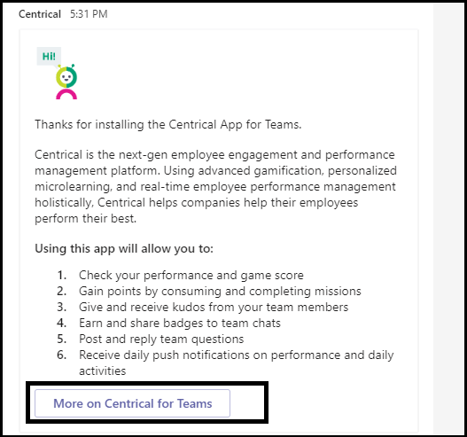

# Tipps für eine erfolgreiche Microsoft Teams-App-Übermittlung

Dieser Artikel befasst sich mit häufigen Gründen, warum übermittelte Apps die Überprüfung nicht erfolgreich waren. Es ist zwar nicht beabsichtigt, eine vollständige Liste aller potenziellen Probleme mit Ihrer App zu erstellen, aber wenn Sie dieses Handbuch folgen, erhöht sich die Wahrscheinlichkeit, dass Ihre App-Übermittlung das erste Mal besteht. Eine [umfassende Liste der Validierungsrichtlinien finden](/legal/marketplace/certification-policies) Sie unter Commercial marketplace certification policies.

>[!NOTE]
>**[Abschnitt 1140](/legal/marketplace/certification-policies#1140-teams)** ist spezifisch für Microsoft Teams, und unter **[Abschnitt 1140.4](https://docs.microsoft.com/legal/marketplace/certification-policies#11404-functionality)** werden die Funktionalitätsanforderungen für Teams-Apps behandelt.

## Validierungsrichtlinien & den meisten fehlgeschlagenen Testfällen

### &#9989; Allgemeine Überlegungen

Siehe auch [Abschnitt 100 – Allgemein](/legal/marketplace/certification-policies#100-general)

* Stellen Sie sicher, dass Sie Version 1.4.1 oder höher des [Microsoft Teams SDK verwenden.](https://www.npmjs.com/package/@microsoft/teams-js)
* Nehmen Sie während des Überprüfungsprozesses keine Änderungen an Ihrer App vor. Dies erfordert eine vollständige Neuvalidierung Ihrer App.
* Ihre App darf sich nicht aufhängen, unerwartet beendet werden oder Programmierungsfehler enthalten. Wenn ein Problem auftritt, muss ihre App fehlschlagen und gültige Informationen für die Weiterleitung an den Benutzer bereitstellen.
* Ihre App darf ausführbaren Code in der Benutzerumgebung nicht automatisch herunterladen, installieren oder starten. Alle Downloads müssen eine explizite Berechtigung des Benutzers einsuchen.
* Alle Materialien, die Sie Ihrer Erfahrung zuordnen, z. B. Beschreibungen und Supportdokumentationen, müssen genau sein. Achten Sie in diesen Materialien auf Rechtschreibung, Zeichensetzung und Grammatik.
* Stellen Sie Hilfe- und Supportinformationen zur Verfügung. Es wird dringend empfohlen, dass Ihre App einen Hilfe- oder FAQ-Link für die erste Ausführung der Benutzeroberfläche enthält. Für alle persönlichen Apps wird empfohlen, Ihre Hilfeseite als persönliche Registerkarte für eine bessere Benutzeroberfläche zur Verfügung zu stellen.
* Alle Apps müssen über eine  visuelle Tour verfügen, z. B. eine Tour oder einen **App-Leitfaden** auf dem Konfigurationsbildschirm, in dem über die App-Features und die erforderliche Integration an den folgenden Stellen berichtet wird:
    * Die Seite zum Speichern von Einträgen (Lange Beschreibung).
    * Registerkartenkonfigurationsbildschirm.
    * Willkommensnachricht für einen Bot.
    * Metadaten der App-Quelle.
    * Connectorkonfigurationsbildschirm.

* Die visuelle Tour kann ein Video, screenshot, ein Link zu einer statischen Registerkarte mit App-Details sein. Alle diese Verweise müssen in der Teams-Umgebung enthalten sein.

     

* Erhöhen Sie Ihre App-Versionsnummer im Manifest, wenn Sie Manifeständerungen an Ihrer Übermittlung vornehmen.
* Die App darf Benutzer nicht für Kernbenutzerszenarien aus Teams nehmen. Linkziele in Apps dürfen nicht mit einem externen Browser verknüpfen. Linkziele müssen mit div-Elementen in Teams, z. B. Aufgabenmodulen und Registerkarten, verknüpfen. 
* Die Verwendung von Aufgabenmodulen oder Registerkarten wird vorgeschlagen, um Benutzern in Teams Informationen anzeigen zu können.
* Alle Kern- und Nicht-Kernszenarien müssen in der Teams-Umgebung abgeschlossen werden, mit Ausnahme von:
  * Datenschutzrichtlinie
  * Nutzungsbedingungen (TOU)
  * Link zur Website
  * Anmeldevorgang

* Mit persönlichen Apps können Benutzer Inhalte aus einer persönlichen App-Erfahrung mit anderen Teammitgliedern teilen.

### &#9989; Bereitstellen einer klaren und einfachen Anmelde-, Anmelde- und Anmeldeerfahrung

Siehe auch [Abschnitt 1100.5 – Kundensteuerung](/legal/marketplace/certification-policies#11005-customer-control)

* Wenn Ihre App oder Ihr Add-In von externen Konten oder Diensten abhängt, muss die Anmelde-, Abmelde- und Anmeldeerfahrung für alle Funktionen in Ihrer App sichtbar und erreichbar sein.
* Wenn dem Benutzer eine explizite Anmeldeoption bereitgestellt wird, muss eine entsprechende Abmeldeoption vorhanden sein (auch wenn die App die automatische Authentifizierung [verwendet).](../../../../tabs/how-to/authentication/auth-silent-aad.md)
* Die Abmeldeoption darf den Benutzer nur aus der Funktion Ihrer App und nicht aus dem Teams-Client abmelden.
* Die Abmeldeoption muss den Benutzer mindestens von denselben Funktionen abmelden, auf die mit der Anmeldeoption zugegriffen wird. Wenn die Anmeldeoption beispielsweise sowohl die Messagingerweiterung als auch die Registerkarte enthält, muss die Abmeldeoption sowohl die Messagingerweiterung als auch die Registerkarte enthalten.

* Stellen Sie sicher, dass es immer eine Möglichkeit gibt, die folgenden (oder ähnlichen) Verhaltensweisen umzukehren:
  * Anmeldung => abmelden.
  * Verknüpfen eines Kontos/Diensts => die Verknüpfung eines Kontos/Diensts auf.
  * Verbinden Eines Kontos/Diensts => Konto/Dienst trennen.
  * Autorisieren eines Kontos/Diensts => deauthorize/deny an account/service.
  * Registrieren eines Kontos/Diensts => Registrierung/Kündigen eines Kontos/Diensts.
* Wenn Ihre App ein Konto oder einen Dienst erfordert, müssen Sie dem Benutzer eine Möglichkeit bieten, sich zu registrieren oder eine Anmeldeanforderung zu erstellen. Eine Ausnahme kann gewährt werden, wenn Ihre App eine Lizenz benötigt. Geben Sie in solchen Szenarien klare Anweisungen für einen neuen Benutzer zur Anmeldung.
* Geben Sie einem neuen Benutzer klare Anleitungen zur Verwendung Ihrer App-Dienste. Wenn kein bereiter Anmeldelink verfügbar ist, geben Sie eine genaue Anleitung in den folgenden Bereichen:

> [!div class="checklist"]
>
> * innerhalb des Abschnitts "Beschreibung" Ihrer App.
> * in der Willkommensnachricht Ihrer App.
> * in der Hilfenachricht Ihrer App.
> * im Fenster, in dem Sie einen Benutzer bitten, sich bei Ihren Diensten zu registrieren.

* Apps ohne einen einfachen Anmeldefluss müssen auch eine Hilferegisterkarte oder einen Link zu einer Webseite enthalten, auf der ein neuer Benutzer detaillierte Anleitungen zum Konfigurieren Ihrer Teams-App sehen kann. Geben Sie detaillierte Informationen an, um sicherzustellen, dass ein neuer Benutzer nicht blockiert wird, wenn Sie Ihre App zum ersten Mal ausprobieren.
* Die Anmelde- und Abmeldefunktionen müssen auf mobilen Clients funktionieren. Stellen Sie sicher, dass [Sie das Microsoft Teams SDK,](https://www.npmjs.com/package/@microsoft/teams-js) Version 1.4.1 oder höher, verwenden.

Weitere Informationen zur Authentifizierung finden Sie unter:

* [Authentifizierungsdokumentation](../../../authentication/authentication.md)
* [Beispiel für die Botauthentifizierung in Node](https://github.com/OfficeDev/microsoft-teams-sample-auth-node)
* [Beispiel für die Registerkartenauthentifizierung im Knoten](https://github.com/OfficeDev/microsoft-teams-sample-complete-node)
* [Tab/Bot-Authentifizierung in C#/.NET](https://github.com/OfficeDev/microsoft-teams-sample-complete-csharp)

### &#9989; Antwortzeiten müssen angemessen sein

* **Registerkarten**. Wenn eine Antwort auf eine Aktion länger als drei Sekunden dauert, müssen Sie eine Ladenachricht oder Warnung bereitstellen.
* **Bots**. Eine Antwort auf einen Benutzerbefehl muss innerhalb von zwei Sekunden erfolgen. Wenn eine längere Verarbeitung erforderlich ist, muss Ihre App einen Eingabeindikator anzeigen.
* **Verfassen von Erweiterungen**. Eine Antwort auf einen Benutzerbefehl muss innerhalb von fünf Sekunden erfolgen.

> [!TIP]
> Stellen Sie sicher, dass Ihre App eine Ladeanzeige oder eine Art Warnung anzeigt, wenn ihre App länger dauert als erwartet, um zu reagieren.

### &#9989; Tab-Inhalt darf nicht übermäßig chrom- oder mehrschichtige Navigation verfügen

* Registerkarten müssen fokussierte Inhalte bereitstellen und unnötige Benutzeroberflächenelemente vermeiden. Dies bezieht sich in der Regel auf unnötige geschachtelte oder mehrschichtige Navigation, eine überflüssige oder irrelevante Benutzeroberfläche neben dem Inhalt oder links, die den Benutzer zu nicht zusammenhängenden Inhalten führen. Die folgende Registerkartenansicht lässt beispielsweise Navigationsmenüs aus und zeigt nur den Hauptinhalt an:

  

* Registerkarten müssen hell sein und keine komplexe Navigation enthalten.
* Kanalregisterkarten mit komplexen Bearbeitungsfunktionen innerhalb der App müssen die Editoransicht in einem Mehrfenster und nicht in einer Registerkarte öffnen.
* Kanalregisterkarten dürfen keine App-Leiste mit Symbolen in der linken Schiene bereitstellen, die mit der Hauptnavigation von Teams in Konflikt stehen.
* Registerkarten dürfen keine App-Leiste mit Symbolen auf der linken Schiene anzeigen, die mit der Hauptnavigation von Teams in Konflikt stehen.
* Registerkarten mit komplexen Bearbeitungsfunktionen innerhalb der App müssen die Editoransicht in einem Mehrfenster öffnen und nicht auf der Registerkarte.
* Wenn mehrere Ansichtsoptionen verfügbar sind, sollten Sie ein Menü für die Registerkartenkonfiguration verwenden, aus dem der Benutzer auswählen kann. Anstatt beispielsweise ein Menü in die Registerkarte einzubetten, legen Sie das Menü auf der Konfigurationsseite ein, damit die tatsächliche Registerkartenansicht sauber und fokussiert ist.
* Fügen Sie eine *Registerkarte Hilfe* als statische Registerkarte ein, um Benutzern zu zeigen, wie Sie Ihre App konfigurieren, registrieren und verwenden.
* Fügen Sie eine *Registerkarte Einstellungen* ein, die in der App-Kopfzeile verfügbar ist.

### &#9989; Tabkonfiguration muss auf dem Konfigurationsbildschirm auftreten

* Der Konfigurationsbildschirm muss den Wert der Besensung und die Konfiguration der Registerkarte klar erläutern.
* Der Konfigurationsprozess muss den Benutzern immer eine Möglichkeit bieten, die Benutzererfahrung weiter zu beenden und nicht zu beenden. Zeigen Sie beispielsweise kein leeres Board an, nachdem der Benutzer die Registerkarte konfiguriert hat.
* Der Benutzer-Anmeldevorgang muss Teil des Konfigurationsprozesses sein. Stellen Sie sicher, dass sie auf der Registerkartenbenutzeroberfläche abgeschlossen wird. Nachdem der Benutzer die Konfiguration abgeschlossen und die Registerkarte geladen hat, ist keine weitere Aktion erforderlich.
* Zeigen Sie ihre gesamte Webseite nicht im Popupfenster für die Anmeldekonfiguration an.
* Ein Benutzer muss immer in der Lage sein, die Konfigurationserfahrung zu beenden, auch wenn er nicht sofort den gesuchten Inhalt finden kann.
* Die Konfigurationserfahrung muss dem Benutzer Optionen zum Suchen nach inhalten, zum Anheften einer URL oder zum Erstellen neuer Inhalte bereitstellen, wenn er nicht vorhanden ist.
* Die Konfigurationserfahrung muss im Kontext von Teams verbleiben. Der Benutzer sollte die Konfigurationserfahrung nicht verlassen müssen, um Inhalte zu erstellen und dann zu Teams zurückzukehren, um ihn anheften zu können.
* Verwenden Sie den verfügbaren Viewportbereich effizient. Verwenden Sie keine großen Logos im Konfigurationspop-up.

### &#9989; Registerkarten im Kanal – Memberzugriff

* Auf eine von einem Mitglied in einem Kanalbereich konfigurierte Registerkarte muss für die anderen Mitglieder zugegriffen werden können, ohne dass das Mitglied, das die Registerkarte konfiguriert hat, berechtigungen einsuchen muss.
* Die App muss die Berechtigungsverwaltungsoptionen vorab bereitstellen, wenn die Registerkarte für die private oder eingeschränkte Verwendung verwendet werden soll oder berechtigungen des Mitglieds erfordert, das die Registerkarte konfiguriert hat.

### &#9989; Bots müssen immer reaktionsfähig sein und anmutig fehlschlagen

Ihr Bot muss auf jeden Befehl und nicht auf den Benutzer reagieren. Hier sind einige Tipps, mit deren Hilfe Ihr Bot intelligent auf Benutzer reagieren kann:

* **Verwenden von Befehlslisten**. Die Analyse von Benutzereingaben oder die Vorhersage von Benutzerabsichten ist schwierig. Anstatt Benutzern zu erraten, was Ihr Bot tun kann, geben Sie eine Liste der Befehle an, die Ihr Bot versteht.

* **Fügen Sie einen Hilfebefehl ein.** Benutzer geben wahrscheinlich "Hilfe" ein, wenn sie verloren gehen oder wenn Ihr Bot nicht wie erwartet reagiert. Fügen Sie einen Hilfebefehl ein, der beschreibt, wie der Wert Ihrer App zusammen mit allen gültigen Befehlen angezeigt wird.

* **Fügen Sie Hilfeinhalte oder Anleitungen ein, wenn Ihr Bot verloren geht.** Wenn Ihr Bot die Benutzereingaben nicht verstehen kann, muss er eine alternative Aktion vorschlagen. Beispiel: *"Es tut mir leid, ich kann es nicht verstehen. Geben Sie "Hilfe" ein, um weitere Informationen zu erhalten."* Antworten Sie nicht mit einer Fehlermeldung oder einfach *mit "Ich verstehe nicht"*.

### &#9989; Hilfebefehlsantwort

* Der Hilfebefehl muss präzise sein, und die App-Antworten müssen in einem adaptiven Kartenformat mit aktionenfähigen Inhalten für mindestens sechs Befehle vorliegen.
* Wenn eine App weniger als sechs Befehle enthält, überprüfen Sie, ob alle Befehle auf der adaptiven Karte vorhanden sind.

  

* **Verwenden von adaptiven Karten und Aufgabenmodulen, um Ihre Botantwort klar und umsetzbar zu machen** 
 [Adaptive Karten mit Schaltflächen, die Aufgabenmodule aufrufen,](/task-modules-and-cards/task-modules/task-modules-bots) verbessern die Benutzerfreundlichkeit des Bots. Diese Karten und Schaltflächen sind auf einem mobilen Gerät einfacher zu verwenden, als dass Der Benutzer die Befehle eintippt. Botantworten dürfen auch nicht textuell mit Langtext sein. Bots müssen adaptive Karten und Aufgabenmodule anstelle von benutzeroberflächenbasiertem Unterhaltungschat und langen Textantworten verwenden.

* **Denken Sie durch alle Bereiche**. Stellen Sie sicher, dass Ihr Bot entsprechende Antworten liefert, wenn sie in einem Kanal und `@*botname*` in persönlichen Unterhaltungen erwähnt werden ( ). Wenn Ihr Bot keinen aussagekräftigen Kontext innerhalb des Persönlichen oder Teams-Bereichs bietet, deaktivieren Sie diesen Bereich über das Manifest. (Siehe den `bots` Block in der Microsoft [Teams-Manifestschemareferenz](../../../../resources/schema/manifest-schema.md#bots).)

* **Schließen Sie Team-, Gruppenchat- oder 1:1-Unterhaltungen ein.** Botbenachrichtigungen müssen ein Team, einen Gruppenchat oder eine 1:1-Unterhaltung mit relevanten Inhalten für Ihre Zielgruppe enthalten.

* **Speichern Sie keine vertraulichen Daten.** Bots dürfen vertrauliche Daten nicht an ein Team, einen Gruppenchat oder eine 1:1-Unterhaltung weiterschieben, in dem eine Zielgruppe diese Daten nicht anzeigen darf.

* **Geben Sie eine Willkommensnachricht an.** Bot muss eine FRE-Willkommensnachricht mit einem interaktiven Lernprogramm mit Karussellkarten oder Schaltflächen zum Ausprobieren bereitstellen, um das Engagement zu fördern.

### &#9989; Persönliche Bots müssen beim ersten Start immer eine Willkommensnachricht senden

Eine Willkommensnachricht ist die beste Möglichkeit, den Ton für Ihren persönlichen Chatbot zu setzen. Dies ist die erste Interaktion, die ein Benutzer mit dem Bot hat. Eine gute Willkommensnachricht kann den Benutzer ermutigen, die App weiter zu erkunden. Wenn die Begrüßungs- oder Einführungsnachricht verwirrend oder unklar ist, wird den Benutzern der Wert der App nicht sofort angezeigt und das Interesse verloren.
Im folgenden Abschnitt finden Sie Anforderungen für Willkommensnachrichten:

> [!Note]
> Eine Willkommensnachricht ist optional für einen Kanalbot.

### Anforderungen an Willkommensnachrichten

* Fügen Sie einen Wertversprechen in die Willkommenstour ein.
* Bereitstellen von Weg-vorwärts-Anleitungen für die Verwendung der App.
* Enthalten Sie Anleitungen zum Registrieren und Konfigurieren Ihrer App.
* Präsentieren Sie leicht lesbaren Text und einen einfachen Dialog – vorzugsweise eine Karte mit einer Aktions-Willkommenstour-Schaltfläche, die ein Aufgabenmodul lädt.
* Halten Sie es einfach und mit Schaltflächen und Karten verwendbar – vermeiden Sie langen Text, chatten Dialog.
* Fügen Sie adaptive Karten und Schaltflächen ein, um die Willkommensnachricht verwendbarer zu machen.
* Rufen Sie die Willkommensnachricht mit einem Ping auf, nicht mit zwei oder mehr gleichzeitigen Pings.
* Eine Willkommensnachricht darf nur dem Benutzer angezeigt werden, der die App konfiguriert hat, vorzugsweise in einem persönlichen 1:1-Chat.
* Persönliche Apps müssen einem Benutzer immer eine Willkommensnachricht senden.
* Senden Sie niemals einen persönlichen Chat an jedes Mitglied des Teams. es wird als Spam betrachtet.
* Senden Sie die Willkommensnachricht niemals mehr als einmal. Das Wiederholen der gleichen Willkommensnachricht in regelmäßigen Intervallen ist nicht zulässig und wird als Spamming betrachtet.

#### Vermeiden von Spamnachrichten für Willkommensnachrichten

* **Kanalnachricht per Bot**. Spamen Sie Benutzer nicht, indem Sie separate neue Chatbeiträge erstellen. Erstellen Sie einen einzelnen Threadbeitrag mit Antworten im gleichen Thread.
* **Persönlicher Chat per Bot**. Senden Sie nicht mehrere Nachrichten. Senden Sie eine Nachricht mit vollständigen Informationen. Das Wiederholen der gleichen Willkommensnachricht in regelmäßigen Intervallen ist nicht zulässig und wird als Spamming betrachtet.

#### Willkommensnachrichten für Benachrichtigungsbots

Nur-Benachrichtigungs-Bots müssen eine Willkommensnachricht senden, die eine Nachricht enthält, die "Ich bin ein Benachrichtigungsbot und kann nicht auf Ihre *Chats antworten" .*

#### Willkommensnachrichten im persönlichen Bereich

   * **Machen Sie Ihre Nachricht prägnant und informativ.** Die Benutzeroberfläche und das Wissen ihrer App variieren. Ein Benutzer hat Ihre App möglicherweise auf einer anderen Plattform verwendet oder weiß nichts über Ihre App. Sie möchten Ihre Nachricht an alle Zielgruppen anpassen und in einigen Sätzen erläutern, was Ihr Bot tut und wie Sie damit interagieren können. Außerdem müssen Sie den Wert der App und den Nutzen der App erläutern.

* **Sorgen Sie dafür, dass Ihre Nachricht aktiv wird.** Überlegen Sie, was Benutzer nach der Installation Ihrer App als Erstes tun möchten. Gibt es einen coolen Befehl, den sie ausprobieren müssen? Gibt es eine weitere Onboardingerfahrung, die sie kennen müssen? Müssen sie sich anmelden? Sie können Aktionen auf einer adaptiven Karte hinzufügen oder bestimmte Beispiele wie *"Fragen versuchen..."*, "Dies kann *ich tun..." .*

#### Willkommensnachrichten im Team- oder Kanalbereich

Beim ersten Hinzufügen des Bots zu einem Kanal sind die Dinge ein wenig anders. Normalerweise sollten Sie keine 1:1-Nachricht an alle Teammitglieder senden, aber der Bot kann eine Willkommensnachricht im Kanal senden.

### &#9989; Mobile Reaktionsfähigkeit, kein direkter Upsell oder Zahlung

* Ihre Registerkarten, adaptiven Karten, Botnachrichten und Inhalte in Aufgabenmodulen müssen für eine Vielzahl von Bildschirmgrößen für mobile Geräte reaktionsfähig sein.
* Apps, die iOS unterstützen, müssen auf dem neuesten iPad-Gerät mit der neuesten Version von iOS voll funktionsfähig sein.
* Darf keine direkten Verweise auf In-App-Käufe, Testangebote, Angebote für kostenpflichtige Versionen oder Links zu Onlinespeichern enthalten, in denen Benutzer andere Inhalte, Apps oder Add-Ins von Ihrer Teams-App unter mobilem Betriebssystem (Android, iOS) erwerben oder erwerben können.
* Die iOS- oder Android-Version des Add-Ins darf keine Benutzeroberfläche oder Sprache oder Links zu anderen Apps, Add-Ins oder Websites anzeigen, die den Benutzer zur Zahlung bitten.
* Die zugehörigen Seiten für Datenschutzrichtlinien und Nutzungsbedingungen müssen auch frei von Beliebigen Commerce UI- oder Store-Links sein.

### &#9989; Vertrauliche Daten nicht an eine Zielgruppe veröffentlichen, die nicht zum Anzeigen der Daten vorgesehen ist

Ihre Teams-App darf keine vertraulichen Daten wie Kreditkarte oder Finanzzahlungsinstrument, PERSÖNLICHE Identifizierbare Informationen (PIN), Integrität oder Kontaktablaufverfolgungsinformationen an eine Zielgruppe posten, die diese Daten nicht anzeigen soll.

### &#9989; Übertragen von Finanziellen Zahlungsdetails oder Abschließen von Finanztransaktionen über Ihre Teams-App

* Ihre Teams-App darf Benutzer nicht bitten, eine Zahlung direkt über die Teams-Schnittstelle zu bezahlen.
* Apps übertragen möglicherweise keine Finanzinstrumentdetails über den Benutzer auf der App-Schnittstelle. Apps dürfen Nur dann Links zu sicheren Zahlungsdiensten an Benutzer übertragen, wenn dies in den Nutzungsbedingungen der App, den Datenschutzrichtlinien und jeder Profilseite oder -website für die App offengelegt wird, bevor ein Benutzer der Verwendung der App zustimmt.

### &#9989; Warnung löschen, bevor Sie Dateien oder ausführbare Dateien ( `.exe` ) in die Umgebung eines Benutzers herunterladen

Bitte warnen Sie die Benutzer, bevor Ihre App Dateien oder ausführbare Dateien ( )in den Computer oder die Umgebung des `.exe`  Benutzers herunterlädt.

### &#9989; Messagingerweiterungen müssen Hilfetext bereitstellen und leicht lesbar sein

* Die suchbasierte Messagingerweiterung muss Hilfetext zur effektiven Suche bereitstellen (z. B. Beispieleingabe).
* Aufgabenmodule müssen ein Symbol und einen kurzen Namen enthalten, den sie in der App enthalten oder aus der App erstellt werden.
* Die ausführbaren `@mention` Dateien der Nachrichtenerweiterung müssen klar, leicht verständlich und leicht zu lesen sein.

## M365 Publisher Attestation

### &#9989; Publisher Attestation im Partner Center abschließen

* Weitere Informationen finden Sie in der Dokumentation zum Complete [Publisher Attestation-Programm.](/microsoft-365-app-certification/docs/attestation)
* Führen Sie die Schritte im [Abschnitt Publisher Attestation Workflow](/microsoft-365-app-certification/docs/userguide#3publisher-attestation-workflow) aus, um den Herausgeberbescheinigungsprozess zu abschließen. Schreiben Sie in appcert@microsoft.com fragen.
* Weitere Informationen finden Sie [im Handbuch zur](/azure/active-directory/develop/troubleshoot-publisher-verification) Problembehandlung.
* Schließen Sie die Selbstbescheinigung über das Partner Center ab. Füllen Sie den Self-Assessment unter **App Compliance aus.**

> [!div class="nextstepaction"]
> [Weitere Informationen zu Genehmigungsrichtlinien für Teams-Apps](/legal/marketplace/certification-policies#1140-teams)
