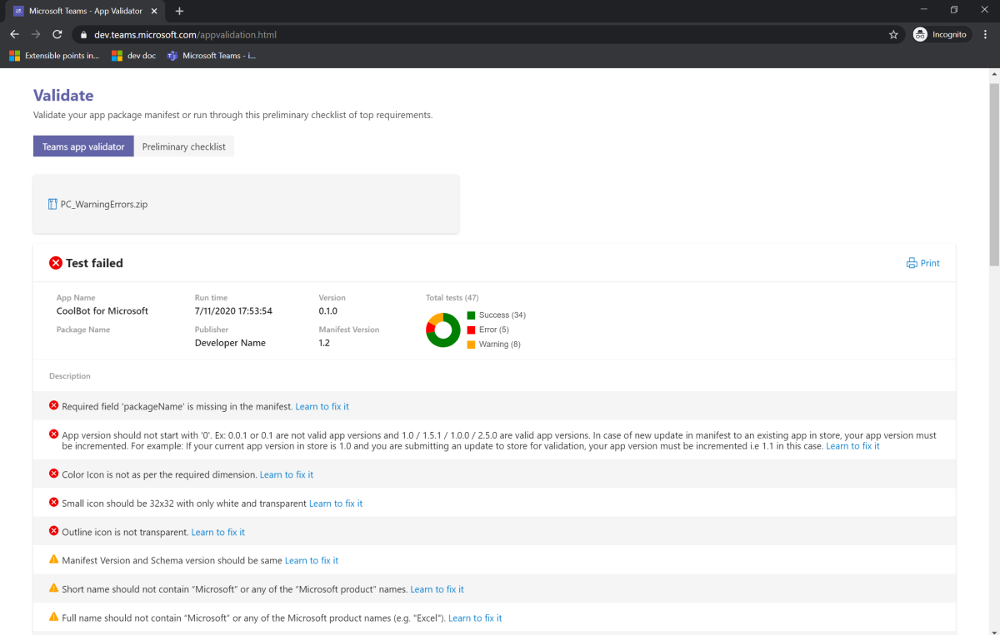
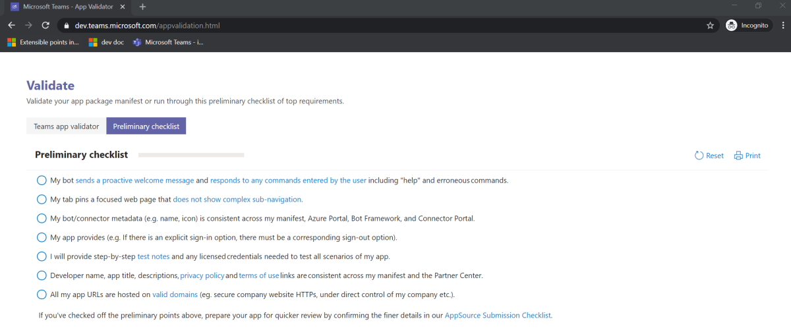

# Vorbereiten der AppSource-Übermittlung  

Um in AppSource aufgeführt zu werden, muss Ihre App einen Genehmigungsprozess durchgehen. Dies ist ein kostenloser Dienst, der von der Microsoft Teams-Gruppe bereitgestellt wird und überprüft, ob Ihre App wie beschrieben funktioniert, alle entsprechenden Metadaten enthält und Inhalte zur Verfügung stellt, die für einen Endbenutzer von Nutzen wären. Um eine schnelle Genehmigung zu erzielen, stellen Sie sicher, dass Ihre App die folgenden Anforderungen und Richtlinien erfüllt:

* **Verteilungsmethode:** Stellen Sie sicher, dass Ihre App für die Veröffentlichung auf einer Store-Plattform gedacht ist. Es gibt [weitere Optionen zum](../../overview.md) Verteilen Ihrer App ohne Veröffentlichung in AppSource.
* **Validierungsrichtlinien:** Ihre App muss vor der Übermittlung alle aktuellen Validierungsrichtlinien von [AppSource](https://docs.microsoft.com/legal/marketplace/certification-policies#1140-teams) bestehen. 
  > [!NOTE] 
  > Die Validierungsrichtlinien von Appsource können geändert werden.
* **Mobile Bereitschaft:** Ihre App muss mobil reagieren. Wenn Ihre App Registerkarten enthält, muss sie die Richtlinien für das [mobile](~/tabs/design/tabs-mobile.md) Design befolgen, und Ihre App muss keine [Upsellanforderungen](~/concepts/deploy-and-publish/appsource/prepare/frequently-failed-cases.md#-mobile-responsiveness-no-direct-upsell-or-payment) für mobile Betriebssysteme (iOS und Android) erfüllen.
* **Testen Sie Ihre App selbst:** Testen Sie Ihre App mithilfe des [Manifestüberprüfungstools.](#teams-app-validation-tool)
* **App-Detailseite:** Ihre App muss an der Prüfliste für die [App-Detailseite ausgerichtet sein.](detail-page-checklist.md)
* **Tipps und häufige Fehlerfälle:** Achten Sie besonders auf die aufgeführten Tipps und häufig fehlgeschlagenen [Fälle,](frequently-failed-cases.md)  um die Übermittlungs- und Genehmigungszeit Ihrer App zu verbessern.
* **App-Manifest:** Überprüfen Sie Ihr App-Manifest anhand der [Prüfliste für das App-Manifest.](app-manifest-checklist.md)
* **Testen und Debuggen:** Stellen Sie sicher, dass Sie Ihre App vollständig getestet [und debuggt haben.](../../../build-and-test/debug.md)
* **Testhinweise:** Fügen Sie Ihre [Testhinweise für die Überprüfung ein.](#test-notes-for-validation)
* **Datenschutzrichtlinien:** Stellen Sie [sicher, dass Ihre Datenschutzrichtlinien, Nutzungsbedingungen und Support-URLs](#privacy-policy-terms-of-use-and-support-urls) unseren Richtlinien entsprechen.

Sobald Sie alle oben genannten Anforderungen erfüllt haben, übermitteln Sie Ihr Paket über Partner Center an [AppSource.](/office/dev/store/use-partner-center-to-submit-to-appsource)

## Teams-App-Validierungstool

Das Tool für die App-Überprüfung besteht aus einem [App-Validator](#teams-app-validator) und einer [vorläufigen Prüfliste.](#preliminary-checklist) Das Tool repliziert dieselben Testfälle, die [von AppSource](/office/dev/store/submit-to-appsource-via-partner-center) zum Auswerten der App-Übermittlung verwendet werden. Daher ist es wichtig, alle Testfälle zu bestehen, bevor Ihre Lösung zur Genehmigung an AppSource übermittelt wird. Das Tool ist in verschiedenen Bereichen der Teams-Plattform zu finden:

> [!div class="checklist"]
>
> * [**Startseite der App-Validator**](https://dev.teams.microsoft.com/appvalidation.html)
> * [**Teams Visual Studio Code Toolkit**](/toolkit/visual-studio-code-overview.md)
> * [**App-Studio**](../../../build-and-test/app-studio-overview.md)

### Validator der Teams-App

Auf **der Seite "Überprüfen"** können Sie Ihr App-Paket vor der Übermittlung an AppSource überprüfen. Laden Sie einfach Ihr App-Paket hoch, und das Validierungstool überprüft Ihre App mit allen manifestbezogenen Testfällen. Für jeden fehlgeschlagenen Test enthält die Beschreibung einen Dokumentationslink, der Ihnen bei der Behebung des Fehlers hilft.

### Vorläufige Prüfliste

Für Testszenarien, die nur schwer automatisiert werden können, werden in der vorläufigen Prüfliste sieben der am häufigsten fehlgeschlagenen Testfälle aufgeführt.

## Datenschutzrichtlinien, Nutzungsbedingungen und Support-URLs

### Datenschutzrichtlinie

Richtlinien für Datenschutzrichtlinien:

> [!div class="checklist"]
>
> * Die Datenschutzrichtlinie kann spezifisch für Ihre App und/oder eine allgemeine Richtlinie für alle Ihre Dienste sein.
> * Wenn Sie eine allgemeine Datenschutzrichtlinie verwenden, muss sie auf "Dienste", "Anwendungen" und "Plattformen" verweisen, damit Ihre Teams-App sowie Ihre Website enthalten sind.
> * Sie muss die Verarbeitung von Benutzerdatenspeicherung, Benutzerdatenaufbewahrung, Löschung und Sicherheitskontrollen umfassen.
> * Sie muss Ihre Kontaktinformationen enthalten.
> * Er sollte keine beschädigten Links, Beta-URLs oder Staging-URLs enthalten.

### Nutzungsbedingungen

Ihre Nutzungsbedingungen sollten spezifisch sein und auf Ihre App und/oder Ihr Add-In-Angebot anwendbar sein.

### Unterstützen von URLs

Ihre Support-URLs sollten keine Authentifizierungs- oder Anmeldeinformationen erfordern, um Sie bei Problemen mit Ihrer App zu kontaktieren.

## Testhinweise für die Überprüfung

Geben Sie folgendes an:

* Sie müssen mindestens zwei Anmeldeinformationen angeben, einen Administrator und einen Nichtadministrator.

* Zu Überprüfungszwecken sollten die von Ihnen zur Verfügung gestellten Konten über ausreichende vorab ausgefüllte Daten verfügen.

* Für Unternehmens-Apps, Apps, für die ein Abonnement erforderlich ist, oder für Apps, bei denen eine Office 365-Mandanten-/Domänenabhängigkeit besteht, müssen Sie ein drittes Konto in derselben Domäne bereitstellen, das nicht für Ihre App vorkonfiguriert ist, damit wir die Benutzererfahrung bei der ersten Ausführung überprüfen können.

* Wenn Ihre App über Premium-/Upgradefeatures verfügt, muss ein Konto mit dem erforderlichen Zugriff bereitgestellt werden, um diese Erfahrung zu testen.

* Sie können Ihre Testnotizen in SharePoint hochladen. Wenn ja, stellen Sie einen öffentlichen Link zur Datei zur Verfügung.

* **Testkonten**. Ein Testkonto ist erforderlich, wenn Ihre App nur lizenzierte Konten oder listensichere Listen aus dem Back-End zulässt. Wenn in Ihrer App ein Team-/Gruppenchatbereich zulässig ist, sind zwei Testkonten im gleichen Mandanten erforderlich, um das Szenario für die Teamzusammenarbeit zu überprüfen.

* **Integrationsschritte**. Wenn für die Verwendung der App eine Vorkonfiguration durch einen Mandantenadministrator erforderlich ist, schließen Sie die Schritte ein, und/oder stellen Sie konfigurierte Administrator- und Nicht-Admin-Konten zur Überprüfung zur Verfügung. Hinweis: Sie können sich für ein Abonnement des [Office 365-Entwicklerprogramms](https://developer.microsoft.com/microsoft-365/dev-program) registrieren. Es ist *90* Tage lang kostenlos und wird kontinuierlich verlängert, solange Sie es für Entwicklungsaktivitäten verwenden.

* **Hinweise zu den App-Features in Teams:** Detaillierte Informationen zu allen Funktionen, die die App in Teams bietet, und Schritte zum Testen der einzelnen Features.

* **Video mit der App-Funktionalität (optional):** Sie können eine Videoaufzeichnung des Produkts bereitstellen, um die Funktionalität der App vollständig zu verstehen.
