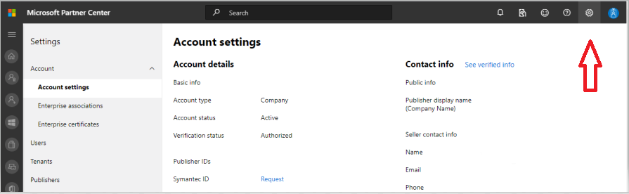

# Übermitteln Ihrer APP an AppSource

## Teams-App-Übermittlung

Wenn Sie Ihre APP in [AppSource](https://appsource.microsoft.com) veröffentlichen, ist Sie im Microsoft Teams-App-Katalog und im Internet verfügbar. Auf hohem Niveau ist der Prozess für die Übermittlung Ihrer APP an AppSource:

1. Entwickeln Sie Ihre APP nach unseren [Entwurfsrichtlinien](~/concepts/design/understand-use-cases.md). Registerkarten sollten den [Entwurfsrichtlinien für die Registerkarte](~/tabs/design/tabs.md)entsprechen. Bots sollten den [bot-Entwurfsrichtlinien](~/bots/design/bots.md)folgen.
1. [Richten Sie ein Entwicklerkonto](/office/dev/store/open-a-developer-account) im [Partner Center](https://support.microsoft.com/help/4499930/partner-center-overview)ein.
1. Bereiten Sie Ihre APP für die Übermittlung vor, indem Sie unsere [Zulassungs Checkliste](~/concepts/deploy-and-publish/appsource/prepare/submission-checklist.md)befolgen.
1. Lesen Sie unsere [Tipps für eine erfolgreiche App-Übermittlung](~/concepts/deploy-and-publish/appsource/prepare/frequently-failed-cases.md).
1. Übermitteln Sie Ihr Paket [über das Partner Center an AppSource](/office/dev/store/use-partner-center-to-submit-to-appsource).
1. Verfolgen Sie den Genehmigungsprozess im Partner Center-Dashboard. *Siehe* [Partner Center (Übersicht](https://support.microsoft.com/help/4499930/partner-center-overview)).
1. Post Submitting – lesen Sie unsere Anleitung zum [warten und unterstützen Ihrer veröffentlichten App](~/concepts/deploy-and-publish/appsource/post-publish/overview.md).

>[!NOTE]
>
> * Wenn Ihre Teams-APP einen bot enthält, müssen Sie den [Code of Conduct für](https://aka.ms/bf-conduct)den bot Developer Framework einhalten.
> * Wenn Ihre APP einen Office 365 Connector enthält, gelten möglicherweise zusätzliche Bedingungen. *Weitere Informationen finden Sie unter* [Connectors Developer Dashboard](https://aka.ms/connectorsdashboard) und [App Developer Agreement](https://sellerdashboard.microsoft.com/Assets/Content/Agreements/Office_Store_Seller_Agreement_20120927.htm).

## FAQs – Microsoft Teams-apps und Partner Konten

## Wie erstelle ich ein Partner Center-Konto?

Es gibt zwei Möglichkeiten, ein Partner Center-Konto zu erstellen:

* Wenn Sie noch nicht im Partner Center sind und kein Konto im Microsoft-Netzwerk haben, [Erstellen Sie ein Konto über die Seite Partner Center-Registrierung](/office/dev/store/open-a-developer-account#create-an-account-using-an-existing-partner-center-enrollment).
* Wenn Sie bereits im Partnernetzwerk registriert sind, [Erstellen Sie ein Konto direkt im Partner Center unter Verwendung einer vorhandenen Registrierung](/office/dev/store/).

## Wie füge ich meine Telefonnummer zum Abschnitt "Kontaktinformationen" hinzu?

Die Telefonnummer besteht aus drei Teilen: Ländervorwahl, Ortsvorwahl und Telefonnummer. Wenn ein beliebiger Abschnitt nicht anwendbar ist, geben Sie die `0`Nummer ein.

## Warum erhalte ich die Meldung "dieses Konto ist nicht veröffentlicht?", wenn ich versuche, mein Add-in über das Partner Center zu übermitteln?

Die obige Fehlermeldung wird angezeigt, wenn der [Status Ihrer Kontoüberprüfung](/partner-center/verification-responses) aussteht. Sie können den Status der Kontoüberprüfung im Partner Center- [Dashboard](https://partner.microsoft.com/dashboard) überprüfen, indem Sie die Option **Einstellungen** (Zahnradsymbol) in der oberen rechten Ecke der Seitenkopf Schale auswählen und die Einstellungen für das**Konto**  => **Konto** für **Entwicklereinstellungen** => auswählen.

Während des Konto Überprüfungsprozesses wird der Status jedes erforderlichen Schritts (e-Mail-Besitz, Überprüfung der Arbeitsplätze und Unternehmens Verifizierung) angezeigt. Nachdem der Überprüfungsvorgang erfolgreich abgeschlossen wurde, ändert sich der Überprüfungsstatus Ihrer Registrierung auf der Profilseite von "Ausstehend" in "autorisiert", und die Prozessschritte werden nicht mehr angezeigt.

## Wie erhalte ich weitere Unterstützung für meine Konto bezogenen Probleme?

Besuchen Sie die [Seite Partner-Hilfe und Support](https://aka.ms/marketplacepublishersupport) , und suchen Sie nach hilfreichen Lösungen für die Dokumentation in Bezug auf Ihr Problem. Wenn die bereitgestellten self-serve-Lösungen oder-Dokumente nicht hilfreich sind, um Ihr Problem zu beheben, geben Sie ein Support Ticket ein, indem Sie im Abschnitt **Nächster Schritt** die Option **Problemdetails bereitstellen** auswählen. Sie können in dem Suchfeld nach Ihrem Problemthema suchen oder unter dem Suchfeld auf **Themen durchsuchen**klicken, um einen weiteren Drilldown durchgeführt zu werden.

> [!TIP]
> Wenn Sie Hilfe bei einem **Konto Überprüfungs** Problem benötigen:
>
>1. Wählen Sie unter dem **Suchfeld**die Option **Themen durchsuchen**aus.
>1. Wählen Sie im Dropdownmenü **Kategorie** **Alle Programme** aus.
> 1. Wählen Sie **Konto, Onboarding, Access** aus dem Dropdownmenü **Thema** aus.
>1. **Wählen Sie** im Dropdownmenü unter **Thema** eine Option aus.
>1. Für weitere Unterstützung. Wählen Sie im Abschnitt **Nächster Schritt** **Problemdetails bereitstellen** aus.
>

## Ich habe meine e-Mail-Ordner überprüft und die Bestätigungs-e-Mail nicht erhalten. Was muss ich als nächstes tun?

Versuchen Sie Folgendes:

1. Überprüfen Sie Ihren Junk-Spam-Ordner.
1. Löschen Sie den Browsercache, wechseln Sie zu Ihrem Partner Center-Konto Dashboard, und wählen Sie den Link Überprüfung der über **Prüfung erneut senden** aus, damit die Bestätigungs-e-Mail an Ihre e-Mail-Adresse gesendet wird
1. Versuchen Sie, über einen anderen Browser auf den Link zum **erneuten Senden der Überprüfungs e-Mail** zuzugreifen.
1. Arbeiten Sie mit Ihrer IT-Abteilung zusammen, um sicherzustellen, dass die Überprüfungs e-Mails nicht vom e-Mail-Server blockiert werden.
1. Passen Sie den Spamfilter Ihres Servers so an, dass alle e-Mails von Maccount@Microsoft zugelassen/Whitelists enthalten sind **.  com**.

## Wie lange dauert der Prozess der Überprüfung der Arbeit?

Wenn alle Details richtig angegeben werden, wird die Überprüfung der Arbeitszeit in 1 bis 2 Stunden abgeschlossen.

## Ich habe bereits die Unterstützung erreicht, gibt es eine Möglichkeit, meinen Fall zu beschleunigen?

Support Tickets werden innerhalb einer Woche aufgelöst. Suchen Sie nach den Updates, die an die e-Mail gesendet werden, die bei der Erhöhung des Support Tickets angegeben wurde.

## Ich habe ein Support Ticket erstellt, es war 7 Werktage, und ich habe kein Update erhalten. Wo erhalte ich weitere Hilfe?

Senden Sie eine e-Mail **<teamsubm@microsoft.com>** mit den folgenden Details:

1. **Betreffzeile**. *Problem beim Partner Center Konto für <App_Name>* (geben Sie den Namen Ihrer APP an).
2. **E-Mail-Text:**
    * Support Ticketnummer:
    * Ihre Verkäufer-ID:
    * Ein Screenshot des Problems.

> [!div class="nextstepaction"]
> [Weitere Informationen zu app-Validierungsrichtlinien für Microsoft Teams](https://docs.microsoft.com/legal/marketplace/certification-policies)
