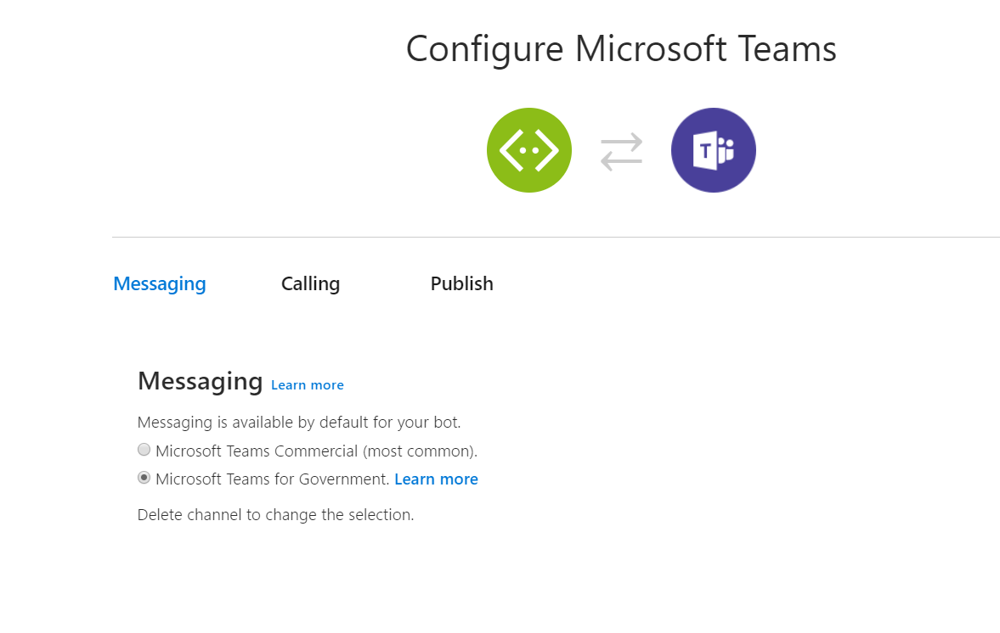

# Verteilen Ihrer Microsoft Teams-App

Nachdem Sie Ihre App erstellt haben, gibt es drei Optionen für die Verteilung:

1. [Laden Sie Ihre App direkt hoch.](#upload-your-app-directly)
2. [Veröffentlichen Sie Ihre App im App-Katalog Ihrer Organisation.](#publish-to-your-organizations-app-catalog)
3. [Veröffentlichen Sie Ihre App über AppSource.](#publish-to-appsource)

## Unternehmensorganisationen

### Direktes Hochladen Ihrer App

Dies ist die einfachste Möglichkeit, Ihre App zu testen und zu verwenden. Wenn Sie der Teambesitzer sind und/oder das Hochladen benutzerdefinierter Apps aktiviert [ist,](/microsoftteams/admin-settings)können Sie die App direkt hochladen [(oder querladen)](./apps-upload.md) und sofort damit beginnen, sie zu verwenden. Wenn Sie die App jedoch für andere freigeben möchten, müssen Sie ihnen Ihr App-Paket senden und sie bitten, es unabhängig hochzuladen.

Wenn Sie Ihre App breiter verteilen möchten, bietet Teams einen In-App-Katalog für Benutzer, um hochwertige Teams-Apps zu finden oder zu entdecken. Damit Ihre Lösung im Katalog verfügbar ist, müssen Sie sie entweder im App-Katalog Ihrer [Organisation](#publish-to-your-organizations-app-catalog) oder [in AppSource veröffentlichen.](./appsource/publish.md)

### Veröffentlichen im App-Katalog Ihrer Organisation

Der App-Katalog Ihrer Organisation enthält Apps, die für Ihre Organisation einzigartig sind und vollständig unter der Kontrolle Ihrer Organisation sind. Weitere Informationen finden Sie im Artikel "Veröffentlichen von [*Apps im App-Katalog Ihrer Organisation".*](/microsoftteams/tenant-apps-catalog-teams) Dieses Feature kann nur von Teams-Benutzern mit Microsoft Office 365 Mandantenadministratorberechtigungen verwaltet werden.

### Veröffentlichen in AppSource

AppSource (früher als Office Store bezeichnet) bietet einen praktischen Ort zum Verteilen Ihrer Microsoft Teams-App sowie anderer Office 365-Erweiterungstypen wie Office-Add-Ins und SharePoint-Add-Ins. Befolgen Sie unsere Richtlinien, [um Ihre App an AppSource zu übermitteln.](./appsource/publish.md)

## Government Community Cloud (GCC)-Organisationen

### Hochladen Ihrer benutzerdefinierten App direkt in Teams

 Als GCC-Mandantenadministrator entscheiden Sie, ob Sie eine benutzerdefinierte App in Ihre Mandantenumgebung hochladen und in Ihrem Mandanten-App-Katalog veröffentlichen möchten. Microsoft besitzt oder kontrolliert ihre benutzerdefinierten Anwendungen nicht. Daher müssen Sie sicherstellen, dass alle Endpunkte den Anforderungen Ihrer Organisation entsprechen. Wenn die App-Lösung außerdem einen Bot oder eine Nachrichtenerweiterung enthält, müssen Sie die [Bot -Framework-Registrierung](https://dev.botframework.com/) wie folgt abschließen:

1. Wählen Sie **auf der Seite "Mit Kanälen verbinden"** unter **"Empfohlenen Kanal hinzufügen"** die Option **"Teams" aus.**
1. Navigieren Sie zur **Seite "MSTeams konfigurieren"** *(siehe* unten).
1. Wählen **Sie unter "Messaging"** das **Optionsfeld "Microsoft Teams for Government Customers"** aus.
1. Wählen Sie in der unteren linken Ecke der Seite **"Speichern" aus.**  

>[!IMPORTANT]
> Sie können die kommerzielle Konfiguration von Teams nicht zum Hochladen/Querladen Ihrer benutzerdefinierten App in eine GCC-Umgebung verwenden. Sie müssen das Optionsfeld **"Microsoft Teams für** Government Customers" für eine GCC-kompatible Konfiguration auswählen.

> [!NOTE]
>
> * Die oben dargestellten Uploadanweisungen für GCC-Umgebungen gelten für benutzerdefinierte Teams-Apps.  
> * Kompatible Microsoft Apps sind in der GCC-Umgebung standardmäßig in Teams aktiviert.
> * Drittanbieter-Apps werden auf Mandantenebene deaktiviert und sollten über die App-Berechtigungsrichtlinien Ihrer [Organisation verwaltet werden.](/microsoftteams/teams-app-permission-policies) Stellen Sie sicher, dass Sie alle Apps von Drittanbietern überprüfen, um sicherzustellen, dass sie mit den Richtlinien und Verfahren Ihrer Organisation in Einklang stehen.

> [!TIP]
>
> Microsoft 365-Entwicklerpartner stellen Sicherheits-, Datenverarbeitungs- und Compliancedetails für ihre Drittanbieter-Teams-Apps über das [Microsoft 365-App-Zertifizierungsprogramm zur Verfügung.](/microsoft-365-app-certification/overview) *Siehe auch Microsoft* [Teams-App-Zertifizierung.](/microsoftteams/platform/concepts/deploy-and-publish/appsource/post-publish/application-certification)
  
