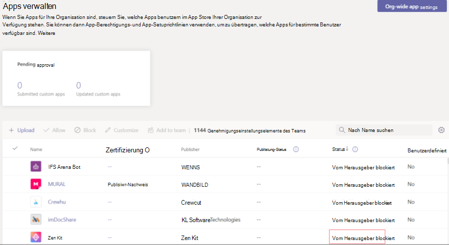

# Anpassen Ihrer Teams-App

## Aktivieren der anpassungsfähigen Microsoft Teams-App

Sie können Es Kunden ermöglichen, einige Aspekte Ihrer Microsoft Teams-App im Teams Admin Center anzupassen. Dieses Feature wird nur für Apps unterstützt, die im Teams Store veröffentlicht wurden. Quergeladene Apps und Apps, die für eine Organisation veröffentlicht wurden, können nicht angepasst werden.

Einige mögliche Beispiele für dieses Feature sind:

* Ändern der Akzentfarbe der App entsprechend der Marke einer Organisation.
* Aktualisieren des App-Namens von *Contoso* auf *Contoso-Agent*, bei dem es sich um den Namen handelt, der Benutzern in der Organisation angezeigt wird. (Hinweis: Benutzern, die einen Connector zu einem Chat oder Kanal hinzufügen, wird weiterhin der ursprüngliche App-Name *Contoso* angezeigt.)

Sie können dieses Feature im [Entwicklerportal für Teams](https://dev.teams.microsoft.com/home)aktivieren. Dadurch `configurableProperties` wird konfiguriert, was in Versionen vor 1.10 des Teams-App-Manifests nicht verfügbar ist.

### Testen eigener Apps

Sie können dieses Feature während der Entwicklung nicht testen. Die App-Anpassung wird beim Querladen oder Veröffentlichen im App-Katalog einer Organisation nicht unterstützt.

### Überlegungen zu Benutzern

Bereitstellen von Richtlinien für Kunden (insbesondere Teams Administratoren), die Ihre App anpassen möchten. Weitere Informationen finden Sie unter [Anpassen von Apps in Teams.](/MicrosoftTeams/customize-apps)

## Ausblenden Teams App bis zur Genehmigung durch den Administrator

Um Teams App-Erfahrung zu verbessern, können Sie eine App standardmäßig vor Benutzern ausblenden, bis der Administrator das Einblenden der App erlaubt. Contoso Electronic hat beispielsweise eine Helpdesk-App für Teams erstellt. Um eine ordnungsgemäße Funktionsweise der App zu ermöglichen, möchte Contoso Electronic, dass die Kunden zuerst bestimmte Eigenschaften der App einrichten. Die App ist standardmäßig ausgeblendet und für Benutzer nur verfügbar, nachdem der Administrator sie erlaubt hat.

Um die App auszublenden, legen Sie die Eigenschaft in der App-Manifestdatei `defaultBlockUntilAdminAction` auf `true` . Wenn die Eigenschaft auf ", in Teams Admin Center > Verwalten von Apps festgelegt `true` ist, wird **vom Herausgeber blockiert** im **App-Status** angezeigt: 

Der Administrator erhält eine Anforderung zum Ergreifen von Maßnahmen, bevor ein Benutzer auf die App zugreifen kann. Unter **"Apps verwalten"** können die Administratoren **"Zulassen"** auswählen, um die App mit dem Status **"Vom Herausgeber blockiert"** zuzulassen:

Wenn die App standardmäßig nicht ausgeblendet werden soll, können Sie die `defaultBlockUntilAdminAction` Eigenschaft auf `false` aktualisieren. Wenn die neue Version der App genehmigt wird, ist die App standardmäßig zulässig, solange der Administrator keine explizite Aktion ausgeführt hat.

> [!NOTE]
> `defaultBlockUntilAdminAction` wird für Branchen-Apps nicht unterstützt. Wenn Sie eine Branchen-App mit dieser Eigenschaft hochladen, wird die App nicht blockiert.

## Siehe auch

* [App-Manifestschema](/microsoftteams/platform/resources/schema/manifest-schema)
* [Anpassen von Apps im Teams Admin Center](/MicrosoftTeams/customize-apps)

