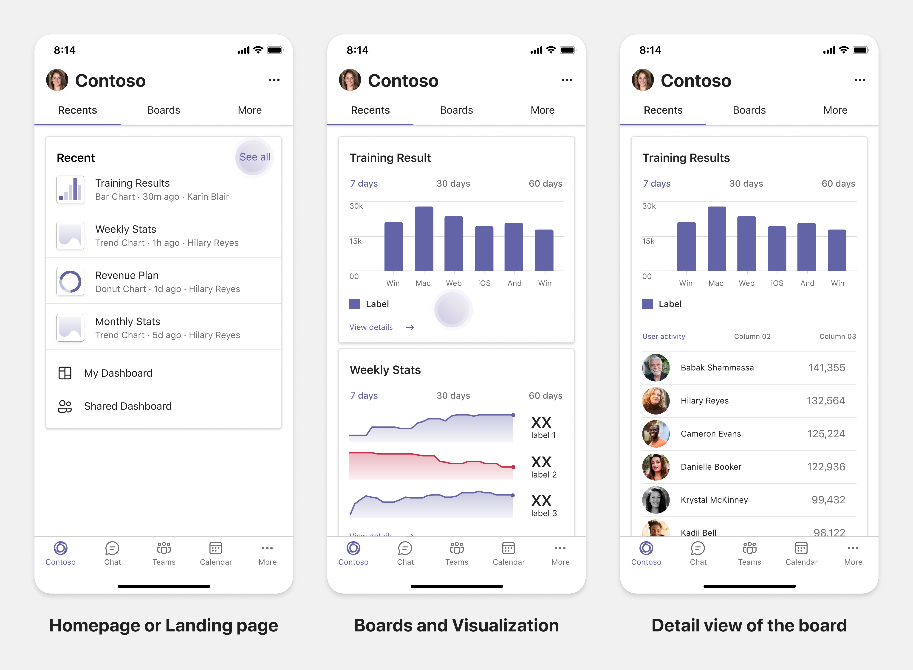
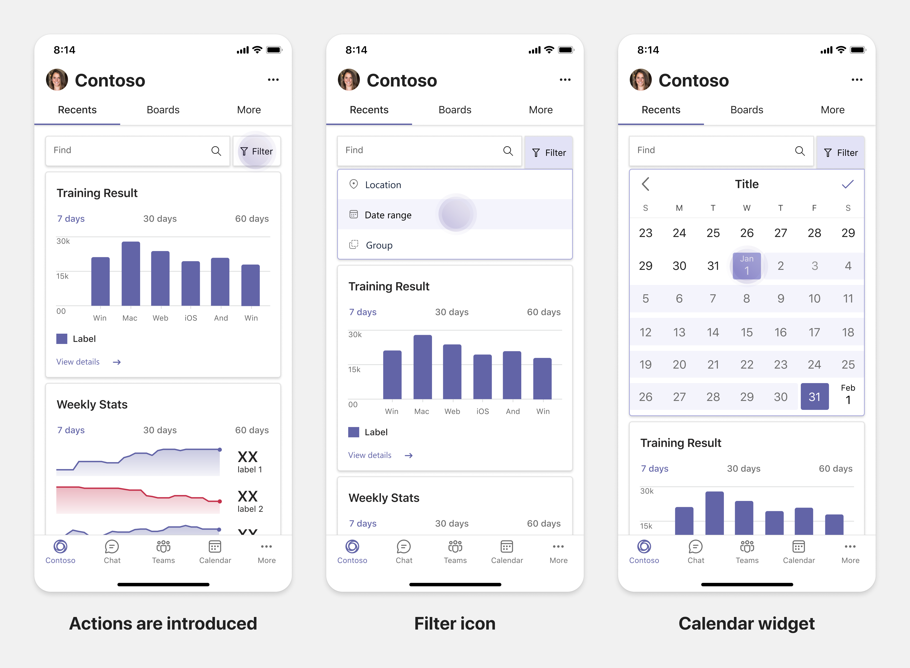

# Planen reaktionsfähiger Registerkarten für Teams Mobile

 Die Microsoft Teams-Plattform bietet die Möglichkeit, Apps für Mobilgeräte und Desktops zu erstellen. Ihre App-Benutzer können Desktops oder Mobilgeräte oder beides bevorzugen. Die Benutzer können Daten auf dem Desktop vorbereiten, aber mehr Daten mit Mobilgeräten nutzen und teilen. Der Schlüssel zum Erstellen jeglicher App besteht darin, die Anforderungen der Benutzer zu verstehen und zu erfüllen. Es gibt Funktionen wie Bots, Nachrichtenerweiterungen und Connectors, die nahtlos auf Desktop- und Mobilgeräten funktionieren. Das Erstellen von Registerkarten und Aufgabenmodulen erfordert jedoch etwas Planung für das Hosten Ihrer Weblösung auf mobilen Microsoft Teams-Geräten. Dieser Artikel enthält Anweisungen zum Planen reaktionsfähiger Webseiten auf mobilen Microsoft Teams-Geräten.

## Identifizieren des App-Anwendungsbereichs

Die folgende Liste enthält die wichtigsten Informationen zum Planen der Erstellung von Apps für mobile Microsoft Teams-Geräte:

* Erwägen Sie geräteübergreifende Funktionalität für die Microsoft Teams-App. Wenn Sie beispielsweise über eine gut funktionierende App für Desktops verfügen, können Sie eine ähnliche App für Mobilgeräte erstellen. Anfangs kann es schwierig sein, die gesamte Desktoplösung für Mobilgeräte anzupassen. Sie können mit einfachen, aber gängigen Szenarien beginnen. Fügen Sie weitere Funktionen und Features hinzu, nachdem Sie Erkenntnisse und Benutzerfeedback gesammelt haben.

* Stellen Sie sicher, dass die App auf geeignete Benutzerpersonas auf Mobilgeräten ausgerichtet ist. Wenn Sie z. B. eine App erstellen, die Dienste für Endbenutzer und außerdem Datenzugriff für Entwickler und leitende Angestellt bietet, können die Endbenutzer die App mehr nutzen, während Sie mit dem Erstellen der App für mobile Microsoft Teams-Geräte beginnen. Sie können alle Personas Ihrer Desktop-App berücksichtigen, es empfiehlt sich jedoch, für eine kleinere Bildschirmerfahrung mit Personas mit größerer Basis und möglichen Early Adopters zu beginnen. Wie in dem Beispiel sind die Endbenutzer die geeigneten Benutzerpersonas. Sie können schrittweise Funktionen hinzufügen, um weitere Benutzerpersonas in Ihrer mobilen Microsoft Teams-App zu unterstützen.

## Grundlegendes zu den verschiedenen Phasen beim Erstellen von Apps

Nachdem Sie den App-Anwendungsbereich identifiziert haben, gilt es, die folgenden drei Phasen für die Planung jeglicher mobilen Microsoft Teams-App und zur Verbesserung der Benutzerfreundlichkeit zu verstehen:

1. **Nutzung**

   Apps auf Mobilgeräten anzeigen. Für die Erstellung einer App für Mobilgeräte können Sie bei der Nutzung beginnen. Da Mobilgeräte das Scrollen nach Inhalten zu einer gängigen Praxis gemacht haben, können Sie relevante Informationen anzeigen. Verwenden Sie Engagementmechanismen, z. B. Benachrichtigungen, um über Updates zu informieren.

2. **Schnelle Aktionen**

   Verwenden der App auf Mobilgeräten. Nachdem Ihre Benutzer mit der Nutzung der Inhalte auf Mobilgeräten begonnen haben, können Sie Ihre App an die nächste Ebene anpassen, indem Sie einige Aktionen von der Desktop-App auf sie übertragen. Sie können neue Aktionen für Mobilgeräte optimieren und programmieren.

3. **Aktivierung**

   Stellen Sie vollständige App-Funktionen für Interaktionen auf Mobilgeräten bereit. Bieten Sie für Interaktionen mit Ihrer App auf Mobilgeräten eine vollständige immersive Benutzererfahrung, die entweder so gut oder noch besser als jene auf Desktops ist. Um den Nutzern eine gute Benutzererfahrung zu bieten, sorgen Sie für Reaktionsfähigkeit für alle Anwendungsfälle auf Mobilgeräten.

> [!TIP]
> Informationen zu den Entwurfsrichtlinien finden Sie unter [Entwurfsprozess für Microsoft Teams-Apps](design-teams-app-process.md).

## Anwendungsfälle

Lassen Sie uns die folgenden Anwendungsfälle durchgehen, um zu verstehen, wie verschiedene Arten von Apps für mobile Microsoft Teams-Geräte geplant werden:

 

<b>Dashboarding- und Datenvisualisierungs-Apps</b>

Lernen Sie, wie Sie dynamische Registerkarten für Dashboarding- und Datenvisualisierungs-Apps auf der Microsoft Teams-Plattform für Mobilgeräte planen.

Nutzung:

In der ersten Phase können Sie die grundlegendste Nutzungsumgebung implementieren, um Daten anzuzeigen. Der Zweck jeder App in der Domäne besteht darin, Daten zu visualisieren. In Ihrer App können Sie zuletzt auf dem Desktop angezeigte Visualisierungen oder eine Liste aller autorisierten Diagramme für die Benutzer anzeigen. Nach dem Erstellen von Dashboards auf dem Desktop können Benutzer über Mobilgeräte auf die Informationen zugreifen. Sie können eine vom Benutzer ausgewählte detaillierte Ansicht eines beliebigen Diagramms als erweiterte Ansicht auf Ihren Registerkarten oder mithilfe von Aufgabenmodulen anzeigen.

Die folgenden Informationen können ebenfalls angezeigt werden:

* Dashboards und Zusammenfassungen
* Visualisierte Daten, Karten und Infografiken
* Diagramme, Grafiken und Tabellen

Schnelle Aktionen:

In der zweiten Phase können die Benutzer über die Desktopversion an den vorhandenen Diagrammen und visuellen Elementen arbeiten. Sie können die folgenden Aktionen einbinden:

* Inhalte durchsuchen
* Filtern von Daten
* Erstellen von Lesezeichen

Aktivierung:

In der dritten Phase können Benutzer Inhalte wie Diagramme und Grafiken von Grund auf neu erstellen. Stellen Sie sicher, alle Funktionen in Ihre App für Mobilgeräte zu übertragen. Sie können z. B. Aufgabenmodule verwenden, um den Zugang zu bestimmten Datenelementen mit detaillierten Ansichten zu erleichtern.

Sie können Benutzern folgende Zugriffsoptionen bieten:

* Titel und Beschreibung ändern
* Einfügen von Datenelementen zum Erstellen von Visualisierungen
* Freigeben von Visualisierungen in einem Kanal oder Gruppenchat

 

 

<b>Aufgaben-Boarding-Apps</b>

Lernen Sie, wie Sie dynamische Registerkarten für Aufgaben-Boarding-Apps auf der Microsoft Teams-Plattform für Mobilgeräte planen.

Nutzung:

In der ersten Phase kann Ihre App dem Benutzer die Liste der Aufgaben in einem vertikalen Stapel anzeigen. Stellen Sie bei mehreren Kategorien von Aufgaben – z. B. **Vorgeschlagen**, **Aktiv** und **Geschlossen** – Filter zum Anzeigen gruppierter Aufgaben oder als Überschriften bereit, um die gruppierten Aufgaben anzuzeigen.

Schnelle Aktionen:

In der zweiten Phase können Sie den Benutzern folgende Zugriffoptionen in der App bieten:

* Erstellen von Aufgaben oder Elementen mit Pflichtfeldern, um die kognitive Belastung der Benutzer zu verringern
* Ändern des Board-Typs oder der Ansicht
* Überprüfen von Aufgaben durch Erweitern der Ansicht
* Verwenden von Aufgabenmodulen zum Anzeigen einer detaillierten Ansicht
* Verschieben der Aufgaben in verschiedene Kategorien
* Freigeben relevanter Aufgaben in Chats und Kanälen über E-Mails und Aktivitätsfeeds

Aktivierung:

In der dritten Phase können Sie die Benutzererfahrung um die folgenden Aktivitäten erweitern:

* Hinzufügen neuer Projekte und Boards
* Hinzufügen und Ändern verschiedener Kategorien, z. B. **Vorgeschlagen**, **Aktiv** und **Geschlossen**
* Konfigurieren der Aufgaben für Kommentare, Anlagen und andere komplexe Features

 

 

<b>Apps für gemeinsame Dokumenterstellung und Whiteboarding</b>

Lernen Sie, wie Sie dynamische Registerkarten für Apps für die gemeinsame Dokumenterstellung und das Whiteboarding auf der Microsoft Teams-Plattform für Mobilgeräte planen.

Nutzung:

In der ersten Phase können Sie eine Desktoplösung in Betracht ziehen, um die Inhalte und Ressourcen in Ihrer App anzuzeigen.  Sie können die folgenden Funktionen anzeigen:

* Kommentare oder Feedback
* Vergrößern oder Verkleinern
* Aktueller Status oder Fortschritt eines ausstehenden Dokuments

Schnelle Aktionen:

In der zweiten Phase können Sie die folgenden Aktionen einführen:

* Erstellen eines neuen Boards für die Zusammenarbeit oder neuer Dokumente zum Signieren
* Freigeben von Boards intern und auch für Gäste
* Konfigurieren von Administratorberechtigungen

> [!TIP]
> Sie machen Aktionen verfügbar, die auf den kleinen Bildschirmen einfach angezeigt werden können.

Aktivierung:

Stellen Sie in der dritten Phase ihren Benutzern eine vollständige Lösung bereit. Sie können die Benutzererfahrung um die folgenden Aktivitäten erweitern:

* Hinzufügen von Text, Formen und schnellen Notizen
* Navigieren in Inhalten
* Hinzufügen von Ebenen und Filtern
* Löschen, Rückgängigmachen und Wiederholen von Vorgängen
* Zugreifen auf Kamera und Mikrofon mit JS SDK-APIs. Weitere Informationen zu Gerätefunktionen finden Sie in der [Übersicht über Gerätefunktionen](../device-capabilities/device-capabilities-overview.md).

 

## Siehe auch

Je nach Umfang Ihrer App können die folgenden Entwurfs- und Validierungsrichtlinien hilfreich sein:

* [Entwerfen ihrer Registerkarte](../../tabs/design/tabs.md)
* [Entwerfen Ihres Bots](../../bots/design/bots.md)
* [Entwerfen von Aufgabenmodulen](../..//task-modules-and-cards/task-modules/design-teams-task-modules.md)
* [Richtlinien für die Store-Validierung](../deploy-and-publish/appsource/prepare/teams-store-validation-guidelines.md)
