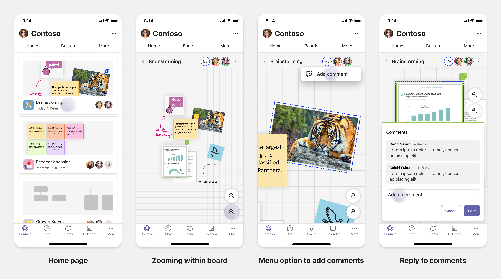

# Planen reaktionsfähiger Registerkarten für Teams Mobile

 Teams Plattform bietet die Möglichkeit, Apps auf Mobilgeräten und Desktops zu erstellen. Ihre App-Benutzer können desktop- oder mobil oder beides bevorzugen. Die Benutzer können Daten auf dem Desktop vorbereiten, aber mehr Daten über Mobilgeräte nutzen und freigeben. Der Schlüssel zum Erstellen einer App besteht darin, die Anforderungen der Benutzer zu verstehen und zu erfüllen. Es gibt Funktionen wie Bots, Messaging-Erweiterungen und Connectors, die nahtlos auf Desktops und mobilen Geräten funktionieren. Das Erstellen von Registerkarten und Aufgabenmodulen erfordert jedoch die Planung für das Hosten Ihrer Webumgebung auf Teams Mobilen. In den Dokumenthandbüchern können Sie Ihre reaktionsfähigen Webseiten auf Teams Mobilgeräten planen.

## Identifizieren des App-Bereichs

Die folgende Liste enthält die wichtigsten Informationen zum Planen der Erstellung von Apps für Teams Mobile:

* Ziehen Sie die geräteübergreifende Funktionalität Teams App in Betracht. Wenn Sie beispielsweise über eine leistungsfähige App auf dem Desktop verfügen, können Sie untersuchen, wie Sie eine ähnliche App auf mobilen Geräten erstellen können. Anfangs kann es schwierig sein, die gesamte Desktopumgebung auf mobilen Geräten zu ändern. Sie können mit einfachen, aber gängigen Szenarien beginnen. Fügen Sie Funktionen und Funktionen hinzu, nachdem Sie mehr Einblicke und Benutzerfeedback gesammelt haben.

* Stellen Sie sicher, dass die entsprechende Benutzerpersona auf mobilgeräten ausgerichtet ist. Wenn Sie beispielsweise eine App erstellen, die Dienste für Endbenutzer bereitstellt und Entwicklern und leitenden Managern Datenzugriff bietet, können die Endbenutzer die App mehr verwenden, während Sie mit dem Erstellen einer App auf Teams Mobilgerät beginnen. Sie können jedoch auf alle Personas zugreifen, die Sie in Ihrer Desktop-App haben. Es wird jedoch empfohlen, mit Persona mit einer größeren Basis und möglichen Early Adoptern für eine kleinere Bildschirmerfahrung zu beginnen. Gemäß dem Beispiel sind die Endbenutzer die entsprechenden Benutzerpersonas. Sie können schrittweise Funktionen hinzufügen, um andere Benutzerpersonas auf Ihrem Teams Mobilen zu unterstützen. 

## Grundlegendes zu den verschiedenen Phasen zum Erstellen von Apps

Nachdem Sie den App-Bereich identifiziert haben, ist es an der Zeit, die folgenden drei Phasen zu verstehen, um jede App auf Teams Mobilgerät zu planen und die Benutzererfahrung zu verbessern:

1. **Verbrauch**

   Anzeigen von Apps auf mobilgeräten. Um eine App auf mobilen Geräten zu erstellen, können Sie mit der Nutzung beginnen. Da das Scrollen nach Inhalten in der mobilen Welt üblich ist, können Sie relevante Informationen anzeigen. Verwenden Sie Interaktionsmechanismen, z. B. Benachrichtigungen, um Updates zu informieren.

2. **Schnelle Aktionen**

   Verwenden Sie die App auf mobilgeräten. Nachdem Ihre Benutzer mit der Nutzung der Inhalte auf mobilen Geräten begonnen haben, können Sie Ihre App auf die nächste Ebene skalieren, indem Sie einige Aktionen von der Desktop-App migrieren. Sie können neue Aktionen für Mobilgeräte optimieren und erstellen.

3. **Aktivierung**

   Bieten Sie vollständige App-Umgebungen für die Interaktion auf mobilen Geräten. Wenn Ihre Benutzer mit Ihrer App interagieren, bieten Sie eine vollständige immersive Erfahrung auf mobilgeräten, entweder auf der Stufe oder besser als die Desktopumgebung. Um Ihren Benutzern eine gute Erfahrung zu bieten, machen Sie alle Anwendungsfälle auf mobilen Geräten reaktionsfähig.

> [!TIP]
> Informationen zu den Entwurfsrichtlinien finden Sie im [Entwurfsprozess für Teams Apps.](design-teams-app-process.md)

## Anwendungsfälle

Lassen Sie uns die folgenden Anwendungsfälle durchgehen, um zu verstehen, wie verschiedene Arten von Apps für Teams Mobile geplant werden:

 

<b>Dashboarding- und Datenvisualisierungs-Apps</b>

Sie können verstehen, wie Sie reaktionsfähige Registerkarten für Dashboard- und Datenvisualisierungs-Apps auf Teams mobilen Plattform planen.

**Verbrauch**

In der ersten Phase können Sie die grundlegendste Nutzungserfahrung implementieren, um Daten anzuzeigen. Der Zweck jeder App in der Domäne besteht darin, Daten in Form von Visualisierungen anzuzeigen. In Ihrer App können Sie kürzlich angezeigte Visualisierungen auf dem Desktop oder eine Liste aller autorisierten Diagramme für die Benutzer anzeigen. Nachdem Sie Dashboards auf dem Desktop erstellt haben, können Benutzer über mobile Geräte auf die Informationen zugreifen. Sie können eine detaillierte Ansicht eines beliebigen Diagramms anzeigen, das vom Benutzer als erweiterte Ansicht auf Ihren Registerkarten oder mithilfe von Aufgabenmodulen ausgewählt wurde.

Sie können die folgenden Informationen anzeigen: 

* Dashboards und Zusammenfassungen
* Visuelle Daten, Karten und Infografiken
* Diagramme, Diagramme und Tabellen 

**Schnelle Aktionen**

In der zweiten Phase können die Benutzer über die Desktopoberfläche an den vorhandenen Diagrammen und visuellen Darstellungen arbeiten. Sie können die folgenden Aktionen einführen:

* Inhalt durchsuchen
* Filtern von Daten
* Erstellen von Lesezeichen

**Aktivierung**

In der dritten Phase können Benutzer Inhalte wie Diagramme und Grafiken von Grund auf neu erstellen. Stellen Sie sicher, dass Sie alle Funktionen in Ihrer App für Mobilgeräte einführen. Sie können z. B. Aufgabenmodule verwenden, um auf bestimmte Datenelemente mit detaillierter Ansicht zuzugreifen.

Sie können benutzern folgenden Zugriff gewähren:
* Ändern von Titel und Beschreibung
* Einfügen von Datenelementen zum Erstellen von Visualisierungen
* Freigeben von Visualisierungen in einem Kanal- oder Gruppenchat

 

 

<b>Apps für das Onboarding von Aufgaben</b>

Sie können verstehen, wie Sie reaktionsfähige Registerkarten für Taskboard-Apps auf Teams mobilen Plattform planen.

**Verbrauch**

In der ersten Phase kann Ihre App dem Benutzer die Aufgabenliste in einem vertikalen Stapel anzeigen. Wenn mehrere Kategorien von Vorgängen vorhanden sind, z. B. **"Vorgeschlagen",** **"Aktiv"** und **"Geschlossen",** stellen Sie Filter zum Anzeigen gruppierter Vorgänge oder als Kopfzeilen bereit, um die gruppierten Vorgänge anzuzeigen.

**Schnelle Aktionen**

In der zweiten Phase können Sie benutzern den folgenden App-Zugriff gewähren:
* Erstellen von Aufgaben oder Elementen mit den obligatorischen Feldern, um die kognitive Belastung der Benutzer zu verringern
* Ändern des Boardtyps oder der Ansicht
* Überprüfen von Aufgaben durch Erweitern der Ansicht
* Verwenden von Aufgabenmodulen zum Anzeigen einer detaillierten Ansicht
* Verschieben der Aufgaben in verschiedene Kategorien 
* Freigeben relevanter Aufgaben in Chats und Kanälen über E-Mails und Aktivitätsfeed

**Aktivierung**

In der dritten Phase können Sie die Benutzerfreundlichkeit mit den folgenden Aktivitäten aktivieren:
* Hinzufügen neuer Projekte und Boards
* Hinzufügen und Ändern verschiedener Kategorien, z. B. **"Proposed",** **"Active"** und **"Closed"**
* Konfigurieren der Aufgaben für Kommentare, Anlagen und andere komplexe Features

 

 

<b>Gemeinsame Dokumenterstellung und Whiteboarding von Apps</b>

Sie können verstehen, wie Sie reaktionsfähige Registerkarten für die gemeinsame Dokumenterstellung und Whiteboarding von Apps auf Teams mobilen Plattform planen.

**Verbrauch**

In der ersten Phase können Sie die Desktopumgebung in Betracht ziehen, um die Inhalte und Ressourcen in Ihrer App anzuzeigen.  Sie können die folgenden Funktionen anzeigen:

* Kommentare oder Feedback
* Vergrößern oder Verkleinern
* Aktuelle Phase oder Fortschritt eines ausstehenden Dokuments

**Schnelle Aktionen**

In der zweiten Phase können Sie die folgenden Aktionen einführen:

* Erstellen eines neuen Board für die Zusammenarbeit oder neuer Dokumente zum Signieren
* Freigabe von Boards intern und auch für Gäste
* Konfigurieren von Administratorberechtigungen

> [!TIP]
> Sie machen Aktionen verfügbar, die einfach auf kleinen Bildschirmen angezeigt werden können.

**Aktivierung**

In der dritten Phase bieten Sie Ihren Benutzern eine vollständige Benutzererfahrung. Sie können die Benutzerfreundlichkeit mit den folgenden Aktivitäten aktivieren:

* Hinzufügen von Text, Formen und Kurznotizen
* Navigieren um Inhalte
* Hinzufügen von Ebenen und Filtern
* Löschen, Rückgängigmachen und Wiederholen von Vorgängen
* Greifen Sie mit JS SDK-APIs auf Kamera und Mikrofon zu. Weitere Informationen zu Gerätefunktionen finden Sie in der [Übersicht über die Gerätefunktionen.](../device-capabilities/device-capabilities-overview.md)

 

## Weitere Informationen

Die folgenden Design- und Validierungsrichtlinien sind abhängig vom Umfang Ihrer App hilfreich:

* [Entwerfen der Registerkarte](../../tabs/design/tabs.md)
* [Entwerfen Ihres Bots](../../bots/design/bots.md)
* [Entwerfen von Aufgabenmodulen](../..//task-modules-and-cards/task-modules/design-teams-task-modules.md)
* [Überprüfen von Richtlinien](../deploy-and-publish/appsource/prepare/teams-store-validation-guidelines.md)
