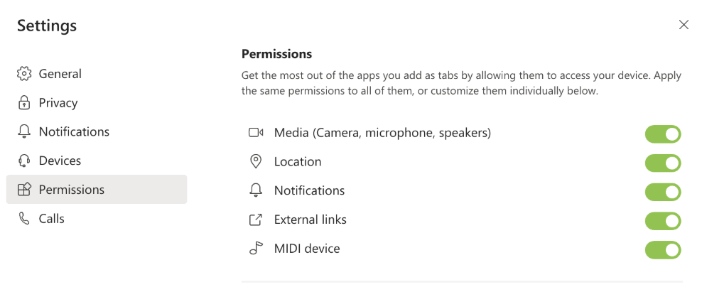

# <a name="request-device-permissions-for-your-microsoft-teams-tab"></a>Anfordern von Geräte Berechtigungen für Ihre Microsoft Teams-Registerkarte

Möglicherweise möchten Sie die Registerkarte mit Features erweitern, die den Zugriff auf systemeigene Gerätefunktionen erfordern, wie:

> [!div class="checklist"]
>
> * Kamera
> * Mikrofon
> * Speicherort
> * Benachrichtigungen

> [!IMPORTANT]
>
> * Derzeit unterstützt der Mobile Microsoft Teams `camera` -Client nur und `location`  über systemeigene Gerätefunktionen und steht in allen APP-Konstrukten einschließlich Registerkarten zur Verfügung. </br>
> * Die Unterstützung für `camera` die Bildaufnahme wird von der [**captureImage-API**](/javascript/api/@microsoft/teams-js/microsoftteams?view=msteams-client-js-latest#captureimage--error--sdkerror--files--file-------void-&preserve-view=true)aktiviert.
> * Die [**Geolocation-API**](../../resources/schema/manifest-schema.md#devicepermissions) wird derzeit nicht vollständig auf allen Desktop-Clients unterstützt.

## <a name="device-permissions"></a>Geräteberechtigungen

Wenn Sie auf die Geräte Berechtigungen eines Benutzers zugreifen, können Sie viel umfassendere Erfahrungen sammeln, beispielsweise:

* Aufzeichnen und Freigeben von kurzen Videos
* Kurze audiomemos aufzeichnen und später speichern
* Verwenden von Benutzerstandort Informationen zum Anzeigen relevanter Informationen

Während der Zugriff auf diese Funktionen in den meisten modernen Webbrowsern standardmäßig ist, müssen Sie Microsoft Teams mitteilen, welche Funktionen Sie verwenden möchten, indem Sie Ihr App-Manifest aktualisieren. Auf diese Weise können Sie Berechtigungen wie in einem Browser anfordern, während Ihre APP auf dem Desktop-Client von Teams läuft.

## <a name="manage-permissions"></a>
            Berechtigungen verwalten

# <a name="desktop"></a>[Desktop](#tab/desktop)

1. Öffnen Sie Teams.
1. Wählen Sie in der oberen rechten Ecke des Fensters Ihr Profilsymbol aus.
1. Wählen **Settings** Sie  ->  im Dropdownmenü Einstellungen **Berechtigungen** aus.
1. Wählen Sie die gewünschten Einstellungen aus.


# <a name="mobile"></a>[Mobile](#tab/mobile)

1. Öffnen Sie Teams.
1. Wählen Sie in der oberen linken Ecke des Bildschirms das &#9776; Menüsymbol aus.
1. Wählen Sie **Einstellungen**  ->  **Geräte** aus.
1. Wählen Sie die gewünschten Einstellungen aus.



---

## <a name="properties"></a>Eigenschaften

Aktualisieren Sie Ihre APP, `manifest.json` indem `devicePermissions` Sie die fünf Eigenschaften hinzufügen und angeben, die Sie in Ihrer Anwendung verwenden möchten:

``` json
"devicePermissions": [
    "media",
    "geolocation",
    "notifications",
    "midi",
    "openExternal"
],
```
> [!Note]
>
> Medien werden auch für Kamera Berechtigungen in Mobile verwendet.

Mit jeder Eigenschaft können Sie den Benutzer auffordern, seine Zustimmung einzuholen.

| Eigenschaft      | Beschreibung   |
| --- | --- |
| Medien         | Berechtigung zur Verwendung der Kamera, des Mikrofons und der Lautsprecher |
| Geolocation   | Berechtigung zum Zurückgeben des Standorts des Benutzers      |
| Benachrichtigungen | Berechtigung zum Senden der Benutzer Benachrichtigungen      |
| MIDI          | Berechtigung zum Senden und empfangen von MIDI-Informationen von einem digitalen Musikinstrument   |
| openextern  | Berechtigung zum Öffnen von Links in externen Anwendungen  |

## <a name="checking-permissions-from-your-tab"></a>Überprüfen von Berechtigungen auf der Registerkarte

Nachdem Sie Ihrem App-Manifest hinzugefügt haben `devicePermissions` , können Sie Berechtigungen mit der HTML5-API "Permissions" überprüfen, ohne eine Eingabeaufforderung zu verursachen.

``` Javascript
// Different query options:
navigator.permissions.query({ name: 'camera' });
navigator.permissions.query({ name: 'microphone' });
navigator.permissions.query({ name: 'geolocation' });
navigator.permissions.query({ name: 'notifications' });
navigator.permissions.query({ name: 'midi', sysex: true });

// Example:
navigator.permissions.query({name:'geolocation'}).then(function(result) {
  if (result.state == 'granted') {
    // Access granted
  } else if (result.state == 'prompt') {
    // Access has not been granted
  }
});
```

## <a name="prompting-the-user"></a>Auffordern des Benutzers

Um eine Eingabeaufforderung anzuzeigen, um die Zustimmung zum Zugriff auf Geräte Berechtigungen zu erhalten, müssen Sie die entsprechende HTML5-oder Teams-API nutzen. Um den Benutzer zum Zugreifen auf seine Kamera aufzufordern, müssen Sie beispielsweise `getCurrentPosition`

```Javascript
navigator.geolocation.getCurrentPosition(function (position) { /*... */ });
```

Um die Kamera auf dem Desktop oder im Internet verwenden zu können, wird von Microsoft Teams eine Berechtigungs Aufforderung angezeigt, wenn Sie getUserMedia aufrufen.

```Javascript
navigator.mediaDevices.getUserMedia({ audio: true, video: true });
```

Um Bilder auf mobilen Geräten zu erfassen, fragt Microsoft Teams Mobile um Erlaubnis, wenn Sie captureImage genannt wird ().

```Typescript
function captureImage(callback: (error: SdkError, files: File[]) => void)
```

Benachrichtigungen werden vom Benutzer aufgefordert, wenn Sie anrufen `requestPermission`

```Javascript
Notification.requestPermission(function(result) { /* ... */ });
```


## <a name="permission-behavior-across-login-sessions"></a>Berechtigungsverhalten für Anmeldesitzungen

Berechtigungen für systemeigene Geräte werden pro Anmeldesitzung gespeichert. Wenn Sie sich also bei einer anderen Instanz von Teams anmelden (z.b. auf einem anderen Computer), sind Ihre Geräte Berechtigungen aus ihren vorherigen Sitzungen nicht verfügbar. Stattdessen müssen Sie die Geräte Berechtigungen für die neue Anmeldesitzung erneut genehmigen. Dies bedeutet auch, dass Ihre Geräte Berechtigungen für diese vorherige Anmeldesitzung gelöscht werden, wenn Sie sich von Teams abmelden (oder Mandanten innerhalb von Teams wechseln). Beachten Sie Folgendes, wenn Sie systemeigene Geräte Berechtigungen entwickeln: die systemeigenen Funktionen, die Sie einwilligen, gelten nur für Ihre _aktuelle_ Anmeldesitzung.
