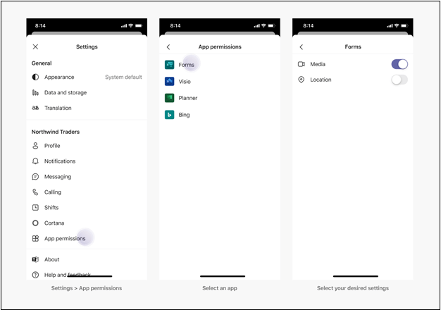

# <a name="request-device-permissions-for-your-microsoft-teams-app"></a><span data-ttu-id="d03da-104">Geräteberechtigungen für Ihre Microsoft Teams-App anfordern</span><span class="sxs-lookup"><span data-stu-id="d03da-104">Request device permissions for your Microsoft Teams app</span></span>

<span data-ttu-id="d03da-105">Sie können Ihre Teams-App mit nativen Gerätefunktionen wie Kamera, Mikrofon und Standort anreichern.</span><span class="sxs-lookup"><span data-stu-id="d03da-105">You can enrich your Teams app with native device capabilities, such as camera, microphone, and location.</span></span> <span data-ttu-id="d03da-106">In diesem Dokument erfahren Sie, wie Sie die Zustimmung des Benutzers anfordern und auf die Berechtigungen für native Geräte zugreifen können.</span><span class="sxs-lookup"><span data-stu-id="d03da-106">This document guides you on how to request user consent and access the native device permissions.</span></span>

> [!NOTE]
> * <span data-ttu-id="d03da-107">Informationen zum Integrieren von Medienfunktionen in Ihre Microsoft Teams mobile App finden Sie unter Integrieren von [Medienfunktionen](mobile-camera-image-permissions.md).</span><span class="sxs-lookup"><span data-stu-id="d03da-107">To integrate media capabilities within your Microsoft Teams mobile app, see [Integrate media capabilities](mobile-camera-image-permissions.md).</span></span>
> * <span data-ttu-id="d03da-108">Informationen zur Integration der QR- oder Barcode-Scanner-Fähigkeit in Ihre Microsoft Teams mobile App finden Sie unter Integrieren der [QR- oder Barcode-Scanner-Funktion in Teams](qr-barcode-scanner-capability.md).</span><span class="sxs-lookup"><span data-stu-id="d03da-108">To integrate QR or barcode scanner capability within your Microsoft Teams mobile app, see [Integrate QR or barcode scanner capability in Teams](qr-barcode-scanner-capability.md).</span></span>
> * <span data-ttu-id="d03da-109">Informationen zum Integrieren von Standortfunktionen in Ihre Microsoft Teams mobile App finden Sie unter Integrieren von [Standortfunktionen](location-capability.md).</span><span class="sxs-lookup"><span data-stu-id="d03da-109">To integrate location capabilities within your Microsoft Teams mobile app, see [Integrate location capabilities](location-capability.md).</span></span>

## <a name="native-device-permissions"></a><span data-ttu-id="d03da-110">Native Geräteberechtigungen</span><span class="sxs-lookup"><span data-stu-id="d03da-110">Native device permissions</span></span>

<span data-ttu-id="d03da-111">Sie müssen die Geräteberechtigungen anfordern, um auf systemeigene Gerätefunktionen zugreifen zu können.</span><span class="sxs-lookup"><span data-stu-id="d03da-111">You must request the device permissions to access native device capabilities.</span></span> <span data-ttu-id="d03da-112">Die Geräteberechtigungen funktionieren für alle App-Konstrukte, z. B. Registerkarten, Aufgabenmodule oder Messagingerweiterungen, ähnlich.</span><span class="sxs-lookup"><span data-stu-id="d03da-112">The device permissions work similarly for all app constructs, such as tabs, task modules, or messaging extensions.</span></span> <span data-ttu-id="d03da-113">Der Benutzer muss die Berechtigungsseite in Teams Einstellungen aufrufen, um Geräteberechtigungen zu verwalten.</span><span class="sxs-lookup"><span data-stu-id="d03da-113">The user must go to the permissions page in Teams settings to manage device permissions.</span></span>
<span data-ttu-id="d03da-114">Durch den Zugriff auf die Gerätefunktionen können Sie umfangreichere Erlebnisse auf der Teams Plattform erstellen, z. B.:</span><span class="sxs-lookup"><span data-stu-id="d03da-114">By accessing the device capabilities, you can build richer experiences on the Teams platform, such as:</span></span>
* <span data-ttu-id="d03da-115">Erfassen und Anzeigen von Bildern.</span><span class="sxs-lookup"><span data-stu-id="d03da-115">Capture and view images.</span></span>
* <span data-ttu-id="d03da-116">Scannen Sie QR oder Barcode.</span><span class="sxs-lookup"><span data-stu-id="d03da-116">Scan QR or barcode.</span></span>
* <span data-ttu-id="d03da-117">Nehmen Sie kurze Videos auf und teilen Sie sie.</span><span class="sxs-lookup"><span data-stu-id="d03da-117">Record and share short videos.</span></span>
* <span data-ttu-id="d03da-118">Nehmen Sie Audio-Memos auf und speichern Sie sie für die spätere Verwendung.</span><span class="sxs-lookup"><span data-stu-id="d03da-118">Record audio memos and save them for later use.</span></span>
* <span data-ttu-id="d03da-119">Verwenden Sie die Standortinformationen des Benutzers, um relevante Informationen anzuzeigen.</span><span class="sxs-lookup"><span data-stu-id="d03da-119">Use the location information of the user to display relevant information.</span></span>

## <a name="access-device-permissions"></a><span data-ttu-id="d03da-120">Zugriff auf Geräteberechtigungen</span><span class="sxs-lookup"><span data-stu-id="d03da-120">Access device permissions</span></span>

<span data-ttu-id="d03da-121">Das [Microsoft Teams JavaScript-Client-SDK](/javascript/api/overview/msteams-client?view=msteams-client-js-latest&preserve-view=true) stellt die Tools bereit, die Für Ihre Teams mobile App erforderlich sind, um auf die [Geräteberechtigungen](#manage-permissions) des Benutzers zuzugreifen und eine umfangreichere Benutzererfahrung zu erstellen.</span><span class="sxs-lookup"><span data-stu-id="d03da-121">The [Microsoft Teams JavaScript client SDK](/javascript/api/overview/msteams-client?view=msteams-client-js-latest&preserve-view=true) provides the tools necessary for your Teams mobile app to access the user’s [device permissions](#manage-permissions) and build a richer experience.</span></span>

<span data-ttu-id="d03da-122">Obwohl der Zugriff auf diese Funktionen in modernen Webbrowsern Standard ist, müssen Sie Teams über die Funktionen informieren, die Sie verwenden, indem Sie Ihr App-Manifest aktualisieren.</span><span class="sxs-lookup"><span data-stu-id="d03da-122">While access to these features is standard in modern web browsers, you must inform Teams about the features you use by updating your app manifest.</span></span> <span data-ttu-id="d03da-123">Mit diesem Update können Sie Berechtigungen anfordern, während Ihre App auf dem Teams Desktopclient ausgeführt wird.</span><span class="sxs-lookup"><span data-stu-id="d03da-123">This update allows you to ask for permissions while your app runs on the Teams desktop client.</span></span>

> [!NOTE] 
> <span data-ttu-id="d03da-124">Derzeit ist Microsoft Teams Unterstützung für Medienfunktionen und QR-Barcode-Scanner-Funktionen nur für mobile Clients verfügbar.</span><span class="sxs-lookup"><span data-stu-id="d03da-124">Currently, Microsoft Teams support for media capabilities and QR barcode scanner capability is only available for mobile clients.</span></span>

## <a name="manage-permissions"></a><span data-ttu-id="d03da-125">
            Berechtigungen verwalten</span><span class="sxs-lookup"><span data-stu-id="d03da-125">Manage permissions</span></span>

<span data-ttu-id="d03da-126">Ein Benutzer kann Geräteberechtigungen in Teams Einstellungen verwalten, indem er Berechtigungen für bestimmte Apps **zulassen** oder **verweigern** auswählt.</span><span class="sxs-lookup"><span data-stu-id="d03da-126">A user can manage device permissions in Teams settings by selecting **Allow** or **Deny** permissions to specific apps.</span></span>
 
# <a name="desktop"></a>[<span data-ttu-id="d03da-127">Desktop</span><span class="sxs-lookup"><span data-stu-id="d03da-127">Desktop</span></span>](#tab/desktop)

1. <span data-ttu-id="d03da-128">Öffnen Sie Ihre Teams-App.</span><span class="sxs-lookup"><span data-stu-id="d03da-128">Open your Teams app.</span></span>
1. <span data-ttu-id="d03da-129">Wählen Sie Ihr Profilsymbol in der oberen rechten Ecke des Fensters aus.</span><span class="sxs-lookup"><span data-stu-id="d03da-129">Select your profile icon in the upper right corner of the window.</span></span>
1. <span data-ttu-id="d03da-130">Wählen Sie **Einstellungen**  >  **Berechtigungen** aus dem Dropdown-Menü aus.</span><span class="sxs-lookup"><span data-stu-id="d03da-130">Select **Settings** > **Permissions** from the drop-down menu.</span></span>
1. <span data-ttu-id="d03da-131">Wählen Sie die gewünschten Einstellungen aus.</span><span class="sxs-lookup"><span data-stu-id="d03da-131">Select your desired settings.</span></span>

   

# <a name="mobile"></a>[<span data-ttu-id="d03da-133">Mobil</span><span class="sxs-lookup"><span data-stu-id="d03da-133">Mobile</span></span>](#tab/mobile)

1. <span data-ttu-id="d03da-134">Öffnen Sie Teams.</span><span class="sxs-lookup"><span data-stu-id="d03da-134">Open Teams.</span></span>
1. <span data-ttu-id="d03da-135">Wechseln Sie zu **Einstellungen**  >  **App-Berechtigungen**.</span><span class="sxs-lookup"><span data-stu-id="d03da-135">Go to **Settings** > **App Permissions**.</span></span>
1. <span data-ttu-id="d03da-136">Wählen Sie die App aus, für die Sie die Einstellungen auswählen müssen.</span><span class="sxs-lookup"><span data-stu-id="d03da-136">Select the app for which you need to choose the settings.</span></span>
1. <span data-ttu-id="d03da-137">Wählen Sie die gewünschten Einstellungen aus.</span><span class="sxs-lookup"><span data-stu-id="d03da-137">Select your desired settings.</span></span>

    

---

## <a name="specify-permissions"></a><span data-ttu-id="d03da-139">Angeben von Berechtigungen</span><span class="sxs-lookup"><span data-stu-id="d03da-139">Specify permissions</span></span>

<span data-ttu-id="d03da-140">Aktualisieren Sie die Ihrer App, `manifest.json` indem Sie die fünf Eigenschaften hinzufügen und `devicePermissions` angeben, die Sie in Ihrer Anwendung verwenden:</span><span class="sxs-lookup"><span data-stu-id="d03da-140">Update your app's `manifest.json` by adding `devicePermissions` and specifying which of the five properties that you use in your application:</span></span>

``` json
"devicePermissions": [
    "media",
    "geolocation",
    "notifications",
    "midi",
    "openExternal"
],
```

<span data-ttu-id="d03da-141">Jede Eigenschaft ermöglicht es Ihnen, den Benutzer aufzufordern, um seine Zustimmung zu bitten:</span><span class="sxs-lookup"><span data-stu-id="d03da-141">Each property allows you to prompt the user to ask for their consent:</span></span>

| <span data-ttu-id="d03da-142">Eigenschaft</span><span class="sxs-lookup"><span data-stu-id="d03da-142">Property</span></span>      | <span data-ttu-id="d03da-143">Beschreibung</span><span class="sxs-lookup"><span data-stu-id="d03da-143">Description</span></span>   |
| --- | --- |
| <span data-ttu-id="d03da-144">media</span><span class="sxs-lookup"><span data-stu-id="d03da-144">media</span></span>         | <span data-ttu-id="d03da-145">Berechtigung zur Verwendung der Kamera, des Mikrofons, der Lautsprecher und des Zugriffs auf die Mediengalerie.</span><span class="sxs-lookup"><span data-stu-id="d03da-145">Permission to use the camera, microphone, speakers, and access media gallery.</span></span> |
| <span data-ttu-id="d03da-146">Geolocation</span><span class="sxs-lookup"><span data-stu-id="d03da-146">geolocation</span></span>   | <span data-ttu-id="d03da-147">Berechtigung zum Zurückgeben des Speicherorts des Benutzers.</span><span class="sxs-lookup"><span data-stu-id="d03da-147">Permission to return the user's location.</span></span>      |
| <span data-ttu-id="d03da-148">Benachrichtigungen</span><span class="sxs-lookup"><span data-stu-id="d03da-148">notifications</span></span> | <span data-ttu-id="d03da-149">Berechtigung zum Senden der Benutzerbenachrichtigungen.</span><span class="sxs-lookup"><span data-stu-id="d03da-149">Permission to send the user notifications.</span></span>      |
| <span data-ttu-id="d03da-150">Midi</span><span class="sxs-lookup"><span data-stu-id="d03da-150">midi</span></span>          | <span data-ttu-id="d03da-151">Berechtigung zum Senden und Empfangen von Musikinstrumenten Digital Interface (MIDI)-Informationen von einem digitalen Musikinstrument.</span><span class="sxs-lookup"><span data-stu-id="d03da-151">Permission to send and receive  Musical Instrument Digital Interface (MIDI) information from a digital musical instrument.</span></span>   |
| <span data-ttu-id="d03da-152">openExtern</span><span class="sxs-lookup"><span data-stu-id="d03da-152">openExternal</span></span>  | <span data-ttu-id="d03da-153">Berechtigung zum Öffnen von Links in externen Anwendungen.</span><span class="sxs-lookup"><span data-stu-id="d03da-153">Permission to open links in external applications.</span></span>  |

## <a name="check-permissions-from-your-app"></a><span data-ttu-id="d03da-154">Überprüfen der Berechtigungen aus Ihrer App</span><span class="sxs-lookup"><span data-stu-id="d03da-154">Check permissions from your app</span></span>

<span data-ttu-id="d03da-155">Überprüfen Sie nach dem Hinzufügen `devicePermissions` zu Ihrem App-Manifest die Berechtigungen mithilfe der **HTML5-Berechtigungs-API,** ohne eine Eingabeaufforderung zu verursachen:</span><span class="sxs-lookup"><span data-stu-id="d03da-155">After adding `devicePermissions` to your app manifest, check permissions using the **HTML5 permissions API** without causing a prompt:</span></span>

``` Javascript
// Different query options:
navigator.permissions.query({ name: 'camera' });
navigator.permissions.query({ name: 'microphone' });
navigator.permissions.query({ name: 'geolocation' });
navigator.permissions.query({ name: 'notifications' });
navigator.permissions.query({ name: 'midi', sysex: true });

// Example:
navigator.permissions.query({name:'geolocation'}).then(function(result) {
  if (result.state == 'granted') {
    // Access granted
  } else if (result.state == 'prompt') {
    // Access has not been granted
  }
});
```

## <a name="use-teams-apis-to-get-device-permissions"></a><span data-ttu-id="d03da-156">Verwenden Teams-APIs zum Abrufen von Geräteberechtigungen</span><span class="sxs-lookup"><span data-stu-id="d03da-156">Use Teams APIs to get device permissions</span></span>

<span data-ttu-id="d03da-157">Nutzen Sie die entsprechende HTML5- oder Teams-API, um eine Eingabeaufforderung für die Zustimmung zum Zugriff auf Geräteberechtigungen anzuzeigen.</span><span class="sxs-lookup"><span data-stu-id="d03da-157">Leverage appropriate HTML5 or Teams API, to display a prompt for getting consent to access device permissions.</span></span>

> [!IMPORTANT]
> * <span data-ttu-id="d03da-158">Unterstützung für `camera` , und wird über `gallery` `microphone` [**selectMedia API**](/javascript/api/@microsoft/teams-js/media?view=msteams-client-js-latest#selectMedia_MediaInputs___error__SdkError__attachments__Media_______void_&preserve-view=true)aktiviert.</span><span class="sxs-lookup"><span data-stu-id="d03da-158">Support for `camera`, `gallery`, and `microphone` is enabled through [**selectMedia API**](/javascript/api/@microsoft/teams-js/media?view=msteams-client-js-latest#selectMedia_MediaInputs___error__SdkError__attachments__Media_______void_&preserve-view=true).</span></span> <span data-ttu-id="d03da-159">Verwenden Sie [**die captureImage-API**](/javascript/api/@microsoft/teams-js/microsoftteams?view=msteams-client-js-latest#captureimage--error--sdkerror--files--file-------void-&preserve-view=true) für eine einzelne Bildaufnahme.</span><span class="sxs-lookup"><span data-stu-id="d03da-159">Use [**captureImage API**](/javascript/api/@microsoft/teams-js/microsoftteams?view=msteams-client-js-latest#captureimage--error--sdkerror--files--file-------void-&preserve-view=true) for a single image capture.</span></span>
> * <span data-ttu-id="d03da-160">Die Unterstützung `location` für ist über die [**getLocation API**](/javascript/api/@microsoft/teams-js/location?view=msteams-client-js-latest#getLocation_LocationProps___error__SdkError__location__Location_____void_&preserve-view=true)aktiviert.</span><span class="sxs-lookup"><span data-stu-id="d03da-160">Support for `location` is enabled through [**getLocation API**](/javascript/api/@microsoft/teams-js/location?view=msteams-client-js-latest#getLocation_LocationProps___error__SdkError__location__Location_____void_&preserve-view=true).</span></span> <span data-ttu-id="d03da-161">Sie müssen dies für den Standort verwenden, da die `getLocation API` HTML5-Geolocation-API derzeit auf Teams Desktopclient nicht vollständig unterstützt wird.</span><span class="sxs-lookup"><span data-stu-id="d03da-161">You must use this `getLocation API` for location, as HTML5 geolocation API is currently not fully supported on Teams desktop client.</span></span>

<span data-ttu-id="d03da-162">Zum Beispiel:</span><span class="sxs-lookup"><span data-stu-id="d03da-162">For example:</span></span>
 * <span data-ttu-id="d03da-163">Um den Benutzer zum Zugriff auf seinen Standort aufzufordern, müssen Sie `getCurrentPosition()` Folgendes aufrufen:</span><span class="sxs-lookup"><span data-stu-id="d03da-163">To prompt the user to access their location you must call `getCurrentPosition()`:</span></span>

    ```Javascript
    navigator.geolocation.getCurrentPosition    (function (position) { /*... */ });
    ```

 * <span data-ttu-id="d03da-164">Um den Benutzer zum Zugriff auf seine Kamera auf dem Desktop oder im Web aufzufordern, müssen Sie `getUserMedia()` Folgendes aufrufen:</span><span class="sxs-lookup"><span data-stu-id="d03da-164">To prompt the user to access their camera on desktop or web you must call `getUserMedia()`:</span></span>

    ```Javascript
    navigator.mediaDevices.getUserMedia({ audio: true, video: true });
    ```

 * <span data-ttu-id="d03da-165">Um das Bild auf Mobilgeräten zu erfassen, fragt Teams Mobile beim Anruf um `captureImage()` Erlaubnis:</span><span class="sxs-lookup"><span data-stu-id="d03da-165">To capture the image on mobile, Teams mobile asks for permission when you call `captureImage()`:</span></span>

    ```Javascript
    microsoftTeams.media.captureImage((error: microsoftTeams.SdkError, files: microsoftTeams.media.File[]) => {
      /* ... */
    });
    ```

 * <span data-ttu-id="d03da-166">Benachrichtigungen werden den Benutzer beim Aufruf `requestPermission()` aufgefordert:</span><span class="sxs-lookup"><span data-stu-id="d03da-166">Notifications will prompt the user when you call `requestPermission()`:</span></span>

    ```Javascript
    Notification.requestPermission(function(result) { /* ... */ });
    ```


* <span data-ttu-id="d03da-167">Um die Kamera zu verwenden oder auf die Fotogalerie zuzugreifen, fragt Teams mobile beim Anruf `selectMedia()` um:</span><span class="sxs-lookup"><span data-stu-id="d03da-167">To use the camera or access photo gallery, Teams mobile asks permission when you call `selectMedia()`:</span></span>

    ```JavaScript
    microsoftTeams.media.selectMedia({ maxMediaCount: 10, mediaType: microsoftTeams.media.MediaType.Image }, (error: microsoftTeams.SdkError, attachments: microsoftTeams.media.Media[]) => {
      /* ... */
    );
    ```

* <span data-ttu-id="d03da-168">Um das Mikrofon zu verwenden, fragt Teams mobile beim Anruf `selectMedia()` um:</span><span class="sxs-lookup"><span data-stu-id="d03da-168">To use the microphone, Teams mobile asks permission when you call `selectMedia()`:</span></span>

    ```JavaScript 
    microsoftTeams.media.selectMedia({ maxMediaCount: 1, mediaType: microsoftTeams.media.MediaType.Audio }, (error: microsoftTeams.SdkError, attachments: microsoftTeams.media.Media[]) => {
      /* ... */
    });
    ```

* <span data-ttu-id="d03da-169">Um den Benutzer aufzufordern, den Standort auf der Kartenschnittstelle freizugeben, fragt Teams mobile beim Aufruf die `getLocation()` Berechtigung:</span><span class="sxs-lookup"><span data-stu-id="d03da-169">To prompt the user to share location on the map interface, Teams mobile asks permission when you call `getLocation()`:</span></span>

    ```JavaScript 
    microsoftTeams.location.getLocation({ allowChooseLocation: true, showMap: true }, (error: microsoftTeams.SdkError, location: microsoftTeams.location.Location) => {
      /* ... *
    /});
    ```
# <a name="desktop"></a>[<span data-ttu-id="d03da-170">Desktop</span><span class="sxs-lookup"><span data-stu-id="d03da-170">Desktop</span></span>](#tab/desktop)

   

# <a name="mobile"></a>[<span data-ttu-id="d03da-172">Mobil</span><span class="sxs-lookup"><span data-stu-id="d03da-172">Mobile</span></span>](#tab/mobile)

   

* * * 

## <a name="permission-behavior-across-login-sessions"></a><span data-ttu-id="d03da-174">Berechtigungsverhalten über Anmeldesitzungen hinweg</span><span class="sxs-lookup"><span data-stu-id="d03da-174">Permission behavior across login sessions</span></span>

<span data-ttu-id="d03da-175">Geräteberechtigungen werden für jede Anmeldesitzung gespeichert.</span><span class="sxs-lookup"><span data-stu-id="d03da-175">Device permissions are stored for every login session.</span></span> <span data-ttu-id="d03da-176">Wenn Sie sich z. B. auf einem anderen Computer bei einer anderen Instanz Teams anmelden, sind Ihre Geräteberechtigungen aus den vorherigen Sitzungen nicht verfügbar.</span><span class="sxs-lookup"><span data-stu-id="d03da-176">It means that if you sign in to another instance of Teams, for example, on another computer, your device permissions from your previous sessions are not available.</span></span> <span data-ttu-id="d03da-177">Daher müssen Sie die Geräteberechtigungen für die neue Sitzung erneut zustimmen.</span><span class="sxs-lookup"><span data-stu-id="d03da-177">Therefore, you must re-consent to device permissions for the new session.</span></span> <span data-ttu-id="d03da-178">Wenn Sie sich bei Teams abmelden oder Mandanten in Teams wechseln, werden Ihre Geräteberechtigungen aus der vorherigen Anmeldesitzung gelöscht.</span><span class="sxs-lookup"><span data-stu-id="d03da-178">It also means, if you sign out of Teams or switch tenants in Teams, your device permissions are deleted from the previous login session.</span></span>  

> [!NOTE]
> <span data-ttu-id="d03da-179">Wenn Sie den Berechtigungen für ein natives Gerät zustimmen, ist sie nur für Ihre _aktuelle_ Anmeldesitzung gültig.</span><span class="sxs-lookup"><span data-stu-id="d03da-179">When you consent to the native device permissions, it is valid only for your _current_ login session.</span></span>

## <a name="next-steps"></a><span data-ttu-id="d03da-180">Nächste Schritte</span><span class="sxs-lookup"><span data-stu-id="d03da-180">Next steps</span></span>

> [!div class="nextstepaction"]
> [<span data-ttu-id="d03da-181">Integrieren von Medienfunktionen in Teams</span><span class="sxs-lookup"><span data-stu-id="d03da-181">Integrate media capabilities in Teams</span></span>](mobile-camera-image-permissions.md)

> [!div class="nextstepaction"]
> [<span data-ttu-id="d03da-182">Integrieren Sie QR- oder Barcode-Scanner-Funktionen in Teams</span><span class="sxs-lookup"><span data-stu-id="d03da-182">Integrate QR or barcode scanner capability in Teams</span></span>](qr-barcode-scanner-capability.md)

> [!div class="nextstepaction"]
> [<span data-ttu-id="d03da-183">Integrieren von Standortfunktionen in Teams</span><span class="sxs-lookup"><span data-stu-id="d03da-183">Integrate location capabilities in Teams</span></span>](location-capability.md)
