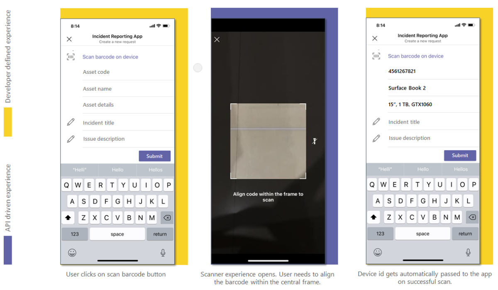

# <a name="integrate-qr-or-barcode-scanner-capability"></a>QR- oder Barcode-Scannerfunktion integrieren 

In diesem Dokument erfahren Sie, wie Sie die QR- oder Strichcodescannerfunktion integrieren. 

Barcode ist eine Methode zum Darstellen von Daten in einem visuellen und maschinenlesbaren Format. Der Strichcode enthält Informationen zu einem Produkt, z. B. einen Typ, eine Größe, einen Hersteller und ein Ursprungsland in Form von Balken und Leerzeichen. Der Code wird mithilfe des optischen Scanners auf der nativen Gerätekamera gelesen. Für eine reichhaltigere Zusammenarbeit können Sie die QR- oder Strichcodescannerfunktion, die in der Teams-Plattform bereitgestellt wird, in Ihre Teams-App integrieren.   

Sie können [das Microsoft Teams JavaScript-Client-SDK](/javascript/api/overview/msteams-client?view=msteams-client-js-latest&preserve-view=true)verwenden, das die tools zur Verfügung stellt, die Für Ihre App erforderlich sind, um auf die systemeigenen Gerätefunktionen des Benutzers zu [zugreifen.](native-device-permissions.md) Verwenden Sie die `scanBarCode` API, um die Scannerfunktion in Ihre App zu integrieren. 

## <a name="advantage-of-integrating-qr-or-barcode-scanner-capability"></a>Vorteile der Integration von QR- oder Barcodescannerfunktionen

Nachfolgend finden Sie die Vorteile der Integration von QR- oder Barcodescannerfunktionen: 

* Die Integration ermöglicht Es Web-App-Entwicklern auf der Teams-Plattform, QR- oder Barcodescanfunktionen mit dem Teams JavaScript-Client-SDK zu nutzen.
* Bei diesem Feature muss der Benutzer nur einen QR- oder Strichcode in einem Frame in der Mitte der Scannerbenutzeroberfläche ausrichten, und der Code wird automatisch gescannt. Die gespeicherten Daten werden mit der aufrufenden Web-App wieder freigegeben. Dadurch werden Unannehmlichkeiten und menschliche Fehler vermieden, wenn Sie langwierige Produktcodes oder andere relevante Informationen manuell eingeben.

Um die QR- oder Strichcodescannerfunktion zu integrieren, müssen Sie die App-Manifestdatei aktualisieren und die `scanBarCode` API aufrufen. Für eine effektive Integration müssen Sie [](#code-snippet) über ein gutes Verständnis des Codeausschnitts für den Aufruf der API verfügen, mit dem Sie systemeigene QR- oder Strichcodescannerfunktionen `scanBarCode` verwenden können. Die API gibt einen Fehler für einen nicht unterstützten Barcodestandard an.
Es ist wichtig, sich mit den API-Antwortfehlern vertraut zu [machen,](#error-handling) um die Fehler in Ihrer Teams-App zu behandeln.

> [!NOTE] 
> Derzeit ist die Unterstützung von Microsoft Teams für QR- oder Strichcodescanner nur für mobile Clients verfügbar.

## <a name="update-manifest"></a>Updatemanifest

Aktualisieren Sie Ihre [ Teamsmanifest.js-App-Datei,](../../resources/schema/manifest-schema.md#devicepermissions) indem Sie die `devicePermissions` -Eigenschaft hinzufügen und `media` angeben. Sie ermöglicht Es Ihrer App, die erforderlichen Berechtigungen von Benutzern zu fordern, bevor sie mit der Verwendung der QR- oder Strichcodescannerfunktion beginnen.

``` json
"devicePermissions": [
    "media",
],
```

> [!NOTE]
> Die **Anforderungsberechtigungsaufforderung** wird automatisch angezeigt, wenn eine relevante Teams-API initiiert wird. Weitere Informationen finden Sie unter [Anfordern von Geräteberechtigungen](native-device-permissions.md).

## <a name="scanbarcode-api"></a>ScanBarCode-API

Die API ruft das Scannersteuerelement auf, mit dem der Benutzer verschiedene Barcodetypen überprüfen kann, und gibt das `ScanBarCode` Ergebnis als Zeichenfolge zurück.

Zum Anpassen der Barcodescanerfahrung wird die optionale Barcodekonfiguration als Eingabe an die `ScanBarCode` API übergeben. Sie können das Intervall für das Überprüfungs-Zeitintervall in Sekunden mithilfe von `timeOutIntervalInSec` angeben. Der Standardwert beträgt 30 Sekunden, der Höchstwert 60 Sekunden.

Die **scanBarCode()-API** unterstützt die folgenden Barcodetypen:

| Strichcodetyp | Unter Android unterstützt | Unter iOS unterstützt |
| ---------- | ---------- | ------------ |
| Codeleiste | Ja | Nein |
| Code 39 | Ja | Ja | 
| Code 93 | Ja | Ja |
| Code 128 | Ja | Ja |
| EAN-13 | Ja | Ja |
| EAN-8 | Ja | Ja |
| ITF | Nein | Ja |
| QR-Code | Ja | Ja |
| RSS-Erweitert | Ja | Nein |
| RSS-14 | Ja | Nein |
| UPC-A | Ja | Ja |
| UPC-E | Ja | Ja |

**Web-App-Erfahrung für `ScanBarCode` API für QR- oder Barcodescannerfunktionen** 
 

## <a name="error-handling"></a>Fehlerbehandlung

Sie müssen sicherstellen, dass diese Fehler in Ihrer Teams-App angemessen umgangen werden. In der folgenden Tabelle sind die Fehlercodes und die Bedingungen aufgeführt, unter denen die Fehler generiert werden: 

|Fehlercode |  Fehlername     | Bedingung|
| --------- | --------------- | -------- |
| **100** | NOT_SUPPORTED_ON_PLATFORM | DIE API wird auf der aktuellen Plattform nicht unterstützt.|
| **500** | INTERNAL_ERROR | Interner Fehler beim Ausführen des erforderlichen Vorgangs.|
| **1000** | PERMISSION_DENIED |Die Berechtigung wird vom Benutzer verweigert.|
| **3000** | NO_HW_SUPPORT | Die zugrunde liegende Hardware unterstützt die Funktion nicht.|
| **4000** | INVALID_ARGUMENTS | Mindestens ein Argument ist ungültig.|
| **8000** | USER_ABORT |Der Benutzer bricht den Vorgang ab.|
| **8001** | OPERATION_TIMED_OUT | Der Strichcode konnte im angegebenen Zeitintervall nicht erkannt werden.|
| **9000** | OLD_PLATFORM | Plattformcode ist veraltet und implementiert diese API nicht.|

## <a name="code-snippet"></a>Codeausschnitt

**Aufrufen `ScanBarCode()` API** zum Scannen von QR- oder Strichcode mithilfe der Kamera:

```javascript
const config: microsoftTeams.media.BarCodeConfig = {
  timeOutIntervalInSec: 30};
microsoftTeams.media.scanBarCode((error: microsoftTeams.SdkError, decodedText: string) => {
  if (error) {
    if (error.message) {
      output(" ErrorCode: " + error.errorCode + error.message);
    } else {
      output(" ErrorCode: " + error.errorCode);
    }
  } else if (decodedText) {
    output(decodedText);
  }
}, config);
```

## <a name="see-also"></a>Siehe auch

> [!div class="nextstepaction"]
> [Integrieren von Medienfunktionen in Teams](mobile-camera-image-permissions.md)

> [!div class="nextstepaction"]
> [Integrieren von Standortfunktionen in Teams](location-capability.md)