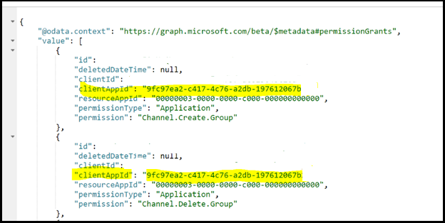

# <a name="resource-specific-consent-rsc"></a>Ressourcenspezifische Zustimmung (RSC)

Die ressourcenspezifische Zustimmung (RSC) ist eine Microsoft Teams- und Microsoft Graph-API-Integration, die es Ihrer App ermöglicht, bestimmte Teams innerhalb einer Organisation mithilfe von API-Endpunkten zu verwalten. Das ressourcenspezifische Berechtigungsmodell (RSC)  ermöglicht Teambesitzern, einer Anwendung die Zustimmung zum Zugriff auf und/oder zum Ändern der Daten eines Teams zu erteilen. Die differenzierten, Teams-spezifischen RSC-Berechtigungen definieren, was eine Anwendung in einem bestimmten Team tun kann:

## <a name="resource-specific-permissions"></a>Ressourcenspezifische Berechtigungen

|Anwendungsberechtigung| Aktion |
| ----- | ----- |
|TeamSettings.Read.Group | Hier erhalten Sie die Einstellungen für dieses Team.|
|TeamSettings.ReadWrite.Group|Aktualisieren Sie die Einstellungen für dieses Team.|
|ChannelSettings.Read.Group|Erhalten Sie die Kanalnamen, Kanalbeschreibungen und Kanaleinstellungen für dieses Team.|
|ChannelSettings.ReadWrite.Group|Aktualisieren Sie die Kanalnamen, Kanalbeschreibungen und Kanaleinstellungen für dieses Team.|
|Channel.Create.Group|Erstellen von Kanälen in diesem Team.|
|Channel.Delete.Group|Löschen von Kanälen in diesem Team.|
|ChannelMessage.Read.Group |Erhalten Sie die Kanalnachrichten dieses Teams.|
|TeamsAppInstallation.Read.Group|Hier erhalten Sie eine Liste der installierten Apps dieses Teams.|
|TeamsTab.Read.Group|Hier erhalten Sie eine Liste der Registerkarten dieses Teams.|
|TeamsTab.Create.Group|Erstellen von Registerkarten in diesem Team.|
|TeamsTab.ReadWrite.Group|Aktualisieren Sie die Registerkarten dieses Teams.|
|TeamsTab.Delete.Group|Löschen der Registerkarten dieses Teams.|
|TeamMember.Read.Group|Holen Sie sich die Mitglieder dieses Teams.|

>[!NOTE]
>Ressourcenspezifische Berechtigungen sind nur für Auf dem Client installierte Teams-Apps verfügbar und sind derzeit nicht Teil des Azure Active Directory-Portals.

## <a name="enable-resource-specific-consent-in-your-application"></a>Aktivieren der ressourcenspezifischen Zustimmung in Ihrer Anwendung

Die Schritte zum Aktivieren von RSC in Ihrer Anwendung sind wie folgt:

1. [Konfigurieren Von Einstellungen für die Zustimmung des Gruppenbesitzers im Azure Active Directory-Portal.](#configure-group-owner-consent-settings-in-the-azure-ad-portal)
1. [Registrieren Sie Ihre App bei Microsoft Identity Platform über das Azure AD-Portal.](#register-your-app-with-microsoft-identity-platform-via-the-azure-ad-portal)
1. [Überprüfen Sie Ihre Anwendungsberechtigungen im Azure AD-Portal.](#review-your-application-permissions-in-the-azure-ad-portal)
1. [Rufen Sie ein Zugriffstoken von der Microsoft Identity Platform ab.](#obtain-an-access-token-from-the-microsoft-identity-platform)
1. [Aktualisieren Sie Ihr Teams-App-Manifest.](#update-your-teams-app-manifest)
1. [Installieren Sie Ihre App direkt in Teams.](#install-your-app-directly-in-teams)
1. [Überprüfen Sie Ihre App auf hinzugefügte RSC-Berechtigungen.](#check-your-app-for-added-rsc-permissions)

## <a name="configure-group-owner-consent-settings-in-the-azure-ad-portal"></a>Konfigurieren von Einstellungen für die Zustimmung des Gruppenbesitzers im Azure AD-Portal

Sie können die Zustimmung des [Gruppenbesitzers direkt](/azure/active-directory/manage-apps/configure-user-consent-groups?tabs=azure-portal) im Azure-Portal aktivieren oder deaktivieren:

> [!div class="checklist"]
>
>- Melden Sie sich beim [Azure-Portal](https://portal.azure.com) als [globaler Administrator/Unternehmensadministrator an.](/azure/active-directory/users-groups-roles/directory-assign-admin-roles.md#global-administrator--company-administrator)  
 > - [Wählen Sie](https://portal.azure.com/#blade/Microsoft_AAD_IAM/ConsentPoliciesMenuBlade/UserSettings) **Azure Active Directory**  =>  **-Enterprise-Anwendungen**  =>  **Zustimmungs- und Berechtigungseinstellungen**  =>  **für die Zustimmung des Benutzers aus.**
> - Aktivieren, Deaktivieren oder Einschränken der Zustimmung des Benutzers mit der Mit der Bezeichnung "Gruppenbesitzer-Zustimmung" gekennzeichneten Zustimmung für Apps, die auf Daten zugreifen **(Die** Standardeinstellung ist "Zustimmung des Gruppenbesitzers für **alle Gruppenbesitzer zulassen").** Damit ein Teambesitzer eine App mit RSC installieren kann, muss die Zustimmung des Gruppenbesitzers für den Benutzer aktiviert sein.


Um die Zustimmung des Gruppenbesitzers mithilfe von PowerShell zu aktivieren oder zu deaktivieren, führen Sie die schritte unter Konfigurieren der Zustimmung des [Gruppenbesitzers mithilfe von PowerShell aus.](/azure/active-directory/manage-apps/configure-user-consent-groups?tabs=azure-powershell)

## <a name="register-your-app-with-microsoft-identity-platform-via-the-azure-ad-portal"></a>Registrieren Ihrer App bei Microsoft Identity Platform über das Azure AD-Portal

Das Azure Active Directory-Portal bietet eine zentrale Plattform zum Registrieren und Konfigurieren Ihrer Apps. Ihre App muss im Azure AD-Portal registriert sein, damit sie in die Microsoft Identity Platform integriert werden kann und Microsoft Graph-APIs aufrufen kann. *Siehe* [Registrieren einer Anwendung bei der Microsoft Identity Platform](/graph/auth-register-app-v2).

>[!WARNING]
>Registrieren Sie nicht mehrere Teams-Apps für dieselbe Azure AD-App-ID. Die App-ID muss für jede App eindeutig sein. Versuche, mehrere Apps unter derselben App-ID zu installieren, können nicht verwendet werden.

## <a name="review-your-application-permissions-in-the-azure-ad-portal"></a>Überprüfen Der Anwendungsberechtigungen im Azure AD-Portal

Navigieren Sie zur **Seite**  =>  **"Home App-Registrierungen",** und wählen Sie Ihre RSC-App aus. Wählen **Sie in der** linken Navigationsleiste die BERECHTIGUNGEN aus, und überprüfen Sie die Liste der konfigurierten Berechtigungen für Ihre App. Wenn Ihre App nur RSC Graph-API-Aufrufe macht, löschen Sie alle Berechtigungen auf dieser Seite. Wenn Ihre App auch Nicht-RSC-Aufrufe macht, behalten Sie diese Berechtigungen bei Bedarf bei.

>[!IMPORTANT]
>Das Azure AD-Portal kann nicht zum Anfordern von RSC-Berechtigungen verwendet werden. DIESC-Berechtigungen sind derzeit exklusiv für Teams-Anwendungen, die im Teams-Client installiert sind, und werden in der App-Manifestdatei (JSON) deklariert.

## <a name="obtain-an-access-token-from-the-microsoft-identity-platform"></a>Abrufen eines Zugriffstokens von der Microsoft Identity Platform

Um Graph-API-Aufrufe zu machen, müssen Sie ein Zugriffstoken für Ihre App von der Identitätsplattform abrufen. Bevor Ihre App ein Token von der Microsoft Identity Platform erhalten kann, muss es im Azure AD-Portal registriert werden. Das Zugriffstoken enthält Informationen zu Ihrer App und die Berechtigungen, über die es für die Ressourcen und APIs verfügt, die über Microsoft Graph bereitgestellt werden.

Sie benötigen die folgenden Werte aus dem Azure AD-Registrierungsprozess, um ein Zugriffstoken von der Identitätsplattform abzurufen:

- Die vom App-Registrierungsportal zugewiesene **Anwendungs-ID.** Wenn Ihre App einmaliges Anmelden (Single Sign-On, SSO) unterstützt, sollten Sie dieselbe Anwendungs-ID für Ihre App und SSO verwenden.
- Der **geheime Clientschlüssel/das Kennwort** oder ein öffentliches/privates Schlüsselpaar (**Zertifikat).** Dies ist für systemeigene Apps nicht erforderlich.
- Eine **Umleitungs-URI** (oder Antwort-URL) für Ihre App, um Antworten von Azure AD zu empfangen.

 *See* [Get access on behalf of a user](/graph/auth-v2-user?view=graph-rest-1.0#3-get-a-token&preserve-view=true) and Get access without a [user](/graph/auth-v2-service)

## <a name="update-your-teams-app-manifest"></a>Aktualisieren Ihres Teams-App-Manifests

Die RsC-Berechtigungen werden in Ihrer App-Manifestdatei (JSON) deklariert.  Fügen Sie [ihrem App-Manifest einen webApplicationInfo-Schlüssel](../../resources/schema/manifest-schema.md#webapplicationinfo) mit den folgenden Werten hinzu:

> [!div class="checklist"]
>
> - **id** – Ihre Azure AD-App-ID. *Siehe* [Registrieren Ihrer App im Azure AD-Portal.](resource-specific-consent.md#register-your-app-with-microsoft-identity-platform-via-the-azure-ad-portal)
> - **-Ressource**  – eine beliebige Zeichenfolge. Dieses Feld hat keine Operation in RSC, muss jedoch hinzugefügt werden und einen Wert haben, um eine Fehlerantwort zu vermeiden. Eine beliebige Zeichenfolge wird verwendet.
> - **Anwendungsberechtigungen** – RSC-Berechtigungen für Ihre App. *Siehe Ressourcenspezifische* [Berechtigungen](resource-specific-consent.md#resource-specific-permissions).

>
>[!IMPORTANT]
> Nicht-RSC-Berechtigungen werden im Azure-Portal gespeichert. Fügen Sie sie nicht dem App-Manifest hinzu.
>

```json
"webApplicationInfo": {
    "id": "XXxxXXXXX-XxXX-xXXX-XXxx-XXXXXXXxxxXX",
    "resource": "https://RscBasedStoreApp",
    "applicationPermissions": [
      "TeamSettings.Read.Group",
      "ChannelMessage.Read.Group",
      "TeamSettings.Edit.Group",
      "ChannelSettings.ReadWrite.Group",
      "Channel.Create.Group",
      "Channel.Delete.Group",
      "TeamsApp.Read.Group",
      "TeamsTab.Read.Group",
      "TeamsTab.Create.Group",
      "TeamsTab.ReadWrite.Group",
      "TeamsTab.Delete.Group",
      "Member.Read.Group",
      "Owner.Read.Group"
    ]
  }
```

## <a name="install-your-app-directly-in-teams"></a>Installieren Ihrer App direkt in Teams

Nachdem Sie Ihre App erstellt haben, können Sie [Ihr App-Paket](../../concepts/deploy-and-publish/apps-upload.md#upload-your-package-into-a-team-using-the-apps-tab) direkt in ein bestimmtes Team hochladen.  Dazu muss die **Richtlinieneinstellung** "Benutzerdefinierte Apps hochladen" im Rahmen der Benutzerdefinierten App-Setup-Richtlinien aktiviert sein. Weitere Informationen finden Sie unter *"Richtlinieneinstellungen* [für benutzerdefinierte Apps".](/microsoftteams/teams-custom-app-policies-and-settings#custom-app-policy-and-settings)

## <a name="check-your-app-for-added-rsc-permissions"></a>Überprüfen Sie Ihre App auf hinzugefügte RSC-Berechtigungen.

>[!IMPORTANT]
>Die RsC-Berechtigungen werden keinem Benutzer zugeordnet. Aufrufe werden mit App-Berechtigungen und nicht mit delegierten Berechtigungen des Benutzers vorgenommen. Daher kann die App möglicherweise Aktionen ausführen, die der Benutzer nicht ausführen kann, z. B. das Erstellen eines Kanals oder das Löschen einer Registerkarte. Sie sollten die Absicht des Teambesitzers für Ihren Verwendungsfall überprüfen, bevor Sie RSC-API-Aufrufe machen. *Übersicht über* [die Microsoft Teams-API.](/graph/teams-concept-overview)

Nachdem die App in einem Team installiert wurde, können Sie [graph-Explorer](https://developer.microsoft.com/graph/graph-explorer)  verwenden, um die Berechtigungen anzuzeigen, die der App in einem Team gewährt wurden:

> [!div class="checklist"]
>
>- Holen Sie sich die **groupId des Teams** vom Teams-Client.
> - Wählen Sie im Client **"Teams" in** der Navigationsleiste ganz links "Teams" aus.
> - Wählen Sie im Dropdownmenü das Team aus, in dem die App installiert ist.
> - Wählen Sie das **Symbol "Weitere** Optionen" (&#8943;).
> - Wählen Sie **"Link zum Team erhalten" aus.**
> - Kopieren und speichern Sie den **groupId-Wert** aus der Zeichenfolge.
> - Melden Sie sich beim **Graph Explorer an.**
> - Stellen Sie **einen GET-Aufruf** an den folgenden Endpunkt: `https://graph.microsoft.com/beta/groups/{teamGroupId}/permissionGrants` . Das Feld "clientAppId" in der Antwort wird der im Teams-App-Manifest angegebenen appId zuordnung.
  

## <a name="code-sample"></a>Codebeispiel
| **Beispielname** | **Beschreibung** | **C#** |
|-----------------|-----------------|----------------|
| Ressourcenspezifische Zustimmung (RSC) | Verwenden Sie RSC zum Aufrufen von Graph-APIs. | [View](https://github.com/OfficeDev/Microsoft-Teams-Samples/tree/main/samples/graph-rsc/csharp)|

## <a name="test-resource-specific-consent"></a>Testen der ressourcenspezifischen Zustimmung
 
> [!div class="nextstepaction"]
> [**Testen ressourcenspezifischer Zustimmungsberechtigungen in Teams**](test-resource-specific-consent.md)
 
## <a name="related-topic-for-teams-administrators"></a>Verwandtes Thema für Teams-Administratoren

> [!div class="nextstepaction"]
> [**Ressourcenspezifische Zustimmung in Microsoft Teams für Administratoren**](/MicrosoftTeams/resource-specific-consent)
> 

