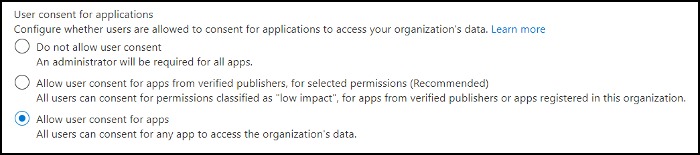

# <a name="resource-specific-consent-rsc"></a>Ressourcenspezifische Zustimmung (RSC)

> [!NOTE]
> Die ressourcenspezifische Zustimmung für den Chatbereich ist nur in der [öffentlichen Entwicklervorschau](../../resources/dev-preview/developer-preview-intro.md) verfügbar.

Die ressourcenspezifische Zustimmung (RESOURCE-Specific Consent, RSC) ist eine Microsoft Teams- und Microsoft Graph-API-Integration, mit der Ihre App API-Endpunkte verwenden kann, um bestimmte Ressourcen ( Teams oder Chats ) innerhalb einer Organisation zu verwalten. Das Ressourcenspezifische Berechtigungsmodell (RSC) ermöglicht *Teambesitzern* und *Chatbesitzern,* einer Anwendung die Zustimmung zu erteilen, auf die Daten eines Teams bzw. auf die Daten eines Chats zuzugreifen bzw. diese zu ändern. Die differenzierten RSC-Berechtigungen definieren, was eine Anwendung innerhalb einer bestimmten Ressource tun kann:

## <a name="resource-specific-permissions"></a>Ressourcenspezifische Berechtigungen

### <a name="resource-specific-permissions-for-a-team"></a>Ressourcenspezifische Berechtigungen für ein Team
|Anwendungsberechtigung| Aktion |
| ----- | ----- |
|TeamSettings.Read.Group | Rufen Sie die Einstellungen dieses Teams ab.|
|TeamSettings.ReadWrite.Group|Aktualisieren Sie die Einstellungen dieses Teams.|
|ChannelSettings.Read.Group|Rufen Sie die Kanalnamen, Kanalbeschreibungen und Kanaleinstellungen dieses Teams ab.|
|ChannelSettings.ReadWrite.Group|Aktualisieren Sie die Kanalnamen, Kanalbeschreibungen und Kanaleinstellungen dieses Teams.|
|Channel.Create.Group|Erstellen von Kanälen in diesem Team. |
|Channel.Delete.Group|Löschen Sie Kanäle in diesem Team. |
|ChannelMessage.Read.Group |Rufen Sie die Kanalnachrichten dieses Teams ab. |
|TeamsAppInstallation.Read.Group|Rufen Sie eine Liste der installierten Apps dieses Teams ab.|
|TeamsTab.Read.Group|Rufen Sie eine Liste der Registerkarten dieses Teams ab.|
|TeamsTab.Create.Group|Erstellen von Registerkarten in diesem Team. |
|TeamsTab.ReadWrite.Group|Aktualisieren Sie die Registerkarten dieses Teams. |
|TeamsTab.Delete.Group|Löschen der Registerkarten dieses Teams. |
|TeamMember.Read.Group|Rufen Sie die Mitglieder dieses Teams ab. |

Weitere Informationen finden Sie unter ["Ressourcenspezifische Zustimmungsberechtigungen für Teams".](/graph/permissions-reference#team-resource-specific-consent-permissions)

### <a name="resource-specific-permissions-for-a-chat"></a>Ressourcenspezifische Berechtigungen für einen Chat
|Anwendungsberechtigung| Aktion |
| ----- | ----- |
| ChatSettings.Read.Chat         | Rufen Sie die Einstellungen dieses Chats ab.                                    |
| ChatSettings.ReadWrite.Chat    | Aktualisieren Sie die Einstellungen dieses Chats.                          |
| ChatMessage.Read.Chat          | Rufen Sie die Nachrichten dieses Chats ab.                                    |
| ChatMember.Read.Chat           | Rufen Sie die Mitglieder dieses Chats ab.                                     |
| Chat.Manage.Chat               | Verwalten dieses Chats.                                             |
| TeamsTab.Read.Chat             | Rufen Sie die Registerkarten dieses Chats ab.                                        |
| TeamsTab.Create.Chat           | Erstellen von Registerkarten in diesem Chat.                                     |
| TeamsTab.Delete.Chat           | Löschen der Registerkarten dieses Chats.                                      |
| TeamsTab.ReadWrite.Chat        | Verwalten der Registerkarten dieses Chats.                                      |
| TeamsAppInstallation.Read.Chat | Rufen Sie ab, welche Apps in diesem Chat installiert sind.                   |
| OnlineMeeting.ReadBasic.Chat   | Rufen Sie grundlegende Eigenschaften einer Besprechung ab, die diesem Chat zugeordnet ist, z. B. Name, Zeitplan, Organisator und Teilnahmelink. |

Weitere Informationen finden Sie unter ["Ressourcenspezifische Zustimmungsberechtigungen für Chats".](/graph/permissions-reference#chat-resource-specific-consent-permissions)

>[!NOTE]
>Ressourcenspezifische Berechtigungen sind nur für Teams Apps verfügbar, die auf dem Teams-Client installiert sind und derzeit nicht Teil des Azure Active Directory-Portals sind.

## <a name="enable-resource-specific-consent-in-your-application"></a>Aktivieren der ressourcenspezifischen Zustimmung in Ihrer Anwendung

Die Schritte zum Aktivieren von RSC in Ihrer Anwendung sind wie folgt:

1. [Konfigurieren Sie die Zustimmungseinstellungen im Azure Active Directory-Portal.](#configure-consent-settings-in-the-azure-ad-portal)
    1. Konfigurieren Sie die Einstellungen für die Zustimmung des [Gruppenbesitzers für RSC in einem Team.](#configure-group-owner-consent-settings-for-rsc-in-a-team)
    1. [Konfigurieren von Benutzer-Zustimmungseinstellungen für RSC in einem Chat.](#configure-user-consent-settings-for-rsc-in-a-chat)
1. [Registrieren Sie Ihre App bei Microsoft Identity Platform über das Azure AD-Portal.](#register-your-app-with-microsoft-identity-platform-via-the-azure-ad-portal)
1. [Überprüfen Sie Ihre Anwendungsberechtigungen im Azure AD-Portal.](#review-your-application-permissions-in-the-azure-ad-portal)
1. [Rufen Sie ein Zugriffstoken von der Microsoft Identity-Plattform ab.](#obtain-an-access-token-from-the-microsoft-identity-platform)
1. [Aktualisieren Sie das Teams-App-Manifest.](#update-your-teams-app-manifest)
1. [Installieren Sie Ihre App direkt in Teams.](#sideload-your-app-in-teams)
1. [Überprüfen Sie Ihre App auf hinzugefügte RSC-Berechtigungen.](#check-your-app-for-added-rsc-permissions)
    1. [Überprüfen Sie Ihre App auf hinzugefügte RSC-Berechtigungen in einem Team.](#check-your-app-for-added-rsc-permissions-in-a-team)
    1. [Überprüfen Sie Ihre App auf hinzugefügte RSC-Berechtigungen in einem Chat.](#check-your-app-for-added-rsc-permissions-in-a-chat)

## <a name="configure-consent-settings-in-the-azure-ad-portal"></a>Konfigurieren von Zustimmungseinstellungen im Azure AD-Portal

### <a name="configure-group-owner-consent-settings-for-rsc-in-a-team"></a>Konfigurieren der Einstellungen für die Zustimmung des Gruppenbesitzers für RSC in einem Team

Sie können die Zustimmung des [Gruppenbesitzers](/azure/active-directory/manage-apps/configure-user-consent-groups?tabs=azure-portal) direkt im Azure-Portal aktivieren oder deaktivieren:

> [!div class="checklist"]
>
>- Melden Sie sich beim [Azure-Portal](https://portal.azure.com) als [globaler Administrator/Unternehmensadministrator](/azure/active-directory/roles/permissions-reference#global-administrator&preserve-view=true)an.  
 > - [Wählen Sie](https://portal.azure.com/#blade/Microsoft_AAD_IAM/ConsentPoliciesMenuBlade/UserSettings) **Azure Active Directory**  =>  **Enterprise Anwendungen**  =>  **Zustimmungs- und Berechtigungseinstellungen** für  =>  **Benutzergenehmigungen** aus.
> - Aktivieren, deaktivieren oder einschränken Sie die Zustimmung des Benutzers mit der steuerelementbeschrifteten Zustimmung des **Gruppenbesitzers für Apps, die auf Daten zugreifen** (standardmäßig ist die Zustimmung des **Gruppenbesitzers für alle Gruppenbesitzer zulässig).** Damit ein Teambesitzer eine App mit RSC installieren kann, muss die Zustimmung des Gruppenbesitzers für diesen Benutzer aktiviert sein.


Um die Zustimmung des Gruppenbesitzers mithilfe von PowerShell zu aktivieren oder zu deaktivieren, führen Sie die unter Konfigurieren der [Gruppenbesitzerzustimmung mitHilfe von PowerShell](/azure/active-directory/manage-apps/configure-user-consent-groups?tabs=azure-powershell)beschriebenen Schritte aus.

### <a name="configure-user-consent-settings-for-rsc-in-a-chat"></a>Konfigurieren von Benutzer-Zustimmungseinstellungen für RSC in einem Chat

Sie können die Zustimmung des [Benutzers](/azure/active-directory/manage-apps/configure-user-consent?tabs=azure-portal) direkt im Azure-Portal aktivieren oder deaktivieren:

> [!div class="checklist"]
>
>- Melden Sie sich beim [Azure-Portal](https://portal.azure.com) als [globaler Administrator/Unternehmensadministrator](/azure/active-directory/roles/permissions-reference#global-administrator&preserve-view=true)an.  
 > - [Wählen Sie](https://portal.azure.com/#blade/Microsoft_AAD_IAM/ConsentPoliciesMenuBlade/UserSettings) **Azure Active Directory**  =>  **Enterprise Anwendungen**  =>  **Zustimmungs- und Berechtigungseinstellungen** für  =>  **Benutzergenehmigungen** aus.
> - Aktivieren, deaktivieren oder einschränken Sie die Zustimmung des Benutzers mit dem Steuerelement mit der Bezeichnung **"Benutzer-Zustimmung für Anwendungen"** (standardmäßig ist **"Benutzergenehmigung für Apps zulassen").** Damit ein Chatmitglied eine App mit RSC installieren kann, muss die Benutzerzustimmung für diesen Benutzer aktiviert sein.



Um die Benutzerzustimmung mithilfe von PowerShell zu aktivieren oder zu deaktivieren, führen Sie die unter Konfigurieren der [Benutzerzustimmung mitHilfe von PowerShell](/azure/active-directory/manage-apps/configure-user-consent?tabs=azure-powershell)beschriebenen Schritte aus.


## <a name="register-your-app-with-microsoft-identity-platform-via-the-azure-ad-portal"></a>Registrieren Ihrer App bei Microsoft Identity Platform über das Azure AD-Portal

Das Azure Active Directory-Portal bietet Ihnen eine zentrale Plattform zum Registrieren und Konfigurieren Ihrer Apps. Ihre App muss im Azure AD-Portal registriert sein, damit sie in die Microsoft Identity Platform integriert und Microsoft Graph-APIs aufgerufen werden kann. Weitere Informationen finden Sie unter [Registrieren einer Anwendung mit dem Microsoft Identity Platform](/graph/auth-register-app-v2).

>[!WARNING]
>Eine Azure AD-App-ID sollte nicht für mehrere Teams Apps freigegeben werden. Es sollte eine 1:1-Zuordnung zwischen einer Teams-App und einer Azure AD-App geben. Versuche, mehrere Teams Apps zu installieren, die derselben Azure AD-App-ID zugeordnet sind, führen zu Installations-/Laufzeitfehlern.

## <a name="review-your-application-permissions-in-the-azure-ad-portal"></a>Überprüfen Der Anwendungsberechtigungen im Azure AD-Portal

Navigieren Sie zur Registrierungsseite der **Start-App,**  =>   und wählen Sie Ihre RSC-App aus. Wählen Sie in der linken Navigationsleiste **API-Berechtigungen** aus, und überprüfen Sie die Liste der konfigurierten Berechtigungen für Ihre App. Wenn Ihre App nur RSC Graph API-Aufrufe vorgibt, löschen Sie alle Berechtigungen auf dieser Seite. Wenn Ihre App auch Nicht-RSC-Aufrufe vorgibt, behalten Sie diese Berechtigungen bei Bedarf bei.

>[!IMPORTANT]
>Das Azure AD-Portal kann nicht zum Anfordern von RSC-Berechtigungen verwendet werden. RSC-Berechtigungen gelten derzeit ausschließlich für Teams Anwendungen, die im Teams-Client installiert sind, und werden in der JSON-Datei (Teams App Manifest) deklariert.

## <a name="obtain-an-access-token-from-the-microsoft-identity-platform"></a>Abrufen eines Zugriffstokens vom Microsoft Identity Platform

Um Graph API-Aufrufe auszuführen, müssen Sie ein Zugriffstoken für Ihre App von der Identitätsplattform abrufen. Bevor Ihre App ein Token vom Microsoft Identity Platform abrufen kann, muss sie im Azure AD-Portal registriert werden. Das Zugriffstoken enthält Informationen zu Ihrer App und die Berechtigungen, über die es für die Ressourcen und APIs verfügt, die über Microsoft Graph bereitgestellt werden.

Sie benötigen die folgenden Werte aus dem Azure AD-Registrierungsprozess, um ein Zugriffstoken von der Identitätsplattform abzurufen:

- Die vom App-Registrierungsportal zugewiesene **Anwendungs-ID.** Wenn Ihre App einmaliges Anmelden (Single Sign-On, SSO) unterstützt, sollten Sie dieselbe Anwendungs-ID für Ihre App und SSO verwenden.
- Das **geheime Clientkennwort** oder ein öffentliches/privates Schlüsselpaar (**Zertifikat).** Dies ist für systemeigene Apps nicht erforderlich.
- Ein **Umleitungs-URI** (oder Antwort-URL), damit Ihre App Antworten von Azure AD empfängt.

 *Siehe* ["Zugriff im Auftrag eines Benutzers erhalten"](/graph/auth-v2-user?view=graph-rest-1.0#3-get-a-token&preserve-view=true) und ["Zugriff ohne Benutzer erhalten"](/graph/auth-v2-service)

## <a name="update-your-teams-app-manifest"></a>Aktualisieren des Teams-App-Manifests

Die RSC-Berechtigungen werden in Ihrer APP-Manifestdatei (JSON) deklariert.  Fügen Sie ihrem [App-Manifest einen webApplicationInfo-Schlüssel](../../resources/schema/manifest-schema.md#webapplicationinfo) mit den folgenden Werten hinzu:

> [!div class="checklist"]
>
> - **id**  – Ihre Azure AD-App-ID. Weitere Informationen finden Sie unter [Registrieren Ihrer App im Azure AD-Portal.](resource-specific-consent.md#register-your-app-with-microsoft-identity-platform-via-the-azure-ad-portal)
> - **Ressource**  – eine beliebige Zeichenfolge. Dieses Feld hat keinen Vorgang in RSC, muss jedoch hinzugefügt werden und einen Wert aufweisen, um eine Fehlerantwort zu vermeiden. Jede Zeichenfolge wird ausgeführt.
> - **Anwendungsberechtigungen** – RSC-Berechtigungen für Ihre App. Weitere Informationen finden Sie unter ["Ressourcenspezifische Berechtigungen".](resource-specific-consent.md#resource-specific-permissions)

>
>[!IMPORTANT]
> Nicht-RSC-Berechtigungen werden im Azure-Portal gespeichert. Fügen Sie sie nicht dem App-Manifest hinzu.
>

### <a name="example-for-rsc-in-a-team"></a>Beispiel für RSC in einem Team
```json
"webApplicationInfo": {
    "id": "XXxxXXXXX-XxXX-xXXX-XXxx-XXXXXXXxxxXX",
    "resource": "https://RscBasedStoreApp",
    "applicationPermissions": [
      "TeamSettings.Read.Group",
      "ChannelMessage.Read.Group",
      "TeamSettings.Edit.Group",
      "ChannelSettings.ReadWrite.Group",
      "Channel.Create.Group",
      "Channel.Delete.Group",
      "TeamsApp.Read.Group",
      "TeamsTab.Read.Group",
      "TeamsTab.Create.Group",
      "TeamsTab.ReadWrite.Group",
      "TeamsTab.Delete.Group",
      "Member.Read.Group",
      "Owner.Read.Group"
    ]
  }
```

### <a name="example-for-rsc-in-a-chat"></a>Beispiel für RSC in einem Chat
```json
"webApplicationInfo": {
    "id": "XXxxXXXXX-XxXX-xXXX-XXxx-XXXXXXXxxxXX",
    "resource": "https://RscBasedStoreApp",
    "applicationPermissions": [
      "ChatSettings.Read.Chat",
      "ChatSettings.ReadWrite.Chat",
      "ChatMessage.Read.Chat",
      "ChatMember.Read.Chat",
      "Chat.Manage.Chat",
      "TeamsTab.Read.Chat",
      "TeamsTab.Create.Chat",
      "TeamsTab.Delete.Chat",
      "TeamsTab.ReadWrite.Chat",
      "TeamsAppInstallation.Read.Chat",
      "OnlineMeeting.ReadBasic.Chat"
    ]
  }
```

>[!NOTE]
>Wenn die App die Installation sowohl im Team- als auch im Chatbereich unterstützen soll, können sowohl Team- als auch Chatberechtigungen im selben Manifest unter angegeben `applicationPermissions` werden.

## <a name="sideload-your-app-in-teams"></a>Querladen Ihrer App in Teams

Wenn Ihr Teams-Administrator benutzerdefinierte App-Uploads zulässt, können Sie Ihre App direkt in ein bestimmtes Team oder einen bestimmten Chat [laden.](~/concepts/deploy-and-publish/apps-upload.md)

## <a name="check-your-app-for-added-rsc-permissions"></a>Überprüfen Ihrer App auf hinzugefügte RSC-Berechtigungen

>[!IMPORTANT]
>Die RSC-Berechtigungen werden keinem Benutzer zugeordnet. Aufrufe erfolgen mit App-Berechtigungen, nicht mit delegierten Berechtigungen des Benutzers. Daher kann die App Aktionen ausführen, die der Benutzer nicht ausführen kann, z. B. das Löschen einer Registerkarte. Sie sollten die Absicht des Teambesitzers oder Chatbesitzers für Ihren Anwendungsfall überprüfen, bevor Sie RSC-API-Aufrufe tätigen. Weitere Informationen finden Sie unter [Microsoft Teams API-Übersicht.](/graph/teams-concept-overview)

Nachdem die App in einer Ressource installiert wurde, können Sie [Graph Explorer](https://developer.microsoft.com/graph/graph-explorer) verwenden, um die Berechtigungen anzuzeigen, die der App in der Ressource gewährt wurden:

### <a name="check-your-app-for-added-rsc-permissions-in-a-team"></a>Überprüfen Ihrer App auf hinzugefügte RSC-Berechtigungen in einem Team

> [!div class="checklist"]
>
>- Rufen Sie die **groupId** des Teams vom Teams-Client ab.
> - Wählen Sie im Teams Client in der Navigationsleiste ganz links **Teams** aus.
> - Wählen Sie im Dropdownmenü das Team aus, in dem die App installiert ist.
> - Klicken Sie auf das Symbol **"Weitere Optionen"** (&#8943;).
> - Wählen Sie **"Link zum Team abrufen" aus.**
> - Kopieren und speichern Sie den **groupId-Wert** aus der Zeichenfolge.
> - Melden Sie sich **Graph Explorer** an.
> - Führen Sie einen **GET-Aufruf** an den folgenden Endpunkt aus: `https://graph.microsoft.com/beta/teams/{teamGroupId}/permissionGrants` . Das `clientAppId` Feld in der Antwort wird dem im Teams `webApplicationInfo.id` App-Manifest angegebenen zugeordnet.
  

Informationen zum Abrufen von Details zu in einem bestimmten Team installierten Apps finden Sie unter [Abrufen der Namen und anderer Details von Apps, die im angegebenen Team installiert sind.](/graph/api/team-list-installedapps#example-2-get-the-names-and-other-details-of-installed-apps)

### <a name="check-your-app-for-added-rsc-permissions-in-a-chat"></a>Überprüfen Ihrer App auf hinzugefügte RSC-Berechtigungen in einem Chat

> [!div class="checklist"]
>
>- Rufen Sie die Chatthread-ID vom Teams *Webclient* ab.
> - Wählen Sie im Teams Webclient in der Navigationsleiste ganz links die Option **"Chat"** aus.
> - Wählen Sie im Dropdownmenü den Chat aus, in dem die App installiert ist.
> - Kopieren Sie die Web-URL, und speichern Sie die Chatthread-ID aus der Zeichenfolge.

> - Melden Sie sich **Graph Explorer** an.
> - Führen Sie einen **GET-Aufruf** an den folgenden Endpunkt aus: `https://graph.microsoft.com/beta/chats/{chatId}/permissionGrants` . Das `clientAppId` Feld in der Antwort wird dem im Teams `webApplicationInfo.id` App-Manifest angegebenen zugeordnet.
  

Informationen zum Abrufen von Details zu in einem bestimmten Chat installierten Apps finden Sie unter [Abrufen der Namen und anderer Details von Apps, die im angegebenen Chat installiert sind.](/graph/api/chat-list-installedapps#example-2-get-the-names-and-other-details-of-apps-installed-in-the-specified-chat)

## <a name="code-sample"></a>Codebeispiel
| **Beispielname** | **Beschreibung** | **.NET** |**Node.js** |
|-----------------|-----------------|----------------|----------------|
| Ressourcenspezifische Zustimmung (RSC) | Verwenden Sie RSC, um Graph APIs aufzurufen. | [View](https://github.com/OfficeDev/Microsoft-Teams-Samples/tree/main/samples/graph-rsc/csharp)|[View](https://github.com/OfficeDev/Microsoft-Teams-Samples/tree/main/samples/graph-rsc/nodeJs)|


## <a name="see-also"></a>Siehe auch
 
* [Testen von ressourcenspezifischen Zustimmungsberechtigungen in Teams](test-resource-specific-consent.md)
* [Ressourcenspezifische Zustimmung in Microsoft Teams für Administratoren](/MicrosoftTeams/resource-specific-consent)


