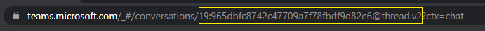

# <a name="test-resource-specific-consent-permissions-in-teams"></a>Testen Sie ressourcenspezifische Einwilligungsberechtigungen in Teams

> [!NOTE]
> Die ressourcenspezifische Zustimmung für den Chatbereich ist nur in der [öffentlichen Entwicklervorschau](../../resources/dev-preview/developer-preview-intro.md) verfügbar.

Ressourcenspezifische Zustimmung (RSC) ist eine Microsoft Teams- und Graph-API-Integration, die es Ihrer App ermöglicht, API-Endpunkte zu verwenden, um bestimmte Ressourcen – entweder Teams oder Chats – innerhalb einer Organisation zu verwalten. Weitere Informationen finden Sie unter [Ressourcenspezifische Einwilligung (RSC) – Microsoft Teams Graph-API](resource-specific-consent.md).

## <a name="prerequisites"></a>Voraussetzungen

Stellen Sie sicher, dass Sie vor dem Testen die folgenden App-Manifeständerungen auf ressourcenspezifische Zustimmung überprüfen:

<br>

<details>

<summary><b>RSC-Berechtigungen für App-Manifestversion 1.12 und höher</b></summary>

Fügen Sie Ihrem App-Manifest einen [webApplicationInfo](../../resources/schema/manifest-schema.md#webapplicationinfo)Schlüssel mit den folgenden Werten hinzu:

|Name| Typ | Beschreibung|
|---|---|---|
|`id` |Zeichenfolge |Ihre Azure AD App-ID. Weitere Informationen finden Sie [unter App im Azure AD-Portal registrieren](resource-specific-consent.md#register-your-app-with-microsoft-identity-platform-using-the-azure-ad-portal).|
|`resource`|Zeichenfolge| Dieses Feld hat in RSC keine Operation, muss aber hinzugefügt werden und einen Wert haben, um eine Fehlerantwort zu vermeiden; jede Zeichenfolge wird tun.|

Geben Sie die von der App benötigten Berechtigungen an.

|Name| Typ | Beschreibung|
|---|---|---|
|`authorization`|Object|Liste der Berechtigungen, welche die App benötigt, um zu funktionieren. Weitere Informationen finden Sie unter [Autorisierung](../../resources/schema/manifest-schema.md#authorization).|

Beispiel für RSC in einem Team

```json
"webApplicationInfo": {
    "id": "XXxxXXXXX-XxXX-xXXX-XXxx-XXXXXXXxxxXX",
    "resource": "https://RscBasedStoreApp"
    },
"authorization": {
    "permissions": {
        "resourceSpecific": [
            {
                "name": "TeamSettings.Read.Group",
                "type": "Application"
            },
            {
                "name": "TeamSettings.ReadWrite.Group",
                "type": "Application"
            },
            {
                "name": "ChannelSettings.Read.Group",
                "type": "Application"
            },
            {
                "name": "ChannelSettings.ReadWrite.Group",
                "type": "Application"
            },
            {
                "name": "Channel.Create.Group",
                "type": "Application"
            },
            {
                "name": "Channel.Delete.Group",
                "type": "Application"
            },
            {
                "name": "ChannelMessage.Read.Group",
                "type": "Application"
            },
            {
                "name": "TeamsAppInstallation.Read.Group",
                "type": "Application"
            },
            {
                "name": "TeamsTab.Read.Group",
                "type": "Application"
            },
            {
                "name": "TeamsTab.Create.Group",
                "type": "Application"
            },
            {
                "name": "TeamsTab.ReadWrite.Group",
                "type": "Application"
            },
            {
                "name": "TeamsTab.Delete.Group",
                "type": "Application"
            },
            {
                "name": "TeamMember.Read.Group",
                "type": "Application"
            },
            {
                "name": "TeamsActivity.Send.Group",
                "type": "Application"
            }
        ]    
    }
}
```

Beispiel für RSC in einem Chat

```json
"webApplicationInfo": {
    "id": "XXxxXXXXX-XxXX-xXXX-XXxx-XXXXXXXxxxXX",
    "resource": "https://RscBasedStoreApp"
    },
"authorization": {
    "permissions": {
        "resourceSpecific": [
            {
                "name": "ChatSettings.Read.Chat",
                "type": "Application"
            },
            {
                "name": "ChatSettings.ReadWrite.Chat",
                "type": "Application"
            },
            {
                "name": "ChatMessage.Read.Chat",
                "type": "Application"
            },
            {
                "name": "ChatMember.Read.Chat",
                "type": "Application"
            },
            {
                "name": "Chat.Manage.Chat",
                "type": "Application"
            },
            {
                "name": "TeamsTab.Read.Chat",
                "type": "Application"
            },
            {
                "name": "TeamsTab.Create.Chat",
                "type": "Application"
            },
            {
                "name": "TeamsTab.Delete.Chat",
                "type": "Application"
            },
            {
                "name": "TeamsTab.ReadWrite.Chat",
                "type": "Application"
            },
            {
                "name": "TeamsAppInstallation.Read.Chat",
                "type": "Application"
            },
            {
                "name": "OnlineMeeting.ReadBasic.Chat",
                "type": "Application"
            },
            {
                "name": "Calls.AccessMedia.Chat",
                "type": "Application"
            },
            {
                "name": "Calls.JoinGroupCalls.Chat",
                "type": "Application"
            },
            {
                "name": "TeamsActivity.Send.Chat",
                "type": "Application"
            }
        ]    
    }
}
```

> [!NOTE]
> Wenn die App die Installation sowohl im Team- als auch im Chatbereich unterstützen soll, können sowohl Team- als auch Chatberechtigungen im selben Manifest unter angegeben werden `authorization`.

</details>

<br>

<details>

<summary><b>RSC-Berechtigungen für App-Manifestversion 1.11 und früher</b></summary>

Fügen Sie Ihrem App-Manifest einen [webApplicationInfo](../../resources/schema/manifest-schema.md#webapplicationinfo)Schlüssel mit den folgenden Werten hinzu:

|Name| Typ | Beschreibung|
|---|---|---|
|`id` |Zeichenfolge |Ihre Azure AD App-ID. Weitere Informationen finden Sie [unter App im Azure AD-Portal registrieren](resource-specific-consent.md#register-your-app-with-microsoft-identity-platform-using-the-azure-ad-portal).|
|`resource`|Zeichenfolge| Dieses Feld hat in RSC keine Operation, muss aber hinzugefügt werden und einen Wert haben, um eine Fehlerantwort zu vermeiden; jede Zeichenfolge wird tun.|
|`applicationPermissions`|Array aus Zeichenfolgen|Legen Sie die Berechtigungen für  Ihre app. Weitere Informationen finden Sie unter [ressourcenspezifische Berechtigungen](resource-specific-consent.md#resource-specific-permissions).|

Beispiel für RSC in einem Team

```json
"webApplicationInfo": {
    "id": "XXxxXXXXX-XxXX-xXXX-XXxx-XXXXXXXxxxXX",
    "resource": "https://RscBasedStoreApp",
    "applicationPermissions": [
        "TeamSettings.Read.Group",
        "TeamSettings.ReadWrite.Group",
        "ChannelSettings.Read.Group",
        "ChannelSettings.ReadWrite.Group",
        "Channel.Create.Group",
        "Channel.Delete.Group",
        "ChannelMessage.Read.Group",
        "TeamsAppInstallation.Read.Group",
        "TeamsTab.Read.Group",
        "TeamsTab.Create.Group",
        "TeamsTab.ReadWrite.Group",
        "TeamsTab.Delete.Group",
        "TeamMember.Read.Group",
        "TeamsActivity.Send.Group"
    ]
  }
```

Beispiel für RSC in einem Chat

```json
"webApplicationInfo": {
    "id": "XXxxXXXXX-XxXX-xXXX-XXxx-XXXXXXXxxxXX",
    "resource": "https://RscBasedStoreApp",
    "applicationPermissions": [
        "ChatSettings.Read.Chat",
        "ChatSettings.ReadWrite.Chat",
        "ChatMessage.Read.Chat",
        "ChatMember.Read.Chat",
        "Chat.Manage.Chat",
        "TeamsTab.Read.Chat",
        "TeamsTab.Create.Chat",
        "TeamsTab.Delete.Chat",
        "TeamsTab.ReadWrite.Chat",
        "TeamsAppInstallation.Read.Chat",
        "OnlineMeeting.ReadBasic.Chat",
        "Calls.AccessMedia.Chat",
        "Calls.JoinGroupCalls.Chat",
        "TeamsActivity.Send.Chat"
    ]
  }
```

<br>

> [!NOTE]
> Wenn die App die Installation sowohl im Team- als auch im Chatbereich unterstützen soll, können sowohl Team- als auch Chatberechtigungen im selben Manifest unter angegeben werden `applicationPermissions`.

</details>

> [!IMPORTANT]
> Fügen Sie in Ihrem App-Manifest nur die RSC-Berechtigungen ein, die Ihre App haben soll.

> [!NOTE]
> Wenn die App auf `webApplicationInfo.Id` Anruf-/Medien-APIs zugreifen soll, sollte dies die Azure AD-App-ID eines [Azure Bot Service sein](/graph/cloud-communications-get-started#register-a-bot).

## <a name="test-added-rsc-permissions-to-a-team-using-the-postman-app"></a>Testen Sie einem Team hinzugefügte RSC-Berechtigungen mit der Postman-App

Um zu überprüfen, ob die RSC-Berechtigungen von der Nutzlast der API-Anforderung berücksichtigt werden, müssen Sie den [RSC-JSON-Testcode für team](test-team-rsc-json-file.md) in Ihre lokale Umgebung kopieren und die folgenden Werte aktualisieren:

* `azureADAppId`: Die Azure AD App-ID Ihrer App.
* `azureADAppSecret`: Ihr Azure AD App-Kennwort.
* `token_scope`: Der Bereich ist erforderlich, um ein Token zu erhalten. Legen Sie den Wert auf fest `https://graph.microsoft.com/.default`.
* `teamGroupId`: Sie können die Teamgruppen-ID wie folgt vom Teams-Client abrufen:

    1. Wählen Sie im Teams-Client in der Navigationsleiste ganz links **Teams** aus.
    2. Wählen Sie das Team, in dem die App installiert ist, aus dem Dropdown-Menü aus.
    3. Wählen Sie das Symbol **Weitere Optionen** (&#8943;).
    4. Wählen **Sie Link zum Team abrufen aus**.
    5. Kopieren und speichern Sie den **groupId** Wert aus der Zeichenfolge.

## <a name="test-added-rsc-permissions-to-a-chat-using-the-postman-app"></a>Testen Sie hinzugefügte RSC-Berechtigungen für einen Chat mit der Postman-App

Um zu überprüfen, ob die RSC-Berechtigungen von der Nutzlast der API-Anforderung berücksichtigt werden, müssen Sie den [RSC-JSON-Testcode ](test-chat-rsc-json-file.md)für Chats in Ihre lokale Umgebung kopieren und die folgenden Werte aktualisieren:

* `azureADAppId`: Die Azure AD App-ID Ihrer App.
* `azureADAppSecret`: Ihr Azure AD App-Kennwort.
* `token_scope`: Der Bereich ist erforderlich, um ein Token zu erhalten. Legen Sie den Wert auf fest `https://graph.microsoft.com/.default`.
* `tenantId`: Der Name oder die Azure AD Objekt-ID Ihres Mandanten.
* `chatId`: Sie können die Chat-Thread-ID wie folgt vom *Teams-Webclient* abrufen:

    1. Wählen Sie im Teams-Webclient in der Navigationsleiste ganz links **Chat** aus.
    2. Wählen Sie aus dem Dropdown-Menü den Chat aus, in dem die App installiert ist.
    3. Kopieren Sie die Web-URL und speichern Sie die Chat-Thread-ID aus der Zeichenfolge.


### <a name="use-postman"></a>Verwenden von Postman

1. Öffnen Sie die [Postman](https://www.postman.com) App.
2. Wählen Sie **Datei** > **importieren** > **Datei importieren** aus, um die aktualisierte JSON-Datei aus Ihrer Umgebung hochzuladen.  
3. Wählen Sie die Registerkarte **Sammlungen** aus.
4. Wählen Sie das Chevron **>** neben dem **Test-RSC** aus, um die Detailansicht zu erweitern und die API-Anforderungen anzuzeigen.

Führen Sie die gesamte Berechtigungssammlung für jeden API-Aufruf aus. Die Berechtigungen, die Sie in Ihrem App-Manifest angegeben haben, müssen erfolgreich sein, während die nicht angegebenen Berechtigungen mit einem HTTP 403-Statuscode fehlschlagen müssen. Überprüfen Sie alle Antwortstatuscodes, um zu bestätigen, dass das Verhalten der RSC-Berechtigungen in Ihrer App den Erwartungen entspricht.

> [!NOTE]
> Um bestimmte DELETE- und READ-API-Aufrufe zu testen, fügen Sie diese Instanzszenarien zur JSON-Datei hinzu.

## <a name="test-revoked-rsc-permissions-using-postman"></a>Testen Sie widerrufene RSC-Berechtigungen mit [Postman](https://www.postman.com/)

1. Deinstallieren Sie die App von der spezifischen Ressource.
2. Befolgen Sie die Schritte für Chat oder Team:
    1. [Testen Sie einem Team hinzugefügte RSC-Berechtigungen mit Postman](#test-added-rsc-permissions-to-a-team-using-the-postman-app).
    2. [Testen Sie hinzugefügte RSC-Berechtigungen zu einem Chat mit Postman](#test-added-rsc-permissions-to-a-chat-using-the-postman-app).
3. Überprüfen Sie alle Antwortstatuscodes, um zu bestätigen, dass die **spezifischen API-Aufrufe mit dem HTTP-Statuscode 403 fehlgeschlagen sind**.

## <a name="see-also"></a>Siehe auch

* [Microsoft Graph-API und Teams](/graph/api/resources/teams-api-overview?view=graph-rest-1.0&preserve-view=true)
* [Ressourcenspezifische Zustimmung](~/graph-api/rsc/resource-specific-consent.md)
