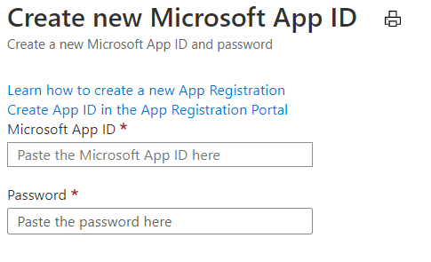

1. Wählen Sie [im Azure-Portal](https://ms.portal.azure.com/#home)unter Azure Services die Option **Ressource erstellen aus.**In the [Azure portal](https://ms.portal.azure.com/#home), under Azure services, select **Create a resource**.
1. Geben Sie im Suchfeld "Bot" ein.In the search box enter "bot". Wählen Sie in der Dropdownliste Bot **Channels Registration aus.**And in the drop-down list, select **Bot Channels Registration**.
1. Wählen Sie die **Schaltfläche Erstellen** aus.Select the **Create** button.
1. Geben Sie **im Blatt Bot Channel Registration** die angeforderten Informationen zu Ihrem Bot an.In the **Bot Channel Registration** blade, provide the requested information about your bot.
1. Lassen Sie **das Feld** Messaging-Endpunkt vorerst leer, geben Sie nach der Bereitstellung des Bots die erforderliche URL ein.Leave the **Messaging endpoint** box empty for now, you will enter the required URL after deploying the bot. Die folgende Abbildung zeigt ein Beispiel für die Registrierungseinstellungen:The following picture shows an example of the registration settings:

    

1. Klicken **Sie auf Microsoft App-ID und -Kennwort,** und erstellen Sie dann **Neu**.Click **Microsoft App ID and password** and then **Create New**.

          

1. Klicken **Sie im Link App-Registrierungsportal auf App-ID** erstellen.Click **Create App ID in the App Registration Portal** link.

   
   
1. Klicken Sie im angezeigten **App-Registrierungsfenster** **oben** links auf die Registerkarte Neue Registrierung.In the displayed **App registration** window, click the **New registration** tab in the upper left.
1. Geben Sie den Namen der Botanwendung ein, die Sie registrieren, wir haben *BotTeamsAuth* verwendet (Sie müssen Ihren eigenen eindeutigen Namen auswählen).Enter the name of the bot application you are registering, we used *BotTeamsAuth* (you need to select your own unique name).
1. Wählen Sie **für** die unterstützten Kontotypen Konten in einem beliebigen Organisationsverzeichnis *(Beliebiges Azure AD-Verzeichnis - Multitenant) und persönlichen Microsoft-Konten (z. B. Skype, Xbox) aus.*For the **Supported account types** select *Accounts in any organizational directory (Any Azure AD directory - Multitenant) and personal Microsoft accounts (e.g. Skype, Xbox)*.
1. Klicken Sie auf **die Schaltfläche Registrieren.**Click the **Register** button. Nach Abschluss zeigt Azure die Seite *Übersicht* für die Anwendung an.Once completed, Azure displays the *Overview* page for the application.
1. Kopieren und speichern Sie in einer Datei den **Application (client)-ID-Wert.**Copy and save to a file the **Application (client) ID** value.
1. Klicken Sie im linken Bereich auf **Zertifikat und geheime Schlüssel.**In the left panel, click **Certificate and secrets**.
    1. Klicken *Sie unter Geheime* Clientgeheimnisse auf **Neuer Geheimer Clientgeheimnis.**Under *Client secrets*, click **New client secret**.
    1. Fügen Sie eine Beschreibung hinzu, um diesen geheimen Schlüssel von anderen Personen zu identifizieren, die Sie möglicherweise für diese App erstellen müssen.Add a description to identify this secret from others you might need to create for this app.
    1. Set *Expires* to your selection.Set *Expires* to your selection.
    1. Klicken Sie auf **Hinzufügen**.Click **Add**.
    1. Kopieren Sie den geheimen Clientgeheimnis, und speichern Sie ihn in einer Datei.Copy the client secret and save it to a file.
1. Wechseln Sie zurück zum **Fenster Bot Channel Registration,** und kopieren Sie die *App-ID* und den geheimen *Client* in die Felder **Microsoft App-ID** **und** Kennwort.Go back to the **Bot Channel Registration** window and copy the *App ID* and the *Client secret* in the **Microsoft App ID** and **Password** boxes, respectively.
1. Klicken Sie auf **OK**.Click **OK**.
1. Klicken Sie schließlich auf **Erstellen**.Finally, click **Create**.

Nachdem Azure die Registrierungsressource erstellt hat, wird sie in die Ressourcengruppenliste aufgenommen.After Azure has created the registration resource it will be included in the resource group list.  

Nachdem Die Registrierung Ihrer Botkanäle erstellt wurde, müssen Sie den Teams aktivieren.Once your bot channels registration is created, you'll need to enable the Teams channel.

1. Wählen Sie [im Azure-Portal](https://ms.portal.azure.com/#home)unter Azure Services die gerade erstellte **Botkanalregistrierung** aus.In the [Azure portal](https://ms.portal.azure.com/#home), under Azure services, select the **Bot Channel Registration** you just created.
1. Klicken Sie im linken Bereich auf **Kanäle**.In the left panel, click **Channels**.
1. Klicken Sie auf Microsoft Teams Symbol, und wählen Sie dann **Speichern aus.**Click the Microsoft Teams icon, then choose **Save**.
