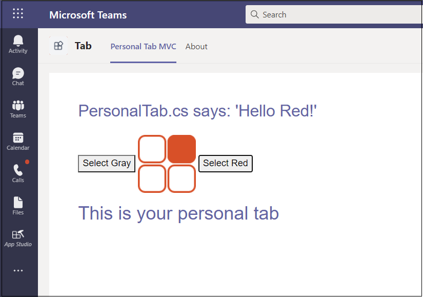

## <a name="upload-your-tab-with-app-studio"></a><span data-ttu-id="5b6ac-101">Hochladen Ihrer Registerkarte mit App Studio</span><span class="sxs-lookup"><span data-stu-id="5b6ac-101">Upload your tab with App Studio</span></span>

>[!NOTE]
> <span data-ttu-id="5b6ac-102">Wir verwenden **App Studio,** um Ihre **manifest.jszu** bearbeiten und das fertige Paket in Teams hochzuladen.</span><span class="sxs-lookup"><span data-stu-id="5b6ac-102">We use **App Studio** to edit your **manifest.json** file and upload the completed package to Teams.</span></span> <span data-ttu-id="5b6ac-103">Sie können auch manuell **manifest.jsbearbeiten.**</span><span class="sxs-lookup"><span data-stu-id="5b6ac-103">You can also manually edit **manifest.json**.</span></span> <span data-ttu-id="5b6ac-104">Stellen Sie in diesem Fall sicher, dass Sie die Lösung erneut erstellen, um die hochzuladende **Tab.zipdatei** zu erstellen.</span><span class="sxs-lookup"><span data-stu-id="5b6ac-104">If you do, ensure that you build the solution again to create the **Tab.zip** file to upload.</span></span>

<span data-ttu-id="5b6ac-105">**So laden Sie Ihre Registerkarte mit App Studio hoch**</span><span class="sxs-lookup"><span data-stu-id="5b6ac-105">**To upload your tab with App Studio**</span></span>

1. <span data-ttu-id="5b6ac-106">Wechseln Sie zu Microsoft Teams.</span><span class="sxs-lookup"><span data-stu-id="5b6ac-106">Go to Microsoft Teams.</span></span> <span data-ttu-id="5b6ac-107">Wenn Sie die [webbasierte Version](https://teams.microsoft.com) verwenden, können Sie Ihren Front-End-Code mithilfe der [Entwicklertools](~/tabs/how-to/developer-tools.md)Ihres Browsers überprüfen.</span><span class="sxs-lookup"><span data-stu-id="5b6ac-107">If you use the [web based version](https://teams.microsoft.com) you can inspect your front-end code using your browser's [developer tools](~/tabs/how-to/developer-tools.md).</span></span>

1. <span data-ttu-id="5b6ac-108">Wechseln Sie zu **App Studio,** und wählen Sie die Registerkarte **"Manifest-Editor"** aus.</span><span class="sxs-lookup"><span data-stu-id="5b6ac-108">Go to **App Studio** and select the **Manifest editor** tab.</span></span>

1. <span data-ttu-id="5b6ac-109">Wählen Sie im **Manifest-Editor** eine **vorhandene App importieren** aus, um mit dem Aktualisieren des App-Pakets für Ihre Registerkarte zu beginnen. Der Quellcode enthält ein eigenes teilweise vollständiges Manifest.</span><span class="sxs-lookup"><span data-stu-id="5b6ac-109">Select **Import an existing app** in the **Manifest editor** to begin updating the app package for your tab. The source code comes with its own partially complete manifest.</span></span> <span data-ttu-id="5b6ac-110">Der Name Ihres App-Pakets ist **tab.zip.**</span><span class="sxs-lookup"><span data-stu-id="5b6ac-110">The name of your app package is **tab.zip**.</span></span> <span data-ttu-id="5b6ac-111">Es ist über den folgenden Pfad verfügbar:</span><span class="sxs-lookup"><span data-stu-id="5b6ac-111">It is available from the following path:</span></span>

    ```bash
    /bin/Debug/netcoreapp2.2/tab.zip
    ```

1. <span data-ttu-id="5b6ac-112">Hochladen zu **App Studio** **tab.zip.**</span><span class="sxs-lookup"><span data-stu-id="5b6ac-112">Upload **tab.zip** to **App Studio**.</span></span>

### <a name="update-your-app-package-with-manifest-editor"></a><span data-ttu-id="5b6ac-113">Aktualisieren des App-Pakets mit dem Manifest-Editor</span><span class="sxs-lookup"><span data-stu-id="5b6ac-113">Update your app package with Manifest editor</span></span>

<span data-ttu-id="5b6ac-114">Nachdem Sie Das App-Paket in App Studio hochgeladen haben, müssen Sie es konfigurieren.</span><span class="sxs-lookup"><span data-stu-id="5b6ac-114">After you have uploaded your app package into App Studio, you must configure it.</span></span>

<span data-ttu-id="5b6ac-115">Wählen Sie die Kachel für Ihre neu importierte Registerkarte im rechten Bereich der Willkommensseite des Manifest-Editors aus.</span><span class="sxs-lookup"><span data-stu-id="5b6ac-115">Select the tile for your newly imported tab in the right panel of the Manifest editor welcome page.</span></span>

<span data-ttu-id="5b6ac-116">Auf der linken Seite des Manifest-Editors finden Sie eine Liste der Schritte und auf der rechten Seite eine Liste der Eigenschaften, die werte für jeden dieser Schritte aufweisen müssen.</span><span class="sxs-lookup"><span data-stu-id="5b6ac-116">There is a list of steps in the left-hand side of the Manifest editor, and on the right, a list of properties that must have values for each of those steps.</span></span> <span data-ttu-id="5b6ac-117">Ein Großteil der Informationen wurde von Ihrem **manifest.js** bereitgestellt, es gibt jedoch Felder, die Sie aktualisieren müssen.</span><span class="sxs-lookup"><span data-stu-id="5b6ac-117">Much of the information has been provided by your **manifest.json** but there are fields that you must update.</span></span>

#### <a name="details-app-details"></a><span data-ttu-id="5b6ac-118">Details: App-Details</span><span class="sxs-lookup"><span data-stu-id="5b6ac-118">Details: App details</span></span>

<span data-ttu-id="5b6ac-119">Im Abschnitt **"App-Details":**</span><span class="sxs-lookup"><span data-stu-id="5b6ac-119">In the **App details** section:</span></span>

1. <span data-ttu-id="5b6ac-120">Wählen Sie unter **"Identifikation"** die Option **"Generieren"** aus, um eine neue App-ID für Ihre App zu generieren.</span><span class="sxs-lookup"><span data-stu-id="5b6ac-120">Under **Identification**, select **Generate** to generate a new App Id for your app.</span></span>

1. <span data-ttu-id="5b6ac-121">Aktualisieren Sie unter **"Entwicklerinformationen"** die **Website** mit Ihrer **ngrok** HTTPS-URL.</span><span class="sxs-lookup"><span data-stu-id="5b6ac-121">Under **Developer information**, update the **Website** with your **ngrok** HTTPS URL.</span></span>

1. <span data-ttu-id="5b6ac-122">Aktualisieren Sie unter **App-URLs** die **Datenschutzerklärung** `https://<yourngrokurl>/privacy` und die **Nutzungsbedingungen** auf `https://<yourngrokurl>/tou`>.</span><span class="sxs-lookup"><span data-stu-id="5b6ac-122">Under **App URLs**, update the **Privacy statement** to `https://<yourngrokurl>/privacy` and **Terms of use** to `https://<yourngrokurl>/tou`>.</span></span>

#### <a name="capabilities-tabs"></a><span data-ttu-id="5b6ac-123">Funktionen: Registerkarten</span><span class="sxs-lookup"><span data-stu-id="5b6ac-123">Capabilities: Tabs</span></span>

<span data-ttu-id="5b6ac-124">Im Abschnitt **"Registerkarten":**</span><span class="sxs-lookup"><span data-stu-id="5b6ac-124">In the **Tabs** section:</span></span>

1. <span data-ttu-id="5b6ac-125">Wählen Sie unter **"Persönliche Registerkarte hinzufügen"** die Option **"Hinzufügen"** aus.</span><span class="sxs-lookup"><span data-stu-id="5b6ac-125">Under **Add a personal tab**, select **Add**.</span></span> <span data-ttu-id="5b6ac-126">Ein Popupdialogfeld wird angezeigt.</span><span class="sxs-lookup"><span data-stu-id="5b6ac-126">A pop-up dialog box appears.</span></span>

1. <span data-ttu-id="5b6ac-127">Geben Sie einen Namen für die persönliche Registerkarte in **Name** ein.</span><span class="sxs-lookup"><span data-stu-id="5b6ac-127">Enter a name for the personal tab in **Name**.</span></span>

1. <span data-ttu-id="5b6ac-128">Geben Sie die **Entitäts-ID** ein.</span><span class="sxs-lookup"><span data-stu-id="5b6ac-128">Enter the **Entity ID**.</span></span>

1. <span data-ttu-id="5b6ac-129">Aktualisieren Sie **die Inhalts-URL** mit `https://<yourngrokurl>/personalTab` .</span><span class="sxs-lookup"><span data-stu-id="5b6ac-129">Update **Content URL** with `https://<yourngrokurl>/personalTab`.</span></span>

    <span data-ttu-id="5b6ac-130">Lassen Sie das **Feld "Website-URL"** leer.</span><span class="sxs-lookup"><span data-stu-id="5b6ac-130">Leave the **Website URL** field blank.</span></span>

1. <span data-ttu-id="5b6ac-131">Klicken Sie auf **Speichern**.</span><span class="sxs-lookup"><span data-stu-id="5b6ac-131">Select **Save**.</span></span>

#### <a name="finish-domains-and-permissions"></a><span data-ttu-id="5b6ac-132">Fertig stellen: Domänen und Berechtigungen</span><span class="sxs-lookup"><span data-stu-id="5b6ac-132">Finish: Domains and permissions</span></span>

<span data-ttu-id="5b6ac-133">Im Abschnitt **"Domänen und Berechtigungen"** muss das Feld **"Domänen" im Registerkartenfeld** Ihre ngrok-URL ohne das HTTPS-Präfix `<yourngrokurl>.ngrok.io/` enthalten.</span><span class="sxs-lookup"><span data-stu-id="5b6ac-133">In the **Domains and permissions** section, the **Domains from your tabs** field must contain your ngrok URL without the HTTPS prefix `<yourngrokurl>.ngrok.io/`.</span></span>

##### <a name="finish-test-and-distribute"></a><span data-ttu-id="5b6ac-134">Fertig stellen: Testen und Verteilen</span><span class="sxs-lookup"><span data-stu-id="5b6ac-134">Finish: Test and distribute</span></span>

>[!IMPORTANT]
> <span data-ttu-id="5b6ac-135">Auf der rechten Seite wird in der **Beschreibung** die folgende Warnung angezeigt:</span><span class="sxs-lookup"><span data-stu-id="5b6ac-135">On the right, in **Description**, you see the following warning:</span></span>
>
> <span data-ttu-id="5b6ac-136">&#9888; Das **Array "validDomains" darf keine Tunnelwebsite enthalten...**</span><span class="sxs-lookup"><span data-stu-id="5b6ac-136">&#9888; **The 'validDomains' array cannot contain a tunneling site...**</span></span>
>
><span data-ttu-id="5b6ac-137">Diese Warnung kann beim Testen der Registerkarte ignoriert werden.</span><span class="sxs-lookup"><span data-stu-id="5b6ac-137">This warning can be ignored while testing your tab.</span></span>

1. <span data-ttu-id="5b6ac-138">Wählen Sie im Abschnitt **"Testen und Verteilen"** die Option **"Installieren"** aus.</span><span class="sxs-lookup"><span data-stu-id="5b6ac-138">In the **Test and Distribute** section, select **Install**.</span></span>

1. <span data-ttu-id="5b6ac-139">Wählen Sie im Dialogfeld Hinzufügen die Option Hinzufügen aus, und ihre Registerkarte wird mit zwei Optionen angezeigt. </span><span class="sxs-lookup"><span data-stu-id="5b6ac-139">In the pop-up dialog box, select **Add** and your tab is displayed with two options.</span></span>

1. <span data-ttu-id="5b6ac-140">Wählen Sie in den Optionen auf der Registerkarte entweder **Grau** oder **Rot aus.**</span><span class="sxs-lookup"><span data-stu-id="5b6ac-140">From the options in the tab, choose either **Select Gray** or **Select Red**.</span></span> <span data-ttu-id="5b6ac-141">Die Registerkarte wird entsprechend der ausgewählten Farbe angezeigt.</span><span class="sxs-lookup"><span data-stu-id="5b6ac-141">The tab is displayed according to the color you selected.</span></span>
 
    

## <a name="view-your-personal-tab"></a><span data-ttu-id="5b6ac-143">Anzeigen Ihrer persönlichen Registerkarte</span><span class="sxs-lookup"><span data-stu-id="5b6ac-143">View your personal tab</span></span>

1. <span data-ttu-id="5b6ac-144">Wählen Sie in der Navigationsleiste ganz links neben der Teams App die Ellipsen aus, &#x25CF;&#x25CF;&#x25CF;.</span><span class="sxs-lookup"><span data-stu-id="5b6ac-144">In the navigation bar located at the far left of the Teams app, select the ellipses &#x25CF;&#x25CF;&#x25CF;.</span></span> <span data-ttu-id="5b6ac-145">Es wird eine Liste der persönlichen Apps angezeigt.</span><span class="sxs-lookup"><span data-stu-id="5b6ac-145">A list of personal apps is shown.</span></span>

1. <span data-ttu-id="5b6ac-146">Wählen Sie ihre Registerkarte aus der Liste aus, um sie anzuzeigen.</span><span class="sxs-lookup"><span data-stu-id="5b6ac-146">Select your tab from the list to view it.</span></span>
