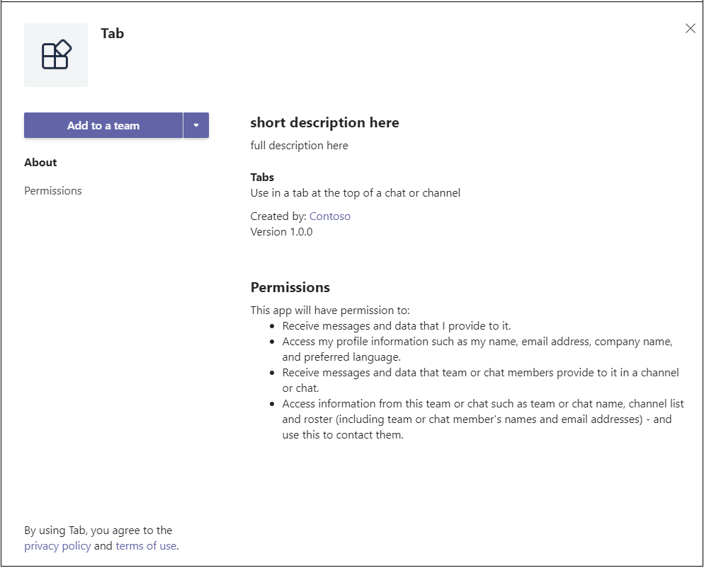

### <a name="_layoutcshtml"></a><span data-ttu-id="1b016-101">_Layout.cshtml</span><span class="sxs-lookup"><span data-stu-id="1b016-101">_Layout.cshtml</span></span>

<span data-ttu-id="1b016-102">Damit Die Registerkarte in Teams angezeigt werden kann, müssen Sie das **Microsoft Teams JavaScript-Client-SDK** und einen Aufruf nach `microsoftTeams.initialize()` dem Laden der Seite einschließen.</span><span class="sxs-lookup"><span data-stu-id="1b016-102">For your tab to display in Teams, you must include the **Microsoft Teams JavaScript client SDK** and include a call to `microsoftTeams.initialize()` after your page loads.</span></span> <span data-ttu-id="1b016-103">So kommunizieren Ihre Registerkarte und der Teams-Client:</span><span class="sxs-lookup"><span data-stu-id="1b016-103">This is how your tab and the Teams client communicate:</span></span>

<span data-ttu-id="1b016-104">Wechseln Sie zum Ordner **"Freigegeben",** öffnen **Sie _Layout.cshtml,** und fügen Sie dem Tag Folgendes `<head>` hinzu:</span><span class="sxs-lookup"><span data-stu-id="1b016-104">Go to the **Shared** folder, open **_Layout.cshtml**, and add the following to the `<head>` tag:</span></span>

```html
<script src="https://ajax.aspnetcdn.com/ajax/jQuery/jquery-3.4.1.min.js"></script>
<script src="https://statics.teams.cdn.office.net/sdk/v1.6.0/js/MicrosoftTeams.min.js"></script>
```

>[!IMPORTANT]
> <span data-ttu-id="1b016-105">Kopieren Sie die URLs von dieser Seite nicht, und fügen Sie `<script src="...">` sie nicht ein, da sie möglicherweise nicht die neueste Version darstellen.</span><span class="sxs-lookup"><span data-stu-id="1b016-105">Do not copy and paste the `<script src="...">` URLs from this page, as they may not represent the latest version.</span></span> <span data-ttu-id="1b016-106">Um die neueste Version des SDK zu erhalten, wechseln Sie immer zu [Microsoft Teams JavaScript-API.](https://www.npmjs.com/package/@microsoft/teams-js)</span><span class="sxs-lookup"><span data-stu-id="1b016-106">To get the latest version of the SDK, always go to [Microsoft Teams JavaScript API](https://www.npmjs.com/package/@microsoft/teams-js).</span></span>

### <a name="tabcshtml"></a><span data-ttu-id="1b016-107">Tab.cshtml</span><span class="sxs-lookup"><span data-stu-id="1b016-107">Tab.cshtml</span></span>

<span data-ttu-id="1b016-108">**So aktualisieren Sie das eingebettete Skript**</span><span class="sxs-lookup"><span data-stu-id="1b016-108">**To update the embedded script**</span></span>

1. <span data-ttu-id="1b016-109">Öffnen Sie in Visual Studio **Tab.cshtml,** um die eingebettete zu `<script>` aktualisieren.</span><span class="sxs-lookup"><span data-stu-id="1b016-109">In Visual Studio, open **Tab.cshtml** to update the embedded `<script>`.</span></span>

1. <span data-ttu-id="1b016-110">Rufen Sie oben im Skript `microsoftTeams.initialize()` .</span><span class="sxs-lookup"><span data-stu-id="1b016-110">At the top of the script, call `microsoftTeams.initialize()`.</span></span>

1. <span data-ttu-id="1b016-111">Aktualisieren Sie die `websiteUrl` Werte in jeder Funktion mit der `contentUrl` HTTPS-ngrok-URL auf Ihre Registerkarte.</span><span class="sxs-lookup"><span data-stu-id="1b016-111">Update the `websiteUrl` and `contentUrl` values in each function with the HTTPS ngrok URL to your tab.</span></span>

    <span data-ttu-id="1b016-112">Ihr Code sollte nun wie folgt aussehen, wobei **y8rCgT2b** durch Ihre ngrok-URL ersetzt wird:</span><span class="sxs-lookup"><span data-stu-id="1b016-112">Your code should now look like the following with **y8rCgT2b** replaced with your ngrok URL:</span></span>

    ```javascript
        microsoftTeams.initialize();
    
        let saveGray = () => {
            microsoftTeams.settings.registerOnSaveHandler(function (saveEvent) {
                microsoftTeams.settings.setSettings({
                    websiteUrl: `https://y8rCgT2b.ngrok.io`,
                    contentUrl: `https://y8rCgT2b.ngrok.io/gray/`,
                    entityId: "grayIconTab",
                    suggestedDisplayName: "MyNewTab"
                });
                saveEvent.notifySuccess();
            });
        }

        let saveRed = () => {
            microsoftTeams.settings.registerOnSaveHandler(function (saveEvent) {
                microsoftTeams.settings.setSettings({
                    websiteUrl: `https://y8rCgT2b.ngrok.io`,
                    contentUrl: `https://y8rCgT2b.ngrok.io/red/`,
                    entityId: "redIconTab",
                    suggestedDisplayName: "MyNewTab"
                });
                saveEvent.notifySuccess();
            });
        }
    ```

1. <span data-ttu-id="1b016-113">Stellen Sie sicher, dass Sie das aktualisierte **Tab.cshtml**-Objekt speichern.</span><span class="sxs-lookup"><span data-stu-id="1b016-113">Make sure to save the updated **Tab.cshtml**.</span></span>

## <a name="build-and-run-your-application"></a><span data-ttu-id="1b016-114">Erstellen und Ausführen der Anwendung</span><span class="sxs-lookup"><span data-stu-id="1b016-114">Build and run your application</span></span>

<span data-ttu-id="1b016-115">Drücken Sie in Visual Studio **F5,** oder wählen Sie im Menü **"Debuggen"** die Option **"Debuggen starten"** aus.</span><span class="sxs-lookup"><span data-stu-id="1b016-115">In Visual Studio, press **F5** or choose **Start Debugging** from the **Debug** menu.</span></span> <span data-ttu-id="1b016-116">Stellen Sie sicher, dass **ngrok** ausgeführt wird und ordnungsgemäß funktioniert, indem Sie Ihren Browser öffnen und über die ngrok-HTTPS-URL, die im Eingabeaufforderungsfenster bereitgestellt wurde, zur Inhaltsseite wechseln.</span><span class="sxs-lookup"><span data-stu-id="1b016-116">Verify that **ngrok** is running and working properly by opening your browser and going to your content page via the ngrok HTTPS URL that was provided in your command prompt window.</span></span>

> [!TIP]
> <span data-ttu-id="1b016-117">Sie müssen ihre Anwendung sowohl in Visual Studio als auch in ngrok ausführen.</span><span class="sxs-lookup"><span data-stu-id="1b016-117">You need to have both your application in Visual Studio and ngrok running.</span></span> <span data-ttu-id="1b016-118">Wenn Sie die Ausführung Ihrer Anwendung in Visual Studio beenden müssen, um daran zu **arbeiten, führen Sie ngrok aus.**</span><span class="sxs-lookup"><span data-stu-id="1b016-118">If you need to stop running your application in Visual Studio to work on it **keep ngrok running**.</span></span> <span data-ttu-id="1b016-119">Sie lauscht weiterhin und setzt das Weiterleiten der Anforderung Ihrer Anwendung fort, wenn sie in Visual Studio neu gestartet wird.</span><span class="sxs-lookup"><span data-stu-id="1b016-119">It will continue to listen and will resume routing your application's request when it restarts in Visual Studio.</span></span> <span data-ttu-id="1b016-120">Wenn Sie den ngrok-Dienst neu starten müssen, wird eine neue URL zurückgegeben, und Sie müssen Ihre Anwendung mit der neuen URL aktualisieren.</span><span class="sxs-lookup"><span data-stu-id="1b016-120">If you have to restart the ngrok service, it will return a new URL and you will have to update your application with the new URL.</span></span>

## <a name="upload-your-tab"></a><span data-ttu-id="1b016-121">Hochladen Der Registerkarte</span><span class="sxs-lookup"><span data-stu-id="1b016-121">Upload your tab</span></span>

>[!Note]
> <span data-ttu-id="1b016-122">App Studio kann verwendet werden, um Ihre **manifest.jszu** bearbeiten und das fertige Paket in Teams hochzuladen.</span><span class="sxs-lookup"><span data-stu-id="1b016-122">App Studio can be used to edit your **manifest.json** file and upload the completed package to Teams.</span></span> <span data-ttu-id="1b016-123">Sie können die **manifest.js** für die Datei auch manuell bearbeiten, wenn Sie möchten.</span><span class="sxs-lookup"><span data-stu-id="1b016-123">You can also manually edit the **manifest.json** file if you prefer.</span></span> <span data-ttu-id="1b016-124">Wenn Sie dies tun, müssen Sie die Lösung erneut erstellen, um die hochzuladende **tab.zipdatei** zu erstellen.</span><span class="sxs-lookup"><span data-stu-id="1b016-124">If you do, be sure to build the solution again to create the **tab.zip** file to upload.</span></span>

<span data-ttu-id="1b016-125">**So laden Sie Ihre Registerkarte hoch**</span><span class="sxs-lookup"><span data-stu-id="1b016-125">**To upload your tab**</span></span>

1. <span data-ttu-id="1b016-126">Wechseln Sie zu Microsoft Teams.</span><span class="sxs-lookup"><span data-stu-id="1b016-126">Go to Microsoft Teams.</span></span> <span data-ttu-id="1b016-127">Wenn Sie die [webbasierte Version](https://teams.microsoft.com) verwenden, können Sie Ihren Front-End-Code mithilfe der [Entwicklertools](~/tabs/how-to/developer-tools.md)Ihres Browsers überprüfen.</span><span class="sxs-lookup"><span data-stu-id="1b016-127">If you use the [web based version](https://teams.microsoft.com) you can inspect your front-end code using your browser's [developer tools](~/tabs/how-to/developer-tools.md).</span></span>

1. <span data-ttu-id="1b016-128">Wechseln Sie zu **App Studio,** und wählen Sie die Registerkarte **"Manifest-Editor"** aus.</span><span class="sxs-lookup"><span data-stu-id="1b016-128">Go to **App Studio** and select the **Manifest editor** tab.</span></span>

1. <span data-ttu-id="1b016-129">Wählen Sie im Manifest-Editor eine **vorhandene App importieren** aus, um mit dem Aktualisieren des App-Pakets für Ihre Registerkarte zu beginnen. Der Quellcode enthält ein eigenes teilweise vollständiges Manifest.</span><span class="sxs-lookup"><span data-stu-id="1b016-129">Select **Import an existing app** in the Manifest editor to begin updating the app package for your tab. The source code comes with its own partially complete manifest.</span></span> <span data-ttu-id="1b016-130">Der Name Ihres App-Pakets ist **tab.zip.**</span><span class="sxs-lookup"><span data-stu-id="1b016-130">The name of your app package is **tab.zip**.</span></span> <span data-ttu-id="1b016-131">Sie ist hier verfügbar:</span><span class="sxs-lookup"><span data-stu-id="1b016-131">It is available here:</span></span>

    ```bash
    /bin/Debug/netcoreapp2.2/tab.zip
    ```

1. <span data-ttu-id="1b016-132">Hochladen app Studio **tab.zip.**</span><span class="sxs-lookup"><span data-stu-id="1b016-132">Upload **tab.zip** to App Studio.</span></span>

### <a name="update-your-app-package-with-manifest-editor"></a><span data-ttu-id="1b016-133">Aktualisieren des App-Pakets mit dem Manifest-Editor</span><span class="sxs-lookup"><span data-stu-id="1b016-133">Update your app package with Manifest editor</span></span>

<span data-ttu-id="1b016-134">Nachdem Sie Das App-Paket in App Studio hochgeladen haben, müssen Sie die Konfiguration abschließen.</span><span class="sxs-lookup"><span data-stu-id="1b016-134">After you have uploaded your app package into App Studio, you must finish configuring it.</span></span>

<span data-ttu-id="1b016-135">Wählen Sie die Kachel für Ihre neu importierte Registerkarte im rechten Bereich der Willkommensseite des Manifest-Editors aus.</span><span class="sxs-lookup"><span data-stu-id="1b016-135">Select the tile for your newly imported tab in the right panel of the Manifest editor welcome page.</span></span>

<span data-ttu-id="1b016-136">Auf der linken Seite des Manifest-Editors finden Sie eine Liste der Schritte und auf der rechten Seite eine Liste der Eigenschaften, die werte für jeden dieser Schritte aufweisen müssen.</span><span class="sxs-lookup"><span data-stu-id="1b016-136">There is a list of steps in the left-hand side of the Manifest editor, and on the right, a list of properties that must have values for each of those steps.</span></span> <span data-ttu-id="1b016-137">Ein Großteil der Informationen wurde von Ihrem **manifest.js** bereitgestellt, es gibt jedoch einige Felder, die Sie aktualisieren müssen:</span><span class="sxs-lookup"><span data-stu-id="1b016-137">Much of the information has been provided by your **manifest.json** but there are a few fields that you must update:</span></span>

#### <a name="details-app-details"></a><span data-ttu-id="1b016-138">Details: App-Details</span><span class="sxs-lookup"><span data-stu-id="1b016-138">Details: App details</span></span>

<span data-ttu-id="1b016-139">Im Abschnitt **"App-Details":**</span><span class="sxs-lookup"><span data-stu-id="1b016-139">In the **App details** section:</span></span>

1. <span data-ttu-id="1b016-140">Wählen Sie unter **"Identifikation"** die Option **"Generieren"** aus, um die Platzhalter-ID durch die erforderliche GUID für Ihre Registerkarte zu ersetzen.</span><span class="sxs-lookup"><span data-stu-id="1b016-140">Under **Identification**, select **Generate** to replace the placeholder ID with the required GUID for your tab.</span></span>

1. <span data-ttu-id="1b016-141">Aktualisieren Sie unter **"Entwicklerinformationen"** **die Website** mit Ihrer **ngrok** HTTPS-URL.</span><span class="sxs-lookup"><span data-stu-id="1b016-141">Under **Developer information**, update **Website** with your **ngrok** HTTPS URL.</span></span>

1. <span data-ttu-id="1b016-142">Aktualisieren Sie unter **App-URLs** die **Datenschutzerklärung** `https://<yourngrokurl>/privacy` und die **Nutzungsbedingungen** auf `https://<yourngrokurl>/tou`>.</span><span class="sxs-lookup"><span data-stu-id="1b016-142">Under **App URLs**, update the **Privacy statement** to `https://<yourngrokurl>/privacy` and **Terms of use** to `https://<yourngrokurl>/tou`>.</span></span>

#### <a name="capabilities-tabs"></a><span data-ttu-id="1b016-143">Funktionen: Registerkarten</span><span class="sxs-lookup"><span data-stu-id="1b016-143">Capabilities: Tabs</span></span>

<span data-ttu-id="1b016-144">Im Abschnitt **"Registerkarten":**</span><span class="sxs-lookup"><span data-stu-id="1b016-144">In the **Tabs** section:</span></span>

1. <span data-ttu-id="1b016-145">Wählen Sie **auf der Registerkarte "Team"** die Option **"Hinzufügen"** aus.</span><span class="sxs-lookup"><span data-stu-id="1b016-145">Under **Team tab**, select **Add**.</span></span>

1. <span data-ttu-id="1b016-146">Aktualisieren Sie im Popupfenster der **Registerkarte "Team"** die **Konfigurations-URL** auf `https://<yourngrokurl>/tab` .</span><span class="sxs-lookup"><span data-stu-id="1b016-146">In the **Team tab** pop-up window, update the **Configuration URL** to `https://<yourngrokurl>/tab`.</span></span>

1. <span data-ttu-id="1b016-147">Stellen Sie sicher, dass die **Kontrollkästchen "Konfiguration aktualisieren können",** **"Team"** und **"Gruppenchat"** aktiviert sind, und wählen Sie **"Speichern"** aus.</span><span class="sxs-lookup"><span data-stu-id="1b016-147">Ensure the **Can update configuration?**, **Team**, and **Group chat** checkboxes are selected and select **Save**.</span></span>

#### <a name="finish-domains-and-permissions"></a><span data-ttu-id="1b016-148">Fertig stellen: Domänen und Berechtigungen</span><span class="sxs-lookup"><span data-stu-id="1b016-148">Finish: Domains and permissions</span></span>

<span data-ttu-id="1b016-149">Im Abschnitt **"Domänen und Berechtigungen"** müssen **Domänen von Ihren Registerkarten** Ihre ngrok-URL ohne das HTTPS-Präfix `<yourngrokurl>.ngrok.io/` enthalten.</span><span class="sxs-lookup"><span data-stu-id="1b016-149">In the **Domains and permissions** section, **Domains from your tabs** must contain your ngrok URL without the HTTPS prefix `<yourngrokurl>.ngrok.io/`.</span></span>

#### <a name="finish-test-and-distribute"></a><span data-ttu-id="1b016-150">Fertig stellen: Testen und Verteilen</span><span class="sxs-lookup"><span data-stu-id="1b016-150">Finish: Test and distribute</span></span>

>[!IMPORTANT]
> <span data-ttu-id="1b016-151">Auf der rechten Seite wird in der **Beschreibung** die folgende Warnung angezeigt:</span><span class="sxs-lookup"><span data-stu-id="1b016-151">On the right, in **Description**, you see the following warning:</span></span>
>
> <span data-ttu-id="1b016-152">&#9888; "**Das Array "validDomains" darf keine Tunnelwebsite enthalten...**"</span><span class="sxs-lookup"><span data-stu-id="1b016-152">&#9888; "**The 'validDomains' array cannot contain a tunneling site...**"</span></span>
>
> <span data-ttu-id="1b016-153">Diese Warnung kann beim Testen der Registerkarte ignoriert werden.</span><span class="sxs-lookup"><span data-stu-id="1b016-153">This warning can be ignored while testing your tab.</span></span>

1. <span data-ttu-id="1b016-154">Wählen Sie im Abschnitt **"Testen und Verteilen"** die Option **"Installieren"** aus.</span><span class="sxs-lookup"><span data-stu-id="1b016-154">In the **Test and Distribute** section, select **Install**.</span></span>

1. <span data-ttu-id="1b016-155">Wählen Sie im Popupdialogfeld **"Zu einem Team hinzufügen"** oder aus der Dropdownliste die Option **"Zu einem Chat hinzufügen"** aus.</span><span class="sxs-lookup"><span data-stu-id="1b016-155">In the pop-up dialog box, select **Add to a team** or from the drop-down, select **Add to a chat**.</span></span>

1. <span data-ttu-id="1b016-156">Wählen Sie das Team oder den Chat aus, in dem die Registerkarte angezeigt werden soll, und wählen Sie **"Registerkarte einrichten"** aus.</span><span class="sxs-lookup"><span data-stu-id="1b016-156">Choose the team or chat where you want the tab to be displayed and select **Set up a tab**.</span></span>

1. <span data-ttu-id="1b016-157">Wählen Sie im nächsten Popupdialogfeld entweder **"Grau"** oder **"Rot"** aus, und wählen Sie **"Speichern"** aus.</span><span class="sxs-lookup"><span data-stu-id="1b016-157">In the next pop-up dialog box, choose either **Select Gray** or **Select Red**, and select **Save**.</span></span>

1. <span data-ttu-id="1b016-158">Um Ihre Registerkarte anzuzeigen, wechseln Sie zu dem Team, in dem Sie die Registerkarte installiert haben, und wählen Sie sie in der Registerkartenleiste aus.</span><span class="sxs-lookup"><span data-stu-id="1b016-158">To view your tab, go to the team where you installed the tab, and select it from the tab bar.</span></span> <span data-ttu-id="1b016-159">Die Seite, die Sie während der Konfiguration ausgewählt haben, wird angezeigt.</span><span class="sxs-lookup"><span data-stu-id="1b016-159">The page that you chose during configuration is displayed.</span></span>

    

