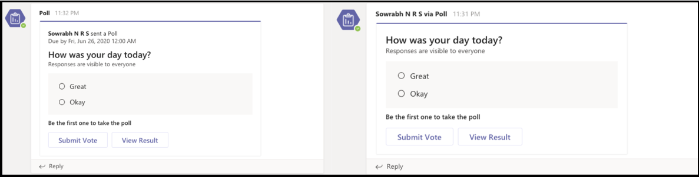

# <a name="respond-to-the-task-module-submit-action"></a>Reagieren auf die Absendenaktion des Aufgabenmoduls

[!include[v4-to-v3-SDK-pointer](~/includes/v4-to-v3-pointer-me.md)]

In diesem Dokument erfahren Sie, wie Ihre App auf die Aktionsbefehle reagiert, z. B. die Absendenaktion des Aufgabenmoduls des Benutzers.
Nachdem ein Benutzer das Aufgabenmodul übermittelt hat, empfängt ihr Webdienst eine Aufrufnachricht mit der Befehls-ID `composeExtension/submitAction` und den Parameterwerten. Ihre App hat fünf Sekunden Zeit, um auf den Aufruf zu antworten, andernfalls erhält der Benutzer eine Fehlermeldung Nicht erreichen, und alle Antworten auf den Aufruf werden vom Teams-Client ignoriert.

Sie haben die folgenden Optionen, um zu antworten:

* Keine Antwort: Verwenden Sie die Submit-Aktion, um einen Prozess in einem externen System auszulösen, und geben Sie dem Benutzer kein Feedback. Dies ist nützlich für lange laufende Prozesse, und Sie können auswählen, ob Sie feedback abwechselnd bereitstellen möchten. Beispielsweise können Sie Feedback mit einer proaktiven [Nachricht geben.](~/bots/how-to/conversations/send-proactive-messages.md)
* [Ein weiteres Aufgabenmodul:](#respond-with-another-task-module)Sie können im Rahmen einer mehrstufigen Interaktion mit einem zusätzlichen Aufgabenmodul antworten.
* [Kartenantwort:](#respond-with-a-card-inserted-into-the-compose-message-area)Sie können mit einer Karte antworten, mit der der Benutzer interagieren oder in eine Nachricht einfügen kann.
* [Adaptive Karte vom Bot:](#bot-response-with-adaptive-card)Fügen Sie eine adaptive Karte direkt in die Unterhaltung ein.
* [Fordern Sie den Benutzer zur Authentifizierung an.](~/messaging-extensions/how-to/add-authentication.md)
* [Fordern Sie den Benutzer auf, eine zusätzliche Konfiguration zur Verfügung zu stellen.](~/messaging-extensions/how-to/add-configuration-page.md)

Für die Authentifizierung oder Konfiguration wird nach Abschluss des Vorgangs der ursprüngliche Aufruf an Den Webdienst erneut senden. Die folgende Tabelle zeigt, welche Arten von Antworten basierend auf dem Aufrufspeicherort der `commandContext` Messagingerweiterung verfügbar sind: 

|Antworttyp | Verfassen | Befehlsleiste | Message |
|--------------|:-------------:|:-------------:|:---------:|
|Kartenantwort | ✔ | ✔ | ✔ |
|Ein weiteres Aufgabenmodul | ✔ | ✔ | ✔ |
|Bot mit adaptiver Karte | ✔ | x | ✔ |
| Keine Antwort | ✔ | ✔ | ✔ |

> [!NOTE]
> * Wenn Sie **Action.Submit** through ME-Karten auswählen, sendet sie aufrufaktivität mit dem Namen **composeExtension**, wobei der Wert der üblichen Nutzlast entspricht.
> * Wenn Sie **Action.Submit** through conversation auswählen, erhalten Sie Nachrichtenaktivität mit dem Namen **onCardButtonClicked**, wobei der Wert der üblichen Nutzlast entspricht.

## <a name="the-submitaction-invoke-event"></a>Das submitAction-Aufrufereignis

Beispiele für den Empfang der aufrufenden Nachricht sind:

# <a name="cnet"></a>[C#/.NET](#tab/dotnet)

```csharp
protected override async Task<MessagingExtensionActionResponse> OnTeamsMessagingExtensionSubmitActionAsync(
  ITurnContext<IInvokeActivity> turnContext, MessagingExtensionAction action, CancellationToken cancellationToken) {
  //code to handle the submit action
}
```

# <a name="javascriptnodejs"></a>[JavaScript/Node.js](#tab/javascript)

```javascript
class TeamsMessagingExtensionsActionPreview extends TeamsActivityHandler {
  constructor() {
  handleTeamsMessagingExtensionSubmitAction(context, action) {
  
  //code to handle the submit action
    }
  }
}
```

# <a name="json"></a>[Json](#tab/json)

Dies ist ein Beispiel für das JSON-Objekt, das Sie erhalten. Der `commandContext` Parameter gibt an, von wo ihre Messagingerweiterung ausgelöst wurde. Das Objekt enthält die Felder im Formular als Parameter und die `data` vom Benutzer übermittelten Werte. Das hier gezeigte JSON-Objekt wird verkürzt, um die relevantesten Felder zu markieren.

```json
{
  "name": "composeExtension/submitAction",
  "imdisplayname": "Bob Smith",
  "serviceUrl": "https://smba.trafficmanager.net/amer/",
  "value": {
    "commandId": "giveKudos",
    "commandContext": "compose",
    "context": {
      "theme": "default"
    },
    "data": {
      "id": "submitButton",
      "formField1": "formField1_value",
      "formField2": "formField2_value",
      "formField3": "formField3_value"
    }
  },
  "conversation": {
    "id": "19:7705841b240044b297123ad7f9c99217@thread.skype"
  }
}
```

* * *

## <a name="respond-with-a-card-inserted-into-the-compose-message-area"></a>Antworten mit einer Karte, die in den Bereich "Verfassen von Nachrichten" eingefügt wurde

Die häufigste Möglichkeit, auf die Anforderung zu reagieren, ist eine Karte, die in den Bereich "Verfassen `composeExtension/submitAction` von Nachrichten" eingefügt wird. Der Benutzer sendet die Karte an die Unterhaltung. Weitere Informationen zur Verwendung von Karten finden Sie unter [Karten und Kartenaktionen](~/task-modules-and-cards/cards/cards-actions.md).

# <a name="cnet"></a>[C#/.NET](#tab/dotnet)

```csharp
protected override async Task<MessagingExtensionActionResponse> OnTeamsMessagingExtensionSubmitActionAsync(
  ITurnContext<IInvokeActivity> turnContext, MessagingExtensionAction action, CancellationToken cancellationToken)
{
    var response = new MessagingExtensionActionResponse
    {
        ComposeExtension = new MessagingExtensionResult
        {
            AttachmentLayout = "list",
            Type = "result",
        },
    };
    var createCardData = ((JObject)action.Data).ToObject<CreateCardData>();
var card = new HeroCard
{
     Title = createCardData.Title,
     Subtitle = createCardData.Subtitle,
     Text = createCardData.Text,
};
    var attachments = new List<MessagingExtensionAttachment>();
    attachments.Add(new MessagingExtensionAttachment
    {
        Content = card,
        ContentType = HeroCard.ContentType,
        Preview = card.ToAttachment(),
    });
    response.ComposeExtension.Attachments = attachments;
    return response;
}
```

# <a name="javascriptnodejs"></a>[JavaScript/Node.js](#tab/javascript)

```javascript
class TeamsMessagingExtensionsActionPreview extends TeamsActivityHandler {
  handleTeamsMessagingExtensionSubmitAction(context, action) {
    const data = action.data;
    const heroCard = CardFactory.heroCard(data.title, data.text);
    heroCard.content.subtitle = data.subTitle;
    const attachment = { contentType: heroCard.contentType, content: heroCard.content, preview: heroCard };

    return {
      composeExtension: {
        type: 'result',
        attachmentLayout: 'list',
        attachments: [
          attachment
        ]
      }
    }
  }
}
```

# <a name="json"></a>[Json](#tab/json)

```json
{
  "composeExtension": {
    "attachmentLayout": "list",
    "type": "result",
    "attachments": [
      {
        "preview": {
          "contentType": "application/vnd.microsoft.card.hero",
          "content": {
            "title": "formField1_value",
            "subtitle": "formField2_value",
            "text": "formField3_value"
          }
        },
        "contentType": "application/vnd.microsoft.card.hero",
        "content": {
          "title": "formField1_value",
          "subtitle": "formField2_value",
          "text": "formField3_value"
        }
      }
    ]
  }
}
```

* * *

## <a name="respond-with-another-task-module"></a>Reagieren mit einem anderen Aufgabenmodul

Sie können auswählen, ob sie mit einem `submitAction` zusätzlichen Aufgabenmodul auf das Ereignis reagieren möchten. Dies ist nützlich, wenn:

* Sie müssen große Mengen von Informationen sammeln.
* Sie müssen die von Ihnen gesammelten Informationen basierend auf benutzerbezogenen Eingaben dynamisch ändern.
* Sie müssen die vom Benutzer übermittelten Informationen überprüfen und das Formular erneut mit einer Fehlermeldung senden, wenn etwas nicht stimmt. 

Die Methode für die Antwort ist identisch mit der [Antwort auf das ursprüngliche `fetchTask` Ereignis](~/messaging-extensions/how-to/action-commands/create-task-module.md). Wenn Sie das Bot Framework SDK verwenden, werden für beide Absendenaktionen dieselben Ereignisauslöser ausgelöst. Damit dies funktioniert, müssen Sie logik hinzufügen, die die richtige Antwort bestimmt.

## <a name="bot-response-with-adaptive-card"></a>Botantwort mit adaptiver Karte

> [!NOTE]
> Die Voraussetzung für das Erhalten der Botantwort mit einer adaptiven Karte ist, dass Sie das Objekt zu Ihrem App-Manifest hinzufügen und den erforderlichen Bereich für `bot` den Bot definieren müssen. Verwenden Sie die gleiche ID wie Ihre Messagingerweiterung für Ihren Bot.
 
Sie können auch darauf reagieren, indem Sie eine Nachricht mit einer adaptiven Karte in den Kanal mit `submitAction` einem Bot einfügen. Der Benutzer kann eine Vorschau der Nachricht anzeigen, bevor er sie übermittelt. Dies ist sehr nützlich in Szenarien, in denen Sie Informationen von den Benutzern sammeln, bevor Sie eine Adaptive Card-Antwort erstellen, oder wenn Sie die Karte aktualisieren, nachdem jemand mit ihr interagiert hat. 

Das folgende Szenario zeigt, wie die App Polly eine Umfrage konfiguriert, ohne die Konfigurationsschritte in die Kanalunterhaltung zu verwenden:

**So konfigurieren Sie die Abfrage**

1. Der Benutzer wählt die Messagingerweiterung zum Aufrufen des Aufgabenmoduls aus.
1. Der Benutzer konfiguriert die Abfrage mit dem Aufgabenmodul.
1. Nach dem Übermitteln des Aufgabenmoduls verwendet die App die bereitgestellten Informationen, um die Umfrage als adaptive Karte zu erstellen, und sendet sie als Antwort `botMessagePreview` an den Client.
1. Der Benutzer kann dann eine Vorschau der Adaptive Card-Nachricht anzeigen, bevor der Bot sie in den Kanal einfüge. Wenn die App noch kein Mitglied des Kanals ist, wählen Sie aus, `Send` um sie hinzuzufügen.

    > [!NOTE] 
    > * Die Benutzer können auch die Nachricht `Edit` auswählen, die sie an das ursprüngliche Aufgabenmodul zurückgibt. 
    > * Durch die Interaktion mit der adaptiven Karte wird die Nachricht vor dem Senden geändert.
1. Nachdem der Benutzer den `Send` Bot ausgewählt hat, wird die Nachricht an den Kanal gesendet.

## <a name="respond-to-initial-submit-action"></a>Reagieren auf erste Absendenaktion

Ihr Aufgabenmodul muss auf die anfängliche Nachricht mit einer Vorschau der Karte reagieren, die der `composeExtension/submitAction` Bot an den Kanal sendet. Der Benutzer kann die Karte vor dem Senden überprüfen und auch versuchen, den Bot in der Unterhaltung zu installieren, wenn der Bot noch nicht installiert ist.

# <a name="cnet"></a>[C#/.NET](#tab/dotnet)

```csharp
protected override async Task<MessagingExtensionActionResponse> OnTeamsMessagingExtensionSubmitActionAsync(
  ITurnContext<IInvokeActivity> turnContext, MessagingExtensionAction action, CancellationToken cancellationToken)
{
  dynamic createCardData = ((JObject) action.Data).ToObject(typeof(JObject));
  var response = new MessagingExtensionActionResponse
  {
    ComposeExtension = new MessagingExtensionResult
    {
      Type = "botMessagePreview",
      ActivityPreview = MessageFactory.Attachment(new Attachment
      {
        Content = new AdaptiveCard("1.0")
        {
          Body = new List<AdaptiveElement>()
          {
            new AdaptiveTextBlock() { Text = "FormField1 value was:", Size = AdaptiveTextSize.Large },
            new AdaptiveTextBlock() { Text = Data["FormField1"] as string }
          },
          Height = AdaptiveHeight.Auto,
          Actions = new List<AdaptiveAction>()
          {
            new AdaptiveSubmitAction
            {
              Type = AdaptiveSubmitAction.TypeName,
              Title = "Submit",
              Data = new JObject { { "submitLocation", "messagingExtensionFetchTask" } },
            },
          }
        },
        ContentType = AdaptiveCard.ContentType
      }) as Activity
    }
  };

  return response;
}
```

# <a name="javascriptnodejs"></a>[JavaScript/Node.js](#tab/javascript)

```javascript
class TeamsMessagingExtensionsActionPreview extends TeamsActivityHandler {
  handleTeamsMessagingExtensionSubmitAction(context, action) {
    const submittedData = action.data;
    const adaptiveCard = CardFactory.adaptiveCard({
      actions: [
        { type: 'Action.Submit', title: 'Submit', data: { submitLocation: 'messagingExtensionSubmit' } }
      ],
      body: [
          { text: 'Adaptive Card from Task Module', type: 'TextBlock', weight: 'bolder' },
          { text: `${ submittedData.Question }`, type: 'TextBlock', id: 'Question' },
          { id: 'Answer', placeholder: 'Answer here...', type: 'Input.Text' },
        {
          choices: [
            { title: submittedData.Option1, value: submittedData.Option1 },
            { title: submittedData.Option2, value: submittedData.Option2 },
            { title: submittedData.Option3, value: submittedData.Option3 }
          ],
          id: 'Choices',
          isMultiSelect: submittedData.MultiSelect,
          style: 'expanded',
          type: 'Input.ChoiceSet'
        }
      ],
      type: 'AdaptiveCard',
      version: '1.0'
    });
    return {
      composeExtension: {
        activityPreview: MessageFactory.attachment(adaptiveCard, null, null, InputHints.ExpectingInput),
        type: 'botMessagePreview'
      }
    };
  }
}
```

# <a name="json"></a>[Json](#tab/json)

> [!NOTE]
> * Der `activityPreview` muss eine Aktivität mit genau einer `message` adaptiven Kartenanlage enthalten. Der `<< Card Payload >>` Wert ist ein Platzhalter für die Karte, die Sie senden möchten.

```json
{
  "composeExtension": {
    "type": "botMessagePreview",
    "activityPreview": {
      "type": "message",
      "attachments":  [
        {
          "contentType": "application/vnd.microsoft.card.adaptive",
          "content": << Card Payload >>
        }
      ]
    }
  }
}
```

* * *

### <a name="the-botmessagepreview-send-and-edit-events"></a>Die BotMessagePreview-Sende- und -Bearbeitungsereignisse

Ihre Messagingerweiterung muss auf zwei neue Arten des Aufrufs `composeExtension/submitAction` reagieren, wobei `value.botMessagePreviewAction = "send"` und `value.botMessagePreviewAction = "edit"` .

# <a name="cnet"></a>[C#/.NET](#tab/dotnet)

```csharp
protected override async Task<MessagingExtensionActionResponse> OnTeamsMessagingExtensionBotMessagePreviewEditAsync(
  ITurnContext<IInvokeActivity> turnContext, MessagingExtensionAction action, CancellationToken cancellationToken)
{
  //handle the event
}

protected override async Task<MessagingExtensionActionResponse> OnTeamsMessagingExtensionBotMessagePreviewSendAsync(
  ITurnContext<IInvokeActivity> turnContext, MessagingExtensionAction action, CancellationToken cancellationToken)
{
  //handle the event
}

```

# <a name="javascriptnodejs"></a>[JavaScript/Node.js](#tab/javascript)

```javascript
class TeamsMessagingExtensionsActionPreview extends TeamsActivityHandler {
  handleTeamsMessagingExtensionBotMessagePreviewEdit(context, action) {

    //handle the event
  }
  
  handleTeamsMessagingExtensionBotMessagePreviewSend(context, action) {

    //handle the event
  }
}

```

# <a name="json"></a>[Json](#tab/json)

```json
{
  "name": "composeExtension/submitAction",
  "type": "invoke",
  "conversation": { "id": "19:c366b75791784100b6e8b515fd55b063@thread.skype" },
  "imdisplayname": "Pranav Smith",
  ...
  "value": {
    "botMessagePreviewAction": "edit | send",
    "botActivityPreview": [
      {
        "type": "message/card",
        "attachments": [
          {
            "content":
              {
                "type": "AdaptiveCard",
                "body": [{<<card payload>>}]
              },
            "contentType" : "application/vnd.microsoft.card.adaptive"
          }
        ],
        "context": { "theme": "default" }
      }
    ],
  }
}
```

* * *

### <a name="respond-to-botmessagepreview-edit"></a>Reagieren auf botMessagePreview-Bearbeitung

Wenn der Benutzer die Karte vor dem Senden bearbeitet, erhalten Sie durch Auswählen von **Bearbeiten** einen `composeExtension/submitAction` Aufruf mit `value.botMessagePreviewAction = edit` . Sie müssen antworten, indem Sie das gesendete Aufgabenmodul als Antwort auf den anfänglichen Aufruf zurückgeben, `composeExtension/fetchTask` mit dem die Interaktion begonnen hat. Dadurch kann der Benutzer den Prozess durch erneutes Eingeben der ursprünglichen Informationen starten. Verwenden Sie die verfügbaren Informationen, um das Aufgabenmodul so zu aktualisieren, dass der Benutzer nicht alle Informationen von Grund auf ausfüllen muss.
Weitere Informationen zum Reagieren auf das ursprüngliche Ereignis `fetchTask` finden Sie unter [responding to the initial `fetchTask` event](~/messaging-extensions/how-to/action-commands/create-task-module.md).

### <a name="respond-to-botmessagepreview-send"></a>Reagieren auf botMessagePreview send

Nachdem der Benutzer die Option **Senden ausgewählt** hat, erhalten Sie einen Aufruf `composeExtension/submitAction` mit `value.botMessagePreviewAction = send` . Ihr Webdienst muss eine proaktive Nachricht mit der adaptiven Karte an die Unterhaltung erstellen und senden und auch auf den Aufruf antworten.

# <a name="cnet"></a>[C#/.NET](#tab/dotnet)

```csharp
protected override async Task<MessagingExtensionActionResponse> OnTeamsMessagingExtensionBotMessagePreviewSendAsync(
  ITurnContext<IInvokeActivity> turnContext, MessagingExtensionAction action, CancellationToken cancellationToken)
{
  var activityPreview = action.BotActivityPreview[0];
  var attachmentContent = activityPreview.Attachments[0].Content;
  var previewedCard = JsonConvert.DeserializeObject<AdaptiveCard>(attachmentContent.ToString(),
          new JsonSerializerSettings { NullValueHandling = NullValueHandling.Ignore });
  
  previewedCard.Version = "1.0";

  var responseActivity = Activity.CreateMessageActivity();
  Attachment attachment = new Attachment()
  {
    ContentType = AdaptiveCard.ContentType,
    Content = previewedCard
  };
  responseActivity.Attachments.Add(attachment);
  
  // Attribute the message to the user on whose behalf the bot is posting
  responseActivity.ChannelData = new {
    OnBehalfOf = new []
    {
      new
      {
        ItemId = 0,
        MentionType = "person",
        Mri = turnContext.Activity.From.Id,
        DisplayName = turnContext.Activity.From.Name
      }  
    }
  };
  
  await turnContext.SendActivityAsync(responseActivity);

  return new MessagingExtensionActionResponse();
}
```

# <a name="javascriptnodejs"></a>[JavaScript/Node.js](#tab/javascript)

```javascript
class TeamsMessagingExtensionsActionPreview extends TeamsActivityHandler {
    async handleTeamsMessagingExtensionBotMessagePreviewSend(context, action) {
      // The data has been returned to the bot in the action structure.
      const activityPreview = action.botActivityPreview[0];
      const attachmentContent = activityPreview.attachments[0].content;
      const userText = attachmentContent.body[1].text;
      const choiceSet = attachmentContent.body[3];

      const submitData = {
        MultiSelect: choiceSet.isMultiSelect ? 'true' : 'false',
        Option1: choiceSet.choices[0].title,
        Option2: choiceSet.choices[1].title,
        Option3: choiceSet.choices[2].title,
        Question: userText
      };

      const adaptiveCard = CardFactory.adaptiveCard({
        actions: [
          { type: 'Action.Submit', title: 'Submit', data: { submitLocation: 'messagingExtensionSubmit' } }
        ],
        body: [
          { text: 'Adaptive Card from Task Module', type: 'TextBlock', weight: 'bolder' },
          { text: `${ submitData.Question }`, type: 'TextBlock', id: 'Question' },
          { id: 'Answer', placeholder: 'Answer here...', type: 'Input.Text' },
          {
            choices: [
                { title: submitData.Option1, value: submitData.Option1 },
                { title: submitData.Option2, value: submitData.Option2 },
                { title: submitData.Option3, value: submitData.Option3 }
            ],
            id: 'Choices',
            isMultiSelect: submitData.MultiSelect,
            style: 'expanded',
            type: 'Input.ChoiceSet'
          }
        ],
        type: 'AdaptiveCard',
        version: '1.0'
      });
      const responseActivity = { type: 'message', attachments: [adaptiveCard], channelData: {
          onBehalfOf: [
              { itemId: 0, mentionType: 'person', mri: context.activity.from.id, displayname: context.activity.from.name }
          ]
      }};

      await context.sendActivity(responseActivity);
    }
}
```

# <a name="json"></a>[Json](#tab/json)

Sie erhalten eine neue `composeExtension/submitAction` Nachricht wie die folgende:

```json
{
  "name": "composeExtension/submitAction",
  "type": "invoke",
  "conversation": { "id": "19:c366b75791784100b6e8b515fd55b063@thread.skype" },
  "imdisplayname": "Pranav Smith",
  ...
  "value": {
    "botMessagePreviewAction": "send",
    "botActivityPreview": [
      {
        "type": "message/card",
        "attachments": [
          {
            "content":
              {
                "type": "AdaptiveCard",
                "body": [{<<card payload>>}]
              },
            "contentType" : "application/vnd.microsoft.card.adaptive"
          }
        ],
        "context": { "theme": "default" }
      }
    ],
  }
}
```

* * *

### <a name="user-attribution-for-bots-messages"></a>Benutzerzuschreibung für Bots-Nachrichten 

In Szenarien, in denen ein Bot Nachrichten im Auftrag eines Benutzers sendet, hilft das Zuweisen der Nachricht an diesen Benutzer bei der Interaktion und zeigt einen natürlicheren Interaktionsfluss. Mit diesem Feature können Sie einer Benutzerin, in deren Auftrag sie gesendet wurde, eine Nachricht von Ihrem Bot entributen.

In der folgenden Abbildung ist links eine Kartennachricht, die von einem Bot ohne Benutzerzuschreibung gesendet wird, und rechts eine Karte, die von einem Bot mit Benutzerzuschreibung gesendet wird.



Um die Benutzerzuschreibung in Teams zu verwenden, müssen Sie die Erwähnungsentität zu Ihrer Nutzlast hinzufügen, `OnBehalfOf` die an Teams gesendet `ChannelData` `Activity` wird.

# <a name="cnet"></a>[C#/.NET](#tab/dotnet-1)

```csharp
    OnBehalfOf = new []
    {
      new
      {
        ItemId = 0,
        MentionType = "person",
        Mri = turnContext.Activity.From.Id,
        DisplayName = turnContext.Activity.From.Name
      }  
    }

```

# <a name="json"></a>[Json](#tab/json-1)

```json
{
    "text": "Hello World!",
    "ChannelData": {
        "OnBehalfOf": [{
            "itemid": 0,
            "mentionType": "person",
            "mri": "29:orgid:89e6508d-6c0f-4ffe-9f6a-b58416d965ae",
            "displayName": "Sowrabh N R S"
        }]
    }
}
```

* * *

#### <a name="details-of--onbehalfof-entity-schema"></a>Details des  `OnBehalfOf` Entitätsschemas

Der folgende Abschnitt enthält eine Beschreibung der Entitäten im `OnBehalfOf` Array:

|Feld|Typ|Beschreibung|
|:---|:---|:---|
|`itemId`|Ganze Zahl|Beschreibt die Identifikation des Elements. Der Wert muss `0` sein.|
|`mentionType`|String|Beschreibt die Erwähnung einer "Person".|
|`mri`|String|MrI (Message Resource Identifier) der Person, in deren Auftrag die Nachricht gesendet wird. Der Name des Absenders der Nachricht würde als " bis " \<user\> \<bot name\> angezeigt.|
|`displayName`|String|Name der Person. Wird als Fallback verwendet, wenn die Namensauflösung nicht verfügbar ist.|
  
## <a name="code-sample"></a>Codebeispiel

| Beispielname           | Beschreibung | .NET    | Node.js   |   
|:---------------------|:--------------|:---------|:--------|
|Messagingerweiterungsaktion für Teams| Beschreibt, wie Sie Aktionsbefehle definieren, Aufgabenmodul erstellen und auf Die Absendenaktion des Aufgabenmoduls reagieren. |[View](https://github.com/microsoft/BotBuilder-Samples/tree/master/samples/csharp_dotnetcore/51.teams-messaging-extensions-action)|[View](https://github.com/microsoft/BotBuilder-Samples/tree/master/samples/javascript_nodejs/51.teams-messaging-extensions-action) | 
|Suche nach Messagingerweiterungen in Teams   |  Beschreibt, wie Sie Suchbefehle definieren und auf Suchbefehle reagieren.        |[View](https://github.com/microsoft/BotBuilder-Samples/tree/master/samples/csharp_dotnetcore/50.teams-messaging-extensions-search)|[View](https://github.com/microsoft/BotBuilder-Samples/tree/master/samples/javascript_nodejs/50.teams-messaging-extensions-search)|

## <a name="next-step"></a>Nächster Schritt

> [!div class="nextstepaction"]
> [Definition von Suchbefehlen](~/messaging-extensions/how-to/search-commands/define-search-command.md)

