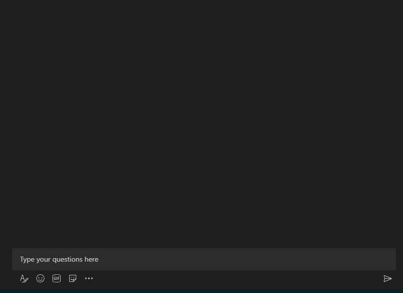

# Messaging-Erweiterungen

Messaging-Erweiterungen ermöglichen benutzern die Interaktion mit Ihrem Webdienst über Schaltflächen und Formulare im Microsoft Teams Client. Sie können Aktionen in einem externen System im Bereich zum Verfassen von Nachrichten, im Befehlsfeld oder direkt in einer Nachricht suchen oder initiieren. Sie können die Ergebnisse dieser Interaktion in Form einer rich-formatierten Karte an den Microsoft Teams Client zurücksenden. Dieses Dokument bietet eine Übersicht über die Messaging-Erweiterung, Aufgaben, die in verschiedenen Szenarien ausgeführt werden, das Arbeiten mit Messaging-Erweiterungen, Aktions- und Suchbefehle sowie die Verbreitung von Links.

In der folgenden Abbildung werden die Speicherorte angezeigt, von denen Messaging-Erweiterungen aufgerufen werden:

## Szenarien, in denen Messaging-Erweiterungen verwendet werden

| Szenario | Beispiel |
|:-----------------|:-----------------|
|Sie möchten, dass ein externes System eine Aktion ausführt und das Ergebnis der Aktion zurück an Ihre Unterhaltung gesendet wird.|Reservieren Sie eine Ressource, und ermöglichen Sie dem Kanal, das reservierte Zeitfenster zu kennen.|
|Sie möchten etwas in einem externen System finden und die Ergebnisse für die Unterhaltung freigeben.|Suchen Sie in Azure DevOps nach einer Arbeitsaufgabe, und geben Sie sie als adaptive Karte für die Gruppe frei.|
|Sie möchten eine komplexe Aufgabe mit mehreren Schritten oder vielen Informationen in einem externen System abschließen und die Ergebnisse mit einer Unterhaltung teilen.|Erstellen Sie einen Fehler in Ihrem Nachverfolgungssystem basierend auf einer Teams Nachricht, weisen Sie diesen Fehler Bob zu, und senden Sie eine Karte mit den Details des Fehlers an den Unterhaltungsthread.|

## Grundlegendes zur Funktionsweise von Messaging-Erweiterungen

Eine Messaging-Erweiterung besteht aus einem Webdienst, den Sie hosten, und einem App-Manifest, das definiert, von wo aus Ihr Webdienst im Microsoft Teams-Client aufgerufen wird. Der Webdienst nutzt das Messaging-Schema und das sichere Kommunikationsprotokoll des Bot-Frameworks, daher müssen Sie Ihren Webdienst als Bot im Bot Framework registrieren. 

> [!NOTE]
> Obwohl Sie den Webdienst manuell erstellen können, verwenden Sie [das Bot Framework SDK,](https://github.com/microsoft/botframework-sdk) um mit dem Protokoll zu arbeiten.

Im App-Manifest für Microsoft Teams App wird eine einzelne Messaging-Erweiterung mit bis zu zehn verschiedenen Befehlen definiert. Jeder Befehl definiert einen Typ, z. B. Aktion oder Suche und die Speicherorte im Client, von wo aus er aufgerufen wird. Die Aufrufspeicherorte sind Verfassen-Nachrichtenbereich, Befehlsleiste und Nachricht. Beim Aufrufen empfängt der Webdienst eine HTTPS-Nachricht mit einer JSON-Nutzlast, die alle relevanten Informationen enthält. Antworten Sie mit einer JSON-Nutzlast, sodass der Teams-Client die nächste zu aktivierende Interaktion kennen kann. 

## Typen von Messaging-Erweiterungsbefehlen

Es gibt zwei Arten von Messaging-Erweiterungsbefehlen: Aktionsbefehl und Suchbefehl. Der Befehlstyp der Messaging-Erweiterung definiert die Ui-Elemente und Interaktionsflüsse, die für Ihren Webdienst verfügbar sind. Einige Interaktionen, z. B. Authentifizierung und Konfiguration, sind für beide Befehlstypen verfügbar.

### Aktionsbefehle

Aktionsbefehle werden verwendet, um benutzern ein modales Popup anzuzeigen, um Informationen zu sammeln oder anzuzeigen. Wenn der Benutzer das Formular sendet, antwortet Ihr Webdienst, indem er eine Nachricht direkt in die Unterhaltung einfügt oder eine Nachricht in den Bereich zum Verfassen von Nachrichten einfügt. Danach kann der Benutzer die Nachricht übermitteln. Sie können mehrere Formulare für komplexere Workflows miteinander verketten.

Die Aktionsbefehle werden aus dem Bereich zum Verfassen von Nachrichten, aus dem Befehlsfeld oder aus einer Nachricht ausgelöst. Wenn der Befehl aus einer Nachricht aufgerufen wird, enthält die ursprüngliche JSON-Nutzlast, die an Ihren Bot gesendet wird, die gesamte Nachricht, von der aus er aufgerufen wurde. Die folgende Abbildung zeigt das Aktionsbefehls-Aufgabenmodul der 

### Suchbefehle

MitHilfe von Suchbefehlen können Benutzer ein externes System entweder manuell über ein Suchfeld oder durch Einfügen eines Links zu einer überwachten Domäne in den Bereich zum Verfassen von Nachrichten durchsuchen und die Ergebnisse der Suche in eine Nachricht einfügen. Im grundlegendsten Suchbefehlsfluss enthält die anfängliche Aufrufnachricht die Suchzeichenfolge, die der Benutzer übermittelt hat. Sie antworten mit einer Liste von Karten und Kartenvorschau. Der Teams-Client rendert eine Liste der Kartenvorschau für den Benutzer. Wenn der Benutzer eine Karte aus der Liste auswählt, wird die Karte in voller Größe in den Bereich zum Verfassen von Nachrichten eingefügt.

Die Karten werden aus dem Bereich zum Verfassen von Nachrichten oder dem Befehlsfeld ausgelöst und nicht von einer Nachricht ausgelöst. Sie können nicht von einer Nachricht ausgelöst werden.
In der folgenden Abbildung wird das Befehlsaufgabenmodul für die Messaging-Erweiterungssuche angezeigt:

> [!NOTE]
> Weitere Informationen zu Karten finden Sie unter ["Karten".](../task-modules-and-cards/what-are-cards.md)

## Verbreiten von Links

Ein Webdienst wird aufgerufen, wenn eine URL in den Bereich zum Verfassen von Nachrichten eingefügt wird. Diese Funktion wird als Verbreitung von Verknüpfungen bezeichnet. Sie können den Empfang eines Aufrufs abonnieren, wenn URLs, die eine bestimmte Domäne enthalten, in den Bereich zum Verfassen von Nachrichten eingefügt werden. Ihr Webdienst kann die URL in eine detaillierte Karte "entrollen", um mehr Informationen als die standardmäßige Websitevorschaukarte bereitzustellen. Sie können Schaltflächen hinzufügen, damit die Benutzer sofort Maßnahmen ergreifen können, ohne den Microsoft Teams Client verlassen zu müssen.
Die folgenden Bilder zeigen das Feature zum Aufheben von Links, wenn ein Link in die Messaging-Erweiterung eingefügt wird:
 

## Codebeispiel

| **Beispielname** | **Beschreibung** | **.NET** | **Node.js** | **Python** |
|------------|-------------|----------------|------------|
| Messaging-Erweiterung mit aktionsbasierten Befehlen | In diesem Beispiel wird veranschaulicht, wie Sie eine aktionsbasierte Messaging-Erweiterung erstellen. | [Anzeigen](https://github.com/microsoft/BotBuilder-Samples/tree/master/samples/csharp_dotnetcore/51.teams-messaging-extensions-action) | [Anzeigen](https://github.com/microsoft/BotBuilder-Samples/tree/master/samples/javascript_nodejs/51.teams-messaging-extensions-action) | [Anzeigen](https://github.com/microsoft/BotBuilder-Samples/tree/main/samples/python/51.teams-messaging-extensions-action) |
| Messaging-Erweiterung mit suchbasierten Befehlen | In diesem Beispiel wird veranschaulicht, wie Sie eine suchbasierte Messaging-Erweiterung erstellen. | [Anzeigen](https://github.com/microsoft/BotBuilder-Samples/tree/master/samples/csharp_dotnetcore/50.teams-messaging-extensions-search) | [Anzeigen](https://github.com/microsoft/BotBuilder-Samples/tree/master/samples/javascript_nodejs/50.teams-messaging-extensions-search) | [Anzeigen](https://github.com/microsoft/BotBuilder-Samples/tree/main/samples/python/50.teams-messaging-extension-search) |

## Siehe auch

[Erstellen einer Messaging-Erweiterung](../build-your-first-app/build-messaging-extension.md)

## Nächster Schritt

> [!div class="nextstepaction"]
> [Definieren des Befehls für die Messaging-Erweiterung für Aktionen](~/messaging-extensions/how-to/action-commands/define-action-command.md)

> [!div class="nextstepaction"]
> [Definieren des Befehls für die Messaging-Erweiterung für die Suche](~/messaging-extensions/how-to/search-commands/define-search-command.md)
