# App-Vorlagen für Microsoft Teams

App-Vorlagen sind Beispiele für vollständige Apps für Microsoft Teams, die Open Source sind und auf GitHub verfügbar sind. Jede App-Vorlage enthält ausführliche Anweisungen zum Bereitstellen und Installieren dieser App für Ihre Organisation. Es bietet auch eine Beispiel-App, die Sie installieren und sofort verwenden können. Der vollständige Quellcode ist ebenfalls verfügbar, mit dem Sie ihn im Detail untersuchen oder den Code ver forken und an Ihre spezifischen Anforderungen anpassen können.
Alle App-Vorlagen werden unter den [Mit-Lizenzbedingungen](https://github.com/OfficeDev/microsoft-teams-apps-eprescription/blob/master/LICENSE) bereitgestellt.
>[!NOTE] 
>Microsoft muss Apps, die aus Denkvorlagen für Ihre Benutzer und Organisationen erstellt wurden, nicht lizenz- und unterstützen.

**&#9734; Gibt neu veröffentlichte App-Vorlagen an.**

### Wichtige Vorteile

* **Direktes Bereitstellen in der Cloud:** Alle App-Vorlagen enthalten Bereitstellungsskripts, mit dem Sie alle erforderlichen Dienste in Microsoft Azure oder der Power Platform hosten können. 
* **Empfohlener Beispielcode:** Die App-Vorlagen entsprechen den empfohlenen bewährten Methoden für Sicherheit und Infrastruktur. Alle von der Community übermittelten Änderungen an den App-Vorlagen werden überprüft, um die Konformität sicherzustellen.
* **Anpassbar und erweiterbar:** Obwohl alle App-Vorlagen mit minimaler Konfiguration bereitgestellt werden können, stellen wir die gesamte Codebasis und Bereitstellungsskripts bereit, sodass Sie sie ganz einfach an Ihre individuellen Anforderungen anpassen oder erweitern können.
* **Ausführliche Dokumentation:** Alle App-Vorlagen werden von einer End-to-End-Dokumentation zu Lösungsarchitektur, Bereitstellung und Konfigurationsschritten begleitet.  

## Einführungsbot-&#9734;

Der Einführungsbot ist ein Chat-Bot, der mit Power Virtual Agent für Teams (PVA) erstellt wurde. Sie kann als die PVA-Version von FAQPlus betrachtet werden. Der Einführungsbot beantwortet mehr als 100 allgemeine Fragen zu Microsoft 365 und Teams. Sie können die enthaltenen Themen bearbeiten, eigene Themen hinzufügen und vorhandene häufig gestellte Fragen (FAQs) einlassen. Wenn Benutzer zusätzliche Hilfe benötigen, kann der Einführungsbot sie mit Experten verbinden oder sogar auf offene Servicetickets mit Premium-Flow-Connectors erweitert werden.

[Abrufen auf GitHub](https://github.com/OfficeDev/microsoft-teams-apps-adopt-bot)

## Termin-Manager-&#9734;

Der Terminmanager ist eine Teams-App-Vorlage, mit der Unternehmen virtuelle Termine mit Kunden über Teams erstellen, verwalten und durchführen können. Neue Terminanfragen von Kunden sind in den Teams-Kanälen sichtbar, wo sie schnell zugewiesen und Mitarbeitern in einem Team neu zugewiesen werden können. Terminanfragen können auf Team- oder persönlichen Ebenen über benutzerdefinierte Registerkarten angezeigt werden. Jeder Termin ist einer Onlinebe besprechung in Teams zugeordnet, daher können mitarbeiter und Verbraucher einfach zur geplanten Zeit an der Besprechung teilnehmen.

Die App-Vorlage wird zur einfachen Terminverwaltung in Microsoft Bookings integriert. Geplante Termine werden automatisch in den Kalendern der zugewiesenen Mitarbeiter angezeigt, und Benutzer erhalten anpassbare E-Mail-Benachrichtigungen und Erinnerungen mit eingebetteten Besprechungslinks.

[Abrufen auf GitHub](https://github.com/OfficeDev/microsoft-teams-apps-appointment-manager)

 

## Ask Away

"Ask Away" ist ein [Microsoft Teams-Bot,](../bots/what-are-bots.md) mit dem Benutzer Fragen&A (Frage und Antwort) in Teams durchführen können. Mithilfe des Bots "Abfragen" können Teammitglieder Von Kollegen geteilte Fragen übermitteln und abstimmen, sodass Q&A-Hosts ganz einfach die wichtigsten Fragen in einem Kanal oder Chat sammeln können. Der Bot kann verwendet werden, um eine Echtzeit-Frage-&einer Sitzung in einer Teams-Besprechung zu führen, und ermöglicht Teilnehmern, Fragen per Chat live zu übermitteln.

[Abrufen auf GitHub](https://github.com/OfficeDev/microsoft-teams-apps-askaway)

:::row:::
  :::column span="2":::
      
:::column-end:::
:::row-end:::

## Assoziierte Einblicke

Associate Insights ist eine [Power Apps-Vorlage,](/powerapps/maker/canvas-apps/embed-teams-app) mit der Mitarbeiter in Service und Service mitarbeiter direkt Kundenmeinungen, -stimmungen und -wahrnehmungen erfassen und übermitteln können. Mitarbeiter in Erstunternehmen sind häufig der erste Unternehmensmitarbeiter, der sich an einer 1:1-Kontaktstelle mit Kunden in Verbindung setzt. Die gesammelten Daten können gemeinsam von Geschäftsteams freigegeben und verwendet werden, z. B. über eine Power BI Teams-Registerkarte, um die Produktverbesserung zu verbessern und die Kundenerfahrung zu verbessern.

[Abrufen auf GitHub](https://github.com/OfficeDev/microsoft-teams-apps-associateinsights)

:::row:::
  :::column span="2":::
      
:::column-end:::
:::row-end:::
:::row:::
:::column span="2":::
    
:::column-end:::
:::row-end:::

## Anwesenheit

Die Anwesenheits-App ist [eine Power Apps-Registerkarte,](/powerapps/maker/canvas-apps/embed-teams-app) die in einem Team angeheftet werden kann. Es ist so konzipiert, dass Anwesenheitsdaten aufgezeichnet werden, in der Regel in Einstellungen wie z. B. Lern- und Schulungsumgebungen. Benutzer können die Teilnahme in der Vergangenheit bis zu 30 Tage lang markieren oder bearbeiten und zusammenfassende Anwesenheitsberichte für eine ganze Gruppe oder einzelne Teilnehmer anzeigen.

[Abrufen auf GitHub](https://github.com/OfficeDev/microsoft-teams-apps-attendance)

## Buch-a-Raum

Book-a-room ist ein [Microsoft Teams-Bot,](../bots/what-are-bots.md) mit dem Benutzer schnell einen Besprechungsraum für 30 (Standard), 60 oder 90 Minuten ab der aktuellen Uhrzeit finden und reservieren können. Der Bot "Buch-a-Raum" ist auf persönliche Unterhaltungen oder 1:1-Unterhaltungen begrenzt.

[Abrufen auf GitHub](https://github.com/OfficeDev/microsoft-teams-apps-bookaroom)

## Gebäudezugriff

Building Access ist eine Microsoft [Power Platform-basierte](https://powerapps.microsoft.com/blog/now-in-preview-customize-teams-with-built-in-power-platform-capabilities/)App, die die Verwaltung von Schwellenwerten für die Belegung von Belegungen und sozialen Distancing-Normen unterstützt, indem es Einrichtungsleitern ermöglicht wird, die Anwesenheit von Mitarbeitern vor Ort zu verwalten, nachzuververwalten und zu melden. Die App, die mit Microsoft [Power Apps](/powerapps/powerapps-overview)und [Power Automate](/power-automate/getting-started)erstellt wurde, ist tief in Microsoft Teams integriert und ermöglicht Es Organisationen, die Erstellungsbereitschaft zu bestimmen, Berechtigungskriterien für den Zugriff auf die Website festzulegen und Erkenntnisse für die zukünftige Planung zu sammeln.

[Abrufen auf GitHub](https://github.com/OfficeDev/microsoft-teams-apps-buildingaccess)

:::row:::
   :::column span="":::
     
   :::column-end:::
   :::column span="":::
      
   :::column-end:::
:::row-end:::

## Feiern

Bei Geburtstagen handelt es sich um eine Teams-App, die Teammitgliedern dabei hilft, ihre Geburtstage, Jubiläen und anderen wiederkehrenden Ereignisse miteinander zu vermischen. Er erinnert sich an besondere Anlässe aller Teammitglieder und sendet eine benutzerfreundliche Nachricht in allen Teams, die zum Zeitpunkt der Ereigniserstellung ausgewählt wurden, damit sich die Teammitglieder an ihrem Tag besonders fühlen.

Die App bietet eine einfache Schnittstelle für alle Teammitglieder, um ihre Ereignisse persönlich hinzuzufügen und zu sehen. Außerdem kann der Benutzer die Teams auswählen, in denen die Ereignisse freigegeben werden.

[Abrufen auf GitHub](https://github.com/OfficeDev/microsoft-teams-celebrations-app)

## Prüfliste

Die Prüfliste ist  eine benutzerdefinierte Microsoft Teams-Messaging-Erweiterungs-App, mit der Sie mit Ihrem Team zusammenarbeiten können, indem Sie eine freigegebene Prüfliste in einem Chat oder Kanal erstellen. Die App wird auf allen Microsoft Teams-Plattformclients unterstützt – Desktop, Browser, iOS und Android – und kann im Rahmen Ihres Microsoft 365-Abonnements zur Verfügung stehen.  

[Abrufen auf GitHub](https://github.com/OfficeDev/microsoft-teams-checklist-app )

:::row:::
:::column span="2":::
      
:::column-end:::
:::row-end:::

## Drop-In-&#9734;

Classroom Drop-in ist eine Microsoft [Power Platform-basierte](https://powerapps.microsoft.com/blog/now-in-preview-customize-teams-with-built-in-power-platform-capabilities/)App, mit der Systemleiter Kursteams (virtuelle Kursräume) finden und sich selbst oder andere für einen bestimmten Drop-In-Zeitraum zu diesen Kursteams hinzufügen können. Die App, die mit Microsoft [Power Apps](/powerapps/powerapps-overview) und [Power Automate](/power-automate/getting-started)erstellt wurde, ist tief in Microsoft Teams integriert, um sicherzustellen, dass Bildungseinrichtungen ihre Vorgänge in einer hybriden Lernumgebung optimieren können, indem sie den relevanten Beteiligten Zugriff für Kursteams nach geschäftlichen Anforderungen bietet.

[Abrufen auf GitHub](https://github.com/OfficeDev/microsoft-teams-apps-classroom-dropin)

## Unternehmens-Communicator

Die Unternehmens-Communicator-App ermöglicht Unternehmensteams das Erstellen und Senden von Nachrichten, die für mehrere Teams oder eine große Anzahl von Mitarbeitern im Chat vorgesehen sind, sodass die Organisation mitarbeiter direkt dort erreichen kann, wo sie zusammenarbeiten. Verwenden Sie diese Vorlage für mehrere Szenarien, z. B. Ankündigungen neuer Initiativen, Onboarding von Mitarbeitern, modernes Lernen und Entwicklung oder organisationsweite Übertragungen.

Die App bietet eine einfache Schnittstelle für designierte Benutzer zum Erstellen, Anzeigen einer Vorschau, Zusammenarbeit und Senden von Nachrichten.

Es bietet eine Grundlage für die Erstellung benutzerdefinierter gezielter Kommunikationsfunktionen wie benutzerdefinierte Telemetrie darüber, wie viele Benutzer eine Nachricht bestätigt oder mit dieser interagiert haben.

[Abrufen auf GitHub](https://github.com/OfficeDev/microsoft-teams-company-communicator-app)

## Kontaktgruppen-Nachschlage

Die Kontaktgruppen-Nachschlage-App bietet einen praktischen und nützlichen Ansatz zum Erstellen, Zugreifen auf und Verwalten der Kontaktgruppen Ihrer Organisation (früher als Verteilerlisten oder Kommunikationsgruppen bekannt). Benutzer können schnell Gruppenmitglieder anzeigen und chatten, den Mitgliederstatus anzeigen und einen Gruppenchat mit ausgewählten Mitgliedern in der Kontaktgruppe erstellen, und das alles innerhalb der Teams-Umgebung.

[Abrufen auf GitHub](https://github.com/OfficeDev/microsoft-teams-app-contactgrouplookup)

:::row:::
:::column span="2":::
      
:::column-end:::
:::row-end:::
:::row:::
:::column span="2":::
    
:::column-end:::
:::row-end:::

## Arbeitsverdingungs-&#9734;

Mithilfe der Vorlage "Arbeitskollegen" in Microsoft Teams können Benutzer die Erfolge ihrer Kollegen im Kontext von Teams erkennen. Wenn Kollegen einen Kollegen belohnen, werden Empfänger und andere Teammitglieder in einer Kanalgespräch gekennzeichnet und erhalten eine Benachrichtigung über die Preisdetails des Kanals. Die Preise werden in der Teams-App aufgezeichnet, die sicher, portabel und einfach gemeinsam verwendet werden kann. Dies kann als powerApps-basierte Version der Open Badges-App-Vorlage mit einer Bestenliste betrachtet werden.

[Abrufen auf GitHub](https://github.com/OfficeDev/microsoft-teams-apps-coworker-appreciation)

## CrowdSourcer

CrowdSourcer ist ein [Microsoft Teams-Bot,](../bots/what-are-bots.md) der teams abgefragte Informationen liefert, die gemeinsam von Gruppenmitgliedern stammen. Es ist eine hervorragende Möglichkeit, häufig gestellte Fragen zu beantworten, während Teilnehmer aktiv an einer hilfreichen Informationsressource mitwirken können.

[Abrufen auf Github](https://github.com/OfficeDev/microsoft-teams-crowdsourcer-app)

## Custom Stickers

Selbstausdruck ist der Kern einer gesunden Teamkultur. Diese App-Vorlage ist eine [Messaging-Erweiterung,](~/messaging-extensions/what-are-messaging-extensions.md) mit der Ihre Benutzer benutzerdefinierte Aufkleber und GIFs in Microsoft Teams verwenden können. Diese Vorlage bietet eine einfache webbasierte Konfigurationserfahrung, bei der jeder Benutzer mit Konfigurationszugriff die GIFs/Aufkleber/Bilder hochladen kann, die die Endbenutzer haben möchten, sodass Ihr gesamtes Team alle von Ihnen gewählten Aufkleber verwenden kann.

Diese App ermöglicht auch die einfache Freigabe von Bildern/GIFs/Aufklebern in Teams, ohne zugriff auf SharePoint-Websites oder einzelne Kanäle als Speicher- und Freigabemechanismen zu benötigen. Beispielsweise können Produktteams Produktbilder und GIFs ganz einfach programmgesteuert für soziale Medien, Marketing- und Vertriebsteams freigeben. Sie können diese App auch erweitern, indem sie einen Benachrichtigungsfluss für bestimmte Teams/Einzelpersonen auslöst, wenn neue Bilder/GIFs verfügbar gemacht werden.

[Abrufen auf GitHub](https://github.com/OfficeDev/microsoft-teams-stickers-app)

## Mitarbeiterideen &#9734;

Die App "Mitarbeiterideen" ist die PowerApps-Version der Azure-basierten App-Vorlage "Großartige Ideen". Mit der App können die Benutzer von Teams eine Ideenkampagne einrichten und konfigurieren. Eine Ideenkampagne ist eine Kategorie zum Gruppieren von Ideen zu gängigen Designs.

Benutzer von Teams können auch folgende Aktivitäten ausführen:
* Konfigurieren Sie ein Standardübermittlungsformular, das Mitarbeiter für jede Idee übermitteln müssen. 
* Überprüfen und verwalten Sie die Ideen und die Liste der Kampagnen.
* Ändern und Löschen von Kampagnen.
* Überprüfen Sie Die Bestenlisten mit Ideen.
* Stimmen Sie für priorisierte Ideen, und teilen Sie sie mit.
* Übermitteln Sie Ideen für eine Kampagne.
* Sehen Sie sich die Idee eines anderen Teammitglieds an.
* Stimmen Sie über die meisten "Gefällt mir"-Ideen ab.
* Überprüfen Sie die Leistung ihrer Ideen im Vergleich zu anderen in einer Kampagne.

[Abrufen auf GitHub](https://github.com/OfficeDev/microsoft-teams-apps-employeeideas)

 

## E-Prescriptions 

E-Prescriptions ist eine [Power Apps-basierte](/powerapps/maker/canvas-apps/embed-teams-app)App, die die Telemedikierung und die virtuelle Behandlung verbessert, indem der Prozess der Ausgabe von E-Rezepten für Patienten automatisiert wird. Medical professionals can quickly review appointments, generate e-prescriptions, and send emails with e-prescription attachments to patients directly within the Teams platform.

[Abrufen auf GitHub](https://github.com/OfficeDev/microsoft-teams-apps-eprescription) 

:::row:::
:::column span="2":::
      
:::column-end:::
:::row-end:::
:::row:::
:::column span="2":::
    
:::column-end:::
:::row-end:::

## Mitarbeiterschulung 

Mitarbeiterschulungen sind eine Microsoft Teams-App, die es Organisatoren ermöglicht, Lern- und Schulungsereignisse für Ihre Organisation einfach zu veröffentlichen, nachverfolgt und zu fördern.  Mit der App können Ereignisplaner Erinnerungen und Benachrichtigungen an Ereignisregistranten senden, und Mitarbeiter können Interesse an bevorstehenden Ereignissen anzeigen, über die Messaging-Erweiterung von Teams über aktuelle Ereignisse auf dem Laufenden bleiben und Ereignisdetails mit Kollegen teilen.

[Abrufen auf GitHub](https://github.com/OfficeDev/microsoft-teams-apps-employeetraining)

:::row:::
:::column span="2":::
    **Anzeigen von Schulungsereignissen für Mitarbeiter**   
:::column-end:::
:::row-end:::
:::row:::
:::column span="2":::
    **Mitarbeiterschulungsereignis erstellen** 
:::column-end:::
:::row-end:::

## Experten-Finder

Expert Finder ist ein [Microsoft Teams-Bot,](../bots/what-are-bots.md) der bestimmte Organisationsmitglieder basierend auf ihren Fähigkeiten, Interessen und Bildungsattributen identifiziert. Mitglieder finden Experten in einer Organisation, die einer Schlüsselwortsuche von Azure Active Directory-Benutzerprofilen entsprechen.

[Abrufen auf GitHub](https://github.com/OfficeDev/microsoft-teams-apps-expertfinder)

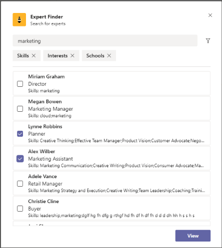

## FAQ Plus

Unterhaltungs-F&Bots sind eine einfache Möglichkeit, Antworten auf häufig gestellte Fragen von Benutzern zur Verfügung zu stellen. Die meisten Bots können sich jedoch nicht sinnvoll mit Benutzern in Verbindung stellen, da kein Benutzer in der Schleife ist, wenn der Bot ausfällt. Faq bot is a friendly Q&A bot that brings a human in the loop when it is unable to help. Einer kann dem Bot eine Frage stellen, und der Bot antwortet mit einer Antwort, wenn er in der Wissensdatenbank enthalten ist. Wenn nicht, ermöglicht der Bot dem Benutzer, eine Abfrage zu übermitteln, die dann an ein vorkonfiguriertes Expertenteam gesendet wird, das bei der Unterstützung hilft, indem er auf die Benachrichtigungen innerhalb des Teams selbst einwirken kann.

> [!NOTE]
> Die neueste Version von **FAQ Plus** unterstützt verbesserte Q&A-Lösungen, indem ein Expertenteam folgendes abschließen kann:
>
> &#x2714; Hinzufügen neuer Fragen&Direkt zur Wissensdatenbank mithilfe von Nachrichtenerweiterungen.
>
> &#x2714; Bearbeiten und Löschen von Q&A pairs, die von einem Bot hinzugefügt wurden.
>
> &#x2714; Verfolgen Des Revisionsverlaufs von Fragen&As.
>
> &#x2714; Konfigurieren Sie eine Antwort mit zusätzlichen Details, die als adaptive [Karte angezeigt werden.](../task-modules-and-cards/cards/cards-reference.md#adaptive-card)
>
[Abrufen auf GitHub](https://github.com/OfficeDev/microsoft-teams-apps-faqplusv2)

## Support-App-&#9734;

Die App "Support anfordern" kann von Organisationen verwendet werden, die Microsoft Teams verwenden, um allen Benutzern das Anfordern von Unterstützung durch Vorgesetzte zu ermöglichen. Diese App enthält verschiedene Features, z. B.:
-   Anfordern von Unterstützung für verschiedene Kategorien von einer Power App
-   Benachrichtigungen, die an Ansgeber gesendet werden und sie darüber informieren, wer zugewiesen wurde 
-   Benachrichtigungen, die an zugewiesene Vorgesetzte gesendet werden und sie darüber informieren, wer Unterstützung benötigt 
-   Analysieren von Eskalationen und Mustern in SharePoint und PowerBI

[Abrufen auf GitHub](https://github.com/OfficeDev/microsoft-teams-app-get-support/)

## Zielverfolgung

Die Zielverfolgungs-App ist eine umfassende Lösung für Ihre Organisation, um das Einrichten von Zielen, das Beobachten des Fortschritts und die Anerkennung des Erfolgs in Microsoft Teams zu unterstützen. Mit der App können Benutzer Ziele auf professioneller, persönlicher und Teamebene festlegen, nachverfolgen und aktualisieren. Teammitglieder erhalten außerdem zeitnahe Erinnerungen und Statusupdates, um konzentriert zu bleiben und auf dem neuesten Stand zu bleiben.

[Abrufen auf GitHub](https://github.com/OfficeDev/microsoft-teams-app-goaltracker)

:::row:::
  :::column span="2":::
    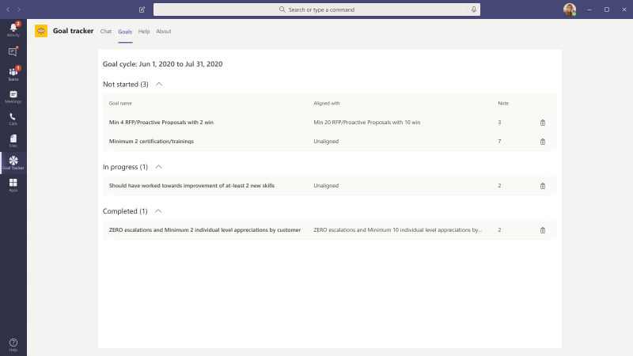  
:::column-end:::
:::row-end:::
:::row:::
:::column span="2":::
    
:::column-end:::
:::row-end:::

## Großartige Ideen

Die App "Großartige Ideen" unterstützt und fördert Innovation und Kreativität in Ihrer Organisation. Die App ermöglicht Es Ihren Mitarbeitern, Ideen mit Kollegen und Führungskräften auszutauschen, neue Übermittlungen zu entdecken, Beiträge zu Peers ins Blickpunkt zu stellen und ihre Stimme für die besten Vorschläge in Microsoft Teams zu geben.

[Abrufen auf GitHub](https://github.com/OfficeDev/microsoft-teams-apps-greatideas)

:::row:::
  :::column span="2":::
      
:::column-end:::
:::row-end:::
:::row:::
:::column span="2":::
    
:::column-end:::
:::row-end:::

## Gruppenaktivitäten

Gruppenaktivitäten ist eine Microsoft Teams-App, mit der Teambesitzer schnell Aktivitätsgruppen erstellen und Workflows für die Zusammenarbeit im Kontext von Microsoft Teams verwalten können. Aktivitätsautoren können Aktivitäten erstellen, Teammitglieder nach dem Zufallsprinzip in Gruppen verteilen und optional vom Bot Erinnerungen senden, bis die Aktivitäten abgeschlossen sind.

[Abrufen auf GitHub](https://github.com/OfficeDev/microsoft-teams-apps-groupactivities)

:::row:::
  :::column span="2":::
      
:::column-end:::
:::row-end:::
:::row:::
:::column span="2":::
    
:::column-end:::
:::row-end:::

## Erweitern Ihrer Fähigkeiten

Die App "Grow Your Skills" unterstützt das berufliche Wachstum und die Entwicklung, indem Mitarbeiter an ergänzenden Projekten für Ihre Organisation mit beitragen und gleichzeitig neue Fähigkeiten erlernen können. Mitarbeiter können die App verwenden, um Möglichkeiten zu finden, die ihren Interessen entsprechen, eine sinnvolle Zusammenarbeit mit Gleichgesinnten zu genießen und neue Fachkenntnisse und Funktionen in der Teams-Umgebung zu erwerben.

[Abrufen auf GitHub](https://github.com/OfficeDev/microsoft-teams-apps-growyourskills)

:::row:::
  :::column span="2":::
    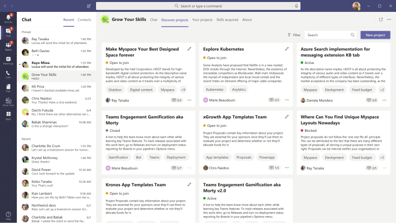  
:::column-end:::
:::row-end:::
:::row:::
:::column span="2":::
    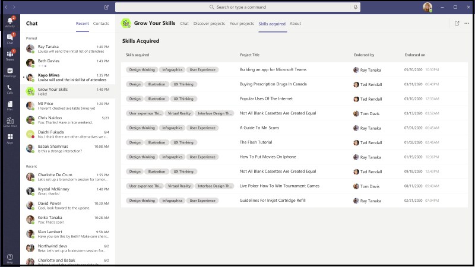
:::column-end:::
:::row-end:::

## HR Support

Hr Support Bot ist ein freundlicher Q&Ein Bot, der einen Supportexperten/Experten aus dem Personalteam in die Schleife bringt, wenn er nicht helfen kann. Einer kann dem Bot eine Frage stellen, und der Bot antwortet mit einer Antwort, wenn er in der Wissensdatenbank enthalten ist. Wenn nicht, ermöglicht der Bot dem Benutzer, eine Abfrage zu übermitteln, die dann in einem vorkonfigurierten Team von Experten veröffentlicht wird, die bei der Unterstützung helfen, indem er auf die Benachrichtigungen innerhalb des Teams selbst einwirken kann. Darüber hinaus schlägt der Bot Links zu empfohlenen Personalrichtlinien/Fragen vor, indem er nach vorkonfigurierten Tags in der Frage sucht. Diese Kacheln befinden sich auch auf der zugeordneten Registerkarte als Kurzübersicht. Der Personalsupport funktioniert gut für QnA mit geringem Gewicht und bietet schnellen Support beim Starten neuer Projekte/Initiativen in der Organisation.

[Abrufen auf GitHub](https://github.com/OfficeDev/microsoft-teams-hrsupport-app)

## Icebreaker

Icebreaker ist ein [Microsoft Teams-Bot,](../bots/what-are-bots.md) der Ihrem Team dabei hilft, sich näher zu kommen, indem es jede Woche zwei zufällige Teammitglieder zu treffen paart. Der Bot erleichtert die Planung, indem automatisch kostenlose Zeiten vorschlagen werden, die für beide Mitglieder funktionieren. Stärken Sie persönliche Verbindungen, und erstellen Sie mit dieser App eine enge Community.

Zusätzlich zur Förderung persönlicher Verbindungen im gesamten Team kann die Icebreaker-App dazu beitragen, interessenbasierte Communitys in Ihrer Organisation zu fördern. Beispielsweise können Sie diese App für eine DevOps-Interessengruppe verwenden, um Ideen und bewährte Methoden zu unterstützen, die organisch in Ihrer Organisation verteilt werden.

[Abrufen auf GitHub](https://github.com/OfficeDev/microsoft-teams-icebreaker-app)

## Incentives

Incentives ist eine [Power Apps-Vorlage,](/powerapps/maker/canvas-apps/embed-teams-app) die die Förderung der Beteiligung von Mitarbeitern an bestimmten Aktivitäten wie Schulungen und Änderungsmanagementaktivitäten verwaltet und verfolgt. Administratoren verwenden die App, um festgelegte Aktivitäten festzulegen, Punkte für den Abschluss zuzuordnen und erforderliche Berechtigungspunktstufen für Preise anzugeben. Mitarbeiter verwenden die App, um ihre gesammelten Punkte zu sehen und, wenn sie die Berechtigung erreicht haben, einlösbare Preise anfordert und in Anspruch zu bekommen.

[Abrufen auf GitHub](https://github.com/OfficeDev/microsoft-teams-apps-incentives)

## Incident Reporter

Incident Reporter ist ein [Microsoft Teams-Bot,](../bots/what-are-bots.md)  der die Verwaltung von Vorfällen in Ihrer Organisation optimiert. Der Bot erleichtert die automatisierte Vorfalldatenerfassung, angepasste Vorfallberichte, relevante Benachrichtigungen von Beteiligten und die End-to-End-Nachverfolgung von Vorfällen.

[Abrufen auf GitHub](https://github.com/OfficeDev/microsoft-teams-apps-incidentreport)

:::row:::
  :::column span="2":::
      
:::column-end:::
:::row-end:::
:::row:::
:::column span="2":::
    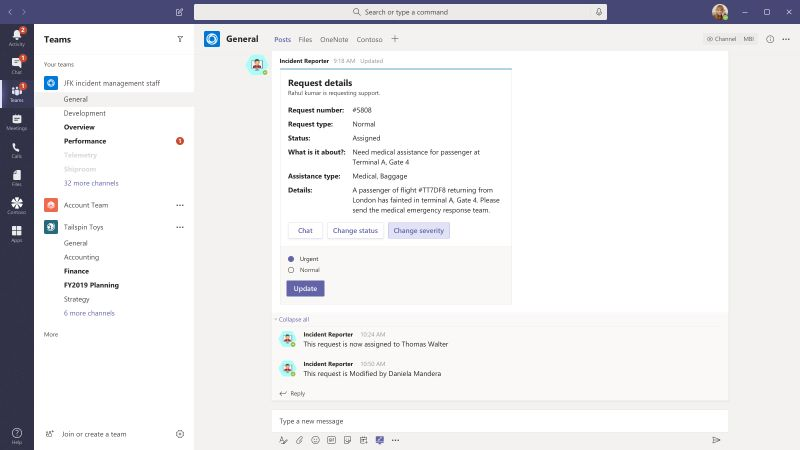
:::column-end:::
:::row-end:::

## &#9734;

 Bei der Überprüfung handelt es sich um eine Microsoft Teams-App, mit der Front-Line-Mitarbeiter alles von Standorten bis hin zu Ressourcen und Geräten überprüfen können. Beispiel: Einzelhandel, Produktionsbetrieb oder Autos und Maschinen. Es gibt zwei Apps in dieser Lösung, die jeweils für verschiedene Benutzertypen vorgesehen sind.

Die App ermöglicht es den Front-Line-Mitarbeitern, ein Objekt oder einen Bereich zu überprüfen, die Qualität von Produkten und Diensten zu verwalten oder die Sicherheit am Arbeitsplatz zu gewährleisten. Es erleichtert die Kommunikation zwischen Teammitgliedern, um während der Überprüfung gefundene Probleme zu beheben. Die App bietet einfachen Berichten für Manager, um die Problemlösung zu beschleunigen und Trends zu hervorheben.

[Abrufen auf GitHub](https://github.com/OfficeDev/microsoft-teams-apps-inspection)

   

## Problemberichterstattungsberichte &#9734;

Mit der App "Problemberichterstattung" können Mitarbeiter und Manager Probleme lösen und verwalten. Sie besteht aus zwei Apps, einer App für die Problemberichterstattung und der App "Probleme verwalten" zum Verwalten von Problemen.

Die Teammanager verwenden die App "Probleme verwalten", um die App zu konfigurieren, einschließlich des Kanals, in dem Microsoft Teams-Nachrichten und -Planner-Aufgaben von der App erstellt werden. Manager verwenden die App auch zum Erstellen von Vorlagenformularen, um Details zu sammeln, wenn ein Benutzer ein Problem meldet. Beispiel: Überprüfen, Bearbeiten oder Löschen von Formularen für Problemvorlagen. Die App kann auch verwendet werden, um Teamprobleme zu überprüfen, einen Bericht zum Problemverlauf zu erstellen und die Problemlösung effizient zu verwalten.

Die Mitarbeiter verwenden die App "Problemberichterstattung", um Probleme und Details zu protokollieren, die zur Behebung dieser Probleme erforderlich sind. Die App wird auch verwendet, um vorhandene Probleme zu ändern und zu beheben und eine hohe Ansicht von Einzel- oder Teamproblemen zu erhalten.

[Abrufen auf GitHub](https://github.com/OfficeDev/microsoft-teams-apps-issuereporting)

  

## Onboarding neuer Mitarbeiter 

Das Onboarding neuer Mitarbeiter ist eine integrierte Microsoft Teams- und [SharePoint New Employee Onboarding-Lösung,](https://lookbook.microsoft.com/details/75e60a32-9849-4ed4-b83e-b2b08983ad19) mit der Ihre Organisation eine konsistente, qualitativ hochwertige Onboardingerfahrung für Mitarbeiter auf ihrer Neueinstellungen-Reise bereitstellen kann. Die App kann von Personalteams und Einstellungsmanagern verwendet werden, um relevante Informationen während des Orientierungs- und Aufnahmeprozesses zur Verfügung zu stellen und von Neueinstellungen Feedback zu teilen, Einführungen zu geben und Onboardingaufgaben auszuführen.

[Abrufen auf GitHub](https://github.com/OfficeDev/microsoft-teams-apps-newemployeeonboarding)

:::row:::
  :::column span="2":::
    **Willkommenskarte für neue Mitarbeiter** 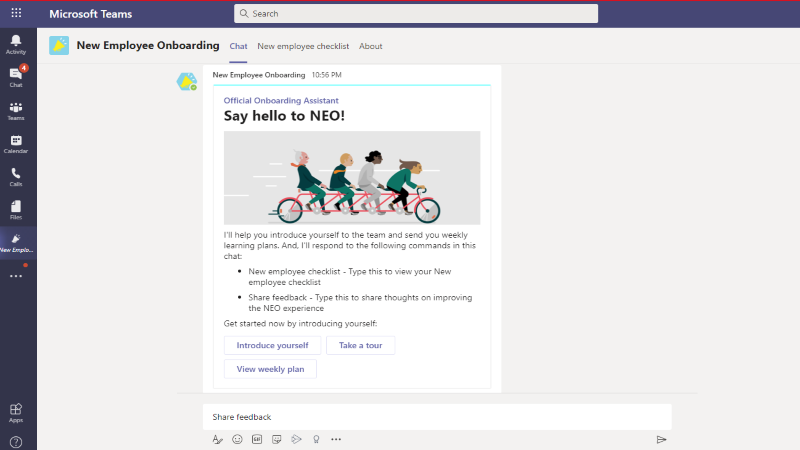
:::column-end:::
:::row-end:::
:::row:::
:::column span="2":::
    **Prüfliste für neue Mitarbeiter** 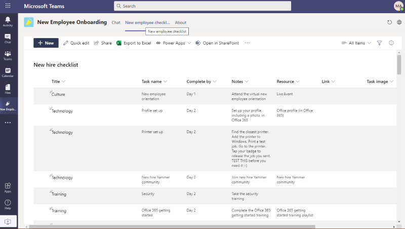  
:::column-end:::
:::row-end:::

## Offene Badges

"Offene Badges" ist eine Microsoft Teams-App, mit der Einzelpersonen digitale Lernanmeldeinformationen im Kontext von Teams erhalten und überall freigeben können. Mithilfe von Funktionen der Drittanbieterstelle für digitale Badges, [Badgr,](https://badgr.org/)werden vergebene Badges im Badgr-Profil eines Empfängers aufgezeichnet und stehen zur Verfügung, um ein umfassendes Bild der Lernerfahrungen während der gesamten Lebensdauer zu erstellen und zu teilen.

[Abrufen auf GitHub](https://github.com/OfficeDev/microsoft-teams-apps-openbadges)

:::row:::
  :::column span="2":::
      
:::column-end:::
:::row-end:::
:::row:::
:::column span="2":::
    
:::column-end:::
:::row-end:::

## Umfrage 

Bei "Umfrage"  handelt es sich um eine benutzerdefinierte Microsoft Teams-Messaging-Erweiterungs-App, mit der Sie schnell Umfragen in einem Chat oder kanal erstellen und senden können, um Die meinungs- und präferenzen des Teams zu sammeln. Die App wird auf allen Microsoft Teams-Plattformclients unterstützt – Desktop, Browser, iOS und Android – und kann im Rahmen Ihres Microsoft 365-Abonnements zur Verfügung stehen.

[Abrufen auf GitHub](https://github.com/OfficeDev/microsoft-teams-poll-app)

:::row:::
  :::column span="1":::
      
:::column-end:::
:::row-end:::

## Schnelle Antworten

Schnelle Antworten ist eine Microsoft Teams-App, die eine robuste Lösung für die effektive Beantwortung häufig gestellter Fragen (FAQs) der Benutzer bietet. Anstatt jede Abfrage manuell und fortlaufend wiederholte Informationen zu beantworten, erstellt die App eine Bibliothek mit Antworten für eine interaktive Benutzererfahrung über [Teams-Messaging-Erweiterungen.](../messaging-extensions/what-are-messaging-extensions.md)

[Abrufen auf GitHub](https://github.com/OfficeDev/microsoft-teams-apps-quickresponses)

## Rapid Assist &#9734;

Rapid Assist ist eine Microsoft [Power Platform-basierte](https://powerapps.microsoft.com/blog/now-in-preview-customize-teams-with-built-in-power-platform-capabilities/) App, mit der kundenorientierte Geschäftspartner schnell eine Verbindung mit den Experten herstellen können, um schnell Antworten zu erhalten, nach Informationen zu suchen, offene Anfragen zu verfolgen und Experten zu ermöglichen, Benachrichtigungen zu erhalten, um Schnellanrufe zu erhalten, um Fragen zu beantworten. Die App, die mit Microsoft [Power Apps](/powerapps/powerapps-overview) und [Power Automate](/power-automate/getting-started)erstellt wurde, ist tief in Microsoft Teams integriert, damit Organisationen problemlos Frontlinemitarbeiter mit Unternehmenskontakten verbinden können, um Kundenanfragen zu lösen und eine großartige Kundenerfahrung zu bieten. 

[Abrufen auf GitHub](https://github.com/OfficeDev/microsoft-teams-apps-rapid-assist)

:::row:::
   :::column span="":::
     
   :::column-end:::
   :::column span="":::
      
   :::column-end:::
:::row-end:::

## Spiegeln 

Reflect ist eine  benutzerdefinierte Microsoft Teams-Messaging-Erweiterungs-App, die ihren Teammitgliedern eine sichere und inklusive Ressource bietet, um den Zustand ihres gefühlsmäßigen Wohlbefindens mit Kollegen und/oder Gruppenleitern direkt in Teams zu teilen. Die App ist in Kanal-, Gruppen-, Besprechungs- und 1:1-Chats verfügbar, und die Eincheckantwort kann auf öffentlich, privat zu absender oder vollständig anonym festgelegt werden.

[Abrufen auf GitHub](https://github.com/OfficeDev/Microsoft-Teams-App-Reflect)

:::row:::
    :::column:::
    **Well-Being-Umfrage**
    
    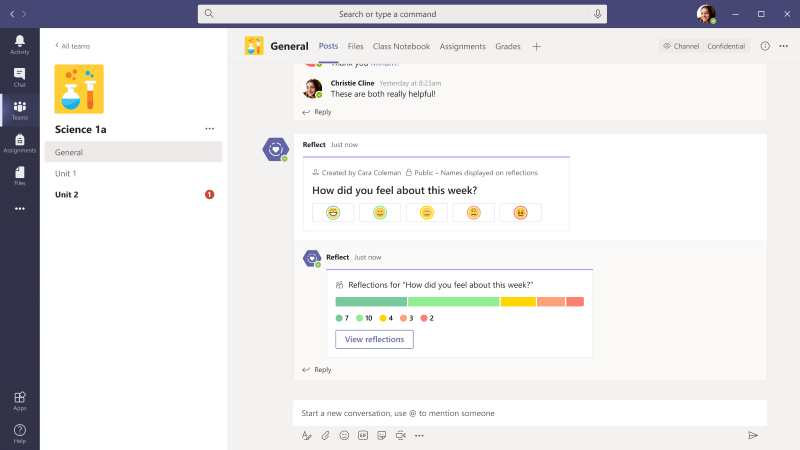
    :::column-end:::
:::row-end:::

## Remoteunterstützung

Remote support is a [Microsoft Teams bot](../bots/what-are-bots.md) that provides a focused interface between support requesters throughout your organization and the internal support team.  Endbenutzer können Supportanfragen übermitteln, bearbeiten oder zurückziehen, und das Supportteam kann alle Anfragen innerhalb der Teams-Plattform beantworten, verwalten und aktualisieren.

[Abrufen auf GitHub](https://github.com/OfficeDev/microsoft-teams-apps-remotesupport)

:::row:::
  :::column span="2":::
      
:::column-end:::
:::row-end:::
:::row:::
:::column span="2":::
    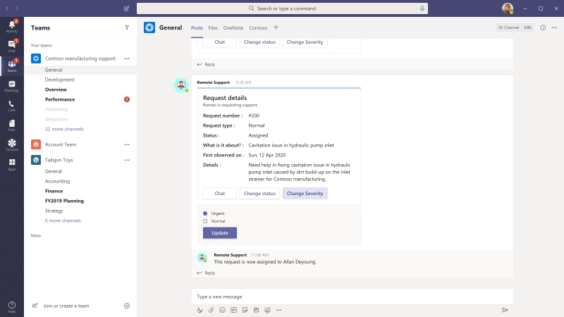
:::column-end:::
:::row-end:::

## Request-a-team

"Team anfordern" ist eine Microsoft Teams-App, die die Erstellung neuer Teams für Ihre Unternehmensorganisation optimiert. Die App unterstützt Standardisierung und bewährte Methoden beim Erstellen neuer Teaminstanzen durch die Integration eines assistentengesteuerten Anforderungsformulars, eines eingebetteten Genehmigungsprozesses, eines Anforderungsstatusdashboards und automatisierter Teambuilds.

[Abrufen auf GitHub](https://github.com/OfficeDev/microsoft-teams-apps-requestateam)

:::row:::
  :::column span="2":::
    
:::column-end:::
:::row-end:::
:::row:::
:::column span="2":::
    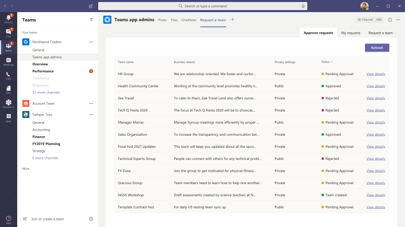
:::column-end:::
:::row-end:::

## Scrums für Kanäle

Scrums für Kanäle ist eine Scrum-Assistenten-App, mit der Benutzer Scrums in Kanälen in Microsoft Teams planen und ausführen können. Die App ist ideal für Remoteteams und Teams, die aus Mitgliedern aus verschiedenen geografischen Standorten und Zeitzonen bestehen, um tägliche Updates gemeinsam zu nutzen und die Teilnahme an besprechungsgesteuerten Stand-up-Besprechungen sicherzustellen.

[Abrufen auf GitHub](https://github.com/OfficeDev/microsoft-teams-apps-scrumsforchannels)

> [!NOTE]
> Informationen zum Durchführen von Scrumbesprechungen in einem Gruppenchat finden Sie in der [Appvorlage "Scrums für Gruppenchat".](#scrums-for-group-chat)

:::row:::
  :::column span="2":::
    
:::column-end:::
:::row-end:::
:::row:::
:::column span="2":::
    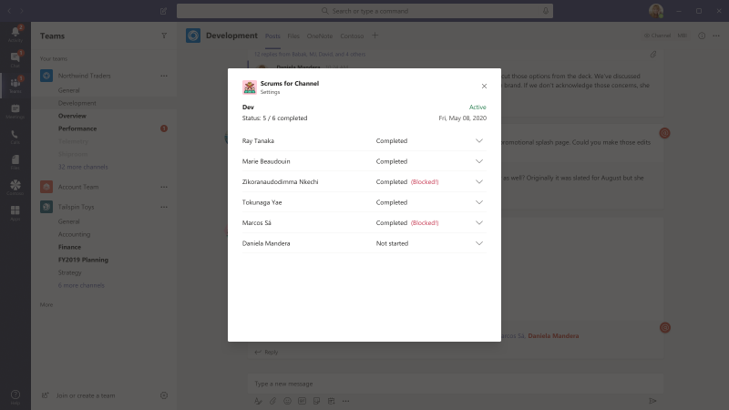
:::column-end:::
:::row-end:::

## Scrums für Gruppenchat

> [!NOTE]
> Die Vorlage "Scrums Status"-App wurde aktualisiert und heißt jetzt Scrums für Gruppenchat.

Scrums für Gruppenchat ist ein unterstützender Scrum-Assistent, mit dem Gruppenchatmitglieder asynchrone Stand-up-Besprechungen ausführen und ihre täglichen Updates problemlos freigeben können. Es ermöglicht allen Mitgliedern des Gruppenchats, zum Scrum beizutragen und die Von anderen im ausgeführten Scrum vorgenommenen Updates anzeigen.

[Abrufen auf GitHub](https://github.com/OfficeDev/microsoft-teams-apps-scrumsforgroupchat)

## Jetzt freigeben 

Die App "Jetzt freigeben" fördert den positiven Austausch von Informationen zwischen Kollegen, indem Ihren Benutzern das problemlose Freigeben von Inhalten in der Teams-Umgebung ermöglicht wird. Benutzer interagieren mit der App, um Fürsprecher mit Teammitgliedern zu teilen, neue freigegebene Inhalte zu entdecken, Einstellungen und Lesezeichenfavoriten zum späteren Lesen zu setzen.

[Abrufen auf GitHub](https://github.com/OfficeDev/microsoft-teams-apps-sharenow)

## SharePoint-Listensuche

Die Zusammenarbeit in Microsoft Teams verweist häufig auf Informationen, die in Elementen in einer SharePoint-Liste enthalten sind. Durch das einfache Einf?nen eines Links zu dem in Frage stehenden Element wird jeder dazu verf?ungen, den Kontext von der Unterhaltung weg zu wechseln, die erforderlichen Informationen zu finden und dann zu Teams zurückzukehren, um die Unterhaltung fortzufahren. Wenn die Unterhaltung fortgesetzt wird, müssen Die Benutzer in der Regel mehrmals zum Referenzelement wechseln, um neue Kommentare zu überprüfen und die darin enthaltenen Informationen zu aktualisieren. Dieser Kontextwechsel schafft eine Barriere für eine reibungslose Zusammenarbeit und ist ein Rezept für Dinge, die durch die Risse fallen.

Um diese Probleme zu entschärfung, freuen wir uns, Ihnen die App-Vorlage "Listensuche" zur Hilfe zu bringen. Millionen von Benutzern verwenden SharePoint, um einige der wichtigsten Workflows in ihren Organisationen zu unterstützen. Die Zusammenarbeit an Listen kann jedoch besonders mühsam sein. Mithilfe der Listensuche-App-Vorlage in Microsoft Teams können Benutzer Informationen aus SharePoint-Listenelementen direkt in eine Chat unterhaltung einfügen, um den Kontextwechsel zu mindern, der beim einfachen Einfügen eines Links in einen Chat verursacht wird. Die Informationen werden als leicht lesbare, automatisch formatierte Karte eingefügt, die Ihren Benutzern dabei hilft, an der Unterhaltung zu bleiben.

[Abrufen auf GitHub](https://github.com/OfficeDev/microsoft-teams-list-search-app)

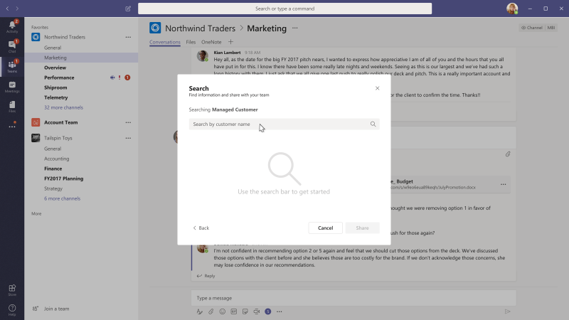

## Einchecken von Mitarbeitern

Bei Mitarbeiter-Check-Ins handelt es sich um eine [Power Apps-basierte](/powerapps/powerapps-overview)App, die die Aufsichtskommunikation zwischen Ihrem Geschäfts- und Außenpersonal ermöglicht. Mitarbeiter können auf einfache Weise zeitkritische Informationen und Statusaktualisierungen entweder geplant oder ad-hoc direkt aus Teams bereitstellen. Die App unterstützt Echtzeitspeicherort, Fotos und Notizen sowie Erinnerungsbenachrichtigungen und automatisierte Workflows.

[Abrufen auf GitHub](https://github.com/OfficeDev/microsoft-teams-apps-staffcheckins)

## Umfrage

Umfrage ist eine  benutzerdefinierte Microsoft Teams-Messaging-Erweiterungs-App, mit der Sie eine Umfrage in einem Chat oder kanal erstellen können, um Daten zu sammeln und umsetzbare Einblicke zu erhalten.  Die App wird auf allen Microsoft Teams-Plattformclients unterstützt – Desktop, Browser, iOS und Android – und kann im Rahmen Ihres Microsoft 365-Abonnements zur Verfügung stehen.  

[Abrufen auf GitHub](https://github.com/OfficeDev/Microsoft-Teams-Survey-app)

:::row:::
  :::column span="2":::
    
:::column-end:::
:::row-end:::

## Virtuelles Rundungs&#9734;

Krankenhaus- und Notaufnahmeanbieter nehmen Dutzende und häufig Hunderte von "Runden" pro Tag vor. Diese schnellen Einchecken für Patienten sollen eine Statusüberprüfung der Behandlung des Patienten ermöglichen und sicherstellen, dass die Bedenken des Patienten behoben werden. Die Rundung ist zwar eine wesentliche Methode, um sicherzustellen, dass Patienten von mehreren Anbietertypen überwacht werden, sie stellen jedoch einen großen Rücksfluss für die PPE dar, da für jeden Besuch von jedem Anbieter eine neue Maske und eine neue Gruppe von Patienten verwendet werden müssen. Mit diesen App-Vorlagen können Medizinischer Mitarbeiter über eine Microsoft Teams-Besprechung zwischen dem Anbieter und dem Patienten auf einfache Weise Runde durchführen.

Auf die virtuelle Rundungslösung wird auch im Microsoft Health and Life [Science-Blogbeitrag verwiesen.](https://aka.ms/teamsvirtualrounding)

[Abrufen auf GitHub](https://github.com/SmartterHealth/Virtual-Rounding)

## Besucherverwaltung

Mit der Besucherverwaltungs-App können Ihre Organisation und Ihre Mitarbeiter den Besucherprozess auf einfache und effiziente Weise direkt in Microsoft Teams verwalten. Die App ermöglicht Mitarbeitern das Erstellen von Besucheranfragen, das zentrale Nachverfolgen eines Anforderungsstatus über das Besucherdashboard und das Empfangen von Echtzeitbenachrichtigungen, wenn ein Besucher eintrifft.

[Abrufen auf GitHub](https://github.com/OfficeDev/microsoft-teams-app-visitormanagement)

:::row:::
  :::column span="2":::
    
:::column-end:::
:::row-end:::
:::row:::
:::column span="2":::
    
:::column-end:::
:::row-end:::

## Workplace Award

Workplace Award ist eine Teams-App-Vorlage, die einen positiven Rahmen bietet, um die Erkennung zu fördern und die Kultur der Anerkennung von Mitarbeitern am modernen Arbeitsplatz zu fördern. Mit der App können Sie ein R&R)-Programm einrichten und verwalten, bei dem Mitarbeiter Kollegen problemlos ernennen und unterstützen können und Ihr R&R-Leiter eingereichte Benennungen anzeigen, Preise gewähren und Empfänger ankündigen kann.

[Abrufen auf GitHub](https://github.com/OfficeDev/microsoft-teams-apps-workplaceawards)

:::row:::
  :::column span="2":::
    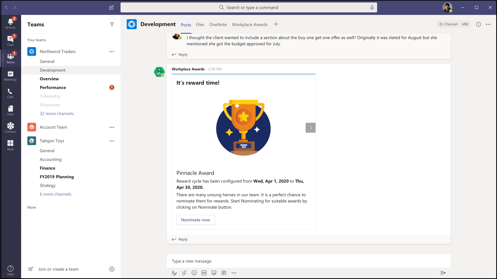
:::column-end:::
:::row-end:::
:::row:::
:::column span="2":::
    
:::column-end:::
:::row-end:::

Haben Sie eine Idee für eine App-Vorlage, die Sie sehen möchten? [Bitte teilen Sie uns dies mit.](https://forms.office.com/Pages/ResponsePage.aspx?id=v4j5cvGGr0GRqy180BHbR2_7qFm_lcZAr4eqEhnLsZ9UMVZGT1lCT0FXUDdZMUM0RkpBS1BESTAwWC4u)
