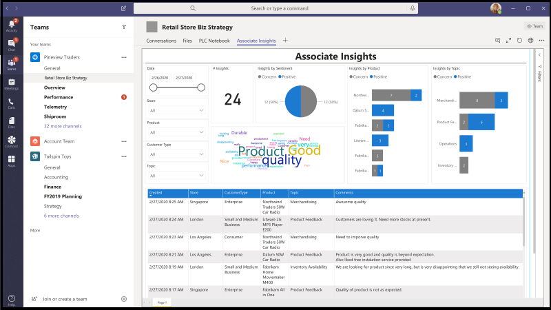
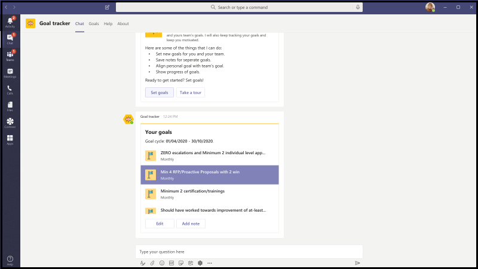

# App-Vorlagen für Microsoft TeamsApp templates for Microsoft Teams

App-Vorlagen sind Beispiele für vollständige Apps für Microsoft Teams, die Open Source sind und auf GitHub verfügbar sind.App templates are examples of complete apps for Microsoft Teams that are open-source and available on GitHub. Jede App-Vorlage enthält detaillierte Anweisungen für die Bereitstellung und Installation dieser App für Ihre Organisation.Each app template contains detailed instructions for deploying and installing that app for your organization. Außerdem wird eine Beispiel-App bereitgestellt, die Sie sofort installieren und verwenden können.It also provides a sample app that you can install and start using immediately. Der vollständige Quellcode ist ebenfalls verfügbar, sodass Sie ihn im Detail untersuchen oder den Code verzweigen und an Ihre spezifischen Anforderungen anpassen können.The complete source code is also available, which allows you to explore it in detail or fork the code and alter it to meet your specific requirements.
Alle App-Vorlagen werden unter den [MIT-Lizenzbedingungen](https://github.com/OfficeDev/microsoft-teams-apps-eprescription/blob/master/LICENSE) bereitgestellt.All app templates are provided under the [MIT License](https://github.com/OfficeDev/microsoft-teams-apps-eprescription/blob/master/LICENSE) terms.

> [!NOTE] 
> Sie müssen Apps, die aus App-Vorlagen für Ihre Benutzer und Organisationen erstellt wurden, lizenzieren und unterstützen.You must license and support apps created from app templates for your users and organizations.

**&#9734; Gibt neu veröffentlichte App-Vorlagen an.****&#9734; Indicates newly released app templates.**

### Wichtige VorteileKey benefits

* **Direkte Bereitstellung in der Cloud:** Alle App-Vorlagen enthalten Bereitstellungsskripts, mit denen Sie alle erforderlichen Dienste in Microsoft Azure oder der Power Platform hosten können.**Deploy directly to the cloud:** All app templates include deployment scripts that allows you to host all required services in Microsoft Azure or the Power Platform. 
* **Empfohlener Beispielcode:** Die App-Vorlagen entsprechen den empfohlenen bewährten Methoden für Sicherheit und Infrastruktur.**Recommended sample code:** The app templates conform to recommended best practices around security and infrastructure. Alle von der Community übermittelten Änderungen an den App-Vorlagen werden überprüft, um die Konformität sicherzustellen.All community submitted changes to the app templates are reviewed to ensure conformance.
* **Anpassbar und erweiterbar:** Während alle App-Vorlagen mit minimaler Konfiguration bereitgestellt werden, werden die gesamte Codebasis und Bereitstellungsskripts bereitgestellt, sodass Sie sie einfach anpassen oder an Ihre individuellen Anforderungen erweitern können.**Customizable and extensible:** While all app templates are deployed with minimal configuration, the entire code base and deployment scripts are provided, so that you can easily customize or extend them to fit your unique needs.
* **Ausführliche Dokumentation:** Alle App-Vorlagen werden von einer End-to-End-Dokumentation zu Lösungsarchitektur, Bereitstellung und Konfigurationsschritten begleitet.**Detailed documentation:** All app templates are accompanied by end-to-end documentation on solution architecture, deployment, and configuration steps.  

## Einführungs-BotAdoption Bot 

Adoption Bot ist ein Benutzer-Care-Chat-Bot, der mit Power Virtual Agent für Teams PVA erstellt wurde.Adoption Bot is a user care chat bot built with Power Virtual Agent for Teams PVA. Sie wird als PVA-Version von FAQ Plus betrachtet.It is considered as the PVA version of FAQ Plus. Adoption Bot beantwortet mehr als 100 allgemeine Fragen zu Microsoft 365 und Teams.Adoption Bot answers 100+ common questions about Microsoft 365 and Teams. Sie können die vorhandenen Themen bearbeiten, Eigene Themen hinzufügen und vorhandene HÄUFIG gestellte Fragen erfassen.You can edit the existing topics, add your own topics, and ingest existing FAQs. Wenn Benutzer zusätzliche Hilfe benötigen, kann der Einführungsbot sie mit Experten verbinden oder sogar auf offene Servicetickets mit Premium-Flow-Connectors erweitert werden.If users need additional help, Adoption Bot can connect them to experts or even be extended to open service tickets with premium flow connectors. Dieser Bot ist selbst installiert oder in eine benutzerdefinierte App integriert, z. B. den [Einführungshub.](https://github.com/akporzondek/adoption_hub)This bot is self-installed or built into a custom app, such as the [Adoption Hub](https://github.com/akporzondek/adoption_hub).

[Abrufen auf GitHubGet it on GitHub](https://github.com/OfficeDev/microsoft-teams-apps-adopt-bot)

## Einführungstool – Champion Management Platform &#9734;Adoption Tool- Champion Management Platform &#9734;

Die Vorlage der Champion Management Platform (CMP)-App hilft Ihnen, Ihre Teamarbeitspionier zu verwalten, zu skalieren und zu inspirieren, um mehr zu erreichen.The Champion Management Platform (CMP) app template helps you manage, scale, and inspire your teamwork champions to achieve more. Diese App-Vorlage basiert auf dem SharePoint-Framework und wird in eine Registerkarte innerhalb eines Teams geladen.This app template is built on the SharePoint Framework and loaded into a tab within a team. Gruppen können dieses Tool nutzen, um die Programmmitgliedschaft zu verwalten, eine Bestenliste und Ereignistypen für die Protokollierung bereitzustellen und Tools zum Überlagern digitaler Badges an Programmteilnehmer bereitzustellen.Groups can leverage this tool to help manage program membership, provide a leaderboard and event types for logging, and tools to overlay digital badges to program participants.

[Abrufen auf GitHubGet it on GitHub](https://github.com/OfficeDev/microsoft-teams-apps-champion-management)

## Einführungstool– Microsoft 365 Learning Pfade (Erste Schritte) &#9734;Adoption Tool- Microsoft 365 Learning Pathways (Get Started) &#9734;

Mit der Erste Schritte App-Vorlage können Sie die Leistungsfähigkeit Microsoft 365 Lernpfade innerhalb von Microsoft Teams nutzen.The Get Started app template allows you to bring the power of Microsoft 365 learning pathways inside of Microsoft Teams. Mit dieser App-Vorlage können Sie einfachen Zugriff auf bestimmte Schulungsseiten oder andere Intranetressourcen gewähren und die Inhalte direkt in Teams laden.This app template allows you to grant easy access to specific training pages or other intranet assets and load the content directly within Teams. Sie können den App-Namen oder das Logo auch so ändern, dass er ihrem Unternehmensbranding entspricht.You can also change the app name or logo to match your company branding.

[Abrufen auf GitHubGet it on GitHub](https://github.com/msft-teams/tools/tree/master/M365%20Learning%20Pathways)

## Termin-ManagerAppointment Manager 

Appointment Manager ist eine Teams App-Vorlage, die Unternehmen dabei unterstützt, virtuelle Termine mit Verbrauchern über Teams zu erstellen, zu verwalten und durchzuführen.Appointment Manager is a Teams app template to help businesses create, manage, and conduct virtual appointments with consumers through Teams. Neue Terminanfragen von Verbrauchern sind in Teams Kanälen sichtbar, wo sie schnell zugewiesen und mitarbeitern in einem Team zugewiesen werden.New appointment requests from consumers are visible in Teams channels, where they are quickly assigned and reassigned to staff in a team. Terminanfragen werden auf Team- oder persönlicher Ebene über benutzerdefinierte Registerkarten angezeigt.Appointment requests are viewed at team or personal levels through custom tabs. Jeder Termin ist mit einer Teams Onlinebesprechung verknüpft, daher können die Mitarbeiter und Verbraucher einfach zur geplanten Zeit an der Besprechung teilnehmen.Every appointment is associated with a Teams online meeting, hence the staff and consumers can easily join the meeting at the scheduled time.

Die App-Vorlage kann zur einfachen Terminverwaltung in Microsoft Bookings integriert werden.The app template integrates with Microsoft Bookings for easy appointment management. Geplante Termine werden automatisch in den Kalendern der zugewiesenen Mitarbeiter angezeigt, und Verbraucher erhalten anpassbare E-Mail-Benachrichtigungen und Erinnerungen mit eingebetteten Besprechungslinks.Scheduled appointments automatically appear on assigned staff members' calendars, and consumers receive customizable email notifications and reminders with embedded meeting links.

[Abrufen auf GitHubGet it on GitHub](https://github.com/OfficeDev/microsoft-teams-apps-appointment-manager)

 

## Ask AwayAsk Away

Ask Away ist ein [Microsoft Teams Bot,](../bots/what-are-bots.md) mit dem Benutzer Fragen und Antworten durchführen können, die als Q&A-Sitzungen innerhalb Teams bezeichnet werden.Ask Away is a [Microsoft Teams bot](../bots/what-are-bots.md) that enables users to conduct Question and Answer, called Q&A sessions within Teams. Mithilfe des Ask Away-Bots können Teammitglieder Fragen übermitteln und abstimmen, die von Kollegen geteilt werden, sodass Q&A-Hosts ganz einfach Fragen von höchster Qualität in einem Kanal oder Chat sammeln können.Using the Ask Away bot, team members can submit and up-vote questions shared by colleagues allowing Q&A hosts to easily gather top-of-mind questions within a channel or chat. Der Bot wird verwendet, um eine Echtzeit-Q-&A-Sitzung in einer Teams-Besprechung durchzuführen, und ermöglicht es Teilnehmern, Fragen live über den Chat zu übermitteln.The bot is used to conduct a real-time Q&A session in a Teams meeting and allows attendees to submit questions live through chat.

[Abrufen auf GitHubGet it on GitHub](https://github.com/OfficeDev/microsoft-teams-apps-askaway)

:::row:::
  :::column span="2":::
      
:::column-end:::
:::row-end:::

## Assoziierte EinblickeAssociate Insights

Associate Insights ist eine [Power Apps](/powerapps/maker/canvas-apps/embed-teams-app) Vorlage, die Mitarbeiter in Service und Produktion in die Lage versetzt, Kundenmeinungen, Ressentiments und Wahrnehmungen direkt zu erfassen und zu übermitteln.Associate Insights is a [Power Apps](/powerapps/maker/canvas-apps/embed-teams-app) template that empowers firstline workers to directly capture and submit customer opinion, sentiment, and perception. Mitarbeiter in Service und Produktion sind häufig der erste Mitarbeiter des Unternehmens, der mit Kunden an einem 1:1-Kontaktpunkt zusammenarbeiten kann.Firstline workers are often the first company representative to engage with customers in a one-to-one point-of contact. Die gesammelten Daten werden von Geschäftsteams gemeinsam genutzt und verwendet, z. B. über eine Power BI Teams Registerkarte, um die Produktverbesserung zu verbessern und die Benutzererfahrung zu verbessern.The collected data are shared and used collaboratively by business teams, such as through a Power BI Teams tab, for product improvement and enhancing the customer experience.

[Abrufen auf GitHubGet it on GitHub](https://github.com/OfficeDev/microsoft-teams-apps-associateinsights)

:::row:::
  :::column span="2":::
      
:::column-end:::
:::row-end:::
:::row:::
:::column span="2":::
    
:::column-end:::
:::row-end:::

## AnwesenheitAttendance

Die Anwesenheits-App ist eine [Power Apps](/powerapps/maker/canvas-apps/embed-teams-app) Registerkarte, die in einem Team angeheftet ist.The Attendance app is a [Power Apps](/powerapps/maker/canvas-apps/embed-teams-app) tab that are pinned in a team. Es wurde entwickelt, um Anwesenheitsinformationen in Einstellungen wie Lern- und Schulungsumgebungen zu erfassen.It is designed to record presence in settings, such as learning and training environments. Benutzer können die Teilnahme für bis zu 30 Tage in der Vergangenheit markieren oder bearbeiten und zusammengefasste Anwesenheitsberichte für eine ganze Gruppe oder einzelne Teilnehmer anzeigen.Users can mark or edit attendance for up to 30 days in the past and view summarized attendance reports for an entire group or individual attendees. Weitere Informationen zur Teilnahme an Teams finden Sie unter ["Abrufen" auf GitHub.](https://github.com/OfficeDev/microsoft-teams-apps-attendance)For more information on teams attendance, see [Get it on GitHub](https://github.com/OfficeDev/microsoft-teams-apps-attendance).

In der folgenden Abbildung wird die Demo der Anwesenheits-App angezeigt:The following image displays the attendance app demo:  

## Book-a-roomBook-a-room

"Book-a-room" ist ein [Microsoft Teams Bot,](../bots/what-are-bots.md) mit dem Benutzer schnell einen Besprechungsraum für 30, 60 oder 90 Minuten ab der aktuellen Zeit suchen und reservieren können.Book-a-room is a [Microsoft Teams bot](../bots/what-are-bots.md) that allows users quickly to find and reserve a meeting room for 30, 60, or 90 minutes starting from the current time. Die Standardzeit beträgt 30 Minuten.The default time is 30 minutes. Der Book-a-Room-Bot umfasst persönliche oder 1:1-Unterhaltungen.The Book-a-room bot scopes to personal or 1:1 conversations. Weitere Informationen zur Book-a-Room-App finden Sie unter ["Get it on GitHub."](https://github.com/OfficeDev/microsoft-teams-apps-bookaroom)For more information on Book-a-room app, see [Get it on GitHub](https://github.com/OfficeDev/microsoft-teams-apps-bookaroom).  
In der folgenden Abbildung wird die Demo "Book-a-room" angezeigt:The following image displays the Book-a-room demo:

## GebäudezugriffBuilding Access

Building Access ist eine Microsoft [Power Platform-basierte](https://powerapps.microsoft.com/blog/now-in-preview-customize-teams-with-built-in-power-platform-capabilities/) App, die die Verwaltung von Schwellenwerten für die Erstellung von Sicherheitslücken und sozialen Abgrenzungsnormen unterstützt, indem Es Einrichtungen-Directors ermöglicht, die Anwesenheit von Mitarbeitern vor Ort zu verwalten, nachzuverfolgen und zu melden.Building Access is a Microsoft [Power Platform](https://powerapps.microsoft.com/blog/now-in-preview-customize-teams-with-built-in-power-platform-capabilities/) based app that supports the administration of building occupancy thresholds and social distancing norms by enabling facilities directors to manage, track, and report employee on-site presence. Die App, die mit Microsoft [Power Apps](/powerapps/powerapps-overview)und [Power Automate](/power-automate/getting-started)erstellt wurde, ist tief in Microsoft Teams integriert und ermöglicht Es Organisationen, die Bereitschaft zum Aufbau zu bestimmen, Berechtigungskriterien für den Zugriff vor Ort festzulegen und Einblicke für die zukünftige Planung zu sammeln.The app, built using Microsoft [Power Apps](/powerapps/powerapps-overview), and [Power Automate](/power-automate/getting-started), deeply integrates with Microsoft Teams and enables organizations to determine building readiness, establish eligibility criteria for on-site access, and gather insights for future planning.

[Abrufen auf GitHubGet it on GitHub](https://github.com/OfficeDev/microsoft-teams-apps-buildingaccess)

:::row:::
   :::column span="":::
     
   :::column-end:::
   :::column span="":::
      
   :::column-end:::
:::row-end:::

## FeiernCelebrations

Es handelt sich um eine Teams-App, die Teammitgliedern dabei hilft, ihre Geburtstage, Jahrestage und andere wiederkehrende Ereignisse zu begehen.Celebrations is a Teams app that helps team members to celebrate each others' birthdays, anniversaries, and other recurring events. Es erinnert sich an besondere Gelegenheiten aller Teammitglieder und sendet eine freundliche Nachricht in allen Teams, die zum Zeitpunkt der Ereigniserstellung ausgewählt wurden, damit die Teammitglieder sich an ihrem Tag besonders fühlen.It remembers special occasions of all the team members and sends a friendly message in all the teams selected at the time of event creation, to make the team members feel special on their day.

Die App bietet allen Teammitgliedern eine einfache Benutzeroberfläche zum persönlichen Hinzufügen und Anzeigen ihrer Ereignisse und ermöglicht es dem Benutzer, die Teams auszuwählen, in denen die Ereignisse freigegeben werden.The app provides an easy interface for all the team members to personally add and view their events and also allows the user to select the teams in which the events gets shared.

[Abrufen auf GitHubGet it on GitHub](https://github.com/OfficeDev/microsoft-teams-celebrations-app)

## ChecklisteChecklist

Prüfliste ist eine benutzerdefinierte Microsoft Teams [Messaging-Erweiterungs-App,](../messaging-extensions/what-are-messaging-extensions.md) mit der Sie mit Ihrem Team zusammenarbeiten können, indem Sie eine freigegebene Checkliste in einem Chat oder Kanal erstellen.Checklist is a custom Microsoft Teams [messaging extension](../messaging-extensions/what-are-messaging-extensions.md) app that enables you to collaborate with your team by creating a shared checklist in a chat or channel. Die App wird auf allen Teams Plattformclients unterstützt, z. B. Desktopbrowser, iOS und Android.The app is supported across all Teams platform clients, such as desktop browser, iOS, and Android. Die App ist bereit für die Bereitstellung als Teil Ihres Microsoft 365-Abonnements.The app is ready for deployment as part of your Microsoft 365 subscription.  

[Abrufen auf GitHubGet it on GitHub](https://github.com/OfficeDev/microsoft-teams-checklist-app)

:::row:::
:::column span="2":::
      
:::column-end:::
:::row-end:::

## Kursraum-Drop-InClassroom Drop-in 

Classroom Drop-in ist eine Microsoft [Power Platform-basierte](https://powerapps.microsoft.com/blog/now-in-preview-customize-teams-with-built-in-power-platform-capabilities/)App, die Es Systemleitern ermöglicht, Kursteams zu finden, bedeutet virtuelle Kursräume und sich selbst oder andere zu diesen Kursteams für einen bestimmten Drop-In-Zeitraum hinzuzufügen, je nach Bedarf.Classroom Drop-in is a Microsoft [Power Platform](https://powerapps.microsoft.com/blog/now-in-preview-customize-teams-with-built-in-power-platform-capabilities/)-based app that enables system leaders to find class teams, means virtual classrooms and add themselves or others to these class teams for a specified drop-in period, as needed. Die App, die mit Microsoft [Power Apps](/powerapps/powerapps-overview) und [Power Automate](/power-automate/getting-started)erstellt wurde, ist tief in Microsoft Teams integriert, um sicherzustellen, dass Bildungseinrichtung ihre Vorgänge in einer hybriden Lernumgebung optimieren kann, indem sie den Zugriff auf relevante Projektbeteiligten für Kursteams gemäß den Geschäftsanforderungen ermöglicht.The app built using Microsoft [Power Apps](/powerapps/powerapps-overview) and [Power Automate](/power-automate/getting-started), deeply integrates with Microsoft Teams to ensure educational institutes can optimize their operations in a hybrid learning environment by providing access to relevant stakeholders for class teams per business requirements.

[Abrufen auf GitHubGet it on GitHub](https://github.com/OfficeDev/microsoft-teams-apps-classroom-dropin)

## Unternehmens-CommunicatorCompany Communicator

Die Unternehmens-Communicator-App ermöglicht es Unternehmensteams, Nachrichten zu erstellen und zu senden, die für mehrere Teams oder eine große Anzahl von Mitarbeitern per Chat vorgesehen sind, sodass die Organisation Mitarbeiter direkt dort erreichen kann, wo sie zusammenarbeiten.The Company Communicator app enables corporate teams to create and send messages intended for multiple teams or large number of employees over chat allowing organization to reach employees right where they collaborate. Nutzen Sie diese Vorlage für mehrere Szenarien, z. B. Ankündigungen neuer Initiativen, Mitarbeiter-Onboarding, modernes Lernen und Entwicklung oder organisationsweite Übertragungen.Utilize this template for multiple scenarios such as new initiative announcements, employee onboarding, modern learning, and development or organization-wide broadcasts.

Die App bietet eine einfache Benutzeroberfläche für festgelegte Benutzer zum Erstellen, Anzeigen einer Vorschau, Zusammenarbeit und Senden von Nachrichten.The app provides an easy interface for designated users to create, preview, collaborate and send messages.

Es bietet eine Grundlage zum Erstellen von benutzerdefinierten, gezielten Kommunikationsfunktionen, z. B. benutzerdefinierte Telemetrie darüber, wie viele Benutzer eine Nachricht bestätigt oder mit dieser interagiert haben.It provides a foundation to build custom targeted communication capabilities such as custom telemetry on how many users acknowledged or interacted with a message.

[Abrufen auf GitHubGet it on GitHub](https://github.com/OfficeDev/microsoft-teams-company-communicator-app)

## Kontaktgruppen-NachschlagevorgangContact Group Lookup

Die Kontaktgruppen-Nachschlage-App bietet einen praktischen und nützlichen Ansatz zum Erstellen, Zugreifen und Verwalten der Kontaktgruppen Ihrer Organisation, die früher als Verteilerlisten oder Kommunikationsgruppen bezeichnet wurden.The Contact Group Lookup app provides a convenient and useful approach to creating, accessing, and managing your organization's contact groups, formerly known as distribution lists or communication groups. Benutzer können schnell Gruppenmitglieder anzeigen und mit ihnen chatten, den Mitgliederstatus anzeigen und einen Gruppenchat mit ausgewählten Mitgliedern in der Kontaktgruppe erstellen, alles innerhalb der Teams Umgebung.Users can quickly view and chat with group members, view member status, and create a group chat with selected members in the contact group, all within the Teams environment.

[Abrufen auf GitHubGet it on GitHub](https://github.com/OfficeDev/microsoft-teams-app-contactgrouplookup)

:::row:::
:::column span="2":::
      
:::column-end:::
:::row-end:::
:::row:::
:::column span="2":::
    
:::column-end:::
:::row-end:::

## Kollegen ( Co-Worker- Und Arbeitskraft)Co-worker Appreciation 

Mithilfe der Vorlage "Mitarbeiterarbeitshilfe" in Microsoft Teams können Benutzer die Erfolge ihrer Kollegen im Kontext der Teams erkennen.Using the co-worker appreciation template in Microsoft Teams, users can recognize their colleagues' achievements within the Teams’ context. Wenn Kollegen auswählen, einen Kollegen zu beloben, werden Empfänger und andere Teammitglieder in einer Kanalunterhaltung markiert und erhalten eine Benachrichtigung über die Preisdetails des Kanals.When co-workers select to reward a colleague, recipients and other team members are tagged in a channel conversation and they receive a notification about the channel's award details. Die Preise werden in der Teams-App aufgezeichnet, die sicher, portierbar und leicht freigabefähig ist.The awards are recorded in the Teams app, which is secure, portable, and easily shareable. Dies wird als die PowerApps-basierte Version der Open Badges-App-Vorlage mit einer Bestenliste betrachtet.This is considered as the PowerApps based version of the Open Badges app template, with a leaderboard.

[Abrufen auf GitHubGet it on GitHub](https://github.com/OfficeDev/microsoft-teams-apps-coworker-appreciation)

## CrowdSourcerCrowdSourcer

CrowdSourcer ist ein [Microsoft Teams Bot,](../bots/what-are-bots.md) der teams abgefragte Informationen bereitstellt, die gemeinsam von Gruppenmitgliedern stammen.CrowdSourcer is a [Microsoft Teams bot](../bots/what-are-bots.md) that gives teams queried information sourced collaboratively from group members. Es hilft ihnen, häufig gestellte Fragen zu beantworten und den Teilnehmern zu ermöglichen, sich aktiv zu engagieren und zu einer interessanten und hilfreichen Informationsressource beizutragen.It helps to answer frequently asked questions while enabling participants to actively engage in and contribute to a fun and helpful information resource.

[Abrufen auf GitHubGet it on Github](https://github.com/OfficeDev/microsoft-teams-crowdsourcer-app)

## Custom StickersCustom Stickers

Self-Expression ist der Kern einer fehlerfreien Teamkultur.Self-expression is core to a healthy team culture. Diese App-Vorlage ist eine [Messaging-Erweiterung,](~/messaging-extensions/what-are-messaging-extensions.md) mit der Ihre Benutzer benutzerdefinierte Aufkleber und GIFs innerhalb Microsoft Teams verwenden können.This app template is a [messaging extension](~/messaging-extensions/what-are-messaging-extensions.md) that enables your users to use custom stickers and GIFs within Microsoft Teams. Diese Vorlage bietet eine einfache webbasierte Konfigurationsumgebung, bei der jeder Benutzer mit Konfigurationszugriff gifs, Aufkleber und Bilder hochladen kann, die seine Benutzer haben sollen, sodass Ihr gesamtes Team eine beliebige Gruppe von Stickern verwenden kann.This template provides an easy web-based configuration experience where anyone with configuration access can upload the GIFs, stickers, and images they want their users to have, allowing your entire team to use any set of stickers you choose.

Diese App ermöglicht auch die einfache Freigabe von Bildern, GIFs und Aufklebern in teamsweit, ohne zugriff auf SharePoint Websites oder einzelne Kanäle als Speicher- und Freigabemechanismen zu benötigen.This app also enables easy sharing of images, GIFs, stickers across teams without needing access to SharePoint sites or individual channels as storage and sharing mechanisms. Beispielsweise können Produktteams ganz einfach Produktbilder und GIFs programmgesteuert für Soziale Medien, Marketing und Vertriebsteams freigeben.For example, product teams can easily share product images and GIFs to social media, marketing, and sales teams programmatically. Sie können diese App auch erweitern, indem sie einen Benachrichtigungsfluss für bestimmte Teams oder Einzelpersonen auslöst, wenn neue Bilder und GIFs verfügbar gemacht werden.One can also extend this app by triggering a notification flow to specific teams or individuals when new images, and GIFs are made available.

[Abrufen auf GitHubGet it on GitHub](https://github.com/OfficeDev/microsoft-teams-stickers-app)

## Ideen für MitarbeiterEmployee Ideas

Die App "Mitarbeiterideen" ist die PowerApps-Version der Azure-basierten App-Vorlage "Großartige Ideen".The Employee Ideas app is the PowerApps version of the Azure based Great Ideas app template. Die App ermöglicht es den Teams Benutzern, eine Ideenkampagne einzurichten und zu konfigurieren.The app enables the Teams users to set up and configure an idea campaign. Eine Ideenkampagne ist eine Kategorie zum Gruppieren von Ideen zu allgemeinen Designs.An idea campaign is a category for grouping ideas around common themes.

Teams Benutzer können auch die folgenden Aktivitäten ausführen:Teams users can also perform the following activities:

* Konfigurieren Sie ein Standardübermittlungsformular, das Mitarbeiter für jede Idee übermitteln müssen.Configure a standard submission form that employees must submit for each idea. 
* Überprüfen und verwalten Sie die Ideen und die Liste der Kampagnen.Review and manage the ideas and list of campaigns.
* Ändern und Löschen von Kampagnen.Modify and delete campaigns.
* Überprüfen Sie die Ideen der Leiter.Review leader boards of ideas.
* Stimmen Sie für priorisierte Ideen, und teilen Sie sie.Vote for and share prioritized ideas.
* Übermitteln von Ideen für eine Kampagne.Submit ideas for a campaign.
* Sehen Sie sich die Idee eines anderen Teammitglieds an.View other team member's idea.
* Stimmen Sie über die am häufigsten verwendeten Ideen ab.Vote on most liked ideas.
* Überprüfen Sie die Leistung ihrer Ideen im Vergleich zu anderen innerhalb einer Kampagne.Review the performance of their ideas compared with others within a campaign.

[Abrufen auf GitHubGet it on GitHub](https://github.com/OfficeDev/microsoft-teams-apps-employeeideas)

 

## E-RezepturenE-Prescriptions 

E-Behandlungen ist eine [Power Apps-basierte](/powerapps/maker/canvas-apps/embed-teams-app) App, die Telemedikamente und virtuelle Pflege verbessert, indem der Prozess der Ausgabe von E-Rezepten für Patienten automatisiert wird.E-Prescriptions is a [Power Apps](/powerapps/maker/canvas-apps/embed-teams-app) based app that enhances telemedicine and virtual care by automating the process of issuing e-prescriptions to patients. Medizinische Experten können Termine schnell überprüfen, E-Mails generieren und E-Mails mit E-Mails an Patienten direkt innerhalb der Teams-Plattform senden.Medical professionals can quickly review appointments, generate e-prescriptions, and send emails with e-prescription attachments to patients directly within the Teams platform.

[Abrufen auf GitHubGet it on GitHub](https://github.com/OfficeDev/microsoft-teams-apps-eprescription) 

:::row:::
:::column span="2":::
      
:::column-end:::
:::row-end:::
:::row:::
:::column span="2":::
    
:::column-end:::
:::row-end:::

## MitarbeiterschulungEmployee Training 

Die Mitarbeiterschulung ist eine Microsoft Teams-App, mit der Organisatoren Lern- und Schulungsereignisse für Ihre Organisation auf einfache Weise veröffentlichen, nachverfolgen und bewerben können.Employee training is a Microsoft Teams app that enables organizers to easily publish, track, and promote learning and training events for your organization.  Mit der App können Ereignisplaner Erinnerungen und Benachrichtigungen an Ereignisempfänger senden, und Mitarbeiter können auf Interesse an bevorstehenden Ereignissen hinweisen, über aktuelle Ereignisse auf dem Laufenden bleiben und Ereignisdetails mit Kollegen über die Teams Messaging-Erweiterung teilen.With the app, event planners can send reminders and notifications to event registrants and employees can indicate interest in upcoming events, stay updated on current events, and share event details with colleagues through the Teams messaging extension.

[Abrufen auf GitHubGet it on GitHub](https://github.com/OfficeDev/microsoft-teams-apps-employeetraining)

:::row:::
:::column span="2":::
    **Anzeigen von Schulungsereignissen** **View employee training events**   
:::column-end:::
:::row-end:::
:::row:::
:::column span="2":::
    **Erstellen eines Mitarbeiterschulungsereignisses** **Create employee training event** 
:::column-end:::
:::row-end:::

## ExpertensucheExpert Finder

Expert Finder ist ein [Microsoft Teams Bot,](../bots/what-are-bots.md) der bestimmte Organisationsmitglieder basierend auf ihren Fähigkeiten, Interessen und Bildungsattributen identifiziert.Expert Finder is a [Microsoft Teams bot](../bots/what-are-bots.md) that identifies specific organization members based on their skills, interests, and education attributes. Mitglieder finden Experten innerhalb einer Organisation, die mit einer Stichwortsuche von Azure Active Directory Benutzerprofilen übereinstimmen.Members find experts within an organization that match a keyword search of Azure Active Directory user profiles.

[Abrufen auf GitHubGet it on GitHub](https://github.com/OfficeDev/microsoft-teams-apps-expertfinder)

## FAQ PlusFAQ Plus

Unterhaltungs-F&A-Bots sind eine einfache Möglichkeit, Antworten auf häufig gestellte Fragen von Benutzern bereitzustellen.Conversational Q&A bots are an easy way to provide answers to frequently asked questions by users. Die meisten Bots können jedoch nicht auf sinnvolle Weise mit Benutzern interagieren, da sich kein Menschen in der Schleife befindet, wenn der Bot fehlschlägt.But, most bots fail to engage with users in meaningful way because there is no human in the loop when the bot fails. Faq bot is a friendly Q&A bot that brings a human in the loop when it is unable to help.FAQ bot is a friendly Q&A bot that brings a human in the loop when it is unable to help. Man kann dem Bot eine Frage stellen, und der Bot antwortet mit einer Antwort, wenn er in der Wissensdatenbank enthalten ist.One can ask the bot a question and the bot responds with an answer if it is contained in the knowledge base. Wenn dies nicht der Fall ist, ermöglicht der Bot dem Benutzer, eine Abfrage zu übermitteln, die dann in ein vorkonfiguriertes Team von Experten gepostet wird, die zur Unterstützung beitragen, indem sie auf die Benachrichtigungen innerhalb des Teams selbst reagieren.If not, the bot allows the user to submit a query which then gets posted to a pre-configured team of experts who help to provide support by acting upon the notifications from within the team itself.

> [!NOTE]
> Die neueste Version von **FAQ Plus** unterstützt verbesserte Q&A-Lösungen, indem ein Expertenteam folgende Aufgaben ausführen kann:The latest release of **FAQ Plus** supports improved Q&A resolutions by enabling a team of experts to complete the following:
>
> &#x2714; Hinzufügen eines neuen Q-&As direkt zur Knowledge Base mithilfe von Nachrichtenerweiterungen.&#x2714; Add new Q&As directly to the knowledge base using message extensions.
>
> &#x2714; Bearbeiten und Löschen von Q-&A-Paaren, die von einem Bot hinzugefügt wurden.&#x2714; Edit and delete Q&A pairs added by a bot.
>
> &#x2714; Nachverfolgen des Überarbeitungsverlaufs von Q&As.&#x2714; Track the revision history of Q&As.
>
> &#x2714; Konfigurieren sie eine Antwort mit zusätzlichen Details, die als [adaptive Karte](../task-modules-and-cards/cards/cards-reference.md#adaptive-card)angezeigt werden sollen.&#x2714; Configure an answer with additional details to display as an [Adaptive Card](../task-modules-and-cards/cards/cards-reference.md#adaptive-card).
>
[Abrufen auf GitHubGet it on GitHub](https://github.com/OfficeDev/microsoft-teams-apps-faqplusv2)

## Support-App abrufenGet Support App

Die App "Support abrufen" wird von Organisationen verwendet, die Microsoft Teams verwenden, um es allen Benutzern zu ermöglichen, Unterstützung von Vorgesetzten anzufordern.The Get Support app is used by organizations that are using Microsoft Teams, to enable any set of users to request assistance from supervisors. Diese App enthält die folgenden Features:This app includes the following features:
* Anfordern von Unterstützung für verschiedene Kategorien aus einer Power App.Requesting assistance on different categories from a Power App.
* Benachrichtigungen, die an Anforderer gesendet werden und sie darüber informieren, wer zugewiesen ist.Notifications sent to requestors informing them of who is assigned.
* Benachrichtigungen, die an zugewiesene Vorgesetzte gesendet werden und sie darüber informieren, wer Unterstützung benötigt.Notifications sent to assigned supervisors informing them of who needs assistance. 
* Analysieren von Eskalationen und Mustern in SharePoint und Power BI.Analyzing escalations and patterns in SharePoint and Power BI.

[Abrufen auf GitHubGet it on GitHub](https://github.com/OfficeDev/microsoft-teams-app-get-support/)

## ZielverfolgungGoal Tracker

Die Zielverfolgungs-App ist eine umfassende Lösung für Ihre Organisation, um die Festlegung von Zielen, das Beobachten des Fortschritts und das Bestätigen des Erfolgs innerhalb Microsoft Teams zu unterstützen.The Goal Tracker app is a comprehensive solution for your organization to support establishing goals, observing progress, and acknowledging success within Microsoft Teams. Die App ermöglicht es Benutzern, Ziele auf beruflicher, persönlicher und Teamebene festzulegen, nachzuverfolgen und zu aktualisieren.The app enables users to set, track, and update objectives on a professional, personal, and team level. Teammitglieder erhalten auch rechtzeitig Erinnerungen und Statusaktualisierungen, um konzentriert zu bleiben und auf dem Laufenden zu bleiben.Team members also receive timely reminders and status updates to remain focused and stay on track.

[Abrufen auf GitHubGet it on GitHub](https://github.com/OfficeDev/microsoft-teams-app-goaltracker)

:::row:::
  :::column span="2":::
      
:::column-end:::
:::row-end:::
:::row:::
:::column span="2":::
    
:::column-end:::
:::row-end:::

## Großartige IdeenGreat Ideas

Die Great Ideas-App unterstützt und unterstützt Innovation und Kreativität in Ihrer Organisation.The Great Ideas app supports and empowers innovation and creativity within your organization. Die App ermöglicht Es Ihren Mitarbeitern, Ideen mit Kollegen und Führungskräften zu teilen, neue Übermittlungen zu entdecken, Beiträge für Peer-Berücksichtigung ins Blickpunkt zu setzen und ihre Stimme für die besten Vorschläge innerhalb Microsoft Teams zu geben.The app enables your employees to share ideas with colleagues and leadership, discover new submissions, spotlight contributions for peer consideration, and cast their vote for the best proposals within Microsoft Teams.

[Abrufen auf GitHubGet it on GitHub](https://github.com/OfficeDev/microsoft-teams-apps-greatideas)

:::row:::
  :::column span="2":::
      
:::column-end:::
:::row-end:::
:::row:::
:::column span="2":::
    
:::column-end:::
:::row-end:::

## GruppenaktivitätenGroup Activities

"Gruppenaktivitäten" ist eine Microsoft Teams-App, die es Teambesitzern erleichtert, schnell Aktivitätsgruppen zu erstellen und Workflows für die Zusammenarbeit im Kontext von Microsoft Teams zu verwalten.Group Activities is a Microsoft Teams app that makes it easy for team owners to quickly create activity groups and manage collaboration workflows within the context of Microsoft Teams. Aktivitätsautoren können Aktivitäten erstellen, Teammitglieder nach dem Zufallsprinzip in Gruppen verteilen und optional vom Bot Erinnerungen senden lassen, bis die Aktivitäten abgeschlossen sind.Activity authors are enabled to create activities, randomly distribute team members in groups, and optionally have the bot send reminders until activities are complete.

[Get it on GitHubGet it on GitHub](https://github.com/OfficeDev/microsoft-teams-apps-groupactivities)

:::row:::
  :::column span="2":::
      
:::column-end:::
:::row-end:::
:::row:::
:::column span="2":::
    
:::column-end:::
:::row-end:::

## Gruppen-Verbinden &#9734;Group Connect &#9734;

Gruppen-Verbinden ist eine Microsoft Teams-App, die Organisationsmitgliedern hilft, Mitarbeitergruppen zu finden und informationen zu finden, die für Mitarbeitergruppen relevant sind.Group Connect is a Microsoft Teams app that helps organization members discover employee groups and find information relevant to employee groups. Die App ist mit umfangreichen Funktionen für Organisationsleiter integriert, um mit ihren Mitarbeitern über Gruppen, Ereignisse und Ressourcen zu kommunizieren.The app comes built-in with rich capabilities for organization leaders to communicate with their employees regarding groups, events, and resources. Die Gruppen-Verbinden-App gleicht auch Gruppenmitglieder in der gewünschten Häufigkeit miteinander ab, um netzwerke und den Innerbetrieb innerhalb einer Gruppe zu fördern.The Group Connect app also matches group members with each other at their desired frequency to encourage networking and cohesion within a group. Weitere Informationen dazu, wie Sie die Gruppen-Verbinden-App nutzen können, um Mitarbeitergruppen in Ihrer Organisation zu unterstützen, finden Sie in der App auf GitHub.For more information on how you can leverage the Group Connect app to help employee groups foster within your organization, see the app on GitHub.

[Get it on GitHubGet it on GitHub](https://github.com/OfficeDev/microsoft-teams-apps-groupconnect)

## Erweitern Sie Ihre FähigkeitenGrow Your Skills

Die App "Ihre Fähigkeiten erweitern" unterstützt das professionelle Wachstum und die Entwicklung, indem mitarbeiter in die Lage versetzt werden, an ergänzenden Projekten für Ihre Organisation mitzuwirken und gleichzeitig neue Fähigkeiten zu erlernen.The Grow Your Skills app supports professional growth and development by enabling employees to contribute to supplemental projects for your organization while simultaneously learning new skills. Mitarbeiter können die App verwenden, um Möglichkeiten zu finden, die ihren Interessen entsprechen, eine sinnvolle Zusammenarbeit mit Kollegen zu genießen und neue Erfahrungs- und Leistungsniveaus in der Teams Umgebung zu erwerben.Employees can use the app to locate opportunities that meet their interests, enjoy meaningful collaboration with peers, and acquire new levels of expertise and capabilities, all within the Teams environment.

[Get it on GitHubGet it on GitHub](https://github.com/OfficeDev/microsoft-teams-apps-growyourskills)

:::row:::
  :::column span="2":::
      
:::column-end:::
:::row-end:::
:::row:::
:::column span="2":::
    
:::column-end:::
:::row-end:::

## HR SupportHR Support

Der HR-Support-Bot ist ein freundlicher Q-&Ein Bot, der einen Support-Experten oder Experten aus dem HR-Team in die Schleife bringt, wenn er nicht helfen kann.HR Support bot is a friendly Q&A bot that brings a support professional or expert from the HR team in the loop when it is unable to help. Man kann dem Bot eine Frage stellen, und der Bot antwortet mit einer Antwort, wenn er in der Wissensdatenbank enthalten ist.One can ask the bot a question and the bot responds with an answer if it is contained in the knowledge base. Wenn dies nicht der Fall ist, ermöglicht der Bot dem Benutzer, eine Abfrage zu übermitteln, die dann in einem vorkonfigurierten Team von Experten veröffentlicht wird, die bei der Unterstützung helfen, indem sie auf die Benachrichtigungen innerhalb ihres Teams selbst reagieren.If not, the bot allows the user to submit a query which then gets posted in a pre-configured team of experts who are help to provide support by acting upon the notifications from within their team itself. Darüber hinaus schlägt der Bot Links zu empfohlenen HR-Richtlinien oder Fragen vor, indem er nach vorkonfigurierten Tags in der Frage sucht.Additionally, the bot suggests links to recommended HR policies or questions by searching for pre-configured tags in the question. Diese Kacheln finden Sie auf der zugeordneten Registerkarte als Kurzübersicht.These tiles are found in the associated tab as a quick reference. Der Personalsupport eignet sich gut für eine leichte Q-&A und bietet schnelle Unterstützung beim Starten neuer Projekte oder Initiativen in der Organisation.HR Support works well for light weight Q&A and to provide quick support when launching new projects or initiatives in the organization.

[Get it on GitHubGet it on GitHub](https://github.com/OfficeDev/microsoft-teams-hrsupport-app)

## IcebreakerIcebreaker

Icebreaker ist ein [Microsoft Teams Bot,](../bots/what-are-bots.md) der Ihrem Team hilft, sich näher zu bringen, indem jede Woche zwei zufällige Teammitglieder zusammenkommen, um sich zu treffen.Icebreaker is a [Microsoft Teams bot](../bots/what-are-bots.md) that helps your team get closer by pairing two random team members up every week to meet. Der Bot vereinfacht die Planung, indem er automatisch freie Zeiten vorschlägt, die für beide Mitglieder funktionieren.The bot makes scheduling easy by automatically suggesting free times that work for both members. Stärken Sie persönliche Verbindungen, und erstellen Sie mit dieser App eine engmaschige Community.Strengthen personal connections and build a tightly knit community with this app.

Neben der Förderung persönlicher Verbindungen in Ihrem gesamten Team kann die Icebreaker-App dazu beitragen, interessenbasierte Communitys in Ihrer Organisation zu fördern.In addition to encouraging personal connections across your entire team, the Icebreaker app can help cultivate interest-based communities within your organization. Sie können diese App beispielsweise für eine DevOps Interessengruppen verwenden, um Ideen und bewährte Methoden organisch in Ihrer Organisation zu verteilen.For example, you can use this app for a DevOps interest group to help ideas and best practices organically spread across your organization.

[Get it on GitHubGet it on GitHub](https://github.com/OfficeDev/microsoft-teams-icebreaker-app)

## AnreizeIncentives

Incentives ist eine [Power Apps](/powerapps/maker/canvas-apps/embed-teams-app) Vorlage, die die Beteiligung von Mitarbeitern an bestimmten Aktivitäten wie Schulungen und Change Management-Initiativen verwaltet und verfolgt.Incentives is a [Power Apps](/powerapps/maker/canvas-apps/embed-teams-app) template that manages and tracks incentivized employee participation in designated activities, such as trainings and change management initiatives. Administratoren verwenden die App, um festgelegte Aktivitäten einzurichten, Punkte für den Abschluss zuzuweisen und die erforderlichen Berechtigungspunkte für Diebesungen anzugeben.Admins use the app to establish designated activities, assign points for completion, and specify required eligibility point levels for rewards. Mitarbeiter verwenden die App, um ihre gesammelten Punkte anzuzeigen und nach Erreichen der Berechtigung einlösbare Preise anzufordern und in Anspruch zu nehmen.Employees use the app to view their accumulated points and, upon reaching eligibility, request and claim redeemable rewards.

[Get it on GitHubGet it on GitHub](https://github.com/OfficeDev/microsoft-teams-apps-incentives)

## VorfallberichtIncident Reporter

Incident Reporter ist ein [Microsoft Teams Bot,](../bots/what-are-bots.md) der die Verwaltung von Vorfällen in Ihrer Organisation optimiert.Incident Reporter is a [Microsoft Teams bot](../bots/what-are-bots.md)  that optimizes the management of incidents in your organization. Der Bot erleichtert die automatisierte Sammlung von Vorfalldaten, angepasste Vorfallberichte, relevante Benachrichtigungen von Beteiligten und die End-to-End-Vorfallverfolgung.The bot facilitates automated incident data collection, customized incident reports, relevant stakeholder notifications, and end-to-end incident tracking.

[Get it on GitHubGet it on GitHub](https://github.com/OfficeDev/microsoft-teams-apps-incidentreport)

:::row:::
  :::column span="2":::
      
:::column-end:::
:::row-end:::
:::row:::
:::column span="2":::
    
:::column-end:::
:::row-end:::

## InspektionInspection 

 Bei der Überprüfung handelt es sich um eine Microsoft Teams-App, mit der Mitarbeiter in Service und Produktion alles überprüfen können, von Standorten bis hin zu Objekten und Geräten.Inspection is a Microsoft Teams app that enables front line workers to inspect anything from  locations to assets and equipments. Beispielsweise ein Einzelhandelsgeschäft, eine Produktionsanlage oder Ein- und Maschinen.For example, a retail store, manufacturing plant, or vehicles and machines. Es gibt zwei Apps in dieser Lösung, die jeweils für unterschiedliche Benutzertypen vorgesehen sind.There are two apps in this solution, each intended for different types of users.

Die App ermöglicht es Den Mitarbeitern der Ersten Reihe, ein Objekt oder einen Bereich zu überprüfen, die Qualität von Produkten und Diensten zu verwalten oder die Sicherheit am Arbeitsplatz zu gewährleisten.The app empowers the front line workers to inspect an asset or area, to manage quality of products and services, or maintain safety at workplace. Es erleichtert die Kommunikation zwischen Teammitgliedern, um Probleme zu beheben, die während der Überprüfung gefunden werden.It facilitates communication between team members to address issues found during inspection. Die App stellt einfache Berichte für Manager bereit, um die Problembehebung zu beschleunigen und Trends hervorzuheben.The app provides simple reports for managers to expedite issue resolution and highlight trends.

[Get it on GitHubGet it on GitHub](https://github.com/OfficeDev/microsoft-teams-apps-inspection)

   

## ProblemberichterstattungIssue Reporting

Die Problemberichterstattungs-App ermöglicht es Mitarbeitern und Vorgesetzten, Probleme zu lösen und zu verwalten.The Issue Reporting app empowers the employees and managers to raise and manage issues. Es besteht aus zwei Apps, der Problemberichterstattungs-App zum Melden von Problemen und der App "Probleme verwalten" zum Verwalten von Problemen.It consists of two apps, Issue reporting app for reporting issues and Manage Issues app for managing issues.

Die Teammanager verwenden die App "Probleme verwalten", um die App-Erfahrung zu konfigurieren, einschließlich des Kanals, in dem Microsoft Teams Nachrichten und Planner-Aufgaben von der App erstellt werden.The team managers use the Manage Issues app to configure the app experience, including the channel in which Microsoft Teams messages and Planner tasks are created by the app. Manager verwenden die App auch, um Vorlagenformulare zu erstellen, um Details zu sammeln, wenn ein Benutzer ein Problem meldet.Managers also use the app to create template forms to collect details when a user reports an issue. Beispiel: Überprüfen, Bearbeiten oder Löschen von Vorlagenformularen für Probleme.For example, review, edit, or delete issue template forms. Die App wird auch verwendet, um Teamprobleme zu überprüfen, den Problemverlauf zu melden und die Problemlösung effizient zu verwalten.The app is also used to review team issues, report on issue history, and efficiently manage issue resolution.

Die Mitarbeiter verwenden die Problemberichterstattungs-App, um Probleme und Details zu protokollieren, die zur Behebung erforderlich sind.The employees use the Issue reporting app to log issues and details required to resolve them. Die App wird auch verwendet, um vorhandene Probleme zu ändern und zu beheben und eine allgemeine Übersicht über Einzelne oder Teamprobleme zu erhalten.The app is also used to modify and resolve existing issues and get a high-level view of individual or team issues.

[Get it on GitHubGet it on GitHub](https://github.com/OfficeDev/microsoft-teams-apps-issuereporting)

  

## Onboarding neuer MitarbeiterNew Employee Onboarding 

Das Onboarding neuer Mitarbeiter ist eine integrierte Microsoft Teams und [SharePoint Onboarding-Lösung](https://lookbook.microsoft.com/details/75e60a32-9849-4ed4-b83e-b2b08983ad19) für neue Mitarbeiter, die es Ihrer Organisation ermöglicht, mitarbeitern auf ihrer Neueinstellungen-Reise eine konsistente, qualitativ hochwertige Onboarding-Erfahrung zu bieten.New Employee Onboarding is an integrated Microsoft Teams and [SharePoint New Employee Onboarding Solution](https://lookbook.microsoft.com/details/75e60a32-9849-4ed4-b83e-b2b08983ad19) that enables your organization to provide a consistent, high-quality onboarding experience for employees on their new-hire journey. Die App wird von Personalteams und Einstellungsmanagern verwendet, um relevante Informationen während des Orientierungs- und Einführungsprozesses bereitzustellen, und von Neueinstellungen, um Feedback zu teilen, Einführungen bereitzustellen und Onboarding-Aufgaben auszuführen.The app is used by human resource teams and hiring managers to provide relevant information throughout the orientation and induction process and by new hires to share feedback, provide introductions, and complete onboarding tasks.

[Get it on GitHubGet it on GitHub](https://github.com/OfficeDev/microsoft-teams-apps-newemployeeonboarding)

:::row:::
  :::column span="2":::
    Willkommenskarte für **neue Mitarbeiter** **New employee welcome card** 
:::column-end:::
:::row-end:::
:::row:::
:::column span="2":::
    Prüfliste für **neue Mitarbeiter** **New employee checklist**   
:::column-end:::
:::row-end:::

## Offene BadgesOpen Badges

Open Badges ist eine Microsoft Teams-App, die es Einzelpersonen ermöglicht, digitale Lernanmeldeinformations-Badges im Teams Kontext zu erwerben und sie überall zu teilen.Open Badges is a Microsoft Teams app that enables individuals to earn digital learning credential badges within the Teams context and share them everywhere. Mithilfe der Funktionen der Externen-Zertifizierungsstelle für digitale Badges, [Badgr,](https://badgr.org/)werden die ausgestellten Badges im Badgr-Profil eines Empfängers aufgezeichnet und stehen zur Verfügung, um ein umfassendes Bild der Lebenszeit-Lernerfahrungen zu erstellen und zu teilen.Using capabilities from the third-party digital badge issuing authority, [Badgr](https://badgr.org/), awarded badges are recorded in a recipient's Badgr profile and available to build and share a rich picture of lifetime learning journeys.

[Get it on GitHubGet it on GitHub](https://github.com/OfficeDev/microsoft-teams-apps-openbadges)

:::row:::
  :::column span="2":::
      
:::column-end:::
:::row-end:::
:::row:::
:::column span="2":::
    
:::column-end:::
:::row-end:::

## UmfragePoll 

Poll ist eine benutzerdefinierte Microsoft Teams [Messaging-Erweiterungs-App,](../messaging-extensions/what-are-messaging-extensions.md) mit der Sie schnell Umfragen in einem Chat oder Kanal erstellen und senden können, um Team-Ansichten und -Einstellungen zu erfassen.Poll is a custom Microsoft Teams [messaging extension](../messaging-extensions/what-are-messaging-extensions.md) app that enables you to quickly create and send polls in a chat or a channel to gather team opinions and preferences. Die App wird auf allen Teams Plattformclients unterstützt, z. B. Desktop, Browser, iOS und Android, und ist als Teil Ihres Microsoft 365-Abonnements bereit für die Bereitstellung.The app is supported across all Teams platform clients, such as desktop, browser, iOS, and Android and is ready for deployment as part of your Microsoft 365 subscription.

[Get it on GitHubGet it on GitHub](https://github.com/OfficeDev/microsoft-teams-poll-app)

:::row:::
  :::column span="1":::
      
:::column-end:::
:::row-end:::

## Schnelle AntwortenQuick Responses

Quick Responses ist eine Microsoft Teams-App, die eine robuste Lösung zur effektiven Beantwortung häufig gestellter Fragen von Benutzern bereitstellt.Quick Responses is a Microsoft Teams app that delivers a robust solution for effectively answering users' commonly asked questions FAQs. Anstatt jede Abfrage manuell und kontinuierlich zu wiederholen, erstellt die App eine Bibliothek mit Antworten für eine interaktive Benutzeroberfläche über Teams [Messaging-Erweiterungen.](../messaging-extensions/what-are-messaging-extensions.md)Instead of answering each query manually and continuously repeating information, the app builds a library of responses for an interactive user experience through Teams [messaging extensions](../messaging-extensions/what-are-messaging-extensions.md).

[Get it on GitHubGet it on GitHub](https://github.com/OfficeDev/microsoft-teams-apps-quickresponses)

## Quiz &#9734;Quiz  &#9734;

Quiz ist eine benutzerdefinierte [Teams Messaging-Erweiterungs-App,](../messaging-extensions/what-are-messaging-extensions.md) mit der Sie ein Quiz innerhalb eines Chats oder Kanals für die Wissensüberprüfung und sofortige Ergebnisse erstellen können.Quiz is a custom [Teams messaging extension](../messaging-extensions/what-are-messaging-extensions.md) app that enables you to create a quiz within a chat or a channel for knowledge check and instantaneous results. Sie können Quiz für Kurs- und Offlineprüfungen, die Wissensüberprüfung innerhalb eines Teams und für unterhaltungsbezogene Quizfragen innerhalb eines Teams verwenden.You can use Quiz for, In-class and offline exams, Knowledge check within team, and for fun quizzes within a team. Quiz-App wird auf mehreren Plattformen unterstützt, z. B. Teams Desktop-, Browser-, iOS- und Android-Clients.Quiz app is supported across multiple platforms, such as Teams desktop, browser, iOS, and Android clients. Diese App ist bereit für die Bereitstellung als Teil Ihres vorhandenen Microsoft 365-Abonnements.This app is ready for deployment as part of your existing Microsoft 365 subscription.

[Get it on GitHubGet it on GitHub](https://github.com/OfficeDev/microsoft-teams-apps-quiz)

:::row:::
  :::column span="1":::
      
:::column-end:::
:::row-end:::

## Rapid AssistRapid Assist

Rapid Assist ist eine Microsoft [Power Platform-basierte](https://powerapps.microsoft.com/blog/now-in-preview-customize-teams-with-built-in-power-platform-capabilities/) App, die es Mitarbeitern mit Kunden ermöglicht, sich schnell mit den Experten zu verbinden, um schnelle Antworten zu erhalten, nach Informationen zu suchen, offene Anfragen zu verfolgen und Experten zu ermöglichen, Benachrichtigungen zu erhalten, um schnell einen Anruf zu erhalten, um Fragen zu beantworten.Rapid Assist is a Microsoft [Power Platform](https://powerapps.microsoft.com/blog/now-in-preview-customize-teams-with-built-in-power-platform-capabilities/) based app that allows customer facing associates to rapidly connect with the experts to get quick answers, search for information, follow up open requests, and allow experts to receive notifications to quickly get on a call to help answer questions. Die App, die mit Microsoft [Power Apps](/powerapps/powerapps-overview) und [Power Automate](/power-automate/getting-started)erstellt wurde, ist tief in Microsoft Teams integriert, damit Organisationen Mitarbeiter in Service und Produktion problemlos mit Unternehmenskontakten verbinden können, um Kundenabfragen zu lösen und eine hervorragende Kundenerfahrung zu bieten.The app built using Microsoft [Power Apps](/powerapps/powerapps-overview) and [Power Automate](/power-automate/getting-started), deeply integrates with Microsoft Teams to enable organizations to easily connect frontline workers with corporate liaisons to resolve customer queries and deliver a great customer experience. 

[Get it on GitHubGet it on GitHub](https://github.com/OfficeDev/microsoft-teams-apps-rapid-assist)

:::row:::
   :::column span="":::
     
   :::column-end:::
   :::column span="":::
      
   :::column-end:::
:::row-end:::

## SpiegelnReflect 

Reflect ist eine benutzerdefinierte Microsoft Teams [Messaging-Erweiterungs-App,](../messaging-extensions/what-are-messaging-extensions.md) die ihren Teammitgliedern eine sichere und inklusive Ressource bietet, um den Zustand ihres gefühlsmäßigen Wohlbefindens mit Kollegen oder Gruppenleitern direkt innerhalb Teams zu teilen.Reflect is a custom Microsoft Teams [messaging extension](../messaging-extensions/what-are-messaging-extensions.md) app that provides a safe and inclusive resource for your team members to share the state of their emotional well-being with colleagues or group leaders directly within Teams. Die App ist in Kanal-, Gruppen-, Besprechungs- und 1:1-Chats verfügbar, und die Eincheckantwort ist auf öffentliche, private oder vollständig anonyme Chats festgelegt.The app is available in channel, group, meeting, and 1:1 chats and the check-in response is set to public, private-to-sender, or fully anonymous.

[Abrufen auf GitHubGet it on GitHub](https://github.com/OfficeDev/Microsoft-Teams-App-Reflect)

:::row:::
    :::column:::
    **Umfrage zum Wohlbefinden****Well-being poll**
    
    
    :::column-end:::
:::row-end:::

## RemoteunterstützungRemote Support

Remote support is a [Microsoft Teams bot](../bots/what-are-bots.md) that provides a focused interface between support requesters throughout your organization and the internal support team.Remote Support is a [Microsoft Teams bot](../bots/what-are-bots.md) that provides a focused interface between support requesters throughout your organization and the internal support team.  Endbenutzer können Supportanfragen übermitteln, bearbeiten oder widerrufen, und das Supportteam kann Anfragen innerhalb der Teams Plattform beantworten, verwalten und aktualisieren.End-users can submit, edit, or withdraw requests for support and the support team can respond, manage, and update requests all within the Teams platform.

[Abrufen auf GitHubGet it on GitHub](https://github.com/OfficeDev/microsoft-teams-apps-remotesupport)

:::row:::
  :::column span="2":::
      
:::column-end:::
:::row-end:::
:::row:::
:::column span="2":::
    
:::column-end:::
:::row-end:::

## Request-a-teamRequest-a-team

"Request-a-team" ist eine Microsoft Teams-App, die die Erstellung neuer Teams für Ihre Unternehmensorganisation optimiert.Request-a-team is a Microsoft Teams app that optimizes new team creation for your enterprise organization. Die App unterstützt Standardisierung und bewährte Methoden beim Erstellen neuer Teaminstanzen durch die Integration eines assistentengeführten Anforderungsformulars, eines eingebetteten Genehmigungsprozesses, eines Anforderungsstatus-Dashboards und automatisierter Teambuilds.The app supports standardization and best practices when creating new team instances through the integration of a wizard-guided request form, an embedded approval process, a request status dashboard, and automated team builds.

[Abrufen auf GitHubGet it on GitHub](https://github.com/OfficeDev/microsoft-teams-apps-requestateam)

:::row:::
  :::column span="2":::
    
:::column-end:::
:::row-end:::
:::row:::
:::column span="2":::
    
:::column-end:::
:::row-end:::

## Scrums für KanäleScrums for Channels

Bei "Scrums for Channels" handelt es sich um eine Assistant-App, mit der Benutzer Innerhalb Microsoft Teams Inserente in Kanälen planen und ausführen können.Scrums for Channels is a scrum assistant app that enables users to schedule and run scrums in channels within Microsoft Teams. Die App eignet sich hervorragend für Remoteteams und Teams, die aus Mitgliedern aus unterschiedlichen geografischen Standorten und Zeitzonen bestehen, um tägliche Updates zu teilen und die Teilnahme an Dropdown-Stand-Up-Besprechungen sicherzustellen.The app is great for remote teams and teams comprised of members from varied geographical locations and time zones to share daily updates and ensure participation in scrum stand-up meetings.

[Abrufen auf GitHubGet it on GitHub](https://github.com/OfficeDev/microsoft-teams-apps-scrumsforchannels)

> [!NOTE]
> Informationen zum Durchführen von Talkbesprechungen in einem Gruppenchat finden Sie in der App-Vorlage [für Chats für Gruppen.](#scrums-for-group-chat)To conduct scrum meetings in a group chat, see [Scrums for Group Chat](#scrums-for-group-chat) app template.

:::row:::
  :::column span="2":::
    
:::column-end:::
:::row-end:::
:::row:::
:::column span="2":::
    
:::column-end:::
:::row-end:::

## Scrums für GruppenchatScrums for Group Chat

> [!NOTE]
> Die App-Vorlage Für den Status von Scrums wird aktualisiert und ist jetzt "Scrums" für Den Gruppenchat.The Scrums Status app template is updated and is now Scrums for Group Chat.

Bei Der Chat für Gruppenchats handelt es sich um einen unterstützenden Assistenten für Gruppenchats, mit dem Gruppenchatmitglieder asynchrone Stand-Up-Besprechungen ausführen und ihre täglichen Updates problemlos freigeben können.Scrums for Group Chat is a supportive scrum assistant that enables group chat members to run asynchronous stand-up meetings and easily share their daily updates. Es ermöglicht allen Mitgliedern des Gruppenchats, einen Beitrag zum Talking zu leisten und die Von anderen im laufenden Talk vorgenommenen Updates anzuzeigen.It allows all members of the group chat to contribute to the scrum and view the updates made by others in the running scrum.

[Abrufen auf GitHubGet it on GitHub](https://github.com/OfficeDev/microsoft-teams-apps-scrumsforgroupchat)

## Jetzt freigebenShare Now 

Die App "Jetzt freigeben" fördert den positiven Austausch von Informationen zwischen Kollegen, indem sie Es Ihren Benutzern ermöglicht, Inhalte innerhalb der Teams Umgebung einfach freizugeben.The Share Now app promotes the positive exchange of information between colleagues by enabling your users to easily share content within the Teams environment. Benutzer binden die App ein, um interessante Elemente mit Teammitgliedern zu teilen, neue freigegebene Inhalte zu entdecken, Einstellungen festzulegen und Lesezeichenfavoriten für späteres Lesen zu markieren.Users engage the app to share items of interest with team members, discover new shared content, set preferences, and bookmark favorites for later reading.

[Abrufen auf GitHubGet it on GitHub](https://github.com/OfficeDev/microsoft-teams-apps-sharenow)

## SharePoint-ListensucheSharePoint List Search

Die Zusammenarbeit in Microsoft Teams verweist häufig auf Informationen, die in Elementen in einer SharePoint Liste enthalten sind.Collaboration in Microsoft Teams quite often references information contained within items in a SharePoint list. Wenn Sie einen Link zu dem betreffenden Element einfügen, wird jeder gezwungen, den Kontext von der Unterhaltung wegzuwechseln, die erforderlichen Informationen zu finden und dann zu Teams zurückzukehren, um die Unterhaltung fortzusetzen.Paste a link to the item in question forces everyone to switch context away from the conversation, find the needed information, then return to Teams to continue the conversation. Während die Unterhaltung fortgesetzt wird, müssen Die Benutzer mehrmals zum Referenzelement wechseln, um neue Kommentare zu überprüfen und ihre Bedeutung der im Element enthaltenen Informationen zu aktualisieren.As the conversation continues  people have to switch back to the reference item multiple times to verify new comments and refresh their memories of the information contained within the item. Dieser Kontextwechsel schafft eine Barriere für eine reibungslose Zusammenarbeit.This context switching creates a barrier to smooth collaboration.
Um dieses Problem zu beheben, wird die App-Vorlage für die Listensuche verwendet.To resolve this problem, the List Search app template is used. Viele Benutzer verwenden SharePoint, um einige der wichtigsten Workflows in ihren Organisationen zu unterstützen.Many users use SharePoint to power some of the core workflows in their organizations. Die Zusammenarbeit an Listen ist jedoch schwierig.However, collaborating around lists is difficult. Mithilfe der Listensuche-App-Vorlage in Microsoft Teams können Benutzer Informationen aus SharePoint Listenelementen direkt in eine Chatunterhaltung einfügen, um das Kontextwechseln zu verringern, das beim einfachen Einfügen eines Links in einen Chat verursacht wird.Using the List Search app template in Microsoft Teams, users can insert information from SharePoint list items directly within a chat conversation to alleviate the context-switching caused when simply inserting a link into a chat. Die Informationen werden als einfach zu lesende, automatisch formatierte Karte eingefügt, die den Benutzern hilft, sich an der Unterhaltung zu beteiligen.The information is inserted as an easy-to-read auto-formatted card, helping the users stay engaged in the conversation.

[Abrufen auf GitHubGet it on GitHub](https://github.com/OfficeDev/microsoft-teams-list-search-app)

## Einchecken von MitarbeiternStaff Check-ins

Bei Mitarbeiter-Eincheckungen handelt es sich um eine [Power Apps-basierte](/powerapps/powerapps-overview) App, die die Kommunikation zwischen Ihrem Unternehmen und Ihrem Außendienst ermöglicht.Staff Check-ins is a [Power Apps](/powerapps/powerapps-overview) based app that enables oversight communication between your business and field personnel. Mitarbeiter können zeitkritische Informationen und Statusupdates entweder auf geplanter oder Ad-hoc-Basis direkt über Teams bereitstellen.Staff can easily provide time-critical information and status updates on either a scheduled or ad-hoc basis directly from Teams. Die App unterstützt Echtzeitspeicherort, Fotos, Notizen, Erinnerungsbenachrichtigungen und automatisierte Workflows.The app supports real-time location, photos, notes, reminder notifications, and automated workflows.

[Abrufen auf GitHubGet it on GitHub](https://github.com/OfficeDev/microsoft-teams-apps-staffcheckins)

## UmfrageSurvey

Umfrage ist eine benutzerdefinierte Microsoft Teams [Messaging-Erweiterungs-App,](../messaging-extensions/what-are-messaging-extensions.md) mit der Sie eine Umfrage in einem Chat oder Kanal erstellen können, um Daten zu sammeln und umsetzbare Einblicke zu erhalten.Survey is a custom Microsoft Teams [messaging extension](../messaging-extensions/what-are-messaging-extensions.md) app that enables you to create a survey in a chat or a channel to gather data and gain actionable insight. Die App wird auf allen Teams Plattformclients unterstützt, z. B. Desktop, Browser, iOS und Android, und kann als Teil Ihres Microsoft 365-Abonnements bereitgestellt werden.The app is supported across all Teams platform clients, such as desktop, browser, iOS, and Android and is ready for deployment as part of your Microsoft 365 subscription.  

[Abrufen auf GitHubGet it on GitHub](https://github.com/OfficeDev/Microsoft-Teams-Survey-app)

:::row:::
  :::column span="2":::
    
:::column-end:::
:::row-end:::

## Time TallyTime Tally 

Ein Projekt kann mehrere Aufgaben umfassen, und mitarbeitern können verschiedene Projekte zugewiesen werden.A project can include multiple tasks, and various projects can be assigned to employees. Vorgesetzte müssen den Projektfortschritt während der Zeit verstehen, die die Mitarbeiter für diese Aufgaben aufgewendet haben.Managers are required to understand the project progress through the time spent by the employees on these tasks. Dies kann eine umständliche Aktivität sein, da die Mitarbeiter die Arbeitszeittabellen ausfüllen müssen.This can be a cumbersome activity, as the employees need to fill in the timesheets. Mit der Time Tally-App können Mitarbeiter ihre Arbeitszeittabellen schnell ausfüllen, indem sie das mobile Gerät verwenden, und Vorgesetzte müssen sich nicht mit Mitarbeitern in der Arbeitszeittabelleneingabe beschäftigen.Time Tally app enables employees to fill their timesheets quickly, using the mobile device, and managers do not have to follow up with employees on the timesheet entry. Manager können die Projektauslastung basierend auf Ressourcen anzeigen und die Einträge genehmigen oder ablehnen.Managers get to view the project utilization based on resources, and they can approve or reject the entries. Erinnerungsbenachrichtigungen werden gesendet, um die Einhaltung der Arbeitszeittabelle sicherzustellen.Reminder notifications are sent to ensure timesheet compliance. Darüber hinaus stehen verlaufsbezogene Daten und Nutzungen für Analysen zur Verfügung.Also, historical data and utilizations are available for analytics.

[Abrufen auf GitHubGet it on GitHub](https://github.com/OfficeDev/microsoft-teams-apps-timetally)

## Schulungs-&#9734;Training  &#9734;

Die Schulung ist eine benutzerdefinierte [Teams Messaging-Erweiterungs-App,](../messaging-extensions/what-are-messaging-extensions.md) mit der Benutzer eine Schulung innerhalb eines Chats oder Kanals für den Offline-Wissensaustausch und -umschulung veröffentlichen können.Training is a custom [Teams messaging extension](../messaging-extensions/what-are-messaging-extensions.md) app that enables users to publish a training within a chat or a channel for offline knowledge sharing and upskilling. Die App wird auf mehreren Teams Plattformclients unterstützt, z. B. Desktop, Browser, iOS und Android.The app is supported across multiple Teams platform clients, such as desktop, browser, iOS, and Android. Diese App ist bereit für die Bereitstellung als Teil Ihres Microsoft 365-Abonnements.This app is ready for deployment as part of your Microsoft 365 subscription.

[Abrufen auf GitHubGet it on GitHub](https://github.com/OfficeDev/microsoft-teams-apps-training)

:::row:::
  :::column span="1":::
      
:::column-end:::
:::row-end:::

## Virtuelle RundungVirtual Rounding

Anbieter von Krankenhaus- und Notfalldiensten tätigen viele **Runden** pro Tag.Hospital and emergency room providers make many **rounds** per day. Diese schnellen Eincheckvorgänge bei Patienten sollen eine Statusüberprüfung der Funktionsweise des Patienten bereitstellen und sicherstellen, dass die Bedenken des Patienten berücksichtigt werden.These quick check-ins on patients are intended to provide a status check on how the patient is doing and ensure that the patient’s concerns are addressed. Das Aufrunden ist zwar eine wesentliche Methode, um sicherzustellen, dass Patienten von mehreren Anbietertypen überwacht werden, sie stellen jedoch einen großen Aufwand für PPE dar, da für jeden Besuch von jedem Anbieter eine neue Maske und neue Handgelenke verwendet werden.While rounding is an essential practice to ensure patients are being monitored by multiple types of providers, they represent a huge drain on PPE, because for each visit, from each provider, a new mask, and new set of gloves are used. Mit diesen App-Vorlagen können Medizinische Mitarbeiter problemlos virtuelle Runden durch eine Microsoft Teams Besprechung zwischen dem Anbieter und dem Patienten durchführen.With this app templates, medical workers can easily conduct rounds virtually, through a Microsoft Teams meeting between the provider and the patient.

Auf die Virtuelle Rundungslösung wird auch im [Blogbeitrag](https://aka.ms/teamsvirtualrounding)Microsoft Health und Life Science verwiesen.The Virtual Rounding solution is also referenced in the Microsoft Health and Life Sciences [blog post](https://aka.ms/teamsvirtualrounding).

[Abrufen auf GitHubGet it on GitHub](https://github.com/SmartterHealth/Virtual-Rounding)

## BesucherverwaltungVisitor Management

Die Besucherverwaltungs-App ermöglicht Es Ihrer Organisation und Ihren Mitarbeitern, den Besucherprozess vor Ort direkt von Microsoft Teams aus einfach und effizient zu verwalten.The Visitor Management app enables your organization and employees to easily and efficiently manage the on-site visitor process, directly from Microsoft Teams. Die App ermöglicht es Mitarbeitern, Besucheranfragen zu erstellen, den Anforderungsstatus zentral über das Besucherdashboard nachzuverfolgen und Echtzeitbenachrichtigungen zu erhalten, wenn ein Besucher eintrifft.The app enables employees to create visitor requests, centrally track a request status through the visitor dashboard, and receive real-time notifications when a visitor arrives.

[Abrufen auf GitHubGet it on GitHub](https://github.com/OfficeDev/microsoft-teams-app-visitormanagement)

:::row:::
  :::column span="2":::
    
:::column-end:::
:::row-end:::
:::row:::
:::column span="2":::
    
:::column-end:::
:::row-end:::

## Wasserlauf&#9734;Water Cooler &#9734;

Water Water Ist eine benutzerdefinierte Teams-App, die es Unternehmensteams ermöglicht, ungezwungene Unterhaltungen zwischen Teamkameraden zu erstellen, einzuladen und daran teilzunehmen, z. B. solche, die vom Wasser- oder Pausenraum stattfinden.Water Cooler is a custom Teams app that enables corporate teams to create, invite, and join casual conversations among teammates, such as those that take place by the Water Cooler or break room. Verwenden Sie diese Vorlage für mehrere Szenarien, z. B. neue nicht projektbezogene Ankündigungen, interessante Themen, aktuelle Ereignisse oder Unterhaltungen über Hobbys.Use this template for multiple scenarios, such as new non project related announcements, topics of interest, current events, or conversations about hobbies. Die App bietet eine einfache Benutzeroberfläche für jeden, um eine vorhandene Unterhaltung zu finden oder eine neue zu starten.The app provides an easy interface for anyone to find an existing conversation or start a new one. Es ist eine Grundlage für die Erstellung von benutzerdefinierten, gezielten Kommunikationsfunktionen, die die Interaktion zwischen Kollegen fördern, die andernfalls in Pausen möglicherweise keine Möglichkeit haben, Kontakte zu machen.It is a foundation for building custom targeted communication capabilities, promoting interaction amongst coworkers who may otherwise not get a chance to socialize during breaks.    

[Abrufen auf GitHubGet it on GitHub](https://github.com/microsoft/csapps-msteams-watercooler)     

    

### HauptmerkmaleKey features

**Startseite "Wasser" :** Sie können vorhandene Räume durchsuchen, in denen Teammitglieder in vorhandenen Unterhaltungen mit bestimmten Personen oder Themen von Interesse interagieren.**Water Cooler Home Page**: You can browse existing rooms where team members are interacting in existing conversations with certain people or topics of interest. Aktive Unterhaltungen auf der **Startseite** zeigen einen Raumnamen, eine kurze Beschreibung, die Anrufdauer und ein Raumbild.Active conversations on the **Home Page** show a room name, short description, call duration, and room image. 

**Chatroom** beitreten: Verwenden Sie die Funktion **"Chatroom beitreten",** um sofort an einer laufenden Unterhaltung teilzunehmen.**Join room**: Use the **Join room** feature to join an ongoing conversation immediately. Wählen Sie **"Teilnehmen"** aus aktiven Unterhaltungen aus, um dem Raum beizutreten.Select **Join** from active conversations to join the room.

**Raumerstellung:** Verwenden Sie die **Raumerstellungsfunktion,** um einen Teams Anruf oder Chat für alle Teilnehmer zu erstellen.**Room creation**: Use the **Room creation** feature to create a Teams call or chat for all attendees to interact. Erstellen Sie Räume ganz einfach, indem Sie den Raumnamen, eine kurze Beschreibung, bis zu fünf Kollegen als anfängliche Gruppe angeben und aus den bereitgestellten Raumbildern auswählen.Create rooms easily by specifying the room name, short description, up to five colleagues as an initial group and selecting from the provided set of room images. 

**Raum suchen:** Verwenden Sie die Funktion **"Raum suchen",** um nach einem Schlüsselwort zu suchen, das mit dem Thema oder kurzen Beschreibungen laufender Unterhaltungen übereinstimmt.**Find room**: Use the **Find room** feature to search keyword which matches with the topic or short descriptions of ongoing conversations.

**Teilnehmer-Einladung:** Verwenden Sie die **Teilnehmer-Einladungsfunktion,** um weitere Benutzer nach der Raumerstellung einzuladen.**Attendee invitation**: Use the **Attendee invitation** feature to invite additional users after room creation. Dies ähnelt Teams Anruf.This is similar to Teams call.

**App-Signal:** Das **Wasser-Symbol im** linken Menü zeigt ein Signal mit der Anzahl der aktiven Unterhaltungen an, die von Teams während der Verwendung einer beliebigen App sichtbar sind.**App badge**: The **Water Cooler** icon on the left menu shows a badge with the number of active conversations visible from Teams while using any app. 

## Workplace AwardWorkplace Awards

Workplace Award ist eine Teams App-Vorlage, die einen positiven Rahmen bietet, um die Erkennung zu fördern und die Kultur der Mitarbeitermotivation am modernen Arbeitsplatz zu fördern.Workplace Awards is a Teams app template that provides a positive framework to foster recognition and encourage the culture of employee appreciation in the modern workplace. Die App ermöglicht es Ihnen, eine Mitarbeiterbezeichnung und -erkennung namens "R&R"-Programm einzurichten und zu verwalten, in dem Mitarbeiter problemlos Kollegen benennen und unterstützen können und Ihr R&R-Leiter übermittelte Ehrungen anzeigen, Preise gewähren und Empfänger ankündigen kann.The app enables you to setup and manage an employee rewards and recognition, called R&R program where employees can easily nominate and endorse colleagues and your R&R leader can view submitted nominations, grant awards, and announce recipients.

[Get it on GitHubGet it on GitHub](https://github.com/OfficeDev/microsoft-teams-apps-workplaceawards)

:::row:::
  :::column span="2":::
    
:::column-end:::
:::row-end:::
:::row:::
:::column span="2":::
    
:::column-end:::
:::row-end:::

Weitere Informationen zur App-Vorlage finden Sie unter [App-Vorlage.](https://forms.office.com/Pages/ResponsePage.aspx?id=v4j5cvGGr0GRqy180BHbR2_7qFm_lcZAr4eqEhnLsZ9UMVZGT1lCT0FXUDdZMUM0RkpBS1BESTAwWC4u)For more information on app template, see [App template](https://forms.office.com/Pages/ResponsePage.aspx?id=v4j5cvGGr0GRqy180BHbR2_7qFm_lcZAr4eqEhnLsZ9UMVZGT1lCT0FXUDdZMUM0RkpBS1BESTAwWC4u).

## Siehe auchSee also

[Integrieren von Web-AppsIntegrate web apps](~/samples/integrate-web-apps-overview.md)
