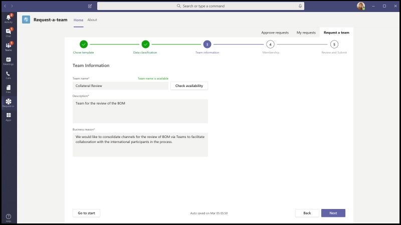
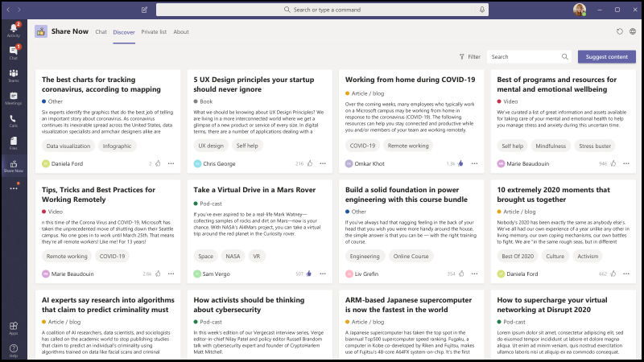

# App-Vorlagen für Microsoft TeamsApp templates for Microsoft Teams

App-Vorlagen sind Beispiele für vollständige Apps für Microsoft Teams, die open-source sind und auf GitHub verfügbar sind.App templates are examples of complete apps for Microsoft Teams that are open-source and available on GitHub. Jede App-Vorlage enthält ausführliche Anweisungen zum Bereitstellen und Installieren dieser App für Ihre Organisation.Each app template contains detailed instructions for deploying and installing that app for your organization. Es bietet auch eine Beispiel-App, die Sie installieren und sofort verwenden können.It also provides a sample app that you can install and begin using immediately. Der vollständige Quellcode ist ebenfalls verfügbar, mit dem Sie ihn detailliert untersuchen oder den Code forken und an Ihre spezifischen Anforderungen anpassen können.The complete source code is available too, which allows you to explore it in detail or fork the code and alter it to meet your specific requirements.
Alle App-Vorlagen werden unter den [MIT-Lizenzbedingungen](https://github.com/OfficeDev/microsoft-teams-apps-eprescription/blob/master/LICENSE) bereitgestellt.All app templates are provided under the [MIT License](https://github.com/OfficeDev/microsoft-teams-apps-eprescription/blob/master/LICENSE) terms.
> [!NOTE] 
> Sie müssen Apps, die aus App-Vorlagen für Ihre Benutzer und Organisationen erstellt wurden, lizenz- und unterstützen.You must license and support apps created from app templates for your users and organizations. Microsoft ist nicht für Lizenzen und Support verantwortlich.Microsoft is not responsible for licenses and support.

**&#9734; Gibt neu veröffentlichte App-Vorlagen an.****&#9734; Indicates newly released app templates.**

### Wichtige VorteileKey benefits

* **Direkte Bereitstellung in der Cloud:** Alle App-Vorlagen enthalten Bereitstellungsskripts, mit dem Sie alle erforderlichen Dienste in Microsoft Azure oder der Power Platform hosten können.**Deploy directly to the cloud:** All app templates include deployment scripts that allows you to host all required services in Microsoft Azure or the Power Platform. 
* **Empfohlener Beispielcode:** Die App-Vorlagen entsprechen den empfohlenen bewährten Methoden für Sicherheit und Infrastruktur.**Recommended sample code:** The app templates conform to recommended best practices around security and infrastructure. Alle von der Community übermittelten Änderungen an den App-Vorlagen werden überprüft, um die Konformität sicherzustellen.All community submitted changes to the app templates are reviewed to ensure conformance.
* **Anpassbar und erweiterbar:** Während alle App-Vorlagen mit minimaler Konfiguration bereitgestellt werden können, stellen wir die gesamte Codebasis und Bereitstellungsskripts bereit, damit Sie sie ganz einfach an Ihre individuellen Anforderungen anpassen oder erweitern können.**Customizable and extensible:** While all app templates can be deployed with minimal configuration, we provide the entire code base and deployment scripts so that you can easily customize or extend them to fit your unique needs.
* **Ausführliche Dokumentation:** Alle App-Vorlagen werden von einer End-to-End-Dokumentation zu Lösungsarchitektur, Bereitstellung und Konfigurationsschritten begleitet.**Detailed documentation:** All app templates are accompanied by end-to-end documentation on solution architecture, deployment, and configuration steps.  

## Adoption BotAdoption Bot 

Adoption Bot ist ein Mit Power Virtual Agent für Teams (PVA) erstellter User Care Chat Bot.Adoption Bot is a user care chat bot built with Power Virtual Agent for Teams (PVA). Es kann als die PVA-Version von FAQPlus betrachtet werden.It can be considered as the PVA version of FAQPlus. Adoption Bot beantwortet mehr als 100 häufig gestellte Fragen zu Microsoft 365 und Teams.Adoption Bot answers 100+ common questions about Microsoft 365 and Teams. Sie können die vorhandenen Themen bearbeiten, eigene Themen hinzufügen und vorhandene FAQs hinzufügen.You can edit the existing topics, add your own topics, and ingest existing FAQs. Wenn Benutzer zusätzliche Hilfe benötigen, kann Adoption Bot sie mit Experten verbinden oder sogar auf das Öffnen von Diensttickets mit Premium-Flussconnectors erweitert werden. Dieser Bot kann selbst installiert oder in eine benutzerdefinierte App wie den [Adoption Hub integrierte werden.](https://github.com/akporzondek/adoption_hub)If users need additional help, Adoption Bot can connect them to experts or even be extended to open service tickets with premium flow connectors.This bot can be installed on it's own or built into a custom app like the [Adoption Hub](https://github.com/akporzondek/adoption_hub).

[Abrufen auf GitHubGet it on GitHub](https://github.com/OfficeDev/microsoft-teams-apps-adopt-bot)

## Einführungstool – Champion Management Platform &#9734;Adoption Tool- Champion Management Platform &#9734;

Mit der #A0 (Champion Management Platform) können Sie Ihre Teamarbeits-Champions verwalten, skalieren und inspirieren, um mehr zu erreichen.The Champion Management Platform (CMP) app template helps you manage, scale, and inspire your teamwork champions to achieve more. Diese App-Vorlage basiert auf dem SharePoint Framework und wird in eine Registerkarte innerhalb eines Teams geladen.This app template is built on the SharePoint Framework and loaded into a tab within a team. Gruppen können dieses Tool nutzen, um die Programmmitgliedschaft zu verwalten, eine Bestenliste und Ereignistypen für die Protokollierung sowie Tools zum Überlagern digitaler Badges für Programmteilnehmer zur Verfügung zu stellen.Groups can leverage this tool to help manage program membership, provide a leaderboard and event types for logging, and tools to overlay digital badges to program participants.

[Abrufen auf GitHubGet it on GitHub](https://github.com/OfficeDev/microsoft-teams-apps-champion-management)

## Einführungstool – Microsoft 365 Learning Pathways (Get Started) &#9734;Adoption Tool- Microsoft 365 Learning Pathways (Get Started) &#9734;

Mit der App-Vorlage Erste Schritte können Sie die Leistung von Microsoft 365-Lernpfaden in Microsoft Teams nutzen.The Get Started app template allows you to bring the power of Microsoft 365 learning pathways inside of Microsoft Teams. Mit dieser App-Vorlage können Sie einfachen Zugriff auf bestimmte Schulungsseiten oder andere Intranetressourcen gewähren und die Inhalte direkt in Teams laden.This app template allows you to grant easy access to specific training pages or other intranet assets and load the content directly within Teams. Sie können den Namen oder das Logo der App auch so ändern, dass sie Ihrem Unternehmensbranding entsprechen.You can also change the app name or logo to match your company branding.

[Abrufen auf GitHubGet it on GitHub](https://github.com/msft-teams/tools/tree/master/M365%20Learning%20Pathways)

## Appointment ManagerAppointment Manager 

Appointment Manager ist eine Teams-App-Vorlage, mit der Unternehmen virtuelle Termine mit Kunden über Teams erstellen, verwalten und durchführen können.Appointment Manager is a Teams app template to help businesses create, manage, and conduct virtual appointments with consumers through Teams. Neue Terminanfragen von Kunden sind in Teams-Kanälen sichtbar, in denen sie schnell zugewiesen und mitarbeitern in einem Team zugewiesen werden können.New appointment requests from consumers are visible in Teams channels, where they can quickly be assigned and reassigned to staff in a team. Terminanfragen können auf Team- oder persönlichen Ebenen über benutzerdefinierte Registerkarten angezeigt werden.Appointment requests can be viewed at team or personal levels through custom tabs. Jeder Termin ist einer Teams-Onlinebetreff zugeordnet, daher können Mitarbeiter und Verbraucher problemlos zur geplanten Zeit an der Besprechung teilnehmen.Every appointment is associated with a Teams online meeting, hence the staff and consumers can easily join the meeting at the scheduled time.

Die App-Vorlage wird in Microsoft Bookings integriert, um die Terminverwaltung zu einfach zu machen.The app template integrates with Microsoft Bookings for easy appointment management. Geplante Termine werden automatisch in den Kalendern der zugewiesenen Mitarbeiter angezeigt, und Verbraucher erhalten anpassbare E-Mail-Benachrichtigungen und Erinnerungen mit eingebetteten Besprechungslinks.Scheduled appointments automatically appear on assigned staff members' calendars, and consumers receive customizable email notifications and reminders with embedded meeting links.

[Abrufen auf GitHubGet it on GitHub](https://github.com/OfficeDev/microsoft-teams-apps-appointment-manager)

 

## Ask AwayAsk Away

Ask Away ist ein [Microsoft Teams-Bot,](../bots/what-are-bots.md) mit dem Benutzer Fragen&A (Frage und Antwort) in Teams durchführen können.Ask Away is a [Microsoft Teams bot](../bots/what-are-bots.md) that enables users to conduct Q&A (Question and Answer) sessions within Teams. Mithilfe des Bots "Weg fragen" können Teammitglieder Fragen übermitteln und fragen, die von Kollegen gemeinsam genutzt werden, sodass Fragen und Antworten&Einem Host problemlos in einem Kanal oder Chat gesammelt werden können.Using the Ask Away bot, team members can submit and up-vote questions shared by colleagues allowing Q&A hosts to easily gather top-of-mind questions within a channel or chat. Der Bot kann zum Durchführen einer Echtzeit-Frage&einer Sitzung in einer Teams-Besprechung verwendet werden und ermöglicht Teilnehmern, Fragen live per Chat zu übermitteln.The bot can be used to conduct a real-time Q&A session in a Teams meeting and allows attendees to submit questions live via chat.

[Abrufen auf GitHubGet it on GitHub](https://github.com/OfficeDev/microsoft-teams-apps-askaway)

:::row:::
  :::column span="2":::
      
:::column-end:::
:::row-end:::

## Assoziierte EinblickeAssociate Insights

Associate Insights ist eine [Power Apps-Vorlage,](/powerapps/maker/canvas-apps/embed-teams-app) mit der FirstLine-Mitarbeiter Kundenmeinungen, -stimmungen und -wahrnehmungen direkt erfassen und übermitteln können.Associate Insights is a [Power Apps](/powerapps/maker/canvas-apps/embed-teams-app) template that empowers firstline workers to directly capture and submit customer opinion, sentiment, and perception. Firstline-Mitarbeiter sind häufig der erste Unternehmensvertreter, der sich mit Kunden an einem 1:1-Kontaktpunkt beschäftigt.Firstline workers are often the first company representative to engage with customers in a one-to-one point-of contact. Die gesammelten Daten können gemeinsam von Geschäftsteams freigegeben und verwendet werden, z. B. über eine Power BI Teams-Registerkarte, um die Produktverbesserung zu verbessern und die Kundenerfahrung zu verbessern.The collected data can be shared and used collaboratively by business teams, e.g., via a Power BI Teams tab, for product improvement and enhancing the customer experience.

[Abrufen auf GitHubGet it on GitHub](https://github.com/OfficeDev/microsoft-teams-apps-associateinsights)

:::row:::
  :::column span="2":::
      
:::column-end:::
:::row-end:::
:::row:::
:::column span="2":::
    
:::column-end:::
:::row-end:::

## AnwesenheitAttendance

Die Anwesenheits-App ist eine [Power Apps-Registerkarte,](/powerapps/maker/canvas-apps/embed-teams-app) die in einem Team angeheftet werden kann.The Attendance app is a [Power Apps](/powerapps/maker/canvas-apps/embed-teams-app) tab that can be pinned in a team. Es ist so konzipiert, dass Anwesenheit aufgezeichnet wird, in der Regel in Einstellungen wie z. B. Lern- und Schulungsumgebungen.It is designed to record presence, typically in settings such as learning and training environments. Benutzer können die Teilnahme in der Vergangenheit bis zu 30 Tage lang markieren oder bearbeiten und zusammenfassende Anwesenheitsberichte für eine gesamte Gruppe oder einzelne Teilnehmer anzeigen.Users can mark or edit attendance for up to 30 days in the past and view summarized attendance reports for an entire group or individual attendees.

[Abrufen auf GitHubGet it on GitHub](https://github.com/OfficeDev/microsoft-teams-apps-attendance)

## Book-a-roomBook-a-room

Book-a-room ist ein [Microsoft Teams-Bot,](../bots/what-are-bots.md) mit dem Benutzer einen Besprechungsraum für 30 (Standard), 60 oder 90 Minuten ab der aktuellen Uhrzeit schnell finden und reservieren können.Book-a-room is a [Microsoft Teams bot](../bots/what-are-bots.md) that lets users quickly find and reserve a meeting room for 30 (default), 60, or 90 minutes starting from the current  time. Der Book-a-room-Bot bietet Bereiche für persönliche oder 1:1-Unterhaltungen.The Book-a-room bot scopes to personal or 1:1 conversations.

[Abrufen auf GitHubGet it on GitHub](https://github.com/OfficeDev/microsoft-teams-apps-bookaroom)

## Erstellen von ZugriffBuilding Access

Beim Erstellen von Access handelt es sich um eine Microsoft [Power Platform-basierte](https://powerapps.microsoft.com/blog/now-in-preview-customize-teams-with-built-in-power-platform-capabilities/)App, die die Verwaltung von Belegungsschwellenwerte und Normen für die soziale Distanzierung unterstützt, indem es Den Leitern von Einrichtungen ermöglicht wird, die Anwesenheit von Mitarbeitern vor Ort zu verwalten, nachzuververwalten und zu melden.Building Access is a Microsoft [Power Platform](https://powerapps.microsoft.com/blog/now-in-preview-customize-teams-with-built-in-power-platform-capabilities/)-based app that supports the administration of building occupancy thresholds and social distancing norms by enabling facilities directors to manage, track, and report employee on-site presence. Die app, die mithilfe von Microsoft [Power Apps](/powerapps/powerapps-overview)und [Power Automate](/power-automate/getting-started)erstellt wurde, integriert sich tief in Microsoft Teams und ermöglicht Es Organisationen, die Erstellungsbereitschaft zu bestimmen, Berechtigungskriterien für den Zugriff vor Ort festzulegen und Einblicke für die zukünftige Planung zu sammeln.The app, built using Microsoft [Power Apps](/powerapps/powerapps-overview), and [Power Automate](/power-automate/getting-started), deeply integrates with Microsoft Teams and enables organizations to determine building readiness, establish eligibility criteria for on-site access, and gather insights for future planning.

[Abrufen auf GitHubGet it on GitHub](https://github.com/OfficeDev/microsoft-teams-apps-buildingaccess)

:::row:::
   :::column span="":::
     
   :::column-end:::
   :::column span="":::
      
   :::column-end:::
:::row-end:::

## FeiernCelebrations

Bei "Festlichkeiten" handelt es sich um eine Teams-App, mit der Teammitglieder geburtstage, Jubiläen und andere wiederkehrende Ereignisse zelebrieren können.Celebrations is a Teams app that helps team members celebrate each others' birthdays, anniversaries, and other recurring events. Er erinnert sich an besondere Anlässe aller Teammitglieder und sendet eine freundliche Nachricht in allen teams, die zum Zeitpunkt der Ereigniserstellung ausgewählt wurden, um den Teammitgliedern ein besonderes Gefühl an ihrem Tag zu machen.It remembers special occasions of all the team members and sends a friendly message in all the teams selected at the time of event creation, to make the team members feel special on their day.

Die App bietet allen Teammitgliedern eine einfache Schnittstelle zum persönlichen Hinzufügen und Anzeigen ihrer Ereignisse und ermöglicht es dem Benutzer, die Teams auszuwählen, in denen die Ereignisse freigegeben werden.The app provides an easy interface for all the team members to personally add and view their events and also allows the user to select the teams in which the events gets shared.

[Abrufen auf GitHubGet it on GitHub](https://github.com/OfficeDev/microsoft-teams-celebrations-app)

## PrüflisteChecklist

Prüfliste ist eine  benutzerdefinierte Microsoft Teams-Messaging-Erweiterungs-App, mit der Sie mit Ihrem Team zusammenarbeiten können, indem Sie eine freigegebene Prüfliste in einem Chat oder Kanal erstellen.Checklist is a custom Microsoft Teams [messaging extension](../messaging-extensions/what-are-messaging-extensions.md) app that enables you to collaborate with your team by creating a shared checklist in a chat or channel. Die App wird auf allen Microsoft Teams-Plattformclients unterstützt – Desktop, Browser, iOS und Android – und ist bereit für die Bereitstellung im Rahmen Ihres Microsoft 365-Abonnements.The app is supported across all Teams platform clients —  desktop, browser, iOS, and Android — and is ready for deployment as part of your Microsoft 365 subscription.  

[Abrufen auf GitHubGet it on GitHub](https://github.com/OfficeDev/microsoft-teams-checklist-app )

:::row:::
:::column span="2":::
      
:::column-end:::
:::row-end:::

## Classroom-Drop-InClassroom Drop-in 

Das Classroom-Drop-In ist eine Microsoft [Power Platform-basierte](https://powerapps.microsoft.com/blog/now-in-preview-customize-teams-with-built-in-power-platform-capabilities/)App, mit der Systemleiter Klassenteams (virtuelle Kursräume) finden und sich selbst oder andere zu diesen Kursteams für einen angegebenen Drop-In-Zeitraum hinzufügen können, je nach Bedarf.Classroom Drop-in is a Microsoft [Power Platform](https://powerapps.microsoft.com/blog/now-in-preview-customize-teams-with-built-in-power-platform-capabilities/)-based app that enables system leaders to find class teams (virtual classrooms) and add themselves or others to these class teams for a specified drop-in period, as needed. Die app built using Microsoft [Power Apps](/powerapps/powerapps-overview) and [Power Automate](/power-automate/getting-started), deeply integration in Microsoft Teams to ensure educational institute can optimize their operations in a hybrid learning environment by providing access to relevant stakeholders for class teams per business requirements.The app built using Microsoft [Power Apps](/powerapps/powerapps-overview) and [Power Automate](/power-automate/getting-started), deeply integrates with Microsoft Teams to ensure educational institutes can optimize their operations in a hybrid learning environment by providing access to relevant stakeholders for class teams per business requirements.

[Abrufen auf GitHubGet it on GitHub](https://github.com/OfficeDev/microsoft-teams-apps-classroom-dropin)

## Unternehmens-CommunicatorCompany Communicator

Die App Communicator ermöglicht Unternehmensteams das Erstellen und Senden von Nachrichten, die für mehrere Teams oder eine große Anzahl von Mitarbeitern im Chat vorgesehen sind, sodass die Organisation mitarbeiter direkt dort erreichen kann, wo sie zusammenarbeiten.The Company Communicator app enables corporate teams to create and send messages intended for multiple teams or large number of employees over chat allowing organization to reach employees right where they collaborate. Verwenden Sie diese Vorlage für mehrere Szenarien, z. B. Ankündigungen neuer Initiativen, Mitarbeiter-Onboarding, modernes Lernen und Entwickeln oder organisationsweite Übertragungen.Utilize this template for multiple scenarios such as new initiative announcements, employee onboarding, modern learning and development or organization-wide broadcasts.

Die App bietet eine einfache Schnittstelle für designierte Benutzer zum Erstellen, Anzeigen, Zusammenarbeiten und Senden von Nachrichten.The app provides an easy interface for designated users to create, preview, collaborate and send messages.

Es bietet eine Grundlage zum Erstellen benutzerdefinierter gezielter Kommunikationsfunktionen wie benutzerdefinierte Telemetrie, um zu erfahren, wie viele Benutzer eine Nachricht bestätigt oder mit dieser interagiert haben.It provides a foundation to build custom targeted communication capabilities such as custom telemetry on how many users acknowledged or interacted with a message.

[Abrufen auf GitHubGet it on GitHub](https://github.com/OfficeDev/microsoft-teams-company-communicator-app)

## Nachschlageaktion für KontaktgruppenContact Group Lookup

Die App Contact Group Lookup bietet einen praktischen und nützlichen Ansatz zum Erstellen, Zugreifen auf und Verwalten der Kontaktgruppen Ihrer Organisation (früher als Verteilerlisten oder Kommunikationsgruppen bekannt).The Contact Group Lookup app provides a convenient and useful approach to creating, accessing, and managing your organization's contact groups (formerly known as distribution lists or communication groups). Benutzer können schnell Gruppenmitglieder anzeigen und chatten, den Mitgliederstatus anzeigen und einen Gruppenchat mit ausgewählten Mitgliedern in der Kontaktgruppe erstellen, und dies alles in der Teams-Umgebung.Users can quickly view and chat with group members, view member status, and create a group chat with selected members in the contact group, all within the Teams environment.

[Abrufen auf GitHubGet it on GitHub](https://github.com/OfficeDev/microsoft-teams-app-contactgrouplookup)

:::row:::
:::column span="2":::
      
:::column-end:::
:::row-end:::
:::row:::
:::column span="2":::
    
:::column-end:::
:::row-end:::

## Kollegen dankenCo-worker Appreciation 

Mithilfe der Vorlage "Kollegen-Bewertung" in Microsoft Teams können Benutzer die Erfolge ihrer Kollegen im Kontext von Teams erkennen.Using the co-worker appreciation template in Microsoft Teams, users can recognize their colleagues' achievements within the Teams’ context. Wenn Kollegen einen Kollegen belohnen, werden Empfänger und andere Teammitglieder in einer Kanalgespräch markiert und erhalten eine Benachrichtigung über die Preisdetails des Kanals.When co-workers select to reward a colleague, recipients and other team members are tagged in a channel conversation and they receive a notification about the channel's award details. Die Preise werden in der Teams-App aufgezeichnet, die sicher, portabel und einfach gemeinsam verwendet werden kann.The awards are recorded in the Teams app, which is secure, portable, and easily shareable. Dies kann als powerApps-basierte Version der Open Badges-App-Vorlage mit einer Bestenliste betrachtet werden.This can be considered as the PowerApps based version of the Open Badges app template, with a leaderboard.

[Abrufen auf GitHubGet it on GitHub](https://github.com/OfficeDev/microsoft-teams-apps-coworker-appreciation)

## CrowdSourcerCrowdSourcer

CrowdSourcer ist ein [Microsoft Teams-Bot,](../bots/what-are-bots.md) der teams abgefragte Informationen zur Verfügung stellt, die gemeinsam von Gruppenmitgliedern stammen.CrowdSourcer is a [Microsoft Teams bot](../bots/what-are-bots.md) that gives teams queried information sourced collaboratively from group members. Dies ist eine hervorragende Möglichkeit, häufig gestellte Fragen zu beantworten, während teilnehmer aktiv an einer unterhaltsamen und hilfreichen Informationsressource beteiligt werden können.It's a great way to answer frequently asked questions while enabling participants to actively engage in and contribute to a fun and helpful information resource.

[Abrufen auf GithubGet it on Github](https://github.com/OfficeDev/microsoft-teams-crowdsourcer-app)

## Custom StickersCustom Stickers

Selbstausdruck ist der Kern einer gesunden Teamkultur.Self-expression is core to a healthy team culture. Diese App-Vorlage ist eine [Messagingerweiterung,](~/messaging-extensions/what-are-messaging-extensions.md) mit der Ihre Benutzer benutzerdefinierte Aufkleber und GIFs in Microsoft Teams verwenden können.This app template is a [messaging extension](~/messaging-extensions/what-are-messaging-extensions.md) that enables your users to use custom stickers and GIFs within Microsoft Teams. Diese Vorlage bietet eine einfache webbasierte Konfigurationserfahrung, bei der jeder Benutzer mit Konfigurationszugriff die GIFs/Aufkleber/Bilder hochladen kann, über die seine Endbenutzer verfügen sollen, sodass Ihr gesamtes Team alle von Ihnen gewählten Aufkleber verwenden kann.This template provides an easy web-based configuration experience where anyone with configuration access can upload the GIFs/stickers/images they want their end-users to have, allowing your entire team to use any set of stickers you chose.

Diese App ermöglicht auch die einfache Freigabe von Bildern/GIFs/Aufklebern in Teams ohne Zugriff auf SharePoint-Websites oder einzelne Kanäle als Speicher- und Freigabemechanismen.This app also enables easy sharing of images/GIFs/stickers across teams without needing access to SharePoint sites or individual channels as storage and sharing mechanisms. Beispielsweise können Produktteams Produktbilder und GIFs problemlos programmgesteuert für soziale Medien, Marketing- und Vertriebsteams freigeben.For example, product teams can easily share product images and GIFs to social media, marketing and sales teams programmatically. Sie können diese App auch erweitern, indem sie einen Benachrichtigungsfluss für bestimmte Teams/Einzelpersonen auslöst, wenn neue Bilder/GIFs verfügbar gemacht werden.One can also extend this app by triggering a notification flow to specific teams/individuals when new images/GIFs are made available.

[Abrufen auf GitHubGet it on GitHub](https://github.com/OfficeDev/microsoft-teams-stickers-app)

## MitarbeiterideenEmployee Ideas

Die Employee Ideas-App ist die PowerApps-Version der Azure-basierten App-Vorlage für großartige Ideen.The Employee Ideas app is the PowerApps version of the Azure based Great Ideas app template. Die App ermöglicht den Teams-Benutzern das Einrichten und Konfigurieren einer Ideenkampagne.The app enables the Teams users to set up and configure an idea campaign. Eine Ideenkampagne ist eine Kategorie zum Gruppieren von Ideen zu allgemeinen Designs.An idea campaign is a category for grouping ideas around common themes.

Teams-Benutzer können auch folgende Aktivitäten ausführen:Teams users can also perform following activities:
* Konfigurieren Sie ein Standardübermittlungsformular, das Mitarbeiter für jede Idee übermitteln müssen.Configure a standard submission form that employees need to submit for each idea. 
* Überprüfen und verwalten Sie die Ideen und die Liste der Kampagnen.Review and manage the ideas and list of campaigns.
* Ändern und Löschen von Kampagnen.Modify and delete campaigns.
* Überprüfen Sie Die Bestenlisten von Ideen.Review leader boards of ideas.
* Stimmen Sie für priorisierte Ideen ab, und teilen Sie sie.Vote for and share prioritized ideas.
* Übermitteln Sie Ideen für eine Kampagne.Submit ideas for a campaign.
* Sehen Sie sich die Idee eines anderen Teammitglieds an.View other team member's idea.
* Stimmen Sie über die am häufigsten gefallenen Ideen ab.Vote on most liked ideas.
* Überprüfen Sie die Leistung ihrer Ideen im Vergleich mit anderen innerhalb einer Kampagne.Review the performance of their ideas compared with others within a campaign.

[Abrufen auf GitHubGet it on GitHub](https://github.com/OfficeDev/microsoft-teams-apps-employeeideas)

 

## E-PrescriptionsE-Prescriptions 

E-Prescriptions ist eine [Power Apps-basierte](/powerapps/maker/canvas-apps/embed-teams-app)App, die die Telemedikierung und virtuelle Behandlung verbessert, indem der Prozess der Ausgabe von E-Rezepten für Patienten automatisiert wird.E-Prescriptions is a [Power Apps](/powerapps/maker/canvas-apps/embed-teams-app)-based app that enhances telemedicine and virtual care by automating the process of issuing e-prescriptions to patients. Medizinische Experten können Termine schnell überprüfen, E-Rezepte generieren und E-Mails mit E-Rezept-Anlagen direkt innerhalb der Teams-Plattform an Patienten senden.Medical professionals can quickly review appointments, generate e-prescriptions, and send emails with e-prescription attachments to patients directly within the Teams platform.

[Abrufen auf GitHubGet it on GitHub](https://github.com/OfficeDev/microsoft-teams-apps-eprescription) 

:::row:::
:::column span="2":::
      
:::column-end:::
:::row-end:::
:::row:::
:::column span="2":::
    
:::column-end:::
:::row-end:::

## MitarbeiterschulungenEmployee Training 

Mitarbeiterschulung ist eine Microsoft Teams-App, mit der Organisatoren Lern- und Schulungsereignisse für Ihre Organisation einfach veröffentlichen, nachverfolgen und bewerben können.Employee training is a Microsoft Teams app that enables organizers to easily publish,  track, and promote learning and training events for your organization.  Mit der App können Ereignisplaner Erinnerungen und Benachrichtigungen an Ereignisregistranten senden, und Mitarbeiter können Interesse an bevorstehenden Ereignissen anzeigen, aktuelle Ereignisse aktualisieren und Ereignisdetails über die Teams-Messaging-Erweiterung mit Kollegen teilen.With the app, event planners can send reminders and notifications to event registrants and employees can indicate interest in upcoming events, stay updated on current events, and share event details with colleagues via the Teams messaging extension.

[Abrufen auf GitHubGet it on GitHub](https://github.com/OfficeDev/microsoft-teams-apps-employeetraining)

:::row:::
:::column span="2":::
    **Anzeigen von Schulungsereignissen für Mitarbeiter** **View employee training events**   
:::column-end:::
:::row-end:::
:::row:::
:::column span="2":::
    **Erstellen eines Schulungsereigniss für Mitarbeiter** **Create employee training event** 
:::column-end:::
:::row-end:::

## Experten-FinderExpert Finder

Der Experten-Finder ist ein [Microsoft Teams-Bot,](../bots/what-are-bots.md) der bestimmte Organisationsmitglieder basierend auf ihren Fähigkeiten, Interessen und Bildungsattributen identifiziert.Expert Finder is a [Microsoft Teams bot](../bots/what-are-bots.md) that identifies specific organization members based on their skills, interests, and education attributes. Mitglieder finden Experten in einer Organisation, die einer Stichwortsuche von Azure Active Directory-Benutzerprofilen entsprechen.Members find experts within an organization  that match a keyword search of Azure Active Directory user profiles.

[Abrufen auf GitHubGet it on GitHub](https://github.com/OfficeDev/microsoft-teams-apps-expertfinder)

## FAQ PlusFAQ Plus

Conversational Q&A bots sind eine einfache Möglichkeit, Antworten auf häufig gestellte Fragen von Benutzern zu geben.Conversational Q&A bots are an easy way to provide answers to frequently asked questions by users. Die meisten Bots können jedoch nicht sinnvoll mit Benutzern interagieren, da kein Mensch in der Schleife ist, wenn der Bot ausfällt.However, most bots fail to engage with users in meaningful way because there is no human in the loop when the bot fails. Der FAQ-Bot ist ein&Ein Bot, der einen Menschen in die Schleife bringt, wenn er nicht helfen kann.FAQ bot is a friendly Q&A bot that brings a human in the loop when it is unable to help. Man kann dem Bot eine Frage stellen, und der Bot antwortet mit einer Antwort, wenn er in der Wissensdatenbank enthalten ist.One can ask the bot a question and the bot responds with an answer if it is contained in the knowledge base. Andern falls nicht, ermöglicht der Bot dem Benutzer das Senden einer Abfrage, die dann an ein vorkonfiguriertes Expertenteam gesendet wird, das bei der Unterstützung hilft, indem er auf die Benachrichtigungen innerhalb des Teams selbst einwirken kann.If not, the bot allows the user to submit a query which then gets posted to a pre-configured team of experts who help to provide support by acting upon the notifications from within the team itself.

> [!NOTE]
> Die neueste Version von **FAQ Plus** unterstützt verbesserte Lösungen&Fragen und Antworten, da ein Expertenteam folgendes abschließen kann:The latest release of **FAQ Plus** supports improved Q&A resolutions by enabling a team of experts to complete the following:
>
> &#x2714; Hinzufügen neuer Fragen&Direkt zur Wissensdatenbank mithilfe von Nachrichtenerweiterungen.&#x2714; Add new Q&As directly to the knowledge base using message extensions.
>
> &#x2714; Bearbeiten und Löschen von&Ein Paar, das von einem Bot hinzugefügt wurde.&#x2714; Edit and delete Q&A pairs added by a bot.
>
> &#x2714; Verfolgen des Überarbeitungsverlaufs von Q&As.&#x2714; Track the revision history of Q&As.
>
> &#x2714; Konfigurieren sie eine Antwort mit zusätzlichen Details, die als adaptive [Karte angezeigt werden.](../task-modules-and-cards/cards/cards-reference.md#adaptive-card)&#x2714; Configure an answer with additional details to display as an [adaptive card](../task-modules-and-cards/cards/cards-reference.md#adaptive-card).
>
[Abrufen auf GitHubGet it on GitHub](https://github.com/OfficeDev/microsoft-teams-apps-faqplusv2)

## Support-App erhaltenGet Support App

Die App Support anfordern kann von Organisationen verwendet werden, die Microsoft Teams verwenden, um allen Benutzern die Möglichkeit zu ermöglichen, Unterstützung von Vorgesetzten an zu fordern.The Get Support app can be used by organizations that are using Microsoft Teams, to enable any set of users to request assistance from supervisors. Diese App enthält verschiedene Features, z. B.:This app includes various features, such as:
-   Anfordern von Unterstützung für verschiedene Kategorien von einer Power AppRequesting assistance on different categories from a Power App
-   Benachrichtigungen, die an Anfordernde gesendet werden, die sie darüber informieren, wer zugewiesen wurdeNotifications sent to requestors informing them of who has been assigned 
-   Benachrichtigungen, die an zugewiesene Vorgesetzte gesendet werden, um sie darüber zu informieren, wer Hilfe benötigtNotifications sent to assigned supervisors informing them of who needs assistance 
-   Analysieren von Eskalationen und Mustern in SharePoint und PowerBIAnalyzing escalations and patterns in SharePoint and PowerBI

[Abrufen auf GitHubGet it on GitHub](https://github.com/OfficeDev/microsoft-teams-app-get-support/)

## ZielverfolgungGoal Tracker

Die Zielverfolgungs-App ist eine umfassende Lösung für Ihre Organisation, um das Einrichten von Zielen, die Beobachtung des Fortschritts und den Erfolg in Microsoft Teams zu unterstützen.The Goal Tracker app is a comprehensive solution for your organization to support establishing goals, observing progress, and acknowledging success within Microsoft Teams. Die App ermöglicht Benutzern das Festlegen, Nachverfolgen und Aktualisieren von Zielen auf professioneller, persönlicher und Teamebene.The app enables users to set, track, and update objectives on a professional, personal, and team level. Teammitglieder erhalten außerdem rechtzeitige Erinnerungen und Statusupdates, um konzentriert zu bleiben und auf dem richtigen Weg zu bleiben.Team members also receive timely reminders and status updates to remain focused and stay on track.

[Abrufen auf GitHubGet it on GitHub](https://github.com/OfficeDev/microsoft-teams-app-goaltracker)

:::row:::
  :::column span="2":::
      
:::column-end:::
:::row-end:::
:::row:::
:::column span="2":::
    
:::column-end:::
:::row-end:::

## Großartige IdeenGreat Ideas

Die Great Ideas-App unterstützt und fördert Innovation und Kreativität in Ihrer Organisation.The Great Ideas app supports and empowers innovation and creativity within your organization. Die App ermöglicht Es Ihren Mitarbeitern, Ideen mit Kollegen und Führungskräften auszutauschen, neue Übermittlungen zu entdecken, Beiträge zur Peer-Überlegung ins Rampenlicht zu stellen und ihre Stimme für die besten Vorschläge in Microsoft Teams zu geben.The app enables your employees to share ideas with colleagues and leadership, discover new submissions, spotlight contributions for peer consideration, and cast their vote for the best proposals within Microsoft Teams.

[Abrufen auf GitHubGet it on GitHub](https://github.com/OfficeDev/microsoft-teams-apps-greatideas)

:::row:::
  :::column span="2":::
      
:::column-end:::
:::row-end:::
:::row:::
:::column span="2":::
    
:::column-end:::
:::row-end:::

## GruppenaktivitätenGroup Activities

Gruppenaktivitäten ist eine Microsoft Teams-App, mit der Teambesitzer schnell Aktivitätsgruppen erstellen und Workflows für die Zusammenarbeit im Kontext von Microsoft Teams verwalten können.Group Activities is a Microsoft Teams app that makes it easy for team owners to quickly create activity groups and manage collaboration workflows within the context of Microsoft Teams. Aktivitätsautoren können Aktivitäten erstellen, Teammitglieder zufällig in Gruppen verteilen und optional vom Bot Erinnerungen senden, bis die Aktivitäten abgeschlossen sind.Activity authors are enabled to create activities, randomly distribute team members in groups, and optionally have the bot send reminders until activities are complete.

[Abrufen auf GitHubGet it on GitHub](https://github.com/OfficeDev/microsoft-teams-apps-groupactivities)

:::row:::
  :::column span="2":::
      
:::column-end:::
:::row-end:::
:::row:::
:::column span="2":::
    
:::column-end:::
:::row-end:::

## Erweitern Sie Ihre FähigkeitenGrow Your Skills

Die App Grow Your Skills unterstützt professionelles Wachstum und Entwicklung, indem Mitarbeiter an ergänzenden Projekten für Ihre Organisation beitragen und gleichzeitig neue Fähigkeiten erlernen können.The Grow Your Skills app supports professional growth and development by enabling employees to contribute to supplemental projects for your organization while simultaneously learning new skills. Mitarbeiter können die App verwenden, um Möglichkeiten zu finden, die ihren Interessen entsprechen, eine sinnvolle Zusammenarbeit mit Kollegen zu genießen und neue Kompetenz- und Funktionenstufen zu erwerben, und dies alles in der Teams-Umgebung.Employees can use the app to locate opportunities that meet their interests, enjoy meaningful collaboration with peers, and acquire new levels of expertise and capabilities, all within the Teams environment.

[Abrufen auf GitHubGet it on GitHub](https://github.com/OfficeDev/microsoft-teams-apps-growyourskills)

:::row:::
  :::column span="2":::
      
:::column-end:::
:::row-end:::
:::row:::
:::column span="2":::
    
:::column-end:::
:::row-end:::

## HR SupportHR Support

Hr Support Bot ist ein benutzerfreundlicher Q&Ein Bot, der einen Supportprofi/Experten aus dem Personalteam in die Schleife bringt, wenn er nicht helfen kann.HR Support bot is a friendly Q&A bot that brings a support professional/expert from the HR team in the loop when it is unable to help. Man kann dem Bot eine Frage stellen, und der Bot antwortet mit einer Antwort, wenn er in der Wissensdatenbank enthalten ist.One can ask the bot a question and the bot responds with an answer if it is contained in the knowledge base. Andern falls nicht, ermöglicht der Bot dem Benutzer das Senden einer Abfrage, die dann in einem vorkonfigurierten Expertenteam veröffentlicht wird, das unterstützungshilfen kann, indem er auf die Benachrichtigungen innerhalb des Teams selbst einwirken kann.If not, the bot allows the user to submit a query which then gets posted in a pre-configured team of experts who are help to provide support by acting upon the notifications from within their team itself. Darüber hinaus schlägt der Bot Links zu empfohlenen Personalrichtlinien/Fragen vor, indem er nach vorkonfigurierten Tags in der Frage sucht.Additionally, the bot suggests links to recommended HR policies/questions by searching for pre-configured tags in the question. Diese Kacheln finden Sie auch auf der zugeordneten Registerkarte als Kurzübersicht.These tiles can also be found in the associated tab as a quick reference. Der Personalsupport funktioniert gut für QnA mit geringem Gewicht und schnelle Unterstützung beim Starten neuer Projekte/Initiativen in der Organisation.HR Support works well for light weight QnA and to provide quick support when launching new projects/initiatives in the organization.

[Abrufen auf GitHubGet it on GitHub](https://github.com/OfficeDev/microsoft-teams-hrsupport-app)

## IcebreakerIcebreaker

Icebreaker ist ein [Microsoft Teams-Bot,](../bots/what-are-bots.md) der Ihrem Team dabei hilft, sich näher zu kommen, indem jede Woche zwei zufällige Teammitglieder zusammengekoppelt werden, um sich zu treffen.Icebreaker is a [Microsoft Teams bot](../bots/what-are-bots.md) that helps your team get closer by pairing two random team members up every week to meet. Der Bot vereinfacht die Planung, indem er automatisch kostenlose Zeiten vor schlägt, die für beide Mitglieder funktionieren.The bot makes scheduling easy by automatically suggesting free times that work for both members. Stärken Sie persönliche Verbindungen, und erstellen Sie mit dieser App eine engmaschige Community.Strengthen personal connections and build a tightly knit community with this app.

Die Icebreaker-App fördert nicht nur persönliche Verbindungen im gesamten Team, sondern kann auch dazu beitragen, interessenbasierte Communitys in Ihrer Organisation zu pflegen.In addition to encouraging personal connections across your entire team, the Icebreaker app can help cultivate interest-based communities within your organization. Sie können diese App beispielsweise für eine DevOps-Interessengruppe verwenden, um Ideen und bewährte Methoden zu unterstützen, die organisch in Ihrer Organisation verteilt werden.For example, you can use this app for a DevOps interest group to help ideas and best practices organically spread across your organization.

[Abrufen auf GitHubGet it on GitHub](https://github.com/OfficeDev/microsoft-teams-icebreaker-app)

## IncentivesIncentives

Incentives ist eine [Power Apps-Vorlage,](/powerapps/maker/canvas-apps/embed-teams-app) die die incentivierte Mitarbeiterbeteiligung an bestimmten Aktivitäten wie Schulungen und Änderungsmanagement-Initiativen verwaltet und verfolgt.Incentives is a [Power Apps](/powerapps/maker/canvas-apps/embed-teams-app) template that manages and tracks incentivized employee participation in designated activities such as trainings and change management initiatives. Administratoren verwenden die App, um bestimmte Aktivitäten festzulegen, Punkte für den Abschluss zuzuordnen und erforderliche Berechtigungspunktstufen für Prämien anzugeben.Admins use the app to establish designated activities, assign points for completion, and specify required eligibility point levels for rewards. Mitarbeiter verwenden die App, um ihre gesammelten Punkte zu anzeigen und nach Erreichen der Berechtigung einlösbare Prämien anfordern und beanspruchen.Employees use the app to view their accumulated points and, upon reaching eligibility, request and claim redeemable rewards.

[Abrufen auf GitHubGet it on GitHub](https://github.com/OfficeDev/microsoft-teams-apps-incentives)

## Incident ReporterIncident Reporter

Incident Reporter ist ein [Microsoft Teams-Bot,](../bots/what-are-bots.md)  der die Verwaltung von Vorfällen in Ihrer Organisation optimiert.Incident Reporter is a [Microsoft Teams bot](../bots/what-are-bots.md)  that optimizes the management of incidents in your organization. Der Bot vereinfacht die automatisierte Erfassung von Vorfalldaten, angepasste Vorfallberichte, relevante Benachrichtigungen von Betroffenen und die End-to-End-Nachverfolgung von Vorfällen.The bot facilitates automated incident data collection, customized incident reports, relevant stakeholder notifications, and end-to-end incident tracking.

[Abrufen auf GitHubGet it on GitHub](https://github.com/OfficeDev/microsoft-teams-apps-incidentreport)

:::row:::
  :::column span="2":::
      
:::column-end:::
:::row-end:::
:::row:::
:::column span="2":::
    
:::column-end:::
:::row-end:::

## InspektionInspection 

 Bei der Überprüfung handelt es sich um eine Microsoft Teams-App, mit der Mitarbeiter an der Frontlinie alles von Standorten bis hin zu Ressourcen und Geräten überprüfen können.Inspection is a Microsoft Teams app that enables front line workers to inspect anything from  locations to assets and equipments. Beispielsweise ein Einzelhandelsgeschäft, eine Produktionsanlage oder Fahrzeuge und Maschinen.For example, a retail store, manufacturing plant, or vehicles and machines. Diese Lösung bietet zwei Apps, die jeweils für verschiedene Benutzertypen vorgesehen sind.There are two apps in this solution, each intended for different types of users.

Die App ermöglicht es den Front-Line-Mitarbeitern, eine Ressource oder einen Bereich zu prüfen, die Qualität von Produkten und Diensten zu verwalten oder die Sicherheit am Arbeitsplatz zu gewährleisten.The app empowers the front line workers to inspect an asset or area, to manage quality of products and services, or maintain safety at workplace. Es erleichtert die Kommunikation zwischen Teammitgliedern, um Probleme zu beheben, die während der Überprüfung gefunden wurden.It facilitates communication between team members to address issues found during inspection. Die App bietet einfachen Berichten für Manager, um die Problembe beheben zu beschleunigen und Trends zu markieren.The app provides simple reports for managers to expedite issue resolution and highlight trends.

[Abrufen auf GitHubGet it on GitHub](https://github.com/OfficeDev/microsoft-teams-apps-inspection)

   

## ProblemberichterstattungIssue Reporting

Die Problemberichts-App ermöglicht es Den Mitarbeitern und Vorgesetzten, Probleme auf- und zu verwalten.The Issue Reporting app empowers the employees and managers to raise and manage issues. Es besteht aus zwei Apps: Issue reporting app for reporting issues und Manage Issues app for managing issues.It consists of two apps, Issue reporting app for reporting issues and Manage Issues app for managing issues.

Die Teammanager verwenden die App Probleme verwalten, um die App zu konfigurieren, einschließlich des Kanals, in dem Microsoft Teams-Nachrichten und Planner-Aufgaben von der App erstellt werden.The team managers use the Manage Issues app to configure the app experience, including the channel in which Microsoft Teams messages and Planner tasks are created by the app. Manager verwenden die App auch, um Vorlagenformulare zu erstellen, um Details zu sammeln, wenn ein Benutzer ein Problem meldet.Managers also use the app to create template forms to collect details when a user reports an issue. Beispiel: Überprüfen, Bearbeiten oder Löschen von Formularen für Problemvorlagen.For example, review, edit, or delete issue template forms. Die App kann auch zum Überprüfen von Teamproblemen, zum Melden des Problemverlaufs und zum effizienten Verwalten der Problemlösung verwendet werden.The app can also be used to review team issues, report on issue history, and efficiently manage issue resolution.

Die Mitarbeiter verwenden die Problemberichts-App, um Probleme und Details zu protokollieren, die zur Behebung dieser Probleme erforderlich sind.The employees use the Issue reporting app to log issues and details required to resolve them. Die App wird auch verwendet, um vorhandene Probleme zu ändern und zu beheben und eine hohe Ansicht von individuellen oder Teamproblemen zu erhalten.The app is also used to modify and resolve existing issues and get a high-level view of individual or team issues.

[Abrufen auf GitHubGet it on GitHub](https://github.com/OfficeDev/microsoft-teams-apps-issuereporting)

  

## Onboarding neuer MitarbeiterNew Employee Onboarding 

Das Onboarding neuer Mitarbeiter ist eine integrierte Microsoft Teams- und [SharePoint New Employee Onboarding-Lösung,](https://lookbook.microsoft.com/details/75e60a32-9849-4ed4-b83e-b2b08983ad19) mit der Ihre Organisation eine konsistente, qualitativ hochwertige Onboardingerfahrung für Mitarbeiter auf ihrer Neueinstellungen-Reise bereitstellen kann.New Employee Onboarding is an integrated Microsoft Teams and [SharePoint New Employee Onboarding Solution](https://lookbook.microsoft.com/details/75e60a32-9849-4ed4-b83e-b2b08983ad19) that enables your organization to provide a consistent, high-quality onboarding experience for employees on their new-hire journey. Die App kann von Personalteams und Einstellungsmanagern verwendet werden, um während des gesamten Orientierungs- und Einführungsprozesses relevante Informationen zur Verfügung zu stellen, sowie von Neueinstellungen, um Feedback zu teilen, Einführungen zu geben und Onboardingaufgaben auszuführen.The app can be used by human resource teams and hiring managers to provide relevant information throughout the orientation and induction process and by new hires to share feedback, provide introductions, and complete onboarding tasks.

[Abrufen auf GitHubGet it on GitHub](https://github.com/OfficeDev/microsoft-teams-apps-newemployeeonboarding)

:::row:::
  :::column span="2":::
    **Willkommenskarte für neue Mitarbeiter** **New employee welcome card** 
:::column-end:::
:::row-end:::
:::row:::
:::column span="2":::
    **Prüfliste für neue Mitarbeiter** **New employee checklist**   
:::column-end:::
:::row-end:::

## Öffnen von SignalenOpen Badges

Open Badges ist eine Microsoft Teams-App, mit der Einzelpersonen digitale Lernanmeldeinformationen innerhalb des Teams-Kontexts erwerben und überall freigeben können.Open Badges is a Microsoft Teams app that enables individuals to earn digital learning credential badges within the Teams context and share them everywhere. Mithilfe von Funktionen der Drittanbieter-Zertifizierungsstelle für digitale Badges, [Badgr](https://badgr.org/), werden die ausgezeichneten Badges im Badgr-Profil eines Empfängers aufgezeichnet und können ein umfassendes Bild von Lebenserfahrungen erstellen und freigeben.Using capabilities from the third-party digital badge issuing authority, [Badgr](https://badgr.org/), awarded badges are recorded in a recipient's Badgr profile and available to build and share a rich picture of lifetime learning journeys.

[Abrufen auf GitHubGet it on GitHub](https://github.com/OfficeDev/microsoft-teams-apps-openbadges)

:::row:::
  :::column span="2":::
      
:::column-end:::
:::row-end:::
:::row:::
:::column span="2":::
    
:::column-end:::
:::row-end:::

## UmfragePoll 

Poll ist eine  benutzerdefinierte Microsoft Teams-Messaging-Erweiterungs-App, mit der Sie in einem Chat oder kanal schnell Umfragen erstellen und senden können, um Teammeinungen und -einstellungen zu sammeln.Poll is a custom Microsoft Teams [messaging extension](../messaging-extensions/what-are-messaging-extensions.md) app that enables you to quickly create and send polls in a chat or a channel to gather team opinions and preferences. Die App wird auf allen Microsoft Teams-Plattformclients unterstützt – Desktop, Browser, iOS und Android – und ist bereit für die Bereitstellung im Rahmen Ihres Microsoft 365-Abonnements.The app is supported across all Teams platform clients — desktop, browser, iOS, and Android  — and is ready for deployment as part of your Microsoft 365 subscription.

[Abrufen auf GitHubGet it on GitHub](https://github.com/OfficeDev/microsoft-teams-poll-app)

:::row:::
  :::column span="1":::
      
:::column-end:::
:::row-end:::

## Schnelle AntwortenQuick Responses

Quick Responses ist eine Microsoft Teams-App, die eine stabile Lösung für die effektive Beantwortung häufig gestellter Fragen (FAQs) von Benutzern bietet.Quick Responses is a Microsoft Teams app that delivers a robust solution for effectively answering users' commonly asked questions (FAQs). Anstatt jede Abfrage manuell und kontinuierlich wiederholte Informationen zu beantworten, erstellt die App eine Bibliothek mit Antworten für eine interaktive Benutzeroberfläche über [Teams-Messagingerweiterungen.](../messaging-extensions/what-are-messaging-extensions.md)Instead of answering each query manually and  continuously repeating information, the app will build a library of responses for an interactive user experience via Teams [messaging extensions](../messaging-extensions/what-are-messaging-extensions.md).

[Abrufen auf GitHubGet it on GitHub](https://github.com/OfficeDev/microsoft-teams-apps-quickresponses)

## Rapid AssistRapid Assist

Rapid Assist ist eine Microsoft [Power Platform-basierte](https://powerapps.microsoft.com/blog/now-in-preview-customize-teams-with-built-in-power-platform-capabilities/) App, mit der kundenorientierte Mitarbeiter schnell eine Verbindung mit den Experten herstellen können, um schnelle Antworten zu erhalten, nach Informationen zu suchen, offene Anfragen zu verfolgen und Experten zu ermöglichen, Benachrichtigungen zu erhalten, um schnell einen Anruf zu erhalten, um Fragen zu beantworten.Rapid Assist is a Microsoft [Power Platform](https://powerapps.microsoft.com/blog/now-in-preview-customize-teams-with-built-in-power-platform-capabilities/) based app that allows customer facing associates to rapidly connect with the experts to get quick answers, search for information, follow up open requests, and allow experts to receive notifications to quickly get on a call to help answer questions. Die app, die mit Microsoft [Power Apps](/powerapps/powerapps-overview) und [Power Automate](/power-automate/getting-started)erstellt wurde, integriert sich tief in Microsoft Teams, damit Organisationen problemlos Mitarbeiter an der Front mit Unternehmenskontakten verbinden können, um Kundenanfragen zu lösen und eine großartige Kundenerfahrung zu bieten.The app built using Microsoft [Power Apps](/powerapps/powerapps-overview) and [Power Automate](/power-automate/getting-started), deeply integrates with Microsoft Teams to enable organizations to easily connect frontline workers with corporate liaisons to resolve customer queries and deliver a great customer experience. 

[Abrufen auf GitHubGet it on GitHub](https://github.com/OfficeDev/microsoft-teams-apps-rapid-assist)

:::row:::
   :::column span="":::
     
   :::column-end:::
   :::column span="":::
      
   :::column-end:::
:::row-end:::

## ReflectReflect 

Reflect ist eine  benutzerdefinierte Microsoft Teams-Messaging-Erweiterungs-App, die eine sichere und inklusive Ressource für Ihre Teammitglieder bietet, um den Status ihres gefühlsmäßigen Wohlbefindens mit Kollegen und/oder Gruppenleitern direkt in Teams zu teilen.Reflect is a custom Microsoft Teams [messaging extension](../messaging-extensions/what-are-messaging-extensions.md) app that provides a safe and inclusive resource for your team members to share the state of their emotional well-being with colleagues and/or group leaders directly within Teams. Die App ist in Kanal-, Gruppen-, Besprechungs- und 1:1-Chats verfügbar, und die Eincheckantwort kann auf öffentlich, privat oder vollständig anonym festgelegt werden.The app is available in channel, group, meeting, and 1:1 chats and the check-in response can be set to public, private-to-sender, or fully anonymous.

[Abrufen auf GitHubGet it on GitHub](https://github.com/OfficeDev/Microsoft-Teams-App-Reflect)

:::row:::
    :::column:::
    **Well-being-Umfrage****Well-being poll**
    
    
    :::column-end:::
:::row-end:::

## RemoteunterstützungRemote Support

Remotesupport ist ein [Microsoft Teams-Bot,](../bots/what-are-bots.md) der eine fokussierte Schnittstelle zwischen Supportanfragern in Ihrer gesamten Organisation und dem internen Supportteam bietet.Remote Support is a [Microsoft Teams bot](../bots/what-are-bots.md) that provides a focused interface between support requesters throughout your organization and the internal support team.  Endbenutzer können Supportanfragen übermitteln, bearbeiten oder zurückziehen, und das Supportteam kann Anfragen innerhalb der Teams-Plattform beantworten, verwalten und aktualisieren.End-users can submit, edit, or withdraw requests for support and the support team can respond, manage, and update requests all within the Teams platform.

[Abrufen auf GitHubGet it on GitHub](https://github.com/OfficeDev/microsoft-teams-apps-remotesupport)

:::row:::
  :::column span="2":::
      
:::column-end:::
:::row-end:::
:::row:::
:::column span="2":::
    
:::column-end:::
:::row-end:::

## Request-a-teamRequest-a-team

Request-a-team ist eine Microsoft Teams-App, die die Neue Teamerstellung für Ihre Unternehmensorganisation optimiert.Request-a-team is a Microsoft Teams app that optimizes new team creation for your enterprise organization. Die App unterstützt Standardisierung und bewährte Methoden beim Erstellen neuer Teaminstanzen durch die Integration eines assistentengesteuerten Anforderungsformulars, eines eingebetteten Genehmigungsprozesses, eines Anforderungsstatusdashboards und automatisierter Teambuilds.The app supports standardization and best practices when creating new team instances through the integration of a wizard-guided request form, an embedded approval process, a request status dashboard, and automated team builds.

[Abrufen auf GitHubGet it on GitHub](https://github.com/OfficeDev/microsoft-teams-apps-requestateam)

:::row:::
  :::column span="2":::
    
:::column-end:::
:::row-end:::
:::row:::
:::column span="2":::
    
:::column-end:::
:::row-end:::

## Scrums für KanäleScrums for Channels

Scrums for Channels ist eine Scrum-Assistenten-App, mit der Benutzer Scrums in Kanälen in Microsoft Teams planen und ausführen können.Scrums for Channels is a scrum assistant app that enables users to schedule and run scrums in channels within Microsoft Teams. Die App ist ideal für Remoteteams und Teams, die aus Mitgliedern unterschiedlicher geografischer Standorte und Zeitzonen bestehen, um tägliche Updates zu teilen und die Teilnahme an scrum-Stand-up-Besprechungen sicherzustellen.The app is great for remote teams and teams comprised of members from varied geographical locations and time zones to share daily updates and ensure participation in scrum stand-up meetings.

[Abrufen auf GitHubGet it on GitHub](https://github.com/OfficeDev/microsoft-teams-apps-scrumsforchannels)

> [!NOTE]
> Informationen zum Durchführen von Scrum-Besprechungen in einem Gruppenchat finden Sie in unserer [Scrums for Group](#scrums-for-group-chat) Chat-App-Vorlage.To conduct scrum meetings in a group chat, please see our [Scrums for Group Chat](#scrums-for-group-chat) app template.

:::row:::
  :::column span="2":::
    
:::column-end:::
:::row-end:::
:::row:::
:::column span="2":::
    
:::column-end:::
:::row-end:::

## Scrums für GruppenchatScrums for Group Chat

> [!NOTE]
> Die Scrums Status-App-Vorlage wurde aktualisiert und ist jetzt Scrums for Group Chat.The Scrums Status app template has been updated and is now Scrums for Group Chat.

Scrums for Group Chat ist ein unterstützender Scrum-Assistent, mit dem Gruppenchatmitglieder asynchrone Stand-up-Besprechungen ausführen und ihre täglichen Updates problemlos freigeben können.Scrums for Group Chat is a supportive scrum assistant that enables group chat members to run asynchronous stand-up meetings and easily share their daily updates. Es ermöglicht allen Mitgliedern des Gruppenchats, zum Scrum beizutragen und die Von anderen im ausgeführten Scrum vorgenommenen Updates anzeigen.It allows all members of the group chat to contribute to the scrum and view the updates made by others in the running scrum.

[Abrufen auf GitHubGet it on GitHub](https://github.com/OfficeDev/microsoft-teams-apps-scrumsforgroupchat)

## Jetzt freigebenShare Now 

Die Share Now-App fördert den positiven Austausch von Informationen zwischen Kollegen, indem Sie Ihren Benutzern die einfache Freigabe von Inhalten in der Teams-Umgebung ermöglichen.The Share Now app promotes the positive exchange of information between colleagues by enabling your users to easily share content within the Teams environment. Benutzer engagieren die App, um Elemente von Interesse für Teammitglieder zu teilen, neue freigegebene Inhalte zu entdecken, Einstellungen zu festlegen und Favoriten für das spätere Lesen als Lesezeichen zu markieren.Users engage the app to share items of interest with team members, discover new shared content, set preferences, and bookmark favorites for later reading.

[Abrufen auf GitHubGet it on GitHub](https://github.com/OfficeDev/microsoft-teams-apps-sharenow)

## SharePoint-ListensucheSharePoint List Search

Die Zusammenarbeit in Microsoft Teams verweist häufig auf Informationen, die in Elementen in einer SharePoint-Liste enthalten sind.Collaboration in Microsoft Teams quite often references information contained within items in a SharePoint list. Durch einfaches Setzen eines Links zu dem in Frage stehenden Element wird jeder dazu erzwingt, den Kontext von der Unterhaltung zu wechseln, die erforderlichen Informationen zu finden und dann zu Teams zurückzukehren, um die Unterhaltung fortzufahren.Simply pasting a link to the item in question forces everyone to switch context away from the conversation, find the needed information, then return to Teams to continue the conversation. Wenn die Unterhaltung fortgesetzt wird, müssen Die Benutzer in der Regel mehrmals zum Referenzelement wechseln, um neue Kommentare zu überprüfen und ihre Erinnerungen an die im Element enthaltenen Informationen zu aktualisieren.As the conversation continues typically people will have to switch back to the reference item multiple times to verify new comments and refresh their memories of the information contained within the item. Dieser Kontextwechsel stellt eine Barriere für eine reibungslose Zusammenarbeit dar und ist ein Rezept für Dinge, die durch die Risse fallen.This context switching creates a barrier to smooth collaboration, and is a recipe for things falling through the cracks.

Um diesen Schmerz zu mindern, freuen wir uns, Ihnen die App-Vorlage Listensuche zur Hilfe zu bringen.To help alleviate this pain, we are happy to bring to you the List Search app template. Millionen von Benutzern verwenden SharePoint, um einige der wichtigsten Workflows in ihren Organisationen zu nutzen.Millions of users use SharePoint to power some of the core workflows in their organizations. Die Zusammenarbeit an Listen kann jedoch besonders mühsam sein.However, collaborating around lists can be especially tedious. Mithilfe der App-Vorlage Listensuche in Microsoft Teams können Benutzer Informationen aus SharePoint-Listenelementen direkt in eine Chat unterhaltung einfügen, um den Kontextwechsel zu mindern, der beim einfachen Einfügen eines Links in einen Chat verursacht wird.Using the List Search app template in Microsoft Teams, users can insert information from SharePoint list items directly within a chat conversation to alleviate the context-switching caused when simply inserting a link into a chat. Die Informationen werden als leicht lesbare, automatisch formatierte Karte eingefügt, die Ihren Benutzern dabei hilft, an der Unterhaltung zu bleiben.The information is inserted as an easy-to-read auto-formatted card, helping your users stay engaged in the conversation.

[Abrufen auf GitHubGet it on GitHub](https://github.com/OfficeDev/microsoft-teams-list-search-app)

## Einchecken von MitarbeiternStaff Check-ins

Check-Ins für Mitarbeiter ist eine [Power Apps-basierte](/powerapps/powerapps-overview)App, die die Aufsichtskommunikation zwischen Ihrem Unternehmen und Ihrem Außendienstpersonal ermöglicht.Staff Check-ins is a [Power Apps](/powerapps/powerapps-overview)-based app that enables oversight communication between your business and field personnel. Mitarbeiter können zeitkritische Informationen und Statusupdates entweder planmäßig oder ad-hoc direkt von Teams bereitstellen.Staff can easily provide time-critical information and status updates on either a scheduled or ad-hoc basis directly from Teams. Die App unterstützt Echtzeitspeicherort, Fotos und Notizen sowie Erinnerungsbenachrichtigungen und automatisierte Workflows.The app supports real-time location, photos, and notes as well as reminder notifications and automated workflows.

[Abrufen auf GitHubGet it on GitHub](https://github.com/OfficeDev/microsoft-teams-apps-staffcheckins)

## UmfrageSurvey

Survey ist eine  benutzerdefinierte Microsoft Teams-Messaging-Erweiterungs-App, mit der Sie eine Umfrage in einem Chat oder kanal erstellen können, um Daten zu sammeln und einblicke zu erhalten.Survey is a custom Microsoft Teams [messaging extension](../messaging-extensions/what-are-messaging-extensions.md) app that enables you to create a survey in a chat or a channel to gather data and gain actionable insight.  Die App wird auf allen Microsoft Teams-Plattformclients unterstützt – Desktop, Browser, iOS und Android – und ist bereit für die Bereitstellung im Rahmen Ihres Microsoft 365-Abonnements.The app is supported across all Teams platform clients — desktop, browser, iOS, and Android — and is ready for deployment as part of your Microsoft 365 subscription.  

[Abrufen auf GitHubGet it on GitHub](https://github.com/OfficeDev/Microsoft-Teams-Survey-app)

:::row:::
  :::column span="2":::
    
:::column-end:::
:::row-end:::

## Zeit als TallyTime Tally 

Ein Projekt kann mehrere Aufgaben enthalten, und mitarbeitern können verschiedene Projekte zugewiesen werden.A project can include multiple tasks, and various projects can be assigned to employees. Manager müssen den Projektfortschritt durch die Zeit verstehen, die die Mitarbeiter für diese Aufgaben auf sich haben.Managers are required to understand the project progress through the time spent by the employees on these tasks. Dies kann eine umständliche Aktivität sein, da die Mitarbeiter die Arbeitszeittabellen ausfüllen müssen.This can be a cumbersome activity, as the employees need to fill in the timesheets. Die Time -Tally-App ermöglicht Mitarbeitern, ihre Arbeitszeittabellen schnell mit dem mobilen Gerät zu füllen, und Manager müssen mitarbeiter beim Eintrag in der Arbeitszeittabelle nicht weiter verfolgen.Time Tally app enables employees to fill their timesheets quickly, using the mobile device, and managers do not have to follow up with employees on the timesheet entry. Manager können die Projektauslastung basierend auf Ressourcen anzeigen und die Einträge genehmigen oder ablehnen.Managers get to view the project utilization based on resources, and they can approve or reject the entries. Erinnerungsbenachrichtigungen werden gesendet, um die Einhaltung der Arbeitszeittabelle sicherzustellen.Reminder notifications are sent to ensure timesheet compliance. Außerdem stehen verlaufshistorische Daten und Auslastungen für analysen zur Verfügung.Also, historical data and utilizations are available for analytics.

[Abrufen auf GitHubGet it on GitHub](https://github.com/OfficeDev/microsoft-teams-apps-timetally)

## Virtuelle RundungVirtual Rounding

Krankenhaus- und Notaufnahmeanbieter machen Dutzende und oft Hunderte von Runden **pro** Tag.Hospital and emergency room providers make dozens, and often hundreds of **rounds** per day. Diese schnellen Check-Ins für Patienten sollen eine Statusüberprüfung darüber ermöglichen, wie der Patient handelt, und sicherstellen, dass die Bedenken des Patienten behoben werden.These quick check-ins on patients are intended to provide a status check on how the patient is doing and ensure that the patient’s concerns are addressed. Die Rundung ist zwar eine wesentliche Methode, um sicherzustellen, dass Patienten von mehreren Arten von Anbietern überwacht werden, sie stellen jedoch einen enormen Nützer für die EVP dar, da für jeden Besuch von jedem Anbieter eine neue Maske und neue Handschuhe verwendet werden müssen.While rounding is an essential practice to ensure patients are being monitored by multiple types of providers, they represent a huge drain on PPE, because for each visit, from each provider, a new mask, and new set of gloves must be used. Mit diesen App-Vorlagen können Medizinische Mitarbeiter runden einfach virtuell durchführen, über eine Microsoft Teams-Besprechung zwischen dem Anbieter und dem Patienten.With this app templates, medical workers can easily conduct rounds virtually, through a Microsoft Teams meeting between the provider and the patient.

Auf die virtuelle Rundungslösung wird auch im Microsoft Health and Life Sciences-Blogbeitrag [verwiesen.](https://aka.ms/teamsvirtualrounding)The Virtual Rounding solution is also referenced in the Microsoft Health and Life Sciences [blog post](https://aka.ms/teamsvirtualrounding).

[Abrufen auf GitHubGet it on GitHub](https://github.com/SmartterHealth/Virtual-Rounding)

## BesucherverwaltungVisitor Management

Die Besucherverwaltungs-App ermöglicht Es Ihrer Organisation und Ihren Mitarbeitern, den Besucherprozess vor Ort einfach und effizient direkt von Microsoft Teams aus zu verwalten.The Visitor Management app enables your organization and employees to easily and efficiently manage the on-site visitor process, directly from Microsoft Teams. Die App ermöglicht Mitarbeitern das Erstellen von Besucheranfragen, die zentrale Nachverfolgung eines Anforderungsstatus über das Besucherdashboard und den Empfang von Echtzeitbenachrichtigungen, wenn ein Besucher eintrifft.The app enables employees to create visitor requests, centrally track a request status through the visitor dashboard, and receive real-time notifications when a visitor arrives.

[Abrufen auf GitHubGet it on GitHub](https://github.com/OfficeDev/microsoft-teams-app-visitormanagement)

:::row:::
  :::column span="2":::
    
:::column-end:::
:::row-end:::
:::row:::
:::column span="2":::
    
:::column-end:::
:::row-end:::

## Workplace AwardsWorkplace Awards

Workplace Awards ist eine Teams-App-Vorlage, die einen positiven Rahmen bietet, um die Anerkennung zu fördern und die Kultur der Mitarbeiteraufwertung am modernen Arbeitsplatz zu fördern.Workplace Awards is a Teams app template that provides a positive framework to foster recognition and encourage the culture of employee appreciation in the modern workplace. Mit der App können Sie ein Mitarbeiterbelohnungs- und -anerkennungsprogramm (R&R) einrichten und verwalten, bei dem Mitarbeiter Kollegen problemlos nominieren und unterstützen können und Ihr R&R-Leiter eingereichte Benennungen anzeigen, Preise gewähren und Empfänger ankündigen kann.The app enables you to setup and manage an employee rewards and recognition (R&R) program where employees can easily nominate and endorse colleagues and your R&R leader can view submitted nominations, grant awards, and announce recipients.

[Abrufen auf GitHubGet it on GitHub](https://github.com/OfficeDev/microsoft-teams-apps-workplaceawards)

:::row:::
  :::column span="2":::
    
:::column-end:::
:::row-end:::
:::row:::
:::column span="2":::
    
:::column-end:::
:::row-end:::

Haben Sie eine Idee für eine App-Vorlage, die Sie sehen möchten?Have an idea for an app template you'd like to see? [Teilen Sie uns bitte mit](https://forms.office.com/Pages/ResponsePage.aspx?id=v4j5cvGGr0GRqy180BHbR2_7qFm_lcZAr4eqEhnLsZ9UMVZGT1lCT0FXUDdZMUM0RkpBS1BESTAwWC4u).[Please let us know](https://forms.office.com/Pages/ResponsePage.aspx?id=v4j5cvGGr0GRqy180BHbR2_7qFm_lcZAr4eqEhnLsZ9UMVZGT1lCT0FXUDdZMUM0RkpBS1BESTAwWC4u).
