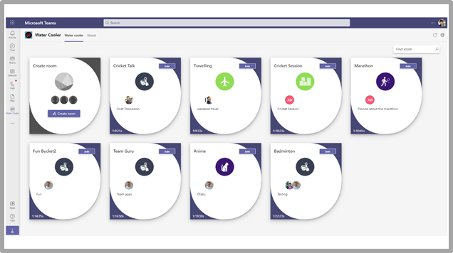
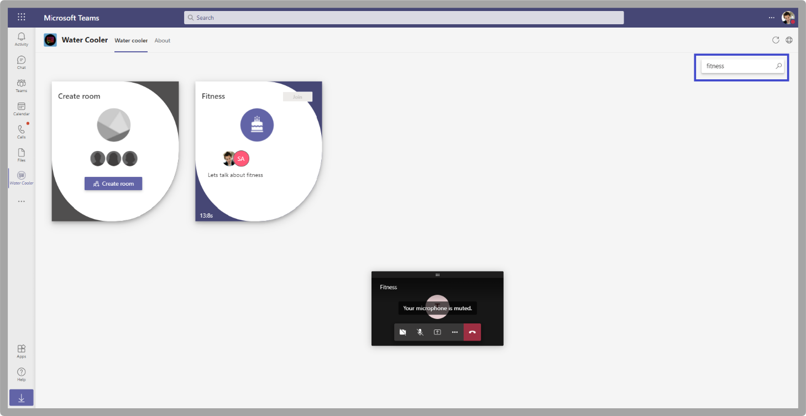

# App-Vorlagen für Microsoft Teams

App-Vorlagen sind Beispiele für vollständige Apps für Microsoft Teams, die Open Source sind und auf GitHub verfügbar sind. Jede App-Vorlage enthält detaillierte Anweisungen für die Bereitstellung und Installation dieser App für Ihre Organisation. Außerdem wird eine Beispiel-App bereitgestellt, die Sie sofort installieren und verwenden können. Der vollständige Quellcode ist ebenfalls verfügbar, sodass Sie ihn im Detail untersuchen oder den Code verzweigen und an Ihre spezifischen Anforderungen anpassen können.
Alle App-Vorlagen werden unter den [MIT-Lizenzbedingungen](https://github.com/OfficeDev/microsoft-teams-apps-eprescription/blob/master/LICENSE) bereitgestellt.

> [!NOTE] 
> Sie müssen Apps, die aus App-Vorlagen für Ihre Benutzer und Organisationen erstellt wurden, lizenzieren und unterstützen.

**&#9734; Gibt neu veröffentlichte App-Vorlagen an.**

### Wichtige Vorteile

* **Direkte Bereitstellung in der Cloud:** Alle App-Vorlagen enthalten Bereitstellungsskripts, mit denen Sie alle erforderlichen Dienste in Microsoft Azure oder der Power Platform hosten können. 
* **Empfohlener Beispielcode:** Die App-Vorlagen entsprechen den empfohlenen bewährten Methoden für Sicherheit und Infrastruktur. Alle von der Community übermittelten Änderungen an den App-Vorlagen werden überprüft, um die Konformität sicherzustellen.
* **Anpassbar und erweiterbar:** Während alle App-Vorlagen mit minimaler Konfiguration bereitgestellt werden, werden die gesamte Codebasis und Bereitstellungsskripts bereitgestellt, sodass Sie sie einfach anpassen oder an Ihre individuellen Anforderungen erweitern können.
* **Ausführliche Dokumentation:** Alle App-Vorlagen werden von einer End-to-End-Dokumentation zu Lösungsarchitektur, Bereitstellung und Konfigurationsschritten begleitet.  

## Einführungs-Bot 

Adoption Bot ist ein Benutzer-Care-Chat-Bot, der mit Power Virtual Agent für Teams PVA erstellt wurde. Sie wird als PVA-Version von FAQ Plus betrachtet. Adoption Bot beantwortet mehr als 100 allgemeine Fragen zu Microsoft 365 und Teams. Sie können die vorhandenen Themen bearbeiten, Eigene Themen hinzufügen und vorhandene HÄUFIG gestellte Fragen erfassen. Wenn Benutzer zusätzliche Hilfe benötigen, kann der Einführungsbot sie mit Experten verbinden oder sogar auf offene Servicetickets mit Premium-Flow-Connectors erweitert werden. Dieser Bot ist selbst installiert oder in eine benutzerdefinierte App integriert, z. B. den [Einführungshub.](https://github.com/akporzondek/adoption_hub)

[Get it on GitHub](https://github.com/OfficeDev/microsoft-teams-apps-adopt-bot)

## Einführungstool – Champion Management Platform &#9734;

Die Vorlage der Champion Management Platform (CMP)-App hilft Ihnen, Ihre Teamarbeitspionier zu verwalten, zu skalieren und zu inspirieren, um mehr zu erreichen. Diese App-Vorlage basiert auf dem SharePoint-Framework und wird in eine Registerkarte innerhalb eines Teams geladen. Gruppen können dieses Tool nutzen, um die Programmmitgliedschaft zu verwalten, eine Bestenliste und Ereignistypen für die Protokollierung bereitzustellen und Tools zum Überlagern digitaler Badges an Programmteilnehmer bereitzustellen.

[Get it on GitHub](https://github.com/OfficeDev/microsoft-teams-apps-champion-management)

## Einführungstool– Microsoft 365 Learning Pfade (Erste Schritte) &#9734;

Mit der Erste Schritte App-Vorlage können Sie die Leistungsfähigkeit Microsoft 365 Lernpfade innerhalb von Microsoft Teams nutzen. Mit dieser App-Vorlage können Sie einfachen Zugriff auf bestimmte Schulungsseiten oder andere Intranetressourcen gewähren und die Inhalte direkt innerhalb Teams laden. Sie können den App-Namen oder das Logo auch so ändern, dass er ihrem Unternehmensbranding entspricht.

[Get it on GitHub](https://github.com/msft-teams/tools/tree/master/M365%20Learning%20Pathways)

## Termin-Manager 

Appointment Manager ist eine Teams App-Vorlage, die Unternehmen dabei unterstützt, virtuelle Termine mit Verbrauchern über Teams zu erstellen, zu verwalten und durchzuführen. Neue Terminanfragen von Verbrauchern sind in Teams Kanälen sichtbar, wo sie schnell zugewiesen und mitarbeitern in einem Team zugewiesen werden. Terminanfragen werden auf Team- oder persönlicher Ebene über benutzerdefinierte Registerkarten angezeigt. Jeder Termin ist mit einer Teams Onlinebesprechung verknüpft, daher können Mitarbeiter und Verbraucher einfach zur geplanten Zeit an der Besprechung teilnehmen.

Die App-Vorlage kann zur einfachen Terminverwaltung in Microsoft Bookings integriert werden. Geplante Termine werden automatisch in den Kalendern der zugewiesenen Mitarbeiter angezeigt, und Verbraucher erhalten anpassbare E-Mail-Benachrichtigungen und Erinnerungen mit eingebetteten Besprechungslinks.

[Get it on GitHub](https://github.com/OfficeDev/microsoft-teams-apps-appointment-manager)

 

## Ask Away

Ask Away ist ein [Microsoft Teams Bot,](../bots/what-are-bots.md) mit dem Benutzer Fragen und Antworten durchführen können, die als Q&A-Sitzungen innerhalb Teams bezeichnet werden. Mit dem Ask Away-Bot können Teammitglieder Von Kollegen freigegebene Fragen übermitteln und abstimmen, sodass Q&A-Hosts ganz einfach Fragen von höchster Qualität in einem Kanal oder Chat sammeln können. Der Bot wird verwendet, um eine Echtzeit-Q-&A-Sitzung in einer Teams-Besprechung durchzuführen, und ermöglicht es Teilnehmern, Fragen live über den Chat zu übermitteln.

[Get it on GitHub](https://github.com/OfficeDev/microsoft-teams-apps-askaway)

:::row:::
  :::column span="2":::
      
:::column-end:::
:::row-end:::

## Assoziierte Einblicke

Associate Insights ist eine [Power Apps](/powerapps/maker/canvas-apps/embed-teams-app) Vorlage, mit der Mitarbeiter in Service und Produktion die Kundenmeinung, -gesinnung und -wahrnehmung direkt erfassen und übermitteln können. Mitarbeiter in Service und Produktion sind häufig der erste Mitarbeiter des Unternehmens, der mit Kunden an einem 1:1-Kontaktpunkt zusammenarbeiten kann. Die gesammelten Daten werden von Geschäftsteams gemeinsam genutzt und verwendet, z. B. über eine Power BI Teams Registerkarte, um die Produktverbesserung zu verbessern und die Benutzererfahrung zu verbessern.

[Get it on GitHub](https://github.com/OfficeDev/microsoft-teams-apps-associateinsights)

:::row:::
  :::column span="2":::
      
:::column-end:::
:::row-end:::
:::row:::
:::column span="2":::
    
:::column-end:::
:::row-end:::

## Anwesenheit

Die Anwesenheits-App ist eine [Power Apps](/powerapps/maker/canvas-apps/embed-teams-app) Registerkarte, die in einem Team angeheftet ist. Es wurde entwickelt, um Anwesenheitsinformationen in Einstellungen wie Lern- und Schulungsumgebungen zu erfassen. Benutzer können die Teilnahme für bis zu 30 Tage in der Vergangenheit markieren oder bearbeiten und zusammengefasste Anwesenheitsberichte für eine ganze Gruppe oder einzelne Teilnehmer anzeigen. Weitere Informationen zur Teilnahme an Teams finden Sie unter ["Abrufen" auf GitHub.](https://github.com/OfficeDev/microsoft-teams-apps-attendance)

In der folgenden Abbildung wird die Demo der Anwesenheits-App angezeigt:  

## Book-a-room

"Book-a-room" ist ein [Microsoft Teams Bot,](../bots/what-are-bots.md) mit dem Benutzer schnell einen Besprechungsraum für 30, 60 oder 90 Minuten ab dem aktuellen Zeitpunkt suchen und reservieren können. Die Standardzeit beträgt 30 Minuten. Der Book-a-Room-Bot umfasst persönliche oder 1:1-Unterhaltungen. Weitere Informationen zur Book-a-Room-App finden Sie unter ["Get it on GitHub."](https://github.com/OfficeDev/microsoft-teams-apps-bookaroom)  
In der folgenden Abbildung wird die Demo "Book-a-room" angezeigt:

## Gebäudezugriff

Building Access ist eine Microsoft [Power Platform-basierte](https://powerapps.microsoft.com/blog/now-in-preview-customize-teams-with-built-in-power-platform-capabilities/) App, die die Verwaltung von Schwellenwerten für die Erstellung von Sicherheitslücken und sozialen Abgrenzungsnormen unterstützt, indem Es Einrichtungen-Directors ermöglicht, die Anwesenheit von Mitarbeitern vor Ort zu verwalten, nachzuverfolgen und zu melden. Die App, die mit Microsoft [Power Apps](/powerapps/powerapps-overview)und [Power Automate](/power-automate/getting-started)erstellt wurde, ist tief in Microsoft Teams integriert und ermöglicht Es Organisationen, die Bereitschaft zum Aufbau zu bestimmen, Kriterien für die Berechtigung für den Zugriff vor Ort festzulegen und Einblicke für die zukünftige Planung zu sammeln.

[Get it on GitHub](https://github.com/OfficeDev/microsoft-teams-apps-buildingaccess)

:::row:::
   :::column span="":::
     
   :::column-end:::
   :::column span="":::
      
   :::column-end:::
:::row-end:::

## Feiern

Bei "Ehrungen" handelt es sich um eine Teams-App, die Teammitgliedern dabei hilft, ihre Geburtstage, Jahrestage und andere wiederkehrende Ereignisse zu begehen. Es erinnert sich an besondere Gelegenheiten aller Teammitglieder und sendet eine freundliche Nachricht in allen Teams, die zum Zeitpunkt der Ereigniserstellung ausgewählt wurden, damit die Teammitglieder sich an ihrem Tag besonders fühlen.

Die App bietet allen Teammitgliedern eine einfache Benutzeroberfläche zum persönlichen Hinzufügen und Anzeigen ihrer Ereignisse und ermöglicht es dem Benutzer, die Teams auszuwählen, in denen die Ereignisse freigegeben werden.

[Get it on GitHub](https://github.com/OfficeDev/microsoft-teams-celebrations-app)

## Checkliste

Prüfliste ist eine benutzerdefinierte Microsoft Teams [Messaging-Erweiterungs-App,](../messaging-extensions/what-are-messaging-extensions.md) mit der Sie mit Ihrem Team zusammenarbeiten können, indem Sie eine freigegebene Checkliste in einem Chat oder Kanal erstellen. Die App wird auf allen Teams Plattformclients unterstützt, z. B. Desktopbrowser, iOS und Android. Die App ist bereit für die Bereitstellung als Teil Ihres Microsoft 365-Abonnements.  

[Get it on GitHub](https://github.com/OfficeDev/microsoft-teams-checklist-app)

:::row:::
:::column span="2":::
      
:::column-end:::
:::row-end:::

## Kursraum-Drop-In 

Classroom Drop-in ist eine Microsoft [Power Platform-basierte](https://powerapps.microsoft.com/blog/now-in-preview-customize-teams-with-built-in-power-platform-capabilities/)App, die Es Systemleitern ermöglicht, Kursteams zu finden, bedeutet virtuelle Kursräume und sich selbst oder andere zu diesen Kursteams für einen bestimmten Drop-In-Zeitraum hinzuzufügen, je nach Bedarf. Die App, die mitHilfe von Microsoft [Power Apps](/powerapps/powerapps-overview) und [Power Automate](/power-automate/getting-started)erstellt wurde, ist tief in Microsoft Teams integriert, um sicherzustellen, dass Bildungseinrichtungen ihre Vorgänge in einer hybriden Lernumgebung optimieren können, indem sie Den Zugriff auf relevante Projektbeteiligten für Kursteams gemäß den Geschäftsanforderungen bietet.

[Get it on GitHub](https://github.com/OfficeDev/microsoft-teams-apps-classroom-dropin)

## Unternehmens-Communicator

Die Unternehmens-Communicator-App ermöglicht es Unternehmensteams, Nachrichten zu erstellen und zu senden, die für mehrere Teams oder eine große Anzahl von Mitarbeitern per Chat vorgesehen sind, sodass die Organisation Mitarbeiter direkt dort erreichen kann, wo sie zusammenarbeiten. Nutzen Sie diese Vorlage für mehrere Szenarien, z. B. Ankündigungen neuer Initiativen, Mitarbeiter-Onboarding, modernes Lernen und Entwicklung oder organisationsweite Übertragungen.

Die App bietet eine einfache Benutzeroberfläche für festgelegte Benutzer zum Erstellen, Anzeigen einer Vorschau, Zusammenarbeit und Senden von Nachrichten.

Es bietet eine Grundlage zum Erstellen von benutzerdefinierten, gezielten Kommunikationsfunktionen, z. B. benutzerdefinierte Telemetrie darüber, wie viele Benutzer eine Nachricht bestätigt oder mit dieser interagiert haben.

[Get it on GitHub](https://github.com/OfficeDev/microsoft-teams-company-communicator-app)

## Kontaktgruppen-Nachschlagevorgang

Die Kontaktgruppen-Nachschlage-App bietet einen praktischen und nützlichen Ansatz zum Erstellen, Zugreifen und Verwalten der Kontaktgruppen Ihrer Organisation, die früher als Verteilerlisten oder Kommunikationsgruppen bezeichnet wurden. Benutzer können schnell Gruppenmitglieder anzeigen und mit ihnen chatten, den Mitgliederstatus anzeigen und einen Gruppenchat mit ausgewählten Mitgliedern in der Kontaktgruppe erstellen, alles innerhalb der Teams Umgebung.

[Get it on GitHub](https://github.com/OfficeDev/microsoft-teams-app-contactgrouplookup)

:::row:::
:::column span="2":::
      
:::column-end:::
:::row-end:::
:::row:::
:::column span="2":::
    
:::column-end:::
:::row-end:::

## Kollegen ( Co-Worker- Und Arbeitskraft) 

Mithilfe der Vorlage "Mitarbeiterarbeitshilfe" in Microsoft Teams können Benutzer die Erfolge ihrer Kollegen im Kontext der Teams erkennen. Wenn Kollegen auswählen, einen Kollegen zu beloben, werden Empfänger und andere Teammitglieder in einer Kanalunterhaltung markiert und erhalten eine Benachrichtigung über die Preisdetails des Kanals. Die Preise werden in der Teams-App aufgezeichnet, die sicher, portierbar und leicht freigabefähig ist. Dies wird als die PowerApps-basierte Version der Open Badges-App-Vorlage mit einer Bestenliste betrachtet.

[Get it on GitHub](https://github.com/OfficeDev/microsoft-teams-apps-coworker-appreciation)

## CrowdSourcer

CrowdSourcer ist ein [Microsoft Teams Bot, der](../bots/what-are-bots.md) Teams abgefragte Informationen bereitstellt, die von Gruppenmitgliedern gemeinsam abgerufen werden. Es hilft ihnen, häufig gestellte Fragen zu beantworten und den Teilnehmern zu ermöglichen, sich aktiv zu engagieren und zu einer interessanten und hilfreichen Informationsressource beizutragen.

[Abrufen auf GitHub](https://github.com/OfficeDev/microsoft-teams-crowdsourcer-app)

## Custom Stickers

Self-Expression ist der Kern einer fehlerfreien Teamkultur. Diese App-Vorlage ist eine [Messaging-Erweiterung,](~/messaging-extensions/what-are-messaging-extensions.md) mit der Ihre Benutzer benutzerdefinierte Aufkleber und GIFs innerhalb Microsoft Teams verwenden können. Diese Vorlage bietet eine einfache webbasierte Konfigurationsumgebung, bei der jeder Benutzer mit Konfigurationszugriff gifs, Aufkleber und Bilder hochladen kann, die seine Benutzer haben sollen, sodass Ihr gesamtes Team eine beliebige Gruppe von Stickern verwenden kann.

Diese App ermöglicht auch die einfache Freigabe von Bildern, GIFs und Aufklebern in teamsweit, ohne zugriff auf SharePoint Websites oder einzelne Kanäle als Speicher- und Freigabemechanismen zu benötigen. Beispielsweise können Produktteams ganz einfach Produktbilder und GIFs programmgesteuert für Soziale Medien, Marketing und Vertriebsteams freigeben. Sie können diese App auch erweitern, indem sie einen Benachrichtigungsfluss für bestimmte Teams oder Einzelpersonen auslöst, wenn neue Bilder und GIFs verfügbar gemacht werden.

[Get it on GitHub](https://github.com/OfficeDev/microsoft-teams-stickers-app)

## Ideen für Mitarbeiter

Die App "Mitarbeiterideen" ist die PowerApps-Version der Azure-basierten App-Vorlage "Großartige Ideen". Die App ermöglicht es Teams Benutzern, eine Ideenkampagne einzurichten und zu konfigurieren. Eine Ideenkampagne ist eine Kategorie zum Gruppieren von Ideen zu allgemeinen Designs.

Teams Benutzer können auch die folgenden Aktivitäten ausführen:

* Konfigurieren Sie ein Standardübermittlungsformular, das Mitarbeiter für jede Idee übermitteln müssen. 
* Überprüfen und verwalten Sie die Ideen und die Liste der Kampagnen.
* Ändern und Löschen von Kampagnen.
* Überprüfen Sie die Ideen der Leiter.
* Stimmen Sie für priorisierte Ideen, und teilen Sie sie.
* Übermitteln von Ideen für eine Kampagne.
* Sehen Sie sich die Idee eines anderen Teammitglieds an.
* Stimmen Sie über die am häufigsten verwendeten Ideen ab.
* Überprüfen Sie die Leistung ihrer Ideen im Vergleich zu anderen innerhalb einer Kampagne.

[Get it on GitHub](https://github.com/OfficeDev/microsoft-teams-apps-employeeideas)

 

## E-Rezepturen 

E-Installe ist eine [Power Apps-basierte](/powerapps/maker/canvas-apps/embed-teams-app) App, die telesankodierende und virtuelle Pflege verbessert, indem der Prozess der Ausgabe von E-Rezepten für Patienten automatisiert wird. Medizinische Experten können Termine schnell überprüfen, E-Mails generieren und E-Mails mit E-Mails an Patienten direkt innerhalb der Teams-Plattform senden.

[Get it on GitHub](https://github.com/OfficeDev/microsoft-teams-apps-eprescription) 

:::row:::
:::column span="2":::
      
:::column-end:::
:::row-end:::
:::row:::
:::column span="2":::
    
:::column-end:::
:::row-end:::

## Mitarbeiterschulung 

Die Mitarbeiterschulung ist eine Microsoft Teams-App, mit der Organisatoren Lern- und Schulungsereignisse für Ihre Organisation ganz einfach veröffentlichen, nachverfolgen und bewerben können.  Mit der App können Ereignisplaner Erinnerungen und Benachrichtigungen an Ereigniskalender senden, und Mitarbeiter können auf Interesse an bevorstehenden Ereignissen hinweisen, über aktuelle Ereignisse auf dem Laufenden bleiben und Ereignisdetails mit Kollegen über die Teams Messaging-Erweiterung teilen.

[Get it on GitHub](https://github.com/OfficeDev/microsoft-teams-apps-employeetraining)

:::row:::
:::column span="2":::
    **Anzeigen von Schulungsereignissen**   
:::column-end:::
:::row-end:::
:::row:::
:::column span="2":::
    **Erstellen eines Mitarbeiterschulungsereignisses** 
:::column-end:::
:::row-end:::

## Expertensuche

Expert Finder ist ein [Microsoft Teams Bot,](../bots/what-are-bots.md) der bestimmte Organisationsmitglieder basierend auf ihren Fähigkeiten, Interessen und Bildungsattributen identifiziert. Mitglieder finden Experten innerhalb einer Organisation, die mit einer Stichwortsuche von Azure Active Directory Benutzerprofilen übereinstimmen.

[Get it on GitHub](https://github.com/OfficeDev/microsoft-teams-apps-expertfinder)

## FAQ Plus

Unterhaltungs-F&A-Bots sind eine einfache Möglichkeit, Antworten auf häufig gestellte Fragen von Benutzern bereitzustellen. Die meisten Bots können jedoch nicht auf sinnvolle Weise mit Benutzern interagieren, da sich kein Menschen in der Schleife befindet, wenn der Bot fehlschlägt. Faq bot is a friendly Q&A bot that brings a human in the loop when it is unable to help. Man kann dem Bot eine Frage stellen, und der Bot antwortet mit einer Antwort, wenn er in der Wissensdatenbank enthalten ist. Wenn dies nicht der Fall ist, ermöglicht der Bot dem Benutzer, eine Abfrage zu übermitteln, die dann in ein vorkonfiguriertes Team von Experten gepostet wird, die zur Unterstützung beitragen, indem sie auf die Benachrichtigungen innerhalb des Teams selbst reagieren.

> [!NOTE]
> Die neueste Version von **FAQ Plus** unterstützt verbesserte Q&A-Lösungen, indem ein Expertenteam folgende Aufgaben ausführen kann:
>
> &#x2714; Fügen Sie der Knowledge Base mithilfe von Nachrichtenerweiterungen neue Q&As direkt hinzu.
>
> &#x2714; Bearbeiten und Löschen von Q-&A-Paaren, die von einem Bot hinzugefügt wurden.
>
> &#x2714; Nachverfolgen des Überarbeitungsverlaufs von Q&As.
>
> &#x2714; Konfigurieren sie eine Antwort mit zusätzlichen Details, die als [adaptive Karte](../task-modules-and-cards/cards/cards-reference.md#adaptive-card)angezeigt werden sollen.
>
[Get it on GitHub](https://github.com/OfficeDev/microsoft-teams-apps-faqplusv2)

## Support-App abrufen

Die App "Support abrufen" wird von Organisationen verwendet, die Microsoft Teams verwenden, um es allen Benutzern zu ermöglichen, Unterstützung von Vorgesetzten anzufordern. Diese App enthält die folgenden Features:
* Anfordern von Unterstützung für verschiedene Kategorien aus einer Power App.
* Benachrichtigungen, die an Anforderer gesendet werden und sie darüber informieren, wer hase zugewiesen hat.
* Benachrichtigungen, die an zugewiesene Vorgesetzte gesendet werden und sie darüber informieren, wer Unterstützung benötigt. 
* Analysieren von Eskalationen und Mustern in SharePoint und PowerBI.S.

[Get it on GitHub](https://github.com/OfficeDev/microsoft-teams-app-get-support/)

## Zielverfolgung

Die Zielverfolgungs-App ist eine umfassende Lösung für Ihre Organisation, um die Festlegung von Zielen, das Beobachten des Fortschritts und das Bestätigen des Erfolgs innerhalb Microsoft Teams zu unterstützen. Die App ermöglicht es Benutzern, Ziele auf beruflicher, persönlicher und Teamebene festzulegen, nachzuverfolgen und zu aktualisieren. Teammitglieder erhalten auch rechtzeitig Erinnerungen und Statusaktualisierungen, um konzentriert zu bleiben und auf dem Laufenden zu bleiben.

[Get it on GitHub](https://github.com/OfficeDev/microsoft-teams-app-goaltracker)

:::row:::
  :::column span="2":::
      
:::column-end:::
:::row-end:::
:::row:::
:::column span="2":::
    
:::column-end:::
:::row-end:::

## Großartige Ideen

Die Great Ideas-App unterstützt und unterstützt Innovation und Kreativität in Ihrer Organisation. Die App ermöglicht Es Ihren Mitarbeitern, Ideen mit Kollegen und Führungskräften zu teilen, neue Übermittlungen zu entdecken, Beiträge für Peer-Berücksichtigung ins Blickpunkt zu setzen und ihre Stimme für die besten Vorschläge innerhalb Microsoft Teams zu geben.

[Get it on GitHub](https://github.com/OfficeDev/microsoft-teams-apps-greatideas)

:::row:::
  :::column span="2":::
      
:::column-end:::
:::row-end:::
:::row:::
:::column span="2":::
    
:::column-end:::
:::row-end:::

## Gruppenaktivitäten

"Gruppenaktivitäten" ist eine Microsoft Teams-App, die es Teambesitzern erleichtert, schnell Aktivitätsgruppen zu erstellen und Workflows für die Zusammenarbeit im Kontext von Microsoft Teams zu verwalten. Aktivitätsautoren können Aktivitäten erstellen, Teammitglieder nach dem Zufallsprinzip in Gruppen verteilen und optional vom Bot Erinnerungen senden lassen, bis die Aktivitäten abgeschlossen sind.

[Get it on GitHub](https://github.com/OfficeDev/microsoft-teams-apps-groupactivities)

:::row:::
  :::column span="2":::
      
:::column-end:::
:::row-end:::
:::row:::
:::column span="2":::
    
:::column-end:::
:::row-end:::

## Gruppen-Verbinden &#9734;

"Gruppen-Verbinden" ist eine Microsoft Teams-App, die Organisationsmitgliedern hilft, Mitarbeitergruppen zu finden und informationen zu finden, die für Mitarbeitergruppen relevant sind. Die App ist mit umfangreichen Funktionen für Organisationsleiter integriert, um mit ihren Mitarbeitern über Gruppen, Ereignisse und Ressourcen zu kommunizieren. Die Gruppen-Verbinden-App gleicht auch Gruppenmitglieder bei der gewünschten Häufigkeit miteinander ab, um netzwerke und den Innerbetrieb innerhalb einer Gruppe zu fördern. Weitere Informationen dazu, wie Sie die Gruppen-Verbinden-App nutzen können, um Mitarbeitergruppen in Ihrer Organisation zu unterstützen, finden Sie in der App auf GitHub.

[Get it on GitHub](https://github.com/OfficeDev/microsoft-teams-apps-groupconnect)

## Erweitern Sie Ihre Fähigkeiten

Die App "Ihre Fähigkeiten erweitern" unterstützt das professionelle Wachstum und die Entwicklung, indem mitarbeiter in die Lage versetzt werden, an ergänzenden Projekten für Ihre Organisation mitzuwirken und gleichzeitig neue Fähigkeiten zu erlernen. Mitarbeiter können die App verwenden, um Möglichkeiten zu finden, die ihren Interessen entsprechen, eine sinnvolle Zusammenarbeit mit Kollegen zu genießen und neue Erfahrungs- und Fähigkeitenniveaus innerhalb der Teams Umgebung zu erwerben.

[Get it on GitHub](https://github.com/OfficeDev/microsoft-teams-apps-growyourskills)

:::row:::
  :::column span="2":::
      
:::column-end:::
:::row-end:::
:::row:::
:::column span="2":::
    
:::column-end:::
:::row-end:::

## HR Support

Der HR-Support-Bot ist ein freundlicher Q-&Ein Bot, der einen Support-Experten oder Experten aus dem HR-Team in die Schleife bringt, wenn er nicht helfen kann. Man kann dem Bot eine Frage stellen, und der Bot antwortet mit einer Antwort, wenn er in der Wissensdatenbank enthalten ist. Wenn dies nicht der Fall ist, ermöglicht der Bot dem Benutzer, eine Abfrage zu übermitteln, die dann in einem vorkonfigurierten Team von Experten veröffentlicht wird, die bei der Unterstützung helfen, indem sie auf die Benachrichtigungen innerhalb ihres Teams selbst reagieren. Darüber hinaus schlägt der Bot Links zu empfohlenen HR-Richtlinien oder Fragen vor, indem er nach vorkonfigurierten Tags in der Frage sucht. Diese Kacheln finden Sie auf der zugeordneten Registerkarte als Kurzübersicht. Der Personalsupport eignet sich gut für eine leichte Q-&A und bietet schnellen Support beim Starten neuer Projekte oder Initiativen in der Organisation.

[Get it on GitHub](https://github.com/OfficeDev/microsoft-teams-hrsupport-app)

## Icebreaker

Icebreaker ist ein [Microsoft Teams Bot,](../bots/what-are-bots.md) der Ihrem Team hilft, sich näher zu kommen, indem jede Woche zwei zufällige Teammitglieder zusammenkommen, um sich zu treffen. Der Bot erleichtert die Planung, indem er automatisch freie Zeiten vorschlägt, die für beide Mitglieder funktionieren. Stärken Sie persönliche Verbindungen, und erstellen Sie mit dieser App eine engmaschige Community.

Neben der Förderung persönlicher Verbindungen in Ihrem gesamten Team kann die Icebreaker-App dazu beitragen, interessenbasierte Communitys in Ihrer Organisation zu fördern. Sie können diese App beispielsweise für eine DevOps Interessengruppen verwenden, um Ideen und bewährte Methoden organisch in Ihrer Organisation zu unterstützen.

[Get it on GitHub](https://github.com/OfficeDev/microsoft-teams-icebreaker-app)

## Anreize

Incentives ist eine [Power Apps](/powerapps/maker/canvas-apps/embed-teams-app) Vorlage, die die Anreizteilnahme von Mitarbeitern an bestimmten Aktivitäten wie Schulungen und Change Management-Initiativen verwaltet und verfolgt. Administratoren verwenden die App, um festgelegte Aktivitäten einzurichten, Punkte für den Abschluss zuzuweisen und die erforderlichen Berechtigungspunkte für Diebesungen anzugeben. Mitarbeiter verwenden die App, um ihre gesammelten Punkte anzuzeigen und nach Erreichen der Berechtigung einlösbare Preise anzufordern und in Anspruch zu nehmen.

[Get it on GitHub](https://github.com/OfficeDev/microsoft-teams-apps-incentives)

## Vorfallbericht

Incident Reporter ist ein [Microsoft Teams Bot,](../bots/what-are-bots.md) der die Verwaltung von Vorfällen in Ihrer Organisation optimiert. Der Bot erleichtert die automatisierte Sammlung von Vorfalldaten, angepasste Vorfallberichte, relevante Benachrichtigungen von Beteiligten und die End-to-End-Vorfallverfolgung.

[Get it on GitHub](https://github.com/OfficeDev/microsoft-teams-apps-incidentreport)

:::row:::
  :::column span="2":::
      
:::column-end:::
:::row-end:::
:::row:::
:::column span="2":::
    
:::column-end:::
:::row-end:::

## Inspektion 

 Bei der Überprüfung handelt es sich um eine Microsoft Teams-App, mit der Mitarbeiter in Service und Produktion alles überprüfen können, von Standorten bis hin zu Objekten und Geräten. Beispielsweise ein Einzelhandelsgeschäft, eine Produktionsanlage oder Ein- und Maschinen. Es gibt zwei Apps in dieser Lösung, die jeweils für unterschiedliche Benutzertypen vorgesehen sind.

Die App ermöglicht es Den Mitarbeitern der Ersten Reihe, ein Objekt oder einen Bereich zu überprüfen, die Qualität von Produkten und Diensten zu verwalten oder die Sicherheit am Arbeitsplatz zu gewährleisten. Es erleichtert die Kommunikation zwischen Teammitgliedern, um Probleme zu beheben, die während der Überprüfung gefunden werden. Die App stellt einfache Berichte für Manager bereit, um die Problembehebung zu beschleunigen und Trends hervorzuheben.

[Get it on GitHub](https://github.com/OfficeDev/microsoft-teams-apps-inspection)

   

## Problemberichterstattung

Die Problemberichterstattungs-App ermöglicht es Mitarbeitern und Vorgesetzten, Probleme zu lösen und zu verwalten. Es besteht aus zwei Apps, der Problemberichterstattungs-App zum Melden von Problemen und der App "Probleme verwalten" zum Verwalten von Problemen.

Die Teammanager verwenden die App "Probleme verwalten", um die App-Erfahrung zu konfigurieren, einschließlich des Kanals, in dem Microsoft Teams Nachrichten und Planner-Aufgaben von der App erstellt werden. Manager verwenden die App auch, um Vorlagenformulare zu erstellen, um Details zu sammeln, wenn ein Benutzer ein Problem meldet. Beispiel: Überprüfen, Bearbeiten oder Löschen von Vorlagenformularen für Probleme. Die App wird auch verwendet, um Teamprobleme zu überprüfen, den Problemverlauf zu melden und die Problemlösung effizient zu verwalten.

Die Mitarbeiter verwenden die Problemberichterstattungs-App, um Probleme und Details zu protokollieren, die zur Behebung erforderlich sind. Die App wird auch verwendet, um vorhandene Probleme zu ändern und zu beheben und eine allgemeine Übersicht über Einzelne oder Teamprobleme zu erhalten.

[Get it on GitHub](https://github.com/OfficeDev/microsoft-teams-apps-issuereporting)

  

## Onboarding neuer Mitarbeiter 

Das Onboarding neuer Mitarbeiter ist eine integrierte Microsoft Teams und [SharePoint Onboarding-Lösung](https://lookbook.microsoft.com/details/75e60a32-9849-4ed4-b83e-b2b08983ad19) für neue Mitarbeiter, die es Ihrer Organisation ermöglicht, mitarbeitern auf ihrer Neueinstellungen-Reise eine konsistente, qualitativ hochwertige Onboarding-Erfahrung zu bieten. Die App wird von Personalteams und Einstellungsmanagern verwendet, um relevante Informationen während des Orientierungs- und Einführungsprozesses bereitzustellen, und von Neueinstellungen, um Feedback zu teilen, Einführungen bereitzustellen und Onboarding-Aufgaben auszuführen.

[Get it on GitHub](https://github.com/OfficeDev/microsoft-teams-apps-newemployeeonboarding)

:::row:::
  :::column span="2":::
    Willkommenskarte für **neue Mitarbeiter** 
:::column-end:::
:::row-end:::
:::row:::
:::column span="2":::
    Prüfliste für **neue Mitarbeiter**   
:::column-end:::
:::row-end:::

## Offene Badges

Open Badges ist eine Microsoft Teams-App, mit der Einzelpersonen digitale Lernanmeldeinformations-Badges im Teams Kontext erwerben und sie überall freigeben können. Mithilfe der Funktionen der Externen-Zertifizierungsstelle für digitale Badges, [Badgr,](https://badgr.org/)werden die ausgestellten Badges im Badgr-Profil eines Empfängers aufgezeichnet und stehen zur Verfügung, um ein umfassendes Bild der Lebenszeit-Lernerfahrungen zu erstellen und zu teilen.

[Get it on GitHub](https://github.com/OfficeDev/microsoft-teams-apps-openbadges)

:::row:::
  :::column span="2":::
      
:::column-end:::
:::row-end:::
:::row:::
:::column span="2":::
    
:::column-end:::
:::row-end:::

## Umfrage 

Poll ist eine benutzerdefinierte Microsoft Teams [Messaging-Erweiterungs-App,](../messaging-extensions/what-are-messaging-extensions.md) mit der Sie schnell Umfragen in einem Chat oder Kanal erstellen und senden können, um Teammeinungen und -einstellungen zu sammeln. Die App wird auf allen Teams Plattformclients wie Desktop, Browser, iOS und Android unterstützt und kann als Teil Ihres Microsoft 365-Abonnements bereitgestellt werden.

[Get it on GitHub](https://github.com/OfficeDev/microsoft-teams-poll-app)

:::row:::
  :::column span="1":::
      
:::column-end:::
:::row-end:::

## Schnelle Antworten

Quick Responses ist eine Microsoft Teams-App, die eine robuste Lösung für die effektive Beantwortung häufig gestellter Fragen von Benutzern bietet. Anstatt jede Abfrage manuell und kontinuierlich zu wiederholen, erstellt die App eine Bibliothek mit Antworten für eine interaktive Benutzeroberfläche über Teams [Messaging-Erweiterungen.](../messaging-extensions/what-are-messaging-extensions.md)

[Get it on GitHub](https://github.com/OfficeDev/microsoft-teams-apps-quickresponses)

## Quiz &#9734;

Quiz ist eine benutzerdefinierte [Teams Messaging-Erweiterungs-App,](../messaging-extensions/what-are-messaging-extensions.md) mit der Sie ein Quiz innerhalb eines Chats oder Kanals für die Wissensüberprüfung und sofortige Ergebnisse erstellen können. Sie können Quiz für Kurs- und Offlineprüfungen, die Wissensüberprüfung innerhalb eines Teams und für unterhaltungsbezogene Quizfragen innerhalb eines Teams verwenden. Quiz-App wird auf mehreren Plattformen unterstützt, z. B. Teams Desktop-, Browser-, iOS- und Android-Clients. Diese App ist bereit für die Bereitstellung als Teil Ihres vorhandenen Microsoft 365 Abonnements.

[Get it on GitHub](https://github.com/OfficeDev/microsoft-teams-apps-quiz)

:::row:::
  :::column span="1":::
      
:::column-end:::
:::row-end:::

## Rapid Assist

Rapid Assist ist eine Microsoft [Power Platform-basierte](https://powerapps.microsoft.com/blog/now-in-preview-customize-teams-with-built-in-power-platform-capabilities/) App, die es Mitarbeitern mit Kunden ermöglicht, sich schnell mit den Experten zu verbinden, um schnelle Antworten zu erhalten, nach Informationen zu suchen, offene Anforderungen zu verfolgen und Experten zu ermöglichen, Benachrichtigungen zu erhalten, um schnell einen Anruf zu erhalten, um Fragen zu beantworten. Die App, die mit Microsoft [Power Apps](/powerapps/powerapps-overview) und [Power Automate](/power-automate/getting-started)erstellt wurde, ist tief in Microsoft Teams integriert, damit Organisationen Mitarbeiter in Service und Produktion problemlos mit Unternehmenskontakten verbinden können, um Kundenanfragen zu lösen und eine hervorragende Kundenerfahrung zu bieten. 

[Get it on GitHub](https://github.com/OfficeDev/microsoft-teams-apps-rapid-assist)

:::row:::
   :::column span="":::
     
   :::column-end:::
   :::column span="":::
      
   :::column-end:::
:::row-end:::

## Spiegeln 

Reflect ist eine benutzerdefinierte Microsoft Teams [Messaging-Erweiterungs-App,](../messaging-extensions/what-are-messaging-extensions.md) die eine sichere und inklusive Ressource für Ihre Teammitglieder bereitstellt, um den Zustand ihres gefühlsmäßigen Wohlbefindens mit Kollegen oder Gruppenleitern direkt innerhalb Teams zu teilen. Die App ist in Kanal-, Gruppen-, Besprechungs- und 1:1-Chats verfügbar, und die Eincheckantwort ist auf öffentliche, private oder vollständig anonyme Chats festgelegt.

[Get it on GitHub](https://github.com/OfficeDev/Microsoft-Teams-App-Reflect)

:::row:::
    :::column:::
    **Umfrage zum Wohlbefinden**
    
    
    :::column-end:::
:::row-end:::

## Remoteunterstützung

Remote support is a [Microsoft Teams bot](../bots/what-are-bots.md) that provides a focused interface between support requesters throughout your organization and the internal support team.  Endbenutzer können Supportanfragen übermitteln, bearbeiten oder widerrufen, und das Supportteam kann Anfragen innerhalb der Teams Plattform beantworten, verwalten und aktualisieren.

[Get it on GitHub](https://github.com/OfficeDev/microsoft-teams-apps-remotesupport)

:::row:::
  :::column span="2":::
      
:::column-end:::
:::row-end:::
:::row:::
:::column span="2":::
    
:::column-end:::
:::row-end:::

## Request-a-team

"Request-a-team" ist eine Microsoft Teams-App, die die Erstellung neuer Teams für Ihre Unternehmensorganisation optimiert. Die App unterstützt Standardisierung und bewährte Methoden beim Erstellen neuer Teaminstanzen durch die Integration eines assistentengeführten Anforderungsformulars, eines eingebetteten Genehmigungsprozesses, eines Anforderungsstatus-Dashboards und automatisierter Teambuilds.

[Get it on GitHub](https://github.com/OfficeDev/microsoft-teams-apps-requestateam)

:::row:::
  :::column span="2":::
    
:::column-end:::
:::row-end:::
:::row:::
:::column span="2":::
    
:::column-end:::
:::row-end:::

## Scrums für Kanäle

Bei "Scrums for Channels" handelt es sich um eine Assistant-App, mit der Benutzer Innerhalb Microsoft Teams Inserenten planen und ausführen können. Die App eignet sich hervorragend für Remoteteams und Teams, die aus Mitgliedern aus unterschiedlichen geografischen Standorten und Zeitzonen bestehen, um tägliche Updates zu teilen und die Teilnahme an Dropdown-Stand-Up-Besprechungen sicherzustellen.

[Get it on GitHub](https://github.com/OfficeDev/microsoft-teams-apps-scrumsforchannels)

> [!NOTE]
> Informationen zum Durchführen von Talkbesprechungen in einem Gruppenchat finden Sie in der App-Vorlage [für Chats für Gruppen.](#scrums-for-group-chat)

:::row:::
  :::column span="2":::
    
:::column-end:::
:::row-end:::
:::row:::
:::column span="2":::
    
:::column-end:::
:::row-end:::

## Scrums für Gruppenchat

> [!NOTE]
> Die App-Vorlage Für den Status von Scrums wird aktualisiert und ist jetzt "Scrums" für Den Gruppenchat.

Bei Der Chat für Gruppenchats handelt es sich um einen unterstützenden Assistenten für Gruppenchats, mit dem Gruppenchatmitglieder asynchrone Stand-Up-Besprechungen ausführen und ihre täglichen Updates problemlos freigeben können. Es ermöglicht allen Mitgliedern des Gruppenchats, einen Beitrag zum Talking zu leisten und die Von anderen im laufenden Talk vorgenommenen Updates anzuzeigen.

[Get it on GitHub](https://github.com/OfficeDev/microsoft-teams-apps-scrumsforgroupchat)

## Jetzt freigeben 

Die App "Jetzt freigeben" fördert den positiven Austausch von Informationen zwischen Kollegen, indem sie Es Ihren Benutzern ermöglicht, Inhalte innerhalb der Teams Umgebung einfach freizugeben. Benutzer binden die App ein, um interessante Elemente mit Teammitgliedern zu teilen, neue freigegebene Inhalte zu entdecken, Einstellungen festzulegen und Lesezeichenfavoriten für späteres Lesen zu markieren.

[Get it on GitHub](https://github.com/OfficeDev/microsoft-teams-apps-sharenow)

## SharePoint-Listensuche

Die Zusammenarbeit in Microsoft Teams verweist häufig auf Informationen, die in Elementen in einer SharePoint Liste enthalten sind. Wenn Sie einen Link zu dem betreffenden Element einfügen, wird jeder gezwungen, den Kontext von der Unterhaltung wegzuwechseln, die erforderlichen Informationen zu finden und dann zu Teams zurückzukehren, um die Unterhaltung fortzusetzen. Während die Unterhaltung fortgesetzt wird, müssen Die Benutzer mehrmals zum Referenzelement wechseln, um neue Kommentare zu überprüfen und ihre Bedeutung der im Element enthaltenen Informationen zu aktualisieren. Dieser Kontextwechsel schafft eine Barriere für eine reibungslose Zusammenarbeit.
Um dieses Problem zu beheben, wird die App-Vorlage für die Listensuche verwendet. Viele Benutzer verwenden SharePoint, um einige der wichtigsten Workflows in ihren Organisationen zu unterstützen. Die Zusammenarbeit an Listen ist jedoch schwierig. Mithilfe der Listensuche-App-Vorlage in Microsoft Teams können Benutzer Informationen aus SharePoint Listenelementen direkt in eine Chatunterhaltung einfügen, um das Kontextwechseln zu verringern, das beim einfachen Einfügen eines Links in einen Chat verursacht wird. Die Informationen werden als einfach zu lesende, automatisch formatierte Karte eingefügt, die den Benutzern hilft, sich an der Unterhaltung zu beteiligen.

[Get it on GitHub](https://github.com/OfficeDev/microsoft-teams-list-search-app)

## Einchecken von Mitarbeitern

Bei Mitarbeiter-Check-Ins handelt es sich um eine [Power Apps-basierte](/powerapps/powerapps-overview) App, die die Kommunikation zwischen Ihrem Unternehmen und Ihrem Außendienst ermöglicht. Mitarbeiter können zeitkritische Informationen und Statusupdates entweder auf geplanter oder Ad-hoc-Basis direkt von Teams bereitstellen. Die App unterstützt Echtzeitspeicherort, Fotos, Notizen, Erinnerungsbenachrichtigungen und automatisierte Workflows.

[Get it on GitHub](https://github.com/OfficeDev/microsoft-teams-apps-staffcheckins)

## Umfrage

Umfrage ist eine benutzerdefinierte Microsoft Teams [Messaging-Erweiterungs-App,](../messaging-extensions/what-are-messaging-extensions.md) mit der Sie eine Umfrage in einem Chat oder Kanal erstellen können, um Daten zu sammeln und umsetzbare Einblicke zu erhalten. Die App wird auf allen Teams Plattformclients wie Desktop, Browser, iOS und Android unterstützt und kann als Teil Ihres Microsoft 365-Abonnements bereitgestellt werden.  

[Get it on GitHub](https://github.com/OfficeDev/Microsoft-Teams-Survey-app)

:::row:::
  :::column span="2":::
    
:::column-end:::
:::row-end:::

## Time Tally 

Ein Projekt kann mehrere Aufgaben umfassen, und mitarbeitern können verschiedene Projekte zugewiesen werden. Vorgesetzte müssen den Projektfortschritt während der Zeit verstehen, die die Mitarbeiter für diese Aufgaben aufgewendet haben. Dies kann eine umständliche Aktivität sein, da die Mitarbeiter die Arbeitszeittabellen ausfüllen müssen. Mit der Time Tally-App können Mitarbeiter ihre Arbeitszeittabellen schnell ausfüllen, indem sie das mobile Gerät verwenden, und Vorgesetzte müssen sich nicht mit Mitarbeitern in der Arbeitszeittabelleneingabe beschäftigen. Manager können die Projektauslastung basierend auf Ressourcen anzeigen und die Einträge genehmigen oder ablehnen. Erinnerungsbenachrichtigungen werden gesendet, um die Einhaltung der Arbeitszeittabelle sicherzustellen. Darüber hinaus stehen verlaufsbezogene Daten und Nutzungen für Analysen zur Verfügung.

[Get it on GitHub](https://github.com/OfficeDev/microsoft-teams-apps-timetally)

## Schulungs-&#9734;

Die Schulung ist eine benutzerdefinierte [Teams Messaging-Erweiterungs-App,](../messaging-extensions/what-are-messaging-extensions.md) mit der Benutzer eine Schulung innerhalb eines Chats oder Kanals für den Offline-Wissensaustausch und -umschulung veröffentlichen können. Die App wird auf mehreren Teams Plattformclients unterstützt, z. B. Desktop, Browser, iOS und Android. Diese App ist bereit für die Bereitstellung als Teil Ihres Microsoft 365-Abonnements.

[Get it on GitHub](https://github.com/OfficeDev/microsoft-teams-apps-training)

:::row:::
  :::column span="1":::
      
:::column-end:::
:::row-end:::

## Virtuelle Rundung

Anbieter von Krankenhaus- und Notfalldiensten tätigen viele **Runden** pro Tag. Diese schnellen Eincheckvorgänge bei Patienten sollen eine Statusüberprüfung der Funktionsweise des Patienten bereitstellen und sicherstellen, dass die Bedenken des Patienten berücksichtigt werden. Das Aufrunden ist zwar eine wesentliche Methode, um sicherzustellen, dass Patienten von mehreren Anbietertypen überwacht werden, sie stellen jedoch einen großen Aufwand für PPE dar, da für jeden Besuch von jedem Anbieter eine neue Maske und neue Handgelenke verwendet werden. Mit diesen App-Vorlagen können Medizinische Mitarbeiter problemlos virtuelle Runden durchführen, durch eine Microsoft Teams Besprechung zwischen dem Anbieter und dem Patienten.

Auf die Virtuelle Rundungslösung wird auch im [Blogbeitrag](https://aka.ms/teamsvirtualrounding)Microsoft Health und Life Science verwiesen.

[Get it on GitHub](https://github.com/SmartterHealth/Virtual-Rounding)

## Besucherverwaltung

Die Besucherverwaltungs-App ermöglicht Es Ihrer Organisation und Ihren Mitarbeitern, den Besucherprozess vor Ort direkt von Microsoft Teams aus einfach und effizient zu verwalten. Die App ermöglicht es Mitarbeitern, Besucheranfragen zu erstellen, den Anforderungsstatus zentral über das Besucherdashboard nachzuverfolgen und Echtzeitbenachrichtigungen zu erhalten, wenn ein Besucher eintrifft.

[Get it on GitHub](https://github.com/OfficeDev/microsoft-teams-app-visitormanagement)

:::row:::
  :::column span="2":::
    
:::column-end:::
:::row-end:::
:::row:::
:::column span="2":::
    
:::column-end:::
:::row-end:::

## Wasser-&#9734;

Water Water Ist eine benutzerdefinierte Teams-App, die es Unternehmensteams ermöglicht, ungezwungene Unterhaltungen zwischen Teamkameraden zu erstellen, einzuladen und daran teilzunehmen, z. B. solche, die vom Wasser- oder Pausenraum stattfinden. Verwenden Sie diese Vorlage für mehrere Szenarien, z. B. neue nicht projektbezogene Ankündigungen, interessante Themen, aktuelle Ereignisse oder Unterhaltungen über Hobbys. Die App bietet eine einfache Benutzeroberfläche für jeden, um eine vorhandene Unterhaltung zu finden oder eine neue zu starten. Es ist eine Grundlage für die Erstellung von benutzerdefinierten, gezielten Kommunikationsfunktionen, die die Interaktion zwischen Kollegen fördern, die andernfalls in Pausen möglicherweise keine Möglichkeit haben, Kontakte zu machen.    

[Get it on GitHub](https://github.com/microsoft/csapps-msteams-watercooler)     

    

### Hauptmerkmale

**Startseite "Wasser" :** Sie können vorhandene Räume durchsuchen, in denen Teammitglieder in vorhandenen Unterhaltungen mit bestimmten Personen oder Themen von Interesse interagieren. Aktive Unterhaltungen auf der **Startseite** zeigen einen Raumnamen, eine kurze Beschreibung, die Anrufdauer und ein Raumbild. 

**Chatroom** beitreten: Verwenden Sie die Funktion **"Chatroom beitreten",** um sofort an einer laufenden Unterhaltung teilzunehmen. Wählen Sie **"Teilnehmen"** aus aktiven Unterhaltungen aus, um dem Raum beizutreten.

**Raumerstellung:** Verwenden Sie die **Raumerstellungsfunktion,** um einen Teams Anruf oder Chat für alle Teilnehmer zu erstellen. Erstellen Sie Räume ganz einfach, indem Sie den Raumnamen, eine kurze Beschreibung, bis zu fünf Kollegen als anfängliche Gruppe angeben und aus den bereitgestellten Raumbildern auswählen. 

**Raum suchen:** Verwenden Sie die Funktion **"Raum suchen",** um nach einem Schlüsselwort zu suchen, das mit dem Thema oder kurzen Beschreibungen laufender Unterhaltungen übereinstimmt.

**Teilnehmer-Einladung:** Verwenden Sie die **Teilnehmer-Einladungsfunktion,** um weitere Benutzer nach der Raumerstellung einzuladen. Dies ähnelt Teams Anruf.

**App-Signal:** Das **Symbol "Wasserverbraucher"** im linken Menü zeigt ein Signal mit der Anzahl der aktiven Unterhaltungen an, die von Teams während der Verwendung einer beliebigen App sichtbar sind. 

## Workplace Award

Workplace Award ist eine Teams App-Vorlage, die einen positiven Rahmen bietet, um die Erkennung zu fördern und die Kultur der Mitarbeitermotivation am modernen Arbeitsplatz zu fördern. Die App ermöglicht es Ihnen, eine Mitarbeiterbezeichnung und -erkennung einzurichten und zu verwalten, die als R&R-Programm bezeichnet wird, in dem Mitarbeiter problemlos Kollegen benennen und unterstützen können, und Ihr R&R-Leiter übermittelte Kandidaturen anzeigen, Preise gewähren und Empfänger ankündigen kann.

[Get it on GitHub](https://github.com/OfficeDev/microsoft-teams-apps-workplaceawards)

:::row:::
  :::column span="2":::
    
:::column-end:::
:::row-end:::
:::row:::
:::column span="2":::
    
:::column-end:::
:::row-end:::

Weitere Informationen zur App-Vorlage finden Sie unter [App-Vorlage.](https://forms.office.com/Pages/ResponsePage.aspx?id=v4j5cvGGr0GRqy180BHbR2_7qFm_lcZAr4eqEhnLsZ9UMVZGT1lCT0FXUDdZMUM0RkpBS1BESTAwWC4u)

## Siehe auch

[Integrieren von Web-Apps](~/samples/integrate-web-apps-overview.md)
