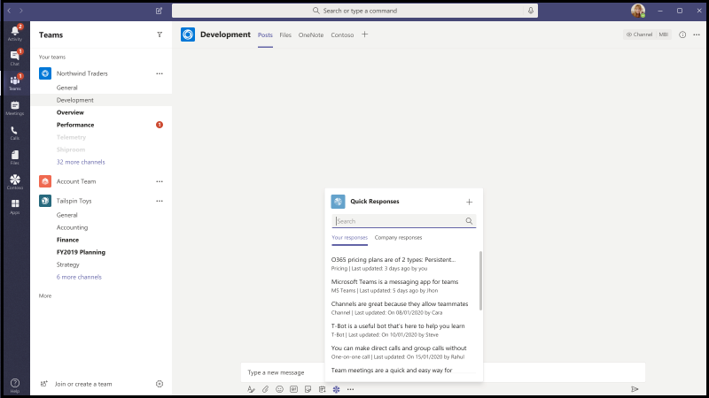
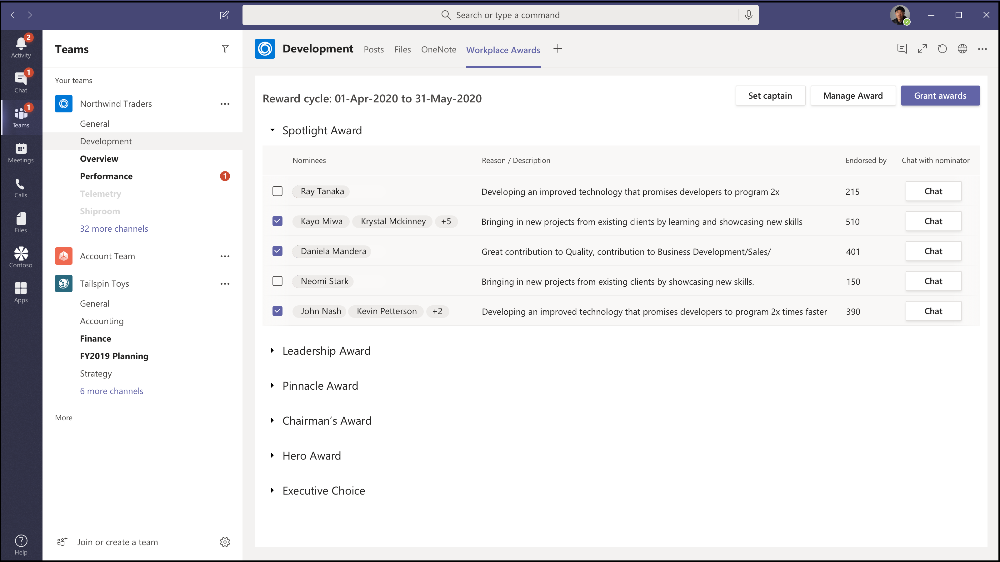

# App-Vorlagen für Microsoft TeamsApp Templates for Microsoft Teams

Bei den App-Vorlagen handelt es sich um produktionsbereite Apps für Microsoft Teams, die von der Community gesteuert und open Source sind und auf GitHub verfügbar sind.App templates are production-ready apps for Microsoft Teams that are community driven, open-source, and available on GitHub. Jede enthält ausführliche Anweisungen zum Bereitstellen und Installieren dieser App für Ihre Organisation, die eine einsatzbereite App zur Verfügung stellt, die Sie sofort installieren und verwenden können.Each contains detailed instructions for deploying and installing that app for your organization, providing a ready-to-use app that you can install and begin using immediately. Der vollständige Quellcode steht ebenfalls zur Verfügung, sodass Sie ihn im Detail untersuchen oder den Code ver forken und an Ihre spezifischen Anforderungen anpassen können.The complete source code is available as well, so you can explore it in detail, or fork the code and alter it to meet your specific needs.

**&#9734; Gibt neu veröffentlichte App-Vorlagen an.****&#9734; Indicates newly released app templates.**

### Wichtige VorteileKey benefits

* **Plug -and-Play-Erfahrung:** Alle App-Vorlagen enthalten Bereitstellungsskripts, mit denen Sie alle erforderlichen Dienste in Microsoft Azure hosten können.**Plug and play experience:** All app templates include deployments scripts that will allow you to host all necessary services in Microsoft Azure. Für die Bereitstellung der Apps ist kein Code erforderlich.No coding is required to deploy the apps.
* **Produktionsbereiter Code:** Die App-Vorlagen entsprechen den empfohlenen bewährten Methoden für Sicherheit und Infrastruktur, und alle von der Community übermittelten Änderungen werden überprüft, um eine kontinuierliche Konformität sicherzustellen.**Production-ready code:** The app templates conform to recommended best practices around security and infrastructure, and all community submitted changes to them are reviewed to ensure continued conformance.
* **Anpassbar und erweiterbar:** Obwohl alle App-Vorlagen bereit für die Bereitstellung sind, stellen wir die gesamte Codebasis und Bereitstellungsskripts bereit, sodass Sie sie ganz einfach an Ihre individuellen Anforderungen anpassen oder erweitern können.**Customizable and extensible:** While all app templates are ready to deploy as they are, we provide the entire code base and deployment scripts so that you can easily customize or extend them to fit your unique needs.
* **Ausführliche Dokumentation & Support:** Alle App-Vorlagen werden von einer End-to-End-Dokumentation zu Lösungsarchitektur, Bereitstellung und Konfigurationsschritten begleitet.**Detailed documentation & support:** All app templates are accompanied by end-to-end documentation on solution architecture, deployment, and configuration steps. Die Repositorys werden ebenfalls überwacht. Melden Sie daher alle Probleme, die auftreten, indem Sie ein Problem auf GitHub lösen.The repositories are monitored as well, so please report any issues you encounter by raising an Issue on GitHub.

## Einführungsbot-&#9734;Adoption Bot &#9734;

Der Einführungsbot ist ein Chat-Bot, der mit Power Virtual Agent für Teams (PVA) erstellt wurde.Adoption Bot is a user care chat bot built with Power Virtual Agent for Teams (PVA). Sie kann als die PVA-Version von FAQPlus betrachtet werden.It can be considered as the PVA version of FAQPlus. Der Einführungsbot beantwortet mehr als 100 allgemeine Fragen zu Microsoft 365 und Teams.Adoption Bot answers 100+ common questions about Microsoft 365 and Teams. Sie können die enthaltenen Themen bearbeiten, eigene Themen hinzufügen und vorhandene häufig gestellte Fragen (FAQs) einlassen.You can edit the included topics, add your own topics, and ingest existing FAQs. Wenn Benutzer zusätzliche Hilfe benötigen, kann der Einführungsbot sie mit Experten verbinden oder sogar auf offene Servicetickets mit Premium-Flow-Connectors erweitert werden.If users need additional help, Adoption Bot can connect them to experts or even be extended to open service tickets with premium flow connectors.

[Abrufen auf GitHubGet it on GitHub](https://github.com/OfficeDev/microsoft-teams-apps-adopt-bot)

## Termin-Manager-&#9734;Appointment Manager &#9734;

Der Terminmanager ist eine Teams-App-Vorlage, mit der Unternehmen virtuelle Termine mit Kunden über Teams erstellen, verwalten und durchführen können.Appointment Manager is a Teams app template to help businesses create, manage, and conduct virtual appointments with consumers through Teams. Neue Terminanfragen von Kunden sind in den Teams-Kanälen sichtbar, wo sie schnell zugewiesen und Mitarbeitern in einem Team neu zugewiesen werden können.New appointment requests from consumers are visible in Teams channels, where they can quickly be assigned and reassigned to staff in a team. Terminanfragen können auf Team- oder persönlichen Ebenen über benutzerdefinierte Registerkarten angezeigt werden.Appointment requests can be viewed at team or personal levels through custom tabs. Jeder Termin ist einer Onlinebe besprechung in Teams zugeordnet, daher können mitarbeiter und Verbraucher einfach zur geplanten Zeit an der Besprechung teilnehmen.Every appointment is associated with a Teams online meeting, hence the staff and consumers can easily join the meeting at the scheduled time.

Die App-Vorlage wird zur einfachen Terminverwaltung in Microsoft Bookings integriert.The app template integrates with Microsoft Bookings for easy appointment management. Geplante Termine werden automatisch in den Kalendern der zugewiesenen Mitarbeiter angezeigt, und Benutzer erhalten anpassbare E-Mail-Benachrichtigungen und Erinnerungen mit eingebetteten Besprechungslinks.Scheduled appointments automatically appear on assigned staff members' calendars, and consumers receive customizable email notifications and reminders with embedded meeting links.

[Abrufen auf GitHubGet it on GitHub](https://github.com/OfficeDev/microsoft-teams-apps-appointment-manager)

 

## Ask AwayAsk Away

"Ask Away" ist ein [Microsoft Teams-Bot,](../bots/what-are-bots.md) mit dem Benutzer Fragen&A (Frage und Antwort) in Teams durchführen können.Ask Away is a [Microsoft Teams bot](../bots/what-are-bots.md) that enables users to conduct Q&A (Question and Answer) sessions within Teams. Mithilfe des Bots "Abfragen" können Teammitglieder Von Kollegen geteilte Fragen übermitteln und abstimmen, sodass Q&A-Hosts ganz einfach die wichtigsten Fragen in einem Kanal oder Chat sammeln können.Using the Ask Away bot, team members can submit and up-vote questions shared by colleagues allowing Q&A hosts to easily gather top-of-mind questions within a channel or chat. Der Bot kann verwendet werden, um eine Echtzeit-Frage-&einer Sitzung in einer Teams-Besprechung zu führen, und ermöglicht Teilnehmern, Fragen per Chat live zu übermitteln.The bot can be used to conduct a real-time Q&A session in a Teams meeting and allows attendees to submit questions live via chat.

[Abrufen auf GitHubGet it on GitHub](https://github.com/OfficeDev/microsoft-teams-apps-askaway)

:::row:::
  :::column span="2":::
      
:::column-end:::
:::row-end:::

## Assoziierte EinblickeAssociate Insights

Associate Insights ist eine [Power Apps-Vorlage,](/powerapps/maker/canvas-apps/embed-teams-app) mit der Mitarbeiter in Service und Service mitarbeiter direkt Kundenmeinungen, -stimmungen und -wahrnehmungen erfassen und übermitteln können.Associate Insights is a [Power Apps](/powerapps/maker/canvas-apps/embed-teams-app) template that empowers firstline workers to directly capture and submit customer opinion, sentiment, and perception. Mitarbeiter in Erstunternehmen sind häufig der erste Unternehmensmitarbeiter, der sich an einer 1:1-Kontaktstelle mit Kunden in Verbindung setzt.Firstline workers are often the first company representative to engage with customers in a one-to-one point-of contact. Die gesammelten Daten können gemeinsam von Geschäftsteams freigegeben und verwendet werden, z. B. über eine Power BI Teams-Registerkarte, um die Produktverbesserung zu verbessern und die Kundenerfahrung zu verbessern.The collected data can be shared and used collaboratively by business teams, e.g., via a Power BI Teams tab, for product improvement and enhancing the customer experience.

[Abrufen auf GitHubGet it on GitHub](https://github.com/OfficeDev/microsoft-teams-apps-associateinsights)

:::row:::
  :::column span="2":::
      
:::column-end:::
:::row-end:::
:::row:::
:::column span="2":::
    
:::column-end:::
:::row-end:::

## AnwesenheitAttendance

Die Anwesenheits-App ist [eine Power Apps-Registerkarte,](/powerapps/maker/canvas-apps/embed-teams-app) die in einem Team angeheftet werden kann.The Attendance app is a [Power Apps](/powerapps/maker/canvas-apps/embed-teams-app) tab that can be pinned in a team. Es ist so konzipiert, dass Anwesenheitsdaten aufgezeichnet werden, in der Regel in Einstellungen wie z. B. Lern- und Schulungsumgebungen.It is designed to record presence, typically in settings such as learning and training environments. Benutzer können die Teilnahme in der Vergangenheit bis zu 30 Tage lang markieren oder bearbeiten und zusammenfassende Anwesenheitsberichte für eine ganze Gruppe oder einzelne Teilnehmer anzeigen.Users can mark or edit attendance for up to 30 days in the past and view summarized attendance reports for an entire group or individual attendees.

[Abrufen auf GitHubGet it on GitHub](https://github.com/OfficeDev/microsoft-teams-apps-attendance)

## Buch-a-RaumBook-a-room

Book-a-room ist ein [Microsoft Teams-Bot,](../bots/what-are-bots.md) mit dem Benutzer schnell einen Besprechungsraum für 30 (Standard), 60 oder 90 Minuten ab der aktuellen Uhrzeit finden und reservieren können.Book-a-room is a [Microsoft Teams bot](../bots/what-are-bots.md) that lets users quickly find and reserve a meeting room for 30 (default), 60, or 90 minutes starting from the current  time. Der Bot "Buch-a-Raum" ist auf persönliche Unterhaltungen oder 1:1-Unterhaltungen begrenzt.The Book-a-room bot scopes to personal or 1:1 conversations.

[Abrufen auf GitHubGet it on GitHub](https://github.com/OfficeDev/microsoft-teams-apps-bookaroom)

## GebäudezugriffBuilding Access

Building Access ist eine Microsoft [Power Platform-basierte](https://powerapps.microsoft.com/blog/now-in-preview-customize-teams-with-built-in-power-platform-capabilities/)App, die die Verwaltung von Schwellenwerten für die Belegung von Belegungen und sozialen Distancing-Normen unterstützt, indem es Einrichtungsleitern ermöglicht wird, die Anwesenheit von Mitarbeitern vor Ort zu verwalten, nachzuververwalten und zu melden.Building Access is a Microsoft [Power Platform](https://powerapps.microsoft.com/blog/now-in-preview-customize-teams-with-built-in-power-platform-capabilities/)-based app that supports the administration of building occupancy thresholds and social distancing norms by enabling facilities directors to manage, track, and report employee on-site presence. Die App, die mit Microsoft [Power Apps](/powerapps/powerapps-overview)und [Power Automate](/power-automate/getting-started)erstellt wurde, ist tief in Microsoft Teams integriert und ermöglicht Es Organisationen, die Erstellungsbereitschaft zu bestimmen, Berechtigungskriterien für den Zugriff auf die Website festzulegen und Erkenntnisse für die zukünftige Planung zu sammeln.The app, built using Microsoft [Power Apps](/powerapps/powerapps-overview), and [Power Automate](/power-automate/getting-started), deeply integrates with Microsoft Teams and enables organizations to determine building readiness, establish eligibility criteria for on-site access, and gather insights for future planning.

[Abrufen auf GitHubGet it on GitHub](https://github.com/OfficeDev/microsoft-teams-apps-buildingaccess)

:::row:::
   :::column span="":::
     
   :::column-end:::
   :::column span="":::
      
   :::column-end:::
:::row-end:::

## FeiernCelebrations

Bei Geburtstagen handelt es sich um eine Teams-App, die Teammitgliedern dabei hilft, ihre Geburtstage, Jubiläen und anderen wiederkehrenden Ereignisse miteinander zu vermischen.Celebrations is a Teams app that helps team members celebrate each others' birthdays, anniversaries, and other recurring events. Er erinnert sich an besondere Anlässe aller Teammitglieder und sendet eine benutzerfreundliche Nachricht in allen Teams, die zum Zeitpunkt der Ereigniserstellung ausgewählt wurden, damit sich die Teammitglieder an ihrem Tag besonders fühlen.It remembers special occasions of all the team members and sends a friendly message in all the teams selected at the time of event creation, to make the team members feel special on their day.

Die App bietet eine einfache Schnittstelle für alle Teammitglieder, um ihre Ereignisse persönlich hinzuzufügen und zu sehen. Außerdem kann der Benutzer die Teams auswählen, in denen die Ereignisse freigegeben werden.The app provides an easy interface for all the team members to personally add and view their events and also allows the user to select the teams in which the events gets shared.

[Abrufen auf GitHubGet it on GitHub](https://github.com/OfficeDev/microsoft-teams-celebrations-app)

## PrüflisteChecklist

Die Prüfliste ist  eine benutzerdefinierte Microsoft Teams-Messaging-Erweiterungs-App, mit der Sie mit Ihrem Team zusammenarbeiten können, indem Sie eine freigegebene Prüfliste in einem Chat oder Kanal erstellen.Checklist is a custom Microsoft Teams [messaging extension](../messaging-extensions/what-are-messaging-extensions.md) app that enables you to collaborate with your team by creating a shared checklist in a chat or channel. Die App wird auf allen Microsoft Teams-Plattformclients unterstützt – Desktop, Browser, iOS und Android – und kann im Rahmen Ihres Microsoft 365-Abonnements zur Verfügung stehen.The app is supported across all Teams platform clients —  desktop, browser, iOS, and Android — and is ready for deployment as part of your Microsoft 365 subscription.  

[Abrufen auf GitHubGet it on GitHub](https://github.com/OfficeDev/microsoft-teams-checklist-app )

:::row:::
:::column span="2":::
      
:::column-end:::
:::row-end:::

## Drop-In-&#9734;Classroom Drop-in &#9734;

Classroom Drop-in ist eine Microsoft [Power Platform-basierte](https://powerapps.microsoft.com/blog/now-in-preview-customize-teams-with-built-in-power-platform-capabilities/)App, mit der Systemleiter Kursteams (virtuelle Kursräume) finden und sich selbst oder andere für einen bestimmten Drop-In-Zeitraum zu diesen Kursteams hinzufügen können.Classroom Drop-in is a Microsoft [Power Platform](https://powerapps.microsoft.com/blog/now-in-preview-customize-teams-with-built-in-power-platform-capabilities/)-based app that enables system leaders to find class teams (virtual classrooms) and add themselves or others to these class teams for a specified drop-in period, as needed. Die App, die mit Microsoft [Power Apps](/powerapps/powerapps-overview) und [Power Automate](/power-automate/getting-started)erstellt wurde, ist tief in Microsoft Teams integriert, um sicherzustellen, dass Bildungseinrichtungen ihre Vorgänge in einer hybriden Lernumgebung optimieren können, indem sie den relevanten Beteiligten Zugriff für Kursteams nach geschäftlichen Anforderungen bietet.The app built using Microsoft [Power Apps](/powerapps/powerapps-overview) and [Power Automate](/power-automate/getting-started), deeply integrates with Microsoft Teams to ensure educational institutes can optimize their operations in a hybrid learning environment by providing access to relevant stakeholders for class teams per business requirements.

[Abrufen auf GitHubGet it on GitHub](https://github.com/OfficeDev/microsoft-teams-apps-classroom-dropin)

## Unternehmens-CommunicatorCompany Communicator

Die Unternehmens-Communicator-App ermöglicht Unternehmensteams das Erstellen und Senden von Nachrichten, die für mehrere Teams oder eine große Anzahl von Mitarbeitern im Chat vorgesehen sind, sodass die Organisation mitarbeiter direkt dort erreichen kann, wo sie zusammenarbeiten.The Company Communicator app enables corporate teams to create and send messages intended for multiple teams or large number of employees over chat allowing organization to reach employees right where they collaborate. Verwenden Sie diese Vorlage für mehrere Szenarien, z. B. Ankündigungen neuer Initiativen, Onboarding von Mitarbeitern, modernes Lernen und Entwicklung oder organisationsweite Übertragungen.Utilize this template for multiple scenarios such as new initiative announcements, employee onboarding, modern learning and development or organization-wide broadcasts.

Die App bietet eine einfache Schnittstelle für designierte Benutzer zum Erstellen, Anzeigen einer Vorschau, Zusammenarbeit und Senden von Nachrichten.The app provides an easy interface for designated users to create, preview, collaborate and send messages.

Es bietet eine Grundlage für die Erstellung benutzerdefinierter gezielter Kommunikationsfunktionen wie benutzerdefinierte Telemetrie darüber, wie viele Benutzer eine Nachricht bestätigt oder mit dieser interagiert haben.It provides a foundation to build custom targeted communication capabilities such as custom telemetry on how many users acknowledged or interacted with a message.

[Abrufen auf GitHubGet it on GitHub](https://github.com/OfficeDev/microsoft-teams-company-communicator-app)

## Kontaktgruppen-NachschlageContact Group Lookup

Die Kontaktgruppen-Nachschlage-App bietet einen praktischen und nützlichen Ansatz zum Erstellen, Zugreifen auf und Verwalten der Kontaktgruppen Ihrer Organisation (früher als Verteilerlisten oder Kommunikationsgruppen bekannt).The Contact Group Lookup app provides a convenient and useful approach to creating, accessing, and managing your organization's contact groups (formerly known as distribution lists or communication groups). Benutzer können schnell Gruppenmitglieder anzeigen und chatten, den Mitgliederstatus anzeigen und einen Gruppenchat mit ausgewählten Mitgliedern in der Kontaktgruppe erstellen, und das alles innerhalb der Teams-Umgebung.Users can quickly view and chat with group members, view member status, and create a group chat with selected members in the contact group, all within the Teams environment.

[Abrufen auf GitHubGet it on GitHub](https://github.com/OfficeDev/microsoft-teams-app-contactgrouplookup)

:::row:::
:::column span="2":::
      
:::column-end:::
:::row-end:::
:::row:::
:::column span="2":::
    
:::column-end:::
:::row-end:::

## Arbeitsverdingungs-&#9734;Co-worker Appreciation &#9734;

Mithilfe der Vorlage "Arbeitskollegen" in Microsoft Teams können Benutzer die Erfolge ihrer Kollegen im Kontext von Teams erkennen.Using the co-worker appreciation template in Microsoft Teams, users can recognize their colleagues' achievements within the Teams’ context. Wenn Kollegen einen Kollegen belohnen, werden Empfänger und andere Teammitglieder in einer Kanalgespräch gekennzeichnet und erhalten eine Benachrichtigung über die Preisdetails des Kanals.When co-workers select to reward a colleague, recipients and other team members are tagged in a channel conversation and they receive a notification about the channel's award details. Die Preise werden in der Teams-App aufgezeichnet, die sicher, portabel und einfach gemeinsam verwendet werden kann.The awards are recorded in the Teams app, which is secure, portable, and easily shareable. Dies kann als powerApps-basierte Version der Open Badges-App-Vorlage mit einer Bestenliste betrachtet werden.This can be considered as the PowerApps based version of the Open Badges app template, with a leaderboard.

[Abrufen auf GitHubGet it on GitHub](https://github.com/OfficeDev/microsoft-teams-apps-coworker-appreciation)

## CrowdSourcerCrowdSourcer

CrowdSourcer ist ein [Microsoft Teams-Bot,](../bots/what-are-bots.md) der teams abgefragte Informationen liefert, die gemeinsam von Gruppenmitgliedern stammen.CrowdSourcer is a [Microsoft Teams bot](../bots/what-are-bots.md) that gives teams queried information sourced collaboratively from group members. Es ist eine hervorragende Möglichkeit, häufig gestellte Fragen zu beantworten, während Teilnehmer aktiv an einer hilfreichen Informationsressource mitwirken können.It's a great way to answer frequently asked questions while enabling participants to actively engage in and contribute to a fun and helpful information resource.

[Abrufen auf GithubGet it on Github](https://github.com/OfficeDev/microsoft-teams-crowdsourcer-app)

## Custom StickersCustom Stickers

Selbstausdruck ist der Kern einer gesunden Teamkultur.Self-expression is core to a healthy team culture. Diese App-Vorlage ist eine [Messaging-Erweiterung,](~/messaging-extensions/what-are-messaging-extensions.md) mit der Ihre Benutzer benutzerdefinierte Aufkleber und GIFs in Microsoft Teams verwenden können.This app template is a [messaging extension](~/messaging-extensions/what-are-messaging-extensions.md) that enables your users to use custom stickers and GIFs within Microsoft Teams. Diese Vorlage bietet eine einfache webbasierte Konfigurationserfahrung, bei der jeder Benutzer mit Konfigurationszugriff die GIFs/Aufkleber/Bilder hochladen kann, die die Endbenutzer haben möchten, sodass Ihr gesamtes Team alle von Ihnen gewählten Aufkleber verwenden kann.This template provides an easy web-based configuration experience where anyone with configuration access can upload the GIFs/stickers/images they want their end-users to have, allowing your entire team to use any set of stickers you chose.

Diese App ermöglicht auch die einfache Freigabe von Bildern/GIFs/Aufklebern in Teams, ohne zugriff auf SharePoint-Websites oder einzelne Kanäle als Speicher- und Freigabemechanismen zu benötigen.This app also enables easy sharing of images/GIFs/stickers across teams without needing access to SharePoint sites or individual channels as storage and sharing mechanisms. Beispielsweise können Produktteams Produktbilder und GIFs ganz einfach programmgesteuert für soziale Medien, Marketing- und Vertriebsteams freigeben.For example, product teams can easily share product images and GIFs to social media, marketing and sales teams programmatically. Sie können diese App auch erweitern, indem sie einen Benachrichtigungsfluss für bestimmte Teams/Einzelpersonen auslöst, wenn neue Bilder/GIFs verfügbar gemacht werden.One can also extend this app by triggering a notification flow to specific teams/individuals when new images/GIFs are made available.

[Abrufen auf GitHubGet it on GitHub](https://github.com/OfficeDev/microsoft-teams-stickers-app)

## Mitarbeiterideen &#9734;Employee Ideas &#9734;

Die App "Mitarbeiterideen" ist die PowerApps-Version der Azure-basierten App-Vorlage "Großartige Ideen".The Employee Ideas app is the PowerApps version of the Azure based Great Ideas app template. Mit der App können die Benutzer von Teams eine Ideenkampagne einrichten und konfigurieren.The app enables the Teams users to set up and configure an idea campaign. Eine Ideenkampagne ist eine Kategorie zum Gruppieren von Ideen zu gängigen Designs.An idea campaign is a category for grouping ideas around common themes.

Benutzer von Teams können auch folgende Aktivitäten ausführen:Teams users can also perform following activities:
* Konfigurieren Sie ein Standardübermittlungsformular, das Mitarbeiter für jede Idee übermitteln müssen.Configure a standard submission form that employees need to submit for each idea. 
* Überprüfen und verwalten Sie die Ideen und die Liste der Kampagnen.Review and manage the ideas and list of campaigns.
* Ändern und Löschen von Kampagnen.Modify and delete campaigns.
* Überprüfen Sie Die Bestenlisten mit Ideen.Review leader boards of ideas.
* Stimmen Sie für priorisierte Ideen, und teilen Sie sie mit.Vote for and share prioritized ideas.
* Übermitteln Sie Ideen für eine Kampagne.Submit ideas for a campaign.
* Sehen Sie sich die Idee eines anderen Teammitglieds an.View other team member's idea.
* Stimmen Sie über die meisten "Gefällt mir"-Ideen ab.Vote on most liked ideas.
* Überprüfen Sie die Leistung ihrer Ideen im Vergleich zu anderen in einer Kampagne.Review the performance of their ideas compared with others within a campaign.

[Abrufen auf GitHubGet it on GitHub](https://github.com/OfficeDev/microsoft-teams-apps-employeeideas)

 

## E-PrescriptionsE-Prescriptions 

E-Prescriptions ist eine [Power Apps-basierte](/powerapps/maker/canvas-apps/embed-teams-app)App, die die Telemedikierung und die virtuelle Behandlung verbessert, indem der Prozess der Ausgabe von E-Rezepten für Patienten automatisiert wird.E-Prescriptions is a [Power Apps](/powerapps/maker/canvas-apps/embed-teams-app)-based app that enhances telemedicine and virtual care by automating the process of issuing e-prescriptions to patients. Medical professionals can quickly review appointments, generate e-prescriptions, and send emails with e-prescription attachments to patients directly within the Teams platform.Medical professionals can quickly review appointments, generate e-prescriptions, and send emails with e-prescription attachments to patients directly within the Teams platform.

[Abrufen auf GitHubGet it on GitHub](https://github.com/OfficeDev/microsoft-teams-apps-eprescription) 

:::row:::
:::column span="2":::
      
:::column-end:::
:::row-end:::
:::row:::
:::column span="2":::
    
:::column-end:::
:::row-end:::

## MitarbeiterschulungEmployee Training 

Mitarbeiterschulungen sind eine Microsoft Teams-App, die es Organisatoren ermöglicht, Lern- und Schulungsereignisse für Ihre Organisation einfach zu veröffentlichen, nachverfolgt und zu fördern.Employee training is a Microsoft Teams app that enables organizers to easily publish,  track, and promote learning and training events for your organization.  Mit der App können Ereignisplaner Erinnerungen und Benachrichtigungen an Ereignisregistranten senden, und Mitarbeiter können Interesse an bevorstehenden Ereignissen anzeigen, über die Messaging-Erweiterung von Teams über aktuelle Ereignisse auf dem Laufenden bleiben und Ereignisdetails mit Kollegen teilen.With the app, event planners can send reminders and notifications to event registrants and employees can indicate interest in upcoming events, stay updated on current events, and share event details with colleagues via the Teams messaging extension.

[Abrufen auf GitHubGet it on GitHub](https://github.com/OfficeDev/microsoft-teams-apps-employeetraining)

:::row:::
:::column span="2":::
    **Anzeigen von Schulungsereignissen für Mitarbeiter** **View employee training events**   
:::column-end:::
:::row-end:::
:::row:::
:::column span="2":::
    **Mitarbeiterschulungsereignis erstellen** **Create employee training event** 
:::column-end:::
:::row-end:::

## Experten-FinderExpert Finder

Expert Finder ist ein [Microsoft Teams-Bot,](../bots/what-are-bots.md) der bestimmte Organisationsmitglieder basierend auf ihren Fähigkeiten, Interessen und Bildungsattributen identifiziert.Expert Finder is a [Microsoft Teams bot](../bots/what-are-bots.md) that identifies specific organization members based on their skills, interests, and education attributes. Mitglieder finden Experten in einer Organisation, die einer Schlüsselwortsuche von Azure Active Directory-Benutzerprofilen entsprechen.Members find experts within an organization  that match a keyword search of Azure Active Directory user profiles.

[Abrufen auf GitHubGet it on GitHub](https://github.com/OfficeDev/microsoft-teams-apps-expertfinder)

## FAQ PlusFAQ Plus

Unterhaltungs-F&Bots sind eine einfache Möglichkeit, Antworten auf häufig gestellte Fragen von Benutzern zur Verfügung zu stellen.Conversational Q&A bots are an easy way to provide answers to frequently asked questions by users. Die meisten Bots können sich jedoch nicht sinnvoll mit Benutzern in Verbindung stellen, da kein Benutzer in der Schleife ist, wenn der Bot ausfällt.However, most bots fail to engage with users in meaningful way because there is no human in the loop when the bot fails. Faq bot is a friendly Q&A bot that brings a human in the loop when it is unable to help.FAQ bot is a friendly Q&A bot that brings a human in the loop when it is unable to help. Einer kann dem Bot eine Frage stellen, und der Bot antwortet mit einer Antwort, wenn er in der Wissensdatenbank enthalten ist.One can ask the bot a question and the bot responds with an answer if it is contained in the knowledge base. Wenn nicht, ermöglicht der Bot dem Benutzer, eine Abfrage zu übermitteln, die dann an ein vorkonfiguriertes Expertenteam gesendet wird, das bei der Unterstützung hilft, indem er auf die Benachrichtigungen innerhalb des Teams selbst einwirken kann.If not, the bot allows the user to submit a query which then gets posted to a pre-configured team of experts who help to provide support by acting upon the notifications from within the team itself.

> [!NOTE]
> Die neueste Version von **FAQ Plus** unterstützt verbesserte Q&A-Lösungen, indem ein Expertenteam folgendes abschließen kann:The latest release of **FAQ Plus** supports improved Q&A resolutions by enabling a team of experts to complete the following:
>
> &#x2714; Hinzufügen neuer Fragen&Direkt zur Wissensdatenbank mithilfe von Nachrichtenerweiterungen.&#x2714; Add new Q&As directly to the knowledge base using message extensions.
>
> &#x2714; Bearbeiten und Löschen von Q&A pairs, die von einem Bot hinzugefügt wurden.&#x2714; Edit and delete Q&A pairs added by a bot.
>
> &#x2714; Verfolgen Des Revisionsverlaufs von Fragen&As.&#x2714; Track the revision history of Q&As.
>
> &#x2714; Konfigurieren Sie eine Antwort mit zusätzlichen Details, die als adaptive [Karte angezeigt werden.](../task-modules-and-cards/cards/cards-reference.md#adaptive-card)&#x2714; Configure an answer with additional details to display as an [adaptive card](../task-modules-and-cards/cards/cards-reference.md#adaptive-card).
>
[Abrufen auf GitHubGet it on GitHub](https://github.com/OfficeDev/microsoft-teams-apps-faqplusv2)

## Support-App-&#9734;Get Support App &#9734;

Die App "Support anfordern" kann von Organisationen verwendet werden, die Microsoft Teams verwenden, um allen Benutzern das Anfordern von Unterstützung durch Vorgesetzte zu ermöglichen.The Get Support app can be used by organizations that are using Microsoft Teams, to enable any set of users to request assistance from supervisors. Diese App enthält verschiedene Features, z. B.:This app includes various features, such as:
-   Anfordern von Unterstützung für verschiedene Kategorien von einer Power AppRequesting assistance on different categories from a Power App
-   Benachrichtigungen, die an Ansgeber gesendet werden und sie darüber informieren, wer zugewiesen wurdeNotifications sent to requestors informing them of who has been assigned 
-   Benachrichtigungen, die an zugewiesene Vorgesetzte gesendet werden und sie darüber informieren, wer Unterstützung benötigtNotifications sent to assigned supervisors informing them of who needs assistance 
-   Analysieren von Eskalationen und Mustern in SharePoint und PowerBIAnalyzing escalations and patterns in SharePoint and PowerBI

[Abrufen auf GitHubGet it on GitHub](https://github.com/OfficeDev/microsoft-teams-app-get-support/)

## ZielverfolgungGoal Tracker

Die Zielverfolgungs-App ist eine umfassende Lösung für Ihre Organisation, um das Einrichten von Zielen, das Beobachten des Fortschritts und die Anerkennung des Erfolgs in Microsoft Teams zu unterstützen.The Goal Tracker app is a comprehensive solution for your organization to support establishing goals, observing progress, and acknowledging success within Microsoft Teams. Mit der App können Benutzer Ziele auf professioneller, persönlicher und Teamebene festlegen, nachverfolgen und aktualisieren.The app enables users to set, track, and update objectives on a professional, personal, and team level. Teammitglieder erhalten außerdem zeitnahe Erinnerungen und Statusupdates, um konzentriert zu bleiben und auf dem neuesten Stand zu bleiben.Team members also receive timely reminders and status updates to remain focused and stay on track.

[Abrufen auf GitHubGet it on GitHub](https://github.com/OfficeDev/microsoft-teams-app-goaltracker)

:::row:::
  :::column span="2":::
      
:::column-end:::
:::row-end:::
:::row:::
:::column span="2":::
    
:::column-end:::
:::row-end:::

## Großartige IdeenGreat Ideas

Die App "Großartige Ideen" unterstützt und fördert Innovation und Kreativität in Ihrer Organisation.The Great Ideas app supports and empowers innovation and creativity within your organization. Die App ermöglicht Es Ihren Mitarbeitern, Ideen mit Kollegen und Führungskräften auszutauschen, neue Übermittlungen zu entdecken, Beiträge zu Peers ins Blickpunkt zu stellen und ihre Stimme für die besten Vorschläge in Microsoft Teams zu geben.The app enables your employees to share ideas with colleagues and leadership, discover new submissions, spotlight contributions for peer consideration, and cast their vote for the best proposals within Microsoft Teams.

[Abrufen auf GitHubGet it on GitHub](https://github.com/OfficeDev/microsoft-teams-apps-greatideas)

:::row:::
  :::column span="2":::
      
:::column-end:::
:::row-end:::
:::row:::
:::column span="2":::
    
:::column-end:::
:::row-end:::

## GruppenaktivitätenGroup Activities

Gruppenaktivitäten ist eine Microsoft Teams-App, mit der Teambesitzer schnell Aktivitätsgruppen erstellen und Workflows für die Zusammenarbeit im Kontext von Microsoft Teams verwalten können.Group Activities is a Microsoft Teams app that makes it easy for team owners to quickly create activity groups and manage collaboration workflows within the context of Microsoft Teams. Aktivitätsautoren können Aktivitäten erstellen, Teammitglieder nach dem Zufallsprinzip in Gruppen verteilen und optional vom Bot Erinnerungen senden, bis die Aktivitäten abgeschlossen sind.Activity authors are enabled to create activities, randomly distribute team members in groups, and optionally have the bot send reminders until activities are complete.

[Abrufen auf GitHubGet it on GitHub](https://github.com/OfficeDev/microsoft-teams-apps-groupactivities)

:::row:::
  :::column span="2":::
      
:::column-end:::
:::row-end:::
:::row:::
:::column span="2":::
    
:::column-end:::
:::row-end:::

## Erweitern Ihrer FähigkeitenGrow Your Skills

Die App "Grow Your Skills" unterstützt das berufliche Wachstum und die Entwicklung, indem Mitarbeiter an ergänzenden Projekten für Ihre Organisation mit beitragen und gleichzeitig neue Fähigkeiten erlernen können.The Grow Your Skills app supports professional growth and development by enabling employees to contribute to supplemental projects for your organization while simultaneously learning new skills. Mitarbeiter können die App verwenden, um Möglichkeiten zu finden, die ihren Interessen entsprechen, eine sinnvolle Zusammenarbeit mit Gleichgesinnten zu genießen und neue Fachkenntnisse und Funktionen in der Teams-Umgebung zu erwerben.Employees can use the app to locate opportunities that meet their interests, enjoy meaningful collaboration with peers, and acquire new levels of expertise and capabilities, all within the Teams environment.

[Abrufen auf GitHubGet it on GitHub](https://github.com/OfficeDev/microsoft-teams-apps-growyourskills)

:::row:::
  :::column span="2":::
      
:::column-end:::
:::row-end:::
:::row:::
:::column span="2":::
    
:::column-end:::
:::row-end:::

## HR SupportHR Support

Hr Support Bot ist ein freundlicher Q&Ein Bot, der einen Supportexperten/Experten aus dem Personalteam in die Schleife bringt, wenn er nicht helfen kann.HR Support bot is a friendly Q&A bot that brings a support professional/expert from the HR team in the loop when it is unable to help. Einer kann dem Bot eine Frage stellen, und der Bot antwortet mit einer Antwort, wenn er in der Wissensdatenbank enthalten ist.One can ask the bot a question and the bot responds with an answer if it is contained in the knowledge base. Wenn nicht, ermöglicht der Bot dem Benutzer, eine Abfrage zu übermitteln, die dann in einem vorkonfigurierten Team von Experten veröffentlicht wird, die bei der Unterstützung helfen, indem er auf die Benachrichtigungen innerhalb des Teams selbst einwirken kann.If not, the bot allows the user to submit a query which then gets posted in a pre-configured team of experts who are help to provide support by acting upon the notifications from within their team itself. Darüber hinaus schlägt der Bot Links zu empfohlenen Personalrichtlinien/Fragen vor, indem er nach vorkonfigurierten Tags in der Frage sucht.Additionally, the bot suggests links to recommended HR policies/questions by searching for pre-configured tags in the question. Diese Kacheln befinden sich auch auf der zugeordneten Registerkarte als Kurzübersicht.These tiles can also be found in the associated tab as a quick reference. Der Personalsupport funktioniert gut für QnA mit geringem Gewicht und bietet schnellen Support beim Starten neuer Projekte/Initiativen in der Organisation.HR Support works well for light weight QnA and to provide quick support when launching new projects/initiatives in the organization.

[Abrufen auf GitHubGet it on GitHub](https://github.com/OfficeDev/microsoft-teams-hrsupport-app)

## IcebreakerIcebreaker

Icebreaker ist ein [Microsoft Teams-Bot,](../bots/what-are-bots.md) der Ihrem Team dabei hilft, sich näher zu kommen, indem es jede Woche zwei zufällige Teammitglieder zu treffen paart.Icebreaker is a [Microsoft Teams bot](../bots/what-are-bots.md) that helps your team get closer by pairing two random team members up every week to meet. Der Bot erleichtert die Planung, indem automatisch kostenlose Zeiten vorschlagen werden, die für beide Mitglieder funktionieren.The bot makes scheduling easy by automatically suggesting free times that work for both members. Stärken Sie persönliche Verbindungen, und erstellen Sie mit dieser App eine enge Community.Strengthen personal connections and build a tightly knit community with this app.

Zusätzlich zur Förderung persönlicher Verbindungen im gesamten Team kann die Icebreaker-App dazu beitragen, interessenbasierte Communitys in Ihrer Organisation zu fördern.In addition to encouraging personal connections across your entire team, the Icebreaker app can help cultivate interest-based communities within your organization. Beispielsweise können Sie diese App für eine DevOps-Interessengruppe verwenden, um Ideen und bewährte Methoden zu unterstützen, die organisch in Ihrer Organisation verteilt werden.For example, you can use this app for a DevOps interest group to help ideas and best practices organically spread across your organization.

[Abrufen auf GitHubGet it on GitHub](https://github.com/OfficeDev/microsoft-teams-icebreaker-app)

## IncentivesIncentives

Incentives ist eine [Power Apps-Vorlage,](/powerapps/maker/canvas-apps/embed-teams-app) die die Förderung der Beteiligung von Mitarbeitern an bestimmten Aktivitäten wie Schulungen und Änderungsmanagementaktivitäten verwaltet und verfolgt.Incentives is a [Power Apps](/powerapps/maker/canvas-apps/embed-teams-app) template that manages and tracks incentivized employee participation in designated activities such as trainings and change management initiatives. Administratoren verwenden die App, um festgelegte Aktivitäten festzulegen, Punkte für den Abschluss zuzuordnen und erforderliche Berechtigungspunktstufen für Preise anzugeben.Admins use the app to establish designated activities, assign points for completion, and specify required eligibility point levels for rewards. Mitarbeiter verwenden die App, um ihre gesammelten Punkte zu sehen und, wenn sie die Berechtigung erreicht haben, einlösbare Preise anfordert und in Anspruch zu bekommen.Employees use the app to view their accumulated points and, upon reaching eligibility, request and claim redeemable rewards.

[Abrufen auf GitHubGet it on GitHub](https://github.com/OfficeDev/microsoft-teams-apps-incentives)

## Incident ReporterIncident Reporter

Incident Reporter ist ein [Microsoft Teams-Bot,](../bots/what-are-bots.md)  der die Verwaltung von Vorfällen in Ihrer Organisation optimiert.Incident Reporter is a [Microsoft Teams bot](../bots/what-are-bots.md)  that optimizes the management of incidents in your organization. Der Bot erleichtert die automatisierte Vorfalldatenerfassung, angepasste Vorfallberichte, relevante Benachrichtigungen von Beteiligten und die End-to-End-Nachverfolgung von Vorfällen.The bot facilitates automated incident data collection, customized incident reports, relevant stakeholder notifications, and end-to-end incident tracking.

[Abrufen auf GitHubGet it on GitHub](https://github.com/OfficeDev/microsoft-teams-apps-incidentreport)

:::row:::
  :::column span="2":::
      
:::column-end:::
:::row-end:::
:::row:::
:::column span="2":::
    
:::column-end:::
:::row-end:::

## &#9734;Inspection &#9734;

 Bei der Überprüfung handelt es sich um eine Microsoft Teams-App, mit der Front-Line-Mitarbeiter alles von Standorten bis hin zu Ressourcen und Geräten überprüfen können.Inspection is a Microsoft Teams app that enables front line workers to inspect anything from  locations to assets and equipments. Beispiel: Einzelhandel, Produktionsbetrieb oder Autos und Maschinen.For example, a retail store, manufacturing plant, or vehicles and machines. Es gibt zwei Apps in dieser Lösung, die jeweils für verschiedene Benutzertypen vorgesehen sind.There are two apps in this solution, each intended for different types of users.

Die App ermöglicht es den Front-Line-Mitarbeitern, ein Objekt oder einen Bereich zu überprüfen, die Qualität von Produkten und Diensten zu verwalten oder die Sicherheit am Arbeitsplatz zu gewährleisten.The app empowers the front line workers to inspect an asset or area, to manage quality of products and services, or maintain safety at workplace. Es erleichtert die Kommunikation zwischen Teammitgliedern, um während der Überprüfung gefundene Probleme zu beheben.It facilitates communication between team members to address issues found during inspection. Die App bietet einfachen Berichten für Manager, um die Problemlösung zu beschleunigen und Trends zu hervorheben.The app provides simple reports for managers to expedite issue resolution and highlight trends.

[Abrufen auf GitHubGet it on GitHub](https://github.com/OfficeDev/microsoft-teams-apps-inspection)

   

## Problemberichterstattungsberichte &#9734;Issue Reporting &#9734;

Mit der App "Problemberichterstattung" können Mitarbeiter und Manager Probleme lösen und verwalten.The Issue Reporting app empowers the employees and managers to raise and manage issues. Sie besteht aus zwei Apps, einer App für die Problemberichterstattung und der App "Probleme verwalten" zum Verwalten von Problemen.It consists of two apps, Issue reporting app for reporting issues and Manage Issues app for managing issues.

Die Teammanager verwenden die App "Probleme verwalten", um die App zu konfigurieren, einschließlich des Kanals, in dem Microsoft Teams-Nachrichten und -Planner-Aufgaben von der App erstellt werden.The team managers use the Manage Issues app to configure the app experience, including the channel in which Microsoft Teams messages and Planner tasks are created by the app. Manager verwenden die App auch zum Erstellen von Vorlagenformularen, um Details zu sammeln, wenn ein Benutzer ein Problem meldet.Managers also use the app to create template forms to collect details when a user reports an issue. Beispiel: Überprüfen, Bearbeiten oder Löschen von Formularen für Problemvorlagen.For example, review, edit, or delete issue template forms. Die App kann auch verwendet werden, um Teamprobleme zu überprüfen, einen Bericht zum Problemverlauf zu erstellen und die Problemlösung effizient zu verwalten.The app can also be used to review team issues, report on issue history, and efficiently manage issue resolution.

Die Mitarbeiter verwenden die App "Problemberichterstattung", um Probleme und Details zu protokollieren, die zur Behebung dieser Probleme erforderlich sind.The employees use the Issue reporting app to log issues and details required to resolve them. Die App wird auch verwendet, um vorhandene Probleme zu ändern und zu beheben und eine hohe Ansicht von Einzel- oder Teamproblemen zu erhalten.The app is also used to modify and resolve existing issues and get a high-level view of individual or team issues.

[Abrufen auf GitHubGet it on GitHub](https://github.com/OfficeDev/microsoft-teams-apps-issuereporting)

  

## Onboarding neuer MitarbeiterNew Employee Onboarding 

Das Onboarding neuer Mitarbeiter ist eine integrierte Microsoft Teams- und [SharePoint New Employee Onboarding-Lösung,](https://lookbook.microsoft.com/details/75e60a32-9849-4ed4-b83e-b2b08983ad19) mit der Ihre Organisation eine konsistente, qualitativ hochwertige Onboardingerfahrung für Mitarbeiter auf ihrer Neueinstellungen-Reise bereitstellen kann.New Employee Onboarding is an integrated Microsoft Teams and [SharePoint New Employee Onboarding Solution](https://lookbook.microsoft.com/details/75e60a32-9849-4ed4-b83e-b2b08983ad19) that enables your organization to provide a consistent, high-quality onboarding experience for employees on their new-hire journey. Die App kann von Personalteams und Einstellungsmanagern verwendet werden, um relevante Informationen während des Orientierungs- und Aufnahmeprozesses zur Verfügung zu stellen und von Neueinstellungen Feedback zu teilen, Einführungen zu geben und Onboardingaufgaben auszuführen.The app can be used by human resource teams and hiring managers to provide relevant information throughout the orientation and induction process and by new hires to share feedback, provide introductions, and complete onboarding tasks.

[Abrufen auf GitHubGet it on GitHub](https://github.com/OfficeDev/microsoft-teams-apps-newemployeeonboarding)

:::row:::
  :::column span="2":::
    **Willkommenskarte für neue Mitarbeiter** **New employee welcome card** 
:::column-end:::
:::row-end:::
:::row:::
:::column span="2":::
    **Prüfliste für neue Mitarbeiter** **New employee checklist**   
:::column-end:::
:::row-end:::

## Offene BadgesOpen Badges

"Offene Badges" ist eine Microsoft Teams-App, mit der Einzelpersonen digitale Lernanmeldeinformationen im Kontext von Teams erhalten und überall freigeben können.Open Badges is a Microsoft Teams app that enables individuals to earn digital learning credential badges within the Teams context and share them everywhere. Mithilfe von Funktionen der Drittanbieterstelle für digitale Badges, [Badgr,](https://badgr.org/)werden vergebene Badges im Badgr-Profil eines Empfängers aufgezeichnet und stehen zur Verfügung, um ein umfassendes Bild der Lernerfahrungen während der gesamten Lebensdauer zu erstellen und zu teilen.Using capabilities from the third-party digital badge issuing authority, [Badgr](https://badgr.org/), awarded badges are recorded in a recipient's Badgr profile and available to build and share a rich picture of lifetime learning journeys.

[Abrufen auf GitHubGet it on GitHub](https://github.com/OfficeDev/microsoft-teams-apps-openbadges)

:::row:::
  :::column span="2":::
      
:::column-end:::
:::row-end:::
:::row:::
:::column span="2":::
    
:::column-end:::
:::row-end:::

## UmfragePoll 

Bei "Umfrage"  handelt es sich um eine benutzerdefinierte Microsoft Teams-Messaging-Erweiterungs-App, mit der Sie schnell Umfragen in einem Chat oder kanal erstellen und senden können, um Die meinungs- und präferenzen des Teams zu sammeln.Poll is a custom Microsoft Teams [messaging extension](../messaging-extensions/what-are-messaging-extensions.md) app that enables you to quickly create and send polls in a chat or a channel to gather team opinions and preferences. Die App wird auf allen Microsoft Teams-Plattformclients unterstützt – Desktop, Browser, iOS und Android – und kann im Rahmen Ihres Microsoft 365-Abonnements zur Verfügung stehen.The app is supported across all Teams platform clients — desktop, browser, iOS, and Android  — and is ready for deployment as part of your Microsoft 365 subscription.

[Abrufen auf GitHubGet it on GitHub](https://github.com/OfficeDev/microsoft-teams-poll-app)

:::row:::
  :::column span="1":::
      
:::column-end:::
:::row-end:::

## Schnelle AntwortenQuick Responses

Schnelle Antworten ist eine Microsoft Teams-App, die eine robuste Lösung für die effektive Beantwortung häufig gestellter Fragen (FAQs) der Benutzer bietet.Quick Responses is a Microsoft Teams app that delivers a robust solution for effectively answering users' commonly asked questions (FAQs). Anstatt jede Abfrage manuell und fortlaufend wiederholte Informationen zu beantworten, erstellt die App eine Bibliothek mit Antworten für eine interaktive Benutzererfahrung über [Teams-Messaging-Erweiterungen.](../messaging-extensions/what-are-messaging-extensions.md)Instead of answering each query manually and  continuously repeating information, the app will build a library of responses for an interactive user experience via Teams [messaging extensions](../messaging-extensions/what-are-messaging-extensions.md).

[Abrufen auf GitHubGet it on GitHub](https://github.com/OfficeDev/microsoft-teams-apps-quickresponses)

## Rapid Assist &#9734;Rapid Assist &#9734;

Rapid Assist ist eine Microsoft [Power Platform-basierte](https://powerapps.microsoft.com/blog/now-in-preview-customize-teams-with-built-in-power-platform-capabilities/) App, mit der kundenorientierte Geschäftspartner schnell eine Verbindung mit den Experten herstellen können, um schnell Antworten zu erhalten, nach Informationen zu suchen, offene Anfragen zu verfolgen und Experten zu ermöglichen, Benachrichtigungen zu erhalten, um Schnellanrufe zu erhalten, um Fragen zu beantworten.Rapid Assist is a Microsoft [Power Platform](https://powerapps.microsoft.com/blog/now-in-preview-customize-teams-with-built-in-power-platform-capabilities/) based app that allows customer facing associates to rapidly connect with the experts to get quick answers, search for information, follow up open requests, and allow experts to receive notifications to quickly get on a call to help answer questions. Die App, die mit Microsoft [Power Apps](/powerapps/powerapps-overview) und [Power Automate](/power-automate/getting-started)erstellt wurde, ist tief in Microsoft Teams integriert, damit Organisationen problemlos Frontlinemitarbeiter mit Unternehmenskontakten verbinden können, um Kundenanfragen zu lösen und eine großartige Kundenerfahrung zu bieten.The app built using Microsoft [Power Apps](/powerapps/powerapps-overview) and [Power Automate](/power-automate/getting-started), deeply integrates with Microsoft Teams to enable organizations to easily connect frontline workers with corporate liaisons to resolve customer queries and deliver a great customer experience. 

[Abrufen auf GitHubGet it on GitHub](https://github.com/OfficeDev/microsoft-teams-apps-rapid-assist)

:::row:::
   :::column span="":::
     
   :::column-end:::
   :::column span="":::
      
   :::column-end:::
:::row-end:::

## SpiegelnReflect 

Reflect ist eine  benutzerdefinierte Microsoft Teams-Messaging-Erweiterungs-App, die ihren Teammitgliedern eine sichere und inklusive Ressource bietet, um den Zustand ihres gefühlsmäßigen Wohlbefindens mit Kollegen und/oder Gruppenleitern direkt in Teams zu teilen.Reflect is a custom Microsoft Teams [messaging extension](../messaging-extensions/what-are-messaging-extensions.md) app that provides a safe and inclusive resource for your team members to share the state of their emotional well-being with colleagues and/or group leaders directly within Teams. Die App ist in Kanal-, Gruppen-, Besprechungs- und 1:1-Chats verfügbar, und die Eincheckantwort kann auf öffentlich, privat zu absender oder vollständig anonym festgelegt werden.The app is available in channel, group, meeting, and 1:1 chats and the check-in response can be set to public, private-to-sender, or fully anonymous.

[Abrufen auf GitHubGet it on GitHub](https://github.com/OfficeDev/Microsoft-Teams-App-Reflect)

:::row:::
    :::column:::
    **Well-Being-Umfrage****Well-being poll**
    
    
    :::column-end:::
:::row-end:::

## RemoteunterstützungRemote Support

Remote support is a [Microsoft Teams bot](../bots/what-are-bots.md) that provides a focused interface between support requesters throughout your organization and the internal support team.Remote Support is a [Microsoft Teams bot](../bots/what-are-bots.md) that provides a focused interface between support requesters throughout your organization and the internal support team.  Endbenutzer können Supportanfragen übermitteln, bearbeiten oder zurückziehen, und das Supportteam kann alle Anfragen innerhalb der Teams-Plattform beantworten, verwalten und aktualisieren.End-users can submit, edit, or withdraw requests for support and the support team can respond, manage, and update requests all within the Teams platform.

[Abrufen auf GitHubGet it on GitHub](https://github.com/OfficeDev/microsoft-teams-apps-remotesupport)

:::row:::
  :::column span="2":::
      
:::column-end:::
:::row-end:::
:::row:::
:::column span="2":::
    
:::column-end:::
:::row-end:::

## Request-a-teamRequest-a-team

"Team anfordern" ist eine Microsoft Teams-App, die die Erstellung neuer Teams für Ihre Unternehmensorganisation optimiert.Request-a-team is a Microsoft Teams app that optimizes new team creation for your enterprise organization. Die App unterstützt Standardisierung und bewährte Methoden beim Erstellen neuer Teaminstanzen durch die Integration eines assistentengesteuerten Anforderungsformulars, eines eingebetteten Genehmigungsprozesses, eines Anforderungsstatusdashboards und automatisierter Teambuilds.The app supports standardization and best practices when creating new team instances through the integration of a wizard-guided request form, an embedded approval process, a request status dashboard, and automated team builds.

[Abrufen auf GitHubGet it on GitHub](https://github.com/OfficeDev/microsoft-teams-apps-requestateam)

:::row:::
  :::column span="2":::
    
:::column-end:::
:::row-end:::
:::row:::
:::column span="2":::
    
:::column-end:::
:::row-end:::

## Scrums für KanäleScrums for Channels

Scrums für Kanäle ist eine Scrum-Assistenten-App, mit der Benutzer Scrums in Kanälen in Microsoft Teams planen und ausführen können.Scrums for Channels is a scrum assistant app that enables users to schedule and run scrums in channels within Microsoft Teams. Die App ist ideal für Remoteteams und Teams, die aus Mitgliedern aus verschiedenen geografischen Standorten und Zeitzonen bestehen, um tägliche Updates gemeinsam zu nutzen und die Teilnahme an besprechungsgesteuerten Stand-up-Besprechungen sicherzustellen.The app is great for remote teams and teams comprised of members from varied geographical locations and time zones to share daily updates and ensure participation in scrum stand-up meetings.

[Abrufen auf GitHubGet it on GitHub](https://github.com/OfficeDev/microsoft-teams-apps-scrumsforchannels)

> [!NOTE]
> Informationen zum Durchführen von Scrumbesprechungen in einem Gruppenchat finden Sie in der [Appvorlage "Scrums für Gruppenchat".](#scrums-for-group-chat)To conduct scrum meetings in a group chat, please see our [Scrums for Group Chat](#scrums-for-group-chat) app template.

:::row:::
  :::column span="2":::
    
:::column-end:::
:::row-end:::
:::row:::
:::column span="2":::
    
:::column-end:::
:::row-end:::

## Scrums für GruppenchatScrums for Group Chat

> [!NOTE]
> Die Vorlage "Scrums Status"-App wurde aktualisiert und heißt jetzt Scrums für Gruppenchat.The Scrums Status app template has been updated and is now Scrums for Group Chat.

Scrums für Gruppenchat ist ein unterstützender Scrum-Assistent, mit dem Gruppenchatmitglieder asynchrone Stand-up-Besprechungen ausführen und ihre täglichen Updates problemlos freigeben können.Scrums for Group Chat is a supportive scrum assistant that enables group chat members to run asynchronous stand-up meetings and easily share their daily updates. Es ermöglicht allen Mitgliedern des Gruppenchats, zum Scrum beizutragen und die Von anderen im ausgeführten Scrum vorgenommenen Updates anzeigen.It allows all members of the group chat to contribute to the scrum and view the updates made by others in the running scrum.

[Abrufen auf GitHubGet it on GitHub](https://github.com/OfficeDev/microsoft-teams-apps-scrumsforgroupchat)

## Jetzt freigebenShare Now 

Die App "Jetzt freigeben" fördert den positiven Austausch von Informationen zwischen Kollegen, indem Ihren Benutzern das problemlose Freigeben von Inhalten in der Teams-Umgebung ermöglicht wird.The Share Now app promotes the positive exchange of information between colleagues by enabling your users to easily share content within the Teams environment. Benutzer interagieren mit der App, um Fürsprecher mit Teammitgliedern zu teilen, neue freigegebene Inhalte zu entdecken, Einstellungen und Lesezeichenfavoriten zum späteren Lesen zu setzen.Users engage the app to share items of interest with team members, discover new shared content, set preferences, and bookmark favorites for later reading.

[Abrufen auf GitHubGet it on GitHub](https://github.com/OfficeDev/microsoft-teams-apps-sharenow)

## SharePoint-ListensucheSharePoint List Search

Die Zusammenarbeit in Microsoft Teams verweist häufig auf Informationen, die in Elementen in einer SharePoint-Liste enthalten sind.Collaboration in Microsoft Teams quite often references information contained within items in a SharePoint list. Durch das einfache Einf?nen eines Links zu dem in Frage stehenden Element wird jeder dazu verf?ungen, den Kontext von der Unterhaltung weg zu wechseln, die erforderlichen Informationen zu finden und dann zu Teams zurückzukehren, um die Unterhaltung fortzufahren.Simply pasting a link to the item in question forces everyone to switch context away from the conversation, find the needed information, then return to Teams to continue the conversation. Wenn die Unterhaltung fortgesetzt wird, müssen Die Benutzer in der Regel mehrmals zum Referenzelement wechseln, um neue Kommentare zu überprüfen und die darin enthaltenen Informationen zu aktualisieren.As the conversation continues typically people will have to switch back to the reference item multiple times to verify new comments and refresh their memories of the information contained within the item. Dieser Kontextwechsel schafft eine Barriere für eine reibungslose Zusammenarbeit und ist ein Rezept für Dinge, die durch die Risse fallen.This context switching creates a barrier to smooth collaboration, and is a recipe for things falling through the cracks.

Um diese Probleme zu entschärfung, freuen wir uns, Ihnen die App-Vorlage "Listensuche" zur Hilfe zu bringen.To help alleviate this pain, we are happy to bring to you the List Search app template. Millionen von Benutzern verwenden SharePoint, um einige der wichtigsten Workflows in ihren Organisationen zu unterstützen.Millions of users use SharePoint to power some of the core workflows in their organizations. Die Zusammenarbeit an Listen kann jedoch besonders mühsam sein.However, collaborating around lists can be especially tedious. Mithilfe der Listensuche-App-Vorlage in Microsoft Teams können Benutzer Informationen aus SharePoint-Listenelementen direkt in eine Chat unterhaltung einfügen, um den Kontextwechsel zu mindern, der beim einfachen Einfügen eines Links in einen Chat verursacht wird.Using the List Search app template in Microsoft Teams, users can insert information from SharePoint list items directly within a chat conversation to alleviate the context-switching caused when simply inserting a link into a chat. Die Informationen werden als leicht lesbare, automatisch formatierte Karte eingefügt, die Ihren Benutzern dabei hilft, an der Unterhaltung zu bleiben.The information is inserted as an easy-to-read auto-formatted card, helping your users stay engaged in the conversation.

[Abrufen auf GitHubGet it on GitHub](https://github.com/OfficeDev/microsoft-teams-list-search-app)

## Einchecken von MitarbeiternStaff Check-ins

Bei Mitarbeiter-Check-Ins handelt es sich um eine [Power Apps-basierte](/powerapps/powerapps-overview)App, die die Aufsichtskommunikation zwischen Ihrem Geschäfts- und Außenpersonal ermöglicht.Staff Check-ins is a [Power Apps](/powerapps/powerapps-overview)-based app that enables oversight communication between your business and field personnel. Mitarbeiter können auf einfache Weise zeitkritische Informationen und Statusaktualisierungen entweder geplant oder ad-hoc direkt aus Teams bereitstellen.Staff can easily provide time-critical information and status updates on either a scheduled or ad-hoc basis directly from Teams. Die App unterstützt Echtzeitspeicherort, Fotos und Notizen sowie Erinnerungsbenachrichtigungen und automatisierte Workflows.The app supports real-time location, photos, and notes as well as reminder notifications and automated workflows.

[Abrufen auf GitHubGet it on GitHub](https://github.com/OfficeDev/microsoft-teams-apps-staffcheckins)

## UmfrageSurvey

Umfrage ist eine  benutzerdefinierte Microsoft Teams-Messaging-Erweiterungs-App, mit der Sie eine Umfrage in einem Chat oder kanal erstellen können, um Daten zu sammeln und umsetzbare Einblicke zu erhalten.Survey is a custom Microsoft Teams [messaging extension](../messaging-extensions/what-are-messaging-extensions.md) app that enables you to create a survey in a chat or a channel to gather data and gain actionable insight.  Die App wird auf allen Microsoft Teams-Plattformclients unterstützt – Desktop, Browser, iOS und Android – und kann im Rahmen Ihres Microsoft 365-Abonnements zur Verfügung stehen.The app is supported across all Teams platform clients — desktop, browser, iOS, and Android — and is ready for deployment as part of your Microsoft 365 subscription.  

[Abrufen auf GitHubGet it on GitHub](https://github.com/OfficeDev/Microsoft-Teams-Survey-app)

:::row:::
  :::column span="2":::
    
:::column-end:::
:::row-end:::

## Virtuelles Rundungs&#9734;Virtual Rounding &#9734;

Krankenhaus- und Notaufnahmeanbieter nehmen Dutzende und häufig Hunderte von "Runden" pro Tag vor.Hospital and emergency room providers make dozens, and often hundreds of “rounds” per day. Diese schnellen Einchecken für Patienten sollen eine Statusüberprüfung der Behandlung des Patienten ermöglichen und sicherstellen, dass die Bedenken des Patienten behoben werden.These quick check-ins on patients are intended to provide a status check on how the patient is doing and ensure that the patient’s concerns are addressed. Die Rundung ist zwar eine wesentliche Methode, um sicherzustellen, dass Patienten von mehreren Anbietertypen überwacht werden, sie stellen jedoch einen großen Rücksfluss für die PPE dar, da für jeden Besuch von jedem Anbieter eine neue Maske und eine neue Gruppe von Patienten verwendet werden müssen.While rounding is an essential practice to ensure patients are being monitored by multiple types of providers, they represent a huge drain on PPE, because for each visit, from each provider, a new mask, and new set of gloves must be used. Mit diesen App-Vorlagen können Medizinischer Mitarbeiter über eine Microsoft Teams-Besprechung zwischen dem Anbieter und dem Patienten auf einfache Weise Runde durchführen.With this app templates, medical workers can easily conduct rounds virtually, through a Microsoft Teams meeting between the provider and the patient.

Auf die virtuelle Rundungslösung wird auch im Microsoft Health and Life [Science-Blogbeitrag verwiesen.](https://aka.ms/teamsvirtualrounding)The Virtual Rounding solution is also referenced in the Microsoft Health and Life Sciences [blog post](https://aka.ms/teamsvirtualrounding).

[Abrufen auf GitHubGet it on GitHub](https://github.com/SmartterHealth/Virtual-Rounding)

## BesucherverwaltungVisitor Management

Mit der Besucherverwaltungs-App können Ihre Organisation und Ihre Mitarbeiter den Besucherprozess auf einfache und effiziente Weise direkt in Microsoft Teams verwalten.The Visitor Management app enables your organization and employees to easily and efficiently manage the on-site visitor process, directly from Microsoft Teams. Die App ermöglicht Mitarbeitern das Erstellen von Besucheranfragen, das zentrale Nachverfolgen eines Anforderungsstatus über das Besucherdashboard und das Empfangen von Echtzeitbenachrichtigungen, wenn ein Besucher eintrifft.The app enables employees to create visitor requests, centrally track a request status through the visitor dashboard, and receive real-time notifications when a visitor arrives.

[Abrufen auf GitHubGet it on GitHub](https://github.com/OfficeDev/microsoft-teams-app-visitormanagement)

:::row:::
  :::column span="2":::
    
:::column-end:::
:::row-end:::
:::row:::
:::column span="2":::
    
:::column-end:::
:::row-end:::

## Workplace AwardWorkplace Awards

Workplace Award ist eine Teams-App-Vorlage, die einen positiven Rahmen bietet, um die Erkennung zu fördern und die Kultur der Anerkennung von Mitarbeitern am modernen Arbeitsplatz zu fördern.Workplace Awards is a Teams app template that provides a positive framework to foster recognition and encourage the culture of employee appreciation in the modern workplace. Mit der App können Sie ein R&R)-Programm einrichten und verwalten, bei dem Mitarbeiter Kollegen problemlos ernennen und unterstützen können und Ihr R&R-Leiter eingereichte Benennungen anzeigen, Preise gewähren und Empfänger ankündigen kann.The app enables you to setup and manage an employee rewards and recognition (R&R) program where employees can easily nominate and endorse colleagues and your R&R leader can view submitted nominations, grant awards, and announce recipients.

[Abrufen auf GitHubGet it on GitHub](https://github.com/OfficeDev/microsoft-teams-apps-workplaceawards)

:::row:::
  :::column span="2":::
    
:::column-end:::
:::row-end:::
:::row:::
:::column span="2":::
    
:::column-end:::
:::row-end:::

Haben Sie eine Idee für eine App-Vorlage, die Sie sehen möchten?Have an idea for an app template you'd like to see? [Bitte teilen Sie uns dies mit.](https://forms.office.com/Pages/ResponsePage.aspx?id=v4j5cvGGr0GRqy180BHbR2_7qFm_lcZAr4eqEhnLsZ9UMVZGT1lCT0FXUDdZMUM0RkpBS1BESTAwWC4u)[Please let us know](https://forms.office.com/Pages/ResponsePage.aspx?id=v4j5cvGGr0GRqy180BHbR2_7qFm_lcZAr4eqEhnLsZ9UMVZGT1lCT0FXUDdZMUM0RkpBS1BESTAwWC4u).
