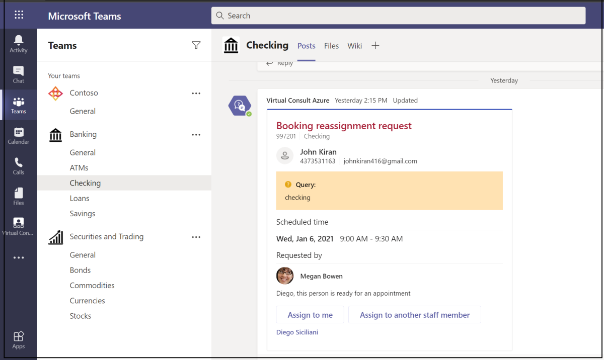
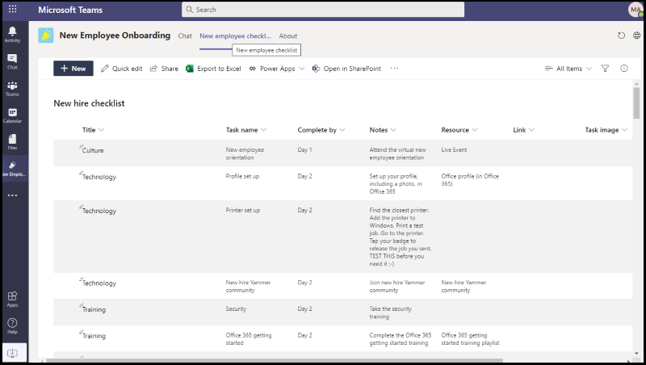

# App-Vorlagen für Microsoft TeamsApp templates for Microsoft Teams

App-Vorlagen sind Beispiele für vollständige Apps für Microsoft Teams Open-Source-Apps, die auf einer GitHub.App templates are examples of complete apps for Microsoft Teams that are open-source and available on GitHub. Jede App-Vorlage enthält ausführliche Anweisungen zum Bereitstellen und Installieren dieser App für Ihre Organisation.Each app template contains detailed instructions for deploying and installing that app for your organization. Außerdem bietet es eine Beispiel-App, die Sie sofort installieren und verwenden können.It also provides a sample app that you can install and start using immediately. Der vollständige Quellcode ist ebenfalls verfügbar, mit dem Sie ihn detailliert untersuchen oder den Code forken und an Ihre spezifischen Anforderungen anpassen können.The complete source code is also available, which allows you to explore it in detail or fork the code and alter it to meet your specific requirements.
Alle App-Vorlagen werden unter den [MIT-Lizenzbedingungen](https://github.com/OfficeDev/microsoft-teams-apps-eprescription/blob/master/LICENSE) bereitgestellt.All app templates are provided under the [MIT License](https://github.com/OfficeDev/microsoft-teams-apps-eprescription/blob/master/LICENSE) terms.

> [!NOTE] 
> Sie müssen Apps, die aus App-Vorlagen für Ihre Benutzer und Organisationen erstellt wurden, lizenz- und unterstützen.You must license and support apps created from app templates for your users and organizations.

**&#9734; Gibt neu veröffentlichte App-Vorlagen an.****&#9734; Indicates newly released app templates.**

### Wichtige VorteileKey benefits

* **Direkte Bereitstellung in der Cloud:** Alle App-Vorlagen enthalten Bereitstellungsskripts, mit dem Sie alle erforderlichen Dienste in Microsoft Azure oder der Power Platform hosten können.**Deploy directly to the cloud:** All app templates include deployment scripts that allows you to host all required services in Microsoft Azure or the Power Platform. 
* **Empfohlener Beispielcode:** Die App-Vorlagen entsprechen den empfohlenen bewährten Methoden für Sicherheit und Infrastruktur.**Recommended sample code:** The app templates conform to recommended best practices around security and infrastructure. Alle von der Community übermittelten Änderungen an den App-Vorlagen werden überprüft, um die Konformität sicherzustellen.All community submitted changes to the app templates are reviewed to ensure conformance.
* **Anpassbar und erweiterbar:** Während alle App-Vorlagen mit minimaler Konfiguration bereitgestellt werden, werden die gesamte Codebasis und Bereitstellungsskripts bereitgestellt, sodass Sie sie ganz einfach an Ihre individuellen Anforderungen anpassen oder erweitern können.**Customizable and extensible:** While all app templates are deployed with minimal configuration, the entire code base and deployment scripts are provided, so that you can easily customize or extend them to fit your unique needs.
* **Ausführliche Dokumentation:** Alle App-Vorlagen werden von einer End-to-End-Dokumentation zu Lösungsarchitektur, Bereitstellung und Konfigurationsschritten begleitet.**Detailed documentation:** All app templates are accompanied by end-to-end documentation on solution architecture, deployment, and configuration steps.  

## Adoption BotAdoption Bot 

Adoption Bot ist ein Chatbot für die Benutzerpflege, der mit Power Virtual Agent für Teams PVA erstellt wurde.Adoption Bot is a user care chat bot built with Power Virtual Agent for Teams PVA. Es wird als die PVA-Version von FAQ Plus betrachtet.It is considered as the PVA version of FAQ Plus. Adoption Bot beantwortet mehr als 100 häufig gestellte Fragen zu Microsoft 365 und Teams.Adoption Bot answers 100+ common questions about Microsoft 365 and Teams. Sie können die vorhandenen Themen bearbeiten, eigene Themen hinzufügen und vorhandene FAQs hinzufügen.You can edit the existing topics, add your own topics, and ingest existing FAQs. Wenn Benutzer zusätzliche Hilfe benötigen, kann Adoption Bot sie mit Experten verbinden oder sogar auf das Öffnen von Diensttickets mit Premium-Flussconnectors erweitert werden.If users need additional help, Adoption Bot can connect them to experts or even be extended to open service tickets with premium flow connectors. Dieser Bot ist selbst installiert oder in eine benutzerdefinierte App wie den [Adoption Hub integrierte.](https://github.com/akporzondek/adoption_hub)This bot is self-installed or built into a custom app, such as the [Adoption Hub](https://github.com/akporzondek/adoption_hub).

[Get it on GitHubGet it on GitHub](https://github.com/OfficeDev/microsoft-teams-apps-adopt-bot)

## Einführungstool – Champion Management Platform &#9734;Adoption Tool- Champion Management Platform &#9734;

Mit der #A0 (Champion Management Platform) können Sie Ihre Teamarbeits-Champions verwalten, skalieren und inspirieren, um mehr zu erreichen.The Champion Management Platform (CMP) app template helps you manage, scale, and inspire your teamwork champions to achieve more. Diese App-Vorlage basiert auf SharePoint-Framework und wird innerhalb eines Teams in eine Registerkarte geladen.This app template is built on the SharePoint Framework and loaded into a tab within a team. Gruppen können dieses Tool nutzen, um die Programmmitgliedschaft zu verwalten, eine Bestenliste und Ereignistypen für die Protokollierung sowie Tools zum Überlagern digitaler Badges für Programmteilnehmer zur Verfügung zu stellen.Groups can leverage this tool to help manage program membership, provide a leaderboard and event types for logging, and tools to overlay digital badges to program participants.

[Get it on GitHubGet it on GitHub](https://github.com/OfficeDev/microsoft-teams-apps-champion-management)

## Einführungstool– Microsoft 365 Lernpfade (Erste Schritte) &#9734;Adoption Tool- Microsoft 365 Learning Pathways (Get Started) &#9734;

Mit Erste Schritte-App-Vorlage können Sie die Leistung Microsoft 365 Lernpfade in Microsoft Teams.The Get Started app template allows you to bring the power of Microsoft 365 learning pathways inside of Microsoft Teams. Mit dieser App-Vorlage können Sie einfachen Zugriff auf bestimmte Schulungsseiten oder andere Intranetressourcen gewähren und die Inhalte direkt innerhalb des Teams.This app template allows you to grant easy access to specific training pages or other intranet assets and load the content directly within Teams. Sie können den Namen oder das Logo der App auch so ändern, dass sie Ihrem Unternehmensbranding entsprechen.You can also change the app name or logo to match your company branding.

[Get it on GitHubGet it on GitHub](https://github.com/msft-teams/tools/tree/master/M365%20Learning%20Pathways)

## Appointment ManagerAppointment Manager 

Termin-Manager ist eine Teams-App-Vorlage, die Unternehmen dabei hilft, virtuelle Termine mit Denkkunden zu erstellen, zu verwalten und Teams.Appointment Manager is a Teams app template to help businesses create, manage, and conduct virtual appointments with consumers through Teams. Neue Terminanfragen von Verbrauchern sind in Teams sichtbar, in denen sie schnell zugewiesen und mitarbeitern in einem Team zugewiesen werden.New appointment requests from consumers are visible in Teams channels, where they are quickly assigned and reassigned to staff in a team. Terminanfragen werden auf Team- oder persönlichen Ebenen über benutzerdefinierte Registerkarten angezeigt.Appointment requests are viewed at team or personal levels through custom tabs. Jeder Termin ist einer Teams zugeordnet, daher können Mitarbeiter und Verbraucher problemlos zur geplanten Zeit an der Besprechung teilnehmen.Every appointment is associated with a Teams online meeting, hence the staff and consumers can easily join the meeting at the scheduled time.

Die App-Vorlage wird in Microsoft Bookings integriert, um die Terminverwaltung zu einfach zu machen.The app template integrates with Microsoft Bookings for easy appointment management. Geplante Termine werden automatisch in den Kalendern der zugewiesenen Mitarbeiter angezeigt, und Verbraucher erhalten anpassbare E-Mail-Benachrichtigungen und Erinnerungen mit eingebetteten Besprechungslinks.Scheduled appointments automatically appear on assigned staff members' calendars, and consumers receive customizable email notifications and reminders with embedded meeting links.

[Get it on GitHubGet it on GitHub](https://github.com/OfficeDev/microsoft-teams-apps-appointment-manager)

 

## Ask AwayAsk Away

Ask Away ist ein [Microsoft Teams Bot,](../bots/what-are-bots.md) der Benutzern die Durchführung von Fragen und Antworten ermöglicht, die als Q&A-Sitzungen innerhalb von Teams.Ask Away is a [Microsoft Teams bot](../bots/what-are-bots.md) that enables users to conduct Question and Answer, called Q&A sessions within Teams. Mithilfe des Bots "Weg fragen" können Teammitglieder Fragen übermitteln und fragen, die von Kollegen gemeinsam genutzt werden, sodass Fragen und Antworten&Einem Host problemlos in einem Kanal oder Chat gesammelt werden können.Using the Ask Away bot, team members can submit and up-vote questions shared by colleagues allowing Q&A hosts to easily gather top-of-mind questions within a channel or chat. Der Bot wird verwendet, um eine Echtzeit-Frage-&einer Sitzung in einer Teams-Besprechung zu führen, und ermöglicht Teilnehmern, Fragen live über Chat zu übermitteln.The bot is used to conduct a real-time Q&A session in a Teams meeting and allows attendees to submit questions live through chat.

[Get it on GitHubGet it on GitHub](https://github.com/OfficeDev/microsoft-teams-apps-askaway)

:::row:::
  :::column span="2":::
      
:::column-end:::
:::row-end:::

## Assoziierte EinblickeAssociate Insights

Associate Insights ist eine [Power Apps](/powerapps/maker/canvas-apps/embed-teams-app) Vorlage, mit der Mitarbeiter von firstline Kundenmeinungen, -stimmungen und -wahrnehmungen direkt erfassen und übermitteln können.Associate Insights is a [Power Apps](/powerapps/maker/canvas-apps/embed-teams-app) template that empowers firstline workers to directly capture and submit customer opinion, sentiment, and perception. Firstline-Mitarbeiter sind häufig der erste Unternehmensvertreter, der sich mit Kunden an einem 1:1-Kontaktpunkt beschäftigt.Firstline workers are often the first company representative to engage with customers in a one-to-one point-of contact. Die gesammelten Daten werden gemeinsam von Geschäftsteams freigegeben und verwendet, z. B. über eine registerkarte Power BI Teams, um die Produktverbesserung zu verbessern und die Kundenerfahrung zu verbessern.The collected data are shared and used collaboratively by business teams, such as through a Power BI Teams tab, for product improvement and enhancing the customer experience.

[Get it on GitHubGet it on GitHub](https://github.com/OfficeDev/microsoft-teams-apps-associateinsights)

:::row:::
  :::column span="2":::
      
:::column-end:::
:::row-end:::
:::row:::
:::column span="2":::
    
:::column-end:::
:::row-end:::

## AnwesenheitAttendance

Die Anwesenheits-App ist [Power Apps,](/powerapps/maker/canvas-apps/embed-teams-app) die in einem Team angeheftet sind.The Attendance app is a [Power Apps](/powerapps/maker/canvas-apps/embed-teams-app) tab that are pinned in a team. Es ist so konzipiert, dass Anwesenheit in Einstellungen aufgezeichnet wird, z. B. in Lern- und Schulungsumgebungen.It is designed to record presence in settings, such as learning and training environments. Benutzer können die Teilnahme in der Vergangenheit bis zu 30 Tage lang markieren oder bearbeiten und zusammenfassende Anwesenheitsberichte für eine gesamte Gruppe oder einzelne Teilnehmer anzeigen.Users can mark or edit attendance for up to 30 days in the past and view summarized attendance reports for an entire group or individual attendees. Weitere Informationen zur Teilnahme an Teams finden Sie unter [Get it on GitHub](https://github.com/OfficeDev/microsoft-teams-apps-attendance).For more information on teams attendance, see [Get it on GitHub](https://github.com/OfficeDev/microsoft-teams-apps-attendance).

In der folgenden Abbildung wird die Teilnahme-App-Demo angezeigt:The following image displays the attendance app demo:  

## Book-a-roomBook-a-room

Book-a-room ist ein [Microsoft Teams-Bot,](../bots/what-are-bots.md) mit dem Benutzer einen Besprechungsraum für 30, 60 oder 90 Minuten ab der aktuellen Uhrzeit schnell finden und reservieren können.Book-a-room is a [Microsoft Teams bot](../bots/what-are-bots.md) that allows users quickly to find and reserve a meeting room for 30, 60, or 90 minutes starting from the current time. Die Standardzeit beträgt 30 Minuten.The default time is 30 minutes. Der Book-a-room-Bot bietet Bereiche für persönliche oder 1:1-Unterhaltungen.The Book-a-room bot scopes to personal or 1:1 conversations. Weitere Informationen zur Book-a-room-App finden Sie unter [Get it on GitHub](https://github.com/OfficeDev/microsoft-teams-apps-bookaroom).For more information on Book-a-room app, see [Get it on GitHub](https://github.com/OfficeDev/microsoft-teams-apps-bookaroom).  
Die folgende Abbildung zeigt die Book-a-room-Demo:The following image displays the Book-a-room demo:

## Erstellen von ZugriffBuilding Access

Building Access ist eine Microsoft [Power Platform-basierte](https://powerapps.microsoft.com/blog/now-in-preview-customize-teams-with-built-in-power-platform-capabilities/) App, die die Verwaltung von Belegungsschwellenwerte und Normen für die soziale Distanzierung unterstützt, indem es Den Verantwortlichen von Einrichtungen ermöglicht wird, die Anwesenheit von Mitarbeitern vor Ort zu verwalten, nachzuververwalten und zu melden.Building Access is a Microsoft [Power Platform](https://powerapps.microsoft.com/blog/now-in-preview-customize-teams-with-built-in-power-platform-capabilities/) based app that supports the administration of building occupancy thresholds and social distancing norms by enabling facilities directors to manage, track, and report employee on-site presence. Die app, die mithilfe von Microsoft [Power Apps](/powerapps/powerapps-overview)und [Power Automate](/power-automate/getting-started)erstellt wurde, integriert sich tief in Microsoft Teams und ermöglicht Es Organisationen, die Aufbaubereitschaft zu bestimmen, Berechtigungskriterien für den Zugriff vor Ort festzulegen und Einblicke für die zukünftige Planung zu sammeln.The app, built using Microsoft [Power Apps](/powerapps/powerapps-overview), and [Power Automate](/power-automate/getting-started), deeply integrates with Microsoft Teams and enables organizations to determine building readiness, establish eligibility criteria for on-site access, and gather insights for future planning.

[Get it on GitHubGet it on GitHub](https://github.com/OfficeDev/microsoft-teams-apps-buildingaccess)

:::row:::
   :::column span="":::
     
   :::column-end:::
   :::column span="":::
      
   :::column-end:::
:::row-end:::

## FeiernCelebrations

"Festlichkeiten" ist Teams App, die Teammitgliedern dabei hilft, geburtstage, Jubiläen und andere wiederkehrende Ereignisse zu zelebrieren.Celebrations is a Teams app that helps team members to celebrate each others' birthdays, anniversaries, and other recurring events. Er erinnert sich an besondere Anlässe aller Teammitglieder und sendet eine freundliche Nachricht in allen teams, die zum Zeitpunkt der Ereigniserstellung ausgewählt wurden, um den Teammitgliedern ein besonderes Gefühl an ihrem Tag zu machen.It remembers special occasions of all the team members and sends a friendly message in all the teams selected at the time of event creation, to make the team members feel special on their day.

Die App bietet allen Teammitgliedern eine einfache Schnittstelle zum persönlichen Hinzufügen und Anzeigen ihrer Ereignisse und ermöglicht es dem Benutzer, die Teams auszuwählen, in denen die Ereignisse freigegeben werden.The app provides an easy interface for all the team members to personally add and view their events and also allows the user to select the teams in which the events gets shared.

[Get it on GitHubGet it on GitHub](https://github.com/OfficeDev/microsoft-teams-celebrations-app)

## ChecklisteChecklist

Prüfliste ist eine benutzerdefinierte Microsoft Teams Messaging-Erweiterungs-App, mit der Sie mit Ihrem Team zusammenarbeiten können, indem Sie eine freigegebene Prüfliste in einem Chat oder Kanal erstellen. Checklist is a custom Microsoft Teams [messaging extension](../messaging-extensions/what-are-messaging-extensions.md) app that enables you to collaborate with your team by creating a shared checklist in a chat or channel. Die App wird auf allen Teams unterstützt, z. B. Desktopbrowser, iOS und Android.The app is supported across all Teams platform clients, such as desktop browser, iOS, and Android. Die App ist für die Bereitstellung im Rahmen Ihres Microsoft 365 bereit.The app is ready for deployment as part of your Microsoft 365 subscription.  

[Get it on GitHubGet it on GitHub](https://github.com/OfficeDev/microsoft-teams-checklist-app)

:::row:::
:::column span="2":::
      
:::column-end:::
:::row-end:::

## Classroom-Drop-InClassroom Drop-in 

Das Classroom-Drop-In ist eine Microsoft [Power Platform-basierte](https://powerapps.microsoft.com/blog/now-in-preview-customize-teams-with-built-in-power-platform-capabilities/)App, mit der Systemleiter Klassenteams finden, virtuelle Kursräume finden und sich selbst oder andere zu diesen Kursteams für einen bestimmten Drop-In-Zeitraum hinzufügen können, je nach Bedarf.Classroom Drop-in is a Microsoft [Power Platform](https://powerapps.microsoft.com/blog/now-in-preview-customize-teams-with-built-in-power-platform-capabilities/)-based app that enables system leaders to find class teams, means virtual classrooms and add themselves or others to these class teams for a specified drop-in period, as needed. Die app built using Microsoft [Power Apps](/powerapps/powerapps-overview) and [Power Automate](/power-automate/getting-started), deeply integrations with Microsoft Teams to ensure educational institute can optimize their operations in a hybrid learning environment by providing access to relevant stakeholders for class teams per business requirements.The app built using Microsoft [Power Apps](/powerapps/powerapps-overview) and [Power Automate](/power-automate/getting-started), deeply integrates with Microsoft Teams to ensure educational institutes can optimize their operations in a hybrid learning environment by providing access to relevant stakeholders for class teams per business requirements.

[Get it on GitHubGet it on GitHub](https://github.com/OfficeDev/microsoft-teams-apps-classroom-dropin)

## Unternehmens-CommunicatorCompany Communicator

Die App Communicator ermöglicht Unternehmensteams das Erstellen und Senden von Nachrichten, die für mehrere Teams oder eine große Anzahl von Mitarbeitern im Chat vorgesehen sind, sodass die Organisation mitarbeiter direkt dort erreichen kann, wo sie zusammenarbeiten.The Company Communicator app enables corporate teams to create and send messages intended for multiple teams or large number of employees over chat allowing organization to reach employees right where they collaborate. Verwenden Sie diese Vorlage für mehrere Szenarien, z. B. Ankündigungen neuer Initiativen, Mitarbeiter-Onboarding, modernes Lernen und Entwicklung oder organisationsweite Übertragungen.Utilize this template for multiple scenarios such as new initiative announcements, employee onboarding, modern learning, and development or organization-wide broadcasts.

Die App bietet eine einfache Schnittstelle für designierte Benutzer zum Erstellen, Anzeigen, Zusammenarbeiten und Senden von Nachrichten.The app provides an easy interface for designated users to create, preview, collaborate and send messages.

Es bietet eine Grundlage zum Erstellen benutzerdefinierter gezielter Kommunikationsfunktionen wie benutzerdefinierte Telemetrie, um zu erfahren, wie viele Benutzer eine Nachricht bestätigt oder mit dieser interagiert haben.It provides a foundation to build custom targeted communication capabilities such as custom telemetry on how many users acknowledged or interacted with a message.

[Get it on GitHubGet it on GitHub](https://github.com/OfficeDev/microsoft-teams-company-communicator-app)

## Nachschlageaktion für KontaktgruppenContact Group Lookup

Die App Contact Group Lookup bietet einen praktischen und nützlichen Ansatz zum Erstellen, Zugreifen auf und Verwalten der Kontaktgruppen Ihrer Organisation, die früher als Verteilerlisten oder Kommunikationsgruppen bezeichnet wurden.The Contact Group Lookup app provides a convenient and useful approach to creating, accessing, and managing your organization's contact groups, formerly known as distribution lists or communication groups. Benutzer können schnell Gruppenmitglieder anzeigen und chatten, den Mitgliederstatus anzeigen und einen Gruppenchat mit ausgewählten Mitgliedern in der Kontaktgruppe erstellen, und dies alles innerhalb Teams Umgebung.Users can quickly view and chat with group members, view member status, and create a group chat with selected members in the contact group, all within the Teams environment.

[Get it on GitHubGet it on GitHub](https://github.com/OfficeDev/microsoft-teams-app-contactgrouplookup)

:::row:::
:::column span="2":::
      
:::column-end:::
:::row-end:::
:::row:::
:::column span="2":::
    
:::column-end:::
:::row-end:::

## Kollegen dankenCo-worker Appreciation 

Mithilfe der Vorlage "Kollegen-Bewertung" in Microsoft Teams können Benutzer die Erfolge ihrer Kollegen innerhalb des kontextbezogenen Teams erkennen.Using the co-worker appreciation template in Microsoft Teams, users can recognize their colleagues' achievements within the Teams’ context. Wenn Kollegen einen Kollegen belohnen, werden Empfänger und andere Teammitglieder in einer Kanalgespräch markiert und erhalten eine Benachrichtigung über die Preisdetails des Kanals.When co-workers select to reward a colleague, recipients and other team members are tagged in a channel conversation and they receive a notification about the channel's award details. Die Preise werden in der app Teams aufgezeichnet, die sicher, portabel und einfach zu teilen ist.The awards are recorded in the Teams app, which is secure, portable, and easily shareable. Dies wird als powerApps-basierte Version der Open Badges-App-Vorlage mit einer Bestenliste betrachtet.This is considered as the PowerApps based version of the Open Badges app template, with a leaderboard.

[Get it on GitHubGet it on GitHub](https://github.com/OfficeDev/microsoft-teams-apps-coworker-appreciation)

## CrowdSourcerCrowdSourcer

CrowdSourcer ist ein [Microsoft Teams Bot,](../bots/what-are-bots.md) der teams abgefragte Informationen zur Verfügung stellt, die gemeinsam von Gruppenmitgliedern stammen.CrowdSourcer is a [Microsoft Teams bot](../bots/what-are-bots.md) that gives teams queried information sourced collaboratively from group members. Es hilft dabei, häufig gestellte Fragen zu beantworten, während teilnehmer aktiv an einer unterhaltsamen und hilfreichen Informationsressource beteiligt werden können.It helps to answer frequently asked questions while enabling participants to actively engage in and contribute to a fun and helpful information resource.

[Abrufen auf GithubGet it on Github](https://github.com/OfficeDev/microsoft-teams-crowdsourcer-app)

## Custom StickersCustom Stickers

Selbstausdruck ist der Kern einer gesunden Teamkultur.Self-expression is core to a healthy team culture. Diese App-Vorlage ist eine [Messagingerweiterung,](~/messaging-extensions/what-are-messaging-extensions.md) mit der Ihre Benutzer benutzerdefinierte Aufkleber und GIFs innerhalb eines Microsoft Teams.This app template is a [messaging extension](~/messaging-extensions/what-are-messaging-extensions.md) that enables your users to use custom stickers and GIFs within Microsoft Teams. Diese Vorlage bietet eine einfache webbasierte Konfigurationserfahrung, bei der jeder benutzer mit Konfigurationszugriff die GIFs, Aufkleber und Bilder hochladen kann, die seine Benutzer haben möchten, sodass Ihr gesamtes Team alle von Ihnen festgelegten Aufkleber verwenden kann.This template provides an easy web-based configuration experience where anyone with configuration access can upload the GIFs, stickers, and images they want their users to have, allowing your entire team to use any set of stickers you choose.

Diese App ermöglicht außerdem die einfache Freigabe von Bildern, GIFs und Aufklebern in teamsübergreifend, ohne zugriff auf SharePoint Websites oder einzelne Kanäle als Speicher- und Freigabemechanismen zu benötigen.This app also enables easy sharing of images, GIFs, stickers across teams without needing access to SharePoint sites or individual channels as storage and sharing mechanisms. Beispielsweise können Produktteams Produktbilder und GIFs problemlos programmgesteuert für social media, marketing und sales teams freigeben.For example, product teams can easily share product images and GIFs to social media, marketing, and sales teams programmatically. Sie können diese App auch erweitern, indem sie einen Benachrichtigungsfluss für bestimmte Teams oder Einzelpersonen auslöst, wenn neue Bilder und GIFs verfügbar gemacht werden.One can also extend this app by triggering a notification flow to specific teams or individuals when new images, and GIFs are made available.

[Get it on GitHubGet it on GitHub](https://github.com/OfficeDev/microsoft-teams-stickers-app)

## MitarbeiterideenEmployee Ideas

Die Employee Ideas-App ist die PowerApps-Version der Azure-basierten App-Vorlage für großartige Ideen.The Employee Ideas app is the PowerApps version of the Azure based Great Ideas app template. Die App ermöglicht es Teams Benutzern, eine Ideenkampagne zu erstellen und zu konfigurieren.The app enables the Teams users to set up and configure an idea campaign. Eine Ideenkampagne ist eine Kategorie zum Gruppieren von Ideen zu allgemeinen Designs.An idea campaign is a category for grouping ideas around common themes.

Teams benutzer können auch die folgenden Aktivitäten ausführen:Teams users can also perform the following activities:

* Konfigurieren Sie ein Standardübermittlungsformular, das Mitarbeiter für jede Idee übermitteln müssen.Configure a standard submission form that employees must submit for each idea. 
* Überprüfen und verwalten Sie die Ideen und die Liste der Kampagnen.Review and manage the ideas and list of campaigns.
* Ändern und Löschen von Kampagnen.Modify and delete campaigns.
* Überprüfen Sie Die Bestenlisten von Ideen.Review leader boards of ideas.
* Stimmen Sie für priorisierte Ideen ab, und teilen Sie sie.Vote for and share prioritized ideas.
* Übermitteln Sie Ideen für eine Kampagne.Submit ideas for a campaign.
* Sehen Sie sich die Idee eines anderen Teammitglieds an.View other team member's idea.
* Stimmen Sie über die am häufigsten gefallenen Ideen ab.Vote on most liked ideas.
* Überprüfen Sie die Leistung ihrer Ideen im Vergleich mit anderen innerhalb einer Kampagne.Review the performance of their ideas compared with others within a campaign.

[Get it on GitHubGet it on GitHub](https://github.com/OfficeDev/microsoft-teams-apps-employeeideas)

 

## E-PrescriptionsE-Prescriptions 

E-Prescriptions ist eine [Power Apps-basierte](/powerapps/maker/canvas-apps/embed-teams-app) App, die die Telemedikierung und virtuelle Behandlung verbessert, indem der Prozess der Ausgabe von E-Rezepten für Patienten automatisiert wird.E-Prescriptions is a [Power Apps](/powerapps/maker/canvas-apps/embed-teams-app) based app that enhances telemedicine and virtual care by automating the process of issuing e-prescriptions to patients. Medizinische Experten können Termine schnell überprüfen, E-Rezepte generieren und E-Mails mit E-Rezept-Anlagen direkt innerhalb der Teams senden.Medical professionals can quickly review appointments, generate e-prescriptions, and send emails with e-prescription attachments to patients directly within the Teams platform.

[Get it on GitHubGet it on GitHub](https://github.com/OfficeDev/microsoft-teams-apps-eprescription) 

:::row:::
:::column span="2":::
      
:::column-end:::
:::row-end:::
:::row:::
:::column span="2":::
    
:::column-end:::
:::row-end:::

## MitarbeiterschulungenEmployee Training 

Mitarbeiterschulung ist eine Microsoft Teams App, mit der Organisatoren Lern- und Schulungsereignisse für Ihre Organisation einfach veröffentlichen, nachverfolgen und bewerben können.Employee training is a Microsoft Teams app that enables organizers to easily publish, track, and promote learning and training events for your organization.  Mit der App können Ereignisplaner Erinnerungen und Benachrichtigungen an Ereignisregistranten senden, und Mitarbeiter können Interesse an bevorstehenden Ereignissen anzeigen, aktuelle Ereignisse aktualisieren und Ereignisdetails mit Kollegen über die messaging-Erweiterung Teams teilen.With the app, event planners can send reminders and notifications to event registrants and employees can indicate interest in upcoming events, stay updated on current events, and share event details with colleagues through the Teams messaging extension.

[Get it on GitHubGet it on GitHub](https://github.com/OfficeDev/microsoft-teams-apps-employeetraining)

:::row:::
:::column span="2":::
    **Anzeigen von Schulungsereignissen für Mitarbeiter** **View employee training events**   
:::column-end:::
:::row-end:::
:::row:::
:::column span="2":::
    **Erstellen eines Schulungsereigniss für Mitarbeiter** **Create employee training event** 
:::column-end:::
:::row-end:::

## Experten-FinderExpert Finder

Der Experten-Finder ist Microsoft Teams [Bot,](../bots/what-are-bots.md) der bestimmte Organisationsmitglieder basierend auf ihren Fähigkeiten, Interessen und Bildungsattributen identifiziert.Expert Finder is a [Microsoft Teams bot](../bots/what-are-bots.md) that identifies specific organization members based on their skills, interests, and education attributes. Mitglieder finden Experten in einer Organisation, die einer Stichwortsuche nach Azure Active Directory entsprechen.Members find experts within an organization that match a keyword search of Azure Active Directory user profiles.

[Get it on GitHubGet it on GitHub](https://github.com/OfficeDev/microsoft-teams-apps-expertfinder)

## FAQ PlusFAQ Plus

Conversational Q&A bots sind eine einfache Möglichkeit, Antworten auf häufig gestellte Fragen von Benutzern zu geben.Conversational Q&A bots are an easy way to provide answers to frequently asked questions by users. Die meisten Bots können jedoch nicht sinnvoll mit Benutzern interagieren, da kein Mensch in der Schleife ist, wenn der Bot ausfällt.But, most bots fail to engage with users in meaningful way because there is no human in the loop when the bot fails. Der FAQ-Bot ist ein&Ein Bot, der einen Menschen in die Schleife bringt, wenn er nicht helfen kann.FAQ bot is a friendly Q&A bot that brings a human in the loop when it is unable to help. Man kann dem Bot eine Frage stellen, und der Bot antwortet mit einer Antwort, wenn er in der Wissensdatenbank enthalten ist.One can ask the bot a question and the bot responds with an answer if it is contained in the knowledge base. Andern falls nicht, ermöglicht der Bot dem Benutzer das Senden einer Abfrage, die dann an ein vorkonfiguriertes Expertenteam gesendet wird, das bei der Unterstützung hilft, indem er auf die Benachrichtigungen innerhalb des Teams selbst einwirken kann.If not, the bot allows the user to submit a query which then gets posted to a pre-configured team of experts who help to provide support by acting upon the notifications from within the team itself.

> [!NOTE]
> Die neueste Version von **FAQ Plus** unterstützt verbesserte Lösungen&Fragen und Antworten, da ein Expertenteam folgendes abschließen kann:The latest release of **FAQ Plus** supports improved Q&A resolutions by enabling a team of experts to complete the following:
>
> &#x2714; Hinzufügen neuer Fragen&Direkt zur Wissensdatenbank mithilfe von Nachrichtenerweiterungen.&#x2714; Add new Q&As directly to the knowledge base using message extensions.
>
> &#x2714; Bearbeiten und Löschen von&Ein Paar, das von einem Bot hinzugefügt wurde.&#x2714; Edit and delete Q&A pairs added by a bot.
>
> &#x2714; Verfolgen des Überarbeitungsverlaufs von Q&As.&#x2714; Track the revision history of Q&As.
>
> &#x2714; Konfigurieren sie eine Antwort mit zusätzlichen Details, die als adaptive [Karte angezeigt werden.](../task-modules-and-cards/cards/cards-reference.md#adaptive-card)&#x2714; Configure an answer with additional details to display as an [Adaptive Card](../task-modules-and-cards/cards/cards-reference.md#adaptive-card).
>
[Get it on GitHubGet it on GitHub](https://github.com/OfficeDev/microsoft-teams-apps-faqplusv2)

## Support-App erhaltenGet Support App

Die App Support anfordern wird von Organisationen verwendet, die Microsoft Teams verwenden, um allen Benutzern die Möglichkeit zu ermöglichen, Unterstützung von Vorgesetzten an zu fordern.The Get Support app is used by organizations that are using Microsoft Teams, to enable any set of users to request assistance from supervisors. Diese App umfasst die folgenden Features:This app includes the following features:
* Anfordern von Unterstützung für verschiedene Kategorien von einer Power App.Requesting assistance on different categories from a Power App.
* Benachrichtigungen, die an Ansenden gesendet werden, die sie darüber informieren, wem der Hase zugewiesen ist.Notifications sent to requestors informing them of who hare assigned.
* Benachrichtigungen, die an zugewiesene Vorgesetzte gesendet werden und sie darüber informieren, wer Unterstützung benötigt.Notifications sent to assigned supervisors informing them of who needs assistance. 
* Analysieren von Eskalationen und Mustern in SharePoint und PowerBI.S.Analyzing escalations and patterns in SharePoint and PowerBI.S.

[Get it on GitHubGet it on GitHub](https://github.com/OfficeDev/microsoft-teams-app-get-support/)

## ZielverfolgungGoal Tracker

Die Zielverfolgungs-App ist eine umfassende Lösung für Ihre Organisation, um das Einrichten von Zielen zu unterstützen, den Fortschritt zu beobachten und den Erfolg innerhalb der Organisation Microsoft Teams.The Goal Tracker app is a comprehensive solution for your organization to support establishing goals, observing progress, and acknowledging success within Microsoft Teams. Die App ermöglicht Benutzern das Festlegen, Nachverfolgen und Aktualisieren von Zielen auf professioneller, persönlicher und Teamebene.The app enables users to set, track, and update objectives on a professional, personal, and team level. Teammitglieder erhalten außerdem rechtzeitige Erinnerungen und Statusupdates, um konzentriert zu bleiben und auf dem richtigen Weg zu bleiben.Team members also receive timely reminders and status updates to remain focused and stay on track.

[Get it on GitHubGet it on GitHub](https://github.com/OfficeDev/microsoft-teams-app-goaltracker)

:::row:::
  :::column span="2":::
      
:::column-end:::
:::row-end:::
:::row:::
:::column span="2":::
    
:::column-end:::
:::row-end:::

## Großartige IdeenGreat Ideas

Die Great Ideas-App unterstützt und fördert Innovation und Kreativität in Ihrer Organisation.The Great Ideas app supports and empowers innovation and creativity within your organization. Die App ermöglicht Es Ihren Mitarbeitern, Ideen mit Kollegen und Führungskräften auszutauschen, neue Übermittlungen zu entdecken, Beiträge für Peers ins Rampenlicht zu stellen und ihre Stimme für die besten Vorschläge innerhalb des Microsoft Teams.The app enables your employees to share ideas with colleagues and leadership, discover new submissions, spotlight contributions for peer consideration, and cast their vote for the best proposals within Microsoft Teams.

[Get it on GitHubGet it on GitHub](https://github.com/OfficeDev/microsoft-teams-apps-greatideas)

:::row:::
  :::column span="2":::
      
:::column-end:::
:::row-end:::
:::row:::
:::column span="2":::
    
:::column-end:::
:::row-end:::

## GruppenaktivitätenGroup Activities

Gruppenaktivitäten ist eine Microsoft Teams, mit der Teambesitzer schnell Aktivitätsgruppen erstellen und Workflows für die Zusammenarbeit im Kontext von Microsoft Teams.Group Activities is a Microsoft Teams app that makes it easy for team owners to quickly create activity groups and manage collaboration workflows within the context of Microsoft Teams. Aktivitätsautoren können Aktivitäten erstellen, Teammitglieder zufällig in Gruppen verteilen und optional vom Bot Erinnerungen senden, bis die Aktivitäten abgeschlossen sind.Activity authors are enabled to create activities, randomly distribute team members in groups, and optionally have the bot send reminders until activities are complete.

[Get it on GitHubGet it on GitHub](https://github.com/OfficeDev/microsoft-teams-apps-groupactivities)

:::row:::
  :::column span="2":::
      
:::column-end:::
:::row-end:::
:::row:::
:::column span="2":::
    
:::column-end:::
:::row-end:::

## Gruppen Verbinden &#9734;Group Connect &#9734;

Group Verbinden ist eine Microsoft Teams App, die Organisationsmitgliedern dabei hilft, Mitarbeitergruppen zu ermitteln und informationen zu finden, die für Mitarbeitergruppen relevant sind.Group Connect is a Microsoft Teams app that helps organization members discover employee groups and find information relevant to employee groups. Die App verfügt über umfassende Funktionen für Organisationsleiter, um mit ihren Mitarbeitern in Bezug auf Gruppen, Ereignisse und Ressourcen zu kommunizieren.The app comes built-in with rich capabilities for organization leaders to communicate with their employees regarding groups, events, and resources. Die Verbinden-App passt auch Gruppenmitglieder in der gewünschten Häufigkeit an, um die Vernetzung und den Zusammenhalt innerhalb einer Gruppe zu fördern.The Group Connect app also matches group members with each other at their desired frequency to encourage networking and cohesion within a group. Weitere Informationen dazu, wie Sie die App "Group Verbinden" nutzen können, um Die Mitarbeitergruppen in Ihrer Organisation zu unterstützen, finden Sie in der App auf GitHub.For more information on how you can leverage the Group Connect app to help employee groups foster within your organization, see the app on GitHub.

[Get it on GitHubGet it on GitHub](https://github.com/OfficeDev/microsoft-teams-apps-groupconnect)

## Erweitern Sie Ihre FähigkeitenGrow Your Skills

Die App Grow Your Skills unterstützt professionelles Wachstum und Entwicklung, indem Mitarbeiter an ergänzenden Projekten für Ihre Organisation beitragen und gleichzeitig neue Fähigkeiten erlernen können.The Grow Your Skills app supports professional growth and development by enabling employees to contribute to supplemental projects for your organization while simultaneously learning new skills. Mitarbeiter können die App verwenden, um Möglichkeiten zu finden, die ihren Interessen entsprechen, eine sinnvolle Zusammenarbeit mit Kollegen zu genießen und neue Kompetenz- und Funktionenstufen zu erwerben, und dies alles in Teams Umgebung.Employees can use the app to locate opportunities that meet their interests, enjoy meaningful collaboration with peers, and acquire new levels of expertise and capabilities, all within the Teams environment.

[Get it on GitHubGet it on GitHub](https://github.com/OfficeDev/microsoft-teams-apps-growyourskills)

:::row:::
  :::column span="2":::
      
:::column-end:::
:::row-end:::
:::row:::
:::column span="2":::
    
:::column-end:::
:::row-end:::

## HR SupportHR Support

Hr Support bot ist ein benutzerfreundlicher Q&Ein Bot, der einen Supportexperten oder Experten aus dem Personalteam in die Schleife bringt, wenn er nicht helfen kann.HR Support bot is a friendly Q&A bot that brings a support professional or expert from the HR team in the loop when it is unable to help. Man kann dem Bot eine Frage stellen, und der Bot antwortet mit einer Antwort, wenn er in der Wissensdatenbank enthalten ist.One can ask the bot a question and the bot responds with an answer if it is contained in the knowledge base. Andern falls nicht, ermöglicht der Bot dem Benutzer das Senden einer Abfrage, die dann in einem vorkonfigurierten Expertenteam veröffentlicht wird, das unterstützungshilfen kann, indem er auf die Benachrichtigungen innerhalb des Teams selbst einwirken kann.If not, the bot allows the user to submit a query which then gets posted in a pre-configured team of experts who are help to provide support by acting upon the notifications from within their team itself. Darüber hinaus schlägt der Bot Links zu empfohlenen Personalrichtlinien oder Fragen vor, indem er nach vorkonfigurierten Tags in der Frage sucht.Additionally, the bot suggests links to recommended HR policies or questions by searching for pre-configured tags in the question. Diese Kacheln finden Sie auf der zugeordneten Registerkarte als Kurzübersicht.These tiles are found in the associated tab as a quick reference. Der Personalsupport funktioniert gut für einfache Fragen&A und schnelle Unterstützung beim Starten neuer Projekte oder Initiativen in der Organisation.HR Support works well for light weight Q&A and to provide quick support when launching new projects or initiatives in the organization.

[Get it on GitHubGet it on GitHub](https://github.com/OfficeDev/microsoft-teams-hrsupport-app)

## IcebreakerIcebreaker

Icebreaker ist ein [Microsoft Teams Bot,](../bots/what-are-bots.md) der Ihrem Team dabei hilft, sich näher zu kommen, indem jede Woche zwei zufällige Teammitglieder zusammengekoppelt werden, um sich zu treffen.Icebreaker is a [Microsoft Teams bot](../bots/what-are-bots.md) that helps your team get closer by pairing two random team members up every week to meet. Der Bot vereinfacht die Planung, indem er automatisch kostenlose Zeiten vor schlägt, die für beide Mitglieder funktionieren.The bot makes scheduling easy by automatically suggesting free times that work for both members. Stärken Sie persönliche Verbindungen, und erstellen Sie mit dieser App eine engmaschige Community.Strengthen personal connections and build a tightly knit community with this app.

Die Icebreaker-App fördert nicht nur persönliche Verbindungen im gesamten Team, sondern kann auch dazu beitragen, interessenbasierte Communitys in Ihrer Organisation zu pflegen.In addition to encouraging personal connections across your entire team, the Icebreaker app can help cultivate interest-based communities within your organization. Sie können diese App z. B. für eine DevOps verwenden, um Ideen und bewährte Methoden zu unterstützen, die organisch in Ihrer Organisation verteilt werden.For example, you can use this app for a DevOps interest group to help ideas and best practices organically spread across your organization.

[Get it on GitHubGet it on GitHub](https://github.com/OfficeDev/microsoft-teams-icebreaker-app)

## IncentivesIncentives

Incentives ist [eine](/powerapps/maker/canvas-apps/embed-teams-app) Power Apps, die die incentivierte Mitarbeiterbeteiligung an bestimmten Aktivitäten wie Schulungen und Änderungsmanagement-Initiativen verwaltet und verfolgt.Incentives is a [Power Apps](/powerapps/maker/canvas-apps/embed-teams-app) template that manages and tracks incentivized employee participation in designated activities, such as trainings and change management initiatives. Administratoren verwenden die App, um bestimmte Aktivitäten festzulegen, Punkte für den Abschluss zuzuordnen und erforderliche Berechtigungspunktstufen für Prämien anzugeben.Admins use the app to establish designated activities, assign points for completion, and specify required eligibility point levels for rewards. Mitarbeiter verwenden die App, um ihre gesammelten Punkte zu anzeigen und nach Erreichen der Berechtigung einlösbare Prämien anfordern und beanspruchen.Employees use the app to view their accumulated points and, upon reaching eligibility, request and claim redeemable rewards.

[Get it on GitHubGet it on GitHub](https://github.com/OfficeDev/microsoft-teams-apps-incentives)

## Incident ReporterIncident Reporter

Incident Reporter ist ein [Microsoft Teams Bot,](../bots/what-are-bots.md) der die Verwaltung von Vorfällen in Ihrer Organisation optimiert.Incident Reporter is a [Microsoft Teams bot](../bots/what-are-bots.md)  that optimizes the management of incidents in your organization. Der Bot vereinfacht die automatisierte Erfassung von Vorfalldaten, angepasste Vorfallberichte, relevante Benachrichtigungen von Betroffenen und die End-to-End-Nachverfolgung von Vorfällen.The bot facilitates automated incident data collection, customized incident reports, relevant stakeholder notifications, and end-to-end incident tracking.

[Get it on GitHubGet it on GitHub](https://github.com/OfficeDev/microsoft-teams-apps-incidentreport)

:::row:::
  :::column span="2":::
      
:::column-end:::
:::row-end:::
:::row:::
:::column span="2":::
    
:::column-end:::
:::row-end:::

## InspektionInspection 

 Inspection ist eine Microsoft Teams App, mit der Mitarbeiter an der Frontlinie alles überprüfen können, von Standorten bis hin zu Ressourcen und Geräten.Inspection is a Microsoft Teams app that enables front line workers to inspect anything from  locations to assets and equipments. Beispielsweise ein Einzelhandelsgeschäft, eine Produktionsanlage oder Fahrzeuge und Maschinen.For example, a retail store, manufacturing plant, or vehicles and machines. Diese Lösung bietet zwei Apps, die jeweils für verschiedene Benutzertypen vorgesehen sind.There are two apps in this solution, each intended for different types of users.

Die App ermöglicht es den Front-Line-Mitarbeitern, eine Ressource oder einen Bereich zu prüfen, die Qualität von Produkten und Diensten zu verwalten oder die Sicherheit am Arbeitsplatz zu gewährleisten.The app empowers the front line workers to inspect an asset or area, to manage quality of products and services, or maintain safety at workplace. Es erleichtert die Kommunikation zwischen Teammitgliedern, um Probleme zu beheben, die während der Überprüfung gefunden wurden.It facilitates communication between team members to address issues found during inspection. Die App bietet einfachen Berichten für Manager, um die Problembe beheben zu beschleunigen und Trends zu markieren.The app provides simple reports for managers to expedite issue resolution and highlight trends.

[Get it on GitHubGet it on GitHub](https://github.com/OfficeDev/microsoft-teams-apps-inspection)

   

## ProblemberichterstattungIssue Reporting

Die Problemberichts-App ermöglicht es Den Mitarbeitern und Vorgesetzten, Probleme auf- und zu verwalten.The Issue Reporting app empowers the employees and managers to raise and manage issues. Es besteht aus zwei Apps: Issue reporting app for reporting issues und Manage Issues app for managing issues.It consists of two apps, Issue reporting app for reporting issues and Manage Issues app for managing issues.

Die Teammanager verwenden die App Probleme verwalten, um die App-Erfahrung zu konfigurieren, einschließlich des Kanals, in dem Microsoft Teams Nachrichten und Planner-Aufgaben von der App erstellt werden.The team managers use the Manage Issues app to configure the app experience, including the channel in which Microsoft Teams messages and Planner tasks are created by the app. Manager verwenden die App auch, um Vorlagenformulare zu erstellen, um Details zu sammeln, wenn ein Benutzer ein Problem meldet.Managers also use the app to create template forms to collect details when a user reports an issue. Beispiel: Überprüfen, Bearbeiten oder Löschen von Formularen für Problemvorlagen.For example, review, edit, or delete issue template forms. Die App wird auch verwendet, um Teamprobleme zu überprüfen, über den Problemverlauf zu berichten und die Problemlösung effizient zu verwalten.The app is also used to review team issues, report on issue history, and efficiently manage issue resolution.

Die Mitarbeiter verwenden die Problemberichts-App, um Probleme und Details zu protokollieren, die zur Behebung dieser Probleme erforderlich sind.The employees use the Issue reporting app to log issues and details required to resolve them. Die App wird auch verwendet, um vorhandene Probleme zu ändern und zu beheben und eine hohe Ansicht von individuellen oder Teamproblemen zu erhalten.The app is also used to modify and resolve existing issues and get a high-level view of individual or team issues.

[Get it on GitHubGet it on GitHub](https://github.com/OfficeDev/microsoft-teams-apps-issuereporting)

  

## Onboarding neuer MitarbeiterNew Employee Onboarding 

Das Onboarding neuer Mitarbeiter ist eine integrierte Microsoft Teams und [SharePoint New Employee Onboarding Solution,](https://lookbook.microsoft.com/details/75e60a32-9849-4ed4-b83e-b2b08983ad19) mit der Ihre Organisation eine konsistente, qualitativ hochwertige Onboardingerfahrung für Mitarbeiter auf ihrer Neueinstellungen-Reise bereitstellen kann.New Employee Onboarding is an integrated Microsoft Teams and [SharePoint New Employee Onboarding Solution](https://lookbook.microsoft.com/details/75e60a32-9849-4ed4-b83e-b2b08983ad19) that enables your organization to provide a consistent, high-quality onboarding experience for employees on their new-hire journey. Die App wird von Personalteams und Einstellungsmanagern verwendet, um während des gesamten Orientierungs- und Einführungsprozesses relevante Informationen zur Verfügung zu stellen, sowie von Neueinstellungen, um Feedback zu teilen, Einführungen zu geben und Onboardingaufgaben auszuführen.The app is used by human resource teams and hiring managers to provide relevant information throughout the orientation and induction process and by new hires to share feedback, provide introductions, and complete onboarding tasks.

[Get it on GitHubGet it on GitHub](https://github.com/OfficeDev/microsoft-teams-apps-newemployeeonboarding)

:::row:::
  :::column span="2":::
    **Willkommenskarte für neue Mitarbeiter** **New employee welcome card** 
:::column-end:::
:::row-end:::
:::row:::
:::column span="2":::
    **Prüfliste für neue Mitarbeiter** **New employee checklist**   
:::column-end:::
:::row-end:::

## Öffnen von SignalenOpen Badges

Open Badges ist eine Microsoft Teams App, mit der Einzelpersonen digitale Lernanmeldeinformationen innerhalb des Teams erhalten und überall freigeben können.Open Badges is a Microsoft Teams app that enables individuals to earn digital learning credential badges within the Teams context and share them everywhere. Mithilfe von Funktionen der Drittanbieter-Zertifizierungsstelle für digitale Badges, [Badgr](https://badgr.org/), werden die ausgezeichneten Badges im Badgr-Profil eines Empfängers aufgezeichnet und können ein umfassendes Bild von Lebenserfahrungen erstellen und freigeben.Using capabilities from the third-party digital badge issuing authority, [Badgr](https://badgr.org/), awarded badges are recorded in a recipient's Badgr profile and available to build and share a rich picture of lifetime learning journeys.

[Get it on GitHubGet it on GitHub](https://github.com/OfficeDev/microsoft-teams-apps-openbadges)

:::row:::
  :::column span="2":::
      
:::column-end:::
:::row-end:::
:::row:::
:::column span="2":::
    
:::column-end:::
:::row-end:::

## UmfragePoll 

Poll ist eine benutzerdefinierte  Microsoft Teams Messaging-Erweiterungs-App, mit der Sie in einem Chat oder kanal schnell Umfragen erstellen und senden können, um Teammeinungen und -einstellungen zu sammeln.Poll is a custom Microsoft Teams [messaging extension](../messaging-extensions/what-are-messaging-extensions.md) app that enables you to quickly create and send polls in a chat or a channel to gather team opinions and preferences. Die App wird für alle Teams unterstützt, z. B. Desktop, Browser, iOS und Android, und ist bereit für die Bereitstellung als Teil Ihres Microsoft 365 Abonnements.The app is supported across all Teams platform clients, such as desktop, browser, iOS, and Android and is ready for deployment as part of your Microsoft 365 subscription.

[Get it on GitHubGet it on GitHub](https://github.com/OfficeDev/microsoft-teams-poll-app)

:::row:::
  :::column span="1":::
      
:::column-end:::
:::row-end:::

## Schnelle AntwortenQuick Responses

Quick Responses ist eine Microsoft Teams, die eine stabile Lösung für die effektive Beantwortung häufig gestellter Fragen von Benutzern bietet.Quick Responses is a Microsoft Teams app that delivers a robust solution for effectively answering users' commonly asked questions FAQs. Anstatt jede Abfrage manuell und kontinuierlich wiederholte Informationen zu beantworten, erstellt die App eine Bibliothek mit Antworten für eine interaktive Benutzeroberfläche über Teams [Messagingerweiterungen.](../messaging-extensions/what-are-messaging-extensions.md)Instead of answering each query manually and continuously repeating information, the app builds a library of responses for an interactive user experience through Teams [messaging extensions](../messaging-extensions/what-are-messaging-extensions.md).

[Get it on GitHubGet it on GitHub](https://github.com/OfficeDev/microsoft-teams-apps-quickresponses)

## Quiz &#9734;Quiz  &#9734;

Quiz ist eine benutzerdefinierte [Teams](../messaging-extensions/what-are-messaging-extensions.md) Messaging-Erweiterungs-App, mit der Sie ein Quiz innerhalb eines Chats oder eines Kanals für Wissensüberprüfung und sofortige Ergebnisse erstellen können.Quiz is a custom [Teams messaging extension](../messaging-extensions/what-are-messaging-extensions.md) app that enables you to create a quiz within a chat or a channel for knowledge check and instantaneous results. Sie können Quiz für, Klassen- und Offlineprüfungen, Wissensprüfungen innerhalb des Teams und für lustige Quizfragen innerhalb eines Teams verwenden.You can use Quiz for, In-class and offline exams, Knowledge check within team, and for fun quizzes within a team. Die Quiz-App wird auf mehreren Plattformen unterstützt, z. B. Teams Desktop-, Browser-, iOS- und Android-Clients.Quiz app is supported across multiple platforms, such as Teams desktop, browser, iOS, and Android clients. Diese App ist für die Bereitstellung im Rahmen Ihres vorhandenen Microsoft 365 bereit.This app is ready for deployment as part of your existing Microsoft 365 subscription.

[Get it on GitHubGet it on GitHub](https://github.com/OfficeDev/microsoft-teams-apps-quiz)

:::row:::
  :::column span="1":::
      
:::column-end:::
:::row-end:::

## Rapid AssistRapid Assist

Rapid Assist ist eine Microsoft [Power Platform-basierte](https://powerapps.microsoft.com/blog/now-in-preview-customize-teams-with-built-in-power-platform-capabilities/) App, mit der kundenorientierte Mitarbeiter schnell eine Verbindung mit den Experten herstellen können, um schnelle Antworten zu erhalten, nach Informationen zu suchen, offene Anfragen zu verfolgen und Experten zu ermöglichen, Benachrichtigungen zu erhalten, um schnell einen Anruf zu erhalten, um Fragen zu beantworten.Rapid Assist is a Microsoft [Power Platform](https://powerapps.microsoft.com/blog/now-in-preview-customize-teams-with-built-in-power-platform-capabilities/) based app that allows customer facing associates to rapidly connect with the experts to get quick answers, search for information, follow up open requests, and allow experts to receive notifications to quickly get on a call to help answer questions. Die app built using Microsoft [Power Apps](/powerapps/powerapps-overview) and [Power Automate](/power-automate/getting-started), deeply integration with Microsoft Teams to enable organizations to easily connect frontline workers with corporate liaisons to resolve customer queries and deliver a great customer experience.The app built using Microsoft [Power Apps](/powerapps/powerapps-overview) and [Power Automate](/power-automate/getting-started), deeply integrates with Microsoft Teams to enable organizations to easily connect frontline workers with corporate liaisons to resolve customer queries and deliver a great customer experience. 

[Get it on GitHubGet it on GitHub](https://github.com/OfficeDev/microsoft-teams-apps-rapid-assist)

:::row:::
   :::column span="":::
     
   :::column-end:::
   :::column span="":::
      
   :::column-end:::
:::row-end:::

## ReflectReflect 

Reflect ist eine benutzerdefinierte  Microsoft Teams-Messaging-Erweiterungs-App, die ihren Teammitgliedern eine sichere und inklusive Ressource zur Verfügung stellt, um den Status ihres gefühlsmäßigen Wohlbefindens direkt innerhalb von Teams.Reflect is a custom Microsoft Teams [messaging extension](../messaging-extensions/what-are-messaging-extensions.md) app that provides a safe and inclusive resource for your team members to share the state of their emotional well-being with colleagues or group leaders directly within Teams. Die App ist in Kanal-, Gruppen-, Besprechungs- und 1:1-Chats verfügbar, und die Eincheckantwort ist auf öffentlich, privat-zu-absender oder vollständig anonym festgelegt.The app is available in channel, group, meeting, and 1:1 chats and the check-in response is set to public, private-to-sender, or fully anonymous.

[Get it on GitHubGet it on GitHub](https://github.com/OfficeDev/Microsoft-Teams-App-Reflect)

:::row:::
    :::column:::
    **Well-being-Umfrage****Well-being poll**
    
    
    :::column-end:::
:::row-end:::

## RemoteunterstützungRemote Support

Remotesupport ist ein [Microsoft Teams Bot,](../bots/what-are-bots.md) der eine fokussierte Schnittstelle zwischen Supportanfragern in Ihrer Gesamten Organisation und dem internen Supportteam bietet.Remote Support is a [Microsoft Teams bot](../bots/what-are-bots.md) that provides a focused interface between support requesters throughout your organization and the internal support team.  Endbenutzer können Supportanfragen übermitteln, bearbeiten oder zurückziehen, und das Supportteam kann alle Anfragen innerhalb der Teams beantworten, verwalten und aktualisieren.End-users can submit, edit, or withdraw requests for support and the support team can respond, manage, and update requests all within the Teams platform.

[Get it on GitHubGet it on GitHub](https://github.com/OfficeDev/microsoft-teams-apps-remotesupport)

:::row:::
  :::column span="2":::
      
:::column-end:::
:::row-end:::
:::row:::
:::column span="2":::
    
:::column-end:::
:::row-end:::

## Request-a-teamRequest-a-team

Request-a-team ist eine Microsoft Teams App, die die Neue Teamerstellung für Ihre Unternehmensorganisation optimiert.Request-a-team is a Microsoft Teams app that optimizes new team creation for your enterprise organization. Die App unterstützt Standardisierung und bewährte Methoden beim Erstellen neuer Teaminstanzen durch die Integration eines assistentengesteuerten Anforderungsformulars, eines eingebetteten Genehmigungsprozesses, eines Anforderungsstatusdashboards und automatisierter Teambuilds.The app supports standardization and best practices when creating new team instances through the integration of a wizard-guided request form, an embedded approval process, a request status dashboard, and automated team builds.

[Get it on GitHubGet it on GitHub](https://github.com/OfficeDev/microsoft-teams-apps-requestateam)

:::row:::
  :::column span="2":::
    
:::column-end:::
:::row-end:::
:::row:::
:::column span="2":::
    
:::column-end:::
:::row-end:::

## Scrums für KanäleScrums for Channels

Scrums for Channels ist eine Scrum-Assistenten-App, mit der Benutzer Scrums in Kanälen innerhalb von Kanälen planen und Microsoft Teams.Scrums for Channels is a scrum assistant app that enables users to schedule and run scrums in channels within Microsoft Teams. Die App ist ideal für Remoteteams und Teams, die aus Mitgliedern unterschiedlicher geografischer Standorte und Zeitzonen bestehen, um tägliche Updates zu teilen und die Teilnahme an scrum-Stand-up-Besprechungen sicherzustellen.The app is great for remote teams and teams comprised of members from varied geographical locations and time zones to share daily updates and ensure participation in scrum stand-up meetings.

[Get it on GitHubGet it on GitHub](https://github.com/OfficeDev/microsoft-teams-apps-scrumsforchannels)

> [!NOTE]
> Informationen zum Durchführen von Scrum-Besprechungen in einem Gruppenchat finden Sie unter [Scrums for Group Chat](#scrums-for-group-chat) app template.To conduct scrum meetings in a group chat, see [Scrums for Group Chat](#scrums-for-group-chat) app template.

:::row:::
  :::column span="2":::
    
:::column-end:::
:::row-end:::
:::row:::
:::column span="2":::
    
:::column-end:::
:::row-end:::

## Scrums für GruppenchatScrums for Group Chat

> [!NOTE]
> Die Vorlage scrums Status app template is updated and is now Scrums for Group Chat.The Scrums Status app template is updated and is now Scrums for Group Chat.

Scrums for Group Chat ist ein unterstützender Scrum-Assistent, mit dem Gruppenchatmitglieder asynchrone Stand-up-Besprechungen ausführen und ihre täglichen Updates problemlos freigeben können.Scrums for Group Chat is a supportive scrum assistant that enables group chat members to run asynchronous stand-up meetings and easily share their daily updates. Es ermöglicht allen Mitgliedern des Gruppenchats, zum Scrum beizutragen und die Von anderen im ausgeführten Scrum vorgenommenen Updates anzeigen.It allows all members of the group chat to contribute to the scrum and view the updates made by others in the running scrum.

[Get it on GitHubGet it on GitHub](https://github.com/OfficeDev/microsoft-teams-apps-scrumsforgroupchat)

## Jetzt freigebenShare Now 

Die Share Now-App fördert den positiven Austausch von Informationen zwischen Kollegen, indem Sie Ihren Benutzern die einfache Freigabe von Inhalten innerhalb der Teams ermöglichen.The Share Now app promotes the positive exchange of information between colleagues by enabling your users to easily share content within the Teams environment. Benutzer engagieren die App, um Elemente von Interesse für Teammitglieder zu teilen, neue freigegebene Inhalte zu entdecken, Einstellungen zu festlegen und Favoriten für das spätere Lesen als Lesezeichen zu markieren.Users engage the app to share items of interest with team members, discover new shared content, set preferences, and bookmark favorites for later reading.

[Get it on GitHubGet it on GitHub](https://github.com/OfficeDev/microsoft-teams-apps-sharenow)

## SharePoint-ListensucheSharePoint List Search

Bei der Zusammenarbeit Microsoft Teams häufig auf Informationen in Elementen in einer SharePoint verweisen.Collaboration in Microsoft Teams quite often references information contained within items in a SharePoint list. Wenn Sie einen Link zu dem in Frage stehenden Element einfügen, wird jeder dazu zwingt, den Kontext von der Unterhaltung zu wechseln, die erforderlichen Informationen zu finden und dann zu Teams, um die Unterhaltung fortzufahren.Paste a link to the item in question forces everyone to switch context away from the conversation, find the needed information, then return to Teams to continue the conversation. Wenn die Unterhaltung fortgesetzt wird, müssen Die Benutzer mehrmals zum Referenzelement wechseln, um neue Kommentare zu überprüfen und ihre Erinnerungen an die im Element enthaltenen Informationen zu aktualisieren.As the conversation continues  people have to switch back to the reference item multiple times to verify new comments and refresh their memories of the information contained within the item. Dieser Kontextwechsel stellt eine Barriere für eine reibungslose Zusammenarbeit dar.This context switching creates a barrier to smooth collaboration.
Um dieses Problem zu beheben, wird die App-Vorlage Listensuche verwendet.To resolve this problem, the List Search app template is used. Viele Benutzer verwenden SharePoint, um einige der wichtigsten Workflows in ihren Organisationen zu nutzen.Many users use SharePoint to power some of the core workflows in their organizations. Die Zusammenarbeit an Listen ist jedoch schwierig.However, collaborating around lists is difficult. Mithilfe der App-Vorlage Listensuche in Microsoft Teams können Benutzer Informationen aus SharePoint-Listenelementen direkt in eine Chat-Unterhaltung einfügen, um den Kontextwechsel zu mindern, der beim einfachen Einfügen eines Links in einen Chat verursacht wird.Using the List Search app template in Microsoft Teams, users can insert information from SharePoint list items directly within a chat conversation to alleviate the context-switching caused when simply inserting a link into a chat. Die Informationen werden als leicht lesbare, automatisch formatierte Karte eingefügt, die den Benutzern dabei hilft, an der Unterhaltung zu bleiben.The information is inserted as an easy-to-read auto-formatted card, helping the users stay engaged in the conversation.

[Get it on GitHubGet it on GitHub](https://github.com/OfficeDev/microsoft-teams-list-search-app)

## Einchecken von MitarbeiternStaff Check-ins

Die Mitarbeiter-Check-Ins ist eine [Power Apps-basierte](/powerapps/powerapps-overview) App, die die Aufsichtskommunikation zwischen Ihrem Geschäfts- und Außendienstpersonal ermöglicht.Staff Check-ins is a [Power Apps](/powerapps/powerapps-overview) based app that enables oversight communication between your business and field personnel. Mitarbeiter können zeitkritische Informationen und Statusupdates entweder planmäßig oder ad-hoc direkt von der Teams.Staff can easily provide time-critical information and status updates on either a scheduled or ad-hoc basis directly from Teams. Die App unterstützt Echtzeitspeicherort, Fotos, Notizen, Erinnerungsbenachrichtigungen und automatisierte Workflows.The app supports real-time location, photos, notes, reminder notifications, and automated workflows.

[Get it on GitHubGet it on GitHub](https://github.com/OfficeDev/microsoft-teams-apps-staffcheckins)

## UmfrageSurvey

Survey ist eine benutzerdefinierte  Microsoft Teams Messaging-Erweiterungs-App, mit der Sie eine Umfrage in einem Chat oder kanal erstellen können, um Daten zu sammeln und einblicke zu erhalten.Survey is a custom Microsoft Teams [messaging extension](../messaging-extensions/what-are-messaging-extensions.md) app that enables you to create a survey in a chat or a channel to gather data and gain actionable insight. Die App wird für alle Teams unterstützt, z. B. Desktop, Browser, iOS und Android, und ist bereit für die Bereitstellung als Teil Ihres Microsoft 365 Abonnements.The app is supported across all Teams platform clients, such as desktop, browser, iOS, and Android and is ready for deployment as part of your Microsoft 365 subscription.  

[Get it on GitHubGet it on GitHub](https://github.com/OfficeDev/Microsoft-Teams-Survey-app)

:::row:::
  :::column span="2":::
    
:::column-end:::
:::row-end:::

## Zeit als TallyTime Tally 

Ein Projekt kann mehrere Aufgaben enthalten, und mitarbeitern können verschiedene Projekte zugewiesen werden.A project can include multiple tasks, and various projects can be assigned to employees. Manager müssen den Projektfortschritt durch die Zeit verstehen, die die Mitarbeiter für diese Aufgaben auf sich haben.Managers are required to understand the project progress through the time spent by the employees on these tasks. Dies kann eine umständliche Aktivität sein, da die Mitarbeiter die Arbeitszeittabellen ausfüllen müssen.This can be a cumbersome activity, as the employees need to fill in the timesheets. Die Time -Tally-App ermöglicht Mitarbeitern, ihre Arbeitszeittabellen schnell mit dem mobilen Gerät zu füllen, und Manager müssen mitarbeiter beim Eintrag in der Arbeitszeittabelle nicht weiter verfolgen.Time Tally app enables employees to fill their timesheets quickly, using the mobile device, and managers do not have to follow up with employees on the timesheet entry. Manager können die Projektauslastung basierend auf Ressourcen anzeigen und die Einträge genehmigen oder ablehnen.Managers get to view the project utilization based on resources, and they can approve or reject the entries. Erinnerungsbenachrichtigungen werden gesendet, um die Einhaltung der Arbeitszeittabelle sicherzustellen.Reminder notifications are sent to ensure timesheet compliance. Außerdem stehen verlaufshistorische Daten und Auslastungen für analysen zur Verfügung.Also, historical data and utilizations are available for analytics.

[Get it on GitHubGet it on GitHub](https://github.com/OfficeDev/microsoft-teams-apps-timetally)

## Schulungs&#9734;Training  &#9734;

Schulung ist eine benutzerdefinierte Teams Messaging-Erweiterungs-App, mit der Benutzer eine Schulung in einem Chat oder einem Kanal für die Freigabe von Offlinewissen und Upskilling veröffentlichen können. Training is a custom [Teams messaging extension](../messaging-extensions/what-are-messaging-extensions.md) app that enables users to publish a training within a chat or a channel for offline knowledge sharing and upskilling. Die App wird auf mehreren Teams unterstützt, z. B. Desktop, Browser, iOS und Android.The app is supported across multiple Teams platform clients, such as desktop, browser, iOS, and Android. Diese App ist für die Bereitstellung im Rahmen Ihres Microsoft 365 bereit.This app is ready for deployment as part of your Microsoft 365 subscription.

[Get it on GitHubGet it on GitHub](https://github.com/OfficeDev/microsoft-teams-apps-training)

:::row:::
  :::column span="1":::
      
:::column-end:::
:::row-end:::

## Virtuelle RundungVirtual Rounding

Krankenhaus- und Notaufnahmeanbieter machen viele **Runden** pro Tag.Hospital and emergency room providers make many **rounds** per day. Diese schnellen Check-Ins für Patienten sollen eine Statusüberprüfung darüber ermöglichen, wie der Patient handelt, und sicherstellen, dass die Bedenken des Patienten behoben werden.These quick check-ins on patients are intended to provide a status check on how the patient is doing and ensure that the patient’s concerns are addressed. Die Rundung ist zwar eine wesentliche Methode, um sicherzustellen, dass Patienten von mehreren Arten von Anbietern überwacht werden, sie stellen jedoch einen enormen Nstropfen für EVP dar, da für jeden Besuch von jedem Anbieter eine neue Maske und neue Handschuhe verwendet werden.While rounding is an essential practice to ensure patients are being monitored by multiple types of providers, they represent a huge drain on PPE, because for each visit, from each provider, a new mask, and new set of gloves are used. Mit diesen App-Vorlagen können Medizinische Mitarbeiter runden einfach virtuell durchführen, über Microsoft Teams zwischen dem Anbieter und dem Patienten.With this app templates, medical workers can easily conduct rounds virtually, through a Microsoft Teams meeting between the provider and the patient.

Auf die virtuelle Rundungslösung wird auch im Blogbeitrag Microsoft Health und Life Sciences [verwiesen.](https://aka.ms/teamsvirtualrounding)The Virtual Rounding solution is also referenced in the Microsoft Health and Life Sciences [blog post](https://aka.ms/teamsvirtualrounding).

[Get it on GitHubGet it on GitHub](https://github.com/SmartterHealth/Virtual-Rounding)

## BesucherverwaltungVisitor Management

Die Besucherverwaltungs-App ermöglicht Es Ihrer Organisation und Ihren Mitarbeitern, den Besucherprozess vor Ort einfach und effizient zu verwalten, direkt Microsoft Teams.The Visitor Management app enables your organization and employees to easily and efficiently manage the on-site visitor process, directly from Microsoft Teams. Die App ermöglicht Mitarbeitern das Erstellen von Besucheranfragen, die zentrale Nachverfolgung eines Anforderungsstatus über das Besucherdashboard und den Empfang von Echtzeitbenachrichtigungen, wenn ein Besucher eintrifft.The app enables employees to create visitor requests, centrally track a request status through the visitor dashboard, and receive real-time notifications when a visitor arrives.

[Get it on GitHubGet it on GitHub](https://github.com/OfficeDev/microsoft-teams-app-visitormanagement)

:::row:::
  :::column span="2":::
    
:::column-end:::
:::row-end:::
:::row:::
:::column span="2":::
    
:::column-end:::
:::row-end:::

## Workplace AwardsWorkplace Awards

Workplace Awards ist eine Teams-App-Vorlage, die einen positiven Rahmen bietet, um die Anerkennung zu fördern und die Kultur der Mitarbeiteraufwertung am modernen Arbeitsplatz zu fördern.Workplace Awards is a Teams app template that provides a positive framework to foster recognition and encourage the culture of employee appreciation in the modern workplace. Mit der App können Sie eine Mitarbeiterbelohnung und -anerkennung einrichten und verwalten, das R&R-Programm, in dem Mitarbeiter Kollegen problemlos nominieren und unterstützen können, und Ihr R&R-Leiter kann eingereichte Benennungen anzeigen, Preise gewähren und Empfänger ankündigen.The app enables you to setup and manage an employee rewards and recognition, called R&R program where employees can easily nominate and endorse colleagues and your R&R leader can view submitted nominations, grant awards, and announce recipients.

[Get it on GitHubGet it on GitHub](https://github.com/OfficeDev/microsoft-teams-apps-workplaceawards)

:::row:::
  :::column span="2":::
    
:::column-end:::
:::row-end:::
:::row:::
:::column span="2":::
    
:::column-end:::
:::row-end:::

Weitere Informationen zur App-Vorlage finden Sie unter [App-Vorlage](https://forms.office.com/Pages/ResponsePage.aspx?id=v4j5cvGGr0GRqy180BHbR2_7qFm_lcZAr4eqEhnLsZ9UMVZGT1lCT0FXUDdZMUM0RkpBS1BESTAwWC4u).For more information on app template, see [App template](https://forms.office.com/Pages/ResponsePage.aspx?id=v4j5cvGGr0GRqy180BHbR2_7qFm_lcZAr4eqEhnLsZ9UMVZGT1lCT0FXUDdZMUM0RkpBS1BESTAwWC4u).

## Siehe auchSee also

[Integrieren von Web-AppsIntegrate web apps](~/samples/integrate-web-apps-overview.md)
