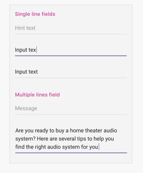

# Registerkarten auf mobilen Geräten

> [!NOTE]
> Wenn Sie ihre Kanal-/Gruppenregisterkarte auf mobilen Teams-Clients anzeigen möchten, muss die Konfiguration einen Wert für die Eigenschaft haben `setSettings()` `websiteUrl` (siehe unten).

Benutzerdefinierte Registerkarten können Teil eines Kanals, Eines Gruppenchats oder einer persönlichen App sein (Apps, die statische Registerkarten und/oder einen 1:1-Bot enthalten).

Persönliche Apps sind auf mobilen Clients in der App-Drawer verfügbar. Die App kann nur von einem Desktop- oder Webclient installiert werden und kann bis zu 24 Stunden dauern, bis sie auf mobilen Clients angezeigt wird.

Kanalregisterkarten sind auch für Mobilgeräte verfügbar. Das Standardverhalten besteht derzeit in der Verwendung ihrer Registerkarte, um die `websiteUrl` Registerkarte in einem Browserfenster zu starten. Sie können jedoch auf einem mobilen Client geladen werden, indem Sie auf das Überlaufmenü neben der Registerkarte klicken und "Öffnen" auswählen, wodurch Sie die Registerkarte im mobilen Client von `...` Teams  `contentUrl` laden.

## Zugreifen auf persönliche Registerkarten

Die folgende Abbildung zeigt, wie Sie auf eine persönliche Registerkarte auf mobilen Geräten zugreifen.

:::image type="content" source="../../assets/images/tabs/mobile-app-drawer.png" alt-text="Illustration showing the Teams mobile app drawer." border="false":::

## Zugreifen auf Kanalregisterkarten

Die folgende Abbildung zeigt, wie Sie auf eine Kanalregisterkarte auf mobilen Geräten zugreifen.

:::image type="content" source="../../assets/images/tabs/mobile-tab.png" alt-text="Abbildung einer mobilen Registerkarte &quot;Teams&quot;." border="false":::

## Überlegungen zum Entwurf

Unsere mobile Plattform ermöglicht Apps eine immersive Erfahrung mit den App-Inhalten, die den ganzen Bildschirm neben der Hauptnavigation von Teams nutzen. Befolgen Sie diese Richtlinien, um ein immersives Erlebnis zu erstellen, das zu Teams passt.

### Dynamisches Designs

Da Ihre Registerkarte auf Geräten mit einer vielzahl von Bildschirmgrößen geöffnet werden kann, muss sie den Prinzipien des [reaktionsschnellen Designs](https://www.w3schools.com/html/html_responsive.asp) entsprechen. Alle wichtigen Konstrukte sollten auf mobilen Geräten zugänglich sein, und die Ansichten sollten nicht verzerrt sein. Stellen Sie sicher, dass beim Laden der Registerkarte auf einem mobilen Gerät alle Schaltflächen und Links über die fingerbasierte Navigation leicht zugänglich sind.

### Layouts

Die Auswahl des richtigen Layouts für Ihre Registerkarte ist wichtig. Sie sollten die Art von Informationen berücksichtigen, die Sie präsentieren, und ein Layout auswählen, das sie für einen einfachen Verbrauch organisiert. Im Folgenden werden einige mögliche Optionen beschrieben.

#### Einzelner Zeichenbereich

Dies ist ein großer Bereich, in dem Arbeit erledigt wird. Die Teams-Wiki-App folgt diesem Muster. Wenn Sie über eine App verfügen, die Inhalte nicht in kleinere Komponenten aufteilen, ist dies gut geeignet.

:::image type="content" source="../../assets/images/tabs/mobile-tab-single-canvas.png" alt-text="Abbildung einer mobilen Registerkarte mit einem einzelnen Zeichenbereich in Teams." border="false":::

#### List

Listen n nen sich gut zum Sortieren und Filtern großer Datenmengen nnen und sind gut dafür, die wichtigsten Dinge ganz oben zu behalten. Es ist hilfreich, sortierbare Spalten zu verwenden. Aktionen können jedem Listenelement unter dem Auslassungspunktmenü hinzugefügt werden.

:::image type="content" source="../../assets/images/tabs/mobile-tab-list.png" alt-text="Abbildung einer Registerkarte für mobile Teams-Listen." border="false":::

#### Raster

Raster sind nützlich, um Elemente zu zeigen, die hochgradig visuell sind. Es hilft, oben einen Filter oder ein Suchsteuerelement zu verwenden.

:::image type="content" source="../../assets/images/tabs/mobile-tab-grid.png" alt-text="Abbildung einer mobilen Registerkarte von Teams mit einem Rasterlayout." border="false":::

### Registerkarten mit Bots auf Mobilgeräten

Das folgende Beispiel ist eine persönliche App mit Registerkarten und einem Bot.

:::image type="content" source="../../assets/images/tabs/mobile-tab-with-bot.png" alt-text="Illustration showing how mobile Teams app that has tabs and a bot." border="false":::

## Benutzeroberflächenkomponenten

### Farbpaletten

Die Verwendung unserer genehmigten neutralen Palette für Hintergründe, Benachrichtigungen, Text und Schaltflächen hilft Ihrer App, sich in Teams besser zu hause zu fühlen. Da Teams Mobile zwei helle Designs (hell und dunkel) hat, sollten Sie sicherstellen, dass Ihre App in beiden Designs gut aussieht.

#### Helle Farbe

#### Dunkle Farbe

### Schaltflächen und Steuerelemente

Die Art und Weise, wie Schaltflächen formatiert werden, hilft zu kommunizieren, welche Art von Aktion sie auslösen. Wir verwalten eine Vielzahl von Schaltflächen, die so formatiert sind, dass sie unterschiedliche Akzentstufen anzeigen. Schaltflächen können Text, ein Symbol oder eine Kombination aus Text und einem Symbol enthalten. Um verschiedene Ebenen in einer Hierarchie zu kommunizieren, haben wir primäre und sekundäre Schaltflächen innerhalb jeder Kategorie entworfen.

#### Schaltflächen

Primäre und sekundäre Schaltflächen.

#### Auswahlsteuerelemente

Optionsfelder, Kontrollkästchen und Umschaltflächen.

#### Kapseln und Kapseln

### Typografie

Typografie sollte klar und zielvoll sein. Heben Sie wichtige Informationen hervor, und vermeiden Sie die Verwendung mehrerer Schriftarten und Größen, um Verwirrung zu vermeiden. Wir empfehlen die Verwendung von Groß-/B0 und die Verwendung von Großbuchstaben für die Lokalisierung und Lesbarkeit.

### Felder und Flyouts

Felder sind Bereiche, in denen Benutzer Text eingeben können. Flyouts sind einfacher als Dialogfelder und werden im oberen Bereich angezeigt.

#### Steuerelemente auflisten

#### Feldsteuerelemente

## Überlegungen für Entwickler

Wenn Sie eine App erstellen, die eine Registerkarte enthält, müssen Sie berücksichtigen (und testen), wie Ihre Registerkarte auf den Android- und iOS Microsoft Teams-Clients funktioniert. In den folgenden Abschnitten werden einige der wichtigsten Szenarien beschrieben, die Sie berücksichtigen müssen.

### Testen auf mobilen Clients

Sie müssen überprüfen, ob Ihre Registerkarte auf mobilen Geräten verschiedener Größen und Qualitäten ordnungsgemäß funktioniert. Für Android-Geräte können Sie [die DevTools](~/tabs/how-to/developer-tools.md) verwenden, um Ihre Registerkarte während der Ausführung zu debuggen. Es wird empfohlen, sowohl auf Geräten mit hoher und niedriger Leistung als auch auf einem Tablet zu testen.

### Authentifizierung

Damit die Authentifizierung auf mobilen Clients funktioniert, müssen Sie Das JavaScript SDK für Teams auf mindestens Version 1.4.1 aktualisieren.

### Geringe Bandbreite und zeitweilige Verbindungen

Mobile Clients müssen regelmäßig mit geringer Bandbreite und zeitweilig unterbrochenen Verbindungen funktionieren. Ihre App sollte alle Timeouts entsprechend behandeln, indem sie dem Benutzer eine Kontextnachricht zur Verfügung stellt. Sie sollten auch Statusindikatoren für Benutzer verwenden, um Ihren Benutzern Feedback für lang dauernde Prozesse zu geben.

> [!NOTE]
> Registerkarten werden auf mobilen Geräten nur aktiviert, nachdem die Anwendung basierend auf der Eingabe des Genehmigungsteams einer Zulassungsliste hinzugefügt wurde. Um die Reaktionsfähigkeit mobiler Geräte zu überprüfen, greifen Sie auf teamsubm@microsoft.com. 