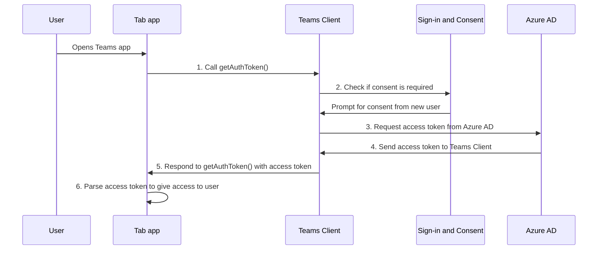

# Aktivieren von SSO für die Registerkarten-App

<!--Single sign-on (SSO) allows a user to access an application or a web service after signing-in only once. The app users never have to go through authentication again.-->

Mit SSO in Teams haben App-Benutzer den Vorteil, dass Sie Teams für den Zugriff auf Apps verwenden. Nachdem Sie sich mit dem Microsoft- oder Microsoft 365-Konto bei Teams angemeldet haben, können App-Benutzer Ihre App verwenden, ohne sich erneut anmelden zu müssen. Ihre App ist für App-Benutzer auf jedem Gerät mit Zugriff über Azure AD verfügbar.

Hier erfahren Sie, was Sie in diesem Abschnitt lernen:

1. **SSO-Benutzererfahrung**: Teams bietet Ihren App-Benutzern eine echte SSO-Erfahrung. App-Benutzer können Ihre App verwenden, ohne sich erneut anzumelden.
2. **SSO in Teams zur Laufzeit**: Ihre Registerkarten-App interagiert zur Laufzeit mit Azure AD für einmalige Authentifizierung und Autorisierung für Ihre App-Benutzer.
3. **Aktivieren Sie SSO für Ihre Registerkarten-App**: Implementieren Sie die erforderlichen Aufgaben, um SSO in Ihrer Registerkarten-App zu implementieren.

## SSO-Benutzererfahrung in Teams

App-Benutzer melden sich bei Teams entweder mit einem persönlichen Microsoft-Konto oder einem Microsoft 365-Konto an. Sie können dies nutzen und SSO verwenden, um die App-Benutzer zu authentifizieren und zu autorisieren.

&nbsp;&nbsp;&nbsp;&nbsp;:::image type="content" source="../../../assets/images/authentication/teams-sso-tabs/teams-sso-ux.png" alt-text="SSO-Benutzererfahrung in einer Teams-Registerkarten-App":::

- Teams authentifiziert und speichert die Identität des App-Benutzers.
- Ihre Registerkarten-App verwendet die gespeicherte Identität des App-Benutzers, der bereits von Teams überprüft wurde.
- Der App-Benutzer muss Microsoft Teams seine Zustimmung erteilen, um die Identität für die Verwendung Ihrer Registerkarten-App zu verwenden.
- Der App-Benutzer kann auf die App im Web, Desktop oder mobilen Client zugreifen.

Sie können hier ein Beispiel für die Benutzererfahrung mit SSO in einer Registerkarten-App anzeigen:

:::image type="content" source="../../../assets/images/authentication/teams-sso-tabs/sso-tab.gif" alt-text="SSO in der Registerkarten-App":::

### Verbessern der Benutzerfreundlichkeit mit SSO

Hier erfahren Sie, was Ihre App-Benutzer mit SSO-Erfahrung erhalten:

- Teams ruft das Zugriffstoken für den aktuellen App-Benutzer aus Azure AD ab. Diese Interaktion mit Azure AD ist für den App-Benutzer nicht sichtbar. Dies bedeutet, dass Sie App-Zugriff erhalten, ohne die Teams-Umgebung verlassen zu müssen.
- Ein App-Benutzer muss nur in einer Umgebung mit mehreren Mandanten zustimmen. Wenn sich der App-Benutzer und die App im selben Mandanten befinden, muss der App-Benutzer der Verwendung der App nicht zustimmen.
- Nachdem der App-Benutzer Teams das erste Mal zugestimmt hat, kann er Ihre App ohne weitere Zustimmung verwenden, auch auf jedem anderen Gerät. Aus diesem Grund bietet es eine bessere Benutzererfahrung.
  - Alternativ kann der Mandantenadministrator die Zustimmung im Namen der App-Benutzer erteilen. Wenn in diesem Szenario der Mandantenadministrator App-Benutzern im Mandanten zustimmt, müssen die App-Benutzer überhaupt nicht zur Zustimmung aufgefordert werden. Dies bedeutet, dass die App-Benutzer die Zustimmungsdialogfelder nicht sehen und nahtlos auf die App zugreifen können.
- Das Zugriffstoken wird von Teams vorab abgerufen, um die Leistung und Ladezeit der App in der Teams-Umgebung zu verbessern.
- App-Benutzer müssen sich weder mehrere Kennwörter merken noch aufzeichnen, um auf Apps in der Teams-Umgebung zugreifen und diese verwenden zu können.

> [!NOTE]
> App-Benutzer können einigen Berechtigungsbereichen keine Berechtigung erteilen, z.B. `Sites.ReadWrite.All`, wodurch der App-Benutzer alle SharePoint- und OneDrive-Objekte im Mandanten lesen und schreiben kann. Bei solchen Bereichen erteilt nur der Mandantenadministrator im Namen eines App-Benutzers die Zustimmung.

Sehen wir uns nun an, was während der Laufzeit im Back-End geschieht, um die SSO-Erfahrung in Teams zu erreichen.

## SSO in Teams zur Laufzeit

Erzielen Sie SSO in einer Registerkarten-App, indem Sie ein Zugriffstoken für den Benutzer der Teams-App abrufen, der aktuell angemeldet ist. Dieser Prozess umfasst den Registerkarten-App-Client und -Server, den Teams-Client und Azure AD. Während dieser Interaktion muss der App-Benutzer der Verwendung der Teams-Identität zustimmen, um das Zugriffstoken in einer Umgebung mit mehreren Mandanten abzurufen.

Die folgende Abbildung zeigt, wie SSO funktioniert, wenn ein Benutzer einer Teams-App versucht, auf die Registerkarten-App zuzugreifen:

:::image type="content" source="../../../assets/images/authentication/teams-sso-tabs/sso-runtime-seqd.png" alt-text="SSO-Diagramm für einmaliges Anmelden mit Registerkarten" lightbox="../../../assets/images/authentication/teams-sso-tabs/sso-runtime-seqd.png":::

| # | Interaktion | Was gerade geschieht |
| --- | --- | --- |
| 1 | Registerkarten-App → Teams-Client | Die Registerkarten-App führt einen JavaScript-Aufruf durch `getAuthToken()`, der Teams angibt, ein Zugriffstoken abzurufen. |
| 2 | Teams-Client → Azure AD | Teams fordert den Azure AD-Endpunkt für das Zugriffstoken für den aktuellen App-Benutzer basierend auf der Teams-Identität an. |
| 3 | Azure AD → Zustimmungsformular | Wenn der aktuelle App-Benutzer Ihre Registerkarten-App zum ersten Mal verwendet, zeigt Teams die Aufforderung zur Zustimmung an, wenn die App auf einige geschützte Daten zugreifen muss. Der App-Benutzer (oder der Administrator) muss Microsoft Teams zustimmen, um die Teams-Identität des App-Benutzers zum Abrufen des Zugriffstokens von Azure AD zu verwenden.   Alternativ gibt es eine Aufforderung, eine erhöhte Authentifizierung durchführen, z. B. die zweistufige Authentifizierung. |
| 4  | Azure AD → Teams-Client | Azure AD sendet das Zugriffstoken an den Teams-Client. Der Token ist ein JSON-Webtoken (JWT), wessen Überprüfung genauso wie die Tokenüberprüfung in den meisten standardmäßigen OAuth-Flüssen erfolgt. Office speichert das Token in Ihrem Namen zwischen, sodass zukünftige Aufrufe von `getAuthToken()` einfach das zwischengespeicherte Token zurückgeben. |
| 5  | Teams-Client → Registerkarten-App-Client | Teams sendet das Registerkartenzugriffstoken als Teil des Ergebnisobjekts, das vom `getAuthToken()`-Aufruf zurückgegeben wird, an die Registerkarte. |
| 6  | Registerkarten-App (zwischen Client & Server) | Das Token wird in der Registerkartenanwendung mithilfe von JavaScript analysiert, um die erforderlichen Informationen wie z. B. die E-Mail-Adresse des Benutzers zu extrahieren. Das an die Registerkarten-App zurückgegebene Token ist sowohl ein Zugriffstoken als auch ein ID-Token. |

Weitere Informationen finden Sie unter ["Update-Code zum Aktivieren von SSO"](tab-sso-code.md).

> [!IMPORTANT]
> Dies `getAuthToken()` gilt nur für die Zustimmung zu einer begrenzten Gruppe von APIs auf Benutzerebene, d. h. E-Mail, Profil, offline_access und OpenId. Es wird nicht für weitere Graph-Bereiche wie `User.Read` oder `Mail.Read` verwendet. Vorgeschlagene Problemumgehungen finden Sie unter [Erweitern Ihrer App mit Microsoft Graph-Berechtigungen](tab-sso-graph-api.md).

Registerkarten sind Microsoft Teams-fähige Webseiten. Um SSO in einer Webseite zu aktivieren, die in einer Registerkarten-App gehostet wird, fügen Sie [das Teams Javascript-Client-SDK](/javascript/api/overview/msteams-client?view=msteams-client-js-latest&preserve-view=true) hinzu, und rufen Sie auf `microsoftTeams.initialize()`. Rufen Sie `microsoftTeams.getAuthToken()` nach der Initialisierung das Zugriffstoken für Ihre App ab.

### Anwendungsfälle zum Aktivieren von SSO

Sie können SSO in Teams für alle Apps aktivieren, die Azure AD als Identitätsanbieter unterstützen. Zusätzlich zur Verwendung von SSO für die Authentifizierung von App-Benutzern in einer Registerkarten-App können Sie es auch verwenden, um den nahtlosen Zugriff über Teams hinweg zu ermöglichen.

Einige Szenarien, in denen Sie die SSO-API verwenden können, um Ihre App-Benutzer zu authentifizieren, sind:

- Wenn Sie Ihre App-Benutzer in einer Teams-Registerkarten-App authentifizieren möchten, ermöglicht die SSO-API App-Benutzern die Verwendung Ihrer App in Teams ohne zusätzliche Authentifizierung. Basierend auf der Teams-Identität des App-Benutzers können Sie Zugriffstoken für sie von Azure AD abrufen.
- Wenn Ihre App Aufgabenmodul aus einem Bot, einer Registerkarte, einer Nachrichtenerweiterung oder adaptiven Karten heraus verwendet, können Sie die SSO-API verwenden, um Ihre App-Benutzer zu authentifizieren.
- Sie können die SSO-API auch verwenden, um Ihre App-Benutzer zu authentifizieren, die auf die Phasenansicht zugreifen möchten, ohne erneut überprüft werden zu müssen.

> [!TIP]
> Sie können die SSO-API auch verwenden, um App-Benutzer in [Aufgabenmodulen](../../../task-modules-and-cards/what-are-task-modules.md) zu authentifizieren, die Webinhalte einbetten.

Um SSO zur Laufzeit zu erreichen, konfigurieren Sie Ihre App so, dass SSO für die Authentifizierung und Autorisierung von App-Benutzern aktiviert wird.

## Aktivieren von SSO für die Registerkarten-App

In diesem Abschnitt werden die Aufgaben beschrieben, die bei der Implementierung von SSO für eine Registerkarten-App erforderlich sind. Diese Aufgaben sind sprach- und frameworkunabhängig.

So aktivieren Sie SSO für eine Registerkarten-App:

&nbsp;&nbsp;&nbsp;&nbsp;&nbsp;:::image type="content" source="../../../assets/images/authentication/teams-sso-tabs/enable-sso.png" alt-text="Schritte zum Aktivieren von SSO für die Registerkarte" lightbox="../../../assets/images/authentication/teams-sso-tabs/enable-sso.png":::

1. **Registrieren Sie sich bei Azure AD**: Erstellen Sie eine Azure AD-App, um eine App-ID und einen Anwendungs-ID-URI zu generieren. Zum Generieren von Zugriffstoken konfigurieren Sie Bereiche und autorisieren vertrauenswürdige Clientanwendungen.
2. **Aktualisierungscode**: Fügen Sie den Code zum Behandeln des Zugriffstokens hinzu, rufen `getAuthToken()` Sie auf, wenn ein App-Benutzer auf Ihre Registerkarten-App zugreift, senden Sie dieses Token an den Servercode Ihrer App im Autorisierungsheader, und überprüfen Sie das Zugriffstoken, wenn es empfangen wird.
3. **Aktualisieren des Teams-App-Manifests**: Aktualisieren Sie Ihr Teams-Client-App-Manifest mit der App-ID und dem Anwendungs-ID-URI, die in Azure AD generiert wurden, damit Teams Zugriffstoken im Auftrag Ihrer App anfordern kann.

## Cookies von Drittanbietern unter iOS

Nach dem iOS 14-Update hat Apple standardmäßig den Zugriff auf [Cookies von Drittanbietern](https://webkit.org/blog/10218/full-third-party-cookie-blocking-and-more/) für alle Apps blockiert. Daher können die Apps, die Cookies von Drittanbietern für die Authentifizierung in ihren Kanal- oder Chat-Registerkarten und persönlichen Apps verwenden, ihre Authentifizierungsworkflows auf Microsoft Teams iOS-Clients nicht abschließen. Um den Datenschutz- und Sicherheitsanforderungen zu entsprechen, müssen Sie zu einem tokenbasierten System wechseln oder Cookies von Erstanbietern für die Benutzerauthentifizierungsworkflows verwenden.

### Support für mobile Teams-Clients

Für mobile Teams sind Clientversionen, die SSO unterstützen, folgende:

- Teams für Android (1416/1.0.0.2020073101 und höher)
- Teams für iOS (Version: 2.0.18 und höher)  
- Teams JavaScript SDK (Version: 1.11 und höher) für SSO, um im Besprechungsseitenbereich zu arbeiten.

Für eine optimale Benutzererfahrung verwenden Sie die jeweils neueste Version von iOS und Android.

## Bewährte Methoden

Hier ist eine Liste der bewährten Methoden:

- **Rufen Sie das Zugriffstoken nur auf, wenn Sie es benötigen**: Rufen Sie `getAuthToken()` nur auf, wenn Sie ein Zugriffstoken benötigen. Sie können sie aufrufen, wenn ein App-Benutzer auf Ihre Registerkarten-App zugreift, oder um eine bestimmte Funktion zu verwenden, für die eine App-Benutzerüberprüfung erforderlich ist.
- **Speichern Sie das Zugriffstoken nicht im clientseitigen Code**: Speichern Sie das Zugriffstoken nicht im clientseitigen Code Ihrer App. Der Teams-Client speichert das Zugriffstoken zwischen (oder fordert ein neues an, wenn es abläuft). Dadurch wird sichergestellt, dass ihr Token nicht versehentlich aus Ihrer Web-App ausläuft.
- **Verwenden Sie serverseitigen Code für Microsoft Graph-Aufrufe**: Verwenden Sie immer den serverseitigen Code, um Microsoft Graph-Aufrufe oder andere Aufrufe auszuführen, die das Übergeben eines Zugriffstokens erfordern. Geben Sie niemals das OBO-Token an den Client zurück, damit der Client direkte Aufrufe an Microsoft Graph durchführen kann. Dadurch wird verhindert, dass der Token abgefangen oder weitergegeben werden kann. Weitere Informationen finden Sie unter [Erweitern der Registerkarten-App mit Microsoft Graph-Berechtigungen und -Bereich](tab-sso-graph-api.md).

## Bekannte Einschränkungen

- Derzeit unterstützt SSO in Teams nur OAuth 2.0-Token. Es unterstützt kein SAML-Token.
- Mehrere Domänen pro App werden derzeit nicht unterstützt. Weitere Informationen finden Sie unter [Branchen-Apps](tab-sso-register-aad.md#before-you-register-with-azure-ad).

## Nächster Schritt

> [!div class="nextstepaction"]
> [Registrieren Sie Ihre Anwendung in Azure AD](tab-sso-register-aad.md)

## Siehe auch

[Konfigurieren von Code zum Aktivieren von SSO in einer Registerkarten-App](tab-sso-code.md)

<!--
### Use cases for enabling SSO for tab app

Here are some use cases where enabling SSO is beneficial. Call `getAuthToken()` in these scenarios to use Teams identity for obtaining access token for your app users:

- To get an app user’s identity from Teams if you have an existing app that you want to be available within a tab app in Teams.

- To authenticate an app user by reusing the Team’s identity inside your tab app.

- To authenticate and get an app user’s Teams identity inside configurable tabs. The app users don't need to sign in again. It's applicable to some settings that need to be configured at a configuration stage.

- To obtain an access token inside a task module, when it's invoked from a tab app, a bot app, a messaging extension app, or adaptive cards.

- To authenticate an app user in Stage view.

- To authenticate users for [task modules](../../../task-modules-and-cards/what-are-task-modules.md) that embed web content.
-->

<!--

-->

<!--
- Tenant admin consent: A simple way of [consenting on behalf of an organization as a tenant admin](/azure/active-directory/develop/v2-permissions-and-consent.md#requesting-consent-for-an-entire-tenant) is by getting [consent from admin](/azure/active-directory/manage-apps/grant-admin-consent).
  
    You can ask for consent using the Auth API. Another approach for getting Graph scopes is to present a consent dialog using our existing [third party OAuth provider authentication approach](~/tabs/how-to/authentication/auth-tab-aad.md#navigate-to-the-authorization-page-from-your-pop-up-page). This approach involves popping up an Azure AD consent dialog box.

  

  
To ask for additional consent using the Auth API, follow these steps:

    1. The token retrieved using `getAuthToken()` must be exchanged on the server-side using Azure AD [on-behalf-of flow (OBO)](/azure/active-directory/develop/v2-oauth2-on-behalf-of-flow) to get access to those other Graph APIs. Ensure you use the v2 Graph endpoint for this exchange.
    2. If the exchange fails, Azure AD returns an invalid grant exception. It usually responds with one of the two error messages, `invalid_grant` or `interaction_required`.
    3. When the exchange fails, you must ask for consent. Use the user interface (UI) to ask the app user to grant other consent. This UI must include a button that triggers an Azure AD consent dialog using [Silent authentication](~/concepts/authentication/auth-silent-aad.md).
    4. When asking for more consent from Azure AD, you must include `prompt=consent` in your [query-string-parameter](~/tabs/how-to/authentication/auth-silent-aad.md#get-the-user-context) to Azure AD, otherwise Azure AD wouldn't ask for other scopes.

        - Instead of `?scope={scopes}`, use `?prompt=consent&scope={scopes}`
        - Ensure that `{scopes}` includes all the scopes you're prompting the user for, for example, `Mail.Read` or `User.Read`.
    5. After the app user has granted more permissions, retry the OBO flow to get access to these other APIs.

    

-->
<!--
- If you want your existing app to be available within a Teams tab app, the SSO API allows your signed-in app users to use your app in Teams with no additional authentication needed. Based on the app user's Teams identity, you can obtain access token for them from Azure AD.
- If your app has configurable tabs, you can use `getAuthToken()` to allow app users into the tab app without signing in again. SSO is applicable to some settings that need to be configured at a configuration stage.
- Your app may have a bot, a tab, a message extension, or Adaptive Cards, and allows your app users to invoke task module from within a tab or a bot. The SSO API will authenticate your app users who attempt to access the task module. Teams can use the app user's Teams identity and obtain an access token from Azure AD.

- You can also use the SSO API for authenticating your app users who want to access to Stage view without need to be validated again. The access token obtained for the app user when they first used your app can be used to allow them to use Stage view. -->
