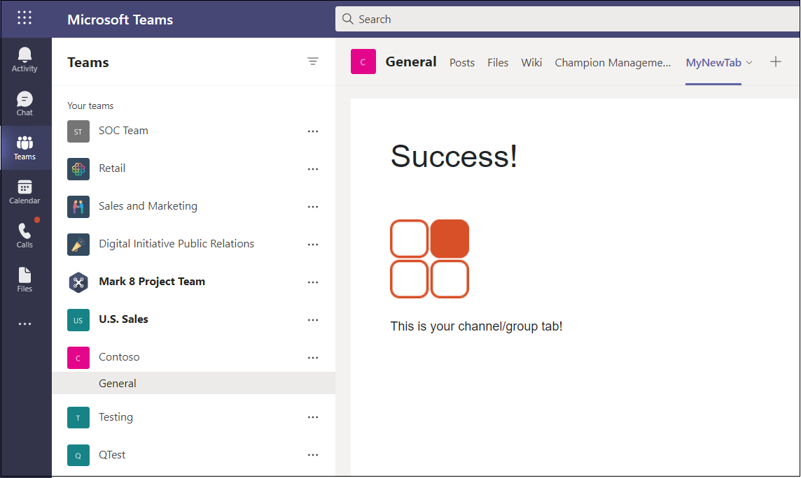

# <a name="create-a-channel-or-group-tab"></a>Erstellen einer Kanal- oder Gruppenregisterkarte

## <a name="create-a-custom-channel-or-group-tab"></a>Erstellen einer benutzerdefinierten Kanal- oder Gruppenregisterkarte

Sie können einen Kanal oder eine Gruppenregisterkarte mit Node.js und dem Yeoman-Generator, ASP, erstellen. NETCore oder ASP. NETCore MVC. Eine Kanal- oder Gruppenregisterkarte auf Microsoft Teams Mobilen finden Sie unter ["Registerkarten auf mobilgeräten](~/tabs/design/tabs-mobile.md)".

# <a name="nodejs"></a>[Node.js](#tab/nodejs)

### <a name="create-a-custom-channel-and-group-tab-using-nodejs-and-the-yeoman-generator"></a>Erstellen eines benutzerdefinierten Kanals und einer gruppenregisterkarte mit Node.js und dem Yeoman-Generator

> [!NOTE]
> Dieser Artikel folgt den Schritten, die im [Build Ihres ersten Microsoft Teams-App-Wiki](https://github.com/OfficeDev/generator-teams/wiki/Build-Your-First-Microsoft-Teams-App) im Microsoft OfficeDev-GitHub-Repository beschrieben sind.

Sie können eine benutzerdefinierte Kanal- oder Gruppenregisterkarte mit dem [Teams Yeoman-Generator](https://github.com/OfficeDev/generator-teams/) erstellen.

### <a name="prerequisites-for-apps"></a>Voraussetzungen für Apps

Sie müssen die folgenden Voraussetzungen verstehen:

- Sie müssen einen Office 365 Mandanten und ein Team mit aktivierter Option **"Hochladen benutzerdefinierter Apps zulassen**" konfiguriert haben. Weitere Informationen finden Sie unter [Vorbereiten Ihres Office 365 Mandanten](~/concepts/build-and-test/prepare-your-o365-tenant.md).

    > [!NOTE]
    > Wenn Sie derzeit kein Office 365 Konto haben, können Sie sich über das Office 365-Entwicklerprogramm für ein kostenloses Abonnement registrieren. Das Abonnement bleibt aktiv, solange Sie es für die fortlaufende Entwicklung verwenden. Willkommen [beim Office 365-Entwicklerprogramm](/office/developer-program/microsoft-365-developer-program).

Darüber hinaus muss für dieses Projekt Folgendes in Ihrer Entwicklungsumgebung installiert sein:

- Ein beliebiger Text-Editor oder eine beliebige IDE. Sie können [Microsoft Visual Studio Code](https://code.visualstudio.com/download) kostenlos installieren und verwenden.

- [Node.js/npm](https://nodejs.org/en/). Verwenden Sie die neueste LTS-Version. Die Node Paket-Manager (npm) wird in Ihrem System mit der Installation von Node.js installiert.

- Nachdem Sie Node.js erfolgreich installiert haben, installieren Sie die [Yeoman](https://yeoman.io/) - und [gulp-cli-Pakete](https://www.npmjs.com/package/gulp-cli) , indem Sie in der Eingabeaufforderung Folgendes eingeben:

    ```bash
    npm install yo gulp-cli --global
    ```

- Installieren Sie den Microsoft Teams Apps-Generator, indem Sie in der Eingabeaufforderung Folgendes eingeben:

    ```bash
    npm install generator-teams --global
    ```

### <a name="generate-your-project"></a>Generieren Ihres Projekts

**So generieren Sie Ihr Projekt**

1. Erstellen Sie an einer Eingabeaufforderung ein neues Verzeichnis für Ihr Registerkartenprojekt.

1. Um den Generator zu starten, wechseln Sie zu Ihrem neuen Verzeichnis, und geben Sie den folgenden Befehl ein:

    ```bash
    yo teams
    ```

1. Geben Sie als Nächstes eine Reihe von Werten an, die in der **Manifest.json-Datei** Ihrer Anwendung verwendet werden:

    

    **Wie lautet der Name Ihrer Lösung?**

    Dies ist ihr Projektname. Sie können den vorgeschlagenen Namen akzeptieren, indem Sie die **EINGABETASTE** drücken.

    **Wohin möchten Sie die Daten verschieben?**

    Sie befinden sich derzeit in Ihrem Projektverzeichnis. Drücken Sie **die EINGABETASTE**.

    **Titel Ihres Microsoft Teams-App-Projekts?**

    Dies ist der Name Ihres App-Pakets und wird im App-Manifest und in der Beschreibung verwendet. Geben Sie einen Titel ein, oder drücken Sie **die EINGABETASTE** , um den Standardnamen zu übernehmen.

    **Ihr (Firmen-)Name? (max. 32 Zeichen)**

    Ihr Firmenname wird im App-Manifest verwendet. Geben Sie einen Firmennamen ein, oder drücken Sie die **EINGABETASTE** , um den Standardnamen zu übernehmen.

    **Welche Manifestversion möchten Sie verwenden?**

    Wählen Sie das Standardschema aus.

    **Schnelles Gerüst? (J/n)**

    Der Standardwert ist "ja". Geben Sie **n** ein, um Ihre Microsoft Partner-ID einzugeben.

    **Geben Sie Ihre Microsoft Partner-ID ein, wenn Sie eine haben? (Leer lassen, um zu überspringen)**

    Dieses Feld ist nicht erforderlich und sollte nur verwendet werden, wenn Sie bereits Teil des [Microsoft Partner Network](https://partner.microsoft.com) sind.

    **Was möchten Sie Ihrem Projekt hinzufügen?**

    Select **( &ast; ) A Tab**.

    **Die URL, unter der Sie diese Lösung hosten werden?**

    Standardmäßig schlägt der Generator eine Azure-Website-URL vor. Sie testen Ihre App nur lokal, daher ist keine gültige URL erforderlich.

    **Möchten Sie eine Ladeanzeige anzeigen, wenn Ihre App/Registerkarte geladen wird?**

    Schließen Sie beim Laden ihrer App oder Registerkarte **keine** Ladeanzeige ein. Der Standardwert ist "Nein", geben Sie **"n**" ein.

   **Möchten Sie, dass persönliche Apps ohne eine Registerkarten-Kopfleiste dargestellt werden?**

    Verwenden Sie **keine** persönlichen Apps, die ohne Registerkartenkopfleiste gerendert werden sollen. Default is no, enter **n**.

    **Möchten Sie testframework und erste Tests einbeziehen? (y/N)**

    Schließen Sie **kein** Testframework für dieses Projekt ein. Der Standardwert ist "ja". geben Sie **n** ein

    **Möchten Sie Azure Applications Insights für Telemetrie verwenden? (y/N)**

    Wählen Sie **, dass** [Azure Application Insights](/azure/azure-monitor/app/app-insights-overview) nicht eingeschlossen werden soll. Der Standardwert ist "nein". geben Sie **n** ein

    **Standardregisterkartenname (max. 16 Zeichen)?**

    Nennen Sie Ihre Registerkarte. Dieser Registerkartenname wird im gesamten Projekt als Datei- oder URL-Pfadkomponente verwendet.

    **Welche Art von Registerkarte möchten Sie erstellen?**

    Verwenden Sie die Pfeiltasten, um die **konfigurierbare** Registerkarte auszuwählen.

    **Welche Bereiche möchten Sie für Ihre Registerkarte verwenden?**

    Sie können ein Team oder einen Gruppenchat auswählen.

    **Benötigen Sie Microsoft Azure Active Directory (Azure AD) Single Sign-On-Unterstützung für die Registerkarte?**

    Wählen Sie aus, Microsoft Azure Active Directory (Azure AD) Single Sign-On-Unterstützung für die Registerkarte **nicht** einzuschließen. Der Standardwert ist "Ja", geben Sie **"n**" ein.

    **Soll diese Registerkarte in SharePoint Online verfügbar sein? (J/n)**

    Geben Sie **n** ein

    > [!IMPORTANT]
    > The path component **yourDefaultTabNameTab**, is the value that you entered in the generator for **Default Tab Name** plus the word **Tab**.
    >
    > Beispiel: DefaultTabName: **MyTab** > **/MyTabTab/**

1. Wechseln Sie in Visual Studio Code oder einem beliebigen Code-Editor zu Ihrem Projektverzeichnis, und öffnen Sie die folgende Datei:

    ```bash
    ./src/app/scripts/<yourDefaultTabNameTab>/<yourDefaultTabNameTab>.tsx
    ```

1. Suchen Sie die `render()` Methode, und fügen Sie oben im Containercode das folgende Tag und den `<PanelBody>` folgenden `<div>` Inhalt hinzu:

    ```html
        <PanelBody>
            <div style={styles.section}>
                Hello World! Yo Teams rocks!
            </div>
        </PanelBody>
    ```

1. Stellen Sie sicher, dass Sie die aktualisierte Datei speichern.

### <a name="build-and-run-your-application"></a>Erstellen und Ausführen der Anwendung

Öffnen Sie an einer Eingabeaufforderung Das Projektverzeichnis, um die nächsten Aufgaben auszuführen.

#### <a name="create-the-app-package"></a>Erstellen des App-Pakets

Sie benötigen ein App-Paket, um Ihre Registerkarte in Teams zu testen. Es handelt sich um einen ZIP-Ordner, der die folgenden erforderlichen Dateien enthält:

- Ein **Vollfarbsymbol** mit einer Auflösung von 192 x 192 Pixeln.
- Ein **transparentes Gliederungssymbol** mit einer Auflösung von 32 x 32 Pixeln.
- Eine **Manifest.json-Datei** , die die Attribute Ihrer App angibt.

The package is created through a gulp task that validates the manifest.json file and generates the zip folder in the **./package directory**. Geben Sie an der Eingabeaufforderung den folgenden Befehl ein:

```bash
gulp manifest
```

#### <a name="build-your-application"></a>Erstellen Der Anwendung

Der Buildbefehl transpiliert Ihre Lösung in den Ordner **./dist** . Geben Sie in der Eingabeaufforderung den folgenden Befehl ein:

```bash
gulp build
```

#### <a name="run-your-application-in-localhost"></a>Ausführen der Anwendung in localhost

1. Starten Sie einen lokalen Webserver, indem Sie in der Eingabeaufforderung Folgendes eingeben:

    ```bash
    gulp serve
    ```

1. Geben Sie `http://localhost:3007/<yourDefaultAppNameTab>/` in Ihren Browser ein, ersetzen Sie **IhreDefaultAppNameTab** durch ihren Registerkartennamen, und zeigen Sie die Startseite Ihrer Anwendung an, wie in der folgenden Abbildung dargestellt:

    

1. Um die Registerkartenkonfigurationsseite anzuzeigen, wechseln Sie zu `https://localhost:3007/<yourDefaultAppNameTab>/config.html`. Es wird Folgendes gezeigt:

    

### <a name="establish-a-secure-tunnel-to-your-tab"></a>Einrichten eines sicheren Tunnels zu Ihrer Registerkarte

Microsoft Teams ist ein cloudbasiertes Produkt und erfordert, dass Ihre Registerkarteninhalte über HTTPS-Endpunkte aus der Cloud verfügbar sind. Teams lässt kein lokales Hosting zu. Sie müssen Ihre Registerkarte entweder auf einer öffentlichen URL veröffentlichen oder einen Proxy verwenden, der Ihren lokalen Port für eine internetbasierte URL verfügbar macht.

Verwenden Sie zum Testen der [Registerkartenerweiterung ngrok](https://ngrok.com/docs), das in diese Anwendung integriert ist. Ngrok ist ein Reverseproxysoftwaretool, das einen Tunnel zu den öffentlich verfügbaren HTTPS-Endpunkten Ihres lokal ausgeführten Webservers erstellt. Die Webendpunkte Ihres Servers sind während der aktuellen Sitzung auf Ihrem Computer verfügbar. Wenn der Computer heruntergefahren wird oder in den Ruhezustand wechselt, ist der Dienst nicht mehr verfügbar.

Beenden Sie an der Eingabeaufforderung "localhost", und geben Sie Folgendes ein:

```bash
gulp ngrok-serve
```

> [!IMPORTANT]
> Nachdem Ihre Registerkarte in Microsoft Teams hochgeladen und erfolgreich gespeichert wurde, können Sie sie im Registerkartenkatalog anzeigen, sie der Registerkartenleiste hinzufügen und damit interagieren, bis Ihre ngrok-Tunnelsitzung endet. Wenn Sie Ihre ngrok-Sitzung neu starten, müssen Sie Ihre App mit der neuen URL aktualisieren.

### <a name="upload-your-application-to-teams"></a>Hochladen Der Anwendung Teams

**So laden Sie Ihre Anwendung in Teams**

1. Wechseln Sie zu Microsoft Teams. Wenn Sie die [webbasierte Version verwenden,](https://teams.microsoft.com) können Sie Ihren Front-End-Code mithilfe der [Entwicklertools](~/tabs/how-to/developer-tools.md) Ihres Browsers überprüfen.
1. Wählen Sie in Ihren Teams im linken Bereich die Auslassungspunkte &#x25CF;&#x25CF;&#x25CF; neben dem Team aus, das Sie zum Testen Ihrer Registerkarte verwenden, und wählen Sie " **Team verwalten**" aus.
1. Wählen Sie im Hauptbereich in der Registerkartenleiste **Apps** aus, und wählen Sie **Hochladen eine benutzerdefinierte App** in der unteren rechten Ecke der Seite aus.
1. Wechseln Sie zum Projektverzeichnis, navigieren Sie zum **Ordner "./package** ", wählen Sie den ZIP-Ordner des App-Pakets aus, und wählen Sie " **Öffnen**" aus.

    

1. Wählen Sie im Dialogfeld Hinzufügen die Option **Hinzufügen** aus. Ihre Registerkarte wird in Teams hochgeladen.
1. Kehren Sie zu Ihrem Team zurück, wählen Sie den Kanal aus, in dem Sie die Registerkarte anzeigen möchten, wählen Sie ➕ aus der Registerkartenleiste aus, und wählen Sie Ihre Registerkarte aus dem Katalog aus.
1. Befolgen Sie die Anweisungen zum Hinzufügen einer Registerkarte. Es gibt ein benutzerdefiniertes Konfigurationsdialogfeld für Die Kanal- oder Gruppenregisterkarte.
1. Wählen Sie **Speichern aus** , und Ihre Registerkarte wird der Registerkartenleiste des Kanals hinzugefügt.

    

# <a name="aspnet-core"></a>[ASP.NET Core](#tab/aspnetcore)

### <a name="create-a-custom-channel-or-group-tab-with-aspnet-core"></a>Erstellen einer benutzerdefinierten Kanal- oder Gruppenregisterkarte mit ASP.NET Core

Sie können eine benutzerdefinierte Kanal- oder Gruppenregisterkarte mit C# und ASP.Net Core Razor-Seite erstellen. [App Studio für Microsoft Teams](~/concepts/build-and-test/app-studio-overview.md) wird auch verwendet, um Das App-Manifest fertig zu stellen und die Registerkarte für Teams bereitzustellen.

### <a name="prerequisites-for-teams-apps"></a>Voraussetzungen für Teams-Apps

Sie müssen die folgenden Voraussetzungen verstehen:

- Sie müssen einen Office 365 Mandanten und ein Team mit aktivierter Option **"Hochladen benutzerdefinierter Apps zulassen**" konfiguriert haben. Weitere Informationen finden Sie unter [Vorbereiten Ihres Office 365 Mandanten](~/concepts/build-and-test/prepare-your-o365-tenant.md).

    > [!NOTE]
    > Wenn Sie derzeit kein Microsoft 365 Konto haben, können Sie sich über das [Microsoft-Entwicklerprogramm](https://developer.microsoft.com/en-us/microsoft-365/dev-program) für ein kostenloses Abonnement registrieren. Das Abonnement bleibt aktiv, solange Sie es für die fortlaufende Entwicklung verwenden.

- Verwenden Sie App Studio, um Ihre Anwendung in Teams zu importieren. Um App Studio zu installieren, wählen Sie **Apps**  in der unteren linken Ecke des Teams App aus, und suchen Sie nach **App Studio**. Nachdem Sie die Kachel gefunden haben, wählen Sie sie aus, und wählen Sie im Popupdialogfeld " **Hinzufügen** " aus, um sie zu installieren.

Darüber hinaus muss für dieses Projekt Folgendes in Ihrer Entwicklungsumgebung installiert sein:

- Die aktuelle Version der Visual Studio IDE, in der die **plattformübergreifende .NET CORE-Entwicklungsworkload** installiert ist. Wenn Sie noch nicht über Visual Studio verfügen, können Sie die neueste [Microsoft Visual Studio Community](https://visualstudio.microsoft.com/downloads) Version kostenlos herunterladen und installieren.

- Das [ngrok-Reverseproxytool](https://ngrok.com) . Verwenden Sie ngrok, um einen Tunnel zu den öffentlich verfügbaren HTTPS-Endpunkten Ihres lokal ausgeführten Webservers zu erstellen. Sie können [ngrok herunterladen](https://ngrok.com/download).

### <a name="get-the-source-code"></a>Abrufen des Quellcodes

Erstellen Sie an einer Eingabeaufforderung ein neues Verzeichnis für Ihr Registerkartenprojekt. Ein einfaches Projekt wird bereitgestellt, um Ihnen den Einstieg zu erleichtern. Klonen Sie das Beispiel-Repository mit dem folgenden Befehl in Ihr neues Verzeichnis:

```bash
git clone https://github.com/OfficeDev/microsoft-teams-sample-tabs.git
```

Alternativ können Sie den Quellcode abrufen, indem Sie den ZIP-Ordner herunterladen und die Dateien extrahieren.

**So erstellen Sie das Registerkartenprojekt und führen es aus**

1. Nachdem Sie über den Quellcode verfügen, wechseln Sie zu Visual Studio, und wählen Sie **"Projekt oder Lösung öffnen**" aus.
1. Wechseln Sie zum Registerkartenanwendungsverzeichnis, und öffnen **Sie "ChannelGroupTab.sln"**.
1. Drücken Sie **F5**, oder wählen Sie im Menü "**Debuggen**" die Option **"Debuggen starten**" aus, um die Anwendung zu erstellen und auszuführen.
1. Wechseln Sie in einem Browser zu den folgenden URLs, und überprüfen Sie, ob die Anwendung ordnungsgemäß geladen wurde:

    - `http://localhost:44355`
    - `http://localhost:44355/privacy`
    - `http://localhost:44355/tou`

### <a name="review-the-source-code"></a>Überprüfen des Quellcodes

#### <a name="startupcs"></a>Startup.cs

Dieses Projekt wurde aus einer leeren Vorlage ASP.NET Core 2.2-Webanwendung erstellt, wobei das Kontrollkästchen **"Erweitert – Für HTTPS konfigurieren**" beim Setup aktiviert ist. Die MVC-Dienste werden durch die Methode des Abhängigkeitsinjektionsframeworks `ConfigureServices()` registriert. Darüber hinaus ermöglicht die leere Vorlage nicht standardmäßig die Bereitstellung statischer Inhalte, sodass die Middleware für statische Dateien der Methode mit dem folgenden Code hinzugefügt `Configure()` wird:

```csharp
public void ConfigureServices(IServiceCollection services)
  {
    services.AddMvc().SetCompatibilityVersion(CompatibilityVersion.Version_2_2);
  }
public void Configure(IApplicationBuilder app)
  {
    app.UseStaticFiles();
    app.UseMvc();
  }
```

#### <a name="wwwroot-folder"></a>Wwwroot-Ordner

In ASP.NET Core sucht die Anwendung im Webstammordner nach statischen Dateien.

#### <a name="indexcshtml"></a>Index.cshtml

ASP.NET Core behandelt Dateien mit dem Namen **Index** als Standard- oder Startseite für die Website. Wenn Ihre Browser-URL auf den Stamm der Website zeigt, wird **Index.cshtml** als Startseite für Ihre Anwendung angezeigt.

#### <a name="tabcs"></a>Tab.cs

Diese C#-Datei enthält eine Methode, die während der Konfiguration von **Tab.cshtml** aufgerufen wird.

#### <a name="appmanifest-folder"></a>AppManifest-Ordner

Dieser Ordner enthält die folgenden erforderlichen App-Paketdateien:

- Ein **Vollfarbsymbol** mit einer Auflösung von 192 x 192 Pixeln.
- Ein **transparentes Gliederungssymbol** mit einer Auflösung von 32 x 32 Pixeln.
- Eine **Manifest.json-Datei** , die die Attribute Ihrer App angibt.

Diese Dateien müssen in einem App-Paket gezippt werden, um Ihre Registerkarte in Teams hochzuladen. Wenn ein Benutzer die Registerkarte hinzufügt oder aktualisiert, lädt Microsoft Teams das `configurationUrl` angegebene Element in Ihrem Manifest, einbettet es in einen IFrame und rendert es auf der Registerkarte.

#### <a name="csproj"></a>CSPROJ

Klicken Sie im Fenster Visual Studio Projektmappen-Explorer mit der rechten Maustaste auf das Projekt, und wählen Sie **"Project Datei bearbeiten**" aus. Am Ende der Datei wird der folgende Code angezeigt, der Ihren ZIP-Ordner erstellt und aktualisiert, wenn die Anwendung erstellt wird:

```xml
<PropertyGroup>
    <PostBuildEvent>powershell.exe Compress-Archive -Path \"$(ProjectDir)AppManifest\*\" -DestinationPath \"$(TargetDir)tab.zip\" -Force</PostBuildEvent>
  </PropertyGroup>

  <ItemGroup>
    <EmbeddedResource Include="AppManifest\icon-outline.png">
      <CopyToOutputDirectory>Always</CopyToOutputDirectory>
    </EmbeddedResource>
    <EmbeddedResource Include="AppManifest\icon-color.png">
      <CopyToOutputDirectory>Always</CopyToOutputDirectory>
    </EmbeddedResource>
    <EmbeddedResource Include="AppManifest\manifest.json">
      <CopyToOutputDirectory>Always</CopyToOutputDirectory>
    </EmbeddedResource>
  </ItemGroup>
```

### <a name="establish-a-secure-tunnel-to-your-tab-for-teams"></a>Einrichten eines sicheren Tunnels zu Ihrer Registerkarte für Teams

Microsoft Teams ist ein cloudbasiertes Produkt und erfordert, dass Ihre Registerkarteninhalte über HTTPS-Endpunkte aus der Cloud verfügbar sind. Teams lässt kein lokales Hosting zu. Sie müssen ihre Registerkarte entweder über eine öffentliche URL veröffentlichen oder einen Proxy verwenden, der Ihren lokalen Port für eine internetbasierte URL verfügbar macht.

Verwenden Sie zum Testen der Registerkarte [ngrok](https://ngrok.com/docs). Die Webendpunkte Ihres Servers sind verfügbar, während ngrok auf Ihrem Computer ausgeführt wird. In der kostenlosen Version von ngrok unterscheiden sich die URLs beim nächsten Start von ngrok, wenn Sie ngrok schließen.

- Führen Sie an einer Eingabeaufforderung im Stammverzeichnis des Projekts den folgenden Befehl aus:

    ```bash
    ngrok http https://localhost:44355 -host-header="localhost:44355"
    ```

- Ngrok lauscht auf Anforderungen aus dem Internet und leitet sie an Ihre Anwendung weiter, wenn sie auf Port 44355 ausgeführt wird. Es sollte etwa so aussehen `https://y8rCgT2b.ngrok.io/` , wo **y8rCgT2b** durch Ihre alphangrok-numerische HTTPS-URL ersetzt wird.

- Stellen Sie sicher, dass die Eingabeaufforderung mit ngrok ausgeführt wird, und notieren Sie sich die URL.

### <a name="update-your-application"></a>Aktualisieren Der Anwendung

Innerhalb von **Tab.cshtml** zeigt die Anwendung dem Benutzer zwei Optionsschaltflächen zum Anzeigen der Registerkarte mit einem roten oder grauen Symbol an. Durch Auswählen der Schaltfläche "**Grau auswählen**" oder "**Rot auswählen**" wird die Schaltfläche "**Speichern**" auf der Konfigurationsseite festgelegt `saveGray()` bzw`saveRed()`. aktiviert`settings.setValidityState(true)`. Dieser Code teilt Teams mit, dass Sie die Konfigurationsanforderungen erfüllt haben und die Installation fortgesetzt werden kann. Die Parameter von `settings.setSettings` sind festgelegt. Schließlich wird aufgerufen, `saveEvent.notifySuccess()` um anzugeben, dass die Inhalts-URL erfolgreich aufgelöst wurde.

#### <a name="_layoutcshtml"></a>_Layout.cshtml

Damit Ihre Registerkarte in Teams angezeigt werden kann, müssen Sie das **Microsoft Teams JavaScript-Client-SDK** und einen Aufruf `microsoftTeams.initialize()` nach dem Laden der Seite einschließen. So kommunizieren Ihre Registerkarte und der Teams-Client:

Wechseln **Sie zum** Freigegebenen Ordner, öffnen **Sie _Layout.cshtml**, und fügen Sie dem `<head>` Tag Folgendes hinzu:

```html
<script src="https://ajax.aspnetcdn.com/ajax/jQuery/jquery-3.4.1.min.js"></script>
<script src="https://statics.teams.cdn.office.net/sdk/v1.6.0/js/MicrosoftTeams.min.js"></script>
```

> [!IMPORTANT]
> Kopieren Sie die `<script src="...">` URLs von dieser Seite nicht, und fügen Sie sie nicht ein, da sie nicht die neueste Version darstellen. Um die neueste Version des SDK zu erhalten, wechseln Sie immer zu [Microsoft Teams JavaScript-API](https://www.npmjs.com/package/@microsoft/teams-js).

#### <a name="tabcshtml"></a>Tab.cshtml

**So aktualisieren Sie Tab.cshtml**

1. Öffnen **Sie Tab.cshtml** in Visual Studio, und aktualisieren Sie das eingebettete `<script>`.

1. Rufen `microsoftTeams.initialize()`Sie oben im Skript .

1. Aktualisieren Sie die `websiteUrl` Werte in `contentUrl` jeder Funktion mit der HTTPS-ngrok-URL auf Ihre Registerkarte.

    Ihr Code sollte nun Folgendes enthalten, wobei **y8rCgT2b** durch Ihre ngrok-URL ersetzt wird:

    ```javascript
        microsoftTeams.initialize();

        let saveGray = () => {
            microsoftTeams.settings.registerOnSaveHandler(function (saveEvent) {
                microsoftTeams.settings.setSettings({
                    websiteUrl: `https://y8rCgT2b.ngrok.io`,
                    contentUrl: `https://y8rCgT2b.ngrok.io/gray/`,
                    entityId: "grayIconTab",
                    suggestedDisplayName: "MyNewTab"
                });
                saveEvent.notifySuccess();
            });
        }

        let saveRed = () => {
            microsoftTeams.settings.registerOnSaveHandler(function (saveEvent) {
                microsoftTeams.settings.setSettings({
                    websiteUrl: `https://y8rCgT2b.ngrok.io`,
                    contentUrl: `https://y8rCgT2b.ngrok.io/red/`,
                    entityId: "redIconTab",
                    suggestedDisplayName: "MyNewTab"
                });
                saveEvent.notifySuccess();
        });
        }
    ```

1. Speichern Sie die aktualisierte **Datei Tab.cshtml**.

### <a name="build-and-run-your-application-for-teams"></a>Erstellen und Ausführen der Anwendung für Teams

**So erstellen Sie Ihre Anwendung und führen sie aus**

1. Drücken Sie in Visual Studio **F5**, oder wählen Sie im Menü "**Debuggen**" die Option **"Debuggen starten**" aus.
1. Stellen Sie sicher, dass **ngrok** ausgeführt wird und ordnungsgemäß funktioniert, indem Sie Ihren Browser öffnen und über die ngrok-HTTPS-URL, die im Eingabeaufforderungsfenster bereitgestellt wurde, zur Inhaltsseite wechseln.

> [!TIP]
> Sie müssen ihre Anwendung sowohl in Visual Studio als auch in ngrok ausführen, um die in diesem Artikel beschriebenen Schritte auszuführen. Wenn Sie die Ausführung Der Anwendung in Visual Studio beenden müssen, um daran zu arbeiten, **lassen Sie ngrok ausgeführt**. Beim Neustart der Anwendung in Visual Studio wird die Weiterleitung der Anwendung überwacht und fortgesetzt. Wenn Sie den ngrok-Dienst neu starten müssen, wird eine neue URL zurückgegeben, und Sie müssen Ihre Anwendung mit der neuen URL aktualisieren.

### <a name="upload-your-tab-for-teams"></a>Hochladen Sie Ihre Registerkarte für Teams

> [!NOTE]
> App Studio kann verwendet werden, um Ihre **Manifest.json-Datei** zu bearbeiten und das fertige Paket in Teams hochzuladen. Sie können die Datei **"manifest.json** " auch manuell bearbeiten. Stellen Sie in diesem Fall sicher, dass Sie die Lösung erneut erstellen, um die **hochzuladendetab.zip** datei zu erstellen.

**So laden Sie Ihre Registerkarte mit App Studio hoch**

1. Wechseln Sie zu Microsoft Teams. Wenn Sie die [webbasierte Version](https://teams.microsoft.com) verwenden, können Sie Ihren Front-End-Code mithilfe der [Entwicklertools](~/tabs/how-to/developer-tools.md) Ihres Browsers überprüfen.

1. Wechseln Sie zu **App Studio** , und wählen Sie die Registerkarte " **Manifest-Editor** " aus.

1. Wählen Sie im **Manifest-Editor** eine **vorhandene App importieren** aus, um mit dem Aktualisieren des App-Pakets für Ihre Registerkarte zu beginnen. Der Quellcode enthält ein eigenes teilweise vollständiges Manifest. Der Name Ihres App-Pakets lautet **tab.zip**. Es ist über den folgenden Pfad verfügbar:

    ```bash
    /bin/Debug/netcoreapp2.2/tab.zip
    ```

1. Hochladen **app Studiotab.zip**.

#### <a name="update-your-app-package-with-manifest-editor"></a>Aktualisieren des App-Pakets mit dem Manifest-Editor

Nachdem Sie Das App-Paket in App Studio hochgeladen haben, müssen Sie es konfigurieren.

Wählen Sie die Kachel für Ihre neu importierte Registerkarte im rechten Bereich der Willkommensseite des Manifest-Editors aus.

Es gibt eine Liste der Schritte auf der linken Seite des Manifest-Editors und auf der rechten Seite eine Liste der Eigenschaften, die Werte für jeden dieser Schritte aufweisen müssen. Ein Großteil der Informationen wurde von " **manifest.json** " bereitgestellt, es gibt jedoch Felder, die Sie aktualisieren müssen.

##### <a name="details-app-details"></a>Details: App-Details

Im Abschnitt **"App-Details"** :

1. Wählen Sie unter **"Identifikation"** die Option **"Generieren** " aus, um die Platzhalter-ID durch die erforderliche GUID für Ihre Registerkarte zu ersetzen.

1. Aktualisieren Sie unter **"Entwicklerinformationen**" **die Website** mit Ihrer **ngrok-HTTPS-URL** .

1. Aktualisieren Sie unter **App-URLs** die **Datenschutzerklärung** und `https://<yourngrokurl>/privacy` **die Nutzungsbedingungen** auf `https://<yourngrokurl>/tou`>.

##### <a name="capabilities-tabs"></a>Funktionen: Registerkarten

Im Abschnitt **"Registerkarten"** :

1. Wählen Sie **auf der Registerkarte "Team"** die Option **"Hinzufügen**" aus.

1. Aktualisieren Sie im Popupfenster der **Registerkarte "Team"** die **Konfigurations-URL** auf `https://<yourngrokurl>/tab`.

1. Stellen Sie sicher, dass die Kontrollkästchen " **Konfiguration aktualisieren können?"**, **"Team**" und **"Gruppenchat** " aktiviert sind, und wählen Sie **"Speichern**" aus.

##### <a name="finish-domains-and-permissions"></a>Fertig stellen: Domänen und Berechtigungen

Im Abschnitt **"Domänen und Berechtigungen****" müssen Domänen von Ihren Registerkarten** Ihre ngrok-URL ohne das HTTPS-Präfix `<yourngrokurl>.ngrok.io/`enthalten.

##### <a name="finish-test-and-distribute"></a>Fertig stellen: Testen und Verteilen

> [!IMPORTANT]
> Auf der rechten Seite wird in der **Beschreibung** die folgende Warnung angezeigt:
>
> &#9888; "**Das Array "validDomains" darf keine Tunnelwebsite enthalten...**"
>
> Diese Warnung kann beim Testen der Registerkarte ignoriert werden.

1. Wählen Sie im Abschnitt **"Testen und Verteilen** " die Option **"Installieren" aus**.

1. Wählen Sie im Popupdialogfeld **"Zu einem Team hinzufügen** " oder aus der Dropdownliste die Option **"Zu einem Chat hinzufügen**" aus.

1. Wählen Sie das Team oder den Chat aus, in dem die Registerkarte angezeigt werden soll, und wählen Sie **"Registerkarte einrichten**" aus.

1. Wählen Sie im nächsten Popupdialogfeld entweder **"Grau"** oder " **Rot"** aus, und wählen Sie " **Speichern**" aus.

1. Um Ihre Registerkarte anzuzeigen, wechseln Sie zu dem Team oder Chat, in dem Sie die Registerkarte installiert haben, und wählen Sie sie in der Registerkartenleiste aus. Die Seite, die Sie während der Konfiguration ausgewählt haben, wird angezeigt.

    

# <a name="aspnet-core-mvc"></a>[ASP.NET Core MVC](#tab/aspnetcoremvc)

### <a name="create-a-custom-channel-or-group-tab-with-aspnet-core-mvc"></a>Erstellen einer benutzerdefinierten Kanal- oder Gruppenregisterkarte mit ASP.NET Core MVC

Sie können eine benutzerdefinierte Kanal- oder Gruppenregisterkarte mit C# und ASP.Net Core MVC erstellen. [App Studio für Microsoft Teams](~/concepts/build-and-test/app-studio-overview.md) wird auch verwendet, um Das App-Manifest fertig zu stellen und die Registerkarte für Teams bereitzustellen.

### <a name="prerequisites-for-custom-channel-or-group-tab"></a>Voraussetzungen für benutzerdefinierte Kanal- oder Gruppenregisterkarten

- Sie müssen einen Microsoft 365 Mandanten und ein Team mit aktivierter **Option "Hochladen benutzerdefinierter Apps zulassen**" konfiguriert haben. Weitere Informationen finden Sie unter [Vorbereiten Ihres Office 365 Mandanten](~/concepts/build-and-test/prepare-your-o365-tenant.md).

    > [!NOTE]
    > Wenn Sie derzeit kein Microsoft 365 Konto haben, können Sie sich über das [Microsoft-Entwicklerprogramm](https://developer.microsoft.com/en-us/microsoft-365/dev-program) für ein kostenloses Abonnement registrieren. Das Abonnement bleibt aktiv, solange Sie es für die fortlaufende Entwicklung verwenden.

- Verwenden Sie App Studio, um Ihre Anwendung in Teams zu importieren. Um App Studio zu installieren, wählen Sie **Apps**  in der unteren linken Ecke des Teams App aus, und suchen Sie nach **App Studio**. Nachdem Sie die Kachel gefunden haben, wählen Sie sie aus, und wählen Sie im Popupdialogfeld " **Hinzufügen** " aus, um sie zu installieren.

Darüber hinaus muss für dieses Projekt Folgendes in Ihrer Entwicklungsumgebung installiert sein:

- Die aktuelle Version der Visual Studio IDE, in der die **plattformübergreifende .NET CORE-Entwicklungsworkload** installiert ist. Wenn Sie noch nicht über Visual Studio verfügen, können Sie die neueste [Microsoft Visual Studio Community](https://visualstudio.microsoft.com/downloads) Version kostenlos herunterladen und installieren.

- Das [ngrok-Reverseproxytool](https://ngrok.com) . Verwenden Sie ngrok, um einen Tunnel zu den öffentlich verfügbaren HTTPS-Endpunkten Ihres lokal ausgeführten Webservers zu erstellen. Sie können [ngrok herunterladen](https://ngrok.com/download).

### <a name="get-the-source-code"></a>Abrufen des Quellcodes

Erstellen Sie an einer Eingabeaufforderung ein neues Verzeichnis für Ihr Registerkartenprojekt. Ein einfaches [Kanalgruppen-Registerkartenprojekt](https://github.com/OfficeDev/microsoft-teams-sample-tabs/tree/master/ChannelGroupTabMVC) wird bereitgestellt, um Ihnen den Einstieg zu erleichtern. Klonen Sie das Beispiel-Repository mit dem folgenden Befehl in Ihr neues Verzeichnis:

```bash
git clone https://github.com/OfficeDev/microsoft-teams-sample-tabs.git
```

Alternativ können Sie den Quellcode abrufen, indem Sie den ZIP-Ordner herunterladen und die Dateien extrahieren.

**So erstellen Sie das Registerkartenprojekt und führen es aus**

1. Nachdem Sie über den Quellcode verfügen, wechseln Sie zu Visual Studio, und wählen Sie **"Projekt oder Lösung öffnen**" aus.
1. Wechseln Sie zum Registerkartenanwendungsverzeichnis, und öffnen Sie **"ChannelGroupTabMVC.sln"**.
1. Drücken Sie **F5**, oder wählen Sie im Menü "**Debuggen**" die Option **"Debuggen starten**" aus, um die Anwendung zu erstellen und auszuführen.
1. Navigieren Sie in einem Browser zu den folgenden URLs, und stellen Sie sicher, dass die Anwendung ordnungsgemäß geladen wurde:

    - `http://localhost:44360`
    - `http://localhost:44360/privacy`
    - `http://localhost:44360/tou`

### <a name="review-the-source-code"></a>Überprüfen des Quellcodes

#### <a name="startupcs"></a>Startup.cs

Dieses Projekt wurde aus einer leeren Vorlage ASP.NET Core 2.2-Webanwendung erstellt, wobei das Kontrollkästchen **"Erweitert – Für HTTPS konfigurieren**" beim Setup aktiviert ist. Die MVC-Dienste werden durch die Methode des Abhängigkeitsinjektionsframeworks `ConfigureServices()` registriert. Darüber hinaus ermöglicht die leere Vorlage nicht standardmäßig die Bereitstellung statischer Inhalte, sodass die Middleware für statische Dateien der Methode mit dem folgenden Code hinzugefügt `Configure()` wird:

```csharp
public void ConfigureServices(IServiceCollection services)
  {
    services.AddMvc().SetCompatibilityVersion(CompatibilityVersion.Version_2_2);
  }
public void Configure(IApplicationBuilder app)
  {
    app.UseStaticFiles();
    app.UseMvc();
  }
```

#### <a name="wwwroot-folder"></a>Wwwroot-Ordner

In ASP.NET Core sucht die Anwendung im Webstammordner nach statischen Dateien.

#### <a name="appmanifest-folder"></a>AppManifest-Ordner

Dieser Ordner enthält die folgenden erforderlichen App-Paketdateien:

- Ein **Vollfarbsymbol** mit einer Auflösung von 192 x 192 Pixeln.
- Ein **transparentes Gliederungssymbol** mit einer Auflösung von 32 x 32 Pixeln.
- Eine **Manifest.json-Datei** , die die Attribute Ihrer App angibt.

Diese Dateien müssen in einem App-Paket gezippt werden, um Ihre Registerkarte in Teams hochzuladen.

#### <a name="csproj"></a>CSPROJ

Klicken Sie im Fenster Visual Studio Projektmappen-Explorer mit der rechten Maustaste auf das Projekt, und wählen Sie **"Project Datei bearbeiten**" aus. Am Ende der Datei wird der folgende Code angezeigt, der Ihren ZIP-Ordner erstellt und aktualisiert, wenn die Anwendung erstellt wird:

```xml
<PropertyGroup>
    <PostBuildEvent>powershell.exe Compress-Archive -Path \"$(ProjectDir)AppManifest\*\" -DestinationPath \"$(TargetDir)tab.zip\" -Force</PostBuildEvent>
  </PropertyGroup>

  <ItemGroup>
    <EmbeddedResource Include="AppManifest\icon-outline.png">
      <CopyToOutputDirectory>Always</CopyToOutputDirectory>
    </EmbeddedResource>
    <EmbeddedResource Include="AppManifest\icon-color.png">
      <CopyToOutputDirectory>Always</CopyToOutputDirectory>
    </EmbeddedResource>
    <EmbeddedResource Include="AppManifest\manifest.json">
      <CopyToOutputDirectory>Always</CopyToOutputDirectory>
    </EmbeddedResource>
  </ItemGroup>
```

#### <a name="models"></a>Modelle

**ChannelGroup.cs** stellt ein Message-Objekt und Methoden vor, die während der Konfiguration von den Controllern aufgerufen werden.

#### <a name="views"></a>Ansichten

Dies sind die verschiedenen Ansichten in ASP.NET Core MVC:

* Start: ASP.NET Core behandelt Dateien mit dem Namen **Index** als Standard- oder Startseite für die Website. Wenn Ihre Browser-URL auf den Stamm der Website zeigt, wird **Index.cshtml** als Startseite für Ihre Anwendung angezeigt.

* Freigegeben: Das Partielle Ansichtsmarkup **_Layout.cshtml** enthält die allgemeine Seitenstruktur der Anwendung und freigegebene visuelle Elemente. Außerdem wird auf die Teams Bibliothek verwiesen.

#### <a name="controllers"></a>Controller

Die Controller verwenden die `ViewBag` Eigenschaft, um Werte dynamisch in die Ansichten zu übertragen.

[!INCLUDE [dotnet-ngrok-intro](~/includes/tabs/dotnet-ngrok-intro.md)]

* Öffnen Sie eine Eingabeaufforderung im Stammverzeichnis des Projekts, und führen Sie den folgenden Befehl aus:

    ```bash
    ngrok http https://localhost:443560 -host-header="localhost:44360"
    ```

* Ngrok lauscht auf Anforderungen aus dem Internet und leitet sie an Ihre Anwendung weiter, wenn sie auf Port 44355 ausgeführt wird. Es sollte etwa so aussehen `https://y8rCgT2b.ngrok.io/` , wo **y8rCgT2b** durch Ihre alphangrok-numerische HTTPS-URL ersetzt wird.

* Stellen Sie sicher, dass die Eingabeaufforderung mit ngrok ausgeführt wird, und notieren Sie sich die URL.

### <a name="update-your-application"></a>Aktualisieren Der Anwendung

Innerhalb von **Tab.cshtml** zeigt die Anwendung dem Benutzer zwei Optionsschaltflächen zum Anzeigen der Registerkarte mit einem roten oder grauen Symbol an. Durch Auswählen der Schaltfläche "**Grau"** oder "**Rot auswählen**" wird **die Schaltfläche "** Speichern" auf der Konfigurationsseite ausgelöst `saveGray()` bzw`saveRed()`. festgelegt`settings.setValidityState(true)`. Dieser Code teilt Teams mit, dass Sie die Konfigurationsanforderungen erfüllt haben und die Installation fortgesetzt werden kann. Beim Speichern werden die Parameter von `settings.setSettings` festgelegt. Schließlich wird aufgerufen, `saveEvent.notifySuccess()` um anzugeben, dass die Inhalts-URL erfolgreich aufgelöst wurde.

[!INCLUDE [dotnet-update-app](~/includes/tabs/dotnet-update-chan-grp-app.md)]

---

## <a name="next-step"></a>Nächster Schritt

> [!div class="nextstepaction"]
> [Erstellen einer Inhaltsseite](~/tabs/how-to/create-tab-pages/content-page.md)

## <a name="see-also"></a>Siehe auch

* [registerkarten Teams](~/tabs/what-are-tabs.md)
* [Erstellen einer persönlichen Registerkarte](~/tabs/how-to/create-personal-tab.md)
* [Registerkarten auf mobilen Geräten](~/tabs/design/tabs-mobile.md)
* [Erstellen von Registerkarten mit adaptiven Karten](~/tabs/how-to/build-adaptive-card-tabs.md)
* [Erstellen einer Seite zum Entfernen](~/tabs/how-to/create-tab-pages/removal-page.md)
