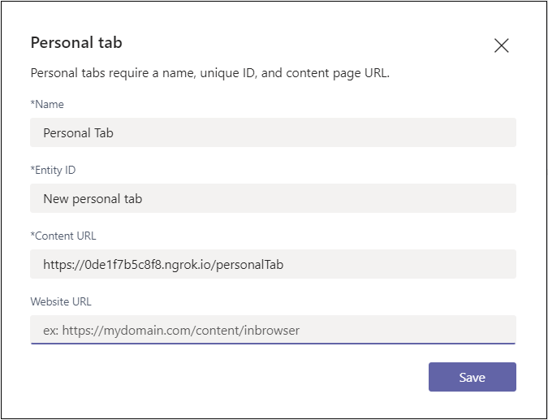

# <a name="create-a-personal-tab"></a>Erstellen einer persönlichen Registerkarte

## <a name="create-a-custom-personal-tab"></a>Erstellen einer benutzerdefinierten persönlichen Registerkarte

Sie können eine persönliche Registerkarte mit Node.js und dem Yeoman-Generator, ASP.NET Core oder ASP.NET Core MVC erstellen.

# <a name="nodejs"></a>[Node.js](#tab/nodejs)

### <a name="create-a-custom-personal-tab-using-nodejs-and-the-yeoman-generator"></a>Erstellen einer benutzerdefinierten persönlichen Registerkarte mit Node.js und dem Yeoman-Generator

> [!NOTE]
> Dieser Artikel folgt den Schritten, die im [Erstellen Ihres ersten Microsoft Teams App-Wikis](https://github.com/OfficeDev/generator-teams/wiki/Build-Your-First-Microsoft-Teams-App) im Microsoft OfficeDev-GitHub-Repository beschrieben sind.

Sie können eine benutzerdefinierte persönliche Registerkarte mit dem [Teams Yeoman-Generator](https://github.com/OfficeDev/generator-teams/wiki/Build-Your-First-Microsoft-Teams-App) erstellen. Die Anwendung wird auch in Teams hochgeladen.

### <a name="prerequisites-for-teams-apps"></a>Voraussetzungen für Teams-Apps

Sie müssen die folgenden Voraussetzungen verstehen:

- Sie müssen einen Office 365 Mandanten und ein Team mit aktivierter Option **"Hochladen benutzerdefinierter Apps zulassen"** konfiguriert haben. Weitere Informationen finden Sie unter [Vorbereiten Ihres Office 365 Mandanten](~/concepts/build-and-test/prepare-your-o365-tenant.md).

    > [!NOTE]
    > Wenn Sie kein Office 365 Konto haben, können Sie sich über das Office 365-Entwicklerprogramm für ein kostenloses Abonnement registrieren. Das Abonnement bleibt aktiv, solange Sie es für die fortlaufende Entwicklung verwenden. Willkommen [beim Office 365-Entwicklerprogramm](/office/developer-program/microsoft-365-developer-program).

Außerdem muss für dieses Projekt Folgendes in Ihrer Entwicklungsumgebung installiert sein:

- Ein beliebiger Text-Editor oder eine beliebige IDE. Sie können [Microsoft Visual Studio Code](https://code.visualstudio.com/download) kostenlos installieren und verwenden.

- [Node.js/npm](https://nodejs.org/en/). Verwenden Sie die neueste LTS-Version. Die Node Paket-Manager (npm) wird in Ihrem System mit der Installation von Node.js installiert.

- Nachdem Sie Node.js erfolgreich installiert haben, installieren Sie die [Yeoman](https://yeoman.io/) - und [gulp-cli-Pakete](https://www.npmjs.com/package/gulp-cli) , indem Sie in der Eingabeaufforderung den folgenden Befehl eingeben:

    ```bash
    npm install yo gulp-cli --global
    ```

- Installieren Sie den Microsoft Teams Apps-Generator, indem Sie den folgenden Befehl in Der Eingabeaufforderung eingeben:

    ```bash
    npm install generator-teams --global
    ```

### <a name="generate-your-project"></a>Generieren Ihres Projekts

**So generieren Sie Ihr Projekt**

1. Erstellen Sie an einer Eingabeaufforderung ein neues Verzeichnis für Ihr Registerkartenprojekt.

1. Um den Generator zu starten, wechseln Sie zu Ihrem neuen Verzeichnis, und geben Sie den folgenden Befehl ein:

    ```bash
    yo teams
    ```

1. Geben Sie als Nächstes eine Reihe von Werten an, die in der **Manifest.json-Datei** Ihrer Anwendung verwendet werden:

    

    **Wie lautet der Name Ihrer Lösung?**

    Der Projektmappenname ist Ihr Projektname. Sie können den vorgeschlagenen Namen akzeptieren, indem Sie die **EINGABETASTE** drücken.

    **Wohin möchten Sie die Daten verschieben?**

    Sie befinden sich derzeit in Ihrem Projektverzeichnis. Drücken Sie **die EINGABETASTE**.

    **Titel Ihres Microsoft Teams App-Projekts?**

    Der Titel ist ihr App-Paketname und wird im App-Manifest und in der Beschreibung verwendet. Geben Sie einen Titel ein, oder drücken Sie **die EINGABETASTE** , um den Standardnamen zu übernehmen.

    **Ihr (Firmen-)Name? (max. 32 Zeichen)**

    Ihr Firmenname wird im App-Manifest verwendet. Geben Sie einen Firmennamen ein, oder drücken Sie die **EINGABETASTE** , um den Standardnamen zu übernehmen.

    **Welche Manifestversion möchten Sie verwenden?**

    Wählen Sie das Standardschema aus.

    **Schnelles Gerüst? (J/n)**

    Der Standardwert ist "ja". Geben Sie **n** ein, um Ihre Microsoft Partner-ID einzugeben.

    **Geben Sie Ihre Microsoft Partner-ID ein, wenn Sie eine haben? (Leer lassen, um zu überspringen)**

    Dieses Feld ist nicht erforderlich und muss nur verwendet werden, wenn Sie bereits Teil des [Microsoft Partner Network](https://partner.microsoft.com) sind.

    **Was möchten Sie Ihrem Projekt hinzufügen?**

    Select **( &ast; ) A Tab**.

    **Die URL, unter der Sie diese Lösung hosten werden?**

    Standardmäßig schlägt der Generator eine Azure-Website-URL vor. Sie testen Ihre App nur lokal, sodass keine gültige URL erforderlich ist.

    **Möchten Sie eine Ladeanzeige anzeigen, wenn Ihre App/Registerkarte geladen wird?**

    Schließen Sie beim Laden ihrer App oder Registerkarte **keine** Ladeanzeige ein. Der Standardwert ist "Nein", geben Sie **"n**" ein.

    **Möchten Sie, dass persönliche Apps ohne eine Registerkarten-Kopfleiste dargestellt werden?**

    Verwenden Sie **keine** persönlichen Apps, die ohne Registerkartenkopfleiste gerendert werden sollen. Default is no, enter **n**.

    **Möchten Sie testframework und erste Tests einbeziehen? (y/N)**

    Schließen Sie **kein** Testframework für dieses Projekt ein. Der Standardwert ist "Nein", geben Sie **"n**" ein.

    **Möchten Sie ESLint-Support einschließen? (y/N)**

    Schließen Sie keine ESLint-Unterstützung ein. Der Standardwert ist "Nein", geben Sie **"n**" ein.

    **Möchten Sie Azure Applications Insights für Telemetrie verwenden? (y/N)**

    Wählen Sie, dass [Azure Application Insights](/azure/azure-monitor/app/app-insights-overview) **nicht** eingeschlossen werden soll. Der Standardwert ist "nein". geben Sie **n** ein

    **Standardregisterkartenname (max. 16 Zeichen)?**

    Nennen Sie Ihre Registerkarte. Dieser Registerkartenname wird im gesamten Projekt als Datei- oder URL-Pfadkomponente verwendet.

    **Welche Art von Registerkarte möchten Sie erstellen?**

    Verwenden Sie die Pfeiltasten, um **"Persönlich" (statisch)** auszuwählen.

    **Benötigen Sie Microsoft Azure Active Directory (Azure AD) Single Sign-On-Unterstützung für die Registerkarte?**

    Wählen Sie, Azure AD Single Sign-On-Unterstützung für die Registerkarte **nicht** einzuschließen. Der Standardwert ist "Ja", geben Sie **"n**" ein.

    > [!IMPORTANT]
    > The path component **yourDefaultTabNameTab** is the value that you entered in the generator for **Default Tab Name** plus the word **Tab**.
    >
    > Beispiel: DefaultTabName: **MyTab** > **/MyTabTab/**

### <a name="add-a-personal-tab"></a>Hinzufügen einer persönlichen Registerkarte

**Um dieser Anwendung eine persönliche Registerkarte hinzuzufügen, erstellen Sie eine Inhaltsseite, und aktualisieren Sie vorhandene Dateien.**

1. Erstellen Sie in Ihrem Code-Editor eine neue HTML-Datei **personal.html** , und fügen Sie das folgende Markup hinzu:

    ```html
    <!DOCTYPE html>
    <html>
        <head>
            <meta charset="UTF-8">
            <title>
                <!-- Todo: add your a title here -->
            </title>
            <meta name="viewport" content="width=device-width, initial-scale=1.0">
            <!-- inject:css -->
            <!-- endinject -->
        </head>
            <body>
                <h1>Personal Tab</h1>
                <p></p>
                <p>This is your personal tab!</p>
            </body>
    </html>
    ```

1. Speichern Sie **personal.html** im **Webordner** Ihrer Anwendung am folgenden Speicherort:

    ```bash
    ./src/app/web/<yourDefaultTabNameTab>/personal.html
    ```

1. Öffnen Sie **"manifest.json** " am folgenden Speicherort in Ihrem Code-Editor:

    ```bash
    ./src/manifest/manifest.json/
    ```

1. Fügen Sie dem leeren `staticTabs` Array (`staticTabs":[]`) Folgendes hinzu, und fügen Sie das folgende JSON-Objekt hinzu:

    ```json
    {
        "entityId": "personalTab",
        "name": "Personal Tab ",
        "contentUrl": "https://{{HOSTNAME}}/<yourDefaultTabNameTab>/personal.html",
        "websiteUrl": "https://{{HOSTNAME}}",
        "scopes": ["personal"]
    }
    ```

1. Aktualisieren Sie die **contentURL-Pfadkomponente** **"yourDefaultTabNameTab"** mit dem tatsächlichen Registerkartennamen.

1. Save the updated **manifest.json** file.

1. Um ihre Inhaltsseite in einem IFrame bereitzustellen, öffnen Sie **Tab.ts** in Ihrem Code-Editor über den folgenden Pfad:

    ```bash
    ./src/app/<yourDefaultTabNameTab>/<yourDefaultTabNameTab>.ts
    ```

1. Fügen Sie der Liste der IFrame-Decoratoren Folgendes hinzu:

    ```typescript
     @PreventIframe("/<yourDefaultAppName>TabNameTab>/personal.html")
    ```

1. Save the updated **Tab.ts** file. Der Registerkartencode ist vollständig.

### <a name="build-and-run-your-application"></a>Erstellen und Ausführen der Anwendung

Öffnen Sie an einer Eingabeaufforderung Das Projektverzeichnis, um die nächsten Aufgaben auszuführen.

#### <a name="create-the-app-package"></a>Erstellen des App-Pakets

Sie müssen über ein App-Paket verfügen, um Ihre Registerkarte in Teams zu testen. Es handelt sich um einen ZIP-Ordner, der die folgenden erforderlichen Dateien enthält:

- Ein **Vollfarbsymbol** mit einer Auflösung von 192 x 192 Pixeln.
- Ein **transparentes Gliederungssymbol** mit einer Auflösung von 32 x 32 Pixeln.
- Eine **Manifest.json-Datei** , die die Attribute Ihrer App angibt.

The package is created through a gulp task that validates the manifest.json file and generates the zip folder in the **./package directory**. Geben Sie an der Eingabeaufforderung den folgenden Befehl ein:

```bash
gulp manifest
```

#### <a name="build-your-application"></a>Erstellen Der Anwendung

Der Buildbefehl transpiliert Ihre Lösung in den Ordner **./dist** . Geben Sie in der Eingabeaufforderung den folgenden Befehl ein:

```bash
gulp build
```

#### <a name="run-your-application-in-localhost"></a>Ausführen der Anwendung in localhost

1. Starten Sie einen lokalen Webserver, indem Sie in der Eingabeaufforderung den folgenden Befehl eingeben:

    ```bash
    gulp serve
    ```

1. Geben Sie `http://localhost:3007/<yourDefaultAppNameTab>/` in Ihren Browser ein, ersetzen `**<yourDefaultAppNameTab>**` Sie diesen durch ihren Registerkartennamen, und zeigen Sie die Startseite Ihrer Anwendung an, wie in der folgenden Abbildung dargestellt:

    

1. Um Ihre persönliche Registerkarte anzuzeigen, wechseln Sie zu `http://localhost:3007/<yourDefaultAppNameTab>/personal.html`.

    >

### <a name="establish-a-secure-tunnel-to-your-tab"></a>Einrichten eines sicheren Tunnels zu Ihrer Registerkarte

Microsoft Teams ist ein cloudbasiertes Produkt und erfordert, dass Ihre Registerkarteninhalte über HTTPS-Endpunkte aus der Cloud verfügbar sind. Teams lässt kein lokales Hosting zu. Veröffentlichen Sie Ihre Registerkarte unter einer öffentlichen URL, oder verwenden Sie einen Proxy, der Ihren lokalen Port für eine internetbasierte URL verfügbar macht.

Verwenden Sie zum Testen der [Registerkartenerweiterung ngrok](https://ngrok.com/docs), das in diese Anwendung integriert ist. Ngrok ist ein Reverseproxy-Softwaretool. Ngrok erstellt einen Tunnel zu den öffentlich verfügbaren HTTPS-Endpunkten Ihres lokal ausgeführten Webservers. Die Webendpunkte Ihres Servers sind während der aktuellen Sitzung auf Ihrem Computer verfügbar. Wenn der Computer heruntergefahren wird oder in den Ruhezustand wechselt, ist der Dienst nicht mehr verfügbar.

Beenden Sie an der Eingabeaufforderung "localhost", und geben Sie den folgenden Befehl ein:

```bash
gulp ngrok-serve
```

> [!IMPORTANT]
> Nachdem Die Registerkarte in Microsoft Teams über **ngrok** hochgeladen und erfolgreich gespeichert wurde, können Sie sie in Teams anzeigen, bis die Tunnelsitzung endet.

### <a name="upload-your-application-to-teams"></a>Hochladen Der Anwendung Teams

**So laden Sie Ihre Anwendung in Teams**

1. Wechseln Sie zu Microsoft Teams. Wenn Sie die [webbasierte Version](https://teams.microsoft.com) verwenden, können Sie Ihren Front-End-Code mithilfe der [Entwicklertools](~/tabs/how-to/developer-tools.md) Ihres Browsers überprüfen.
1. **Wählen Sie** in der unteren linken Ecke Apps aus.
1. Wählen Sie in der unteren linken Ecke **Hochladen einer benutzerdefinierten App** aus.
1. Wechseln Sie zu Ihrem Projektverzeichnis, navigieren Sie zum Ordner **"./package** ", wählen Sie den ZIP-Ordner aus, und wählen Sie " **Öffnen**" aus.

    

1. Wählen Sie im Dialogfeld Hinzufügen die Option **Hinzufügen** aus. Ihre Registerkarte wird in Teams hochgeladen.

    

### <a name="view-your-personal-tab"></a>Anzeigen Ihrer persönlichen Registerkarte

Wählen Sie in der Navigationsleiste ganz links in Teams Ellipsen &#x25CF;&#x25CF;&#x25CF; aus, und wählen Sie Ihre App aus.

# <a name="aspnet-core"></a>[ASP.NET Core](#tab/aspnetcore)

### <a name="create-a-custom-personal-tab-using-aspnet-core"></a>Erstellen einer benutzerdefinierten persönlichen Registerkarte mit ASP.NET Core

Sie können eine benutzerdefinierte persönliche Registerkarte mit C# und ASP.NET Core Razor-Seiten erstellen. [App Studio](~/concepts/build-and-test/app-studio-overview.md) wird auch verwendet, um Das App-Manifest abzuschließen und die Registerkarte für Teams bereitzustellen.

### <a name="prerequisites-for-personal-tab"></a>Voraussetzungen für die persönliche Registerkarte

Sie müssen die folgenden Voraussetzungen verstehen:

- Sie müssen einen Office 365 Mandanten und ein Team mit aktivierter Option **"Hochladen benutzerdefinierter Apps zulassen"** konfiguriert haben. Weitere Informationen finden Sie unter [Vorbereiten Ihres Office 365 Mandanten](~/concepts/build-and-test/prepare-your-o365-tenant.md).

    > [!NOTE]
    > Wenn Sie kein Microsoft 365 Konto haben, können Sie sich über das [Microsoft-Entwicklerprogramm](https://developer.microsoft.com/en-us/microsoft-365/dev-program) für ein kostenloses Abonnement registrieren. Das Abonnement bleibt aktiv, solange Sie es für die fortlaufende Entwicklung verwenden.

- Verwenden Sie App Studio, um Ihre Anwendung in Teams zu importieren. Um App Studio zu installieren, wählen Sie **Apps**  in der unteren linken Ecke der Teams-App aus, und suchen Sie nach **App Studio**. Nachdem Sie die Kachel gefunden haben, wählen Sie sie aus, und wählen Sie im Popupdialogfeld " **Hinzufügen** " aus, um sie zu installieren.

Außerdem muss für dieses Projekt Folgendes in Ihrer Entwicklungsumgebung installiert sein:

- Die aktuelle Version der Visual Studio IDE, in der die **plattformübergreifende .NET CORE-Entwicklungsworkload** installiert ist. Wenn Sie noch nicht über Visual Studio verfügen, können Sie die neueste [Microsoft Visual Studio Community](https://visualstudio.microsoft.com/downloads) Version kostenlos herunterladen und installieren.

- Das [ngrok-Reverseproxytool](https://ngrok.com) . Verwenden Sie ngrok, um einen Tunnel zu den öffentlich verfügbaren HTTPS-Endpunkten Ihres lokal ausgeführten Webservers zu erstellen. Sie können [ngrok herunterladen](https://ngrok.com/download).

### <a name="get-the-source-code"></a>Abrufen des Quellcodes

Erstellen Sie an einer Eingabeaufforderung ein neues Verzeichnis für Ihr Registerkartenprojekt. Ein einfaches Projekt wird bereitgestellt, um Ihnen den Einstieg zu erleichtern. Klonen Sie das Beispiel-Repository mit dem folgenden Befehl in Ihr neues Verzeichnis:

```bash
git clone https://github.com/OfficeDev/microsoft-teams-sample-tabs.git
```

Alternativ können Sie den Quellcode abrufen, indem Sie den ZIP-Ordner herunterladen und die Dateien extrahieren.

**So erstellen Sie das Registerkartenprojekt und führen es aus**

1. Nachdem Sie den Quellcode abgerufen haben, wechseln Sie zu Visual Studio, und wählen Sie **"Projekt oder Lösung öffnen**" aus.
1. Wechseln Sie zum Registerkartenanwendungsverzeichnis, und öffnen **Sie "PersonalTab.sln"**.
1. Drücken Sie **F5**, oder wählen Sie im Menü "**Debuggen**" die Option **"Debuggen starten**" aus, um die Anwendung zu erstellen und auszuführen.
1. Wechseln Sie in einem Browser zu den folgenden URLs, um zu überprüfen, ob die Anwendung ordnungsgemäß geladen wurde:

    - `http://localhost:44325/`
    - `http://localhost:44325/personal`
    - `http://localhost:44325/privacy`
    - `http://localhost:44325/tou`

### <a name="review-the-source-code"></a>Überprüfen des Quellcodes

#### <a name="startupcs"></a>Startup.cs

Dieses Projekt wurde aus einer leeren Vorlage ASP.NET Core 2.2-Webanwendung erstellt, wobei das Kontrollkästchen **"Erweitert – Für HTTPS konfigurieren**" beim Setup aktiviert ist. Die MVC-Dienste werden durch die Methode des Abhängigkeitsinjektionsframeworks `ConfigureServices()` registriert. Darüber hinaus ermöglicht die leere Vorlage nicht standardmäßig die Bereitstellung statischer Inhalte, sodass die Middleware für statische Dateien der Methode mit dem folgenden Code hinzugefügt `Configure()` wird:

```csharp
public void ConfigureServices(IServiceCollection services)
  {
      services.AddMvc().SetCompatibilityVersion(CompatibilityVersion.Version_2_2);
  }
public void Configure(IApplicationBuilder app)
  {
    app.UseStaticFiles();
    app.UseMvc();
  }
```

#### <a name="wwwroot-folder"></a>Wwwroot-Ordner

In ASP.NET Core sucht die Anwendung im Webstammordner nach statischen Dateien.

#### <a name="indexcshtml"></a>Index.cshtml

ASP.NET Core behandelt Dateien mit dem Namen **Index** als Standard- oder Startseite für die Website. Wenn Ihre Browser-URL auf den Stamm der Website zeigt, wird **Index.cshtml** als Startseite für Ihre Anwendung angezeigt.

#### <a name="appmanifest-folder"></a>AppManifest-Ordner

Dieser Ordner enthält die folgenden erforderlichen App-Paketdateien:

- Ein **Vollfarbsymbol** mit einer Auflösung von 192 x 192 Pixeln.
- Ein **transparentes Gliederungssymbol** mit einer Auflösung von 32 x 32 Pixeln.
- Eine **Manifest.json-Datei** , die die Attribute Ihrer App angibt.

Diese Dateien müssen in einem App-Paket gezippt werden, um Ihre Registerkarte in Teams hochzuladen. Microsoft Teams das `contentUrl` angegebene Element in Ihrem Manifest lädt, es in einen <iframe\> einbettet und auf der Registerkarte rendert.

#### <a name="csproj"></a>CSPROJ

Klicken Sie im Fenster Visual Studio Projektmappen-Explorer mit der rechten Maustaste auf das Projekt, und wählen Sie **"Project Datei bearbeiten**" aus. Am Ende der Datei wird der folgende Code angezeigt, der Ihren ZIP-Ordner erstellt und aktualisiert, wenn die Anwendung erstellt wird:

```xml
<PropertyGroup>
    <PostBuildEvent>powershell.exe Compress-Archive -Path \"$(ProjectDir)AppManifest\*\" -DestinationPath \"$(TargetDir)tab.zip\" -Force</PostBuildEvent>
  </PropertyGroup>

  <ItemGroup>
    <EmbeddedResource Include="AppManifest\icon-outline.png">
      <CopyToOutputDirectory>Always</CopyToOutputDirectory>
    </EmbeddedResource>
    <EmbeddedResource Include="AppManifest\icon-color.png">
      <CopyToOutputDirectory>Always</CopyToOutputDirectory>
    </EmbeddedResource>
    <EmbeddedResource Include="AppManifest\manifest.json">
      <CopyToOutputDirectory>Always</CopyToOutputDirectory>
    </EmbeddedResource>
  </ItemGroup>
```

### <a name="update-your-application-for-teams"></a>Aktualisieren Der Anwendung für Teams

#### <a name="_layoutcshtml"></a>_Layout.cshtml

Damit Ihre Registerkarte in Teams angezeigt werden kann, müssen Sie das **Microsoft Teams JavaScript-Client-SDK** und einen Aufruf `microsoftTeams.initialize()` nach dem Laden der Seite einschließen. Ihre Registerkarte und die Teams-App kommunizieren auf folgende Weise:

Wechseln Sie zum Ordner **"Freigegeben"** , öffnen Sie **_Layout.cshtml**, und fügen Sie dem Abschnitt " `<head>` Tags" Folgendes hinzu:

```html
<script src="https://ajax.aspnetcdn.com/ajax/jQuery/jquery-3.4.1.min.js"></script>
<script src="https://statics.teams.cdn.office.net/sdk/v1.6.0/js/MicrosoftTeams.min.js"></script>
```

#### <a name="personaltabcshtml"></a>PersonalTab.cshtml

Öffnen Sie **PersonalTab.cshtml** , und aktualisieren Sie die eingebetteten `<script>` Tags durch Aufrufen `microsoftTeams.initialize()`von .

Stellen Sie sicher, dass Sie Ihre aktualisierte **Datei "PersonalTab.cshtml**" speichern.

### <a name="establish-a-secure-tunnel-to-your-tab-for-teams"></a>Einrichten eines sicheren Tunnels zu Ihrer Registerkarte für Teams

Microsoft Teams ist ein cloudbasiertes Produkt und erfordert, dass Ihre Registerkarteninhalte über HTTPS-Endpunkte aus der Cloud verfügbar sind. Teams lässt kein lokales Hosting zu. Veröffentlichen Sie Ihre Registerkarte unter einer öffentlichen URL, oder verwenden Sie einen Proxy, der Ihren lokalen Port für eine internetbasierte URL verfügbar macht.

Verwenden Sie zum Testen der Registerkarte [ngrok](https://ngrok.com/docs). Die Webendpunkte Ihres Servers sind verfügbar, während ngrok auf Ihrem Computer ausgeführt wird. In der kostenlosen Version von ngrok unterscheiden sich die URLs beim nächsten Start von ngrok, wenn Sie ngrok schließen.

**So richten Sie einen sicheren Tunnel zu Ihrer Registerkarte ein**

1. Führen Sie an einer Eingabeaufforderung im Stammverzeichnis des Projekts den folgenden Befehl aus:

    ```bash
    ngrok http https://localhost:44325 -host-header="localhost:44325"
    ```

    Ngrok lauscht auf Anforderungen aus dem Internet und leitet sie an Ihre Anwendung weiter, wenn sie an Port 44325 ausgeführt wird. Es ähnelt `https://y8rPrT2b.ngrok.io/` dem Ort, an dem **y8rPrT2b** durch Ihre alphangrok-numerische HTTPS-URL ersetzt wird.

    Stellen Sie sicher, dass die Eingabeaufforderung mit ngrok ausgeführt wird, und notieren Sie sich die URL.

2. Stellen Sie sicher, dass **ngrok** ausgeführt wird und ordnungsgemäß funktioniert, indem Sie Ihren Browser öffnen und über die ngrok-HTTPS-URL, die im Eingabeaufforderungsfenster bereitgestellt wurde, zu Ihrer Inhaltsseite wechseln.

> [!TIP]
> Sie müssen ihre Anwendung sowohl in Visual Studio als auch in ngrok ausführen, um die in diesem Artikel beschriebenen Schritte auszuführen. Wenn Sie die Ausführung der Anwendung in Visual Studio beenden müssen, um daran zu arbeiten, **führen Sie ngrok weiter** aus. Sie überwacht und setzt das Weiterleiten der Anforderung Ihrer Anwendung fort, wenn sie in Visual Studio neu gestartet wird. Wenn Sie den ngrok-Dienst neu starten müssen, wird eine neue URL zurückgegeben, und Sie müssen jeden Ort aktualisieren, der diese URL verwendet.

#### <a name="run-your-application"></a>Ausführen der Anwendung

Drücken Sie in Visual Studio **F5**, oder wählen Sie im **Menü "Debuggen**" der Anwendung die Option **"Debuggen starten**" aus.

### <a name="upload-your-tab-with-app-studio-for-teams"></a>Hochladen Sie Ihre Registerkarte mit App Studio für Teams

> [!NOTE]
> **App Studio** kann verwendet werden, um Ihre **Manifest.json-Datei** zu bearbeiten und das fertige Paket in Teams hochzuladen. Sie können **manifest.json** auch manuell bearbeiten. Stellen Sie in diesem Fall sicher, dass Sie die Lösung erneut erstellen, um die **hochzuladendeTab.zip** datei zu erstellen.

**So laden Sie Ihre Registerkarte mit App Studio hoch**

1. Wechseln Sie zu Microsoft Teams. Wenn Sie die [webbasierte Version](https://teams.microsoft.com) verwenden, können Sie Ihren Front-End-Code mithilfe der [Entwicklertools](~/tabs/how-to/developer-tools.md) Ihres Browsers überprüfen.

1. Wechseln Sie zu **App Studio** , und wählen Sie die Registerkarte " **Manifest-Editor** " aus.

1. Wählen Sie im **Manifest-Editor** eine **vorhandene App importieren** aus, um mit dem Aktualisieren des App-Pakets für Ihre Registerkarte zu beginnen. Der Quellcode enthält ein eigenes teilweise vollständiges Manifest. Der Name Ihres App-Pakets lautet **tab.zip**. Es ist über den folgenden Pfad verfügbar:

    ```bash
    /bin/Debug/netcoreapp2.2/tab.zip
    ```

1. Hochladen app **Studio****tab.zip**.

#### <a name="update-your-app-package-with-manifest-editor"></a>Aktualisieren des App-Pakets mit dem Manifest-Editor

Nachdem Sie Ihr App-Paket in App Studio hochgeladen haben, müssen Sie es konfigurieren.

Wählen Sie die Kachel für die neu importierte Registerkarte der Willkommensseite des Manifest-Editors aus.

Es gibt eine Liste der Schritte auf der linken Seite des Manifest-Editors. Auf der rechten Seite des Manifest-Editors befindet sich eine Liste der Eigenschaften, die Werte für jeden dieser Schritte aufweisen müssen. Ein Großteil der Informationen wurde von " **manifest.json** " bereitgestellt, es gibt jedoch Felder, die Sie aktualisieren müssen.

##### <a name="details-app-details"></a>Details: App-Details

Im Abschnitt **"App-Details"** :

1. Wählen Sie unter **"Identifikation**" die Option **"Generieren** " aus, um eine neue App-ID für Ihre App zu generieren.

1. Aktualisieren Sie unter **"Entwicklerinformationen**" **die Website** mit Ihrer **ngrok-HTTPS-URL** .

    

1. Aktualisieren Sie unter **App-URLs** die **Datenschutzerklärung** und `https://<yourngrokurl>/privacy` **die Nutzungsbedingungen** auf `https://<yourngrokurl>/tou`>.

##### <a name="capabilities-tabs"></a>Funktionen: Registerkarten

Im Abschnitt **"Registerkarten"** :

1. Wählen **Sie unter "Persönliche Registerkarte hinzufügen"** die Option **"Hinzufügen**" aus. Ein Popupdialogfeld wird angezeigt.

1. Geben Sie unter " **Name**" einen Namen für die persönliche Registerkarte ein.

1. Geben Sie die **Entitäts-ID** ein.

1. Aktualisieren Sie **die Inhalts-URL** mit `https://<yourngrokurl>/personalTab`.

    Lassen Sie das **Feld "Website-URL** " leer.

    

1. Wählen Sie **Speichern** aus.

##### <a name="finish-domains-and-permissions"></a>Fertig stellen: Domänen und Berechtigungen

Im Abschnitt **"Domänen und Berechtigungen****" müssen Domänen von Ihren Registerkarten** Ihre ngrok-URL ohne das HTTPS-Präfix `<yourngrokurl>.ngrok.io/`enthalten.

###### <a name="finish-test-and-distribute"></a>Fertig stellen: Testen und Verteilen

> [!IMPORTANT]
> Auf der rechten Seite wird in der **Beschreibung** die folgende Warnung angezeigt:
>
> &#9888; **Das Array "validDomains" darf keine Tunnelwebsite enthalten...**
>
> Diese Warnung kann beim Testen der Registerkarte ignoriert werden.

1. Wählen Sie im Abschnitt **"Testen und Verteilen** " die Option **"Installieren" aus**.

1. Wählen Sie im Dialogfeld Popup die Option **Hinzufügen** aus, und ihre Registerkarte wird angezeigt.

    

### <a name="view-your-personal-tab-in-teams"></a>Anzeigen Ihrer persönlichen Registerkarte in Teams

1. Wählen Sie in der Navigationsleiste ganz links neben der Teams App die Auslassungspunkte &#x25CF;&#x25CF;&#x25CF; aus. Es wird eine Liste der persönlichen Apps angezeigt.

1. Wählen Sie ihre Registerkarte aus der Liste aus, um sie anzuzeigen.

# <a name="aspnet-core-mvc"></a>[ASP.NET Core MVC](#tab/aspnetcoremvc)

### <a name="create-a-custom-personal-tab-with-aspnet-core-mvc"></a>Erstellen einer benutzerdefinierten persönlichen Registerkarte mit ASP.NET Core MVC

Sie können eine benutzerdefinierte persönliche Registerkarte mit C# und ASP.NET Core MVC erstellen. [App Studio für Microsoft Teams](~/concepts/build-and-test/app-studio-overview.md) wird auch verwendet, um Das App-Manifest abzuschließen und die Registerkarte für Teams bereitzustellen.

### <a name="prerequisites-for-personal-tab-with-aspnet-core-mvc"></a>Voraussetzungen für die persönliche Registerkarte mit ASP.NET Core MVC

- Sie müssen einen Microsoft 365 Mandanten und ein Team mit aktivierter Option **"Hochladen benutzerdefinierter Apps zulassen"** konfiguriert haben. Weitere Informationen finden Sie unter [Vorbereiten Ihres Office 365 Mandanten](~/concepts/build-and-test/prepare-your-o365-tenant.md).

    > [!NOTE]
    > Wenn Sie kein Microsoft 365 Konto haben, können Sie sich über das [Microsoft-Entwicklerprogramm](https://developer.microsoft.com/en-us/microsoft-365/dev-program) für ein kostenloses Abonnement registrieren. Das Abonnement bleibt aktiv, solange Sie es für die fortlaufende Entwicklung verwenden.

- Verwenden Sie App Studio, um Ihre Anwendung in Teams zu importieren. Um App Studio zu installieren, wählen Sie **Apps**  in der unteren linken Ecke der Teams-App aus, und suchen Sie nach **App Studio**. Nachdem Sie die Kachel gefunden haben, wählen Sie sie aus, und wählen Sie im Popupdialogfeld " **Hinzufügen** " aus, um sie zu installieren.

Außerdem muss für dieses Projekt Folgendes in Ihrer Entwicklungsumgebung installiert sein:

- Die aktuelle Version der Visual Studio IDE, in der die **plattformübergreifende .NET CORE-Entwicklungsworkload** installiert ist. Wenn Sie noch nicht über Visual Studio verfügen, können Sie die neueste [Microsoft Visual Studio Community](https://visualstudio.microsoft.com/downloads) Version kostenlos herunterladen und installieren.

- Das [ngrok-Reverseproxytool](https://ngrok.com) . Verwenden Sie ngrok, um einen Tunnel zu den öffentlich verfügbaren HTTPS-Endpunkten Ihres lokal ausgeführten Webservers zu erstellen. Sie können [ngrok herunterladen](https://ngrok.com/download).

### <a name="get-the-source-code"></a>Abrufen des Quellcodes

Erstellen Sie an einer Eingabeaufforderung ein neues Verzeichnis für Ihr Registerkartenprojekt. Ein einfaches Projekt wird bereitgestellt, um Ihnen den Einstieg zu erleichtern. Klonen Sie das Beispiel-Repository mit dem folgenden Befehl in Ihr neues Verzeichnis:

``` bash
git clone https://github.com/OfficeDev/microsoft-teams-sample-tabs.git
```

Alternativ können Sie den Quellcode abrufen, indem Sie den ZIP-Ordner herunterladen und die Dateien extrahieren.

**So erstellen Sie das Registerkartenprojekt und führen es aus**

1. Nachdem Sie über den Quellcode verfügen, wechseln Sie zu Visual Studio, und wählen Sie **"Projekt oder Lösung öffnen**" aus.
1. Wechseln Sie zum Registerkartenanwendungsverzeichnis, und öffnen Sie **"PersonalTabMVC.sln"**.
1. Drücken Sie **F5**, oder wählen Sie im Menü "**Debuggen**" die Option **"Debuggen starten**" aus, um die Anwendung zu erstellen und auszuführen.
1. Wechseln Sie in einem Browser zu den folgenden URLs, um zu überprüfen, ob die Anwendung ordnungsgemäß geladen wurde:

    * `http://localhost:44335`
    * `http://localhost:44335/privacy`
    * `http://localhost:44335/tou`

### <a name="review-the-source-code"></a>Überprüfen des Quellcodes

#### <a name="startupcs"></a>Startup.cs

Dieses Projekt wurde aus einer leeren Vorlage ASP.NET Core 2.2-Webanwendung erstellt, wobei das Kontrollkästchen **"Erweitert – Für HTTPS konfigurieren**" beim Setup aktiviert ist. Die MVC-Dienste werden durch die Methode des Abhängigkeitsinjektionsframeworks `ConfigureServices()` registriert. Darüber hinaus ermöglicht die leere Vorlage nicht standardmäßig die Bereitstellung statischer Inhalte, sodass die Middleware für statische Dateien der Methode mit dem folgenden Code hinzugefügt `Configure()` wird:

``` csharp
public void ConfigureServices(IServiceCollection services)
  {
    services.AddMvc().SetCompatibilityVersion(CompatibilityVersion.Version_2_2);
  }
public void Configure(IApplicationBuilder app)
  {
    app.UseStaticFiles();
    app.UseMvc();
  }
```

#### <a name="wwwroot-folder"></a>Wwwroot-Ordner

In ASP.NET Core sucht die Anwendung im Webstammordner nach statischen Dateien.

#### <a name="appmanifest-folder"></a>AppManifest-Ordner

Dieser Ordner enthält die folgenden erforderlichen App-Paketdateien:

* Ein **Vollfarbsymbol** mit einer Auflösung von 192 x 192 Pixeln.
* Ein **transparentes Gliederungssymbol** mit einer Auflösung von 32 x 32 Pixeln.
* Eine **Manifest.json-Datei** , die die Attribute Ihrer App angibt.

Diese Dateien müssen in einem App-Paket gezippt werden, um Ihre Registerkarte in Teams hochzuladen. Microsoft Teams das `contentUrl` angegebene Element in Ihrem Manifest lädt, es in einen IFrame einbettet und auf der Registerkarte rendert.

#### <a name="csproj"></a>CSPROJ

Klicken Sie im Fenster Visual Studio Projektmappen-Explorer mit der rechten Maustaste auf das Projekt, und wählen Sie **"Project Datei bearbeiten**" aus. Am Ende der Datei wird der folgende Code angezeigt, der Ihren ZIP-Ordner erstellt und aktualisiert, wenn die Anwendung erstellt wird:

``` xml
<PropertyGroup>
    <PostBuildEvent>powershell.exe Compress-Archive -Path \"$(ProjectDir)AppManifest\*\" -DestinationPath \"$(TargetDir)tab.zip\" -Force</PostBuildEvent>
  </PropertyGroup>

  <ItemGroup>
    <EmbeddedResource Include="AppManifest\icon-outline.png">
      <CopyToOutputDirectory>Always</CopyToOutputDirectory>
    </EmbeddedResource>
    <EmbeddedResource Include="AppManifest\icon-color.png">
      <CopyToOutputDirectory>Always</CopyToOutputDirectory>
    </EmbeddedResource>
    <EmbeddedResource Include="AppManifest\manifest.json">
      <CopyToOutputDirectory>Always</CopyToOutputDirectory>
    </EmbeddedResource>
  </ItemGroup>
```

#### <a name="models"></a>Modelle

**PersonalTab.cs** stellt ein Message-Objekt und Methoden dar, die von **PersonalTabController** aufgerufen werden, wenn ein Benutzer eine Schaltfläche in der **PersonalTab-Ansicht auswählt** .

#### <a name="views"></a>Ansichten

Diese Ansichten sind die verschiedenen Ansichten in ASP.NET Core MVC:

* Start: ASP.NET Core behandelt Dateien mit dem Namen **Index** als Standard- oder Startseite für die Website. Wenn Ihre Browser-URL auf den Stamm der Website zeigt, wird **Index.cshtml** als Startseite für Ihre Anwendung angezeigt.

* Freigegeben: Das Partielle Ansichtsmarkup **_Layout.cshtml** enthält die allgemeine Seitenstruktur der Anwendung und freigegebene visuelle Elemente. Außerdem wird auf die Teams Bibliothek verwiesen.

#### <a name="controllers"></a>Controller

Die Controller verwenden die `ViewBag` Eigenschaft, um Werte dynamisch in die Ansichten zu übertragen.

[!INCLUDE [dotnet-update-personal-app](~/includes/tabs/dotnet-update-personal-app.md)]

[!INCLUDE [dotnet-ngrok-intro](~/includes/tabs/dotnet-ngrok-intro.md)]

**So führen Sie ngrok aus und überprüfen die Inhaltsseite**

1. Führen Sie an einer Eingabeaufforderung im Stammverzeichnis des Projekts den folgenden Befehl aus:

    ``` bash
    ngrok http https://localhost:44345 -host-header="localhost:44345"
    ```

    Ngrok lauscht auf Anforderungen aus dem Internet und leitet sie an Ihre Anwendung weiter, wenn sie an Port 44325 ausgeführt wird. Es ähnelt `https://y8rPrT2b.ngrok.io/` dem Ort, an dem **y8rPrT2b** durch Ihre alphangrok-numerische HTTPS-URL ersetzt wird.

    Stellen Sie sicher, dass die Eingabeaufforderung mit ngrok ausgeführt wird, und notieren Sie sich die URL.

1. Stellen Sie sicher, dass **ngrok** ausgeführt wird und ordnungsgemäß funktioniert, indem Sie Ihren Browser öffnen und über die ngrok-HTTPS-URL, die im Eingabeaufforderungsfenster bereitgestellt wurde, zu Ihrer Inhaltsseite wechseln.

> [!TIP]
> Sie müssen ihre Anwendung sowohl in Visual Studio als auch in ngrok ausführen, um die in diesem Artikel beschriebenen Schritte auszuführen. Wenn Sie die Ausführung der Anwendung in Visual Studio beenden müssen, um daran zu arbeiten, **führen Sie ngrok weiter** aus. Sie überwacht und setzt das Weiterleiten der Anforderung Ihrer Anwendung fort, wenn sie in Visual Studio neu gestartet wird. Wenn Sie den ngrok-Dienst neu starten müssen, wird eine neue URL zurückgegeben, und Sie müssen jeden Ort aktualisieren, der diese URL verwendet.

#### <a name="run-your-application"></a>Ausführen der Anwendung

Drücken Sie in Visual Studio **F5**, oder wählen Sie im **Menü "Debuggen**" der Anwendung die Option **"Debuggen starten**" aus.

[!INCLUDE [dotnet-personal-use-appstudio](~/includes/tabs/dotnet-personal-use-appstudio.md)]

---

## <a name="reorder-static-personal-tabs"></a>Neu anordnen statischer persönlicher Registerkarten

Ab Manifestversion 1.7 können Entwickler alle Registerkarten in ihrer persönlichen App neu anordnen. Insbesondere kann ein Entwickler die **Registerkarte "Bot-Chat** ", die standardmäßig immer an die erste Position festgelegt ist, an eine beliebige Stelle in der Kopfzeile der persönlichen App-Registerkarte verschieben. Es werden zwei reservierte Registerkartenschlüsselwörter `entityId` deklariert, **Unterhaltungen** und **Informationen**.

Wenn Sie einen Bot mit einem **persönlichen** Bereich erstellen, wird er standardmäßig an der ersten Registerkartenposition in einer persönlichen App angezeigt. Wenn Sie es an eine andere Position verschieben möchten, müssen Sie Ihrem Manifest ein statisches Registerkartenobjekt mit dem **reservierten Schlüsselwort Unterhaltungen** hinzufügen. Die **Registerkarte "Unterhaltung** " wird im Web oder Desktop angezeigt, je nachdem, wo Sie die **Unterhaltungsregisterkarte** im `staticTabs` Array hinzufügen.

```json
{
   "staticTabs":[
      {
         
      },
      {
         "entityId":"conversations",
         "scopes":[
            "personal"
         ]
      }
   ]
}
```

## <a name="add-registeronfocused-api-for-tabs-or-personal-apps"></a>Hinzufügen einer `registerOnFocused` API für Registerkarten oder persönliche Apps

Mit `registerOnFocused` der SDK-API können Sie eine Tastatur auf Teams verwenden. Sie können zu einer persönlichen App zurückkehren und den Fokus auf einer Registerkarte oder einer persönlichen App mithilfe der Tasten STRG, UMSCHALT UND F6 behalten. Sie können sich beispielsweise von der persönlichen App entfernen, um nach etwas zu suchen, und dann zur persönlichen App zurückkehren oder STRG+F6 verwenden, um die erforderlichen Stellen zu umgehen. 

Der folgende Code enthält ein Beispiel für eine Handlerdefinition im `registerFocusEnterHandler` SDK, wenn der Fokus auf die Registerkarte oder die persönliche App zurückgegeben werden muss:

```csharp
export function registerFocusEnterHandler(handler: (navigateForward: boolean) => void): 
void {
  HandlersPrivate.focusEnterHandler = handler;
  handler && sendMessageToParent('registerHandler', ['focusEnter']);
}
function handleFocusEnter(navigateForward: boolean): void
 {
  if (HandlersPrivate.focusEnterHandler)
   {
    HandlersPrivate.focusEnterHandler(navigateForward);
  }
}
```

Nachdem der Handler mit dem Schlüsselwort `focusEnter`ausgelöst wurde, wird der Handler `registerFocusEnterHandler` mit einer Rückruffunktion `focusEnterHandler` aufgerufen, die einen aufgerufenen `navigateForward`Parameter akzeptiert. Der Wert von `navigateForward` bestimmt den Ereignistyp. Sie `focusEnterHandler` wird nur durch STRG+F6 und nicht durch die Tabulatortaste aufgerufen.   
Die folgenden Schlüssel sind für das Verschieben von Ereignissen innerhalb Teams hilfreich:    
* Forward-Ereignis - > STRG+F6-TASTEN
* Backward-Ereignis - > TASTEN STRG+UMSCHALT+F6

```csharp
case 'focusEnter':     
this.registerFocusEnterHandler((navigateForward: boolean = true) => {
this.sdkWindowMessageHandler.sendRequestMessage(this.frame, this.constants.SdkMessageTypes.focusEnter, [navigateForward]);
// Set focus on iframe or webview
if (this.frame && this.frame.sourceElem) {
  this.frame.sourceElem.focus();
}
return true;
});
}

// callback function to be passed to the handler
private focusEnterHandler: (navigateForward: boolean) => boolean;

// function that gets invoked after handler is registered.
private registerFocusEnterHandler(focusEnterHandler: (navigateForward: boolean) => boolean): void {
this.focusEnterHandler = focusEnterHandler;
this.layoutService.registerAppFocusEnterCallback(this.focusEnterHandler);
}
```

### <a name="personal-app"></a>Persönliche App

:::image type="content" source="../../assets/images/personal-apps/registerfocus.png" alt-text="Beispiel zeigt Optionen zum Hinzufügen der registerOnFocussed-API" border="false":::

#### <a name="personal-app---forward-event"></a>Persönliche App – Weiterleitungsereignis

:::image type="content" source="../../assets/images/personal-apps/registerfocus-forward-event.png" alt-text="Beispiel zeigt Optionen zum Hinzufügen von registerOnFocussed-API-Vorwärtsbewegung" border="false":::

#### <a name="personal-app---backward-event"></a>Persönliche App – Abwärtsereignis

:::image type="content" source="../../assets/images/personal-apps/registerfocus-backward-event.png" alt-text="Beispiel zeigt Optionen zum Hinzufügen der registerOnFocussed-API für die Rückwärtsbewegung" border="false":::

### <a name="tab"></a>Tab

:::image type="content" source="../../assets/images/personal-apps/registerfocus-tab.png" alt-text="Beispiel zeigt Optionen zum Hinzufügen der registerOnFocussed-API für Registerkarten" border="false":::

## <a name="next-step"></a>Nächster Schritt

> [!div class="nextstepaction"]
> [Erstellen einer Kanal- oder Gruppenregisterkarte](~/tabs/how-to/create-channel-group-tab.md)

## <a name="see-also"></a>Siehe auch

* [registerkarten Teams](~/tabs/what-are-tabs.md)
* [Registerkarten auf mobilen Geräten](~/tabs/design/tabs-mobile.md)
* [Erstellen von Registerkarten mit adaptiven Karten](~/tabs/how-to/build-adaptive-card-tabs.md)
* [Registerkarten für Unterhaltungen erstellen](~/tabs/how-to/conversational-tabs.md)