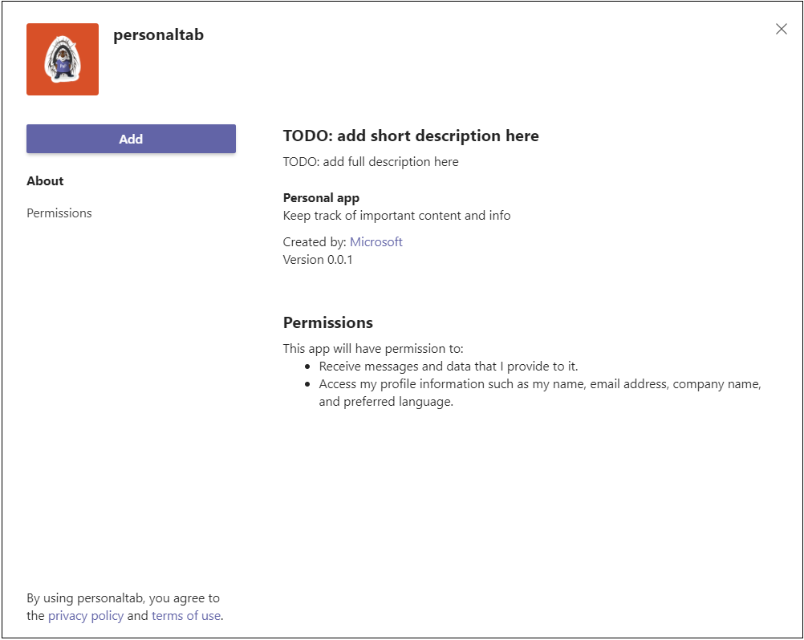
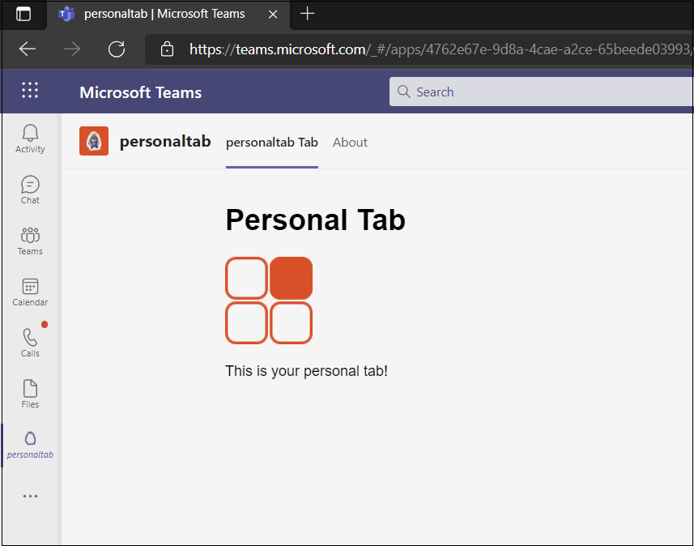

# <a name="create-a-personal-tab"></a><span data-ttu-id="023da-103">Erstellen einer persönlichen Registerkarte</span><span class="sxs-lookup"><span data-stu-id="023da-103">Create a personal tab</span></span>

## <a name="create-a-custom-personal-tab"></a><span data-ttu-id="023da-104">Erstellen einer benutzerdefinierten persönlichen Registerkarte</span><span class="sxs-lookup"><span data-stu-id="023da-104">Create a custom personal tab</span></span>

<span data-ttu-id="023da-105">Sie können eine persönliche Registerkarte mit Node.js und dem Yeoman-Generator, ASP.NET Core oder ASP.NET Core MVC erstellen.</span><span class="sxs-lookup"><span data-stu-id="023da-105">You can create a personal tab using Node.js and the Yeoman Generator, ASP.NET Core, or ASP.NET Core MVC.</span></span>

# <a name="nodejs"></a>[<span data-ttu-id="023da-106">Node.js</span><span class="sxs-lookup"><span data-stu-id="023da-106">Node.js</span></span>](#tab/nodejs)

### <a name="create-a-custom-personal-tab-using-nodejs-and-the-yeoman-generator"></a><span data-ttu-id="023da-107">Erstellen einer benutzerdefinierten persönlichen Registerkarte mit Node.js und dem Yeoman-Generator</span><span class="sxs-lookup"><span data-stu-id="023da-107">Create a custom personal tab using Node.js and the Yeoman Generator</span></span>

> [!NOTE]
> <span data-ttu-id="023da-108">Dieser Artikel folgt den Schritten, die im [Build Ihres ersten Microsoft Teams App-Wiki](https://github.com/OfficeDev/generator-teams/wiki/Build-Your-First-Microsoft-Teams-App) im Microsoft OfficeDev-GitHub-Repository beschrieben sind.</span><span class="sxs-lookup"><span data-stu-id="023da-108">This article follows the steps outlined in the [build your first Microsoft Teams app](https://github.com/OfficeDev/generator-teams/wiki/Build-Your-First-Microsoft-Teams-App) Wiki found in the Microsoft OfficeDev GitHub repository.</span></span>

<span data-ttu-id="023da-109">Sie können eine benutzerdefinierte persönliche Registerkarte mit dem [Teams Yeoman-Generator](https://github.com/OfficeDev/generator-teams/wiki/Build-Your-First-Microsoft-Teams-App)erstellen.</span><span class="sxs-lookup"><span data-stu-id="023da-109">You can create a custom personal tab using the [Teams Yeoman generator](https://github.com/OfficeDev/generator-teams/wiki/Build-Your-First-Microsoft-Teams-App).</span></span> <span data-ttu-id="023da-110">Die Anwendung wird auch in Teams hochgeladen.</span><span class="sxs-lookup"><span data-stu-id="023da-110">The application is also uploaded to Teams.</span></span>

### <a name="prerequisites-for-teams-apps"></a><span data-ttu-id="023da-111">Voraussetzungen für Teams-Apps</span><span class="sxs-lookup"><span data-stu-id="023da-111">Prerequisites for Teams apps</span></span>

<span data-ttu-id="023da-112">Sie müssen die folgenden Voraussetzungen verstehen:</span><span class="sxs-lookup"><span data-stu-id="023da-112">You must have an understanding of the following prerequisites:</span></span>

- <span data-ttu-id="023da-113">Sie müssen einen Office 365 Mandanten und ein Team mit aktivierter **Option "Hochladen benutzerdefinierter Apps zulassen"** konfiguriert haben.</span><span class="sxs-lookup"><span data-stu-id="023da-113">You must have an Office 365 tenant and a team configured with **Allow uploading custom apps** enabled.</span></span> <span data-ttu-id="023da-114">Weitere Informationen finden Sie unter [Vorbereiten Ihres Office 365 Mandanten.](~/concepts/build-and-test/prepare-your-o365-tenant.md)</span><span class="sxs-lookup"><span data-stu-id="023da-114">For more information, see [prepare your Office 365 tenant](~/concepts/build-and-test/prepare-your-o365-tenant.md).</span></span>

    > [!NOTE]
    > <span data-ttu-id="023da-115">Wenn Sie nicht über ein Office 365 Konto verfügen, können Sie sich über das Office 365-Entwicklerprogramm für ein kostenloses Abonnement registrieren.</span><span class="sxs-lookup"><span data-stu-id="023da-115">If you do not have an Office 365 account, you can sign up for a free subscription through the Office 365 Developer Program.</span></span> <span data-ttu-id="023da-116">Das Abonnement bleibt aktiv, solange Sie es für die fortlaufende Entwicklung verwenden.</span><span class="sxs-lookup"><span data-stu-id="023da-116">The subscription remains active as long as you are using it for ongoing development.</span></span> <span data-ttu-id="023da-117">Willkommen [beim Office 365-Entwicklerprogramm.](/office/developer-program/microsoft-365-developer-program)</span><span class="sxs-lookup"><span data-stu-id="023da-117">See [welcome to the Office 365 Developer Program](/office/developer-program/microsoft-365-developer-program).</span></span>

<span data-ttu-id="023da-118">Darüber hinaus muss für dieses Projekt Folgendes in Ihrer Entwicklungsumgebung installiert sein:</span><span class="sxs-lookup"><span data-stu-id="023da-118">In addition, this project requires that you have the following installed in your development environment:</span></span>

- <span data-ttu-id="023da-119">Ein beliebiger Text-Editor oder eine beliebige IDE.</span><span class="sxs-lookup"><span data-stu-id="023da-119">Any text editor or IDE.</span></span> <span data-ttu-id="023da-120">Sie können [Visual Studio Code](https://code.visualstudio.com/download) kostenlos installieren und verwenden.</span><span class="sxs-lookup"><span data-stu-id="023da-120">You can install and use [Visual Studio Code](https://code.visualstudio.com/download) for free.</span></span>

- <span data-ttu-id="023da-121">[Node.js/npm](https://nodejs.org/en/).</span><span class="sxs-lookup"><span data-stu-id="023da-121">[Node.js/npm](https://nodejs.org/en/).</span></span> <span data-ttu-id="023da-122">Verwenden Sie die neueste LTS-Version.</span><span class="sxs-lookup"><span data-stu-id="023da-122">Use the latest LTS version.</span></span> <span data-ttu-id="023da-123">Die Node Paket-Manager (npm) wird in Ihrem System mit der Installation von Node.js installiert.</span><span class="sxs-lookup"><span data-stu-id="023da-123">The Node Package Manager (npm) is installed in your system with the installation of Node.js.</span></span>

- <span data-ttu-id="023da-124">Nachdem Sie Node.js erfolgreich installiert haben, installieren Sie die [Yeoman-](https://yeoman.io/) und [gulp-cli-Pakete,](https://www.npmjs.com/package/gulp-cli) indem Sie in der Eingabeaufforderung Folgendes eingeben:</span><span class="sxs-lookup"><span data-stu-id="023da-124">After you have successfully installed Node.js, install the [Yeoman](https://yeoman.io/) and [gulp-cli](https://www.npmjs.com/package/gulp-cli) packages by entering the following in your command prompt:</span></span>

    ```bash
    npm install yo gulp-cli --global
    ```

- <span data-ttu-id="023da-125">Installieren Sie den Microsoft Teams Apps-Generator, indem Sie in der Eingabeaufforderung Folgendes eingeben:</span><span class="sxs-lookup"><span data-stu-id="023da-125">Install the Microsoft Teams Apps generator by entering the following in your command prompt:</span></span>

    ```bash
    npm install generator-teams --global
    ```

### <a name="generate-your-project"></a><span data-ttu-id="023da-126">Generieren Ihres Projekts</span><span class="sxs-lookup"><span data-stu-id="023da-126">Generate your project</span></span>

<span data-ttu-id="023da-127">**So generieren Sie Ihr Projekt**</span><span class="sxs-lookup"><span data-stu-id="023da-127">**To generate your project**</span></span>

1. <span data-ttu-id="023da-128">Erstellen Sie an einer Eingabeaufforderung ein neues Verzeichnis für Ihr Registerkartenprojekt.</span><span class="sxs-lookup"><span data-stu-id="023da-128">At a command prompt, create a new directory for your tab project.</span></span>

1. <span data-ttu-id="023da-129">Um den Generator zu starten, wechseln Sie zu Ihrem neuen Verzeichnis, und geben Sie den folgenden Befehl ein:</span><span class="sxs-lookup"><span data-stu-id="023da-129">To start the generator, go to your new directory and enter the following command:</span></span>

    ```bash
    yo teams
    ```

1. <span data-ttu-id="023da-130">Geben Sie als Nächstes eine Reihe von Werten an, die in der **manifest.js** der Anwendung in der Datei verwendet werden:</span><span class="sxs-lookup"><span data-stu-id="023da-130">Next, provide a series of values that are used in your application's **manifest.json** file:</span></span>

    

    <span data-ttu-id="023da-132">**Wie lautet der Name Ihrer Lösung?**</span><span class="sxs-lookup"><span data-stu-id="023da-132">**What is your solution name?**</span></span>

    <span data-ttu-id="023da-133">Dies ist ihr Projektname.</span><span class="sxs-lookup"><span data-stu-id="023da-133">This is your project name.</span></span> <span data-ttu-id="023da-134">Sie können den vorgeschlagenen Namen akzeptieren, indem Sie die **EINGABETASTE** drücken.</span><span class="sxs-lookup"><span data-stu-id="023da-134">You can accept the suggested name by selecting the **Enter** key.</span></span>

    <span data-ttu-id="023da-135">**Wohin möchten Sie die Daten verschieben?**</span><span class="sxs-lookup"><span data-stu-id="023da-135">**Where do you want to place the files?**</span></span>

    <span data-ttu-id="023da-136">Sie befinden sich derzeit in Ihrem Projektverzeichnis.</span><span class="sxs-lookup"><span data-stu-id="023da-136">You are currently in your project directory.</span></span> <span data-ttu-id="023da-137">Drücken Sie **die EINGABETASTE.**</span><span class="sxs-lookup"><span data-stu-id="023da-137">Select **Enter**.</span></span>

    <span data-ttu-id="023da-138">**Titel Ihres Microsoft Teams App-Projekts?**</span><span class="sxs-lookup"><span data-stu-id="023da-138">**Title of your Microsoft Teams app project?**</span></span>

    <span data-ttu-id="023da-139">Dies ist der Name Ihres App-Pakets und wird im App-Manifest und in der Beschreibung verwendet.</span><span class="sxs-lookup"><span data-stu-id="023da-139">This is your app package name and will be used in the app manifest and description.</span></span> <span data-ttu-id="023da-140">Geben Sie einen Titel ein, oder drücken Sie **die EINGABETASTE,** um den Standardnamen zu übernehmen.</span><span class="sxs-lookup"><span data-stu-id="023da-140">Enter a title or select **Enter** to accept the default name.</span></span>

    <span data-ttu-id="023da-141">**Ihr (Firmen-)Name? (max. 32 Zeichen)**</span><span class="sxs-lookup"><span data-stu-id="023da-141">**Your (company) name? (max 32 characters)**</span></span>

    <span data-ttu-id="023da-142">Ihr Firmenname wird im App-Manifest verwendet.</span><span class="sxs-lookup"><span data-stu-id="023da-142">Your company name will be used in the app manifest.</span></span> <span data-ttu-id="023da-143">Geben Sie einen Firmennamen ein, oder drücken Sie die **EINGABETASTE,** um den Standardnamen zu übernehmen.</span><span class="sxs-lookup"><span data-stu-id="023da-143">Enter a company name or select **Enter** to accept the default name.</span></span>

    <span data-ttu-id="023da-144">**Welche Manifestversion möchten Sie verwenden?**</span><span class="sxs-lookup"><span data-stu-id="023da-144">**Which manifest version would you like to use?**</span></span>

    <span data-ttu-id="023da-145">Wählen Sie das Standardschema aus.</span><span class="sxs-lookup"><span data-stu-id="023da-145">Select the default schema.</span></span>

    <span data-ttu-id="023da-146">**Schnelles Gerüst? (J/n)**</span><span class="sxs-lookup"><span data-stu-id="023da-146">**Quick scaffolding? (Y/n)**</span></span>

    <span data-ttu-id="023da-147">Der Standardwert ist "ja". Geben Sie **n** ein, um Ihre Microsoft Partner-ID einzugeben.</span><span class="sxs-lookup"><span data-stu-id="023da-147">The default is yes; enter **n** to enter your Microsoft Partner Id.</span></span>

    <span data-ttu-id="023da-148">**Geben Sie Ihre Microsoft Partner-ID ein, wenn Sie eine haben? (Leer lassen, um zu überspringen)**</span><span class="sxs-lookup"><span data-stu-id="023da-148">**Enter your Microsoft Partner Id, if you have one? (Leave blank to skip)**</span></span>

    <span data-ttu-id="023da-149">Dieses Feld ist nicht erforderlich und sollte nur verwendet werden, wenn Sie bereits Teil des [Microsoft Partner Network](https://partner.microsoft.com)sind.</span><span class="sxs-lookup"><span data-stu-id="023da-149">This field is not required and should only be used if you are already part of the [Microsoft Partner Network](https://partner.microsoft.com).</span></span>

    <span data-ttu-id="023da-150">**Was möchten Sie Ihrem Projekt hinzufügen?**</span><span class="sxs-lookup"><span data-stu-id="023da-150">**What do you want to add to your project?**</span></span>

    <span data-ttu-id="023da-151">Select **( ) A &ast; Tab**.</span><span class="sxs-lookup"><span data-stu-id="023da-151">Select **( &ast; ) A Tab**.</span></span>

    <span data-ttu-id="023da-152">**Die URL, unter der Sie diese Lösung hosten werden?**</span><span class="sxs-lookup"><span data-stu-id="023da-152">**The URL where you will host this solution?**</span></span>

    <span data-ttu-id="023da-153">Standardmäßig schlägt der Generator eine Azure-Website-URL vor.</span><span class="sxs-lookup"><span data-stu-id="023da-153">By default the generator suggests an Azure Web Sites URL.</span></span> <span data-ttu-id="023da-154">Sie testen Ihre App nur lokal, daher ist keine gültige URL erforderlich.</span><span class="sxs-lookup"><span data-stu-id="023da-154">You are only testing your app locally, therefore, a valid URL is not necessary.</span></span>

    <span data-ttu-id="023da-155">**Möchten Sie eine Ladeanzeige anzeigen, wenn Ihre App/Registerkarte geladen wird?**</span><span class="sxs-lookup"><span data-stu-id="023da-155">**Would you like show a loading indicator when your app/tab loads?**</span></span>

    <span data-ttu-id="023da-156">Schließen Sie beim Laden ihrer App oder Registerkarte **keine** Ladeanzeige ein.</span><span class="sxs-lookup"><span data-stu-id="023da-156">Choose **not** to include a loading indicator when your app or tab loads.</span></span> <span data-ttu-id="023da-157">The default is no, enter **n**.</span><span class="sxs-lookup"><span data-stu-id="023da-157">The default is no, enter **n**.</span></span>

    <span data-ttu-id="023da-158">**Möchten Sie, dass persönliche Apps ohne eine Registerkarten-Kopfleiste dargestellt werden?**</span><span class="sxs-lookup"><span data-stu-id="023da-158">**Would you like personal apps to be rendered without a tab header-bar?**</span></span>

    <span data-ttu-id="023da-159">Fügen Sie **keine** persönlichen Apps ein, die ohne Registerkartenkopfleiste gerendert werden sollen.</span><span class="sxs-lookup"><span data-stu-id="023da-159">Choose **not** to include personal apps to be rendered without a tab header-bar.</span></span> <span data-ttu-id="023da-160">Der Standardwert ist "Nein", geben Sie **"n"** ein.</span><span class="sxs-lookup"><span data-stu-id="023da-160">Default is no, enter **n**.</span></span>

    <span data-ttu-id="023da-161">**Möchten Sie testframework und erste Tests einbeziehen? (y/N)**</span><span class="sxs-lookup"><span data-stu-id="023da-161">**Would you like to include Test framework and initial tests? (y/N)**</span></span>

    <span data-ttu-id="023da-162">Schließen Sie **kein** Testframework für dieses Projekt ein.</span><span class="sxs-lookup"><span data-stu-id="023da-162">Choose **not** to include a test framework for this project.</span></span> <span data-ttu-id="023da-163">Der Standardwert ist "Ja", geben Sie **"n"** ein.</span><span class="sxs-lookup"><span data-stu-id="023da-163">The default is yes, enter **n**.</span></span>

    <span data-ttu-id="023da-164">**Möchten Sie Azure Applications Insights für Telemetrie verwenden? (y/N)**</span><span class="sxs-lookup"><span data-stu-id="023da-164">**Would you like to use Azure Applications Insights for telemetry? (y/N)**</span></span>

    <span data-ttu-id="023da-165">Wählen Sie **aus, dass** [Azure Application Insights](/azure/azure-monitor/app/app-insights-overview)nicht eingeschlossen werden soll.</span><span class="sxs-lookup"><span data-stu-id="023da-165">Choose **not** to include [Azure Application Insights](/azure/azure-monitor/app/app-insights-overview).</span></span> <span data-ttu-id="023da-166">Der Standardwert ist "nein". geben Sie **n** ein.</span><span class="sxs-lookup"><span data-stu-id="023da-166">The default is no; enter **n**.</span></span>

    <span data-ttu-id="023da-167">**Standardregisterkartenname (max. 16 Zeichen)?**</span><span class="sxs-lookup"><span data-stu-id="023da-167">**Default Tab Name (max 16 characters)?**</span></span>

    <span data-ttu-id="023da-168">Nennen Sie Ihre Registerkarte. Dieser Registerkartenname wird im gesamten Projekt als Datei- oder URL-Pfadkomponente verwendet.</span><span class="sxs-lookup"><span data-stu-id="023da-168">Name your tab. This tab name is used throughout your project as a file or URL path component.</span></span>

    <span data-ttu-id="023da-169">**Welche Art von Registerkarte möchten Sie erstellen?**</span><span class="sxs-lookup"><span data-stu-id="023da-169">**What kind of Tab would you like to create?**</span></span>

    <span data-ttu-id="023da-170">Verwenden Sie die Pfeiltasten, um **"Persönlich" (statisch)** auszuwählen.</span><span class="sxs-lookup"><span data-stu-id="023da-170">Use the arrow keys to select **Personal (static)**.</span></span>

    <span data-ttu-id="023da-171">**Benötigen Sie Azure AD-Unterstützung für einmaliges Anmelden (Single-Sign-On, SSO) für die Registerkarte?**</span><span class="sxs-lookup"><span data-stu-id="023da-171">**Do you require Azure AD Single-Sign-On support for the tab?**</span></span>

    <span data-ttu-id="023da-172">Wählen Sie aus, dass die Azure AD-Single Sign-On-Unterstützung für die Registerkarte **nicht** eingeschlossen werden soll. Der Standardwert ist "Ja", geben Sie **"n"** ein.</span><span class="sxs-lookup"><span data-stu-id="023da-172">Choose **not** to include Azure AD Single-Sign-On support for the tab. The default is yes, enter **n**.</span></span>

    > [!IMPORTANT]
    > <span data-ttu-id="023da-173">The path component **yourDefaultTabNameTab** is the value that you entered in the generator for **Default Tab Name** plus the word **Tab**.</span><span class="sxs-lookup"><span data-stu-id="023da-173">The path component **yourDefaultTabNameTab** is the value that you entered in the generator for **Default Tab Name** plus the word **Tab**.</span></span>
    >
    > <span data-ttu-id="023da-174">Beispiel: DefaultTabName: **MyTab**  >  **/MyTabTab/**</span><span class="sxs-lookup"><span data-stu-id="023da-174">For example: DefaultTabName: **MyTab** > **/MyTabTab/**</span></span>

### <a name="add-a-personal-tab"></a><span data-ttu-id="023da-175">Hinzufügen einer persönlichen Registerkarte</span><span class="sxs-lookup"><span data-stu-id="023da-175">Add a personal tab</span></span>

<span data-ttu-id="023da-176">**Um dieser Anwendung eine persönliche Registerkarte hinzuzufügen, erstellen Sie eine Inhaltsseite, und aktualisieren Sie vorhandene Dateien.**</span><span class="sxs-lookup"><span data-stu-id="023da-176">**To add a personal tab to this application, create a content page, and update existing files**</span></span>

1. <span data-ttu-id="023da-177">Erstellen Sie in Ihrem Code-Editor eine neue HTML-Datei, **personal.html,** und fügen Sie das folgende Markup hinzu:</span><span class="sxs-lookup"><span data-stu-id="023da-177">In your code editor, create a new HTML file, **personal.html** and add the following markup:</span></span>

    ```html
    <!DOCTYPE html>
    <html>
        <head>
            <meta charset="UTF-8">
            <title>
                <!-- Todo: add your a title here -->
            </title>
            <meta name="viewport" content="width=device-width, initial-scale=1.0">
            <!-- inject:css -->
            <!-- endinject -->
        </head>
            <body>
                <h1>Personal Tab</h1>
                <p></p>
                <p>This is your personal tab!</p>
            </body>
    </html>
    ```

1. <span data-ttu-id="023da-178">Speichern Sie **personal.html** im **Webordner** Ihrer Anwendung am folgenden Speicherort:</span><span class="sxs-lookup"><span data-stu-id="023da-178">Save **personal.html** in your application's **web** folder in the following location:</span></span>

    ```bash
    ./src/app/web/<yourDefaultTabNameTab>/personal.html
    ```

1. <span data-ttu-id="023da-179">Öffnen **Siemanifest.jsan** der folgenden Stelle im Code-Editor:</span><span class="sxs-lookup"><span data-stu-id="023da-179">Open **manifest.json** from the following location in your code editor:</span></span>

    ```bash
    ./src/manifest/manifest.json/
    ```

1. <span data-ttu-id="023da-180">Fügen Sie dem leeren Array ( ) Folgendes `staticTabs` `staticTabs":[]` hinzu, und fügen Sie das folgende JSON-Objekt hinzu:</span><span class="sxs-lookup"><span data-stu-id="023da-180">Add the following to the empty `staticTabs` array (`staticTabs":[]`) and add the following JSON object:</span></span>

    ```json
    {
        "entityId": "personalTab",
        "name": "Personal Tab ",
        "contentUrl": "https://{{HOSTNAME}}/<yourDefaultTabNameTab>/personal.html",
        "websiteUrl": "https://{{HOSTNAME}}",
        "scopes": ["personal"]
    }
    ```

1. <span data-ttu-id="023da-181">Aktualisieren Sie die **contentURL-Pfadkomponente** **"yourDefaultTabNameTab"** mit dem tatsächlichen Registerkartennamen.</span><span class="sxs-lookup"><span data-stu-id="023da-181">Update the **contentURL** path component **yourDefaultTabNameTab** with your actual tab name.</span></span>

1. <span data-ttu-id="023da-182">Speichern Sie die aktualisierte **manifest.jsin der** Datei.</span><span class="sxs-lookup"><span data-stu-id="023da-182">Save the updated **manifest.json** file.</span></span>

1. <span data-ttu-id="023da-183">Um ihre Inhaltsseite in einem IFrame bereitzustellen, öffnen Sie **Tab.ts** in Ihrem Code-Editor über den folgenden Pfad:</span><span class="sxs-lookup"><span data-stu-id="023da-183">To provide your content page in an IFrame, open **Tab.ts** in your code editor from the following path:</span></span>

    ```bash
    ./src/app/<yourDefaultTabNameTab>/<yourDefaultTabNameTab>.ts
    ```

1. <span data-ttu-id="023da-184">Fügen Sie der Liste der IFrame-Decoratoren Folgendes hinzu:</span><span class="sxs-lookup"><span data-stu-id="023da-184">Add the following to the list of IFrame decorators:</span></span>

    ```typescript
     @PreventIframe("/<yourDefaultAppName>TabNameTab>/personal.html")
    ```

1. <span data-ttu-id="023da-185">Speichern Sie die aktualisierte Datei **Tab.ts .**</span><span class="sxs-lookup"><span data-stu-id="023da-185">Save the updated **Tab.ts** file.</span></span> <span data-ttu-id="023da-186">Der Registerkartencode ist vollständig.</span><span class="sxs-lookup"><span data-stu-id="023da-186">Your tab code is complete.</span></span>

### <a name="build-and-run-your-application"></a><span data-ttu-id="023da-187">Erstellen und Ausführen der Anwendung</span><span class="sxs-lookup"><span data-stu-id="023da-187">Build and run your application</span></span>

<span data-ttu-id="023da-188">Öffnen Sie an einer Eingabeaufforderung Das Projektverzeichnis, um die nächsten Aufgaben auszuführen.</span><span class="sxs-lookup"><span data-stu-id="023da-188">At a command prompt, open your project directory to complete the next tasks.</span></span>

#### <a name="create-the-app-package"></a><span data-ttu-id="023da-189">Erstellen des App-Pakets</span><span class="sxs-lookup"><span data-stu-id="023da-189">Create the app package</span></span>

<span data-ttu-id="023da-190">Sie benötigen ein App-Paket, um Ihre Registerkarte in Teams zu testen.</span><span class="sxs-lookup"><span data-stu-id="023da-190">You must have an app package to test your tab in Teams.</span></span> <span data-ttu-id="023da-191">Es handelt sich um einen ZIP-Ordner, der die folgenden erforderlichen Dateien enthält:</span><span class="sxs-lookup"><span data-stu-id="023da-191">It is a zip folder that contains the following required files:</span></span>

- <span data-ttu-id="023da-192">Ein **Vollfarbsymbol** mit einer Auflösung von 192 x 192 Pixeln.</span><span class="sxs-lookup"><span data-stu-id="023da-192">A **full color icon** measuring 192 x 192 pixels.</span></span>
- <span data-ttu-id="023da-193">Ein **transparentes Gliederungssymbol** mit einer Auflösung von 32 x 32 Pixeln.</span><span class="sxs-lookup"><span data-stu-id="023da-193">A **transparent outline icon** measuring 32 x 32 pixels.</span></span>
- <span data-ttu-id="023da-194">Ein **manifest.jsfür** die Datei, die die Attribute Ihrer App angibt.</span><span class="sxs-lookup"><span data-stu-id="023da-194">A **manifest.json** file that specifies the attributes of your app.</span></span>

<span data-ttu-id="023da-195">Das Paket wird über eine gulp-Aufgabe erstellt, die die manifest.json-Datei überprüft und den ZIP-Ordner im **./package-Verzeichnis** generiert.</span><span class="sxs-lookup"><span data-stu-id="023da-195">The package is created through a gulp task that validates the manifest.json file and generates the zip folder in the **./package directory**.</span></span> <span data-ttu-id="023da-196">Geben Sie an der Eingabeaufforderung den folgenden Befehl ein:</span><span class="sxs-lookup"><span data-stu-id="023da-196">In the command prompt, enter the following command:</span></span>

```bash
gulp manifest
```

#### <a name="build-your-application"></a><span data-ttu-id="023da-197">Erstellen Der Anwendung</span><span class="sxs-lookup"><span data-stu-id="023da-197">Build your application</span></span>

<span data-ttu-id="023da-198">Der Buildbefehl transpiliert Ihre Lösung in den Ordner **./dist.**</span><span class="sxs-lookup"><span data-stu-id="023da-198">The build command transpiles your solution into the **./dist** folder.</span></span> <span data-ttu-id="023da-199">Geben Sie in der Eingabeaufforderung den folgenden Befehl ein:</span><span class="sxs-lookup"><span data-stu-id="023da-199">Enter the following command in the command prompt:</span></span>

```bash
gulp build
```

#### <a name="run-your-application-in-localhost"></a><span data-ttu-id="023da-200">Ausführen der Anwendung in localhost</span><span class="sxs-lookup"><span data-stu-id="023da-200">Run your application in localhost</span></span>

1. <span data-ttu-id="023da-201">Starten Sie einen lokalen Webserver, indem Sie in der Eingabeaufforderung Folgendes eingeben:</span><span class="sxs-lookup"><span data-stu-id="023da-201">Start a local web server by entering the following in the command prompt:</span></span>

    ```bash
    gulp serve
    ```

1. <span data-ttu-id="023da-202">Geben Sie `http://localhost:3007/<yourDefaultAppNameTab>/` in Ihren Browser ein, ersetzen Sie diesen **<yourDefaultAppNameTab>** durch ihren Registerkartennamen, und zeigen Sie die Startseite Ihrer Anwendung an, wie in der folgenden Abbildung dargestellt:</span><span class="sxs-lookup"><span data-stu-id="023da-202">Enter `http://localhost:3007/<yourDefaultAppNameTab>/` in your browser, replace **<yourDefaultAppNameTab>** with your tab name, and view your application's home page as shown in the following image:</span></span>

    

1. <span data-ttu-id="023da-204">Um Ihre persönliche Registerkarte anzuzeigen, wechseln Sie zu `http://localhost:3007/<yourDefaultAppNameTab>/personal.html` .</span><span class="sxs-lookup"><span data-stu-id="023da-204">To view your personal tab, go to `http://localhost:3007/<yourDefaultAppNameTab>/personal.html`.</span></span>

    >

### <a name="establish-a-secure-tunnel-to-your-tab"></a><span data-ttu-id="023da-206">Einrichten eines sicheren Tunnels zu Ihrer Registerkarte</span><span class="sxs-lookup"><span data-stu-id="023da-206">Establish a secure tunnel to your tab</span></span>

<span data-ttu-id="023da-207">Microsoft Teams ist ein cloudbasiertes Produkt und erfordert, dass Ihre Registerkarteninhalte über HTTPS-Endpunkte aus der Cloud verfügbar sind.</span><span class="sxs-lookup"><span data-stu-id="023da-207">Microsoft Teams is a cloud-based product and requires that your tab content be available from the cloud using HTTPS endpoints.</span></span> <span data-ttu-id="023da-208">Teams lässt kein lokales Hosting zu.</span><span class="sxs-lookup"><span data-stu-id="023da-208">Teams does not allow local hosting.</span></span> <span data-ttu-id="023da-209">Sie müssen ihre Registerkarte entweder auf einer öffentlichen URL veröffentlichen oder einen Proxy verwenden, der Ihren lokalen Port für eine internetbasierte URL verfügbar macht.</span><span class="sxs-lookup"><span data-stu-id="023da-209">You must either publish your tab to a public URL or use a proxy that exposes your local port to an internet-facing URL.</span></span>

<span data-ttu-id="023da-210">Zum Testen der Registerkartenerweiterung können Sie [ngrok](https://ngrok.com/docs)verwenden, das in diese Anwendung integriert ist.</span><span class="sxs-lookup"><span data-stu-id="023da-210">To test your tab extension, you can use [ngrok](https://ngrok.com/docs), which is built into this application.</span></span> <span data-ttu-id="023da-211">Ngrok ist ein Reverseproxysoftwaretool, das einen Tunnel zu den öffentlich verfügbaren HTTPS-Endpunkten Ihres lokal ausgeführten Webservers erstellt.</span><span class="sxs-lookup"><span data-stu-id="023da-211">Ngrok is a reverse proxy software tool that creates a tunnel to your locally running web server's publicly-available HTTPS endpoints.</span></span> <span data-ttu-id="023da-212">Die Webendpunkte Ihres Servers sind während der aktuellen Sitzung auf Ihrem Computer verfügbar.</span><span class="sxs-lookup"><span data-stu-id="023da-212">Your server's web endpoints are available during the current session on your computer.</span></span> <span data-ttu-id="023da-213">Wenn der Computer heruntergefahren wird oder in den Ruhezustand wechselt, ist der Dienst nicht mehr verfügbar.</span><span class="sxs-lookup"><span data-stu-id="023da-213">When the computer is shut down or goes to sleep, the service is no longer available.</span></span>

<span data-ttu-id="023da-214">Beenden Sie an der Eingabeaufforderung "localhost", und geben Sie Folgendes ein:</span><span class="sxs-lookup"><span data-stu-id="023da-214">In your command prompt, exit localhost and enter the following:</span></span>

```bash
gulp ngrok-serve
```

> [!IMPORTANT]
> <span data-ttu-id="023da-215">Nachdem Ihre Registerkarte in Microsoft Teams über **ngrok** hochgeladen und erfolgreich gespeichert wurde, können Sie sie in Teams anzeigen, bis Ihre Tunnelsitzung endet.</span><span class="sxs-lookup"><span data-stu-id="023da-215">After your tab has been uploaded to Microsoft Teams through **ngrok**, and successfully saved, you can view it in Teams until your tunnel session ends.</span></span>

### <a name="upload-your-application-to-teams"></a><span data-ttu-id="023da-216">Hochladen Der Anwendung Teams</span><span class="sxs-lookup"><span data-stu-id="023da-216">Upload your application to Teams</span></span>

<span data-ttu-id="023da-217">**So laden Sie Ihre Anwendung in Teams**</span><span class="sxs-lookup"><span data-stu-id="023da-217">**To upload your application to Teams**</span></span>

1. <span data-ttu-id="023da-218">Wechseln Sie zu Microsoft Teams.</span><span class="sxs-lookup"><span data-stu-id="023da-218">Go to Microsoft Teams.</span></span> <span data-ttu-id="023da-219">Wenn Sie die [webbasierte Version](https://teams.microsoft.com) verwenden, können Sie Ihren Front-End-Code mithilfe der [Entwicklertools](~/tabs/how-to/developer-tools.md)Ihres Browsers überprüfen.</span><span class="sxs-lookup"><span data-stu-id="023da-219">If you use the [web-based version](https://teams.microsoft.com) you can inspect your front-end code using your browser's [developer tools](~/tabs/how-to/developer-tools.md).</span></span>
1. <span data-ttu-id="023da-220">**Wählen** Sie in der unteren linken Ecke Apps aus.</span><span class="sxs-lookup"><span data-stu-id="023da-220">From the lower left corner, select **Apps**.</span></span>
1. <span data-ttu-id="023da-221">Wählen Sie in der unteren linken Ecke **Hochladen einer benutzerdefinierten App** aus.</span><span class="sxs-lookup"><span data-stu-id="023da-221">From the lower left corner, choose **Upload a custom app**.</span></span>
1. <span data-ttu-id="023da-222">Wechseln Sie zu Ihrem Projektverzeichnis, navigieren Sie zum **Ordner "./package",** wählen Sie den ZIP-Ordner aus, und wählen Sie **"Öffnen"** aus.</span><span class="sxs-lookup"><span data-stu-id="023da-222">Go to your project directory, browse to the **./package** folder, select the zip folder, and choose **Open**.</span></span>

    

1. <span data-ttu-id="023da-224">Wählen  Sie im Dialogfeld Hinzufügen die Option Hinzufügen aus.</span><span class="sxs-lookup"><span data-stu-id="023da-224">Select **Add** in the pop-up dialog box.</span></span> <span data-ttu-id="023da-225">Ihre Registerkarte wird in Teams hochgeladen.</span><span class="sxs-lookup"><span data-stu-id="023da-225">Your tab is uploaded to Teams.</span></span>

    

### <a name="view-your-personal-tab"></a><span data-ttu-id="023da-227">Anzeigen Ihrer persönlichen Registerkarte</span><span class="sxs-lookup"><span data-stu-id="023da-227">View your personal tab</span></span>

<span data-ttu-id="023da-228">Wählen Sie in der Navigationsleiste ganz links in Teams die Auslassungspunkte &#x25CF;&#x25CF;&#x25CF; aus, und wählen Sie Ihre App aus der Liste aus.</span><span class="sxs-lookup"><span data-stu-id="023da-228">In the navigation bar located at the far left in Teams, select the ellipses &#x25CF;&#x25CF;&#x25CF; and choose your app from the list.</span></span>

# <a name="aspnet-core"></a>[<span data-ttu-id="023da-229">ASP.NET Core</span><span class="sxs-lookup"><span data-stu-id="023da-229">ASP.NET Core</span></span>](#tab/aspnetcore)

### <a name="create-a-custom-personal-tab-using-aspnet-core"></a><span data-ttu-id="023da-230">Erstellen einer benutzerdefinierten persönlichen Registerkarte mit ASP.NET Core</span><span class="sxs-lookup"><span data-stu-id="023da-230">Create a custom personal tab using ASP.NET Core</span></span>

<span data-ttu-id="023da-231">Sie können eine benutzerdefinierte persönliche Registerkarte mit C# und ASP.NET Core Razor-Seiten erstellen.</span><span class="sxs-lookup"><span data-stu-id="023da-231">You can create a custom personal tab using C# and ASP.NET Core Razor pages.</span></span> <span data-ttu-id="023da-232">[App Studio für Microsoft Teams](~/concepts/build-and-test/app-studio-overview.md) wird auch verwendet, um Das App-Manifest fertig zu stellen und die Registerkarte für Teams bereitzustellen.</span><span class="sxs-lookup"><span data-stu-id="023da-232">[App Studio for Microsoft Teams](~/concepts/build-and-test/app-studio-overview.md) is also used to finalize your app manifest and deploy your tab to Teams.</span></span>

### <a name="prerequisites-for-personal-tab"></a><span data-ttu-id="023da-233">Voraussetzungen für die persönliche Registerkarte</span><span class="sxs-lookup"><span data-stu-id="023da-233">Prerequisites for personal tab</span></span>

<span data-ttu-id="023da-234">Sie müssen die folgenden Voraussetzungen verstehen:</span><span class="sxs-lookup"><span data-stu-id="023da-234">You must have an understanding of the following prerequisites:</span></span>

- <span data-ttu-id="023da-235">Sie müssen einen Office 365 Mandanten und ein Team mit aktivierter **Option "Hochladen benutzerdefinierter Apps zulassen"** konfiguriert haben.</span><span class="sxs-lookup"><span data-stu-id="023da-235">You must have an Office 365 tenant and a team configured with **Allow uploading custom apps** enabled.</span></span> <span data-ttu-id="023da-236">Weitere Informationen finden Sie unter [Vorbereiten Ihres Office 365 Mandanten.](~/concepts/build-and-test/prepare-your-o365-tenant.md)</span><span class="sxs-lookup"><span data-stu-id="023da-236">For more information, see [prepare your Office 365 tenant](~/concepts/build-and-test/prepare-your-o365-tenant.md).</span></span>

    > [!NOTE]
    > <span data-ttu-id="023da-237">Wenn Sie über kein Microsoft 365 Konto verfügen, können Sie sich über das [Microsoft-Entwicklerprogramm](https://developer.microsoft.com/en-us/microsoft-365/dev-program)für ein kostenloses Abonnement registrieren.</span><span class="sxs-lookup"><span data-stu-id="023da-237">If you do not have a Microsoft 365 account, you can sign up for a free subscription through the [Microsoft Developer Program](https://developer.microsoft.com/en-us/microsoft-365/dev-program).</span></span> <span data-ttu-id="023da-238">Das Abonnement bleibt aktiv, solange Sie es für die fortlaufende Entwicklung verwenden.</span><span class="sxs-lookup"><span data-stu-id="023da-238">The subscription remains active as long as you are using it for ongoing development.</span></span>

- <span data-ttu-id="023da-239">Verwenden Sie App Studio, um Ihre Anwendung in Teams zu importieren.</span><span class="sxs-lookup"><span data-stu-id="023da-239">Use App Studio to import your application to Teams.</span></span> <span data-ttu-id="023da-240">Um App Studio zu installieren, wählen Sie **Apps**  unteren linken Ecke der Teams App aus, und suchen Sie nach **App Studio.**</span><span class="sxs-lookup"><span data-stu-id="023da-240">To install App Studio, select **Apps**  at the lower left corner of the Teams app, and search for **App Studio**.</span></span> <span data-ttu-id="023da-241">Nachdem Sie die Kachel gefunden haben, wählen Sie sie aus, und wählen Sie im Popupdialogfeld **"Hinzufügen"** aus, um sie zu installieren.</span><span class="sxs-lookup"><span data-stu-id="023da-241">After you find the tile, select it and choose **Add** in the pop-up dialog box to install it.</span></span>

<span data-ttu-id="023da-242">Darüber hinaus muss für dieses Projekt Folgendes in Ihrer Entwicklungsumgebung installiert sein:</span><span class="sxs-lookup"><span data-stu-id="023da-242">In addition, this project requires that you have the following installed in your development environment:</span></span>

- <span data-ttu-id="023da-243">Die aktuelle Version der Visual Studio IDE, in der **die plattformübergreifende .NET CORE-Entwicklungsworkload** installiert ist.</span><span class="sxs-lookup"><span data-stu-id="023da-243">The current version of the Visual Studio IDE with the **.NET CORE cross-platform development** workload installed.</span></span> <span data-ttu-id="023da-244">Wenn Sie noch nicht über Visual Studio verfügen, können Sie die neueste [Microsoft Visual Studio Community Version](https://visualstudio.microsoft.com/downloads) kostenlos herunterladen und installieren.</span><span class="sxs-lookup"><span data-stu-id="023da-244">If you do not already have Visual Studio, you can download and install the latest [Microsoft Visual Studio Community](https://visualstudio.microsoft.com/downloads) version for free.</span></span>

- <span data-ttu-id="023da-245">Das [ngrok-Reverseproxytool.](https://ngrok.com)</span><span class="sxs-lookup"><span data-stu-id="023da-245">The [ngrok](https://ngrok.com) reverse proxy tool.</span></span> <span data-ttu-id="023da-246">Verwenden Sie ngrok, um einen Tunnel zu den öffentlich verfügbaren HTTPS-Endpunkten Ihres lokal ausgeführten Webservers zu erstellen.</span><span class="sxs-lookup"><span data-stu-id="023da-246">Use ngrok to create a tunnel to your locally running web server's publicly-available HTTPS endpoints.</span></span> <span data-ttu-id="023da-247">Sie können [ngrok herunterladen.](https://ngrok.com/download)</span><span class="sxs-lookup"><span data-stu-id="023da-247">You can [download ngrok](https://ngrok.com/download).</span></span>

### <a name="get-the-source-code"></a><span data-ttu-id="023da-248">Abrufen des Quellcodes</span><span class="sxs-lookup"><span data-stu-id="023da-248">Get the source code</span></span>

<span data-ttu-id="023da-249">Erstellen Sie an einer Eingabeaufforderung ein neues Verzeichnis für Ihr Registerkartenprojekt.</span><span class="sxs-lookup"><span data-stu-id="023da-249">At a command prompt, create a new directory for your tab project.</span></span> <span data-ttu-id="023da-250">Ein einfaches Projekt wird bereitgestellt, um Ihnen den Einstieg zu erleichtern.</span><span class="sxs-lookup"><span data-stu-id="023da-250">A simple project is provided to get you started.</span></span> <span data-ttu-id="023da-251">Klonen Sie das Beispiel-Repository mit dem folgenden Befehl in Ihr neues Verzeichnis:</span><span class="sxs-lookup"><span data-stu-id="023da-251">Clone the sample repository into your new directory using the following command:</span></span>

```bash
git clone https://github.com/OfficeDev/microsoft-teams-sample-tabs.git
```

<span data-ttu-id="023da-252">Alternativ können Sie den Quellcode abrufen, indem Sie den ZIP-Ordner herunterladen und die Dateien extrahieren.</span><span class="sxs-lookup"><span data-stu-id="023da-252">Alternately, you can retrieve the source code by downloading the zip folder and extracting the files.</span></span>

<span data-ttu-id="023da-253">**So erstellen Sie das Registerkartenprojekt und führen es aus**</span><span class="sxs-lookup"><span data-stu-id="023da-253">**To build and run the tab project**</span></span>

1. <span data-ttu-id="023da-254">Nachdem Sie den Quellcode abgerufen haben, wechseln Sie zu Visual Studio, und wählen Sie **"Projekt oder Projektmappe öffnen"** aus.</span><span class="sxs-lookup"><span data-stu-id="023da-254">After you get the source code, go to Visual Studio and select **Open a project or solution**.</span></span>
1. <span data-ttu-id="023da-255">Wechseln Sie zum Registerkartenanwendungsverzeichnis, und öffnen **Sie PersonalTab.sln**.</span><span class="sxs-lookup"><span data-stu-id="023da-255">Go to the tab application directory and open **PersonalTab.sln**.</span></span>
1. <span data-ttu-id="023da-256">Drücken Sie **F5,** oder wählen Sie im Menü **"Debuggen"** die Option **"Debuggen starten"** aus, um die Anwendung zu erstellen und auszuführen.</span><span class="sxs-lookup"><span data-stu-id="023da-256">To build and run your application, press **F5** or choose **Start Debugging** from the **Debug** menu.</span></span>
1. <span data-ttu-id="023da-257">Wechseln Sie in einem Browser zu den folgenden URLs, um zu überprüfen, ob die Anwendung ordnungsgemäß geladen wurde:</span><span class="sxs-lookup"><span data-stu-id="023da-257">In a browser, go to the following URLs to verify the application loaded properly:</span></span>

    - `http://localhost:44325/`
    - `http://localhost:44325/personal`
    - `http://localhost:44325/privacy`
    - `http://localhost:44325/tou`

### <a name="review-the-source-code"></a><span data-ttu-id="023da-258">Überprüfen des Quellcodes</span><span class="sxs-lookup"><span data-stu-id="023da-258">Review the source code</span></span>

#### <a name="startupcs"></a><span data-ttu-id="023da-259">Startup.cs</span><span class="sxs-lookup"><span data-stu-id="023da-259">Startup.cs</span></span>

<span data-ttu-id="023da-260">Dieses Projekt wurde aus einer leeren Vorlage für ASP.NET Core 2.2-Webanwendung erstellt, wobei das Kontrollkästchen **"Erweitert – Für HTTPS konfigurieren"** beim Setup aktiviert ist.</span><span class="sxs-lookup"><span data-stu-id="023da-260">This project was created from an ASP.NET Core 2.2 Web Application empty template with the **Advanced - Configure for HTTPS** check box selected at setup.</span></span> <span data-ttu-id="023da-261">Die MVC-Dienste werden durch die Methode des Abhängigkeitsinjektionsframeworks `ConfigureServices()` registriert.</span><span class="sxs-lookup"><span data-stu-id="023da-261">The MVC services are registered by the dependency injection framework's `ConfigureServices()` method.</span></span> <span data-ttu-id="023da-262">Darüber hinaus ermöglicht die leere Vorlage nicht standardmäßig die Bereitstellung statischer Inhalte, sodass die Middleware für statische Dateien der Methode mit dem folgenden Code hinzugefügt `Configure()` wird:</span><span class="sxs-lookup"><span data-stu-id="023da-262">Additionally, the empty template does not enable serving static content by default, so the static files middleware is added to the `Configure()` method using the following code:</span></span>

```csharp
public void ConfigureServices(IServiceCollection services)
  {
      services.AddMvc().SetCompatibilityVersion(CompatibilityVersion.Version_2_2);
  }
public void Configure(IApplicationBuilder app)
  {
    app.UseStaticFiles();
    app.UseMvc();
  }
```

#### <a name="wwwroot-folder"></a><span data-ttu-id="023da-263">Wwwroot-Ordner</span><span class="sxs-lookup"><span data-stu-id="023da-263">wwwroot folder</span></span>

<span data-ttu-id="023da-264">In ASP.NET Core sucht die Anwendung im Webstammordner nach statischen Dateien.</span><span class="sxs-lookup"><span data-stu-id="023da-264">In ASP.NET Core, the web root folder is where the application looks for static files.</span></span>

#### <a name="indexcshtml"></a><span data-ttu-id="023da-265">Index.cshtml</span><span class="sxs-lookup"><span data-stu-id="023da-265">Index.cshtml</span></span>

<span data-ttu-id="023da-266">ASP.NET Core behandelt Dateien mit dem Namen **Index** als Standard- oder Startseite für die Website.</span><span class="sxs-lookup"><span data-stu-id="023da-266">ASP.NET Core treats files called **Index** as the default or home page for the site.</span></span> <span data-ttu-id="023da-267">Wenn Ihre Browser-URL auf den Stamm der Website zeigt, wird **Index.cshtml** als Startseite für Ihre Anwendung angezeigt.</span><span class="sxs-lookup"><span data-stu-id="023da-267">When your browser URL points to the root of the site, **Index.cshtml** is displayed as the home page for your application.</span></span>

#### <a name="appmanifest-folder"></a><span data-ttu-id="023da-268">AppManifest-Ordner</span><span class="sxs-lookup"><span data-stu-id="023da-268">AppManifest folder</span></span>

<span data-ttu-id="023da-269">Dieser Ordner enthält die folgenden erforderlichen App-Paketdateien:</span><span class="sxs-lookup"><span data-stu-id="023da-269">This folder contains the following required app package files:</span></span>

- <span data-ttu-id="023da-270">Ein **Vollfarbsymbol** mit einer Auflösung von 192 x 192 Pixeln.</span><span class="sxs-lookup"><span data-stu-id="023da-270">A **full color icon** measuring 192 x 192 pixels.</span></span>
- <span data-ttu-id="023da-271">Ein **transparentes Gliederungssymbol** mit einer Auflösung von 32 x 32 Pixeln.</span><span class="sxs-lookup"><span data-stu-id="023da-271">A **transparent outline icon** measuring 32 x 32 pixels.</span></span>
- <span data-ttu-id="023da-272">Ein **manifest.jsfür** die Datei, die die Attribute Ihrer App angibt.</span><span class="sxs-lookup"><span data-stu-id="023da-272">A **manifest.json** file that specifies the attributes of your app.</span></span>

<span data-ttu-id="023da-273">Diese Dateien müssen in einem App-Paket gezippt werden, um Ihre Registerkarte in Teams hochzuladen.</span><span class="sxs-lookup"><span data-stu-id="023da-273">These files need to be zipped in an app package for use in uploading your tab to Teams.</span></span> <span data-ttu-id="023da-274">Microsoft Teams das angegebene `contentUrl` Element in Ihrem Manifest lädt, es in einen <iframe einbettet \> und auf der Registerkarte rendert.</span><span class="sxs-lookup"><span data-stu-id="023da-274">Microsoft Teams loads the `contentUrl` specified in your manifest, embeds it in an <iframe\>, and renders it in your tab.</span></span>

#### <a name="csproj"></a><span data-ttu-id="023da-275">CSPROJ</span><span class="sxs-lookup"><span data-stu-id="023da-275">.csproj</span></span>

<span data-ttu-id="023da-276">Klicken Sie im Fenster Visual Studio Projektmappen-Explorer mit der rechten Maustaste auf das Projekt, und wählen Sie **"Bearbeiten Project Datei"** aus.</span><span class="sxs-lookup"><span data-stu-id="023da-276">In the Visual Studio Solution Explorer window, right-click on the project and select **Edit Project File**.</span></span> <span data-ttu-id="023da-277">Am Ende der Datei wird der folgende Code angezeigt, der Ihren ZIP-Ordner erstellt und aktualisiert, wenn die Anwendung erstellt wird:</span><span class="sxs-lookup"><span data-stu-id="023da-277">At the end of the file, you see the following code that creates and updates your zip folder when the application builds:</span></span>

```xml
<PropertyGroup>
    <PostBuildEvent>powershell.exe Compress-Archive -Path \"$(ProjectDir)AppManifest\*\" -DestinationPath \"$(TargetDir)tab.zip\" -Force</PostBuildEvent>
  </PropertyGroup>

  <ItemGroup>
    <EmbeddedResource Include="AppManifest\icon-outline.png">
      <CopyToOutputDirectory>Always</CopyToOutputDirectory>
    </EmbeddedResource>
    <EmbeddedResource Include="AppManifest\icon-color.png">
      <CopyToOutputDirectory>Always</CopyToOutputDirectory>
    </EmbeddedResource>
    <EmbeddedResource Include="AppManifest\manifest.json">
      <CopyToOutputDirectory>Always</CopyToOutputDirectory>
    </EmbeddedResource>
  </ItemGroup>
```

### <a name="update-your-application-for-teams"></a><span data-ttu-id="023da-278">Aktualisieren Der Anwendung für Teams</span><span class="sxs-lookup"><span data-stu-id="023da-278">Update your application for Teams</span></span>

#### <a name="_layoutcshtml"></a><span data-ttu-id="023da-279">_Layout.cshtml</span><span class="sxs-lookup"><span data-stu-id="023da-279">_Layout.cshtml</span></span>

<span data-ttu-id="023da-280">Damit Die Registerkarte in Teams angezeigt werden kann, müssen Sie das **Microsoft Teams JavaScript-Client-SDK** und einen Aufruf nach `microsoftTeams.initialize()` dem Laden der Seite einschließen.</span><span class="sxs-lookup"><span data-stu-id="023da-280">For your tab to display in Teams, you must include the **Microsoft Teams JavaScript client SDK** and include a call to `microsoftTeams.initialize()` after your page loads.</span></span> <span data-ttu-id="023da-281">So kommunizieren Ihre Registerkarte und die Teams-App:</span><span class="sxs-lookup"><span data-stu-id="023da-281">This is how your tab and the Teams app communicate:</span></span>

<span data-ttu-id="023da-282">Wechseln Sie **zum** Freigegebenen Ordner, öffnen Sie **_Layout.cshtml,** und fügen Sie dem Abschnitt "tags" Folgendes `<head>` hinzu:</span><span class="sxs-lookup"><span data-stu-id="023da-282">Go to the **Shared** folder, open **_Layout.cshtml**, and add the following to the `<head>` tags section:</span></span>

```html
<script src="https://ajax.aspnetcdn.com/ajax/jQuery/jquery-3.4.1.min.js"></script>
<script src="https://statics.teams.cdn.office.net/sdk/v1.6.0/js/MicrosoftTeams.min.js"></script>
```

#### <a name="personaltabcshtml"></a><span data-ttu-id="023da-283">PersonalTab.cshtml</span><span class="sxs-lookup"><span data-stu-id="023da-283">PersonalTab.cshtml</span></span>

<span data-ttu-id="023da-284">Öffnen Sie **PersonalTab.cshtml,** und aktualisieren Sie die eingebetteten `<script>` Tags durch Aufrufen von `microsoftTeams.initialize()` .</span><span class="sxs-lookup"><span data-stu-id="023da-284">Open **PersonalTab.cshtml** and update the embedded `<script>` tags by calling `microsoftTeams.initialize()`.</span></span>

<span data-ttu-id="023da-285">Stellen Sie sicher, dass Sie Ihre aktualisierte **Datei PersonalTab.cshtml** speichern.</span><span class="sxs-lookup"><span data-stu-id="023da-285">Ensure you save your updated **PersonalTab.cshtml**.</span></span>

### <a name="establish-a-secure-tunnel-to-your-tab-for-teams"></a><span data-ttu-id="023da-286">Einrichten eines sicheren Tunnels zu Ihrer Registerkarte für Teams</span><span class="sxs-lookup"><span data-stu-id="023da-286">Establish a secure tunnel to your tab for Teams</span></span>

<span data-ttu-id="023da-287">Microsoft Teams ist ein cloudbasiertes Produkt und erfordert, dass Ihre Registerkarteninhalte über HTTPS-Endpunkte aus der Cloud verfügbar sind.</span><span class="sxs-lookup"><span data-stu-id="023da-287">Microsoft Teams is a cloud-based product and requires that your tab content be available from the cloud using HTTPS endpoints.</span></span> <span data-ttu-id="023da-288">Teams lässt kein lokales Hosting zu.</span><span class="sxs-lookup"><span data-stu-id="023da-288">Teams does not allow local hosting.</span></span> <span data-ttu-id="023da-289">Sie müssen Ihre Registerkarte entweder über eine öffentliche URL veröffentlichen oder einen Proxy verwenden, der Ihren lokalen Port für eine internetbasierte URL verfügbar macht.</span><span class="sxs-lookup"><span data-stu-id="023da-289">You must either publish your tab to a public URL, or use a proxy that exposes your local port to an internet-facing URL.</span></span>

<span data-ttu-id="023da-290">Verwenden Sie zum Testen Der Registerkarte [ngrok](https://ngrok.com/docs).</span><span class="sxs-lookup"><span data-stu-id="023da-290">To test your tab, use [ngrok](https://ngrok.com/docs).</span></span> <span data-ttu-id="023da-291">Die Webendpunkte Ihres Servers sind verfügbar, während ngrok auf Ihrem Computer ausgeführt wird.</span><span class="sxs-lookup"><span data-stu-id="023da-291">Your server's web endpoints are available while ngrok is running on your computer.</span></span> <span data-ttu-id="023da-292">In der kostenlosen Version von ngrok unterscheiden sich die URLs beim nächsten Start von ngrok, wenn Sie ngrok schließen.</span><span class="sxs-lookup"><span data-stu-id="023da-292">In the free version of ngrok, if you close ngrok, the URLs are different the next time you start it.</span></span>

<span data-ttu-id="023da-293">**So richten Sie einen sicheren Tunnel zu Ihrer Registerkarte ein**</span><span class="sxs-lookup"><span data-stu-id="023da-293">**To establish a secure tunnel to your tab**</span></span>

1. <span data-ttu-id="023da-294">Führen Sie an einer Eingabeaufforderung im Stammverzeichnis des Projekts den folgenden Befehl aus:</span><span class="sxs-lookup"><span data-stu-id="023da-294">At a command prompt in the root of your project directory, run the following command:</span></span>

    ```bash
    ngrok http https://localhost:44325 -host-header="localhost:44325"
    ```

    <span data-ttu-id="023da-295">Ngrok lauscht auf Anforderungen aus dem Internet und leitet sie an Ihre Anwendung weiter, wenn sie an Port 44325 ausgeführt wird.</span><span class="sxs-lookup"><span data-stu-id="023da-295">Ngrok listens to requests from the internet and routes them to your application when it is running on port 44325.</span></span> <span data-ttu-id="023da-296">Es ähnelt `https://y8rPrT2b.ngrok.io/` dem Ort, an dem **y8rPrT2b** durch Ihre alphangrok-numerische HTTPS-URL ersetzt wird.</span><span class="sxs-lookup"><span data-stu-id="023da-296">It resembles `https://y8rPrT2b.ngrok.io/` where **y8rPrT2b** is replaced by your ngrok alpha-numeric HTTPS URL.</span></span>

    <span data-ttu-id="023da-297">Stellen Sie sicher, dass die Eingabeaufforderung mit ngrok ausgeführt wird, und notieren Sie sich die URL.</span><span class="sxs-lookup"><span data-stu-id="023da-297">Ensure that you keep the command prompt with ngrok running, and make a note of the URL.</span></span>

2. <span data-ttu-id="023da-298">Stellen Sie sicher, dass **ngrok** ausgeführt wird und ordnungsgemäß funktioniert, indem Sie Ihren Browser öffnen und über die ngrok-HTTPS-URL, die im Eingabeaufforderungsfenster bereitgestellt wurde, zu Ihrer Inhaltsseite wechseln.</span><span class="sxs-lookup"><span data-stu-id="023da-298">Verify that **ngrok** is running and working properly by opening your browser and going to your content page through the ngrok HTTPS URL that was provided in your command prompt window.</span></span>

> [!TIP]
> <span data-ttu-id="023da-299">Sie müssen ihre Anwendung sowohl in Visual Studio als auch in ngrok ausführen, um die in diesem Artikel beschriebenen Schritte auszuführen.</span><span class="sxs-lookup"><span data-stu-id="023da-299">You need to have both your application in Visual Studio and ngrok running to complete the steps provided in this article.</span></span> <span data-ttu-id="023da-300">Wenn Sie die Ausführung der Anwendung in Visual Studio beenden müssen, um daran zu arbeiten, **führen Sie ngrok weiter** aus.</span><span class="sxs-lookup"><span data-stu-id="023da-300">If you need to stop running your application in Visual Studio to work on it, **keep ngrok running**.</span></span> <span data-ttu-id="023da-301">Beim Neustart in Visual Studio wird die Weiterleitung der Anwendungsanforderung überwacht und fortgesetzt.</span><span class="sxs-lookup"><span data-stu-id="023da-301">It listens and resumes routing your application's request when it restarts in Visual Studio.</span></span> <span data-ttu-id="023da-302">Wenn Sie den ngrok-Dienst neu starten müssen, wird eine neue URL zurückgegeben, und Sie müssen jeden Ort aktualisieren, der diese URL verwendet.</span><span class="sxs-lookup"><span data-stu-id="023da-302">If you have to restart the ngrok service, it returns a new URL and you have to update every place that uses that URL.</span></span>

#### <a name="run-your-application"></a><span data-ttu-id="023da-303">Ausführen der Anwendung</span><span class="sxs-lookup"><span data-stu-id="023da-303">Run your application</span></span>

<span data-ttu-id="023da-304">Drücken Sie in Visual Studio **F5,** oder wählen Sie im **Menü "Debuggen"** der Anwendung die Option **"Debuggen starten"** aus.</span><span class="sxs-lookup"><span data-stu-id="023da-304">In Visual Studio, press **F5** or choose **Start Debugging** from your application's **Debug** menu.</span></span>

### <a name="upload-your-tab-with-app-studio-for-teams"></a><span data-ttu-id="023da-305">Hochladen Sie Ihre Registerkarte mit App Studio für Teams</span><span class="sxs-lookup"><span data-stu-id="023da-305">Upload your tab with App Studio for Teams</span></span>

> [!NOTE]
> <span data-ttu-id="023da-306">**App Studio** kann verwendet werden, um Ihre **manifest.jszu** bearbeiten und das fertige Paket in Teams hochzuladen.</span><span class="sxs-lookup"><span data-stu-id="023da-306">**App Studio** can be used to edit your **manifest.json** file and upload the completed package to Teams.</span></span> <span data-ttu-id="023da-307">Sie können auch manuell **manifest.jsbearbeiten.**</span><span class="sxs-lookup"><span data-stu-id="023da-307">You can also manually edit **manifest.json**.</span></span> <span data-ttu-id="023da-308">Stellen Sie in diesem Fall sicher, dass Sie die Lösung erneut erstellen, um die hochzuladende **Tab.zipdatei** zu erstellen.</span><span class="sxs-lookup"><span data-stu-id="023da-308">If you do, ensure that you build the solution again to create the **Tab.zip** file to upload.</span></span>

<span data-ttu-id="023da-309">**So laden Sie Ihre Registerkarte mit App Studio hoch**</span><span class="sxs-lookup"><span data-stu-id="023da-309">**To upload your tab with App Studio**</span></span>

1. <span data-ttu-id="023da-310">Wechseln Sie zu Microsoft Teams.</span><span class="sxs-lookup"><span data-stu-id="023da-310">Go to Microsoft Teams.</span></span> <span data-ttu-id="023da-311">Wenn Sie die [webbasierte Version](https://teams.microsoft.com)verwenden, können Sie Ihren Front-End-Code mithilfe der [Entwicklertools](~/tabs/how-to/developer-tools.md)Ihres Browsers überprüfen.</span><span class="sxs-lookup"><span data-stu-id="023da-311">If you use the [web-based version](https://teams.microsoft.com), you can inspect your front-end code using your browser's [developer tools](~/tabs/how-to/developer-tools.md).</span></span>

1. <span data-ttu-id="023da-312">Wechseln Sie zu **App Studio,** und wählen Sie die Registerkarte **"Manifest-Editor"** aus.</span><span class="sxs-lookup"><span data-stu-id="023da-312">Go to **App Studio** and select the **Manifest editor** tab.</span></span>

1. <span data-ttu-id="023da-313">Wählen Sie im **Manifest-Editor** eine **vorhandene App importieren** aus, um mit dem Aktualisieren des App-Pakets für Ihre Registerkarte zu beginnen. Der Quellcode enthält ein eigenes teilweise vollständiges Manifest.</span><span class="sxs-lookup"><span data-stu-id="023da-313">Select **Import an existing app** in the **Manifest editor** to begin updating the app package for your tab. The source code comes with its own partially complete manifest.</span></span> <span data-ttu-id="023da-314">Der Name Ihres App-Pakets ist **tab.zip.**</span><span class="sxs-lookup"><span data-stu-id="023da-314">The name of your app package is **tab.zip**.</span></span> <span data-ttu-id="023da-315">Es ist über den folgenden Pfad verfügbar:</span><span class="sxs-lookup"><span data-stu-id="023da-315">It is available from the following path:</span></span>

    ```bash
    /bin/Debug/netcoreapp2.2/tab.zip
    ```

1. <span data-ttu-id="023da-316">Hochladen zu **App Studio** **tab.zip.**</span><span class="sxs-lookup"><span data-stu-id="023da-316">Upload **tab.zip** to **App Studio**.</span></span>

#### <a name="update-your-app-package-with-manifest-editor"></a><span data-ttu-id="023da-317">Aktualisieren des App-Pakets mit dem Manifest-Editor</span><span class="sxs-lookup"><span data-stu-id="023da-317">Update your app package with Manifest editor</span></span>

<span data-ttu-id="023da-318">Nachdem Sie Das App-Paket in App Studio hochgeladen haben, müssen Sie es konfigurieren.</span><span class="sxs-lookup"><span data-stu-id="023da-318">After you have uploaded your app package into App Studio, you must configure it.</span></span>

<span data-ttu-id="023da-319">Wählen Sie die Kachel für Ihre neu importierte Registerkarte im rechten Bereich der Willkommensseite des Manifest-Editors aus.</span><span class="sxs-lookup"><span data-stu-id="023da-319">Select the tile for your newly imported tab in the right pane of the Manifest editor welcome page.</span></span>

<span data-ttu-id="023da-320">Es gibt eine Liste der Schritte auf der linken Seite des Manifest-Editors und auf der rechten Seite eine Liste der Eigenschaften, die Werte für jeden dieser Schritte aufweisen müssen.</span><span class="sxs-lookup"><span data-stu-id="023da-320">There is a list of steps on the left side of the Manifest editor, and on the right, a list of properties that must have values for each of those steps.</span></span> <span data-ttu-id="023da-321">Ein Großteil der Informationen wurde von Ihrem **manifest.js** bereitgestellt, es gibt jedoch Felder, die Sie aktualisieren müssen.</span><span class="sxs-lookup"><span data-stu-id="023da-321">Much of the information has been provided by your **manifest.json** but there are fields that you must update.</span></span>

##### <a name="details-app-details"></a><span data-ttu-id="023da-322">Details: App-Details</span><span class="sxs-lookup"><span data-stu-id="023da-322">Details: App details</span></span>

<span data-ttu-id="023da-323">Im Abschnitt **"App-Details":**</span><span class="sxs-lookup"><span data-stu-id="023da-323">In the **App details** section:</span></span>

1. <span data-ttu-id="023da-324">Wählen Sie unter **"Identifikation"** die Option **"Generieren"** aus, um eine neue App-ID für Ihre App zu generieren.</span><span class="sxs-lookup"><span data-stu-id="023da-324">Under **Identification**, select **Generate** to generate a new App ID for your app.</span></span>

1. <span data-ttu-id="023da-325">Aktualisieren Sie unter **"Entwicklerinformationen"** **die Website** mit Ihrer **ngrok** HTTPS-URL.</span><span class="sxs-lookup"><span data-stu-id="023da-325">Under **Developer information**, update **Website** with your **ngrok** HTTPS URL.</span></span>

    

1. <span data-ttu-id="023da-327">Aktualisieren Sie unter **App-URLs** die **Datenschutzerklärung** `https://<yourngrokurl>/privacy` und die **Nutzungsbedingungen** auf `https://<yourngrokurl>/tou`>.</span><span class="sxs-lookup"><span data-stu-id="023da-327">Under **App URLs**, update the **Privacy statement** to `https://<yourngrokurl>/privacy` and **Terms of use** to `https://<yourngrokurl>/tou`>.</span></span>

##### <a name="capabilities-tabs"></a><span data-ttu-id="023da-328">Funktionen: Registerkarten</span><span class="sxs-lookup"><span data-stu-id="023da-328">Capabilities: Tabs</span></span>

<span data-ttu-id="023da-329">Im Abschnitt **"Registerkarten":**</span><span class="sxs-lookup"><span data-stu-id="023da-329">In the **Tabs** section:</span></span>

1. <span data-ttu-id="023da-330">Wählen Sie unter **"Persönliche Registerkarte hinzufügen"** die Option **"Hinzufügen"** aus.</span><span class="sxs-lookup"><span data-stu-id="023da-330">Under **Add a personal tab**, select **Add**.</span></span> <span data-ttu-id="023da-331">Ein Popupdialogfeld wird angezeigt.</span><span class="sxs-lookup"><span data-stu-id="023da-331">A pop-up dialog box appears.</span></span>

1. <span data-ttu-id="023da-332">Geben Sie einen Namen für die persönliche Registerkarte in **Name** ein.</span><span class="sxs-lookup"><span data-stu-id="023da-332">Enter a name for the personal tab in **Name**.</span></span>

1. <span data-ttu-id="023da-333">Geben Sie die **Entitäts-ID** ein.</span><span class="sxs-lookup"><span data-stu-id="023da-333">Enter the **Entity ID**.</span></span>

1. <span data-ttu-id="023da-334">Aktualisieren Sie **die Inhalts-URL** mit `https://<yourngrokurl>/personalTab` .</span><span class="sxs-lookup"><span data-stu-id="023da-334">Update **Content URL** with `https://<yourngrokurl>/personalTab`.</span></span>

    <span data-ttu-id="023da-335">Lassen Sie das **Feld "Website-URL"** leer.</span><span class="sxs-lookup"><span data-stu-id="023da-335">Leave the **Website URL** field blank.</span></span>

    

1. <span data-ttu-id="023da-337">Klicken Sie auf **Speichern**.</span><span class="sxs-lookup"><span data-stu-id="023da-337">Select **Save**.</span></span>

##### <a name="finish-domains-and-permissions"></a><span data-ttu-id="023da-338">Fertig stellen: Domänen und Berechtigungen</span><span class="sxs-lookup"><span data-stu-id="023da-338">Finish: Domains and permissions</span></span>

<span data-ttu-id="023da-339">Im Abschnitt **"Domänen und Berechtigungen"** müssen **Domänen von Ihren Registerkarten** Ihre ngrok-URL ohne das HTTPS-Präfix `<yourngrokurl>.ngrok.io/` enthalten.</span><span class="sxs-lookup"><span data-stu-id="023da-339">In the **Domains and permissions** section, **Domains from your tabs** must contain your ngrok URL without the HTTPS prefix `<yourngrokurl>.ngrok.io/`.</span></span>

###### <a name="finish-test-and-distribute"></a><span data-ttu-id="023da-340">Fertig stellen: Testen und Verteilen</span><span class="sxs-lookup"><span data-stu-id="023da-340">Finish: Test and distribute</span></span>

> [!IMPORTANT]
> <span data-ttu-id="023da-341">Auf der rechten Seite wird in der **Beschreibung** die folgende Warnung angezeigt:</span><span class="sxs-lookup"><span data-stu-id="023da-341">On the right, in **Description**, you see the following warning:</span></span>
>
> <span data-ttu-id="023da-342">&#9888; Das **Array "validDomains" darf keine Tunnelwebsite enthalten...**</span><span class="sxs-lookup"><span data-stu-id="023da-342">&#9888; **The 'validDomains' array cannot contain a tunneling site...**</span></span>
>
> <span data-ttu-id="023da-343">Diese Warnung kann beim Testen der Registerkarte ignoriert werden.</span><span class="sxs-lookup"><span data-stu-id="023da-343">This warning can be ignored while testing your tab.</span></span>

1. <span data-ttu-id="023da-344">Wählen Sie im Abschnitt **"Testen und Verteilen"** die Option **"Installieren"** aus.</span><span class="sxs-lookup"><span data-stu-id="023da-344">In the **Test and Distribute** section, select **Install**.</span></span>

1. <span data-ttu-id="023da-345">Wählen Sie im Dialogfeld Popup die Option **Hinzufügen** aus, und ihre Registerkarte wird angezeigt.</span><span class="sxs-lookup"><span data-stu-id="023da-345">In the pop-up dialog box, select **Add** and your tab is displayed.</span></span>

    

### <a name="view-your-personal-tab-in-teams"></a><span data-ttu-id="023da-347">Anzeigen Ihrer persönlichen Registerkarte in Teams</span><span class="sxs-lookup"><span data-stu-id="023da-347">View your personal tab in Teams</span></span>

1. <span data-ttu-id="023da-348">Wählen Sie in der Navigationsleiste ganz links neben der Teams App die Ellipsen aus, &#x25CF;&#x25CF;&#x25CF;.</span><span class="sxs-lookup"><span data-stu-id="023da-348">In the navigation bar located at the far left of the Teams app, select the ellipses &#x25CF;&#x25CF;&#x25CF;.</span></span> <span data-ttu-id="023da-349">Es wird eine Liste der persönlichen Apps angezeigt.</span><span class="sxs-lookup"><span data-stu-id="023da-349">A list of personal apps is shown.</span></span>

1. <span data-ttu-id="023da-350">Wählen Sie ihre Registerkarte aus der Liste aus, um sie anzuzeigen.</span><span class="sxs-lookup"><span data-stu-id="023da-350">Select your tab from the list to view it.</span></span>

# <a name="aspnet-core-mvc"></a>[<span data-ttu-id="023da-351">ASP.NET Core Mvc</span><span class="sxs-lookup"><span data-stu-id="023da-351">ASP.NET Core MVC</span></span>](#tab/aspnetcoremvc)

### <a name="create-a-custom-personal-tab-with-aspnet-core-mvc"></a><span data-ttu-id="023da-352">Erstellen einer benutzerdefinierten persönlichen Registerkarte mit ASP.NET Core MVC</span><span class="sxs-lookup"><span data-stu-id="023da-352">Create a custom personal tab with ASP.NET Core MVC</span></span>

<span data-ttu-id="023da-353">Sie können eine benutzerdefinierte persönliche Registerkarte mit C# und ASP.NET Core MVC erstellen.</span><span class="sxs-lookup"><span data-stu-id="023da-353">You can create a custom personal tab using C# and ASP.NET Core MVC.</span></span> <span data-ttu-id="023da-354">[App Studio für Microsoft Teams](~/concepts/build-and-test/app-studio-overview.md) wird auch verwendet, um Das App-Manifest fertig zu stellen und die Registerkarte für Teams bereitzustellen.</span><span class="sxs-lookup"><span data-stu-id="023da-354">[App Studio for Microsoft Teams](~/concepts/build-and-test/app-studio-overview.md) is also used to finalize your app manifest and deploy your tab to Teams.</span></span>

### <a name="prerequisites-for-personal-tab-with-aspnet-core-mvc"></a><span data-ttu-id="023da-355">Voraussetzungen für persönliche Registerkarten mit ASP.NET Core MVC</span><span class="sxs-lookup"><span data-stu-id="023da-355">Prerequisites for personal tab with ASP.NET Core MVC</span></span>

- <span data-ttu-id="023da-356">Sie müssen einen Microsoft 365 Mandanten und ein Team mit aktivierter **Option "Hochladen benutzerdefinierter Apps zulassen"** konfiguriert haben.</span><span class="sxs-lookup"><span data-stu-id="023da-356">You must have a Microsoft 365 tenant and a team configured with **Allow uploading custom apps** enabled.</span></span> <span data-ttu-id="023da-357">Weitere Informationen finden Sie unter [Vorbereiten Ihres Office 365 Mandanten.](~/concepts/build-and-test/prepare-your-o365-tenant.md)</span><span class="sxs-lookup"><span data-stu-id="023da-357">For more information, see [prepare your Office 365 tenant](~/concepts/build-and-test/prepare-your-o365-tenant.md).</span></span>

    > [!NOTE]
    > <span data-ttu-id="023da-358">Wenn Sie über kein Microsoft 365 Konto verfügen, können Sie sich über das [Microsoft-Entwicklerprogramm](https://developer.microsoft.com/en-us/microsoft-365/dev-program)für ein kostenloses Abonnement registrieren.</span><span class="sxs-lookup"><span data-stu-id="023da-358">If you do not have a Microsoft 365 account, you can sign up for a free subscription through the [Microsoft Developer Program](https://developer.microsoft.com/en-us/microsoft-365/dev-program).</span></span> <span data-ttu-id="023da-359">Das Abonnement bleibt aktiv, solange Sie es für die fortlaufende Entwicklung verwenden.</span><span class="sxs-lookup"><span data-stu-id="023da-359">The subscription remains active as long as you are using it for ongoing development.</span></span>

- <span data-ttu-id="023da-360">Verwenden Sie App Studio, um Ihre Anwendung in Teams zu importieren.</span><span class="sxs-lookup"><span data-stu-id="023da-360">Use App Studio to import your application to Teams.</span></span> <span data-ttu-id="023da-361">Um App Studio zu installieren, wählen Sie **Apps**  unteren linken Ecke der Teams App aus, und suchen Sie nach **App Studio.**</span><span class="sxs-lookup"><span data-stu-id="023da-361">To install App Studio, select **Apps**  at the lower left corner of the Teams app, and search for **App Studio**.</span></span> <span data-ttu-id="023da-362">Nachdem Sie die Kachel gefunden haben, wählen Sie sie aus, und wählen Sie im Popupdialogfeld **"Hinzufügen"** aus, um sie zu installieren.</span><span class="sxs-lookup"><span data-stu-id="023da-362">After you find the tile, select it and choose **Add** in the pop-up dialog box to install it.</span></span>

<span data-ttu-id="023da-363">Darüber hinaus muss für dieses Projekt Folgendes in Ihrer Entwicklungsumgebung installiert sein:</span><span class="sxs-lookup"><span data-stu-id="023da-363">In addition, this project requires that you have the following installed in your development environment:</span></span>

- <span data-ttu-id="023da-364">Die aktuelle Version der Visual Studio IDE, in der **die plattformübergreifende .NET CORE-Entwicklungsworkload** installiert ist.</span><span class="sxs-lookup"><span data-stu-id="023da-364">The current version of the Visual Studio IDE with the **.NET CORE cross-platform development** workload installed.</span></span> <span data-ttu-id="023da-365">Wenn Sie noch nicht über Visual Studio verfügen, können Sie die neueste [Microsoft Visual Studio Community Version](https://visualstudio.microsoft.com/downloads) kostenlos herunterladen und installieren.</span><span class="sxs-lookup"><span data-stu-id="023da-365">If you do not already have Visual Studio, you can download and install the latest [Microsoft Visual Studio Community](https://visualstudio.microsoft.com/downloads) version for free.</span></span>

- <span data-ttu-id="023da-366">Das [ngrok-Reverseproxytool.](https://ngrok.com)</span><span class="sxs-lookup"><span data-stu-id="023da-366">The [ngrok](https://ngrok.com) reverse proxy tool.</span></span> <span data-ttu-id="023da-367">Verwenden Sie ngrok, um einen Tunnel zu den öffentlich verfügbaren HTTPS-Endpunkten Ihres lokal ausgeführten Webservers zu erstellen.</span><span class="sxs-lookup"><span data-stu-id="023da-367">Use ngrok to create a tunnel to your locally running web server's publicly-available HTTPS endpoints.</span></span> <span data-ttu-id="023da-368">Sie können [ngrok herunterladen.](https://ngrok.com/download)</span><span class="sxs-lookup"><span data-stu-id="023da-368">You can [download ngrok](https://ngrok.com/download).</span></span>

### <a name="get-the-source-code"></a><span data-ttu-id="023da-369">Abrufen des Quellcodes</span><span class="sxs-lookup"><span data-stu-id="023da-369">Get the source code</span></span>

<span data-ttu-id="023da-370">Erstellen Sie an einer Eingabeaufforderung ein neues Verzeichnis für Ihr Registerkartenprojekt.</span><span class="sxs-lookup"><span data-stu-id="023da-370">At a command prompt, create a new directory for your tab project.</span></span> <span data-ttu-id="023da-371">Ein einfaches Projekt wird bereitgestellt, um Ihnen den Einstieg zu erleichtern.</span><span class="sxs-lookup"><span data-stu-id="023da-371">A simple project is provided to get you started.</span></span> <span data-ttu-id="023da-372">Klonen Sie das Beispiel-Repository mit dem folgenden Befehl in Ihr neues Verzeichnis:</span><span class="sxs-lookup"><span data-stu-id="023da-372">Clone the sample repository into your new directory using the following command:</span></span>

``` bash
git clone https://github.com/OfficeDev/microsoft-teams-sample-tabs.git
```

<span data-ttu-id="023da-373">Alternativ können Sie den Quellcode abrufen, indem Sie den ZIP-Ordner herunterladen und die Dateien extrahieren.</span><span class="sxs-lookup"><span data-stu-id="023da-373">Alternately, you can retrieve the source code by downloading the zip folder and extracting the files.</span></span>

<span data-ttu-id="023da-374">**So erstellen Sie das Registerkartenprojekt und führen es aus**</span><span class="sxs-lookup"><span data-stu-id="023da-374">**To build and run the tab project**</span></span>

1. <span data-ttu-id="023da-375">Nachdem Sie über den Quellcode verfügen, wechseln Sie zu Visual Studio, und wählen Sie **"Projekt oder Lösung öffnen"** aus.</span><span class="sxs-lookup"><span data-stu-id="023da-375">After you have the source code, go to Visual Studio and select **Open a project or solution**.</span></span>
1. <span data-ttu-id="023da-376">Wechseln Sie zum Registerkartenanwendungsverzeichnis, und öffnen **Sie PersonalTabMVC.sln**.</span><span class="sxs-lookup"><span data-stu-id="023da-376">Go to the tab application directory and open **PersonalTabMVC.sln**.</span></span>
1. <span data-ttu-id="023da-377">Drücken Sie **F5,** oder wählen Sie im Menü **"Debuggen"** die Option **"Debuggen starten"** aus, um die Anwendung zu erstellen und auszuführen.</span><span class="sxs-lookup"><span data-stu-id="023da-377">To build and run your application, press **F5** or choose **Start Debugging** from the **Debug** menu.</span></span>
1. <span data-ttu-id="023da-378">Wechseln Sie in einem Browser zu den folgenden URLs, um zu überprüfen, ob die Anwendung ordnungsgemäß geladen wurde:</span><span class="sxs-lookup"><span data-stu-id="023da-378">In a browser, go to the following URLs to verify that the application loaded properly:</span></span>

    * `http://localhost:44335`
    * `http://localhost:44335/privacy`
    * `http://localhost:44335/tou`

### <a name="review-the-source-code"></a><span data-ttu-id="023da-379">Überprüfen des Quellcodes</span><span class="sxs-lookup"><span data-stu-id="023da-379">Review the source code</span></span>

#### <a name="startupcs"></a><span data-ttu-id="023da-380">Startup.cs</span><span class="sxs-lookup"><span data-stu-id="023da-380">Startup.cs</span></span>

<span data-ttu-id="023da-381">Dieses Projekt wurde aus einer leeren Vorlage für ASP.NET Core 2.2-Webanwendung erstellt, wobei das Kontrollkästchen **"Erweitert – Für HTTPS konfigurieren"** beim Setup aktiviert ist.</span><span class="sxs-lookup"><span data-stu-id="023da-381">This project was created from an ASP.NET Core 2.2 Web Application empty template with the **Advanced - Configure for HTTPS** check box selected at setup.</span></span> <span data-ttu-id="023da-382">Die MVC-Dienste werden durch die Methode des Abhängigkeitsinjektionsframeworks `ConfigureServices()` registriert.</span><span class="sxs-lookup"><span data-stu-id="023da-382">The MVC services are registered by the dependency injection framework's `ConfigureServices()` method.</span></span> <span data-ttu-id="023da-383">Darüber hinaus ermöglicht die leere Vorlage nicht standardmäßig die Bereitstellung statischer Inhalte, sodass die Middleware für statische Dateien der Methode mit dem folgenden Code hinzugefügt `Configure()` wird:</span><span class="sxs-lookup"><span data-stu-id="023da-383">Additionally, the empty template does not enable serving static content by default, so the static files middleware is added to the `Configure()` method using the following code:</span></span>

``` csharp
public void ConfigureServices(IServiceCollection services)
  {
    services.AddMvc().SetCompatibilityVersion(CompatibilityVersion.Version_2_2);
  }
public void Configure(IApplicationBuilder app)
  {
    app.UseStaticFiles();
    app.UseMvc();
  }
```

#### <a name="wwwroot-folder"></a><span data-ttu-id="023da-384">Wwwroot-Ordner</span><span class="sxs-lookup"><span data-stu-id="023da-384">wwwroot folder</span></span>

<span data-ttu-id="023da-385">In ASP.NET Core sucht die Anwendung im Webstammordner nach statischen Dateien.</span><span class="sxs-lookup"><span data-stu-id="023da-385">In ASP.NET Core, the web root folder is where the application looks for static files.</span></span>

#### <a name="appmanifest-folder"></a><span data-ttu-id="023da-386">AppManifest-Ordner</span><span class="sxs-lookup"><span data-stu-id="023da-386">AppManifest folder</span></span>

<span data-ttu-id="023da-387">Dieser Ordner enthält die folgenden erforderlichen App-Paketdateien:</span><span class="sxs-lookup"><span data-stu-id="023da-387">This folder contains the following required app package files:</span></span>

* <span data-ttu-id="023da-388">Ein **Vollfarbsymbol** mit einer Auflösung von 192 x 192 Pixeln.</span><span class="sxs-lookup"><span data-stu-id="023da-388">A **full color icon** measuring 192 x 192 pixels.</span></span>
* <span data-ttu-id="023da-389">Ein **transparentes Gliederungssymbol** mit einer Auflösung von 32 x 32 Pixeln.</span><span class="sxs-lookup"><span data-stu-id="023da-389">A **transparent outline icon** measuring 32 x 32 pixels.</span></span>
* <span data-ttu-id="023da-390">Ein **manifest.jsfür** die Datei, die die Attribute Ihrer App angibt.</span><span class="sxs-lookup"><span data-stu-id="023da-390">A **manifest.json** file that specifies the attributes of your app.</span></span>

<span data-ttu-id="023da-391">Diese Dateien müssen in einem App-Paket gezippt werden, um Ihre Registerkarte in Teams hochzuladen.</span><span class="sxs-lookup"><span data-stu-id="023da-391">These files need to be zipped in an app package for use in uploading your tab to Teams.</span></span> <span data-ttu-id="023da-392">Microsoft Teams das angegebene `contentUrl` Element in Ihrem Manifest lädt, es in einen IFrame einbettet und auf der Registerkarte rendert.</span><span class="sxs-lookup"><span data-stu-id="023da-392">Microsoft Teams loads the `contentUrl` specified in your manifest, embeds it in an IFrame, and renders it in your tab.</span></span>

#### <a name="csproj"></a><span data-ttu-id="023da-393">CSPROJ</span><span class="sxs-lookup"><span data-stu-id="023da-393">.csproj</span></span>

<span data-ttu-id="023da-394">Klicken Sie im Fenster Visual Studio Projektmappen-Explorer mit der rechten Maustaste auf das Projekt, und wählen Sie **"Bearbeiten Project Datei"** aus.</span><span class="sxs-lookup"><span data-stu-id="023da-394">In the Visual Studio Solution Explorer window, right-click on the project and select **Edit Project File**.</span></span> <span data-ttu-id="023da-395">Am Ende der Datei wird der folgende Code angezeigt, der Ihren ZIP-Ordner erstellt und aktualisiert, wenn die Anwendung erstellt wird:</span><span class="sxs-lookup"><span data-stu-id="023da-395">At the end of the file, you see the following code that creates and updates your zip folder when the application builds:</span></span>

``` xml
<PropertyGroup>
    <PostBuildEvent>powershell.exe Compress-Archive -Path \"$(ProjectDir)AppManifest\*\" -DestinationPath \"$(TargetDir)tab.zip\" -Force</PostBuildEvent>
  </PropertyGroup>

  <ItemGroup>
    <EmbeddedResource Include="AppManifest\icon-outline.png">
      <CopyToOutputDirectory>Always</CopyToOutputDirectory>
    </EmbeddedResource>
    <EmbeddedResource Include="AppManifest\icon-color.png">
      <CopyToOutputDirectory>Always</CopyToOutputDirectory>
    </EmbeddedResource>
    <EmbeddedResource Include="AppManifest\manifest.json">
      <CopyToOutputDirectory>Always</CopyToOutputDirectory>
    </EmbeddedResource>
  </ItemGroup>
```

#### <a name="models"></a><span data-ttu-id="023da-396">Modelle</span><span class="sxs-lookup"><span data-stu-id="023da-396">Models</span></span>

<span data-ttu-id="023da-397">**PersonalTab.cs** stellt ein Message-Objekt und Methoden dar, die von **PersonalTabController** aufgerufen werden, wenn ein Benutzer eine Schaltfläche in der **PersonalTab-Ansicht auswählt.**</span><span class="sxs-lookup"><span data-stu-id="023da-397">**PersonalTab.cs** presents a Message object and methods that are called from **PersonalTabController** when a user selects a button in the **PersonalTab** View.</span></span>

#### <a name="views"></a><span data-ttu-id="023da-398">Ansichten</span><span class="sxs-lookup"><span data-stu-id="023da-398">Views</span></span>

<span data-ttu-id="023da-399">Dies sind die verschiedenen Ansichten in ASP.NET Core MVC:</span><span class="sxs-lookup"><span data-stu-id="023da-399">These are the different views in ASP.NET Core MVC:</span></span>

* <span data-ttu-id="023da-400">Start: ASP.NET Core behandelt Dateien mit dem Namen **Index** als Standard- oder Startseite für die Website.</span><span class="sxs-lookup"><span data-stu-id="023da-400">Home: ASP.NET Core treats files called **Index** as the default or home page for the site.</span></span> <span data-ttu-id="023da-401">Wenn Ihre Browser-URL auf den Stamm der Website zeigt, wird **Index.cshtml** als Startseite für Ihre Anwendung angezeigt.</span><span class="sxs-lookup"><span data-stu-id="023da-401">When your browser URL points to the root of the site, **Index.cshtml** is displayed as the home page for your application.</span></span>

* <span data-ttu-id="023da-402">Freigegeben: Das Partielle Ansichtsmarkup **_Layout.cshtml** enthält die allgemeine Seitenstruktur der Anwendung und freigegebene visuelle Elemente.</span><span class="sxs-lookup"><span data-stu-id="023da-402">Shared: The partial view markup **_Layout.cshtml** contains the application's overall page structure and shared visual elements.</span></span> <span data-ttu-id="023da-403">Außerdem wird auf die Teams Bibliothek verwiesen.</span><span class="sxs-lookup"><span data-stu-id="023da-403">It also references the Teams Library.</span></span>

#### <a name="controllers"></a><span data-ttu-id="023da-404">Controller</span><span class="sxs-lookup"><span data-stu-id="023da-404">Controllers</span></span>

<span data-ttu-id="023da-405">Die Controller verwenden die `ViewBag` Eigenschaft, um Werte dynamisch in die Ansichten zu übertragen.</span><span class="sxs-lookup"><span data-stu-id="023da-405">The controllers use the `ViewBag` property to transfer values dynamically to the Views.</span></span>

[!INCLUDE [dotnet-update-personal-app](~/includes/tabs/dotnet-update-personal-app.md)]

[!INCLUDE [dotnet-ngrok-intro](~/includes/tabs/dotnet-ngrok-intro.md)]

<span data-ttu-id="023da-406">**So führen Sie ngrok aus und überprüfen die Inhaltsseite**</span><span class="sxs-lookup"><span data-stu-id="023da-406">**To run ngrok and verify the content page**</span></span>

1. <span data-ttu-id="023da-407">Führen Sie an einer Eingabeaufforderung im Stammverzeichnis des Projekts den folgenden Befehl aus:</span><span class="sxs-lookup"><span data-stu-id="023da-407">At a command prompt in the root of your project directory, run the following command:</span></span>

    ``` bash
    ngrok http https://localhost:44345 -host-header="localhost:44345"
    ```

    <span data-ttu-id="023da-408">Ngrok lauscht auf Anforderungen aus dem Internet und leitet sie an Ihre Anwendung weiter, wenn sie an Port 44325 ausgeführt wird.</span><span class="sxs-lookup"><span data-stu-id="023da-408">Ngrok listens to requests from the internet and routes them to your application when it is running on port 44325.</span></span> <span data-ttu-id="023da-409">Es ähnelt `https://y8rPrT2b.ngrok.io/` dem Ort, an dem **y8rPrT2b** durch Ihre alphangrok-numerische HTTPS-URL ersetzt wird.</span><span class="sxs-lookup"><span data-stu-id="023da-409">It resembles `https://y8rPrT2b.ngrok.io/` where **y8rPrT2b** is replaced by your ngrok alpha-numeric HTTPS URL.</span></span>

    <span data-ttu-id="023da-410">Stellen Sie sicher, dass die Eingabeaufforderung mit ngrok ausgeführt wird, und notieren Sie sich die URL.</span><span class="sxs-lookup"><span data-stu-id="023da-410">Ensure you keep the command prompt with ngrok running, and make a note of the URL.</span></span>

1. <span data-ttu-id="023da-411">Stellen Sie sicher, dass **ngrok** ausgeführt wird und ordnungsgemäß funktioniert, indem Sie Ihren Browser öffnen und über die ngrok-HTTPS-URL, die im Eingabeaufforderungsfenster bereitgestellt wurde, zu Ihrer Inhaltsseite wechseln.</span><span class="sxs-lookup"><span data-stu-id="023da-411">Verify that **ngrok** is running and working properly by opening your browser and going to your content page through the ngrok HTTPS URL that was provided in your command prompt window.</span></span>

> [!TIP]
> <span data-ttu-id="023da-412">Sie müssen ihre Anwendung sowohl in Visual Studio als auch in ngrok ausführen, um die in diesem Artikel beschriebenen Schritte auszuführen.</span><span class="sxs-lookup"><span data-stu-id="023da-412">You need to have both your application in Visual Studio and ngrok running to complete the steps provided in this article.</span></span> <span data-ttu-id="023da-413">Wenn Sie die Ausführung der Anwendung in Visual Studio beenden müssen, um daran zu arbeiten, **führen Sie ngrok weiter** aus.</span><span class="sxs-lookup"><span data-stu-id="023da-413">If you need to stop running your application in Visual Studio to work on it, **keep ngrok running**.</span></span> <span data-ttu-id="023da-414">Sie überwacht und setzt das Weiterleiten der Anforderung Ihrer Anwendung fort, wenn sie in Visual Studio neu gestartet wird.</span><span class="sxs-lookup"><span data-stu-id="023da-414">It listens and resumes routing your application's request when it restarts in Visual Studio.</span></span> <span data-ttu-id="023da-415">Wenn Sie den ngrok-Dienst neu starten müssen, wird eine neue URL zurückgegeben, und Sie müssen jeden Ort aktualisieren, der diese URL verwendet.</span><span class="sxs-lookup"><span data-stu-id="023da-415">If you have to restart the ngrok service it returns a new URL and you have to update every place that uses that URL.</span></span>

#### <a name="run-your-application"></a><span data-ttu-id="023da-416">Ausführen der Anwendung</span><span class="sxs-lookup"><span data-stu-id="023da-416">Run your application</span></span>

<span data-ttu-id="023da-417">Drücken Sie in Visual Studio **F5,** oder wählen Sie im **Menü "Debuggen"** der Anwendung die Option **"Debuggen starten"** aus.</span><span class="sxs-lookup"><span data-stu-id="023da-417">In Visual Studio, press **F5** or choose **Start Debugging** from your application's **Debug** menu.</span></span>

[!INCLUDE [dotnet-personal-use-appstudio](~/includes/tabs/dotnet-personal-use-appstudio.md)]

---

## <a name="reorder-static-personal-tabs"></a><span data-ttu-id="023da-418">Neu anordnen statischer persönlicher Registerkarten</span><span class="sxs-lookup"><span data-stu-id="023da-418">Reorder static personal tabs</span></span>

<span data-ttu-id="023da-419">Ab Manifestversion 1.7 können Entwickler alle Registerkarten in ihrer persönlichen App neu anordnen.</span><span class="sxs-lookup"><span data-stu-id="023da-419">Starting with manifest version 1.7, developers can rearrange all tabs in their personal app.</span></span> <span data-ttu-id="023da-420">Insbesondere kann ein Entwickler die **Registerkarte "Bot-Chat",** die standardmäßig immer an die erste Position festgelegt ist, an eine beliebige Stelle in der Kopfzeile der persönlichen App-Registerkarte verschieben.</span><span class="sxs-lookup"><span data-stu-id="023da-420">In particular, a developer can move the **bot chat** tab, which always defaults to the first position, anywhere in the personal app tab header.</span></span> <span data-ttu-id="023da-421">Es werden zwei reservierte `entityId` Registerkartenschlüsselwörter deklariert, **Unterhaltungen** und **informationen.**</span><span class="sxs-lookup"><span data-stu-id="023da-421">Two reserved tab `entityId` keywords are declared, **conversations** and **about**.</span></span>

<span data-ttu-id="023da-422">Wenn Sie einen Bot mit einem **persönlichen** Bereich erstellen, wird er standardmäßig an der ersten Registerkartenposition in einer persönlichen App angezeigt.</span><span class="sxs-lookup"><span data-stu-id="023da-422">If you create a bot with a **personal** scope, it appears in the first tab position in a personal app by default.</span></span> <span data-ttu-id="023da-423">Wenn Sie es an eine andere Position verschieben möchten, müssen Sie Ihrem Manifest ein statisches Registerkartenobjekt mit dem reservierten Schlüsselwort **Unterhaltungen** hinzufügen.</span><span class="sxs-lookup"><span data-stu-id="023da-423">If you want to move it to another position, you must add a static tab object to your manifest with the reserved keyword, **conversations**.</span></span> <span data-ttu-id="023da-424">Die  Unterhaltungsregisterkarte wird im Web oder Desktop angezeigt, je nachdem, wo Sie die **Unterhaltungsregisterkarte** im Array `staticTabs` hinzufügen.</span><span class="sxs-lookup"><span data-stu-id="023da-424">The **conversation** tab appears on web or desktop depending on where you add the **conversation** tab in the `staticTabs` array.</span></span>

```json
{
   "staticTabs":[
      {
         
      },
      {
         "entityId":"conversations",
         "scopes":[
            "personal"
         ]
      }
   ]
}
```

## <a name="see-also"></a><span data-ttu-id="023da-425">Siehe auch</span><span class="sxs-lookup"><span data-stu-id="023da-425">See also</span></span>

* [<span data-ttu-id="023da-426">registerkarten Teams</span><span class="sxs-lookup"><span data-stu-id="023da-426">Teams tabs</span></span>](~/tabs/what-are-tabs.md)
* [<span data-ttu-id="023da-427">Registerkarten auf mobilen Geräten</span><span class="sxs-lookup"><span data-stu-id="023da-427">Tabs on mobile</span></span>](~/tabs/design/tabs-mobile.md)
* [<span data-ttu-id="023da-428">Erstellen von Registerkarten mit adaptiven Karten</span><span class="sxs-lookup"><span data-stu-id="023da-428">Build tabs with Adaptive Cards</span></span>](~/tabs/how-to/build-adaptive-card-tabs.md)
* [<span data-ttu-id="023da-429">Registerkarten für Unterhaltungen erstellen</span><span class="sxs-lookup"><span data-stu-id="023da-429">Create conversational tabs</span></span>](~/tabs/how-to/conversational-tabs.md)

## <a name="next-step"></a><span data-ttu-id="023da-430">Nächster Schritt</span><span class="sxs-lookup"><span data-stu-id="023da-430">Next step</span></span>

> [!div class="nextstepaction"]
> [<span data-ttu-id="023da-431">Erstellen einer Kanal- oder Gruppenregisterkarte</span><span class="sxs-lookup"><span data-stu-id="023da-431">Create a channel or group tab</span></span>](~/tabs/how-to/create-channel-group-tab.md)
