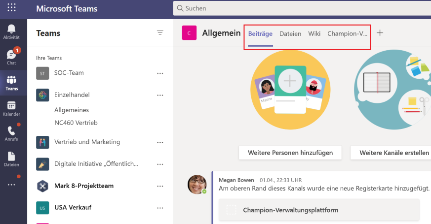

# Erstellen von Registerkarten für Microsoft Teams

Registerkarten sind Teams-fähige Webseiten, die in Microsoft Teams eingebettet sind. Es handelt sich um einfache HTML-<\> iframe-Tags, die auf Domänen verweisen, die im App-Manifest deklariert sind und als Teil eines Kanals innerhalb eines Teams, eines Gruppenchats oder einer persönlichen App für einen einzelnen Benutzer hinzugefügt werden können. Sie können benutzerdefinierte Registerkarten in Ihre App einschließen, um Ihre eigenen Webinhalte in Teams einzubetten, oder Teams-spezifische Funktionen zu Ihren Webinhalten hinzufügen. Weitere Informationen finden Sie unter [Teams JavaScript-Client-SDK.](/javascript/api/overview/msteams-client)

> [!IMPORTANT]
> Derzeit sind benutzerdefinierte Registerkarten in Government Community Cloud (GCC), GCC-High und DoD (Department of Defense) verfügbar.

Die folgende Abbildung zeigt persönliche Registerkarten:

Die folgende Abbildung zeigt Contoso-Kanalregisterkarten:

Es gibt einige Voraussetzungen, die Sie vor dem Arbeiten mit Registerkarten durchgehen müssen.

Es gibt zwei Arten von Registerkarten in Teams, persönlich und Kanal oder Gruppe. [Persönliche Registerkarten](~/tabs/how-to/create-personal-tab.md)sind zusammen mit persönlichen Bots Teil persönlicher Apps und sind auf einen einzelnen Benutzer beschränkt. Sie können für einen einfachen Zugriff an die linke Navigationsleiste angeheftet werden. [Kanal- oder Gruppenregisterkarten](~/tabs/how-to/create-channel-group-tab.md) liefern Inhalte an Kanäle und Gruppenchats und sind eine großartige Möglichkeit, um Bereiche für die Zusammenarbeit um dedizierte webbasierte Inhalte zu erstellen.

Sie können [eine Inhaltsseite](~/tabs/how-to/create-tab-pages/content-page.md) als Teil einer persönlichen Registerkarte, eines Kanals, einer Gruppenregisterkarte oder eines Aufgabenmoduls erstellen. Sie können [eine Konfigurationsseite erstellen,](~/tabs/how-to/create-tab-pages/configuration-page.md) auf der Benutzer Microsoft Teams App konfigurieren und sie verwenden können, um eine Kanal- oder Gruppenchatregisterkarte, eine Messaging-Erweiterung oder einen Office 365 Connector zu konfigurieren. Sie können Benutzern gestatten, ihre Registerkarte nach der Installation neu zu konfigurieren und eine Seite zum Entfernen von Registerkarten für Ihre Anwendung [zu erstellen.](~/tabs/how-to/create-tab-pages/removal-page.md) Wenn Sie eine Teams-App erstellen, die eine Registerkarte enthält, müssen Sie testen, wie Ihre [Registerkarte auf android- und iOS-Teams-Clients funktioniert.](~/tabs/design/tabs-mobile.md) Ihre Registerkarte muss Kontext über grundlegende Informationen, Gebietsschema- und Designinformationen [abrufen](~/tabs/how-to/access-teams-context.md) und `entityId` oder `subEntityId` identifizieren, was sich auf der Registerkarte befindet.

Sie können Registerkarten mit adaptiven Karten erstellen und alle Teams App-Funktionen zentralisieren, indem Sie kein anderes Back-End für Ihre Bots und Registerkarten benötigen. [Die Phasenansicht](~/tabs/tabs-link-unfurling.md) ist eine neue Ui-Komponente, mit der Sie den Inhalt rendern können, der im Vollbildmodus in Teams geöffnet und als Registerkarte angeheftet ist. Der vorhandene [Link-Verbreitungsdienst](~/tabs/tabs-link-unfurling.md) wird aktualisiert, sodass er verwendet wird, um URLs mithilfe einer adaptiven Karte und Chatdiensten in eine Registerkarte umzuwandeln. Sie können Unterhaltungsregisterkarten mithilfe von [Unterhaltungsunterentitäten erstellen,](~/tabs/how-to/conversational-tabs.md) mit denen Benutzer Unterhaltungen über Unterentitäten auf Ihrer Registerkarte führen können, z. B. bestimmte Aufgaben, Patienten und Verkaufschancen, anstatt die gesamte Registerkarte zu besprechen. Sie können Änderungen an [Registerkartenrändern](~/resources/removing-tab-margins.md) vornehmen, um die Erfahrung des Entwicklers beim Erstellen von Apps zu verbessern. Sie können die Registerkarte ziehen und an der gewünschten Position platzieren, um die Registerkartenpositionen in Ihren persönlichen Apps und Kanal- oder Gruppenchats auszutauschen. 

> [!NOTE]
> **Beiträge** und **Dateien** können nicht von ihren Positionen verschoben werden.

## Registerkartenfeatures

Die Registerkartenfeatures sind wie folgt:

* Wenn eine Registerkarte zu einer App hinzugefügt wird, die auch über einen Bot verfügt, wird der Bot auch dem Team hinzugefügt.
* Bewusstsein für Azure Active Directory (AAD)-ID des aktuellen Benutzers.
* Gebietsschemabewusstsein für den Benutzer, um die Sprache anzugeben, die `en-us` lautet.
* SSO-Funktion (Single Sign-On), falls unterstützt.
* Möglichkeit, Bots oder App-Benachrichtigungen für deep-Links zur Registerkarte oder zu einer Unterentität innerhalb des Diensts zu verwenden, z. B. eine einzelne Arbeitsaufgabe.
* Die Möglichkeit, ein Aufgabenmodul über Links auf einer Registerkarte zu öffnen.
* Wiederverwendung von SharePoint-Webparts auf der Registerkarte.

## Registerkartenbenutzerszenarien

**Szenario:** Bringen Sie eine vorhandene webbasierte Ressource in Teams. \
**Beispiel:** Sie erstellen eine persönliche Registerkarte in Ihrer Teams-App, die benutzern eine informationsbezogene Unternehmenswebsite anzeigt.

**Szenario:** Hinzufügen von Supportseiten zu einem Teams Bot oder einer Messaging-Erweiterung. \
**Beispiel:** Sie erstellen persönliche Registerkarten, die Benutzern Webseiteninhalte **bereitstellen** und **ihnen helfen.**

**Szenario:** Bieten Sie Zugriff auf Elemente, mit denen Ihre Benutzer regelmäßig für einen dialogbasierten Dialog und die Zusammenarbeit interagieren. \
**Beispiel:** Sie erstellen eine Kanal- oder Gruppenregisterkarte mit deep-Links zu einzelnen Elementen.

## Grundlegendes zur Funktionsweise von Registerkarten

Sie können eine der folgenden Methoden zum Erstellen von Registerkarten verwenden:

* [Deklarieren einer benutzerdefinierten Registerkarte im App-Manifest](#declare-custom-tab-in-app-manifest)
* [Verwenden einer adaptiven Karte zum Erstellen von Registerkarten](~/tabs/how-to/build-adaptive-card-tabs.md)

### Deklarieren einer benutzerdefinierten Registerkarte im App-Manifest

Eine benutzerdefinierte Registerkarte wird im App-Manifest Ihres App-Pakets deklariert. Für jede Webseite, die Sie als Registerkarte in Ihre App einfügen möchten, definieren Sie eine URL und einen Bereich. Darüber hinaus können Sie der Seite das [Teams JavaScript-Client-SDK](/javascript/api/overview/msteams-client) hinzufügen und nach dem `microsoftTeams.initialize()` Laden der Seite aufrufen. Teams zeigt Ihre Seite an und bietet Zugriff auf Teams-spezifische Informationen, z. B. die Teams Client das dunkle Design ausführt.

Unabhängig davon, ob Sie Ihre Registerkarte innerhalb des Kanals, der Gruppe oder des persönlichen Bereichs verfügbar machen möchten, müssen Sie auf Ihrer Registerkarte eine <\> iframe-HTML-Inhaltsseite anzeigen.  Bei persönlichen Registerkarten wird die Inhalts-URL direkt in Ihrem Teams App-Manifest durch die `contentUrl` Eigenschaft im `staticTabs` Array festgelegt. Der Inhalt Ihrer Registerkarte ist für alle Benutzer identisch.

Für Kanal- oder Gruppenregisterkarten können Sie auch eine zusätzliche Konfigurationsseite erstellen. Auf dieser Seite können Sie die URL der Inhaltsseite konfigurieren, in der Regel mithilfe von URL-Abfragezeichenfolgenparametern, um den entsprechenden Inhalt für diesen Kontext zu laden. Dies liegt daran, dass Ihre Kanal- oder Gruppenregisterkarte mehreren Teams oder Gruppenchats hinzugefügt werden kann. Bei jeder nachfolgenden Installation können Ihre Benutzer die Registerkarte konfigurieren, sodass Sie die Benutzeroberfläche nach Bedarf anpassen können. Wenn Benutzer eine Registerkarte hinzufügen oder konfigurieren, wird der Registerkarte, die auf der Teams Benutzeroberfläche angezeigt wird, eine URL zugeordnet. Durch das Konfigurieren einer Registerkarte werden dieser URL einfach zusätzliche Parameter hinzugefügt. Wenn Sie beispielsweise die Registerkarte Azure Boards hinzufügen, können Sie auf der Konfigurationsseite auswählen, welches Board die Registerkarte lädt. Die URL der Konfigurationsseite wird durch die  `configurationUrl` Eigenschaft im Array in Ihrem `configurableTabs` App-Manifest angegeben.

Sie können über mehrere Kanäle oder Gruppenregisterkarten und bis zu 16 persönliche Registerkarten pro App verfügen.

### Tools, die Sie zum Erstellen von Registerkarten verwenden können
* [Microsoft Teams-Toolkit-Erweiterung für Visual Studio Code](../toolkit/visual-studio-code-overview.md)
* [Microsoft Teams-Toolkit-Erweiterung für Visual Studio](../toolkit/visual-studio-overview.md)

## Nächster Schritt

> [!div class="nextstepaction"]
> [Voraussetzungen](~/tabs/how-to/tab-requirements.md)

## Siehe auch

* [Geräteberechtigungen anfordern](../concepts/device-capabilities/native-device-permissions.md)
* [Integrieren von Medienfunktionen](../concepts/device-capabilities/mobile-camera-image-permissions.md)
* [Integrieren eines QR- oder Strichcodescanners](../concepts/device-capabilities/qr-barcode-scanner-capability.md)
* [Integration von Standortfunktionen](../concepts/device-capabilities/location-capability.md)
* [Registerkarten auf mobilen Geräten](design/tabs-mobile.md#tabs-on-mobile)
