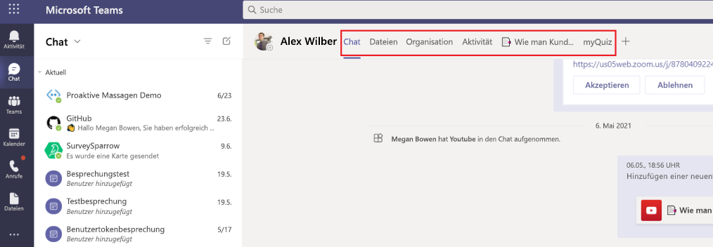

# Registerkarten für Microsoft TeamsMicrosoft Teams tabs

Registerkarten sind Teams-fähige Webseiten, die in Microsoft Teams eingebettet sind.Tabs are Teams-aware webpages embedded in Microsoft Teams. Dabei handelt es sich um einfache HTML-<\> iframe-Tags, die auf Domänen verweisen, die im App-Manifest deklariert sind und als Teil eines Kanals innerhalb eines Teams, eines Gruppenchats oder einer persönlichen App für einen einzelnen Benutzer hinzugefügt werden können.They are simple HTML <iframe\> tags that point to domains declared in the app manifest and can be added as part of a channel inside a team, group chat, or personal app for an individual user. Sie können benutzerdefinierte Registerkarten in Ihre App einschließen, um Ihre eigenen Webinhalte in Teams einzubetten, oder Teams-spezifische Funktionen zu Ihren Webinhalten hinzufügen.You can include custom tabs with your app to embed your own web content in Teams or add Teams-specific functionality to your web content. Weitere Informationen finden Sie unter [Teams JavaScript-Client-SDK.](/javascript/api/overview/msteams-client)For more information, see [Teams JavaScript client SDK](/javascript/api/overview/msteams-client).

Die folgende Abbildung zeigt persönliche Registerkarten:The following image shows personal tabs:

Die folgende Abbildung zeigt Contoso-Kanalregisterkarten:The following image shows Contoso channel tabs:

> [!VIDEO https://www.youtube-nocookie.com/embed/Jw6i7Mkt0dg]

> [!VIDEO https://www.youtube-nocookie.com/embed/T2a8yJC3VcQ]

Es gibt einige Voraussetzungen, die Sie vor dem Arbeiten mit Registerkarten durchgehen müssen.There are few prerequisites that you must go through before working on tabs.

Es gibt zwei Arten von Registerkarten in Teams, persönlich und Kanal oder Gruppe.There are two types of tabs available in Teams, personal and channel or group. [Persönliche Registerkarten](~/tabs/how-to/create-personal-tab.md)sind zusammen mit persönlichen Bots Teil persönlicher Apps und sind auf einen einzelnen Benutzer beschränkt.[Personal tabs](~/tabs/how-to/create-personal-tab.md), along with personally-scoped bots, are part of personal apps and are scoped to a single user. Sie können für einen einfachen Zugriff an die linke Navigationsleiste angeheftet werden.They can be pinned to the left navigation bar for easy access. [Kanal- oder Gruppenregisterkarten](~/tabs/how-to/create-channel-group-tab.md) liefern Inhalte an Kanäle und Gruppenchats und sind eine großartige Möglichkeit zum Erstellen von Bereichen für die Zusammenarbeit um dedizierte webbasierte Inhalte herum.[Channel or group tabs](~/tabs/how-to/create-channel-group-tab.md) deliver content to channels and group chats, and are a great way to create collaborative spaces around dedicated web-based content.

Sie können [eine Inhaltsseite](~/tabs/how-to/create-tab-pages/content-page.md) als Teil einer persönlichen Registerkarte, eines Kanals, einer Gruppenregisterkarte oder eines Aufgabenmoduls erstellen.You can [create a content page](~/tabs/how-to/create-tab-pages/content-page.md) as part of a personal tab, channel or group tab, or task module. Sie können [eine Konfigurationsseite erstellen,](~/tabs/how-to/create-tab-pages/configuration-page.md) auf der Benutzer Microsoft Teams App konfigurieren und sie verwenden können, um eine Kanal- oder Gruppenchatregisterkarte, eine Messaging-Erweiterung oder einen Office 365 Connector zu konfigurieren.You can [create a configuration page](~/tabs/how-to/create-tab-pages/configuration-page.md) that enables users to configure Microsoft Teams app and use it to configure a channel or group chat tab, a messaging extension, or an Office 365 Connector. Sie können Benutzern gestatten, ihre Registerkarte nach der Installation neu zu konfigurieren und eine Seite zum Entfernen von Registerkarten für Ihre Anwendung [zu erstellen.](~/tabs/how-to/create-tab-pages/removal-page.md)You can permit users to reconfigure your tab after installation and [create a tab removal page](~/tabs/how-to/create-tab-pages/removal-page.md) for your application. Wenn Sie eine Teams-App erstellen, die eine Registerkarte enthält, müssen Sie testen, wie Ihre [Registerkarte auf android- und iOS-Teams-Clients funktioniert.](~/tabs/design/tabs-mobile.md)When you build a Teams app that includes a tab, you must test how your [tab functions on both the Android and iOS Teams clients](~/tabs/design/tabs-mobile.md). Ihre Registerkarte muss Kontext über grundlegende Informationen, Gebietsschema- und Designinformationen [abrufen](~/tabs/how-to/access-teams-context.md) und `entityId` oder `subEntityId` identifizieren, was sich auf der Registerkarte befindet.Your tab must [get context](~/tabs/how-to/access-teams-context.md) through basic information, locale and theme information, and `entityId` or `subEntityId` that identifies what is in the tab.

Sie können Registerkarten mit adaptiven Karten erstellen und alle Teams App-Funktionen zentralisieren, indem Sie kein anderes Back-End für Ihre Bots und Registerkarten benötigen.You can build tabs with Adaptive Cards and centralize all Teams app capabilities by eliminating the need for a different backend for your bots and tabs. [Die Phasenansicht](~/tabs/tabs-link-unfurling.md) ist eine neue Ui-Komponente, mit der Sie den Inhalt rendern können, der im Vollbildmodus in Teams geöffnet und als Registerkarte angeheftet ist. Der vorhandene [Link-Verbreitungsdienst](~/tabs/tabs-link-unfurling.md) wird so aktualisiert, dass er verwendet wird, um URLs mithilfe einer adaptiven Karte und Chatdiensten in eine Registerkarte umzuwandeln.[Stage View](~/tabs/tabs-link-unfurling.md) is a new UI component that allows you to render the content opened in full screen in Teams and pinned as a tab. The existing [link unfurling](~/tabs/tabs-link-unfurling.md) service is updated so that it is used to turn URLs into a tab using an Adaptive Card and Chat Services. Sie können Unterhaltungsregisterkarten mithilfe von [Unterhaltungsunterentitäten erstellen,](~/tabs/how-to/conversational-tabs.md) mit denen Benutzer Unterhaltungen über Unterentitäten auf Ihrer Registerkarte führen können, z. B. bestimmte Aufgaben, Patienten und Verkaufschancen, anstatt die gesamte Registerkarte zu besprechen. Sie können Änderungen an [Registerkartenrändern](~/resources/removing-tab-margins.md) vornehmen, um die Erfahrung des Entwicklers beim Erstellen von Apps zu verbessern.You can [create conversational tabs](~/tabs/how-to/conversational-tabs.md) using conversational sub-entities that allow users to have conversations about sub-entities in your tab, such as specific task, patient, and sales opportunity, instead of discussing the entire tab. You can make changes to [tab margins](~/resources/removing-tab-margins.md) to enhance the developer's experience when building apps.

## RegisterkartenfeaturesTab features

Die Registerkartenfeatures sind wie folgt:The tab features are as follows:

* Wenn eine Registerkarte zu einer App hinzugefügt wird, die auch über einen Bot verfügt, wird der Bot auch dem Team hinzugefügt.If a tab is added to an app that also has a bot, the bot is also added to the team.
* Bewusstsein für Azure Active Directory (AAD)-ID des aktuellen Benutzers.Awareness of Azure Active Directory (AAD) ID of the current user.
* Gebietsschemabewusstsein für den Benutzer, um die Sprache anzugeben, die `en-us` lautet.Locale awareness for the user to indicate language that is `en-us`.
* SSO-Funktion (Single Sign-On), falls unterstützt.Single sign-on (SSO) capability, if supported.
* Möglichkeit, Bots oder App-Benachrichtigungen für deep-Links zur Registerkarte oder zu einer Unterentität innerhalb des Diensts zu verwenden, z. B. eine einzelne Arbeitsaufgabe.Ability to use bots or app notifications to deep link to the tab or to a sub-entity within the service, for example an individual work item.
* Die Möglichkeit, ein Aufgabenmodul über Links auf einer Registerkarte zu öffnen.The ability to open a task module from links within a tab.
* Wiederverwendung von SharePoint-Webparts auf der Registerkarte.Reuse of SharePoint web parts within the tab.

## RegisterkartenbenutzerszenarienTabs user scenarios

**Szenario:** Bringen Sie eine vorhandene webbasierte Ressource in Teams.**Scenario:** Bring an existing web-based resource inside Teams. \
**Beispiel:** Sie erstellen eine persönliche Registerkarte in Ihrer Teams-App, die Benutzern eine informationsbezogene Unternehmenswebsite anzeigt.**Example:** You create a personal tab in your Teams app that presents an informational corporate website to users.

**Szenario:** Fügen Sie einem Teams Bot oder einer Messaging-Erweiterung Supportseiten hinzu.**Scenario:** Add support pages to a Teams bot or messaging extension. \
**Beispiel:** Sie erstellen persönliche Registerkarten, die Benutzern Webseiteninhalte **bereitstellen** und **ihnen helfen.****Example:** You create personal tabs that provide **about** and **help** webpage content to users.

**Szenario:** Ermöglichen Sie den Zugriff auf Elemente, mit denen Ihre Benutzer regelmäßig für einen dialogbasierten Dialog und die Zusammenarbeit interagieren.**Scenario:** Provide access to items that your users interact with regularly for cooperative dialogue and collaboration. \
**Beispiel:** Sie erstellen eine Kanal- oder Gruppenregisterkarte mit deep-Links zu einzelnen Elementen.**Example:** You create a channel or group tab with deep linking to individual items.

## Grundlegendes zur Funktionsweise von RegisterkartenUnderstand how tabs work

Sie können eine der folgenden Methoden zum Erstellen von Registerkarten verwenden:You can use one of the following methods to create tabs:

* [Deklarieren einer benutzerdefinierten Registerkarte im App-ManifestDeclare custom tab in app manifest](#declare-custom-tab-in-app-manifest)
* [Verwenden einer adaptiven Karte zum Erstellen von RegisterkartenUse Adaptive Card to build tabs](~/tabs/how-to/build-adaptive-card-tabs.md)

### Deklarieren einer benutzerdefinierten Registerkarte im App-ManifestDeclare custom tab in app manifest

Eine benutzerdefinierte Registerkarte wird im App-Manifest Ihres App-Pakets deklariert.A custom tab is declared in the app manifest of your app package. Für jede Webseite, die Sie als Registerkarte in Ihre App einfügen möchten, definieren Sie eine URL und einen Bereich.For each webpage you want included as a tab in your app, you define a URL and a scope. Darüber hinaus können Sie das [Teams JavaScript-Client-SDK](/javascript/api/overview/msteams-client) zu Ihrer Seite hinzufügen und nach dem `microsoftTeams.initialize()` Laden der Seite aufrufen.Additionally, you can add the [Teams JavaScript client SDK](/javascript/api/overview/msteams-client) to your page, and call `microsoftTeams.initialize()` after your page loads. Teams zeigt Ihre Seite an und bietet Zugriff auf Teams-spezifische Informationen, z. B. der Teams Client das dunkle Design ausführt.Teams displays your page and provides access to Teams-specific information, for example the Teams client is running the dark theme.

Unabhängig davon, ob Sie Ihre Registerkarte innerhalb des Kanals oder der Gruppe oder im persönlichen Bereich verfügbar machen möchten, müssen Sie eine <\> iframe-HTML-Inhaltsseite auf Ihrer Registerkarte anzeigen.  Bei persönlichen Registerkarten wird die Inhalts-URL direkt in Ihrem Teams App-Manifest durch die `contentUrl` Eigenschaft im `staticTabs` Array festgelegt.Whether you choose to expose your tab within the channel or group, or personal scope, you must present an <iframe\> HTML [content page](~/tabs/how-to/create-tab-pages/content-page.md) in your tab. For personal tabs, the content URL is set directly in your Teams app manifest by the `contentUrl` property in the `staticTabs` array. Der Inhalt Ihrer Registerkarte ist für alle Benutzer identisch.Your tab's content is the same for all users.

Für Kanal- oder Gruppenregisterkarten können Sie auch eine zusätzliche Konfigurationsseite erstellen.For channel or group tabs, you can also create an additional configuration page. Auf dieser Seite können Sie die URL der Inhaltsseite konfigurieren, in der Regel mithilfe von URL-Abfragezeichenfolgenparametern, um den entsprechenden Inhalt für diesen Kontext zu laden.This page allows you to configure content page URL, typically by using URL query string parameters to load the appropriate content for that context. Dies liegt daran, dass Ihre Kanal- oder Gruppenregisterkarte mehreren Teams oder Gruppenchats hinzugefügt werden kann.This is because your channel or group tab can be added to multiple teams or group chats. Bei jeder nachfolgenden Installation können Ihre Benutzer die Registerkarte konfigurieren, sodass Sie die Benutzeroberfläche nach Bedarf anpassen können.On each subsequent install, your users can configure the tab, allowing you to tailor the experience as required. Wenn Benutzer eine Registerkarte hinzufügen oder konfigurieren, wird der Registerkarte, die auf der Teams Benutzeroberfläche angezeigt wird, eine URL zugeordnet.When users add or configure a tab, a URL is associated with the tab that is presented in the Teams user interface (UI). Durch das Konfigurieren einer Registerkarte werden dieser URL einfach zusätzliche Parameter hinzugefügt.Configuring a tab simply adds additional parameters to that URL. Wenn Sie beispielsweise die Registerkarte Azure Boards hinzufügen, können Sie auf der Konfigurationsseite auswählen, welches Board die Registerkarte lädt.For example, when you add the Azure Boards tab, the configuration page allows you to choose, which board the tab loads. Die URL der Konfigurationsseite wird durch die  `configurationUrl` Eigenschaft im Array in Ihrem `configurableTabs` App-Manifest angegeben.The configuration page URL is specified by the  `configurationUrl` property in the `configurableTabs` array in your app manifest.

Sie können über mehrere Kanäle oder Gruppenregisterkarten und bis zu 16 persönliche Registerkarten pro App verfügen.You can have multiple channels or group tabs, and up to 16 personal tabs per app.

## Siehe auchSee also

* [Geräteberechtigungen anfordernRequest device permissions](../concepts/device-capabilities/native-device-permissions.md)
* [Integrieren von MedienfunktionenIntegrate media capabilities](../concepts/device-capabilities/mobile-camera-image-permissions.md)
* [Integrieren eines QR- oder StrichcodescannersIntegrate a QR or barcode scanner](../concepts/device-capabilities/qr-barcode-scanner-capability.md)
* [Integration von StandortfunktionenIntegrate location capabilities](../concepts/device-capabilities/location-capability.md)

## Nächster SchrittNext step

> [!div class="nextstepaction"]
> [VoraussetzungenPrerequisites](~/tabs/how-to/tab-requirements.md)
