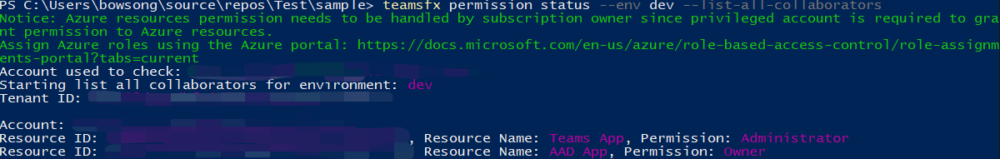

# <a name="teamsfx-command-line-interface"></a>TeamsFx-Befehlszeilenschnittstelle

TeamsFx CLI ist eine textbasierte Befehlszeilenschnittstelle, die Teams Anwendungsentwicklung beschleunigt. Ziel ist es, beim Erstellen von Teams Anwendungen tastaturorientierte Benutzerfreundlichkeit bereitzustellen. Es ermöglicht auch CI/CD-Szenario, in dem CLI einfach in Skripts für die Automatisierung integriert werden kann.

* [Quellcode](https://github.com/OfficeDev/TeamsFx/tree/dev/packages/cli) 
* [Paket (NPM)](https://www.npmjs.com/package/@microsoft/teamsfx-cli)

## <a name="get-started"></a>Erste Schritte

Beginnen wir mit der Installation `teamsfx-cli` `npm` und `teamsfx -h` Ausführung, um alle verfügbaren Befehle zu überprüfen:

```bash
  npm install -g @microsoft/teamsfx-cli
  teamsfx -h
```

## <a name="supported-commands"></a>Unterstützte Befehle

| `teamsfx` Befehle  | Beschreibungen |
|:----------------  |:-------------|
| `teamsfx new`       | Erstellen Sie eine neue Teams Anwendung. |
| `teamsfx account`   | Verwalten von Clouddienstkonten. Die unterstützten Clouddienste sind "Azure" und "Microsoft 365".          |
| `teamsfx env`       | Verwalten Sie die Umgebungen. |
| `teamsfx capability`| Fügen Sie der aktuellen Anwendung neue Funktionen hinzu.         |
| `teamsfx resource`  | Verwalten Sie die Ressourcen in der aktuellen Anwendung.         |
| `teamsfx provision` | Bereitstellen der Cloudressourcen in der aktuellen Anwendung.             |
| `teamsfx deploy`    | Stellen Sie die aktuelle Anwendung bereit.  |
| `teamsfx package`   | Erstellen Sie Ihre Teams-App in ein Paket für die Veröffentlichung.         |
| `teamsfx validate`  | Überprüfen Sie die aktuelle Anwendung.             |
| `teamsfx publish`   | Veröffentlichen Sie die App in Teams.             |
| `teamsfx preview`   | Anzeigen einer Vorschau der aktuellen Anwendung. |
| `teamsfx config`    | Verwalten Sie die Konfigurationsdaten. |
| `teamsfx permission`| Arbeiten Sie mit anderen Entwicklern in demselben Projekt zusammen.|

## `teamsfx new`

`teamsfx new`wechselt standardmäßig in den interaktiven Modus und führt Sie durch den Prozess der Erstellung einer neuen Teams-Anwendung, indem Sie einige Fragen stellen. Sie können dies auch im nicht interaktiven Modus tun, indem Sie `--interactive` das Flag auf `false` .

| `teamsFx new` Befehle  | Beschreibungen |
|:----------------  |:-------------|
| `teamsfx new template <template-name>`     | Erstellen einer App aus einer vorhandenen Vorlage |
| `teamsfx new template list`     | Auflisten aller verfügbaren Vorlagen |

### <a name="parameters-for-teamsfx-new"></a>Parameter für `teamsfx new`

| Parameter  | Erforderlich | Beschreibungen |
|:----------------  |:-------------|:-------------|
|`--app-name` | Ja| Name der Teams Anwendung.|
|`--interactive`| Nein | Wählen Sie die Optionen interaktiv aus. Optionen sind `true` und `false` . Der Standardwert ist `true`.|
|`--capabilities`| Nein| Wählen Sie Teams Anwendungsfunktionen, mehrere Optionen sind: `tab` `bot` , und `messaging-extension` `tab-spfx` . Der Standardwert lautet: `tab` .|
|`--programming-language`| Nein| Programmiersprache für das Projekt. Optionen sind `javascrip` oder `typescript` der Standardwert lautet: `javascript` .|
|`--folder`| Nein | Project Verzeichnis. Unter diesem Verzeichnis wird ein Unterordner mit dem Namen Ihrer App erstellt. Der Standardwert lautet: `./` .|
|`--spfx-framework-type`| Nein| Gilt, wenn `Tab(SPfx)` die Funktion ausgewählt ist. Frontend Framework. Optionen sind `none` und `react` der Standardwert ist: `none` .|
|`--spfx-web part-name`| Nein | Gilt, wenn `Tab(SPfx)` die Funktion ausgewählt ist. Webpartname. Der Standardwert lautet: "helloworld". |
|`--spfx-web part-desp`| Nein | Gilt, wenn `Tab(SPfx)` die Funktion ausgewählt ist. Webpartbeschreibung. Der Standardwert lautet: "helloworld description". |
|`--azure-resources`| Nein| Gilt, wenn er `tab` die Funktion enthält. Fügen Sie Ihrem Projekt Azure-Ressourcen hinzu. Optionen(mehrere) sind `sql` (Azure SQL-Datenbank) und `function` (Azure-Funktionen). |

### <a name="scenarios-for-teamsfx-new"></a>Szenarien für `teamsfx new`

Die Verwendung des interaktiven Modus zum Erstellen einer Teams App ist super intuitiv. Versuchen Sie es, indem Sie mit `teamsfx new` . Nachfolgend sind die wenigen Szenen zum Steuern aller Parameter aufgeführt:

#### <a name="a-tab-app-hosted-on-spfx-using-react"></a>Eine Registerkarten-App, die auf SPFx mit React gehostet wird

```bash
teamsfx new --interactive false --app-name newspfxapp --capabilities tab-spfx --spfx-framework-type react
```

#### <a name="a-teams-app-in-javascript-contains-tab-bot-capabilities-and-azure-functions"></a>Eine Teams-App in JavaScript enthält Registerkarten-, Bot-Funktionen und Azure-Funktionen.

```bash
teamsfx new --interactive false --app-name newtabbotapp --capabilities tab bot --programming-language javascript --azure-resources function
```

#### <a name="a-teams-tab-app-with-azure-functions-and-azure-sql"></a>Eine Teams-Registerkarten-App mit Azure-Funktionen und Azure SQL

```bash
teamsfx new --interactive false app-name newapp --azure-resources sql function --programming-language typescript
```

## `teamsfx account`

Verwalten von Clouddienstkonten. Die unterstützten Clouddienste sind `Azure` und `Microsoft 365` .

| `teamsFx account` Befehle  | Beschreibungen |
|:----------------  |:-------------|
| `teamsfx account login <service>`      | Melden Sie sich beim ausgewählten Clouddienst an. |
| `teamsfx account logout <service>`      | Melden Sie sich vom ausgewählten Clouddienst ab. |
| `teamsfx account set --subscription`      | Aktualisieren Sie die Kontoeinstellungen, um eine Abonnement-ID festzulegen. |

## `teamsfx env`

Verwalten Sie die Umgebungen.

| `teamsfx env` Befehle  | Beschreibungen |
|:----------------  |:-------------|
| `teamsfx env add <new_env_name> --env <existing_env_name>` | Fügen Sie eine neue Umgebung durch Kopieren aus der angegebenen Umgebung hinzu. |
| `teamsfx env list` | Listet alle Umgebungen auf. |

### <a name="scenarios-for-teamsfx-env"></a>Szenarien für `teamsfx env`

#### <a name="create-a-new-environment"></a>Erstellen einer neuen Umgebung

Fügen Sie eine neue Umgebung durch Kopieren aus der vorhandenen Entwicklungsumgebung hinzu:

```bash
teamsfx env add staging --env dev
```

## `teamsfx capability`

Fügen Sie der aktuellen Anwendung neue Funktionen hinzu.

| `teamsFx capability` Befehle  | Beschreibungen |
|:----------------  |:-------------|
| `teamsfx capability add tab`      | Fügen Sie eine Registerkarte hinzu. |
| `teamsfx capability add bot`      | Fügen Sie einen Bot hinzu. |
| `teamsfx capability add messaging-extension`      | Fügen Sie eine Messaging-Erweiterung hinzu. |

> [!NOTE]
> Sobald Ihr Projekt einen Bot enthält, kann die Messaging-Erweiterung nicht mehr hinzugefügt werden, und sie gilt umgekehrt. Sie können bot- und messaging-Erweiterungen in Ihr Projekt einschließen, wenn Sie ein neues Teams App-Projekt erstellen.

## `teamsfx resource`

Verwalten Sie die Ressourcen in der aktuellen Anwendung. Unterstützt `<resource-type>` werden: `azure-sql` und `azure-function` `azure-apim` .

| `teamsFx resource` Befehle  | Beschreibungen |
|:----------------  |:-------------|
| `teamsfx resource add <resource-type>`      | Fügen Sie der aktuellen Anwendung eine Ressource hinzu.|
| `teamsfx resource show <resource-type>`      | Zeigen Sie Konfigurationsdetails der Ressource an. |
| `teamsfx resource list`      | Listet alle Ressourcen in der aktuellen Anwendung auf. |

### <a name="parameters-for-teamsfx-resource-add-azure-function"></a>Parameter für `teamsfx resource add azure-function`

| Parameter  | Erforderlich | Beschreibungen |
|:----------------  |:-------------|:-------------|
|`--function-name`| Ja | Geben Sie einen Funktionsnamen an. Der Standardwert lautet: `getuserprofile` . |

### <a name="parameters-for-teamsfx-resource-add-azure-sql"></a>Parameter für `teamsfx resource add azure-sql`

#### `--function-name`

| Parameter  | Erforderlich | Beschreibungen |
|:----------------  |:-------------|:-------------|
|`--function-name`| Ja | Geben Sie einen Funktionsnamen an. Der Standardwert lautet: `getuserprofile` . |

> [!NOTE]
> Der Funktionsname wird überprüft, da von der Serverarbeitsauslastung aus auf SQL zugegriffen werden muss. Wenn Ihr Projekt nicht enthalten `Azure Functions` ist, wird es für Sie erstellt.

### <a name="parameters-for-teamsfx-resource-add-azure-apim"></a>Parameter für `teamsfx resource add azure-apim`

> [!TIP]
> Die folgenden Optionen werden wirksam, wenn Sie versuchen, eine vorhandene Instanz zu `APIM` verwenden. Standardmäßig müssen Sie keine Optionen angeben, und es wird während des Schritts eine neue Instanz `teamsfx provision` erstellt.

| Parameter  | Erforderlich | Beschreibungen |
|:----------------  |:-------------|:-------------|
|`--subscription`| Ja | Auswählen eines Azure-Abonnements|
|`--apim-resource-group`| Ja| Der Name der Ressourcengruppe. |
|`--apim-service-name`| Ja | Der Name der API-Verwaltungsdienstinstanz. |
|`--function-name`| Ja | Geben Sie einen Funktionsnamen an. Der Standardwert lautet: `getuserprofile` . |

> [!NOTE]
> Wir fragen nach dem Funktionsnamen, da `Azure API Management` er mit arbeiten `Azure Functions` muss. Wenn Ihr Projekt nicht enthalten ist, `Azure Functions` erstellen wir eine für Sie.

## `teamsfx provision`

Bereitstellen der Cloudressourcen in der aktuellen Anwendung.

### <a name="parameters-for-teamsfx-provision"></a>Parameter für `teamsfx provision`

| Parameter  | Erforderlich | Beschreibungen |
|:----------------  |:-------------|:-------------|
|`--env`| Ja| Wählen Sie eine Umgebung für das Projekt aus. |
|`--subscription`| Nein | Geben Sie eine Azure-Abonnement-ID an. |
|`--resource-group`| Nein | Legen Sie den Namen einer vorhandenen Ressourcengruppe fest. |
|`--sql-admin-name`| Nein | Gilt, wenn SQL Ressource im Projekt vorhanden ist. Administratorname der SQL.|
|`--sql-password`| Nein| Gilt, wenn SQL Ressource im Projekt vorhanden ist. Administratorkennwort von SQL.|

## `teamsfx deploy`

Dieser Befehl wird verwendet, um die aktuelle Anwendung bereitzustellen. Standardmäßig wird das gesamte Projekt bereitgestellt, aber es ist auch möglich, die Bereitstellung teilweise durchzuführen. Optionen(mehrere) sind: `frontend-hosting` , , , , `function` `apim` `teamsbot` `spfx` .

### <a name="parameters-for-teamsfx-deploy"></a>Parameter für `teamsfx deploy`

| Parameter  | Erforderlich | Beschreibungen |
|:----------------  |:-------------|:-------------|
|`--env`| Ja| Wählen Sie eine vorhandene Umgebung für das Projekt aus. |
|`--open-api-document`| Nein | Gilt, wenn sich eine APIM-Ressource im Projekt befindet. Der Pfad der Open API-Dokumentdatei. |
|`--api-prefix`| Nein | Gilt, wenn sich eine APIM-Ressource im Projekt befindet. Das API-Namenspräfix. Der eindeutige Standardname der API lautet `{api-prefix}-{resource-suffix}-{api-version}` . |
|`--api-version`| Nein | Gilt, wenn sich eine APIM-Ressource im Projekt befindet. Die API-Version. |

## `teamsfx validate`

Überprüfen der aktuellen Anwendung. Mit diesem Befehl wird die Manifestdatei Ihrer Anwendung überprüft.

### <a name="parameters-for-teamsfx-validate"></a>Parameter für `teamsfx validate`

`--env`: (Erforderlich) Wählen Sie eine vorhandene Umgebung für das Projekt aus.

## `teamsfx publish`

Veröffentlichen Sie die App in Teams.

### <a name="parameters-for-teamsfx-publish"></a>Parameter für `teamsfx publish`

`--env`: (Erforderlich) Wählen Sie eine vorhandene Umgebung für das Projekt aus.

## `teamsfx package`

Erstellen Sie Ihre Teams-App in ein Paket für die Veröffentlichung.

## `teamsfx preview`

Anzeigen einer Vorschau der aktuellen Anwendung von der lokalen oder remote aus.

### <a name="parameters-for-teamsfx-preview"></a>Parameter für `teamsfx preview`

| Parameter  | Erforderlich | Beschreibungen |
|:----------------  |:-------------|:-------------|
|`--local`| Nein | Zeigen Sie eine Lokale Vorschau der Anwendung an. `--local` ist exklusiv mit `--remote` . |
|`--remote`| Nein | Anzeigen einer Remotevorschau der Anwendung `--remote` ist exklusiv mit `--local` . |
|`--env`| Nein | Wählen Sie eine vorhandene Umgebung für das Projekt aus, wenn der Parameter `--remote` angefügt wird. |
|`--folder`| Nein | Project Stammverzeichnis. Der Standardwert ist `./`. |
|`--browser`| Nein | Der Browser zum Öffnen Teams Webclients. Optionen sind `chrome` `edge` und `default` (Standardbrowser des Systems). Der Standardwert ist `default`. |
|`--browser-arg`| Nein | Argument zum Übergeben an den Browser, erfordert --browser, kann mehrmals verwendet werden (z. B. --browser-args="--guest") |
|`--sharepoint-site`| Nein | SharePoint Website-URL, z. B. `{your-tenant-name}.sharepoint.com` (nur für SPFx Projekt-Remotevorschau). |

### <a name="scenarios-for-teamsfx-preview"></a>Szenarien für `teamsfx preview`

#### <a name="local-preview"></a>Lokale Vorschau

Abhängigkeiten:

- Node.js
- .NET SDK
- Azure Functions Core Tools

```bash
teamsfx preview --local
teamsfx preview --local --browser chrome
```

#### <a name="remote-preview"></a>Remotevorschau

```bash
teamsfx preview --remote
teamsfx preview --remote --browser edge
```

> [!Note]
> Die Protokolle der Hintergrunddienste wie React werden in `~/.fx/cli-log/local-preview/` gespeichert.

## `teamsfx config`

Verwalten Sie die Konfigurationsdaten im Benutzer- oder Projektbereich.

| `teamsfx config` Befehle  | Beschreibungen |
|:----------------  |:-------------|
| `teamsfx config get [option]` | Anzeigen des Konfigurationswerts der Option |
| `teamsfx config set <option> <value>` | Aktualisieren des Konfigurationswerts der Option |

### <a name="parameters-for-teamsfx-config"></a>Parameter für `teamsfx config`

| Parameter  | Erforderlich | Beschreibungen |
|:----------------  |:-------------|:-------------|
|`--env`| Ja | Wählen Sie eine vorhandene Umgebung für das Projekt aus. |
|`--folder`| Nein | Project Verzeichnis. Dies wird beim Abrufen/Festlegen der Projektkonfiguration verwendet. Der Standardwert lautet: `./` . |
|`--global`| Nein | Konfiguration. Wenn dies der Fall ist, ist der Bereich auf den Benutzerbereich und nicht auf den Projektbereich beschränkt. Der Standardwert lautet: `false` . Derzeit unterstützte globale Konfigurationen wie: `telemetry` , `validate-dotnet-sdk` , , `validate-func-core-tools` `validate-node` . |

### <a name="scenerios-for-teamsfx-config"></a>Scenerios für `teamsfx config`

Geheime Schlüssel in `.userdata` Dateien sind verschlüsselt und können Ihnen dabei `teamsfx config` helfen, diese Werte anzuzeigen/zu aktualisieren.

#### <a name="stop-sending-telemetry-data"></a>Beenden des Sendens von Telemetriedaten

```bash
teamsfx config set telemetry off
```

#### <a name="disable-environment-checker"></a>Deaktivieren der Umgebungsprüfung

Es gibt drei Konfigurationen zum Aktivieren/Deaktivieren Node.js, .NET SDK und Azure Functions Core Tools, und alle sind standardmäßig aktiviert. Sie können die Konfiguration auf "aus" festlegen, wenn Sie die Überprüfung der Abhängigkeiten nicht benötigen und die Abhängigkeiten selbst installieren möchten. Sehen Sie sich das [ InstallationshandbuchNode.js,](https://github.com/OfficeDev/TeamsFx/blob/dev/docs/vscode-extension/envchecker-help.md#how-to-install-nodejs) [das .NET SDK-Installationshandbuch](https://github.com/OfficeDev/TeamsFx/blob/dev/docs/vscode-extension/envchecker-help.md#how-to-install-net-sdk) und das [Installationshandbuch für die Azure Functions Core Tools](https://github.com/OfficeDev/TeamsFx/blob/dev/docs/vscode-extension/envchecker-help.md#how-to-install-azure-functions-core-tools)an.

Um z. B. die .NET SDK-Überprüfung zu deaktivieren, können Sie den folgenden Befehl verwenden.

```bash
teamsfx config set validate-dotnet-sdk off
```

Um die .NET SDK-Überprüfung zu aktivieren, können Sie den folgenden Befehl verwenden.

```bash
teamsfx config set validate-dotnet-sdk on
```

#### <a name="view-all-the-user-scope-configuration"></a>Anzeigen der gesamten Benutzerbereichskonfiguration

```bash
teamsfx config get -g
```

#### <a name="view-all-the-configuration-in-project"></a>Anzeigen der gesamten Konfiguration im Projekt

Der geheime Schlüssel wird automatisch entschlüsselt:

```bash
teamsfx config get --env dev
```

#### <a name="update-the-secret-configuration-in-project"></a>Aktualisieren der konfiguration des geheimen Schlüssels in Project

```bash
teamsfx config set fx-resource-aad-app-for-teams.clientSecret xxx --env dev
```

## `teamsfx permission`

TeamsFx CLI bietet `teamsFx permission` Befehle für das Szenario der Zusammenarbeit.

| `teamsFx permission` Befehle | Beschreibungen |
|:------------------------------|-------------|
| `teamsfx permission grant --env --email` | Erteilen sie die Berechtigung für das Microsoft 365 Konto eines Mitarbeiters für das Projekt einer angegebenen Umgebung. |
| `teamsfx permission status` | Anzeigen des Berechtigungsstatus für das Projekt |

### <a name="parameters-for-teamsfx-permission-grant"></a>Parameter für `teamsfx permission grant`

| Parameter  | Erforderlich | Beschreibungen |
|:----------------  |:-------------|:-------------|
|`--env`| Ja | Geben Sie den env-Namen an. |
|`--email`| Ja | Geben Sie die Microsoft 365 E-Mail-Adresse des Mitarbeiters an. Beachten Sie, dass sich das Konto des Mitarbeiters im selben Mandanten mit dem Ersteller befinden sollte. |

### <a name="parameters-for-teamsfx-permission-status"></a>Parameter für `teamsfx permission status`

| Parameter  | Erforderlich | Beschreibungen |
|:----------------  |:-------------|:-------------|
|`--env`| Ja | Geben Sie den env-Namen an. |
|`--list-all-collaborators` | Nein | Mit diesem Flag druckt Teams Toolkit CLI alle Mitarbeiter für dieses Projekt aus. |

### <a name="scenarios-for-teamsfx-permission"></a>Szenarien für `teamsfx permission`

Hier sind einige Beispiele für eine bessere Handhabung von Berechtigungen für `TeamsFx` Projekte.

#### <a name="grant-permission"></a>Berechtigung erteilen

Project Ersteller und Mitarbeiter können `teamsfx permission grant` den Befehl verwenden, um dem Projekt einen neuen Mitarbeiter hinzuzufügen:

```bash
teamsfx permission grant --env dev --email user-email@user-tenant.com
```

Nachdem die Berechtigung erfolgreich erteilt wurde, können Projektersteller und Projektmitarbeiter das Projekt mit dem neuen Mitarbeiter von Github teilen, und der neue Mitarbeiter hat alle Berechtigungen für Microsoft 365 Konto.

#### <a name="show-permission-status"></a>Anzeigen des Berechtigungsstatus

Project Ersteller und Mitarbeiter können den `teamsfx permission status` Befehl verwenden, um seine Microsoft 365 Kontoberechtigung für bestimmte Env anzuzeigen:

```bash
teamsfx permission status --env dev
```

#### <a name="list-all-collaborators"></a>Alle Mitarbeiter auflisten

Project Ersteller und Mitarbeiter können `teamsfx permission status` den Befehl verwenden, um alle Mitarbeiter für bestimmte Zwecke anzuzeigen:

```bash
teamsfx permission status --env dev --list-all-collaborators
```

#### <a name="e2e-collaboration-work-flow-in-cli"></a>E2E-Arbeitsablauf für die Zusammenarbeit in CLI

Als Projektersteller:

- Erstellen Sie ein neues TeamsFx-Registerkartenprojekt (Sie können auch einen Bot auswählen), und der Hostingtyp wählen Azure aus.

  ```bash
  teamsfx new --interactive false --app-name newapp --host-type azure
  ```

- Melden Sie sich Microsoft 365 Konto und Azure-Konto an.

  ```bash
  teamsfx account login azure
  teamsfx account login Microsoft 365
  ```

- Stellen Sie Ihr Projekt bereit.

  ```bash
  teamsfx provision
  ```

- Mitarbeiter anzeigen. Sie sollten sich hier sehen.

  ```bash
  teamsfx permission status --env dev --list-all-collaborators
  ```

  
- Fügen Sie ein weiteres Konto als Mitarbeiter hinzu. Beachten Sie, dass das hinzugefügte Konto unter demselben Mandanten sein muss:

  ```bash
  teamsfx permission grant --env dev --email user-email@user-tenant.com
  ```

  
- Push your project to GitHub

Als Project-Mitarbeiter:

- Klonen Sie das Projekt aus GitHub.
- Melden Sie sich Microsoft 365 Konto an. Beachten Sie, dass das Microsoft 365 Konto mit dem oben hinzugefügten identisch sein sollte:

  ```bash
  teamsfx account login Microsoft 365
  ```

- Melden Sie sich für ein Azure-Konto an, das über die Berechtigung "Mitwirkender" für alle Azure-Ressourcen verfügt.

  ```bash
  teamsfx account login azure
  ```

- Überprüfen Sie den Berechtigungsstatus. Sie sollten über die Besitzerberechtigung für das Projekt verfügen:

  ```bash
  teamsfx permission status --env dev
  ```

  
- Aktualisieren Sie den Registerkartencode, und stellen Sie das Projekt remote bereit.
- Starten Sie remote, und das Projekt sollte einwandfrei funktionieren.
